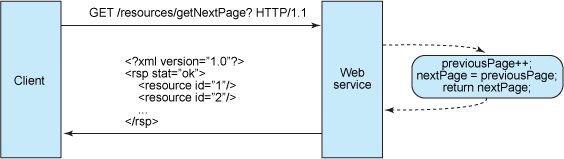
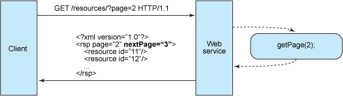

# 基于 REST 的 Web 服务：基础
了解 REST Web 服务的基本原理

**标签:** API 管理,Web 开发

[原文链接](https://developer.ibm.com/zh/articles/ws-restful/)

Alex Rodriguez

发布: 2008-12-22

* * *

## 基础

REST 定义了一组体系架构原则，您可以根据这些原则设计以系统资源为中心的 Web 服务，包括使用不同语言编写的客户端如何通过 HTTP 处理和传输资源状态。 如果考虑使用它的 Web 服务的数量，REST 近年来已经成为最主要的 Web 服务设计模型。 事实上，REST 对 Web 的影响非常大，由于其使用相当方便，已经普遍地取代了基于 SOAP 和 WSDL 的接口设计。

REST 这个概念于 2000 年由 Roy Fielding 在就读加州大学欧文分校期间在学术论文”Architectural Styles and the Design of Network-based Software Architectures”（请参见 参考资料 以获取此论文的链接）首次提出，他的论文中对使用 Web 服务作为分布式计算平台的一系列软件体系结构原则进行了分析，而其中提出的 REST 概念并没有获得现在这么多关注。 多年以后的今天，REST 的主要框架已经开始出现，但仍然在开发中，因为它已经被广泛接纳到各个平台中，例如通过 JSR-311 成为了 Java™ 6 不可或缺的部分。

本文认为，对于今天正在吸引如此多注意力的最纯粹形式的 REST Web 服务，其具体实现应该遵循四个基本设计原则：

- 显式地使用 HTTP 方法。
- 无状态。
- 公开目录结构式的 URI。
- 传输 XML、JavaScript Object Notation (JSON)，或同时传输这两者。

下面几个部分将详述这四个原则，并提供技术原理解释，说明为什么这些原则对 REST Web 服务设计人员非常重要。

## 显式地使用 HTTP 方法

基于 REST 的 Web 服务的主要特征之一是以遵循 RFC 2616 定义的协议的方式显式使用 HTTP 方法。例如，HTTP GET 被定义为数据产生方法，旨在由客户端应用程序用于检索资源以从 Web 服务器获取数据，或者执行某个查询并预期 Web 服务器将查找某一组匹配资源然后使用该资源进行响应。

REST 要求开发人员显式地使用 HTTP 方法，并且使用方式与协议定义一致。 这个基本 REST 设计原则建立了创建、读取、更新和删除（create, read, update, and delete，CRUD）操作与 HTTP 方法之间的一对一映射。 根据此映射：

- 若要在服务器上创建资源，应该使用 POST 方法。
- 若要检索某个资源，应该使用 GET 方法。
- 若要更改资源状态或对其进行更新，应该使用 PUT 方法。
- 若要删除某个资源，应该使用 DELETE 方法。

许多 Web API 中所固有的一个令人遗憾的设计缺陷在于将 HTTP 方法用于非预期用途。 例如，HTTP GET 请求中的请求 URI 通常标识一个特定的资源。 或者，请求 URI 中的查询字符串包括一组参数，这些参数定义服务器用于查找一组匹配资源的搜索条件。 至少，HTTP/1.1 RFC 是这样描述 GET 方法的。 但是在许多情况下，不优雅的 Web API 使用 HTTP GET 来触发服务器上的事务性操作——例如，向数据库添加记录。 在这些情况下，GET 请求 URI 属于不正确使用，或者至少不是以基于 REST 的方式使用。 如果 Web API 使用 GET 调用远程过程，则应该类似如下：

`GET /adduser?name=Robert HTTP/1.1`

这不是非常优雅的设计，因为上面的 Web 方法支持通过 HTTP GET 进行状态更改操作。 换句话说，该 HTTP GET 请求具有副作用。 如果处理成功，则该请求的结果是向基础数据存储区添加一个新用户——在此例中为 Robert。 这里的问题主要在语义上。 Web 服务器旨在通过检索与请求 URI 中的路径（或查询条件）匹配的资源，并在响应中返回这些资源或其表示形式，从而响应 HTTP GET 请求，而不是向数据库添加记录。 从该协议方法的预期用途的角度看，然后再从与 HTTP/1.1 兼容的 Web 服务器的角度看，以这种方式使用 GET 是不一致的。

除了语义之外，GET 的其他问题在于，为了触发数据库中的记录的删除、修改或添加，或者以某种方式更改服务器端状态，它请求 Web 缓存工具（爬网程序）和搜索引擎简单地通过对某个链接进行爬网处理，从而意外地做出服务器端更改。 克服此常见问题的简单方法是将请求 URI 上的参数名称和值转移到 XML 标记中。 这样产生的标记是要创建的实体的 XML 表示形式，可以在 HTTP POST 的正文中进行发送，此 HTTP POST 的请求 URI 是该实体的预期父实体（请参见清单 1 和 2）：

##### 清单 1\. 之前

```
GET /adduser?name=Robert HTTP/1.1

```

Show moreShow more icon

##### 清单 2\. 之后

```
POST /users HTTP/1.1
Host: myserver
Content-Type: application/xml
<?xml version="1.0"?>
<user>
<name>Robert</name>
</user>

```

Show moreShow more icon

上述方法是基于 REST 的请求的范例： 正确使用 HTTP POST 并将有效负载包括在请求的正文中。 在接收端，可以通过将正文中包含的资源添加为请求 URI 中标识的资源的从属资源，从而处理该请求；在此例下，应该将新资源添加为 `/users` 的子项。 POST 请求中指定的这种新实体与其父实体之间的包含关系类似于某个文件从属于其父目录的方式。 客户端设置实体与其父实体之间的关系，并在 POST 请求中定义新实体的 URI。

然后客户端应用程序可以使用新的 URI 获取资源的表示形式，并至少逻辑地指明该资源位于 `/users` 之下，如清单 3 所示。

##### 清单 3\. HTTP GET 请求

```
GET /users/Robert HTTP/1.1
Host: myserver
Accept: application/xml

```

Show moreShow more icon

以这种方式使用 GET 是显式的，因为 GET 仅用于数据检索。 GET 是应该没有副作用的操作，即所谓的 _等幂性_ 属性。

当支持通过 HTTP GET 执行更新操作时，也需要应用类似的 Web 方法重构，如清单 4 所示。

##### 清单 4\. 通过 HTTP GET 进行更新

```
GET /updateuser?name=Robert&newname=Bob HTTP/1.1

```

Show moreShow more icon

这更改了资源的 `name` 特性（或属性）。 虽然可以将查询字符串用于此类操作，清单 4 就是一个简单的例子，但是在用于较复杂的操作时，这种将查询字符串作为方法签名的模式往往会崩溃。 由于您的目标是显式使用 HTTP 方法，鉴于上述的相同原因（请参见清单 5），更符合 REST 的方法是发送 HTTP PUT 请求以更新资源，而不是发送 HTTP GET。

##### 清单 5\. HTTP PUT 请求

```
PUT /users/Robert HTTP/1.1
Host: myserver
Content-Type: application/xml
<?xml version="1.0"?>
<user>
<name>Bob</name>
</user>

```

Show moreShow more icon

使用 PUT 取代原始资源可以提供更清洁的接口，这样的接口与 REST 的原则以及与 HTTP 方法的定义一致。 清单 5 中的 PUT 请求是显式的，因为它通过在请求 URI 中标识要更新的资源来指向该资源，并且它在 PUT 请求的正文中将资源的新表示形式从客户端传输到服务器，而不是在请求 URI 上将资源属性作为参数名称和值的松散集合进行传输。 清单 5 还具有将资源从 `Robert` 重命名为 `Bob` 的效果，这样做会将其 URI 更改为 `/users/Bob` 。 在 REST Web 服务中，使用旧的 URI 针对该资源的后续请求会产生标准的 404 Not Found 错误。

作为一般设计原则，通过在 URI 中使用名词而不是动词，对于遵循有关显式使用 HTTP 方法的 REST 指导原则是有帮助的。 在基于 REST 的 Web 服务中，协议已经对动词（POST、GET、PUT 和 DELETE）进行了定义。 在理想的情况下，为了保持接口的通用化，并允许客户端明确它们调用的操作，Web 服务不应该定义更多的动词或远程过程，例如 `/adduser` 或 `/updateuser` 。 这条通用设计原则也适用于 HTTP 请求的正文，后者旨在用于传输资源状态，而不是用于携带要调用的远程方法或远程过程的名称。

## 无状态

REST Web 服务需要扩展以满足日益提高的性能要求。 具有负载平衡和故障转移功能、代理和网关的服务器集群通常以形成服务拓扑的方式进行组织，从而允许根据需要将请求从一个服务器路由到另一个服务器，以减少 Web 服务调用的总体响应时间。 要使用中间服务器扩大规模，REST Web 服务需要发送完整、独立的请求；也就是说，发送的请求包括所有需要满足的数据，以便中间服务器中的组件能够进行转发、路由和负载平衡，而不需要在请求之间在本地保存任何状态。

完整、独立的请求不要求服务器在处理请求时检索任何类型的应用程序上下文或状态。 REST Web 服务应用程序（或客户端）在 HTTP Header 和请求正文中包括服务器端组件生成响应所需要的所有参数、上下文和数据。 这种意义上的无状态可以改进 Web 服务性能，并简化服务器端组件的设计和实现，因为服务器上没有状态，从而消除了与外部应用程序同步会话数据的需要。

图 1 演示了一个有状态的服务，某个应用程序可能向其请求多页结果集中的下一个页面，并假设该服务跟踪应用程序在结果集中导航时的离开位置。 在这个有状态的设计中，该服务递增并在某个位置存储 `previousPage` 变量，以便能够响应针对下一个页面的请求。

##### 图 1\. 有状态的设计



类似如此的有状态的服务变得复杂化了。 在 Java Platform, Enterprise Edition (Java EE) 环境中，有状态的服务需要大量的预先考虑，以高效地存储会话数据和支持整个 Java EE 容器集群中的会话数据同步。 在此类环境中，存在一个 Servlet/JavaServer Pages (JSP) 和 Enterprise JavaBeans (EJB) 开发人员非常熟悉的问题，他们经常在会话复制过程中艰难地查找引发 `java.io.NotSerializableException` 的根源。 无论该异常是由 Servlet 容器在 `HttpSession` 复制过程中引发的，还是由 EJB 容器在有状态的 EJB 复制过程中引发的，这都是个问题，会耗费开发人员几天的时间，尝试在构成服务器状态并且有时非常复杂的对象图表中查明没有实现 `Serializable` 的对象。 此外，会话同步增加了开销，从而影响服务器性能。

另一方面，无状态的服务器端组件不那么复杂，很容易跨进行负载平衡的服务器进行设计、编写和分布。 无状态的服务不仅性能更好，而且还将大部分状态维护职责转移给客户端应用程序。 在基于 REST 的 Web 服务中，服务器负责生成响应，并提供使客户端能够独自维护应用程序状态的接口。 例如，在针对多页结果集的请求中，客户端应该包括要检索的实际页编号，而不是简单地要求检索 _下一页_ （请参见图 2）。

##### 图 2\. 无状态的设计



无状态的 Web 服务生成的响应链接到结果集中的下一个页编号，并允许客户端完成所需的相关工作以便保留此值。 可以作为大致的分离将基于 REST 的 Web 服务设计的这个方面划分为两组职责，以阐明如何维护无状态的服务：

**服务器**

- 生成响应，其中包括指向其他资源的链接，以使得应用程序可以在相关资源之间导航。 此类响应嵌入了链接。 类似地，如果请求是针对父或容器资源，则基于 REST 的典型响应还可能包括指向父资源的子资源或从属资源的链接，以便这些资源保持连接在一起。
- 生成响应，其中指明了是否可缓存，以通过减少针对重复资源的请求数量或通过完全消除某些请求来改进性能。 服务器通过包括 Cache-Control 和 Last-Modified（日期值）HTTP 响应 Header 实现此目的。

**客户端应用程序**

- 使用 Cache-Control 响应 Header 确定是否缓存资源（创建资源的本地副本）。 客户端还读取 Last-Modified 响应 Header，并在 If-Modified-Since Header 中发回日期值，以向服务器询问资源是否已更改。 这称为条件 GET (Conditional GET)，两个 Header 同时进行，因为服务器的响应为标准 304 代码 (Not Modified)，如果请求的资源自从该时间以后尚未更改，则省略实际的资源。 HTTP 响应代码 304 意味着客户端可以安全地将资源表示形式的缓存本地副本作为最新版本使用，从而实际上跳过了后续 GET 请求，直到资源更改为止。
- 发送可独立于其他请求得到服务的完整请求。 这要求客户端充分利用 Web 服务接口指定的 HTTP Header，并在请求正文中发送完整的资源表示形式。 客户端发送的请求极少对先前的请求、某个会话在服务器上的存在性、服务器向请求添加上下文的能力或请求之间保留的应用程序状态做出假设。

客户端应用程序与服务之间的这种协作对于基于 REST 的 Web 服务中的无状态性极为重要。 它通过节省带宽和最小化服务器端应用程序状态改进了性能。

## 公开目录结构式的 URI

从对资源寻址的客户端应用程序的角度看，URI 决定了 REST Web 服务将具有的直观程度，以及服务是否将以设计人员能够预测的方式被使用。 基于 REST 的 Web 服务的第三个特征完全与 URI 相关。

REST Web 服务 URI 的直观性应该达到很容易猜测的程度。 将 URI 看作是自身配备文档说明的接口，开发人员只需很少（如果有的话）的解释或参考资料即可了解它指向什么，并获得相关的资源。 为此，URI 的结构应该简单、可预测且易于理解。

实现这种级别的可用性的方法之一是定义目录结构式的 URI。 此类 URI 具有层次结构，其根为单个路径，从根开始分支的是公开服务的主要方面的子路径。 根据此定义，URI 并不只是斜杠分隔的字符串，而是具有在节点上连接在一起的下级和上级分支的树。 例如，在一个收集从 Java 到报纸的各种主题的讨论线程服务中，您可能定义类似如下的结构化 URI 集合：

`http://www.myservice.org/discussion/topics/{topic}`

根 `/discussion` 之下有一个 `/topics` 节点。 该节点之下有一系列主题名称，例如闲谈、技术等等，每个主题名称指向某个讨论线程。 在此结构中，只需在 /topics/ 后面输入某个内容即可容易地收集讨论线程。

在某些情况下，指向资源的路径尤其适合于目录式结构。 例如，以按日期进行组织的资源为例，这种资源非常适合于使用层次结构语法。

此示例非常直观，因为它基于规则：

`http://www.myservice.org/discussion/2008/12/10/{topic}`

第一个路径片段是四个数字的年份，第二个路径片断是两个数字的日期，第三个片段是两个数字的月份。 这样解释它可能有点愚蠢，但这就是我们追求的简单级别。 人类和计算机能够容易地生成类似如此的结构化 URI，因为这些 URI 基于规则。 在语法的空隙中填入路径部分就大功告成了，因为存在用于组合 URI 的明确模式：

`http://www.myservice.org/discussion/{year}/{day}/{month}/{topic}`

在考虑基于 REST 的 Web 服务的 URI 结构时，需要指出的一些附加指导原则包括：

- 隐藏服务器端脚本技术文件扩展名（.jsp、.php、.asp）——如果有的话，以便您能够移植到其他脚本技术而不用更改 URI。
- 将所有内容保持小写。
- 将空格替换为连字符或下划线（其中一种或另一种）。
- 尽可能多地避免查询字符串。
- 如果请求 URI 用于部分路径，与使用 404 Not Found 代码不同，应该始终提供缺省页面或资源作为响应。

URI 还应该是静态的，以便在资源发生更改或服务的实现发生更改时，链接保持不变。 这可以实现书签功能。 URI 中编码的资源之间的关系与在存储资源的位置表示资源关系的方式无关也是非常重要的。

## 传输 XML、JSON 或同时传输这两者

资源表示形式通常反映了在客户端应用程序请求资源时的资源当前状态及其属性。 这种意义上的资源表示形式只是时间上的快照。 这可以像数据库中的记录表示形式一样简单，其中包括列名称与 XML 标记之间的映射，XML 中的元素值包含行值。 或者，如果系统具有数据模型，那么根据此定义，资源表示形式是系统的数据模型中的对象之一的属性快照。 这些对象就是您希望您的 REST Web 服务为客户端提供的资源。

基于 REST 的 Web 服务设计中的最后一组约束与应用程序和服务在请求/响应有效负载或 HTTP 正文中交换的数据的格式有关。 这是真正值得将一切保持简单、可读和连接在一起的方面。

数据模型中的对象通常以某种方式相关，应该以在将资源传输到客户端应用程序时表示资源的方式，反映数据模型对象（资源）之间的关系。 在讨论线程服务中，连接的资源表示形式的示例可能包括根讨论主题及其属性，以及指向为该主题提供的响应的嵌入链接。

##### 清单 6\. 讨论线程的 XML 表示形式

```
<?xml version="1.0"?>
<discussion date="{date}" topic="{topic}">
<comment>{comment}</comment>
<replies>
    <reply from="joe@mail.com" href="/discussion/topics/{topic}/joe"/>
    <reply from="bob@mail.com" href="/discussion/topics/{topic}/bob"/>
</replies>
</discussion>

```

Show moreShow more icon

最后，为了赋予客户端请求最适合它们的特定内容类型的能力，您的服务的构造应该利用内置的 HTTP Accept Header，其中该 Header 的值为 MIME 类型。 基于 REST 的服务使用的一些常见 MIME 类型如表 1 所示。

##### 表 1\. 基于 REST 的服务使用的常见 MIME 类型

MIME-TypeContent-TypeJSONapplication/jsonXMLapplication/xmlXHTMLapplication/xhtml+xml

这使得服务可由运行在不同平台和设备上并采用不同语言编写的各种各样的客户端所使用。 使用 MIME 类型和 HTTP Accept Header 是一种称为 _内容协商_ 的机制，这种机制允许客户端选择适合于它们的数据格式，并最小化服务与使用服务的应用程序之间的数据耦合。

## 结束语

REST 并非始终是正确的选择。 它作为一种设计 Web 服务的方法而变得流行，这种方法对专有中间件（例如某个应用程序服务器）的依赖比基于 SOAP 和 WSDL 的方法更少。 在某种意义上，通过强调 URI 和 HTTP 等早期 Internet 标准，REST 是对大型应用程序服务器时代之前的 Web 方式的回归。 正如您已经在所谓的基于 REST 的接口设计原则中研究过的一样，XML over HTTP 是一个功能强大的接口，允许内部应用程序（例如基于 Asynchronous JavaScript + XML (Ajax) 的自定义用户界面）轻松连接、定位和使用资源。 事实上，Ajax 与 REST 之间的完美配合已增加了当今人们对 REST 的注意力。

通过基于 REST 的 API 公开系统资源是一种灵活的方法，可以为不同种类的应用程序提供以标准方式格式化的数据。 它可以帮助满足集成需求（这对于构建可在其中容易地组合 (Mashup) 数据的系统非常关键），并帮助将基于 REST 的基本服务集扩展或构建为更大的集合。 本文仅略微谈到了基础，但愿本文的讨论会诱发您继续探索该主题。

本文翻译自： [RESTful Web services](https://developer.ibm.com/articles/ws-restful/)（2008-11-06）