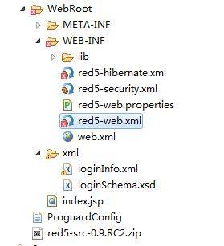
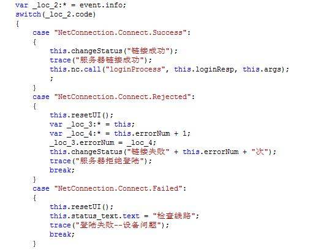
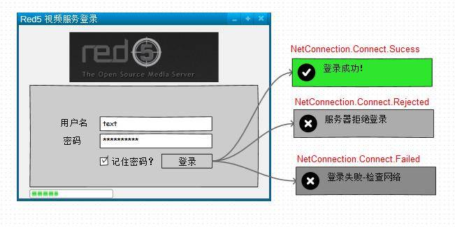
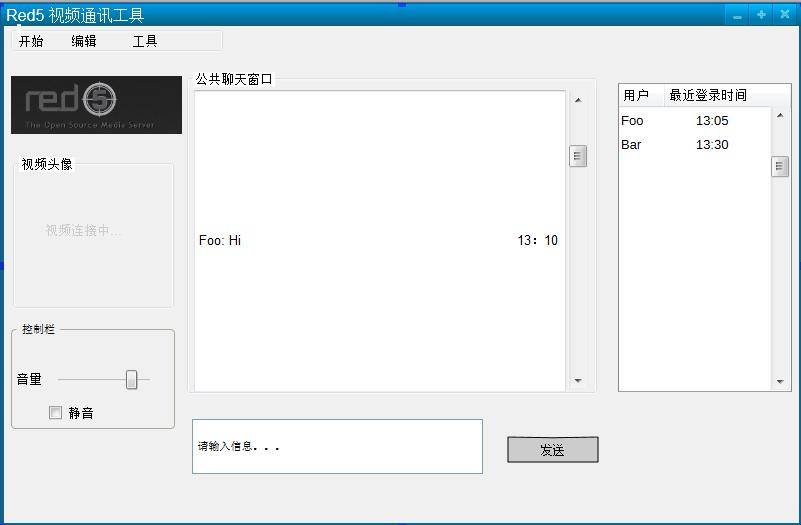

# 基于 Red5 的流媒体服务器的搭建和应用
如何使用 Red5 快速搭建一个流媒体服务器

**标签:** Java

[原文链接](https://developer.ibm.com/zh/articles/os-cn-red5/)

唐 学波, 阮 高远

发布: 2015-03-26

* * *

## 引言

流媒体文件是目前非常流行的网络媒体格式之一，这种文件允许用户一边下载一边播放，从而大大减少了用户等待播放的时间。另外通过网络播放流媒体文件时，文件本身不会在本地磁盘中存储，这样就节省了大量的磁盘空间开销。正是这些优点，使得流媒体文件被广泛应用于网络播放。

流媒体服务器是通过建立发布点来发布流媒体内容和管理用户连接的。流媒体服务器能够发布从视频采集卡或摄像机等设备中传来的实况流，也可以发布事先存储的流媒体文件，并且发布实况流和流媒体文件的结合体。一个媒体流可以由一个媒体文件构成，也可以由多个媒体文件组合而成，还可以由一个媒体文件目录组成。

Flash Media Server，简称 FMS，是 Flash 大家庭里的一员，被称为是目前开发 Web 音视频应用程序（比如，视频聊天室、视频会议系统、播客系统、音视频留言等等）的最方便最快捷的解决方案。也在 web 应用程序开发上有着越来越广泛的应用。当然 FMS 这种优良功能并不是免费提供给广大用户的，几千美金每个点的价格让很多开发人员望而却步。于是，大家开始尝试寻找一种更合适的解决方案，开源的 Red5 便成为了人们的新宠。

Red5 是一个采用 Java 开发的开源的 Flash 流媒体服务器，功能上与 FMS 类似。它支持：把音频（MP3）和视频（FLV）转换成播放流；录制客户端播放流（只支持 FLV）；共享对象；现场直播流发布；远程调用。Red5 使用 RSTP 作为流媒体传输协议，包括在线录制，Flash 流媒体播放，在线聊天，视频会议等一些基本功能。国内外基于 Red5 的流媒体应用产品也在不断推广，例如在线视频会议 Openmeeting，大型 Flash 网游功夫之王 2。

## 流媒体简介

随着 Internet 发展，单纯的文字和图形已经远远不能满足需求，而是逐渐向声音和视频等多媒体方向过渡。目前在网络上传输音频/视频等多媒体文件时，一般有下载和流式传输两种选择。由于音频/视频包含大量的数据，所以他们占据的存储空间都比较大，在带宽受限的网络环境中下载可能要耗费数分钟甚至数小时，所以这种处理方法的延迟很大。如果换用流式传输的话，声音、影像、动画等多媒体文件将由专门的流媒体服务器负责向用户连续、实时地发送，这样用户可以不必等到整个文件全部下载完毕，而只需要经过几秒钟的启动延时就可以了，当这些多媒体数据在客户机上播放时，文件的剩余部分将继续从流媒体服务器下载。

流（Streaming）是近年在 Internet 上出现的新概念，其定义非常广泛，主要是指通过网络传输多媒体数据的技术总称。流媒体包含广义和狭义两种内涵：广义上的流媒体指的是使音频和视频形成稳定和连续的传输流和回放流的一系列技术、方法和协议的总称，即流媒体技术；狭义上的流媒体是相对于传统的下载-回放方式而言的，指的是一种从 Internet 上获取音频和视频等多媒体数据的新方法，它能够支持多媒体数据流的实时传输和实时播放。通过运用流媒体技术，服务器能够向客户机发送稳定和连续的多媒体数据流，客户机在接收数据的同时以一个稳定的速率回放，而不用等数据全部下载完之后再进行回放。

由于受网络带宽、计算机处理能力和协议规范等方面的限制，要想从 Internet 上下载大量的音频和视频数据，无论从下载时间和存储空间上来讲都是不太现实的，而流媒体技术的出现则很好地解决了这一难题。目前实现流媒体传输主要有两种方法：顺序流（progressive streaming）传输和实时流（realtime streaming）传输，它们分别适合于不同的应用场合。

### 顺序流传输

顺序流传输采用顺序下载的方式进行传输，在下载的同时用户可以在线回放多媒体数据，但给定时刻只能观看已经下载的部分，不能跳到尚未下载的部分，也不能在传输期间根据网络状况对下载速度进行调整。由于标准的 HTTP 服务器就可以发送这种形式的流媒体，而不需要其他特殊协议的支持，因此也常常被称作 HTTP 流式传输。顺序流式传输比较适合于高质量的多媒体片段，如片头、片尾或者广告等。

### 实时流传输

实时流式传输保证媒体信号带宽能够与当前网络状况相匹配，从而使得流媒体数据总是被实时地传送，因此特别适合于现场事件。实时流传输支持随机访问，即用户可以通过快进或者后退操作来观看前面或者后面的内容。从理论上讲，实时流媒体一经播放就不会停顿，但事实上仍有可能发生周期性的暂停现象，尤其是在网络状况恶化时更是如此。与顺序流传输不同的是，实时流传输需要用到特定的流媒体服务器，而且还需要特定网络协议的支持。

## Red5 概述

Red5 是一个采用 Java 开发开源的 Flash 流媒体服务器。免费开源使软件更加容易扩展，下载后你可以对源代码进行修改；更加经济，比起 FMS 高昂的费用，Red5 能为一般的应用节约大笔费用；同时服务器端的 Java 面向对象语言比起 FMS 服务器端的 ActionScript2 语言更加成熟。鉴于 Red5 的种种优势，推出不久便被广大用户所接受。

Red 5 支持:

1. 把音频（MP3）和视频（FLV, F4V, MP4, 3GP）转换成播放流；

2. 录制客户端播放流, 把摄像头，麦克风等传入的音频视频录制保存到服务器；

3. 共享对象；

4. 现场直播流发布；

5. 远程调用；

6. 协议:RTMP, RTMPT, RTMPS, and RTMPE。


为了便于开发人员进行二次开发，Red5 提供了很多接口。

##### 表 1.Red5 常用接口

接口描述IConnection连接对象。每个连接都有一个关联的客户端和域。连接可能是持续型、轮询型、或短暂型。建立此接口的目的，是为了给不同的子类，如 RTMPConnection，RemotingConnection，HttpConnection 等，提供基础通用的方法。通过该接口提供的 getClient() 方法可以方便地获取客服端对象。IScope每个 Red5 应用程序至少有一个域，用来搭建处理器、环景、服务器之间的连接。域可以构成树形结构，所有客户端都可以作为其节点共享域内的对象（比如流和数据）。所有的客服端 (client) 通过连接 (connection) 连接到域中。对于单一域，每个连接对应一个客户端，每个客户端对应一个 id，简单的应用，操作就针对一个 id 和一个连接进行。IServiceCapableConnection获取有效连接。代码中先获取到连接实例，然后判断是否是有效连接并强制类型转换，之后调取客户端相应函数。IClient客户端对象代表某单一客户端。一个客户端可以和同一主机下不同的域分别建立连接。客户端对象和 HTTPSession 很相像。可以使用 IClientRegistry.newClient(Object[]) 方法来创建 IClient 对象。ApplicationAdapterApplicationAdapter 是应用层级的 IScope。若要处理流进程，需实现 IStreamAwareScopeHandler 接口中的相应处理方法。ApplicationAdapter 还提供了有效的事件处理机制，来进行截取流、确认用户等操作。同时，其子类中引入的方法均可在客户端通过 NetConnection 调取。在 Aodbe 的 FMS 中必须在服务器端维护客户端对象，与之相较，Red5 为您的远程请求提供了更加方便快捷的操作方法。

## Red5 安装

### 准备工作：

1. JAVA 环境配置：下载的 JDK 安装包，本文选择的是 [jdk-6u10-rc2-bin-b32-windows-i586-p-12\_sep\_2008.exe](http://www.java.net/download/jdk6/6u10/promoted/b32/binaries/jdk-6u10-rc2-bin-b32-windows-i586-p-12_sep_2008.exe) 。

2. 确认你的安装环境并选择 Red5 安装包：如果是 Windows 操作系统，可以下载对应的安装文件 Red5 0.9 RC2（本文写作时使用的该版本），如需下载最新版本或了解 Red5 其他相关信息，可以参考该页面 [https://github.com/Red5/red5-server](https://github.com/Red5/red5-server) 。


准备工作完成，一切就绪。

### 安装工作：

1. 首先安装上面下载的 JDK 安装包（备注：如果你先安装 Red5，会提示找不到 JDK，你必须先完成步骤一再继续以下操作）。安装时首先安装 JDK，必须记住安装路径，保持默认即可，默认是 C:\\Program Files\\Java\\jdk1.6.0\_10，然后安装 JRE, 保持默认即可，默认是 C:\\Program Files\\Java\\jre6。安装完成后，必须配置环境变量，我的电脑–>属性–>高级 选项卡–>环境变量 (N)–>找到 系统变量 (S) 下 新建（W），然后输入 变量名（N）：JAVA\_HOME，变量值（V）：上面 JDK 安装路径 C:\\Program Files\\Java\\jdk1.6.0\_10，确定即可，JDK 准备就绪。

2. 安装 Red5，安装 Red5 时，会要求输入外网可访问的 IP, 比如 121.52.209.62, 然后输入可访问的端口（Port），一般是 5080, 最后安装完成即可。


## Red5 简单的应用实例

经过上面精彩的介绍，相信大家对 Red5 会有所兴趣，在这里我给大家用一个简单的应用实例，仅以登录过程为例，来帮助大家更好的理解 Red5 中的一些概念和模型。本应用实例中，Server 端基于 Red5 0.9 RC2 采用 Java 编写，而 Client 端则采用 Action Script。

##### 图 1\. 项目结构



由于 Red5 是在 Tomcat 中运行的，因此 Red5 项目与普通 JAVAEE 项目结构类似。不同点在于，Red5 的配置文件需要加上”red5-”前缀，在 Tomcat 启动时，所有”red5-”被默认为 Red5 Server 的配置文件而不会被 Tomcat 加载，而后当 Red5 启动时才会加载相应的配置文件。让我们来看看 red5-web.xml 中都有哪些组成部分。

##### 清单 1\. red5-web.xml 中 Context 部分

```
<bean id="web.context" class="org.red5.server.Context" autowire="byType">
<property name="scopeResolver" ref="red5.scopeResolver" />
<property name="serviceInvoker" ref="global.serviceInvoker" />
<property name="mappingStrategy" ref="global.mappingStrategy" />
<property name="clientRegistry" ref="IloveClientRegistry" />
</bean>

```

Show moreShow more icon

清单 1 中前三项 Property 为 Red5 项目默认的属性。第四项”ClientRegistry”为项目自定义的 Context, 主要用于实现用户注册的功能。

##### 清单 2\. red5-web.xml 中 Scope 部分

```
<bean id="web.scope" class="org.red5.server.WebScope" init-method="register">
<property name="server" ref="red5.server" />
<property name="parent" ref="global.scope" />
<property name="context" ref="web.context" />
<property name="handler" ref="web.handler" />
<property name="contextPath" value="${webapp.contextPath}" />
<property name="virtualHosts" value="${webapp.virtualHosts}" />
</bean>

```

Show moreShow more icon

清单 2 中定义了 Red5 项目中 Scope 的默认值。如需要可以添加自己定义的 Scope，并给它赋值。

##### 清单 3\. red5-web.xml 中 Handler 部分

```
<bean id="web.handler" class="org.red5.server.webapps.Ilove.Application">
<property name="userInfoService" ref="userInfoService" />
</bean>

```

Show moreShow more icon

清单 3 重载了 web.handler，因此当有 Client 与 Server 提出连接请求时，org.red5.server.webapps.Ilove.Application 将被用于处理客户请求。

接下来我们看下如何实现从 Flash 客户端调用 Red5 应用的方法，以及如何使用 Scope 来判断用户登录状态。

##### 图 2\. 客户端登录



##### 图 3\. 登录界面



图 2 中展示了 Flash 客户端中 ActionScript 面对不同 Connection 状态的处理方法。由 Flash 客户端发起的登录请求，首先需要判断当前与 Server 的 Connection 状态, 只有状态为”NetConnection.Connect,Sucess”时, 才可以向 Server 端调用方法”logicProcess”。 图 3 中展示了不同 Connection 状态时 Flash 客户端会给出的提示。

##### 清单 4\. LoginInterface

```
public interface LoginInterface extends IStreamAwareScopeHandler {

......
//用户登录时服务器端调用当前 connection 的方法
public String loginProcess(String[] args) throws FileNotFoundException,
ParserConfigurationException, SAXException, IOException;

//用户登录时服务器端报错调用当前 connection 的方法
public void systemError();

/**用户登出时客户端端调用当前 connection 的方法
*
* @param userName 需要剔除的用户名
*/
public void logoutProcess(String userName);

......
}

```

Show moreShow more icon

如清单 4 所示，org.red5.server.webapps.Ilove.Application 实现了 LoginInterface 接口, 其中定义了一些客户端可见的方法名称。因为 org.red5.server.webapps.Ilove.Application 被定义为项目的 Handler，类中所有 public 方法都可以被客户端调用。

##### 清单 5\. 用户登录

```
public String loginProcess(String[] args) throws FileNotFoundException,
ParserConfigurationException, SAXException, IOException {

final IConnection conn = Red5.getConnectionLocal();
if (conn.getClient() == null)
return SystemContent.NO_ENTRY;

final IScope scope = conn.getScope();
final IClient client = conn.getClient();
final int code = (Integer) client.getAttribute("codeName");

//检查当前登录冲突
if (code == SystemContent.STATUS_CODE_DUPLICATEUSER) {
//此用户名已登录，notify 客户端不允许重复登录
if (model.statusMap.get(args[0]))
return SystemContent.NO_ENTRY;

//如果没有用户登录，则更新数据库中 session 值为当前用户
else {
this.userInfoService.updateSession(args[0], (String) client
.getAttribute("currentId"));
}
}
//如果通过验证，则 client 应该为 IloveStreamClient 类型
if (client instanceof IloveStreamClient) {
boolean authenticated = ((IloveStreamClient) client)
.isAuthenticated(); //当前验证状态

if (authenticated) {

synchronized (model.statusMap) {
model.statusMap.put(args[0], true);
refreshUserList(conn, args[0], "refresh");
refreshUserList(conn, args[0], "add");
}
invokeClientMethod(conn, "declarePublicSo",
new Object[] { "chatingSO" }, null);
messageAdapter
.sendPublicMessage(so, "欢迎登录！" + args[0], "系统机器人");
final String scheduleName = this.addScheduledJob(5000,
new IloveUserListChecker(conn, args[0]));
scope.setAttribute((String) client.getAttribute("currentId"),
scheduleName);
return args[0] + " found";
}
}

return args[0] + " not found";

}

```

Show moreShow more icon

如清单 5 所示,程序首先通过 Red5 的 GlobalScope 获取当前用户的 Credential，因为每个 Connection 在 Scope 中都是独立存在的。登录过程中会判断当前用户是否重复登录，或者登录信息是否正确。只有当用户为 Authenticated 状态时，服务器端才会调用 Flash 客户端的方法，同时生成 shared Object 以帮助 Flash 客户端初始化界面。

## Red5 应用的部署

Red5 0.9 RC2 中已经内嵌了 Tomcat 服务器。因此 Red5 应用的部署和普通 JavaEE 应用在 Tomcat 中的部署方式是一样的。这里需要注意的是，上文中提到的 XML 配置文件必须是正确的，以防止运行报错。图 4 中是一个基于 Red5 应用的视频聊天系统，当用户登录成功后，可以在当前的聊天室中与其他已登录用户进行文字交谈或者视频聊天。具体功能的实现就不在本文中阐述了。

##### 图 4\. 视频聊天系统界面



## 结束语

Red5 是一个采用 Java 开发的开源 Flash 流媒体服务器。Red5 同时具备了 Flex、Java 的优点，且具有比 Flex 更强的优势。Red5 为即时通信，远程教育，流媒体开发，网络在线游戏等提供了一个简单易行的方案。本文通过对 Red5 的介绍，让读者了解如何使用 Red5 快速搭建一个流媒体服务器以及如何在服务器上快速开发部署相应的流媒体应用。