# 基于 RobotFramework+Allure+Jenkins 实现可视化的测试报告发布
自动化测试报告的展示

**标签:** DevOps

[原文链接](https://developer.ibm.com/zh/articles/visual-test-report-based-on-robotframework-allure-jenkins/)

梁向峰

发布: 2021-01-10

* * *

## 前言

在持续化集成广泛应用的今天，自动化执行结果的展示成为一个必不可少的环节，测试报告太简陋，测试结果展示维度有限，无法查看历史测试结果，不方便查看错误信息，这些可能成为测试开发人员面临的问题，allure 测试报告框架帮助我们轻松实现优美报告展示。allure 非常强大，支持多种语言多种测试框架，无论是 Java/Python 还是 Junit/TestNG，只需参照该语言的框架规范，都可以生成可视化的测试报告。本文以 python+robotframework 作为测试框架为例，讲解如何利用 allure 生成可视化测试报告。

## 第一步：robotframework+allure+jenkins 持续集成平台的搭建

### jenkins 环境的安装

可持续集成发布的工具有很多，IBM UrbanCode Deploy 是一个完善的应用部署自动化管理信息模型，提供可视化的部署逻辑设计手段，提供方便地建模和可视化的工作流，还有 JetBrian 的 TeamCity，提供一系列特性可以让团队快速实现持续集成，但是 TeamCity 是收费的。目前使用比较多的是由 Java 语言编写的开源项目 jenkins，它是提供友好操作界面的持续集成(CI)工具，主要用于持续、自动的构建/测试软件项目、监控外部任务的运行，它可以独立运行，也可以在 Tomcat 等流行的 servlet 容器中运行。本文使用的是独立运行的 jenkins，以 windows 平台为例。Jenkins 的安装有 msi、war 包两种方式。我们可以从 [官网](http://mirrors.jenkins-ci.org/) 下载一个 war 包，这种方式比较便捷，然后通过运行 `java -jar jenkins .war` 就可以启动，等待 jenkins service 启动起来，当看到控制台有日志输出 `jenkins is fully up and running` 显示就表示服务启动完成。
在浏览器中输入 `http://localhost:8080/`, 会弹出解锁 jenkins 窗口。

##### 图 1\. 解锁 jenkins 窗口

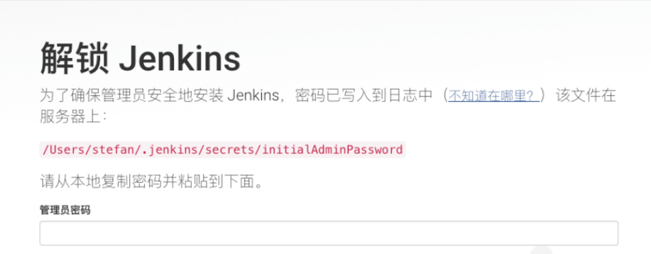

按照屏幕提示到指定位置复制密码，点击下一步，在此我们不安装默认插件，继续点击下一步，去创建一个用户，点击完成，即可自动进入 jenkins 首页。此时我们的 jenkins 平台搭建完成。

### robotframework 插件安装配置

robotframework 是一个基于 Python 的可扩展的关键字驱动的测试自动化框架，用于端到端验收测试和验收测试驱动开发（ATDD）。安装这个插件到 jenkins，可以收集和发布 robotframework 测试结果到 jenkins，在 [jenkins 插件官网](https://plugins.jenkins.io/) 输入 robotframework 关键字，如果您的网络环境很快，可以在线安装此插件，本文使用离线安装方式。

下载 robotframework plugin，文件名是：`robot.hpi.`。
打开 jenkins 控制台，进入到管理 jenkins 页面，再进入到管理插件选择高级，上传插件。

##### 图 2\. 安装 robot 插件

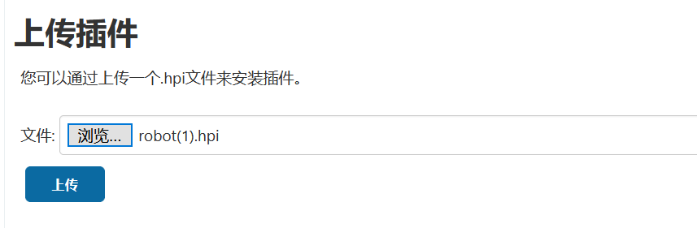

点击上传按钮，直到完成，重启 jenkins 服务使其生效。
然后再次进入到 jenkins 控制台（`http://localhost:8080`），进入管理 jenkins 页面，在进入到系统管理页面，找到 robotframework 模块。

##### 图 3\. robotframework 配置模块

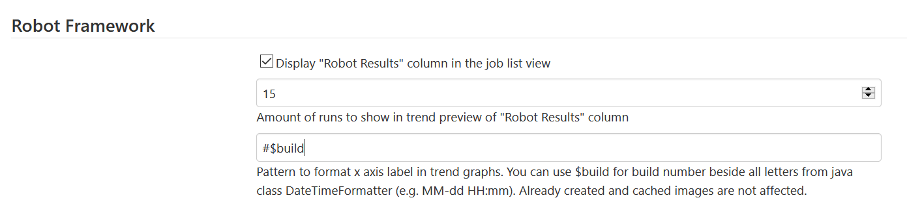

第一个参数表示：在未来的趋势柱状图中显示多少条历史结果。第二个参数表示趋势图中 x 轴的标签。例如#$build 表示 x 轴显示每次构建版本号。我们暂且保持默认即可。
此时 robotframework 在 jenkins 上安装配置完成。

### allure Report 插件安装配置

allure 是一个 report 框架，可以基于一些测试框架生成测试报告，allure 生成的报告样式简洁美观。它支持绝大多数测试框架，TestNG、Pytest、JUint 等。它简单易用，易于集成，是一个灵活的轻量级多语言测试报告工具，它不仅以简洁的 web 报告形式显示了测试的内容，而且允许参与开发过程的每个人从日常测试执行中提取最大限度的有用信息。
首先需要一个第三方的 allure command line 的一个程序，这个应用程序用来将 allure json 格式数据生成 html 格式报告，可以去 [github 上](https://github.com/allure-framework/allure2/releases) 去下载安装 allure-commandline.zip 包，解压压缩文件到任意路径，在 windows 中配置一下 allure-commandline 环境变量，在 path 中添加 allure/bin 目录。
打开 cmd 窗口输入 `allure–version` 命令，如果能看到版本信息，表示环境变量配置成功。
然后去 jenkins 插件官网，输入‘allure’关键词来搜索此插件，插件下载文件名是：`allure-jenkins-plugin.hpi`，进入 jenkins 插件管理页面，上传此插件，直到完成并重启 jenkins 服务。
再次进入到 jenkins 控制台，进入到 jenkins 管理界面，全局工具配置页面，定位到 allure commandline 配置区域。
第一个设置参数：别名是我们后面 jenkins job 里面可以使用 allure 命令的名字。
第二个参数：安装目录是指 allure commandline 安装位置，注意是 allure 命令所在 bin 文件夹的上一层。也就是我们刚才下载的第三方 allure commandline 应用的位置。

##### 图 4\. jenkins 中 allure commandline 配置

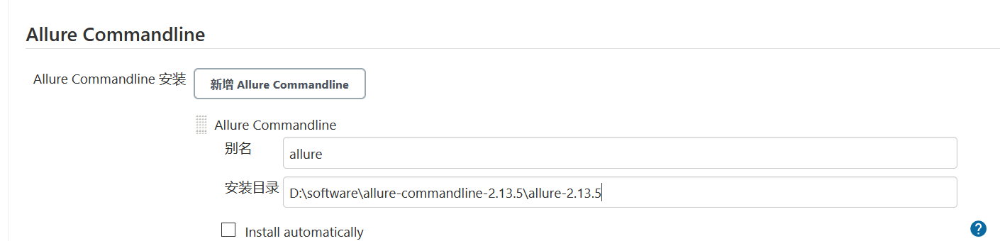

此时 allure 在 jenkins 上配置已经完成。

## 第二步：生成测试报告数据

为了描述的方便，本文用 Python 设计一个简单的测试结构并编写两个简单测试用例，用来说明如何生成测试报告所需要的原始数据。

### 编写一个简单的测试框架

打开 python 主流的 IDE-Pycharm，新建一个项目工程，并建立常用的项目模块结构如下：

- Report：存放执行生成的 html report
- Testcases：编写的单个测试用例，如图 5
- Common\_method：测试用例中常用的公共方法
- Testsuite：将不同测试用例组装到一个测试套件中，如图 6

##### 图 5\. 简单测试示例工程

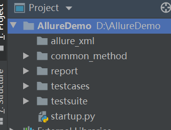

##### 图 6\. 测试用例

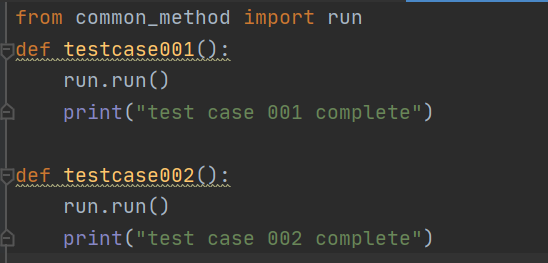

将组织好的测试用例当关键字导入 sutie1.robot 中。

##### 图 7\. 测试套件模块

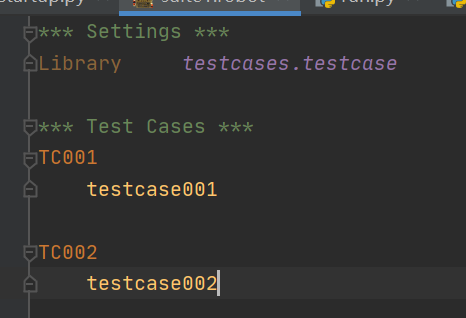

最后还需要安装 allure-robotframework 插件，此插件是安装于 python 运行环境的，是生成测试报告的 json 格式数据的关键插件，在 windows cmd 窗口输入：pip install allure-robotframework 即可完成安装。
此时测试框架和环境配置就完成了，这里的环境配置是 python 测试用例开发环境。

### 生成 allure JSON Data

为自动化执行编写一个入口程序，这样只要启动执行这个 startup.py 文件，整个测试都会被执行，这样也易于维护。也可以不编写直接在 cmd 窗口中执行第二行关键命令内容。
本例子中的 startup.py 文件如下：

```
import os
cmd = "robot --listener allure_robotframework;./allure_xml -d ./report ./testsuite"
os.system(cmd)

```

Show moreShow more icon

命令语法格式如下：
`$ robot --listener allure_robotframework;<数据文件产生路径> <robot 文件路径>`
这是和 RF 结合的固定搭配，运行 robot 测试用例的时候，注意配置运行参数，`--listener allure_robotframework`，是指监听用 allure\_robotframwork 插件，后面跟上你的 allure 产生的 `xml\json` 数据文件存放路径，本例子中是 `./allure_xml` 目录，如不填写的话，默认是 output 目录。
当我们运行完会看到 allure\_xml 产生了数据文件，如下图所示，这些数据文件可以理解为生成 allure html 报告的原始数据。

##### 图 8\. allure report 原始数据文件

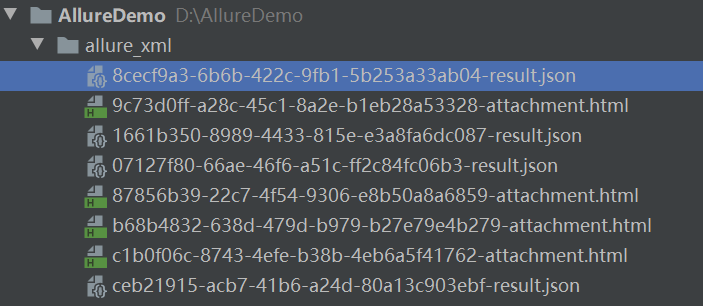

每当运行一次，这个 allure\_xml 下的数据就累增，而不是覆盖之前的。这就是 allure 中之所以可以查看用例的历史运行结果的依据。
打开一个 json 文件，可以看到，里面记录着用例名字、执行结果、步骤、开始结束时间，以及历史结果 ID 等。这些属性信息都是日后生成优美报告的数据源。

##### 图 9\. json 格式的 allure 数据源

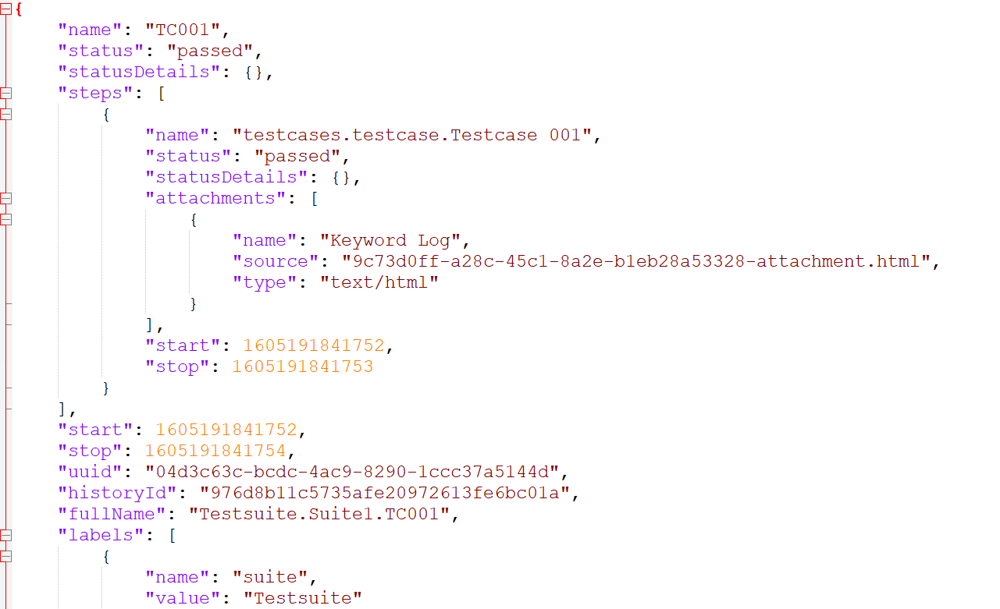

## 第三步：发布优美测试报告的 jenkins 平台

无论是自由风格项目还是流水线都可以。本文对两种风格 job 都演示。

### 在自由风格 job 中发布测试报告

首先在 jenkins 上选择创建一个自由风格 job，进入 job 页面后，点击配置 job，在构建页面添加要执行的自动化入口文件，如下：

##### 图 10\. 构建自由风格 job

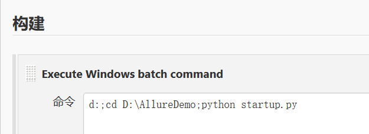

然后到构建后页面，下拉菜单选择添加 allure-report，在 Result 设置一下 `allure_xml` 路径，就是上一章节我们产生的 `allure_xml` 数据路径，注意这个 result 路径是指的这个 job workspace 下的相对路径。
最后点击高级按钮，打开高级选项板块，指定用于生成优美报告的 allure 命令位置，之前第一部分的时候 jenkins 上配置过。
这里的 allure commandline 就是 jenkins 系统配置里的 allure 工具。
JDK 可以选择默认集成 job 的。最后注意 report-path 也是让设置一个输出报告的路径，也是相对 workspace 的相对位置。如下图所示：

##### 图 11\. 自由风格 job 中发布 allure 报告配置

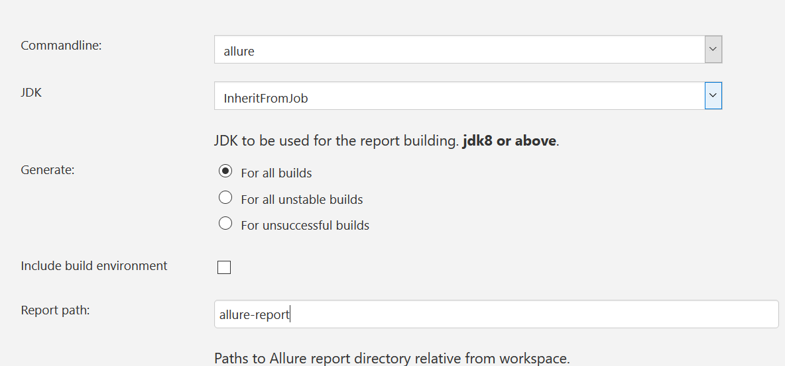

接下来执行 job， 如果 job 成功的话，allure 的 html 会集成到 job build 页面上，将从 job 运行页面直接看到结果。

##### 图 12\. allure 报告在 jenkins 上展示

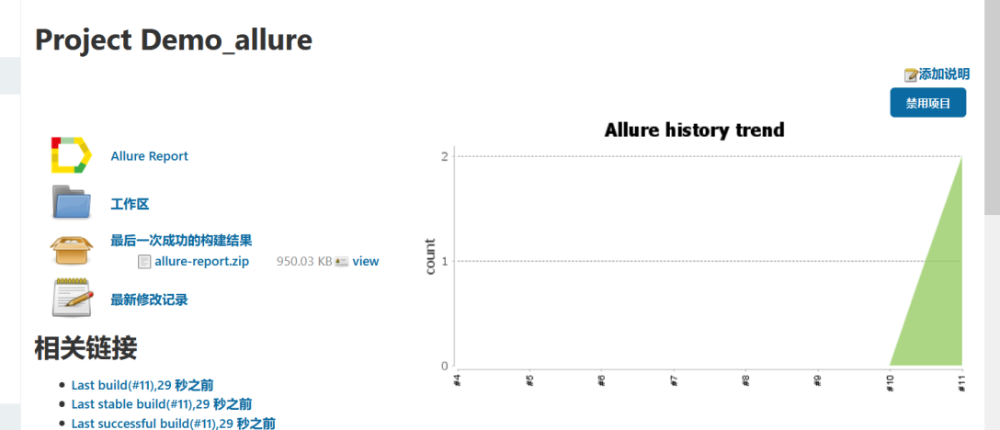

点击趋势图，进入到 allure report 详细页面，在 allure report 里面可以从各个维度来查看用例执行情况。

##### 图 13\. allure 报告的详细展示

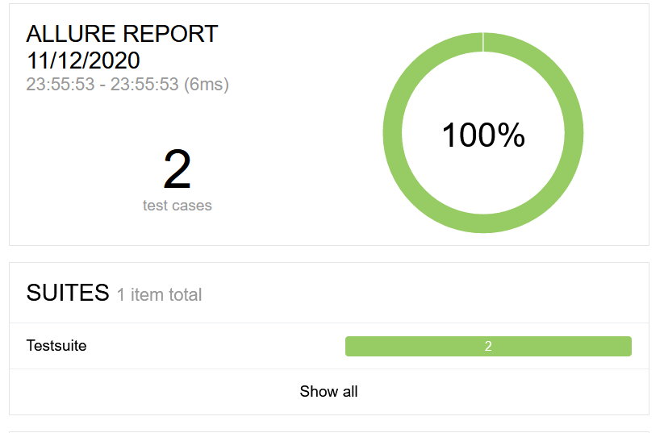

### 在 pipeline 风格 job 中发布测试报告

同样首先我们首先创建一个 pipeline job。
在 pipeline 中我们使用 pipeline script 语言先创建一个流水线，包含两个 stage，stage1：执行用例；stage2：发布 allure report。
Pipeline script 示例如下：

```
node()
{
    stage("run testcases")
    {
        bat 'd:;cd D:\\allureDemo;python startup.py'
    }

    stage("publish allure report")
    {
        allure commandline: 'allure', includeProperties: false, jdk: '', results: [[path: 'allure_xml']]
    }
}

```

Show moreShow more icon

第二个 stage，最后的 result 生成路径就是生成的 `allure_xml` 路径，默认输出到 output 文件夹，读者可以点击“流水线语法”，用这样的语法生成器来生成代码，如图 13，依然选择 allure-report，然后里面打开的界面和自由风格的一样，通过快速勾选来生成 pipeline script。最后将自动生成的脚本粘贴到 pipeline 第二个 stage 即可。

##### 图 14\. 生成流水线语法

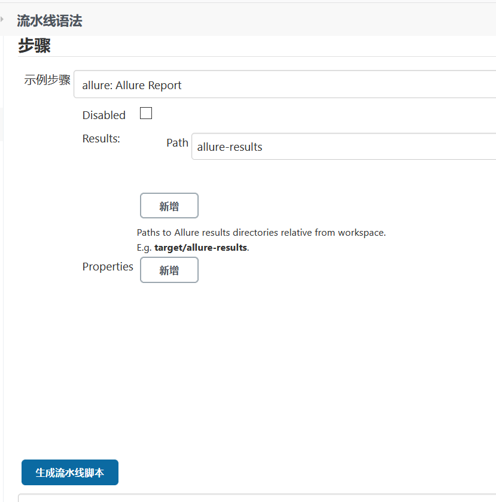

同样运行此 pipeline job，当运行完成后，可以看到测试结果自动发布到了 pipeline job 页面。
而且当我们进入 allure-report 后可以从各个维度查看测试用例执行情况，甚至多次运行 job，进入 allure report 页面 suite 下可以看到各个用例历史执行情况。

## 常见问题及解答

系统的配置是漫长而且复杂的，下面将安装或者运行过程中遇到问题总结一下：

- 问题一：如果你的 allure report 页面打开显示 0，一个用例数据都没有。
     解答：你点开 jenkins job 中的 log，allure-results does not exists，应该是你的用于生成 allure report 的原始 json 数据没有，这个 allure\_xml 目录一定是 workspace 的相对路径，不可以是绝对路径，否则不会生成 allure-report。
- 问题二： 最后本文中常常提到几个概念，注意区分。
     allure command line: 是 allure 用于生成 report 和打开 report 的程序。
    allure result : 这个可能会在 jenkins 配置时候看到，很容易很 allure report 混淆，allure result 就是我们说的用例执行完的 json data 里面记录着测试用例属性及其结果。
    allure report：这个就是 allure 命令把原始的 allure json 数据嵌入了 html。
- 问题三：robot Framework 执行时候提示 no testcase import。
     解答：主要是因为你在别处执行的 startup.py， robot 命令从当前目录下去寻找 testcase，需要执行 robot 时候添加一个-P 参数表示设置 pythonpath 。
- 问题四：allure 生成的 html report 为什么浏览器打开里面显示的内容是 loading？
     解答：其实在 allure-report 下 index.html 文件是不能直接打开的，出现页面都是 loading 的情况。这是因为直接 allure 报告用浏览器是打不开的，需要用 allure 命令渲染之后打开才能展示效果。
    allure 使用了两种方式来渲染页面，分别是 allure open 和 allure serve。前者用于在本地渲染和查看结果，后者用于在本地渲染后对外展示结果

## 结束语

总结一下我们的安装配置整体流程图如下：

##### 图 15\. 安装配置流程图

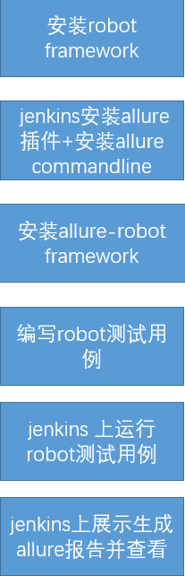

本文所使用代码可以 [从 git 仓库获得](git@github.com:1213adam/allure_demo.git)，供大家学习研究使用，希望对自动化测试报告的扩展有所帮助。