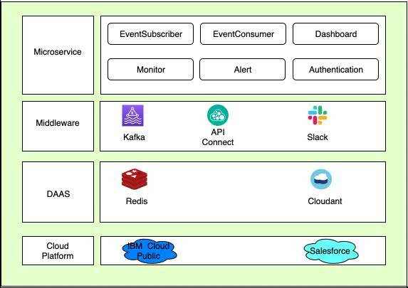
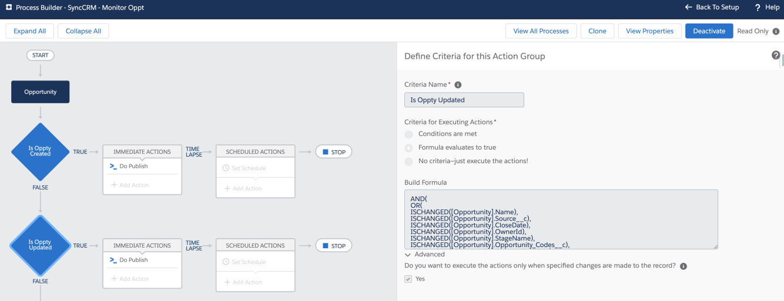
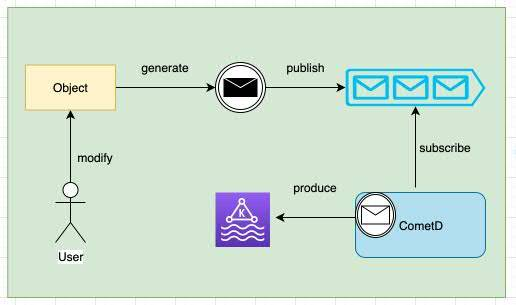
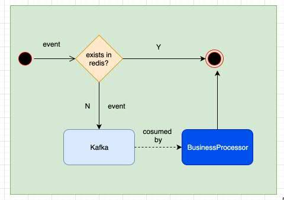
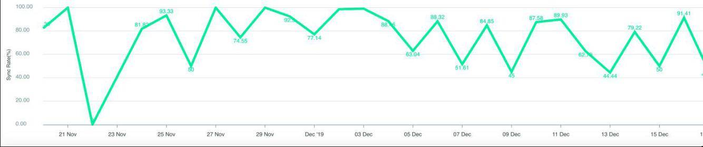
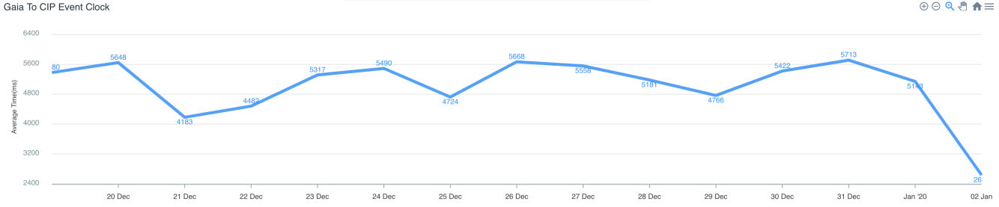
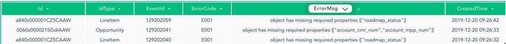
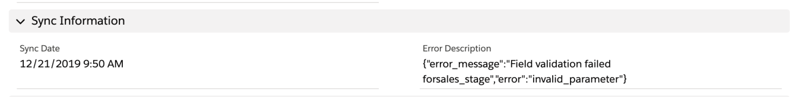
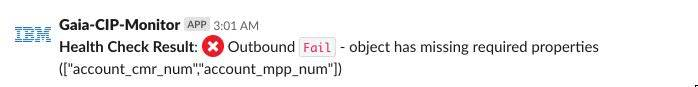

# 基于 Salesforce 的跨 CRM 平台数据实时同步方案
通过新老系统间的数据实时同步来确保业务的连贯性

**标签:** Java,云计算,数据管理

[原文链接](https://developer.ibm.com/zh/articles/cl-lo-real-time-data-synchronization-solution-based-on-salesforce/)

张宇刚, 孙志刚, 李风威

发布: 2020-09-03

* * *

随着技术的日益发展，许多传统企业开始转型，为了更快速的响应业务发展和市场需求，一些老的产品、项目会逐渐被淘汰，取而代之的是新产品、新业务、新技术。本文以 CRM 系统为例，以 Salesforce 为云平台，IBM Cloud 为应用载体，讲述如何在老的系统向新系统迁移过程中，做到系统间的数据实时同步来确保业务的连贯性，让系统用户在新老系统之间可以无缝切换，使其平稳过渡。

## 业务场景

### 跨 CRM 协作

新系统（Salesforce）与旧系统（Sugar）并存，同时在线，数据、业务模型需要做适配。

一个销售机会可能需要跨产品的销售团队来合作完成，比如一个 Opportunity 可能包含软件、硬件、服务等，不同的销售人员可能在自己首选的 CRM 平台上来管理这个 Opportunity。

### 数据实时同步

销售团队在任一系统所做的操作，比如创建或更新 Opportunity，需要在另一系统实时可见，这样团队中的人员可以很方便的及时跟踪和处理这个 Opportunity。

## 架构设计

**图 1\. 总体架构**



## 技术选型与核心模块实现

### 实时更新事件通知

要做数据同步就需要在数据有更新操作的时候将事件发出来，Salesforce 支持多种平台事件，包括 Streaming API Events 和 Platform Events 等，考虑到事件的灵活性和扩展性，我们选择了 Platform Events。对于何时发布想要的事件，我们利用 Process Builder 来监控对象的字段值更新情况，比如 Opportunity Owner，一旦值发生变化，会触发 process flow 进入后台逻辑从而决定是否最终要发布该事件，如果确定发布，则添加到 Salesforce 的消息队列里。Salesforce 支持 CometD 的长轮询来 pull 事件，如上架构图所示，在应用层会有专门的 application 利用 CometD 来轮询获取平台事件消息，一旦获取到消息则转入后续处理。下面我们会对 Salesforce 平台上的 Streaming API Events、Platform Events、Process Builder 以及 CometD 做一个简单的介绍与比较，作为大家技术选型的一个参考。

### Platform Events VS Streaming API Events

1. Platform Events

     Platform Events 使您能够在 Salesforce 内部或从外部来源交付安全的、可伸缩的和可定制的事件通知。Platform Events 中的字段在 Salesforce 中定义，用以定义您发送和接收的数据。应用程序可以使用 Apex（Salesforce 平台语言，语法与 Java 较为相似）在 Salesforce 平台上发布和订阅 Platform Events，也可以使用 CometD 在外部系统上发布和订阅 Platform Events。我们所采用的方案是使用 Apex 在 Salesforce 平台上发布 Platform Events，使用 CometD 在我们的 Java Application 中订阅 Platform Events。

2. Streaming API Events

     Streaming API 提供了两种可以发布和订阅的事件：PushTopic 和 Generic。PushTopic Events 跟踪 Salesforce 记录中的字段更改，并与 Salesforce 记录绑定。Generic Events 可包含任意数据内容。这两种事件类型都没有提供平台事件提供的粒度定制级别。可以使用 Generic Events 发送自定义数据，但不能将数据定义为字段。您不能在 Salesforce 中定义这些类型的事件，也不能在 Apex 触发器中使用它们。

3. Platform Events VS Streaming API Events

     我们可以看到，两种事件通知都可以将数据的更改进行事件通知，但它们有哪些使用限制和区别呢？我们从数据同步的角度整理了下表作为参考：


**表 1\. Salesforce 事件通知对比**

是否可监控数据更新是否可自定义数据是否可手动随时发布是否可在外部系统订阅事件事件消息是否持久化以供获取PushTopic Events是否否是是(Durable PushToppic)Generic Events否是是是否Platform Events否是是是是

通过表中可以看出，Generic Event 无法获取过去一段时间内的事件消息，容错性较差，排除。PushTopic Events 不支持自定义数据，也不可以手动随时发布事件，扩展性和灵活性较差，故而思虑再三也是排除，这点也在以后的需求扩展中得到了验证。所以最后只能选择了 Platform Events 来发布事件消息，但 Platform Events 无法监控数据的更改该怎么办呢？这时又用到了 Salesforce 平台的另一组件：Process Builder。

### Process Builder

Process Builder 是一个工作流程工具，它可以帮助您公司中的任何人快速、轻松地自动化业务流程，如员工入职、新客户入职——所有这些都不需要编写任何代码。通过点击界面创建新流程可以帮助您避免重复的耗时任务，这样您就可以做得更多，速度更快。

使用 Process Builder 而不在 Apex trigger 中写代码来监控数据变化，是因为 Process Builder 可以方便地实现监控任一字段的变化，支持使用公式来过滤数据，同时可以调用 Apex 方法，功能强大且使用方便。

**图 2\. Process Builder**



### CometD

CometD 是一个可伸缩的基于 WebSocket 和 HTTP 的事件和消息路由总线。应用程序可以使用 CometD 库来编写与传输无关的应用程序，而 CometD 将负责传输细节。

CometD 作为实现消息发布与消息订阅的核心组件，发布消息的服务端已由 Salesforce 实现，我们在发布事件消息时只需要在 Apex 中调用 `EventBus.publish(PlatformEvent event)` 方法即可。之后使用 CometD 的客户端，即可在外部系统中订阅平台指定的频道并消费消息，具体的使用方法大家可参考Salesforce 官方文档，这里不作过多介绍。

而在使用 CometD 的时候需要特别注意两点：一是 Salesforce 平台保存已发布消息的时长是 24 小时；二是平台对 CometD 客户端每日消费消息的条数有限制，每个 CometD 客户端消费的消息都会被计算在内。这里大家可以看到，CometD 作为 Salesforce 的内置消息队列，与常规消息队列相比有着诸多的限制性，从性能与业务的角度考虑，我们有必要在此之外增加一个我们自己的消息队列——Kafka。

### Kafka

Kafka 最初由 Linkedin 公司开发，是一个分布式、支持分区的（partition）、多副本的（replica），基于 Zookeeper 协调的分布式消息系统，用 Scala 语言编写。

Kafka 目前主要作为一个分布式的发布订阅式的消息系统使用，具备可扩展、可持久化、可靠性、高吞吐、低延迟的能力，支持高并发场景。

Kafka 的 topic 在逻辑上可以被认为是一个 queue，每一条消息都必须指定 topic，既把这条消息放进哪个 queue。每个 topic 可以被分成多个 partition，每个 partition 对应一个 append log 文件，负责存储发送到这个 partition 的消息（尾部追加），partition 可以提高提高消息的并行处理能力。

**图 3\. 事件流程**



### 消息队列解耦

前文提到由于事件来自 Salesforce 的内置消息队列，为了减少业务依赖以及灵活处理事件和确保平台事件透明性，我们新增了一个消息队列中间件，由于应用是部署在 IBM cloud 上，IBM cloud 上的 Event Stream Service 是首选，其完全基于 Kafka，可以用 Kafka 的 API 来进行操作。使用 Kafka 主要可以带来这 4 方面的优势：

- 方便业务处理，保证消息的一致性和幂等性，只有消息被业务处理成功了，才 commit，Kafka 可以灵活做到这点。
- 利用 Kafka 的吞吐量优势，将平台事件尽可能多的先读取过来，我们可以部署多个 service 来并发消费，提高处理速度，同时也易于做集群。
- 利用 Kafka 的分区特性，可以建立多个 consumer 针对不同分区并发消费，提高处理效率。
- 支持自定义消息保存时长，解决了 Salesforce 内置消息队列保存时长短的限制。

### 消息内容

消息内容对于我们来说有两种选择，一是在 Salesforce 平台上发布消息时将需要同步的 Opportunity 的全部数据发出；二是在 Salesforce 平台上发布消息时只发出 Opportunity 的 ID，我们在中间件 Java 应用中回调 Salesforce 标准 API 以获取数据。讨论再三我们决定选取第二种，原因如下：

- 在消息发给其它 CRM 系统时我们需要使用多线程处理以提高效率，此时若发生同一条数据连续修改的情况，那么就可能会出现先修改的数据覆盖后修改的数据的情况。
- 在中间件 Java 应用中回调以获取数据，方便扩展，不需要每次都在 Platform Event 中添加或修改字段。

### 同步补偿机制

前面提到消息的流程主要是从 Salesforce 的内置队列经 CometD 流到 Kafka，业务 service 再从 Kafka 读取消息进行业务数据的封装，再将其发送给其他 CRM 系统。在这过程中，必然存在一些环节处理失败导致数据没有最终同步过去，为此有必要引入更新补偿机制。基本的思路是将事件的主要信息（Opportunity ID）以及同步到下游系统的结果存入数据库中，比如 IBM 的 Cloudant Database，将各种错误进行分类，标记数据是否需要重新同步到其他系统，比如与 Salesforce 的网络连接问题，与 Sugar 系统的连接问题等，这些就需要自动重新处理，创建一个 timer service 来定时扫描处理失败的消息，对需要重新同步的消息进行重试。

入库数据示例：

```
{
"_id": "8e74d0b9234d438ab345d6a1232abfdb",
"_rev": "1-6fe3a9576209b04864a5a575adca4447",
"EventSource": {
    "EventChannel": "Oppt",
    "EventId": "3901",
    "EventTo": "CIP",
    "EventFrom": "Gaia"
},
"CreatedTime": "2019-03-01 10:01:30",
"CreatedTimestamp": 1551434490582,
"EventResult": {
    "IsSuccess": false,
    "ErrorMsg": "Error occured while callback sf: java.lang.NullPointerException",
    "ErrorCode": "E004",
    "NeedRetry": true
},
"EventContent": {
    "OpptId": "0061F000005z8j1QAA"
},
"CreatedTimeAfterDays": 1552039290582
}

```

Show moreShow more icon

数据同步造成的错误通常有几大类：

1. 网络原因造成的数据同步失败；
2. 数据本身错误，如缺少必要的字段 ；
3. 数据不正确导致错误覆盖。

对于以上 3 类错误，可以通过技术手段来重试和纠正，正如上面所说，对于没有发送出去的消息，可以进行定时重试机制，重试的次数和间隔均可以配置，而对于数据不正确的情形，可以由日常的 automation 提前捕获，数据同步过去后可以 Get 一下看看是否是正确的。因为通常来说一旦 data model 在两个系统之间如何 mapping 已确定的话，基本上很少会造成数据不一致的情形，但是有这个可能性，比如业务的 gap 导致数据运算后在两个系统不一致。

### 如何避免消费重复事件

由于整个数据同步基于事件，就不得不提到事件的重复消费问题，减少不必要的事件是非常有必要的。Salesforce 的平台事件在平台范围内有唯一 id，即 replayId，而且是递增的，我们可以利用 CometdD 来指定从哪一条 replayId 开始 pull 消息，也可以 pull 24 小时内所有的消息，所以一旦 subsribe 消息 app down 了，就有可能会产生重复事件，这里可以引入 redis 的分布式锁。如果消息已被处理过（redis 里已有记录），则放弃该消息，如果没有则扔进 Kafka 等待消费处理，处理完成后记入 redis，同时会存入一条最新的消息 replayId，当 app 重启后，可以从最新的一条开始读取。

**图 4\. 消息处理**



#### 如何确保单实例情况下消息不被丢失

如上所述，订阅 Salesforce 的 app 和业务消费的 app 是单独的 microservice， 这里简称为 app1 和 app2，如果 app1 down 了，新产生的消息会保留在 Salesforce 的消息队列里，一般会保留 24 小时，当 app1 启动后，会根据最新的 replay id 去 pull 消息；如果 app2 down 了，消息会 keep 在 Kafka 里，当 app2 启动后，会继续消费。

## 数据统计与监控

对于数据同步来说，我们需要一个可视化界面以提供对数据同步的状态、结果、成功率、趋势、同步性能等进行实时查询与展示。数据同步的状态与错误信息有助于我们跟踪数据与排查问题。成功率以验证数据同步的质量与结果，同步率的升降趋势用以帮助我们确定是否有新上线的功能影响数据同步，或用以确定新的修复是否对同步率的提升有帮助。分时段同步性能趋势展示以确认同步效率在可接受范围内波动。

数据的来源是上文提到的 Cloudant Database，前端使用 vue 框架与一些图表插件，这里不做过多叙述，大家可以使用自己熟悉的前端技术进行开发与展示。
以下为统计的一些指标，比如同步的成功率，同步的性能等。

**图 5\. 同步成功率**



**图 6\. 数据同步平均时长**



### 数据跟踪

对应每一次同步处理，记录每个处理环节的具体情况，一旦发现错误，可以查看具体错误原因，方便进行错误处理，同时从历史的同步数据情况，可以分析出常见错误，包括数据本身问题和业务问题。数据同步的结果实时展示在 Salesforce 页面，用户可在页面及时了解到数据同步状态。

**图 7\. 数据同步过程跟踪**



**图 8\. 数据同步结果可视化**



### 告警机制

由于数据同步的每一个环节都有可能出现问题，可以监控错误日志，也可以监控 DB 的消息处理结果，将其 post 到 slack 里从而对 support team 提供一个友好的报警机制。在生产环境上可以固定一条测试数据，定时触发同步来监测是否整个流程运行正常，一旦发现非预期结果，及时报警。

**图 9\. Slack 报警**



## 未来展望

### 自动扩容

由于本文所介绍的 Kafka 是 IBM Cloud 的 service，能够与 IBM Cloud function 无缝集成，配置 function 的 event 可以指定 consume 具体的 Kafka topic，这样一有消息进入 Kafka，function 就会自动触发，由于 function 是无状态的且能做到按需自动扩展，后续有计划将 event consumer 移植过去。

### 高可用

目前所有 application 都是部署在 IBM Cloud 上，没有 cluster，后续考虑将迁移到 IBM K8S 上，跨多个 zone 多个节点部署，使得其中一个节点 down 掉时整个 workflow 不受影响。

## 结束语

总的来说，基于 Salesforce 进行 CRM 系统间的数据同步可选的方案有很多，根据项目的实际需要，选择最合适的，要求实时同步的不妨参考上述方案。