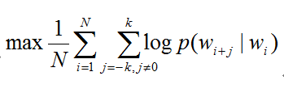
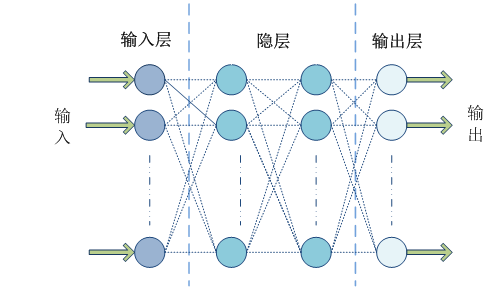
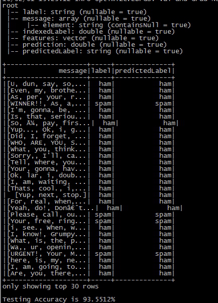

# 基于 Spark ML 的文本分类
使用 Spark ML 进行文本分析处理的基本方法和相关工具

**标签:** 分析,机器学习

[原文链接](https://developer.ibm.com/zh/articles/os-cn-spark-practice6/)

王龙

发布: 2016-03-14

* * *

## 引言

文本分类是一个典型的机器学习问题，其主要目标是通过对已有语料库文本数据训练得到分类模型，进而对新文本进行类别标签的预测。这在很多领域都有现实的应用场景，如新闻网站的新闻自动分类，垃圾邮件检测，非法信息过滤等。本文将通过训练一个手机短信样本数据集来实现新数据样本的分类，进而检测其是否为垃圾消息，基本步骤是：首先将文本句子转化成单词数组，进而使用 Word2Vec 工具将单词数组转化成一个 K 维向量，最后通过训练 K 维向量样本数据得到一个前馈神经网络模型，以此来实现文本的类别标签预测。本文案例实现上采用 Spark ML 中的词向量化工具 Word2Vec 和多层感知器分类器 (Multiple Layer Perceptron Classifier)，整体对数据的处理和模型训练采用的依然是 ML Pipeline 的方式，结构上和本系列 [第 5 部分](http://www.ibm.com/developerworks/cn/opensource/os-cn-spark-practice5/) 较为相似，相信已经阅读过本系列第 5 部分的读者应该觉得很容易理解。需要指出的是 Spark 的多层感知器分类器是在 1.5.0 版本以后加入的，所以如果读者想要尝试运行本文示例程序，请确保您的 Spark 运行环境是基于 1.5.0 或以上版本搭建的。本文案例是基于 1.6.0 版本构建并测试的。接下来，让我们首先了解一些基础知识，以此作为阅读本文的切入点。

## 关于 Word2Vec

Word2Vec 是一个用来将词表示为数值型向量的工具，其基本思想是将文本中的词映射成一个 K 维数值向量 (K 通常作为算法的超参数)，这样文本中的所有词就组成一个 K 维向量空间，这样我们可以通过计算向量间的欧氏距离或者余弦相似度得到文本语义的相似度。Word2Vec 采用的是 Distributed representation 的词向量表示方式，这种表达方式不仅可以有效控制词向量的维度，避免维数灾难 (相对于 one-hot representation)，而且可以保证意思相近的词在向量空间中的距离较近。

Word2Vec 实现上有两种模型 CBOW (Continuous Bag of Words, 连续词袋模型) 和 Skip-Gram，简单概括一下区别就是：CBOW 是根据语境预测目标单词，Skip-Gram 根据当前单词预测语境。Spark 的实现采用的是 Skip-Gram 模型。假设我们有 N 个待训练的单词序列样本，记作 w1,w2…wn, Skip-Gram 模型的训练目标是最大化平均对数似然，即



其中 N 是词个数，K 是词上下文的窗口大小。Skip-Gram 模型中一定上下文窗口内的词两两之间都会计算概率，并且通常情况下，上下文窗口越大所能涵盖的词组合情况就越全面，这样可以带来更加精确的结果，但是缺点是也会增加训练时间。

在 Skip-Gram 模型里，每个单词都关联两个向量，分别表示词向量和上下文向量。也正是因为如此，Word2Vec 较之传统的 LDA(Latent Dirichlet Allocation) 过程，可以表达更加丰富和准确的语义信息。

Word2Vec 的背后有很多数学理论和方法，有兴趣的读者可以通过继续深入研究相关论文，或者 Google 的官方 [Word2Vec 项目地址](https://code.google.com/p/word2vec/) 。

Spark 的 Word2Vec 实现提供以下主要可调参数：

- inputCol , 源数据 DataFrame 中存储文本词数组列的名称。
- outputCol, 经过处理的数值型特征向量存储列名称。
- vectorSize, 目标数值向量的维度大小，默认是 100。
- windowSize, 上下文窗口大小，默认是 5。
- numPartitions, 训练数据的分区数，默认是 1。
- maxIter，算法求最大迭代次数，小于或等于分区数。默认是 1.
- minCount, 只有当某个词出现的次数大于或者等于 minCount 时，才会被包含到词汇表里，否则会被忽略掉。
- stepSize，优化算法的每一次迭代的学习速率。默认值是 0.025.

这些参数都可以在构造 Word2Vec 实例的时候通过 setXXX 方法设置。

## 关于多层感知器

多层感知器 (MLP, Multilayer Perceptron) 是一种多层的前馈神经网络模型，所谓前馈型神经网络，指其从输入层开始只接收前一层的输入，并把计算结果输出到后一层，并不会给前一层有所反馈，整个过程可以使用有向无环图来表示。该类型的神经网络由三层组成，分别是输入层 (Input Layer)，一个或多个隐层 (Hidden Layer)，输出层 (Output Layer)，如图所示：

##### 图 1\. 多层感知器模型



Spark ML 在 1.5 版本后提供一个使用 BP(反向传播，Back Propagation) 算法训练的多层感知器实现，BP 算法的学习目的是对网络的连接权值进行调整，使得调整后的网络对任一输入都能得到所期望的输出。BP 算法名称里的反向传播指的是该算法在训练网络的过程中逐层反向传递误差，逐一修改神经元间的连接权值，以使网络对输入信息经过计算后所得到的输出能达到期望的误差。Spark 的多层感知器隐层神经元使用 sigmoid 函数作为激活函数，输出层使用的是 softmax 函数。

Spark 的多层感知器分类器 (MultilayerPerceptronClassifer) 支持以下可调参数:

- featuresCol:输入数据 DataFrame 中指标特征列的名称。
- labelCol：输入数据 DataFrame 中标签列的名称。
- layers:这个参数是一个整型数组类型，第一个元素需要和特征向量的维度相等，最后一个元素需要训练数据的标签取值个数相等，如 2 分类问题就写 2。中间的元素有多少个就代表神经网络有多少个隐层，元素的取值代表了该层的神经元的个数。例如 **val** layers = Array [Int](100,6,5,2)。
- maxIter：优化算法求解的最大迭代次数。默认值是 100。
- predictionCol:预测结果的列名称。
- tol:优化算法迭代求解过程的收敛阀值。默认值是 1e-4。不能为负数。
- blockSize:该参数被前馈网络训练器用来将训练样本数据的每个分区都按照 blockSize 大小分成不同组，并且每个组内的每个样本都会被叠加成一个向量，以便于在各种优化算法间传递。该参数的推荐值是 10-1000，默认值是 128。

算法的返回是一个 MultilayerPerceptronClassificationModel 类实例。

##### 图 2\. MultilayerPerceptronClassifer 训练过程源码


接下来，笔者将对上面方法的每一行做一下简要的解释，以便读者能更清楚这个过程。

- 162-163 行从算法输入参数 layers 数组中获取最后一个元素，即样本数据 label 的个数。
- 164 行从输入的数据集中提取 featuresCol 和 labelCol 对应的数据列，然后将每一行数据转化成一个 LabeledPoint 对象，最终数据集作为一个 RDD 返回。
- 165 行对 164 行返回的 RDD[LabeledPoint] 数据集的每一个元素进行映射转化，根据样本数据预测种类标签的个数对 LabledPoint 数据中的 label 进行重新编码，使之成为一个新的 label 向量，这个向量除了 label 对应的位置为 1.0 外，其余元素都是 0.0。
- 166 行根据输入参数 layers 设定的网络结构层次创建一个前馈型神经网络的拓扑结构，并使用 softmax 作为输出层的激活函数。
- 167 行根据网络拓扑结构，输入层和输出层的信息 (即训练样本的向量维度和预测标签的取值个数) 创建一个前馈神经网络训练器实例。
- 168-169 设置训练器的优化算法为 L-BFGS，并且设定相关的参数。L-BFGS 是 BFGS 拟牛顿法的一个优化版本，适合大规模的数值计算，算法求解过程中只保存并利用最近 m 次迭代的曲率信息来构造 hessian 矩阵逆矩阵的近似矩阵。关于 L-BFGS 算法的更多信息，请参考 [这里](https://en.wikipedia.org/wiki/Limited-memory_BFGS) 。
- 170-171 行主要是根据输入数据训练一个 TopologyModel 实例，然后根据 TopologyModel 包含的网络权重向量和已知的层次结构信息构建一个 MultilayerPerceptronClassificationModel 对象实例。有了这个模型我们就可以对新的样本数据进行所属标签预测了。

## 目标数据集预览

在引言部分，笔者已经简要介绍过了本文的主要任务，即通过训练一个多层感知器分类模型来预测新的短信是否为垃圾短信。在这里我们使用的目标数据集是来自 UCI 的 [SMS Spam Collection](http://archive.ics.uci.edu/ml/datasets/SMS+Spam+Collection) 数据集，该数据集结构非常简单，只有两列，第一列是短信的标签 ，第二列是短信内容，两列之间用制表符 (tab) 分隔。虽然 UCI 的数据集是可以拿来免费使用的，但在这里笔者依然严正声明该数据集的版权属于 UCI 及其原始贡献者。

##### 图 3\. 短信文本数据格式


## 案例分析与实现

在处理文本短信息分类预测问题的过程中，笔者首先是将原始文本数据按照 8:2 的比例分成训练和测试数据集。整个过程分为下面几个步骤

- 从 HDFS 上读取原始数据集，并创建一个 DataFrame。
- 使用 StringIndexer 将原始的文本标签 (“Ham”或者”Spam”) 转化成数值型的表型，以便 Spark ML 处理。
- 使用 Word2Vec 将短信文本转化成数值型词向量。
- 使用 MultilayerPerceptronClassifier 训练一个多层感知器模型。
- 使用 LabelConverter 将预测结果的数值标签转化成原始的文本标签。
- 最后在测试数据集上测试模型的预测精确度。

我们可以看到，整个过程我们依然是基于 Spark ML Pipeline 的思想，构建了一个机器学习的工作流，相信有了本系列第五部分的基础，读者阅读下面代码并不困难，具体请参考下面源代码。

##### 清单 1\. 示例程序源代码

```
import com.ibm.spark.exercise.util.LogUtils
import org.apache.spark.ml.Pipeline
import org.apache.spark.ml.classification.MultilayerPerceptronClassifier
import org.apache.spark.ml.evaluation.MulticlassClassificationEvaluator
import org.apache.spark.ml.feature.{IndexToString, StringIndexer, Word2Vec}
import org.apache.spark.sql.SQLContext
import org.apache.spark.{SparkContext, SparkConf}

object SMSClassifier {
final val VECTOR_SIZE = 100
def main(args: Array[String]) {
if (args.length < 1) {
println("Usage:SMSClassifier SMSTextFile")
sys.exit(1)
}
LogUtils.setDefaultLogLevel()
val conf = new SparkConf().setAppName("SMS Message Classification (HAM or SPAM)")
val sc = new SparkContext(conf)
val sqlCtx = new SQLContext(sc)
val parsedRDD = sc.textFile(args(0)).map(_.split("\t")).map(eachRow => {
(eachRow(0),eachRow(1).split(" "))
})
val msgDF = sqlCtx.createDataFrame(parsedRDD).toDF("label","message")
val labelIndexer = new StringIndexer()
.setInputCol("label")
.setOutputCol("indexedLabel")
.fit(msgDF)

val word2Vec = new Word2Vec()
.setInputCol("message")
.setOutputCol("features")
.setVectorSize(VECTOR_SIZE)
.setMinCount(1)

val layers = Array[Int](VECTOR_SIZE,6,5,2)
val mlpc = new MultilayerPerceptronClassifier()
.setLayers(layers)
.setBlockSize(512)
.setSeed(1234L)
.setMaxIter(128)
.setFeaturesCol("features")
.setLabelCol("indexedLabel")
.setPredictionCol("prediction")

val labelConverter = new IndexToString()
.setInputCol("prediction")
.setOutputCol("predictedLabel")
.setLabels(labelIndexer.labels)

val Array(trainingData, testData) = msgDF.randomSplit(Array(0.8, 0.2))

val pipeline = new Pipeline().setStages(Array(labelIndexer,word2Vec,mlpc,labelConverter))
val model = pipeline.fit(trainingData)

val predictionResultDF = model.transform(testData)
//below 2 lines are for debug use
predictionResultDF.printSchema
predictionResultDF.select("message","label","predictedLabel").show(30)

val evaluator = new MulticlassClassificationEvaluator()
.setLabelCol("indexedLabel")
.setPredictionCol("prediction")
.setMetricName("precision")
val predictionAccuracy = evaluator.evaluate(predictionResultDF)
println("Testing Accuracy is %2.4f".format(predictionAccuracy * 100) + "%")
sc.stop
}
}

```

Show moreShow more icon

## 运行示例程序

在运行程序之前，读者需要把目标数据集上传至您的 HDFS 上，并把测试程序打成 jar 包。本文的示例程序只接受一个参数，即目标文本数据文件在 HDFS 上的路径。在这笔者依然是使用命令将应用程序任务提交到 Standalone 集群上运行。

##### 清单 2\. 示例程序运行命令及参数示例 (Standalone)

```
./spark-submit --class com.ibm.spark.exercise.ml.SMSClassifier \
--master spark://<spark_master>:<port>\
--driver-memory 6g \
--executor-memory 1g \
--total-executor-cores 6 /home/fams/spark_exercise-1.0.jar \
              hdfs://<hdfs_name_node>:<port>/user/fams/mllib/SMSSpamCollection

```

Show moreShow more icon

##### 清单 3\. 示例程序运行命令及参数示例 (On YARN)

```
./spark-submit --class com.ibm.spark.exercise.ml.SMSClassifier \
 --master yarn \
 --deploy-mode cluster \
 --driver-memory 6g \
 --executor-memory 1g \
 --executor-cores 1 \
 --num-executors 6 \
/home/fams/spark_exercise-1.0.jar \
hdfs://<hdfs_name_node>:<port>/user/fams/mllib/SMSSpamCollection

./spark-submit --class com.ibm.spark.exercise.ml.SMSClassifier \
 --master yarn \
 --deploy-mode client \
 --driver-memory 6g \
 --executor-memory 1g \
 --executor-cores 1 \
 --num-executors 6 \
/home/fams/spark_exercise-1.0.jar \
hdfs://<hdfs_name_node>:<port>/user/fams/mllib/SMSSpamCollection

```

Show moreShow more icon

##### 图 4\. 示例程序运行结果预览



经笔者多次运行测试，模型预测精确度均可以达到 90%以上，不过读者依然可以以本文为基础继续寻求优化方法，以得到更高的精度。

## 结束语

本文向读者介绍了使用 Spark 进行文本分类的基本方法，虽然我们的测试数据集是英文，理论上是要比中文简单一些，因为不需要考虑分词，但是读者依然可以尝试在本文的基础上尝试中文文本的分类预测。笔者之前做过一些中文文本分词方面的学习和研究，发现 [IK Analyser](http://code.google.com/p/ik-analyzer/downloads/list) 分词效果还不错，当然关于讨论如何使用 IK Analyser 进行中文分词已经超过本文的范围，不过读者如果有兴趣的话可以在文末留下评论，我们可以一起讨论交流。笔者在描述 Word2Vec 和多层感知的过程中，尽量避免复杂难懂的数学公式和语言，希望读者可以先掌握算法的基本原理和应用场景。但是并不是这部分就不重要，要真正的弄懂算法并且领悟精髓还需要更长时间的研究和学习，这将是一件有意义的事情。由于笔者知识水平有限，文中出现纰漏在所难免，如果您在阅读过程中发现任何问题，请在留下您的意见和建议，谢谢。