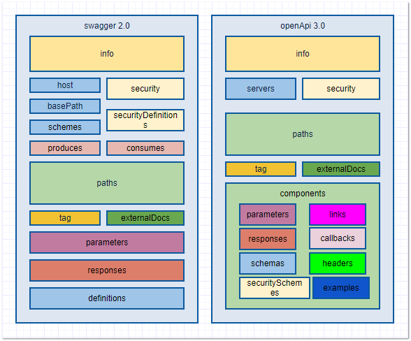
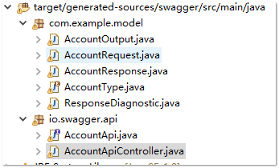
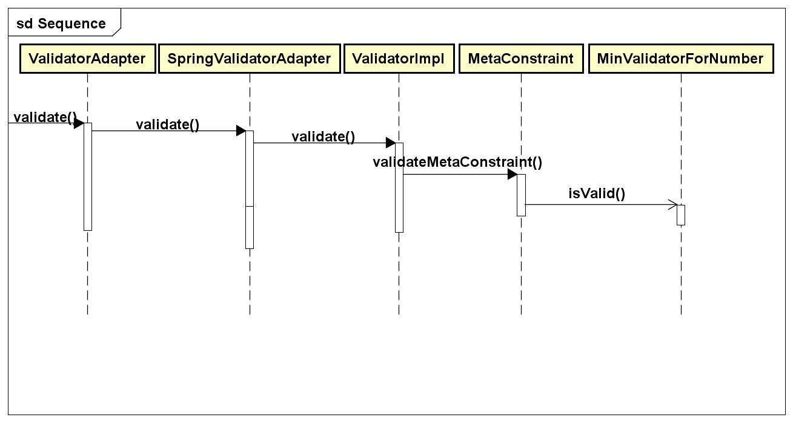

# 基于 Swagger 的 RESTful API 的定义与生成
详解 Swagger 在 Spring 中的应用

**标签:** API 管理,Java,Spring,Web 开发

[原文链接](https://developer.ibm.com/zh/articles/define-and-generate-restful-api-using-swagger/)

刘万振

发布: 2020-08-19

* * *

## Swagger 的概要介绍

Swagger 是当前很受欢迎的 API 开发的开源项目，它遵循 OpenAPI Specification（OpenAPI 规范，也简称 OAS）。Apigee，Capital One，Google，IBM, Intuit，Microsoft，PayPal，MuleSoft 等世界著名公司都支持 OpenAPI 规范。Swagger 项目由曾担任 Wordnik 首席技术官的 Tony Tam 于 2011 年启动，并在 2015 年由 SmartBear 公司收购，目前仍由 SmartBear 公司维护，Swagger 项目源码可以 [从 GitHub 下载](https://github.com/swagger-api)。

Swagger 项目提供了多种开发工具，这些工具实现了不同的功能。

- Swagger Codegen: 它可以将 RESTful API 描述文件生成 30 多个 API 客户端的代码，25 个服务器存根的代码和 API 文档。Swagger Codegen 使用的是 Contract First 的方法，API 所有者只需要创建或更新 RESTful API 描述文件（YAML 或 JSON 格式），然后利用 Swagger Codegen 生成各种编程语言的 SDK 和对应的 API 文档。下文将详细介绍如何使用 Swagger Codegen。
- Swagger Editor: 编辑 RESTful API 描述文件的编辑器，该编辑器支持实时预览描述文件的更新效果。Swagger Editor 提供了在线和本地部署两种方式。Swagger Editor 可以验证 RESTful API 描述文件是否符合 Swagger 规范，且支持不同格式的转换（YAML 转 JSON，或 JSON 转 YAML）。具体例子可以参考 [http://editor.swagger.io/](http://editor.swagger.io/)。此外，Swagger Editor 支持 RESTful API 描述文件从 Swagger 2.0 规范迁移到 OpenAPI 3.0 规范，比如在 Swagger Editor 中输入 Swagger 2.0 规范格式的内容，然后选择菜单中 **Edit**，点击 **Convert to OpenAPI 3**，即可自动完成不同版本的规范的转换。
- Swagger UI: 一个交互式的在线查看器，用于在浏览器中快速的查看 RESTful API。例子可以参考 [https://petstore.swagger.io](https://petstore.swagger.io/)。Swagger UI 支持在线和本地部署两种方式。您可以利用 Swagger UI 的 **Try it out** 生成 RESTful Service 的简单的 Request Sample，以快速的调试 API 程序。
- SwaggerHub：一种基于 OpenAPI 规范的 API 设计和文档化的平台。它集成了上面所有开发工具的各个功能，它需要会员注册，分为免费版本和收费版本。
- Swagger Inspector: 类似 postman 和 SoapUI，是 RESTful API 的测试工具。它只有收费版本。

此外 Springfox 虽不属于 Swagger 项目，但它是 OpenAPI 规范的一个 Spring 实现。它通过 Swagger 注解生成接口文档，Swagger 注解包括接口名、请求方法、参数、返回信息等等，并以在线方式展示 API 的信息。Swagger Codegen 也可以生成 Springfox 的相关简单代码。

## 基于 OpenAPI 规范定义 RESTful API

开发 RESTful API 描述文件时，需要保证描述文件符合一定的规范。在用 Swagger 开发时，API 描述文件需要遵守 OpenAPI 规范。OpenAPI 规范现在是 Linux 基金会的一个项目，其目标是为 RESTful API 定义一个标准的、与语言无关的接口，允许人和计算机在不访问源代码、额外的文档或通过网络的情况下发现和理解服务的功能。它支持两种格式：YAML 和 JSON。本文将以 YAML 格式为主详细介绍 Swagger 的使用。

OpenAPI 规范在版本 2.0 时，名字是 Swagger 规范，后来版本升级为 3.0 之后，更名为 OpenAPI 规范。Swagger 2.0 规范和 OpenAPI 3.0 规范具体细节可以参考本文的参考资源。OpenAPI 3.0 规范吸纳了开发人员的反馈建议，修正了 Swagger 2.0 规范的一些 bug，并对 Swagger 2.0 规范进行了一定的优化，同时也增加了一些重要的新特性和新内容，如下图所示。本文将详细地解释两个版本规范的差异。

**图 1\. 不同版本的规范的差异**



具体差异描述如下：

1. Swagger 2.0 规范中 `host`, `basePath`, `schemes` 合并为 OpenAPI 3.0 规范中的 `hosts/servers` 的 URL，示例如下。

    **清单 1\. Swagger 2.0 规范中 `host`, `basePath`, `schemes`**


    ```
    host:
    example.com
    basePath:
    /account/v1
    schemes:
      - https

    ```


    Show moreShow more icon

    **清单 2\. OpenAPI 3.0 规范中 `servers` 的 URL**


    ```
    servers:
    - url: https://example.com/account/v1

    ```


    Show moreShow more icon

2. Swagger 2.0 规范中 `contentType（produces，consumes`）可以应用到所有 path 或单独 path 上，而在 OpenAPI 3.0 规范中只允许应用到单独 path 上，这样设置更合理。

    **清单 3\. Swagger 2.0 规范中 `contentType`**


    ```
    produces:
      - application/json
    consumes:
      - application/json

    ```


    Show moreShow more icon

    **清单 4\. OpenAPI 3.0 规范中 `contentType`**


    ```
    /account:
        post:
          x-codegen-request-body-name: AccountRequest
          requestBody:
            content:
              application/json:
                schema:
                  $ref: '#/components/schemas/AccountRequest'
            required: true
          responses:
            200:
              description: Account Response.
              content:
                application/json:
                  schema:
                    $ref: '#/components/schemas/AccountResponse

    ```


    Show moreShow more icon

3. Swagger 2.0 规范中 `securityDefinitions` 移至 OpenAPI 3.0 规范的 `components` 并更名为 `securitySchemes`。

    **清单 5\. Swagger 2.0 规范中 `securityDefinitions`**


    ```
    securityDefinitions:
    myOauth:
        type: oauth2
        flow: implicit
        authorizationUrl: https://dummy.com
        scopes:
          readAccount:  read the account info
    Bearer:
        name: Authorization
        in: header
        type: apiKey

    ```


    Show moreShow more icon

    **清单 6\. OpenAPI 3.0 规范中 `securitySchemes`**


    ```
    components:
    securitySchemes:
        myOauth:
          type: oauth2
          flows:
            implicit:
              authorizationUrl: https://dummy.com
              scopes:
                readAccount: read the account info
        Bearer:
          type: apiKey
          name: Authorization
          in: header

    ```


    Show moreShow more icon

4. Swagger 2.0 规范中 `parameters`，`responses`，`definitions` 被移至 OpenAPI 3.0 规范的 `components` 下的 `parameters`，`responses`，`schemas`。其中 `definitions` 在 OpenAPI 3.0 规范更名为 `schemas`。

5. OpenAPI 3.0 规范增加了 links，callbacks 等高级功能。links 功能使用一个 API 的输出作为另一个 API 的输入。利用 callbacks，您可以定义订阅操作的格式以及回调消息的格式和对这些消息的预期响应，从而实现异步调用。

## 使用 Swagger Codegen 生成 RESTful API

Swagger Codegen 是 RESTful API 代码生成器，它的源码放在 [https://github.com/swagger-api/swagger-codegen](https://github.com/swagger-api/swagger-codegen)。您可以通过多种方式调用 Swagger Codegen，比如命令行方式，Docker，swagger-codegen-maven-plugin 或者 Gradle Swagger Generator Plugin，也可以通过 [https://editor.swagger.io/](https://editor.swagger.io/) 在线生成。它可以生成多种语言或框架的 API 的客户端，比如 JavaScript，Java，Spring 的 API 的客户端代码。本文侧重 Swagger 在 Spring 中的应用，并以常用 swagger-codegen-maven-plugin 调用方式来生成 Spring 的 API 的客户端。基于 Swagger 2.0 规范和 OpenAPI 3.0 规范生成 Spring 的 API 客户端的基本配置相同，只有某些细节不尽相同。

### 基于 Swagger 2.0 规范生成 Spring 的 API 客户端

基于 Swagger 2.0 规范具体配置如下：

**清单 7\. swagger-codegen-maven-plugin 配置**

```
<plugin>
    <groupId>io.swagger</groupId>
    <artifactId>swagger-codegen-maven-plugin</artifactId>
    <version>2.2.3</version>
    <executions>
        <execution>
            <id>account</id>
            <goals>
                <goal>generate</goal>
            </goals>
<configuration>             <inputSpec>${basedir}/src/main/resources/v2.yaml</inputSpec>
                <language>spring</language>
                <environmentVariables>
                    <models></models>
                    <apis></apis>
                </environmentVariables>                                    <generateApis>true</generateApis>
                <generateSupportingFiles>false</generateSupportingFiles>
                <modelPackage>com.example.model</modelPackage>
                <configOptions>
                    <dateLibrary>java8</dateLibrary>
                    <serializableModel>true</serializableModel>
                </configOptions>
            </configuration>
        </execution>
    </executions>
</plugin>

```

Show moreShow more icon

注意：当 dateLibrary 为 `java8`，日期类型生成 Java 8 的 `java.time.LocalDate`；而 `dateLibrary` 为 `joda` 时，日期类型生成 Joda 的 `org.joda.time.LocalDate`，默认的 `dateLibrary` 为 `joda`。

当 `language` 设定为 Spring 并且在 `environmentVariables` 配置 `<apis></apis>`，通过 Maven 的 `generate-resources` 或 `install` 命令，进而调用 swagger-codegen-maven-plugin，就可以生成 API 的客户端以及相关的 Bean 类。

**图 2\. API 的客户端以及相关的 Bean 类**



若想除第一次生成 API 的客户端，之后不再生成 API 的客户端，只需要将 `generateApis` 的值改为 `false`，这样每次只会生成相关的 Bean 类。

API 的客户端以及相关的 Bean 类需要引入依赖包，这些依赖包需要加入到相应的 `pom.xml`。

**清单 8\. Spring 相关依赖包**

```
<dependency>
    <groupId>io.swagger</groupId>
    <artifactId>swagger-core</artifactId>
    <version>1.6.0</version>
</dependency>

<dependency>
    <groupId>org.springframework</groupId>
    <artifactId>spring-web</artifactId>
    <version>5.2.3.RELEASE</version>
</dependency>

<dependency>
    <groupId>org.springframework</groupId>
    <artifactId>spring-context</artifactId>
    <version>5.2.3.RELEASE</version>
</dependency>

```

Show moreShow more icon

### 基于 OpenAPI 3.0 规范生成 Spring 的 API 客户端

上面的配置是针对 Swagger 2.0 规范，若 YAML 文件遵循 OpenAPI 3.0 规范，swagger-codegen-maven-plugin 配置和依赖包也需要变化。

1. swagger-codegen-maven-plugin 的 `groupId` 和 `version` 变化为 v3 相应版本，`inputSpec` 为 OpenAPI 3.0 规范的文件。

    **清单 9\. OpenAPI 3.0 规范中 swagger-codegen-maven-plugin 配置**


    ```
    <plugin>
        <groupId>io.swagger.codegen.v3</groupId>
        <artifactId>swagger-codegen-maven-plugin</artifactId>
        <version>3.0.11</version>
        <executions>
            <execution>
                <id>account</id>
                <goals>
                    <goal>generate</goal>
                </goals>
    <configuration>
    <inputSpec>${basedir}/src/main/resources/v3.yaml
    </inputSpec>
                    <language>spring</language>
                    .......
                </configuration>
            </execution>
        </executions>
    </plugin>

    ```


    Show moreShow more icon

2. 基于 OpenAPI 3.0 规范生成的 API 的客户端需要额外引入 `servlet-api` 包，这点与基于 Swagger 2.0 规范生成的 API 的客户端不同具体设置如下。

    **清单 10\. OpenAPI 3.0 规范中相关依赖包**


    ```
    <dependency>
        <groupId>io.swagger</groupId>
        <artifactId>swagger-core</artifactId>
        <version>1.6.0</version>
    </dependency>
    <dependency>
        <groupId>io.swagger</groupId>
        <artifactId>swagger-annotations</artifactId>
        <version>1.6.0</version>
    </dependency>
    <dependency>
        <groupId>org.springframework</groupId>
        <artifactId>spring-web</artifactId>
        <version>5.2.3.RELEASE</version>
    </dependency>
    <dependency>
        <groupId>org.springframework</groupId>
        <artifactId>spring-context</artifactId>
        <version>5.2.3.RELEASE</version>
    </dependency>
    <dependency>
        <groupId>javax.servlet</groupId>
        <artifactId>servlet-api</artifactId>
        <version>2.5</version>
        <scope>provided</scope>
    </dependency>

    ```


    Show moreShow more icon


### 与 Spring Validation 的整合进行代码校验

在开发 Restful API 的过程中, 往往需要对 Request 的元素做无业务关联的规则性验证，然后这些验证结果无误后，才会进入后续的业务处理。无业务关联的规则性验证包括非空，非 null，整数值的范围校验等等。这部分代码校验工作比较繁琐，费时费力，也很容易出错。

swagger-codegen 可以在生成代码时，自动生成注解，这样再结合 Spring Validation 以及 Hibernate Validator, 就可以基于 Swagger 规则的基本校验。Spring Validation 遵守 Java 的校验规范 JSR-303（javax.validator.Validator）。它需要校验规范 JSR-303 的具体实现，Hibernate validator 是它的一个实现。而 Spring Boot 会自动包含 Hibernate Validator，这样当系统使用 Spring Boot 开发，不需要额外引入其他依赖包。

下图描述了 Spring Boot，Spring Validation，Hibernate Validator 的调用关系。其中 ValidatorImpl 调用 MinValidatorForNumber 的 `isValid`，为了简化，略去一些中间不重要的环节。

**图 3\. Spring Boot、Spring Validation 和 Hibernate Validator 的调用关系**



其中：

- ValidatorAdapter：来自 `spring-boot-autoconfigure` 包
- SpringValidatorAdapter：来自 `spring-context` 包，它将 Hibernate Validator 注入到 Spring Boot 环境中。
- ValidatorImpl：来自 `hibernate-validator` 包，它实现 validation-api-1.1.0 包下的 javax.validator.Validator 接口。
- MetaConstraint：来自 `hibernate-validator` 包。
- MinValidatorForNumber：来自 `hibernate-validator` 包，具体校验逻辑在这个类完成。

在 Swagger 的 YAML 文件中的校验规则定义和由 swagger-codegen 生成的 Java 注解的对应关系，如下表所示。

**表 1\. Swagger 中的校验规则和生成的 Java 注解**

元素类别Swagger 中的校验规则定义生成的 Java 注解（遵循 JSR-303 的规则）Integer 或 Long`Minimum/maximum``@Min/ @Max`Decimal`Minimum/maximum``@DecimalMin/@DecimalMax`集合`minItems/ maxItems``@Size(min={{minItems}},max={{maxItems}})`字符`minLength/ maxLength``@Size(min={{minLength}},max={{maxLength}})`字符`pattern``@Patternregexp="{{{pattern}}}")`

其中在 YAML 文件中 `pattern` 需要符合 ECMA 262 正则表达式的规范。

利用 Spring Boot 和 swagger-codegen，您无需做太多工作，只需要添加校验不通过的处理的代码。下面是一个简单的校验不通过的处理的代码例子。

**YAML 文件:**

```
Account:
type: object
properties:
    accountId:
       type: integer
       format: int32
       minimum: 1000

```

Show moreShow more icon

**代码：**

```
ControllerAdvice
public class CustomGlobalExceptionHandler extends ResponseEntityExceptionHandler {

    // error handle for @Valid
    @Override
    protected ResponseEntity<Object> handleMethodArgumentNotValid(MethodArgumentNotValidException ex,                                                                  HttpHeaders headers,                                                                HttpStatus status, WebRequest request) {
        Map<String, Object> body = new LinkedHashMap<>();
        body.put("timestamp", new Date());
        body.put("status", status.value());
        //Get all errors
        List<String> errors = ex.getBindingResult()
                .getFieldErrors()
                .stream()
                .map(x -> x.getField() + " " + x.getDefaultMessage())
                .collect(Collectors.toList());
        body.put("errors", errors);
        return new ResponseEntity<>(body, headers, status);
    }
}

```

Show moreShow more icon

**当 accountId 小于 1000 时，运行的结果：**

```
{
    "timestamp": "2020-02-10T14:54:25.353+0000",
    "status": 400,
    "errors": [
        "accounts[0].accountId 最小不能小于 1000"
    ]
}

```

Show moreShow more icon

上面所述应用于 Spring Boot 应用程序。而对于 Sping MVC 应用程序，就稍微麻烦些，需要额外执行下面的步骤。

1. 在 Spring 的配置文件中加入 `MethodValidationPostProcessor`。

    **清单 11\. MethodValidationPostProcessor 配置**


    ```
    <bean
    class="org.springframework.validation.beanvalidation.MethodValidationPostProcessor">
    <property name="validatedAnnotationType" value="javax.validation.Valid" />
    </bean>

    ```


    Show moreShow more icon

2. 在 Controller 的输入参数，加入 `@Valid`，比如 `@RequestBody AccountRequest body`。

3. 添加 Hibernate Validator 的依赖包到 `pom.xml` 文件中。


## Swagger 使用注意事项

下面列出 Swagger 使用过程中的一些注意事项，可以方便您快速解决问题，提高开发效率。

### 充分利用 Swagger Editor

将写好的 YAML 文件内容复制到 Swagger Editor 中，若有格式错误或不符合规范，Swagger Editor 会给出相应的错误提示，根据这些提示，您就可以快速定位问题进而修正。

### swagger-codegen 对不同版本的兼容

swagger-codegen 在兼容方面做得不是很好，不同版本生成的代码会有些不同。比如对于 YAML 文件中的 required 为 false 的 Array：

- 在版本 2.2.3 生成的代码为


    ```
    @JsonProperty("accounts")
    private List<Account> accounts = null;

    ```


    Show moreShow more icon

- 在 2.2.3 之前版本生成的代码为


    ```
    @JsonProperty("accounts")
    private List<Account> accounts = new ArrayList<Account>();

    ```


    Show moreShow more icon


含有 required 属性的元素代码生成问题

在 YAML 文件，若设置某个元素为 required，元素的类别不同，swagger-codegen 生成 Bean 的代码不同。具体如下表所示。

**表 2\. 含有 required 属性的元素代码生成**

元素类别生成的 Bean 代码例子基本类型，如 Integer，Double注解为 `@NotNull``@NotNull`

`public Integer getAccountId() {`

`return accountId;`

`}`普通类注解为 `@NotNull` 和 `@Valid``@NotNull`

`@Valid`

`public AccountType getAccountType() {`

`return accountType;`

`}`集合注解为 `@Valid`，同时会构建一个空数组`@Valid`

`private List<Account> accounts = new ArrayList<>();`

### 枚举类型不要拥有相同前缀

对于枚举类型，最好不要拥有相同前缀。若前缀都相同的话，swagger-codegen 生成 Bean 的代码会比较特别，不注意这点，会出现错误。对于 swagger-codegen 的目前所有版本，都存在这个问题。

**YAML 文件：**

```
AccountType:
      type: string
      enum:
      - T_SAVING
      - T_CHECK

```

Show moreShow more icon

**生成 Bean 的代码：**

```
public enum AccountType {
    SAVING("T_SAVING"), CHECK("T_CHECK");
    .....
    }

```

Show moreShow more icon

注意 value 是 `T_SAVING`，但是 text 已变成 `SAVING`。

当改成不同前缀时，生成 Bean 的代码就不同：

**YAML 文件：**

```
AccountType:
      type: string
      enum:
      - S_SAVING
      - C_CHECK

```

Show moreShow more icon

**生成 Bean 的代码：**

```
public enum AccountType {
    S_SAVING("S_SAVING"),
    C_CHECK("C_CHECK");
    .....
    }

```

Show moreShow more icon

### produces 和 consumes 的设置

若在遵循 Swagger 2.0 规范的 YAML 文件中，`produces` 和 `consumes` 应用于所有的 path，swagger-codegen 生成 API 代码的所有 method 都会包含 `produces` 和 `consumes`。但由于 get 的 method 中 request 没有 body，API 代码不应该包含 `consumes`，这时您需要在 API 代码中手动删除 `consumes`，另一种的解决方案是单独设置每个 path 的 `produces` 和 c`onsumes`。在遵循 OpenAPI 3.0 规范的 YAML 文件文件中，`produces` 和 `consumes` 只能应用于单个的 path，可以避免这个问题。

## 结束语

本文简要介绍了 Swagger 以及它的开发工具，详细地解释了 Swagger 2.0 规范与 OpenAPI 3.0 规范的差异，然后介绍 Swagger 在 Spring 项目开发中如何生成 API 的客户端，最后结合实际经验，列出需要注意的相关事项，相信会使您对 Swagger 的应用有更深刻的掌握。