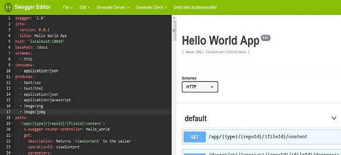
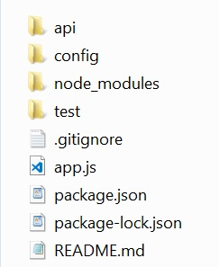
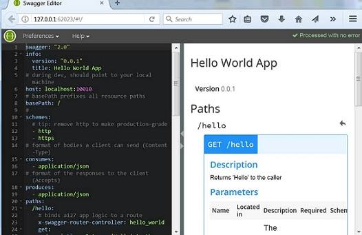

# 基于 Swagger 的前后端分离开发实践
利用 Swagger 来创建一个 Mock Server 作为前后端分离的开发工具

**标签:** Web 开发

[原文链接](https://developer.ibm.com/zh/articles/wa-separate-frontend-from-backend-developments-based-on-swagger/)

吴 超凤

发布: 2018-08-01

* * *

## 前言

前后端分离开发已经是很流行的一个开发模式。前端开发不需要部署后端语言的环境，后端开发也不需要前端写好的任何程序。后端只管暴露各种 API 接口供给前端进行数据的增、删、改、查，不负责生成 HTML 页面，这种方式能够减轻后端任务让后端开发更加专注。尤其是在微服务的开发框架下, 前后端分离开发的模式应用更加广泛。本篇亦是在微服务的开发框架下的实践总结。

在微服务开发框架下，前端通常被设计成一个独立的微服务。前后端仅仅通过接口来协作，前端服务最终生成一个独立的 Docker 镜像来部署。在产品的核心微服务定义完成后，我们希望前后端 Service 同时开始开发，所以这里我们利用 Swagger 创建了一个基于 Node.js 的 Mock Server 作为前后端分离开发的工具。在后端服务没有完全实现的情况下, 使用 Mock Server 作为前端开发的支持工具, 来实现前后端同时开发的目的。

## Swagger 综述

Swagger 是一个简单但功能强大的 API 设计表达工具。目前几乎所有的编程语言，都能支持 Swagger。Swagger 包括库、编辑器、代码生成器等很多部分，这里我们主要用到了 Swagger Editor。Swagger 可以选择使用 JSON 或者 YAML 的语言格式来编写 API 文档。我们可以用任何文档编辑器来编写 Swagger API 文档，也可以选择使用 Swagger Editor。Swagger Editor 能够提供语法高亮、自动完成、即时预览等功能，非常强大。如图 1 展示的编辑功能，当我们修改了 API 的定义之后，在编辑器右侧就可以看到相应的 API 文档了。

##### 图 1\. Swagger Editor 编辑器



我们可以使用 [在线版本](http://editor.swagger.io/) 来编辑，也可以非常简单地部署本地的 Swagger Editor，部署细节请参考 [https://swagger.io/tools/swagger-editor/](https://swagger.io/tools/swagger-editor/) 。Swagger Editor 不仅能很便捷地生成 API 文档，它还能够自动生成 Mock Server 所需要的代码。而本文实践采用的是其他生成 Mock Server 的方法，所以此处就不对自动生成 Mock Server 代码多做介绍了。

## 编写 Swagger API 文档

Swagger API 文档遵循 OpenAPI 文档定义标准。文档内容使用 key:value 的格式。

当前后端共同定义好 API 接口后, 我们就可以利用 Swagger Editor 或者其他编辑器将 API 文档写出来。比如我们希望 Mock Server 的名字是 Docs API，host 为 localhost，端口 10010，所有 API 的共同前置路径为 /docs。其中一个 Rest API 定义为：

```
URL:  /docs/note
Request:
Method: Get
Parameter: note
             Type: string
             In: path
             Required: true
Respond:
    200:  Return success message
    500:  Return error message

```

Show moreShow more icon

依据上面的需求我们开始编写 API 文档，Swagger 文档大致可以分为以下四个大的部分：

### Swagger API 版本

目前 OpenAPI 最新已经到 3.0.1 版本。本文实践采用 2.0 版本。

### 基本定义

包括 Info Object，Server Object 等等，根据产品的需要添加相应的定义。具体代码参考清单 1：

##### 清单 1\. API 文档基本定义

```
        info:
version: "0.0.1"
title: Docs API
host: localhost:10010
basePath: /docs
schemes:
  - http
  - https
consumes:
  - application/json
produces:
  - application/json
  - text/html

```

Show moreShow more icon

### Paths 模块

包括 Path Item Object，Operation Object 等等，每一个具体的 Rest API 请求需要一个 Path Item Object。根据产品的需要添加相应的定义。对应 API URL /docs/note, 具体 Path 定义代码参考清单 2：

##### 清单 2\. API 文档 Paths 模块

```
paths:
/{filename}:
    get:
      description: Returns note special resource to the caller
      parameters:
        - name: filename
          in: path
          description: resource name
          required: true
          type: string
      responses:
        "200":
          description: Success
          schema:
            required:
               - message
            properties:
              message:
                type: string
        # responses may fall through to errors
        default:
          description: Error
          schema:
            required:
               - message
            properties:
              message:
                type: string

```

Show moreShow more icon

### Definitions 模块

复杂 Object 或者公用 Object 的定义可以写在 Definitions 模块，这样可以增强 API 文档的可读性。比如我们可以把 response 中 200 和 500 的定义抽取出来，定义 2 个 definitions，然后修改 Path 对应部分的代码。具体代码参考清单 3：

##### 清单 3\. API 文档 Definitions 模块

```
definitions:
GeneralResponse:
    required:
      - message
    properties:
      message:
        type: string
ErrorResponse:
    required:
      - message
    properties:
      message:
        type: string
......

/{filename}:
    get:
     ...
      responses:
        "200":
          description: Success
          schema:
            # a pointer to a definition
            $ref: "#/definitions/GeneralResponse"
        # responses may fall through to errors
        default:
          description: Error
          schema:
            $ref: "#/definitions/ErrorResponse"

```

Show moreShow more icon

Open API 支持的内容还有很多，此处只介绍和 Mock Server 相关的部分，其他 API 文档编写请参照 [https://swagger.io/specification/](https://swagger.io/specification/) 。

## 构建 Mock Server

前后端分离的模式下, 前后端开发人员最先做的事情是定义前后端通讯的 API 接口文档。但是在只有 API 接口文档，而后端服务没有开发完成的时候，前端如何开始开发呢？我们的做法是利用 Swagger API 文档，开发一个简单的 Mock Server 给前端应用使用。

我们使用 swagger-express-mw lib 包来创建基于 Node.js 的 Mock Server，swagger-express-mw 提共一个前端基础框架，这个框架完全可以作为前端代码的开发框架，将 controller 部分实现成真正项目的代码逻辑。因为我们的项目是重构，前端代码需在原有代码基础上做开发，重点重构后端代码。所以只用其作为 Mock Server 来测试前后端的通信，controller 部分的实现只是简单的返回 Rest API 需要的固定的数据。

除了模拟 Rest API 响应，我们还可以扩展 Mock Server 提供的功能，比如加载运行前端 JavaScript 文件的功能，响应 HTTPS 请求，提供 Proxy Server 的功能，当后端完成相应的 API 开发后，Mock Server 可以将指定 API 请求转发到真正的后端 Service 服务器上。这样就可以随时测试后端新实现的 Rest API。

下面让我们来开始创建 Mock Server，以下安装启动命令全部基于 Windows 平台。

### 安装

- 安装 Node.js。Swagger 工程是基于 Node.js 的，所以需要首先安装 Node.js。关于 Node.js 细节请参照 [https://nodejs.org/en/](https://nodejs.org/en/) 。
- 安装 npm。在 Windows 平台上，安装 Node.js 的同时就会安装 npm，无须单独安装。关于 npm 细节请参照 [https://www.npmjs.com/](https://www.npmjs.com/) 。
- 安装 Swagger。运行以下命令安装 Swagger：

`# npm install -g swagger`

安装命令执行完成后，可以运行以下命令来确定 Swagger 是否安装成功：

`# swagger -V`

### 创建工程

运行以下命令，创建 Mock Server 工程：

`# swagger project create YourProjectName`

选择要创建的工程的架构，比如 express，具体请参考清单 4：

##### 清单 4\. 创建工程

```
D:\innovation>swagger project create SwaggerProject
? Framework? express
Project SwaggerProject created in D:\innovation\SwaggerProject
Running "npm install"...
npm
notice created a lockfile as package-lock.json. You should commit this file.

added 223 packages in 9.305s

Success! You may start your new app by running: "swagger project start SwaggerPr
oject"

```

Show moreShow more icon

### 工程目录介绍

进入工程根目录，我们可以看到工程结构如图 2：

##### 图 2\. 工程目录



- api 文件夹：这里又包含 controllers，helpers，mocks 和 swagger 四个文件夹。其中 controllers 用来放置响应 API 请求的 controller 文件；另外 swagger 用来放置 API 文档 `swagger.yaml` 文件。这两个是 Mock Server 用到的也是不可缺少的部分。

- config 文件夹：这里有默认创建的 `default.yaml` 文件。这个文件是 Mock Server 的默认配置文件，比如这里定义 Mock Server 去哪里找 API 文件等等，仅仅利用工程做 Mock Server 的话，我们不需要改动这个配置文件。同时你也可以将自己的配置文件放在这里。

- test 文件夹：这里包含 `api/contollers` 和 `api/helpers` 。这里是 API 文件夹对应的测试文件。
- app.js：Mock Server 的启动文件。我们可以根据自己项目的需求，在这个文件里添加代码增加 Mock Server 的功能。

### 启动工程

命令行切换到工程根目录下，运行以下命令，运行结果如清单 5。

`# swagger project start`

工程正确启动后会提示我们尝试打开链接： [http://127.0.0.1:10010/hello?name=Scott](http://127.0.0.1:10010/hello?name=Scott) 。这个链接是工程默认带的一个例子，我们可以在 `api/swagger/swagger.yaml` 文件中找到这个 API 请求的定义，以及响应这个请求的 controller。

##### 清单 5\. 启动工程

```
D:\innovation\SwaggerProject>swagger project start
Starting: D:\innovation\SwaggerProject\app.js...
project started here: http://localhost:10010/
project will restart on changes.
to restart at any time, enter `rs`
try this:
curl http://127.0.0.1:10010/hello?name=Scott

```

Show moreShow more icon

### 编辑 API 文档

工程支持在浏览器中显示、编辑、保存、测试 `api/swagger/swagger.yaml` 文档。具体步骤如下：

#### 启动在线编辑器

打开一个新的命令行窗口，运行命令: `# swagger project Edit` ，运行结果如清单 6。工程默认创建的 `swagger.yaml` 文件会在浏览器中显示，结果如图 3。

##### 清单 6\. 编辑 API 文档命令

```
D:\innovation\SwaggerProject>swagger project edit
Starting Swagger Editor.
Opening browser to: http://127.0.0.1:49965/#/edit
Do not terminate this process or close this window until finished editing.

```

Show moreShow more icon

##### 图 3\. 在线编辑 API 文档



#### 在浏览器里编辑 YAML 文件

工程支持在浏览器中直接修改 API 文档，修改的值会直接保存到 `api/swagger/swagger.yaml` 文件中。我们可以将自己项目的 Swagger API 文档保存成 YAML 格式更新到 Mock Server 中。YAML 文件编辑过后，工程会自动加载最新的 API 文档。

#### 添加关键词到 API 文档

当 API 请求被 Mock Server 拦截后，Server 通过读取 `swagger.yaml` 文件中指定的关键词的值来决定接下来要做何响应。除了定义 API 需要的关键词外，我们还需要在每个 Path 定义中加入以下两个关键词，来指定每个 API 的 controller 和 function。具体代码请参考清单 7。

- `x-swagger-router-controller` ：这个值需要设置成响应 API 请求的 controller 文件的名字。比如 controller 文件为 `hello_world.js` ， 那么关键词的值就是 hello\_world。
- `operationId` ：这个值需要设置成响应 API 请求的 controller 文件中相应的方法。

##### 清单 7\. 编辑 YAML 文档

```
/hello:
    # binds a127 app logic to a route
    x-swagger-router-controller: hello_world
    get:
      description: Returns 'Hello' to the caller
      # used as the method name of the controller
      operationId: hello

```

Show moreShow more icon

#### 测试 API 文档

API 文档编辑完成后，我们可以直接在浏览器的右侧添加参数向 Mock Server 发送 API 请求，测试 API 文档的正确性。

### 编写 controller

当 API 请求被 Mock Server 拦截后，由 controller 决定要如何响应这个 API 请求。所以需要对应所有的 API 请求，编写响应逻辑支持前端开发。需要注意的是要把响应的入口方法导出。这里有个小技巧，我们可以在 controller 的入口将请求的 URL 输出到 console 或者日志中，这样便于在开发的过程中追踪 API 请求。具体代码请参考清单 8：

##### 清单 8\. 编写 controller

```
module.exports = {  viewContent };

function viewContent(req, res) {
console.log('viewContent : url=' + req.url);
var type = req.swagger.params.type.value
var htmlPath = '';
if (type === 'text'){
    htmlPath = path.join(webStaticPath, 'html','text.html');
}
res.sendFile(htmlPath, function (err) {
        if (err) {
            console.error(err);
        } else {
            console.log('Sent:', htmlPath);
        }
    });
}

```

Show moreShow more icon

### 添加 proxy 功能

当后端代码部分 API 开发完成后，我们希望能及时对已完成代码部分进行前后端联调。这时可以给 Mock Server 添加 proxy 的功能，使 Mock Server 接到的请求都转到真正的后端服务环境上去。 这样前端就可以在开发环境中直接访问真正的后端服务，而不必担心跨域的问题。这里我们使用 `http-proxy-middleware 包来实现 proxy` 功能。

首先在 `package.json` 文件中添加 `http-proxy-middleware lib` 包，然后工程里运行以下命令安装 node module：

`# npm install`

然后修改我们的 Mock Server 的入口文件 `app.js` ，具体代码请参考清单 9：

##### 清单 9\. 添加 proxy

```
var proxy = require('http-proxy-middleware');
    /**
     * Configure proxy middleware
    */
    var targetUri = http + '://' + remoteHostName:port ;
    var routePathList = ["/docs/docsrv","/docs/api"];
    var docsProxy = proxy({
        target: targetUri,
        changeOrigin: true,
        logLevel: 'debug',
        secure: false
    })
    for(var i = 0; i  routePathList.length; i++){
        app.use(routePathList[i], docsProxy);
    }

```

Show moreShow more icon

### 支持 HTTPS

工程默认创建的 Mock Sever 为 HTTP Server，如果我们需要支持 HTTPS 请求, 可以更新 app.js 代码，支持响应 HTTPS 请求。具体代码参考清单 10：

##### 清单 10\. 支持 HTTPS

```
          var config = {
    appRoot: __dirname,
    swaggerSecurityHandlers: {
        key: fs.readFileSync('key.perm'),
        cert: fs.readFileSync('cert.perm')
    }
}
var port = process.env.PORT || 10010;
https.createServer({key: fs.readFileSync('key.perm'),
                        cert: fs.readFileSync('cert.perm')
                       }, app)
             .listen(port, function () {
                 console.log('Https Server started, pls try from browser with https://127.0.0.1:%s/docs/test !', port);
             })
    }

```

Show moreShow more icon

### 前端基于 Mock Server 开发

前端可以将自己作为静态文件加载到 Mock Server, 这样就可以直接进行前段可发调试，无须再起一个前端的 Server。具体代码请参考清单 11：

##### 清单 11\. 加载静态文件

```
app.use('/docs', express.static(appConfig.webresourcePath));

```

Show moreShow more icon

### 代码优化

鉴于我们在原有 Swagger 工程的基础上添加了其他额外的功能，比如加载前端 JavaScript 代码，支持 HTTPS 请求，转发 API 请求。我们可以提取一个自己的 config 文件，在配置文件中去设置是否加载前端 JavaScript 代码，需要加载的前端代码的路径，是否转发 API 请求，转发哪些 API 请求，API 转发的目的服务器地址、端口，支持 HTTP 或者是 HTTPS 等等。这样我们可以很容易的去改变 Mock Server 的提供的功能。

## 应用 Mock Server

Mock Server 构建完成后，我们开始使用 Mock Server 开始前端开发。首先确定你的配置文件的设置是你需要的。比如 Mock Server 是否加载前端代码，Mock Server 的响应端口，Mock Server 是否转发请求到其他 Server。比如以下是我们开发过程中用的 Mock Server 配置文件。我们使用 Mock Server 加载前端代码，指定 Mock Server 响应端口在 10010，HTTP 协议，将以 `/docs/docsrv` 和 `/docs/api` 开始的 API 请求转发到 `docsServeribm.com：80` 的 Server 上。具体代码请参考清单 12：

##### 清单 12\. 配置文件

```
{
"webresource_dir": "C:/Users/IBM_ADMIN/git/docs-webresource/docs-webresource",
"fake_data_dir": "",
"fake_server_port": "10010",
"version": "1.0.0",
"web_server": "true",
"mock": "true",
"protocol": "http",
"real_server": {
    "protocol": "http",
    "host": "docsServer.ibm.com",
    "port": "80",
    "pathList": ["/docs/docsrv","/docs/api"]
},
}

```

Show moreShow more icon

然后打开命令行运行以下命令，将 Mock Server 起动起来：

`# swagger project start`

因为 Mock Server 加载了前端代码，我们可以在浏览器中以 `http://localhost:10010/docs/index.html` 直接访问前端的入口页面。如果前端代码起在另一个 Server 上，那么需要将你将前端代码的 API 访问请求配置到 Mock Server 的上，然后访问前端的入口页面。这时已经开发好的功能应该能正常显示。如果不能正常显示，我们需要追踪出错的位置，查看对应 API 的定义调用响应各个环节是否一致，来排除 Mock Server 响应出错。比如确认代码发出的 API 请求，与 `swagger.yaml` 文件中定义的 API 是否一致，这决定了 API 是否能在 Mock Server 中被正确拦截；然后查看响应 API 的 controller 方法的逻辑，是否返回了 API 需要的假数据。如果 Mock Server 响应正确，那么这就是前端代码真正的 BUG，否则需要先修正 Mock Server 的错误。

## 结束语

使用 Swagger API 能很方便的协助实现前后端分离开发，但是需要保证 API 定义的准确和一致性。我们知道随着项目开发的不断进行，API 定义和实现很大可能上会有变更，所以需要在 API 变更的时候同时更新 Mock Server 的 API 文档。目前很多后端语言都有插件支持自动生成 Rest API 文档，所以也可以考虑后端先完成 Rest API 框架部分开发，帮助生成 Mock Server 所需要的 API 文档。这样能更好的保证 Mock Server 的准确性和可用性。