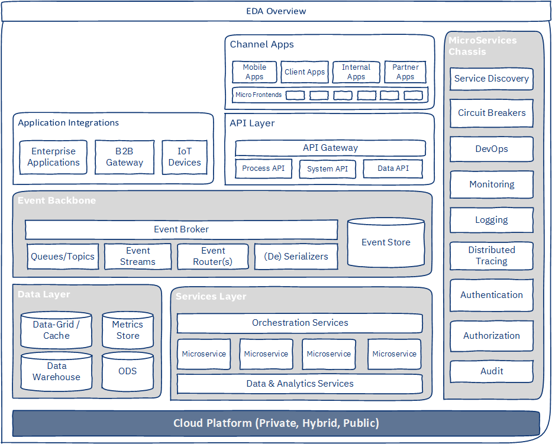
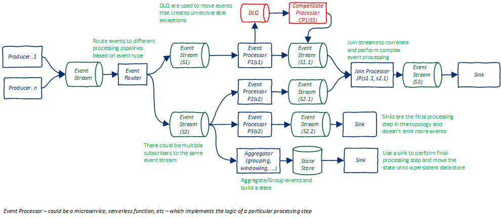
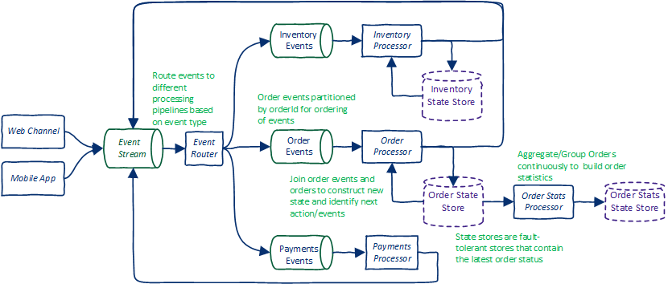

# 基于事件驱动的微服务系统的架构注意事项
使用这两种架构样式来构建具有高度可伸缩性、可用性、容错性和可扩展性的分布式系统

**标签:** Apache Kafka,IBM Event Streams,微服务,消息传递

[原文链接](https://developer.ibm.com/zh/articles/eda-and-microservices-architecture-best-practices/)

Tanmay Ambre

发布: 2020-08-05

* * *

如今，IT 系统所生成、收集和处理的数据量远超以往。而且，这些 IT 系统会处理高度复杂的流程（自动执行），并会在系统与设备之间进行跨越典型组织边界的集成。与此同时，我们期待这些 IT 系统的开发速度更快且开发成本更低，同时具有高可用性、可伸缩性和恢复能力等特点。

为了实现这些目标，开发者将使用合适的架构样式和编程范例，例如微服务、事件驱动架构、DevOps 等。利用新构建的工具和框架，可以帮助开发者实现这些预期目标。

开发者当下正结合使用事件驱动架构 (EDA) 和微服务架构样式来构建具有高度可伸缩性、可用性、容错性和并发性且易于开发和维护的系统。

在本文中，我将讨论在使用这两种架构样式来构建这些系统时的架构特性、复杂性、关注点、关键架构注意事项以及最佳实践。尽管 API、API 网关和 UI 等组件也是架构方面的重要考虑因素，但在本文中将只重点介绍事件驱动微服务。

## 事件驱动架构和微服务架构概述

**事件驱动架构 (EDA)** 已经有很长的历史。云、微服务和无服务器编程范例以及复杂的开发框架都在不断地提高 EDA 在实时解决任务关键型业务问题方面的适用性。技术和平台（例如， [Kafka](https://kafka.apache.org/)、 [IBM Cloud Pak for Integration](https://developer.ibm.com/zh/components/cloud-pak-for-integration/) 和 [Lightbend](https://www.lightbend.com/)）以及开发框架（例如， [Spring-cloud-stream](https://spring.io/projects/spring-cloud-stream)、 [Quarkus](https://quarkus.io/) 和 [Camel](https://camel.apache.org/)）都为 EDA 开发提供了一流的支持。EDA 还支持 _流式数据处理_，而在开发实时人工智能或机器学习解决方案时，这种处理必不可少。“ [事件驱动架构的优势](/articles/advantages-of-an-event-driven-architecture)”一文定义了 EDA，并解释了开发者为何要使用 EDA。

**微服务架构** 已被广泛采用，可用于下列转换项目：涉及将单体应用程序分解为自包含的独立部署服务（使用领域驱动设计来标识）的项目。可以在 [Martin Fowler & James Lewis 文章](https://martinfowler.com/articles/microservices.html) 中找到有关微服务架构及其特性的全面介绍。微服务可以公开 API，并包含一些用于生产和使用事件以便与 EDA 进行无缝集成的接口。微服务的许多特性使其很适合与 EDA 一起使用。“ [微服务架构样式面临的挑战和自身的优势（英文）](https://developer.ibm.com/articles/challenges-and-benefits-of-the-microservice-architectural-style-part-1)”一文讨论了开发者在实现微服务时面临的挑战。

下表显示了这两种架构样式如何实现互补：

**EDA****微服务架构**在组件/服务之间松散耦合可分离关注点的有界上下文可扩展单个组件可独立部署和可伸缩可独立开发处理组件支持多语言编程高度云亲和性云原生异步性质。可限制工作负载弹性伸缩可容错且提供更好的恢复能力良好的可观测性，可快速检测故障可构建处理管道性质演化可使用复杂事件代理来降低代码复杂性提供一组标准可重用技术服务（通常称为 `MicroServices Chassis`）丰富且经过验证的 [企业集成模式](https://www.enterpriseintegrationpatterns.com/)提供丰富的可重用 [实现模式](https://microservices.io/patterns/microservices.html) 代码库

通过结合使用这两种架构样式，开发者可以构建具有高度可伸缩性、可用性、容错性和可扩展性的分布式系统。这些系统可以实时使用、处理、汇总或关联大量的事件或信息。开发者可以使用行业标准的开源框架和云平台来轻松扩展和增强这些系统。

## 架构关注点和复杂性

通过结合使用 EDA 和微服务架构样式，开发者可以轻松地实现非功能性特性，例如性能、可伸缩性、可用性、恢复能力和便捷式开发。但是，这两种架构样式也会产生一些严重的问题。

其中包括下列几点：

- 大量独立部署的分布式组件或服务，这会产生以下问题：

    - 设计和实现方面的复杂性。了解和调试此类系统将非常困难。事件处理工作流程不直观，需要记录在案。
    - 多点故障。增加了测试、调试和异常处理方面的复杂性。
    - 发布流程、部署和系统监视都变得很复杂，需要实现高度自动化。
    - 从开发角度来看，需要在实现方式、符合设计和实现标准方面保持一致。但是，有多个开发小组。这可能导致实现方式不一致以及质量问题。因此，需要开发一种参考架构，用于描述架构模式的用法、开发框架、如何开发可重用服务或实用程序，以及如何设置强大有效的治理模型。
- 与同步处理相比，由于存在与事件排序或定序、回调和异常处理相关的要求，因此异步事件处理的难度更大一些。

- 丢失信息或事件是不可取的（这一点显而易见）。对于具有超高可用性、可伸缩性和容错性的系统而言，这些要求尤为重要，这使得系统的设计和部署变得相当复杂。事件生产者和使用者必须设计为具备容错能力、重放失败事件的能力以及删除重复数据的能力。

- 缺乏对分布式事务的支持。这一问题意味着，开发者必须建立跨多个分布式系统的复杂的自定义回滚和恢复机制。

- 保持数据一致性。由于分布式性质并且存在多个记录系统，因此维护数据一致性非常复杂。在大多数情况下，由于缺乏跨多个分布式系统的原子事务，上述问题最终会演变为一致性问题。

- 事件使用者和生产者必须考虑特定于产品且要用于事件代理和数据缓存等的属性。例如，交付保证会影响生产者和使用者的设计。


## EDA-微服务系统的架构蓝图

下图显示了基于 EDA-微服务的企业系统的架构图。为了更清楚地展示架构，某些微服务组件和类型是单独显示的。



该蓝图中的 EDA 和微服务特定组件包括：

- **[Event backbone（事件主干）](https://www.ibm.com/cloud/architecture/architecture/practices/event-driven-event-backbone-architecture)**。事件主干主要负责事件的传输、路由和序列化。它可以提供用于处理事件流的 API。事件主干提供了对多种序列化格式的支持，并且会对架构质量（如容错、弹性伸缩、吞吐量等）产生重大影响。也可以存储事件以创建 _事件存储_（event store）。 [事件存储](https://martinfowler.com/eaaDev/EventSourcing.html) 是一种提供恢复能力的关键架构模式。

- **Services Layer
    （服务层）**。服务层包括微服务、集成以及数据和分析服务。这些服务将通过多个接口（包括 REST API、UI）或作为 EDA 事件生产者和使用者公开其功能。服务层还包括特定于 EDA 的服务，这些服务可解决跨领域问题，例如编排服务、流数据处理服务等。

- **Data Layer
    （数据层）**。数据层通常由两个子层组成。在此蓝图中没有显示微服务独有的数据库。

    - _Caching layer
        （缓存层）_，用于提供分布式和内存中数据缓存或网格，以便提高性能并支持 CQRS 等模式。它可进行水平伸缩，而且具备一定程度的复制能力和持久性，因此提供了恢复能力。
    - _Big data layer
        （大数据层）_，由数据仓库、ODS、数据集市和 AI/ML 模型处理组成。

– **Microservices Chassis
（微服务机箱）**。 微服务机箱提供了系统各个层所需的必要技术和跨领域服务。它还提供了开发和运行时功能。通过使用微服务机箱，不仅可以降低设计和开发的复杂性以及运营成本，而且可以缩短产品上市时间、提供高质量的交付产品并可管理大量微服务。

- **Deployment Platform
    （部署平台）**：应当使用具有恢复能力、优化成本和易用性的安全云平台。开发者应尽量多地使用 PaaS 服务，以便降低维护和管理开销。该架构还应提供混合云设置，因此应考虑使用 [RedHat OpenShift](https://www.openshift.com/) 等平台。

## 关键架构注意事项

架构注意事项会影响系统的架构。我们将根据这些注意事项来制定架构决策。这些注意事项会对系统的非功能性特性产生重大影响。以下架构注意事项对于基于事件驱动的微服务系统极为重要：

- 架构模式
- 技术堆栈
- 事件建模
- 处理拓扑
- 部署拓扑
- 异常处理
- 利用事件主干功能
- 安全性
- 可观测性
- 容错性和响应能力

### 架构模式

对于基于事件驱动的微服务系统，选择架构模式和集成模式是架构方面的一个关键注意事项。它们可以提供经验证和测试的解决方案来满足多种架构质量要求。以下架构模式对于开发基于事件驱动的微服务系统极为有用：

- [管道和过滤器](https://www.enterpriseintegrationpatterns.com/patterns/messaging/PipesAndFilters.html)
- [分阶段的事件驱动架构 (SEDA)](https://github.com/mdwelsh/mdwelsh.github.io/blob/master/papers/seda-sosp01.pdf)
- [事件溯源](https://ibm-cloud-architecture.github.io/refarch-eda/patterns/event-sourcing/)
- [命令查询职责分离 (CQRS)](https://ibm-cloud-architecture.github.io/refarch-eda/patterns/cqrs/)
- [SAGA](https://ibm-cloud-architecture.github.io/refarch-eda/patterns/saga/)
- [流处理](https://ibm-cloud-architecture.github.io/refarch-eda/patterns/realtime-analytics/)
- [微服务机箱](https://microservices.io/patterns/microservice-chassis.html)
- [死信队列 (DLQ)](https://ibm-cloud-architecture.github.io/refarch-eda/patterns/dlq/)

另外，许多 [企业集成模式](https://www.enterpriseintegrationpatterns.com/) 和 [微服务模式](https://microservices.io/patterns/) 都为基于事件驱动的微服务系统提供了构建块。

您需要根据系统的需求和架构质量要求来选择模式。

### 技术堆栈

基于事件驱动的微服务系统的技术主干包括各种组件，例如，事件代理、数据缓存或网格、微服务框架、安全机制、分布式数据库、监视系统和警报系统。该主干支持关键架构质量（性能、可用性、可靠性、运营成本、容错等），并简化了开发。它还会影响多个设计和开发决策。

在选择技术堆栈时，考虑以下特性：

- 各个组件的 **水平可伸缩性**。伸缩操作不应影响可用性。即，添加节点应该不需要停机。
- 各个组件的 **高可用性**。所选产品或框架应支持集群，可具有跨不同可用性区域或地区的成员，支持滚动升级，支持数据复制，并且应具有容错能力，这意味着集群在节点丢失的情况下应重新均衡自身。
- **云亲和性**，这意味着可以轻松部署到云上。实际上，最好是在 PaaS 平台上以服务形式提供这些组件，因为这可以减少管理和维护开销。必须支持容器化。
- **运营成本低**，这意味着它应该能够在普通硬件上运行，并且在 CPU、内存和存储方面应该要求不高。
- **可配置性**，并且可以在不停机的情况下调整行为和非功能性特性。
- **可管理性**。
- 应避免 **供应商锁定**。选择基于开放标准的产品或开源产品。选择开源产品时，需要考虑该产品的使用范围，是否拥有蓬勃发展的开发者社区，并且许可证应该是开放的且不能受到严格限制（例如 Apache License V2.0）。
- 事件代理和开发框架应支持以下项：
    - 多种序列化格式（JSON、AVRO、Protobuf 等）
    - 异常处理和死信队列 (DLQ)
    - 流处理（包括对聚合、联接和窗口化的支持）
    - 分区和保留事件顺序
- 最好能支持 **反应式编程**。
- 事件主干中最好能支持 **多语言编程**。

下表列出了各个组件的常见选择：

组件类型选择事件主干[Apache Kafka](https://kafka.apache.org/)，集成平台，比如 [IBM Cloud Pak for Integration](https://developer.ibm.com/zh/components/cloud-pak-for-integration/)、 [Lightbend](https://www.lightbend.com/) 和 AWS Eventbridge + Kinesis微服务开发框架Spring 框架，比如 [spring-boot](https://spring.io/projects/spring-boot)、 [spring-cloud-stream](https://spring.io/projects/spring-cloud-stream)、 [Quarkus](https://quarkus.io/) 和 [Apache Camel](https://camel.apache.org/)数据缓存/网格[Apache Ignite](https://ignite.apache.org/)、 [Redis](https://redislabs.com/redis-enterprise/use-cases/caching/)、 [Ehcache](https://www.ehcache.org/)、 [Elasticsearch](https://www.elastic.co/elasticsearch/) 和 [Hazelcast](https://hazelcast.org/)可观测性[Prometheus](https://prometheus.io/) \+ [Grafana](https://grafana.com/)、 [ELK](https://www.elastic.co/what-is/elk-stack)、 [StatsD](https://github.com/statsd/statsd) \+ [Graphite](https://graphiteapp.org/)、Sysdig、AppDynamics 和 Datadog

### 事件建模

事件建模包括定义事件类型、事件层次结构、事件元数据和有效负载模式。仔细考虑事件建模的以下特征：

- **事件类型**。在企业系统中，存在多个业务领域，每个领域都会使用和生成不同类型的事件。建模的一个关键方面是确定事件类型和事件。使用领域驱动的设计和实践，例如 [事件风暴](https://www.ibm.com/cloud/architecture/architecture/practices/event-storming-methodology-architecture) 和 [事件源](https://www.ibm.com/cloud/architecture/architecture/practices/event-driven-sources-architecture)，以确定事件并对其进行分类。事件类型本质上可以是分层的，这有助于采用分层方法来处理事件。根据所有业务需求来定义事件类型和事件，并将它们映射到不同的业务流程或工作流程。事件类型的粒度对于避免组件之间的紧密耦合至关重要。事件类型是定义路由规则的关键。

- **事件模式**。事件模式由事件元数据（例如类型、时间、源系统等）和有效负载（即信息，由事件处理程序进行处理）构成。事件类型通常用于路由目的。事件元数据通常用于对事件进行关联和排序，但也可用于审核和授权目的。有效负载将影响队列、主题和事件存储的大小，还会影响网络性能、（反）序列化性能和资源利用率。避免重复内容。您始终可以通过在需要时重放事件来重新生成状态。

- **版本控制**。需求和实现方式会随时间推移而发生变化，它们通常会影响事件模型。对事件模型的更改可能会影响太多的微服务。同时更改所有受影响的服务是不现实的。因此，事件模型应支持多个版本并能够向后兼容，以便可以在方便的时候更改微服务。最好是将新属性添加到有效负载中，而不是更改现有属性（将其弃用，而不是更改）。版本控制将取决于序列化格式。

- **序列化格式**。有多种序列化格式可用于编码事件及其有效负载，例如 [JSON](https://en.wikipedia.org/wiki/JSON)、 [protobuf](https://en.wikipedia.org/wiki/Protocol_Buffers) 或 [Apache Avro](https://en.wikipedia.org/wiki/Apache_Avro)。这里需要重点注意的是模式演化支持、（反）序列化性能和序列化大小。由于事件消息是人类可读的，因此开发和调试 JSON 非常容易，但是 JSON 的性能不高，并且可能需要更多的事件存储容量。虽然 Avro 或 Protobuf 减小了有效负载的大小、速度很快并且支持模式演化，但是它们需要完成额外的设计和开发工作。

- **分区**。事件分区对于提高并发性、可伸缩性和可用性非常重要。分区也是消息排序的关键。从架构的角度来看，选择分区键很重要。粗粒度的键将影响可伸缩性和并发性。细粒度的键可能对保留事件顺序毫无帮助。在像 Kafka 这样的事件代理中，分区会限制事件使用者的可伸缩性。

- **排序**。某些事件可能需要根据其到达时间进行排序（至少对于给定实体是这样的）。例如，给定帐户的帐户事务必须按顺序进行处理。确定需要排序的事件很重要。排序只能在必要时使用，因为排序会影响性能和吞吐量。在 Apache Kafka 中，事件的顺序与分区直接相关。

- **事件持久性**。 持久性是指事件在队列或主题中可供使用的时间长度。例如，是否应在事件被使用后立即将其删除。删除超过了所配置的保留期的事件。删除具有显式标记（例如 Kafka 中的墓碑标记）的事件。根据要求，应选择并配置其中一种标记。使用基于时间的保留期时，需要考虑事件可供重放（在需要时重放）的时间长度。如果正在使用事件存储模式，则必须额外考虑一个问题，即同一事件或有效负载需要维护的版本数量。事件代理（例如 Kafka）提供了多个配置选项，可以在主题级别设置这些选项以指定事件的持久性。


### 事件处理拓扑

在 EDA 中，处理拓扑是指如何组织生产者、使用者、企业集成模式以及主题和队列来提供事件处理能力。它们主要是事件处理管道，其中使用企业集成模式以及队列和主题将功能逻辑（处理器）的各个部分连接在一起。处理拓扑由 SEDA、EIP 以及“管道和过滤器”模式组成。对于复杂的事件处理，可以将多个处理拓扑相互连接在一起。

处理拓扑的另一个关键概念是“编排和编制”。 _编排_ (Orchestration) 是指使用中央编排程序的处理方式，其通过调用不同的组件来编排处理工作流程。当需要对处理进行严格控制时，就可以选择编排，例如用于付款处理。通常在采用 SAGA 模式的情况下使用编排。编排需要在性能和可用性之间进行权衡（因为编排程序可能会成为单一故障点）。 _编制_ (Choreography) 是指一种完全去中心化的处理方式。即，先发布事件，然后感兴趣的组件可以订阅主题。没有中央组件来控制处理流程。编制的实现和维护十分复杂。

创建处理拓扑时，考虑以下准则：

- 应使用持久队列和主题来连接处理阶段（处理器）。
- 针对每个队列或主题配置分区键和消息保留策略。
- 处理的粒度很重要。如果处理器的粒度太细，则处理器之间可能会紧密耦合。理想情况下，各个处理器在逻辑上应相互独立。
- 微服务可用于实现处理器。这支持松散耦合、职责分离和便捷式开发。
- 应该可在处理器级别配置处理并发性。
- 使用经验证的企业集成模式 (EIP)。选择要为 EIP 提供内置支持的开发框架，例如 Apache Camel 或 Spring-cloud-stream。
- 构建模块化和分层的处理拓扑，以便通过组装简单处理管道来实现复杂的事件处理。这有助于将实现方式模块化并简化更新过程。
- 如果处理器具有状态（随事件而发生变化），考虑在存储器中存储状态，以便提高容错性和可恢复性。

诸如 [处理事件流](https://www.ibm.com/cloud/architecture/architecture/practices/event-driven-sources-architecture) 和 [事件受管状态](https://www.ibm.com/cloud/architecture/architecture/practices/event-driven-event-managed-state-architecture) 的架构实践可用于设计处理拓扑。在定义处理拓扑时，最好详细了解事件代理的能力。例如，Kafka 流可以为定义事件流处理拓扑提供一流的支持。对事件流执行聚合和联接操作时，Kafka 还自动支持状态存储。

下图描绘了处理拓扑的蓝图。



下图描绘了用于在线购物的简化版订单处理拓扑。路由器还可以将事件动态路由到多个主题。另注意，事件处理器还提供了“事件过滤器”，用于根据上下文控制事件的使用和生成。


### 部署拓扑

在 EDA-微服务架构中，需要部署大量组件。应根据与可伸缩性、可用性、恢复能力、安全性和成本有关的架构要求来选择一种部署拓扑。但是，需要在冗余性、性能和成本之间进行权衡。部署到云上会使得该架构的性能、恢复能力和成本效益进一步提高。应该使用云部署（例如 Kubernetes 中的 `high availability` 设置）提供的功能。

在考虑部署拓扑时，考虑以下主要原则：

- 每个已部署的组件都可独立伸缩，并作为集群进行部署，因此可以提高并发性和恢复能力。

- 确保每个集群跨越多个可用性区域。如果数据中心发生故障，此设置可提供更强的恢复能力。这样做的另一个好处是，可以跨不同的可用性区域或地区进行 active-active 部署模式，而不是使用被动灾难恢复。

- 复制因子将确定事件或信息的副本数。如果没有复制，单个实例（甚至是集群）的失败也会导致数据丢失。事件代理和数据库尤其需要使用复制。但是，复制会导致计算和存储开销。应根据可用性区域、数据区域、节点数等因素来设置复制。

- 就 Kafka 而言，主题分区数决定了使用者并发性的上限。

- 工作负载限制。配置线程池以及使用者和生产者的实例数以限制吞吐量。根据下游处理器的数量和吞吐量，需要相应地调整这些参数。

- 数据压缩。如果有效负载大小很大且 CPU 可用性很高，则可以使用压缩在传输之前压缩事件。在权衡了网络利用率和 CPU 利用率之后，我们选择了压缩。

- 数据加密。根据组织中的安全标准，在事件代理与生产者和使用者（以及您的数据库）之间配置 TLS、身份验证和授权。注意，启用 TLS 可以提高 CPU 利用率。


此外，务必要支持自动部署、自动故障转移、滚动升级或蓝绿色部署以及配置外部化，以便为部署工件营造独立的环境。

### 异常处理策略

在 EDA 中，拥有全面统一的异常处理策略对于提高恢复能力非常重要。异常处理策略包含以下全部或部分内容：

- 记录异常
- 按指定的重试间隔，将事件重试指定的次数
- 如果用完了所有重试机会，则将事件移至死信队列（或停止事件处理）
- 引发警报
- 在某些情况下生成事件
- 纠正异常并重放事件

异常有两种类型：业务异常和系统异常。验证或业务条件失败时，将引发业务异常。系统异常是一种范围很广的故障类别，原因包括组件（数据库、事件代理或其他微服务）不可用、资源问题（如 “OutOfMemory” 错误）、与网络或传输相关的问题（如有效负载序列化或反序列化错误）或意外的代码故障（例如 “NullPointerException” 或 “ClassCastException”）。

根据异常的不同类型，处理的方法也有很大不同。下面列出了一些异常处理机制：

- 预期的业务异常通常在代码中进行处理。处理可能涉及记录异常，更新实体及其状态，生成异常事件或使用异常并继续。

- 重试将无法解决由于有效负载无效而导致的异常（包括序列化或反序列化问题）。此类事件在 Kafka 中被称为 `poision pills` （“毒药丸”）（因为它们阻止了该分区的后续消息）。此类事件可能需要人为干预。建议将它们移到死信队列 (DLQ) 中。DLQ 使用者应允许更正和重放事件。

- 由于组件不可用而导致的系统异常基本上都是暂时的。因此，应配置多次重试。另一个关键配置参数是退避乘数。它用于使连续重试之间的时间间隔呈指数增长。对于重试后故障仍然存在的情况，不同的框架会使用不同的策略。例如，Camel 会将事件移到 DLQ 中。Kafka 流将停止处理。在这种情况下，建议使用框架的默认行为。

- 资源问题（例如 “OutOfMemory” 错误）通常在组件级别出现，并且会导致组件不可用。由于事件代理具有容错性，因此丢失事件的风险极小。此外，在 Kubernetes 环境中部署时，新的 Pod 将启动以取代发生故障的 Pod。

- 如果数据一致性非常重要且处理涉及多个微服务，则应使用 SAGA 模式。对于数据一致性要求非常严格的事件，使用 SAGA 模式。

- 应该从一开始就考虑恢复和重放，而不是事后考虑（因为后来会变得极为复杂）。通常是以自定义方式开发恢复和重放组件，这些组件因事件处理而异。最简单的重放组件可能只是获取失败的事件，然后将其重新发布到输入主题中。


您的开发框架应支持在所有微服务中实施统一的异常处理策略。您的开发框架应该为业务异常提供一组预定义的异常类，并提供一个通用异常处理程序，此处理程序可以使用配置进行自定义，但会制定与异常处理相关的架构决策。大多数开发框架都会提供这种支持。但是，它们需要进行正确配置或扩展才能提供所需的功能。

### 事件主干的功能和约束

不同的事件主干产品或平台为架构质量提供不同的支持。同时，它们对设计和架构施加了约束。在定义架构时，应考虑其功能和约束条件，以有效解决非功能性需求。例如，以下是 [Kafka](https://kafka.apache.org/) 的一些重要功能和约束。

- Kafka 支持基于分区键的事件排序。它还可以确保有单个使用者（线程）正在侦听分区。这样便可以轻松对事件进行排序：只需选择适当的分区键即可。例如，`OrderId` 用作分区键时，可确保与特定订单相关的所有事件都按照其到达顺序进行处理。
- Kafka 支持生产者的“幂等性”。这意味着 Kafka 可确保生产者生成事件一次且仅生成一次。开发者无需担心这一点。
- Kafka 提供“至少一次”交付保证。这意味着使用者应该能够处理重复的消息。开发者需要注意其事件代理提供的保证。
- Kafka 的另一个重要方面是面向使用者的“补偿提交”策略，这可以表明事件是自动还是手动确认的。如果启用了自动提交，则产生错误的事件可能已经丢失（如果使用了异常），或者使用者可能会看到重复的消息。可以使用手动提交来解决此问题，但需要编写额外的代码。除了手动/自动提交之外，某些框架（例如，与 Kafka 无缝协作的 spring-cloud-stream）还提供了如下选项：在发生错误时不自动提交，或者将失败的事件移到 DLQ 中。这是设计过程中必须考虑的一个重要方面。
- Kafka Streams 提供了处理事件流，并可以轻松地对事件流执行各种高级和复杂操作（如聚合和联接）。这样便可以轻松地实时执行分析。例如，计算按各种维度分组的事件的 _实时_ 统计信息只需要编写很少的代码。这些是有状态的操作，并且会保持某种状态。Kafka 还通过 _状态存储_ 来提供自动容错功能。

## 安全性

开发者必须考虑 EDA 微服务架构安全性的以下方面：

- 传输级别的安全性
- 对事件生成和使用进行经过身份验证和授权的访问
- 用于事件处理的审核跟踪
- 数据安全性（例如授权访问和加密存储）
- 消除代码中的漏洞
- 外围安全设备和模式

### 可观测性

可观测性包括监视、记录、跟踪和警报。系统的每个组件都应该具有可观测性，这样可避免发生故障并能够从故障中快速恢复。

大多数 EDA 产品和开发框架都通过以下方式来支持可观测性：发布可导出到行业标准可观测性工具（例如 Prometheus 和 Grafana、ELK、StatsD 和 Graphite、Splunk 或 AppDynamics）的指标。例如，Apache Kafka 提供了详细的指标，可以将其导出并与上面的大多数工具相集成。此外，用于为事件主干 (IBM Event Streams) 提供托管服务的云平台都提供了一流的可观测性支持。诸如 Spring 或 Camel 之类的微服务开发框架全面支持用于监视的代码工具。

从 EDA 的角度来看，必须检测生产者和使用者的代码，以便发布指标、发布事件代理指标并通过指标仪表板将其关联，因为 EDA 中的分布式组件数量很多。从 EDA 角度来看，关键指标包括传入和传出消息的速率、使用延迟、网络延迟、队列和主题大小等。

要监视微服务，参阅我发表的“ [监控 Spring Boot 微服务（英文）](https://developer.ibm.com/tutorials/monitor-spring-boot-microservices/#)”一文，以获取有关检测和监视微服务的详细教程。

### 容错能力和响应能力

为了提供足够的 **容错能力**，该架构需要提供冗余性、异常处理和弹性伸缩（在超出阈值时向上扩展，在负载恢复正常时向下扩展）。借助 EDA 和云，可以轻松实现其中的大多数目标。事件主干通过支持队列和主题的集群和复制来提供容错能力。生产者和使用者可以部署多个实例。当作为容器部署在 Kubernetes 平台上时，可以通过自动伸缩（使用 horizontal pod auto-scaler）轻松实现弹性伸缩，但是必须为生产者和使用者设计异常处理。

尽管基于 EDA 的系统通过分阶段的架构提供了恢复能力，但是快速的 **故障响应和恢复** 对于避免延迟和一致性问题至关重要。为了实现这种快速恢复，您需要：

```
* 实现启动和停止实例以及重新启动失败实例的自动化，可以在基于 Kubernetes 的平台（例如 Red Hat OpenShift）中轻松配置
* 在发生故障时发出警报和事件
* 定义明确的事件管理流程
* 提供日志，并且可以通过跟踪关联多个组件之间的日志。需要在微服务中启用跟踪。可以使用诸如 spring-sleuth 之类的开发框架进行跟踪。对于日志聚合，可以使用 ELK 或 Splunk 之类的工具。这有助于团队快速确定根本原因并解决问题。

```

Show moreShow more icon

## 结束语

开发者可以结合使用事件驱动架构和微服务架构样式来开发具有高可用性、容错性且高吞吐量的分布式系统。这些系统可以处理大量信息，并且具有极高的可伸缩性。但是，在构建这样的系统时，开发者必须考虑许多架构问题和复杂性，并制定一些关键的架构决策。在本文中，已经讨论了关键的架构决策以及制定这些决策需要考虑的因素。按照本文中的指导，您可以定义一个强大的 EDA-微服务架构来实现预定目标。

本文翻译自： [Architectural considerations for event-driven microservices-based systems](https://developer.ibm.com/articles/eda-and-microservices-architecture-best-practices/)（2020-07-10）