# 基于大数据的中文舆情分析
助力企业洞察商机

**标签:** 分析,数据科学

[原文链接](https://developer.ibm.com/zh/articles/bd-1404optionanalysis/)

张艺帆, 王永, 郭辉

发布: 2014-04-21

* * *

## 引言

社交媒体发展日益瞩目，博客、微博社交网络等悄然改变着人们的生活方式。微博，微信，包括天猫，京东等用户日益增多，用户主动发布的微博或者评论数量十分可观。在这个社会化的媒体时代，用户成为企业最好的品牌推广大使。如何从这些可观的数据中分析出用户的潜在且准确的购物意愿及用户需求，将成为提高品牌价值和声誉，改善用户体验的新兴途径。

曾有很多营销方法来向用户推送优惠或者打折信息，但准确程度十分低，甚至还出现错误推送及分析等。本文将通过数据分析和零售案例来说明中文舆情分析的可行性，基于 Hadoop 平台的文本分析以及大数据存储数据库 Db2 BLU（Big data，Lightening fast，Ultra easy），提高分析的准确度。

## 互联网舆情分析

### 背景

21 世纪是数据信息大发展的时代，移动互联、社交网络、电子商务等极大拓展了互联网的边界和应用范围，各种数据正在迅速膨胀并变大。互联网（社交、搜索、电商）、移动互联网（微博）、物联网（传感器，智慧地球）、车联网、GPS、医学影像、安全监控、金融（银行、股市、保险）、电信（通话、短信）都在疯狂产生着数据。社交媒体时代，通过互联网平台表达社情民意，体现用户的意愿，评论和态度。从古代的“防民之口甚于防川”，到如今的网络时代，“人人都有了自己的麦克风”。舆情，就是一个风向标。舆情分析，就是针对民众态度的收集和整理，发现相关的意见倾向，客观反映舆情状态。

海量的数据隐含着巨大的信息。例如亚马逊上的用户对某商品的评论，商家可以根据用户的评论和反馈为用户提供定制性的服务，甚至可以预测用户的需求，从而达到更加准确的销售目的；例如新浪微博上粉丝过万的大型零售商等，也可以根据用户发表的微博，微话题，签到地点为用户定制性的推送优惠及新品信息。这些看似庞大无规则的数据，包含着大量的用户标签及潜在的用户肖像。

存储与分析中文文本数据也是技术上的关键，如何能够存储并分析海量数据，生成精确的用户标签，依赖于数据存储系统和文本分析系统的技术。本文的数据存储运用 Db2 BLU Acceleration，利用 Db2 BLU 速度快、与 Cognos 无缝结合的特性来存储和分析数据。中文文本分析基于 Hadoop 的文本分析平台，快速进行中文分词和建立标签词典，本文将在后面章节进行具体介绍。

### 中文微博数据分析逻辑

微博是现代网络社会沟通的重要工具，以新浪微博为例，很多大型零售商会建立自己主页，发布近期的打折、新品信息。但是，这些信息往往不能针对每个用户的喜好来发布，类似于广播一样，每一条微博是否对每个粉丝（用户）有意义，需要用户自己来过滤。

但实际上，粉丝自身发布的微博含有大量的数据信息，这些信息包含用户的个人爱好，自己年龄阶段，近期的想购买的款式，甚至是自己希望有的款式与功能等。这些数据大多数为非结构数据。

##### 图 1\. 营销分析逻辑流程

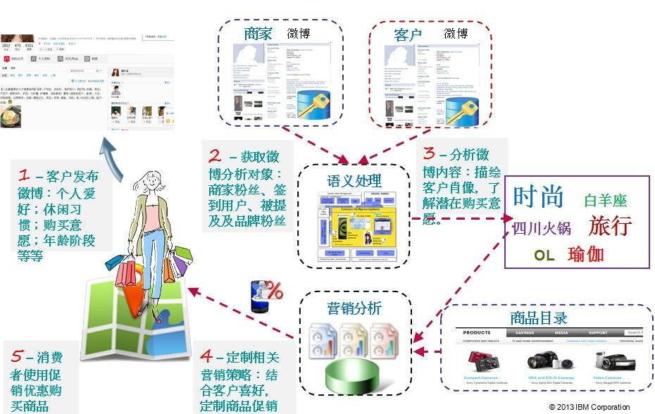

如图 1， 显示了整个营销分析流程的逻辑。从客户发布微博开始， 到商家向用户发布商品目录和优惠信息，整个流程分为五个步骤：

首先，客户发布微博：本文从微博上初步获取的数据为“粗数据”，虽然数据杂乱需要分析，但是其中包含很多用户自己“无意识”的为自己打上的标签，这为后续的语义分析打下了基础。粗数据中包括类似于：性格、年龄阶段、星座、性别、突出喜好，例如“粉红控”、“80 后”、“篮球达人”等。掌握这些用户自定义的标签后，把这些作为用户肖像的一部分。

其次，获取商家的粉丝：商家的粉丝包括关注商家微博的用户以及签到用户被提及的品牌粉丝等。这些粉丝的发布的微博便作为语义处理的输入。

第三，分析用户的微博：将用户的微博进行语义分析。基于 Hadoop 的文本分析平台将对中文进行分词，分词后将与字典进行比较和分类，然后对比总结出该用户的兴趣爱好所在，作为用户的一个标签，同时作为客户肖像的一部分。例如，一个用户的微博中经常提到类似于篮球、足球等运动，那么”爱运动”就及可能成为其标签，作为客户肖像的一部分。

第四，指定相关营销策略：客户肖像制定后，存入数据库，并根据微博内容实时或定时更新客户肖像，根据客户的肖像，向用户推送相应的商品打折、优惠、最新上架产品信息。例如，用户的爱好中包括”运动”，并在微博中提到某品牌的运动鞋，那么可以向该用户推送该运动品牌的打折优惠信息或优惠券。

最后，消费者便可使用消费券或根据打折信息购买相关产品。这样向用户推送的促销信息会更加符合用户近期的购买意愿和用户的个性特征，可以做到为每个用户个性定制的营销方案，使推送更有效。下面，本文将针对整个系统的各个平台进行介绍。

### 方案架构

整个系统架构如图 2 所示，主要由文本分析系统、Db2 BLU 数据库以及 Cognos 数据分析工具组成。首先从互联网上获取数据以后，将原始数据送入文本分析平台进行分析，主要做中文分词、情感分析等工作；然后将文本分析结果整合后输出送入 Db2 BLU 数据库中，进行存储、建表，建表包括客户肖像表、商品目录表、促销策略表等；最后，利用 Db2 BLU 与 Cognos 无缝集成的优势，用 Cognos 对数据进行分析。根据 Cognos 分析出的结果，生成促销的报表，继而将优惠信息分别推送给每个用户。

##### 图 2\. 方案架构

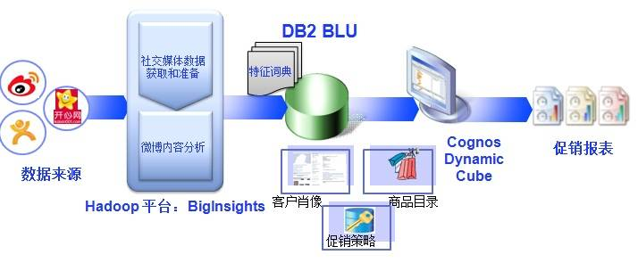

在整个方案架构中，文本分析平台是舆情分析的核心。语义分析常见有两种思路，一种是基于句法结构，采用逐条使用规则的形式驱动语义解释，这种思路适用于以解决语言的综合语法为目标的研究；还有一种思路就是部分或完全抛开语法，直接从句子本身生成语义系统，或者以句法分析的结果作为语义分析的输入，这种思路在解决一些特定领域的问题有较大优势。本文的基于 Hadoop 文本分析平台就是采用第二种思路来设计的。语义分析的方法可以基于语法、知识、统计，还包括自然标签。基于自然标签的方法即利用网络数据来进行语义分析。本文的文本分析平台即为基于自然便签的中文舆情分析平台。基于 Hadoop 平台的中文文本分析系统可以有效的对中文进行分词、情感分析以及字典匹配。

### 数据的获取

文本分析的数据来源十分重要，网络上的数据，大多是非结构性数据，对这些非结构性数据在获取的过程中或文本分析前进行预处理或预分析可以为下一步的文本分析带来较大的优势和便利。本文用 python 脚本提取微博用户的数据，将用户的名称、ID、性别、标签、地点等提取出来。代码清单如下：

##### 清单 1\. 提取微博用户信息代码

```
print "开始获取粉丝 ID" fansurl = "https://api.weibo.com/2/{0}.json?access_token={1}&{2}={3}& {4}={5}&{6}={7}".format(fansmethod ,access_token,'screen_name','大都会','count',2000,'cursor',1) fansurlfile = urllib2.urlopen(fansurl) fansuid = fansurlfile.read() fansidlist = eval(fansuid)['ids'] print "获取粉丝 ID 成功" false = False null = None true = True print "开始写入粉丝用户信息" outputfile = open("wbuserprofile.xml","w") for id in fansidlist: outputfile.write("<user>\n\t<id>"+str(id)+"</id>\n") print "写入 uid{}".format(id) try: profile = urllib2.urlopen("https://api.weibo.com/2/{0}.json?access_token={1}&{2}={3}&{4}={5}&{6}={7}".format(userprofmethod,access_token,"uid",id,'','','','')).read() outputfile.writelines("\t<screen_name>"+eval(profile)["screen_name"]+"</screen_name>\n") print "写入 uid{} 微博名称完成".format(id) outputfile.writelines("\t<location>"+eval(profile)["location"]+"</location>\n") print "写入 uid{} 微博地点完成".format(id) outputfile.writelines("\t<gender>"+eval(profile)["gender"]+"</gander>\n") print "写入 uid{} 微博性别完成".format(id) tags = urllib2.urlopen("https://api.weibo.com/2/{0}.json?access_token={1}&{2}={3}&{4}={5}&{6}={7}".format(tagsmethod,access_token,"uid",id,'','','','')).read() print "开始写入 uid{} 标签".format(id) outputfile.writelines("\t<tags>\n") for tag in eval(tags): for key in tag.keys(): if key.isdigit(): outputfile.writelines("\t"+tag[key]+"\n") outputfile.writelines("\t</tags>\n") print "完成写入 uid{} 标签".format(id) except: print "连接出错无法写入 , 跳过！" outputfile.write("</user>") print "sleep 60 mins" time.sleep(3600) continue outputfile.write("</user>") outputfile.write("\n") outputfile.close() print "完成粉丝用户信息" print "文件写入结束"

```

Show moreShow more icon

这段代码是提取出用户的肖像 (profile)，提取出的结果片段如下：

##### 清单 2\. 微博用户肖像

```
<user> <id>2863185903</id> <screen_name> 花开有季 xn</screen_name> <location> 北京 延庆县 </location> <gender>f</gander> <tags> 星座命理 娱乐 </tags> </user> <user> <id>1246347253</id> <screen_name> 杰里 - 商 </screen_name> <location> 北京 房山区 </location> <gender>m</gander> <tags> 搞笑幽默 </tags> </user> <user> <id>3265394820</id> <screen_name> 小荷相公丶 </screen_name> <location> 重庆 </location> <gender>f</gander> <tags> </tags> </user> <user> <id>2036066523</id> <screen_name> 青春的 Dalin</screen_name> <location> 江西 南昌 </location> <gender>f</gander> <tags> </tags> </user> <user> <id>2013144111</id> <screen_name> 势必拿下会计证 _ 微微猫 </screen_name> <location> 北京 宣武区 </location> <gender>f</gander> <tags> 旅游 WE 90 后 </tags> </user>

```

Show moreShow more icon

可以看到，用户的 ID、用户昵称、地点已经性别和标签被提取了出来。除了 ID 和用户名称以外，其它的项有可能为空值。特别是标签 (tag) 项。这里的标签是直接从微博中提取的，是由用户自己认为自己有的特质，并不是经过文本分析得到的。而当对用户发布的微博内容进行文本分析以后得到的用户标签，将与这部分“原始标签”相结合，共同构成最终用户肖像的一部分。

获取用户微博内容的代码部分与清单 1 中的代码类似，所以这里不再赘述分析。微博内容获取后将送入文本分析平台进行分析， 如下图所示：

##### 图 3\. 获取的用户微博内容

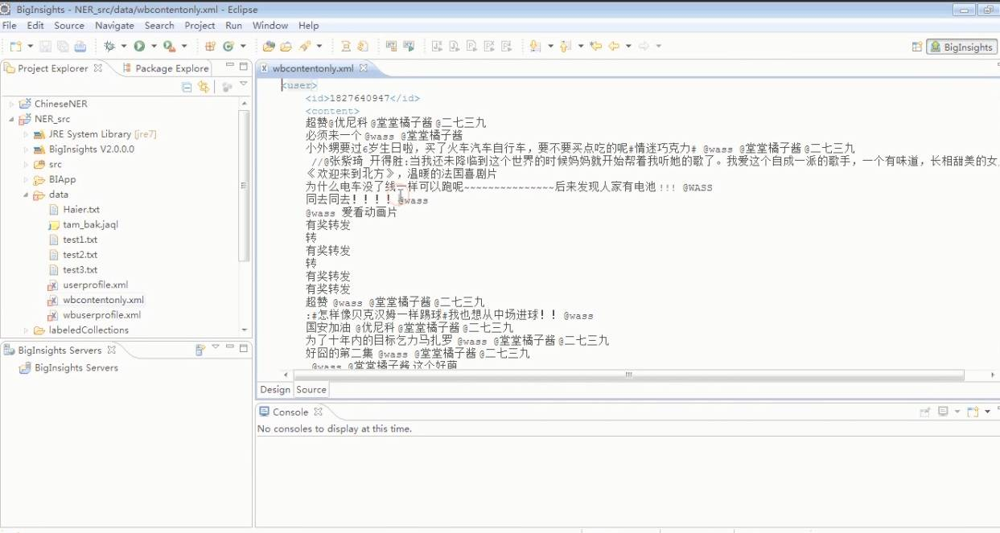

由此可见，本文的数据源的获取和预处理分为两个部分，一部分作为用户“原始肖像”（其中包括用户的 ID、性别、”原始标签”、地点等），另一部分为用户的微博内容，这一部分将作为输入进行 Hadoop 平台上的文本分析。基于 Hadoop 平台的文本分析核心作为一个应用部署在 BigInsight 上面，每次只需运行这个应用，就可以得到文本分析的结果，操作十分简单。基于 Hadoop 平台的文本分析为本文的技术核心，下面一节，就对这一部分技术进行描述。

### 基于 Hadoop 平台的文本分析

基于 Hadoop 平台的文本分析，在几年之前就有过相关的研究，在 [BigInsights– 基于 Hadoop 的数据分析平台](http://www.ibm.com/developerworks/cn/data/library/techarticle/dm-1108lisd/#links) 这篇文章中，介绍了 IBM BigInsights 这个基于 Hadoop 的数据分析平台，这篇文章是利用 BigSheets 来进行大数据分析的功能。在本文中，利用 BigInsights 部署 Hadoop 及其组件，将基于 Hadoop 平台的中文的文本分析系统部署在 BigInsights 上。 [如何实现 Hadoop 的部署与管理](http://www.ibm.com/developerworks/cn/data/library/techarticle/dm-1109wangxj/) 可以参看相关的参考文献以及 IBM BigInsights 产品的相关介绍。

在部署结束之后，在服务器端用 ./start.sh 启动 BigInsights，如下图所示：

##### 图 4\. 启动 BigInsights

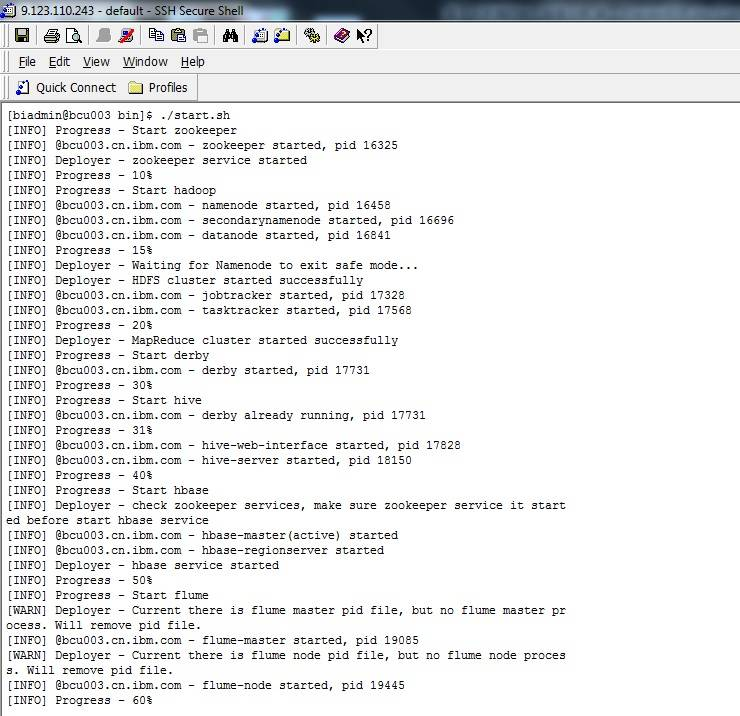

为了更方便的管理 Hadoop 组件，运行及管理各个应用，BigInsights 提供一个 Web 图形界面。启动 BigInsights 之后，通过 `http://<`; 主节点主机名或 `IP>:8080/data/html/index.html#redirect-files` 进入 HDFS 界面：

##### 图 5\. BigInsights 查看 input 内容

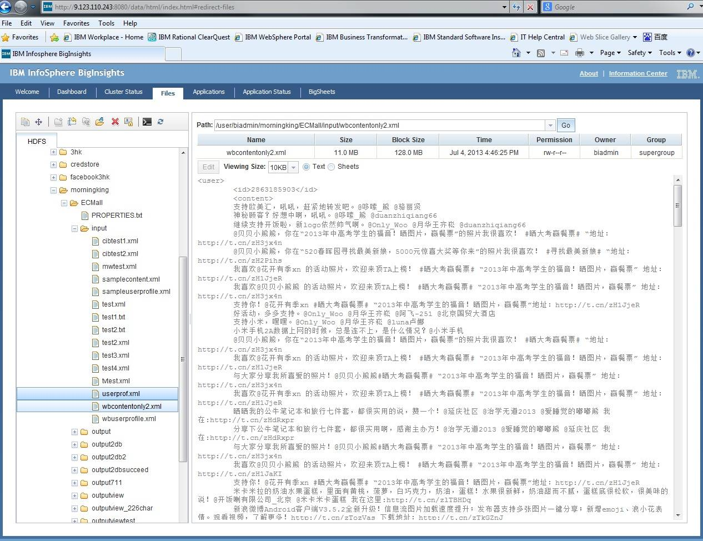

本文将获取的微博数据放在相应工程文件的 Input 文件夹下，作为文本分析程序的输入。从图 5 中可以看到，输入的内容是用户的 ID 加上单纯的微博内容。 运行 Application 下的 NER\_src2 进行分词，输出文件将放在工程文件的相应的 output 文件夹中。

##### 图 6\. 运行 BigInsights 上的 Application

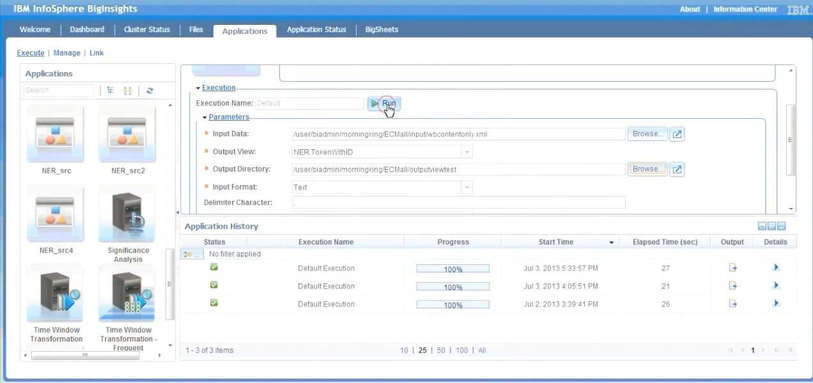

当 Application History 中显示的 Process 为 100% 时候，可以查看运行的输出结果：

##### 图 7\. 运行后结果

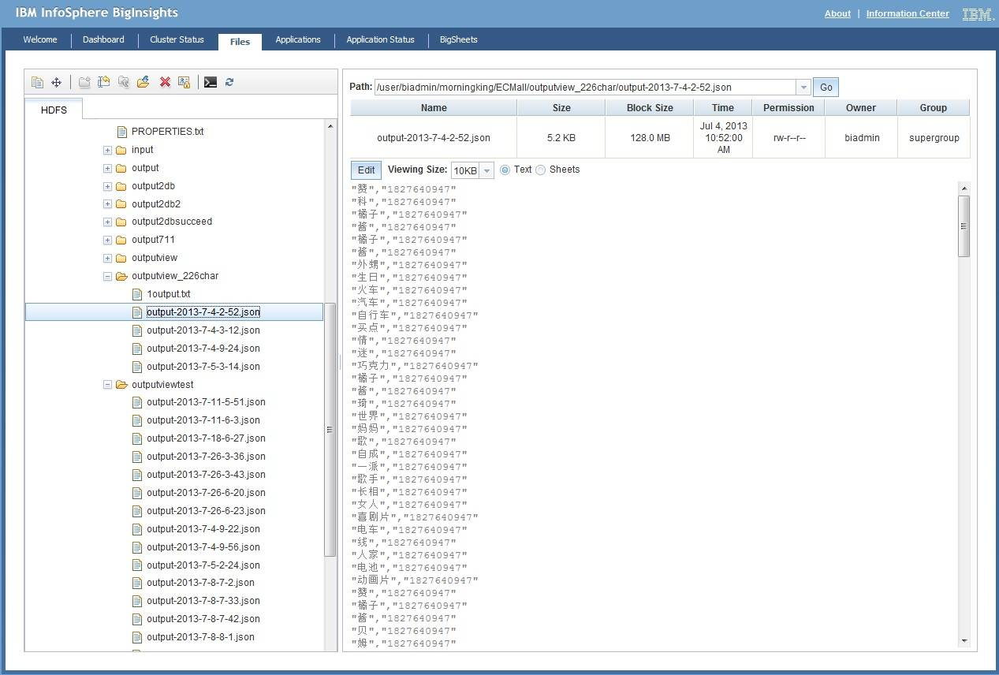

从图 7 中可以看到运行分词的结果。分词以后我们看到结果是一个用户 ID 对应多个分词。本文在分词系统里指定应用需要的分词长度。在本文中，我们指定的是 2~6 个中文字符。分词系统会根据词汇库根据分词规则将 2 到 6 个字关键词提取，这里的关键词提取出来的有几个种类的词：第一，一些命名实体的解析，如“喜剧片、电影、篮球鞋”等等；其次，情感词的分析，例如“喜欢、赞、讨厌”等等。由于文本分析的目的是向用户推送相关产品信息，用户也取自某商场的微博粉丝，所以更加关注对某类商品有 Positive 情感倾向的用户。

在 BigInsights 中分析好的用户数据可以直接导入 Db2 数据库中，只要配置好 Database Export 这个 Application 将要导出到的数据库的 IP 以及端口号即可。

##### 图 8\. 从 BigInsights 中将结果导入 Db2 BLU

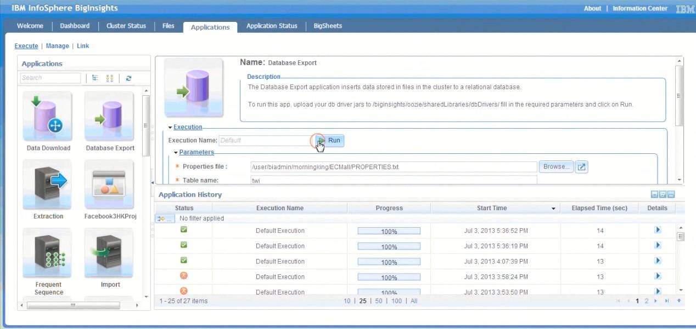

当导出完成后，可以到 Db2 BLU 的数据库中查看结果：

##### 图 9\. Db2 BLU 中结果表示意图

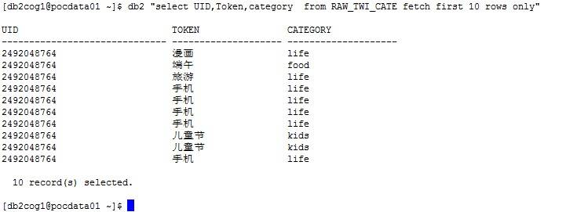

如图 9 所示，这是导入结果的初步分析表，这张表里的三列 UID，Token( 分词结果 )，还有 Category( 分词字典匹配分类 )。其中 Category 这一列是根据文本分析系统里的字典匹配，将分词的结果与我们所建立的商品类别字典匹配而得到的结果。在这张表里只显示了前十行，这十行都属于同一个用户 ID。在这个 ID 为 2492048764 的用户的微博里所提到的词语中可以发现他 / 她所关注的商品类别。对这个类别进行统计，可以得到用户的 profile 表，图 10 所示：

##### 图 10\. USER\_PROFILE 表示意图

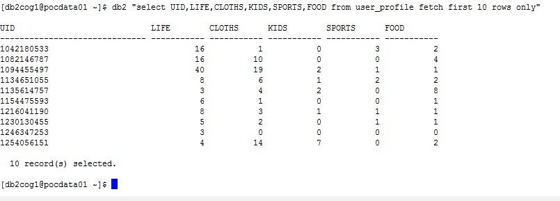

从图 10 可以看到，每个用户对不同类别的商品关注度不同。后续，我们可以根据这些不同以及用户的标签来分析用户对某类商品的购买意愿，从而向其推送商品折扣信息。这样，我们就可以将 Db2 BLU 中的用户信息表等无缝集成 Cognos，进行数据的展示和分析。这就是整个文本分析平台的操作流程。下面将对其中的文本分析做详细的阐述。

##### 图 11\. 基于 Hadoop 平台的文本分析

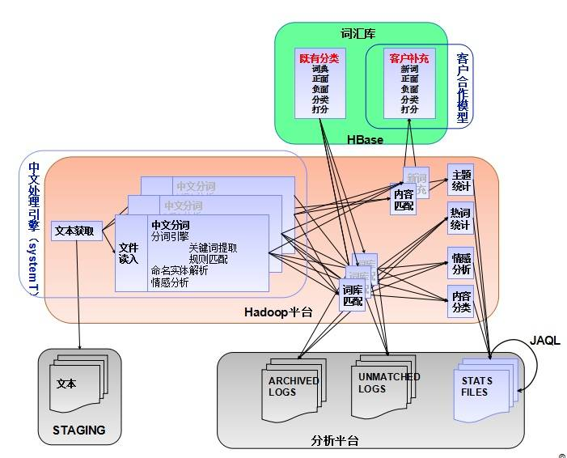

如图 11 所示，为基于 Hadoop 平台的文本分析架构图，整个架构主要由三部分组成：引擎部分：用户发布的微博中获取的数据生成文本格式送入文本分析引擎，在输入之前，由于客户的 ID、性别、地点已经提取出来，可以作为客户肖像的一部分，但并不送入文本分析系统。引擎部分主要处理中文分词、将分词与词汇库中的字典进行匹配、分类。分词的作用主要将动词，以及动词后的名词分开，情感词，以及表达情感的对象分开等。词汇库部分，主要负责存储客户合作模型的词汇词典，这一部分的词典部分有手工添加，部分由系统根据词汇库聚类生成，词汇库存于 HBase 上；最后是负责输入输出文本的部分，这一部分利用 JAQL 来拼接”原始标签”与分词后的标签，一起构成客户肖像表。

##### 图 12\. 语义分析流程

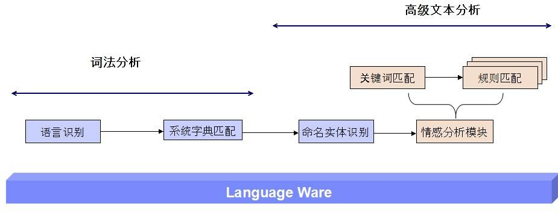

引擎中文语义分析的流程如图 12 所示。语义分析的目的是产生用户肖像中最重要的部分 – 用户标签，例如“喜欢运动”、“爱时尚”等，这些用户标签是商家向用户推送商品信息的重要依据。对于语义分析分成两步，词法分析和高级文本分析。第一部分为词法分析，主要进行分词、匹配字典等。系统字典主要是由手动设置和词语聚类生成的。情感分析模块主要针对文本中表达情感的词语进行分析，例如“喜欢”、“一般”、一些表示肯定或否定的词语来进行关键字匹配与规则匹配。情感词的分析有助于商家找出商品潜在的缺陷和用户的使用反馈，针对未购买的用户，用户发布的针对产品的情感词，有助于商家获取用户需求，所以情感词的分析对舆情分析来说，十分重要。情感词分词的效果如图 13 所示（某冰箱品牌用户评论分词）：

##### 图 13\. 文本分析平台分词效果图

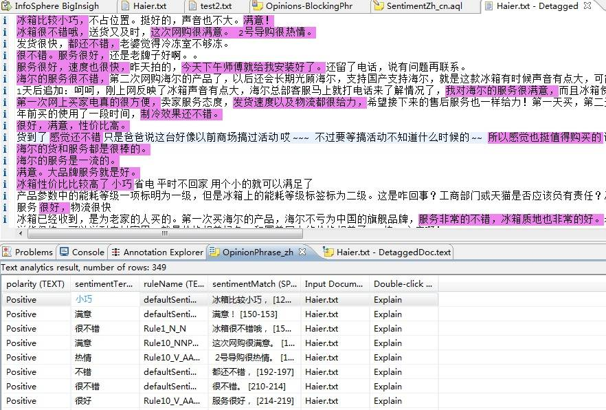

字典，在本系统中的分析及为重要，以人工字典为例，图 14 表明了分词后与字典匹配构成的用户标签的示意图。从某用户的微博内容中提取的高频词汇如“篮球”、“NBA 球迷”、“球鞋”等，该用户在运动类词汇中多次提到球鞋、以及某品牌的篮球鞋子等，这些词语将人工标记为字典中“喜爱篮球”（范围可以扩大为喜爱运动），情感分析模块将会根据描述这些词语时候所运用的情感词，来标记为喜好或者厌恶，或者“一般”。这里情感分析直接给出结果为“喜欢”。那么结合字典中的“篮球”关键字，就会为用户打上其中一个标签“喜爱篮球运动”，Nike 商家可以根据用户的这样一个喜好来推送相关的优惠信息。

##### 图 14\. 分析示例

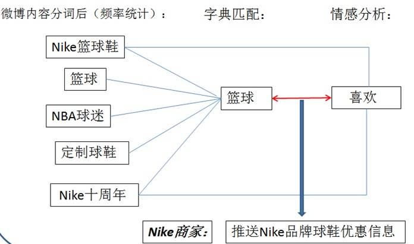

更进一步的，在这个语义分析的系统里，我们还可以做到，更细节的匹配与分析，例如，在这里，用户提到定制球鞋，一些商家可以提供定制篮球鞋服务可以推送给该用户，这样准确度比直接推送篮球运动产品优惠会更加精确。

由于用户的微博数据是实时更新的，那么客户的肖像也可以是实时更新的。这样，商家推送的内容才会更加准确。在语义分析系统里，字典的更新速度相对要缓慢一些，因为字典是人工标记或者聚类分析而生成，相对比较稳定，可以定时更新。

### IBM Cognos Dynamic Cube 无缝集成 Db2 BLU 提供迅捷的分析与查询

本文用于存储客户肖像的为 Db2 BLU Acceleration。BLU Acceleration 的架构如下图所示：

##### 图 15\. BLU Acceleration 架构

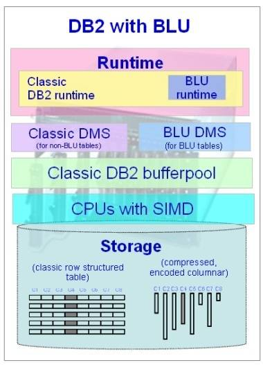

使用 Db2 BLU 的目的是因为其七大性能优势：

1. 列式存储减少 I/O，基于列的高度压缩：列式存储只读取需要的数据列，这样可以减少 I/O，并基于列的高度进行数据压缩。

2. 基于压缩数据进行操作，应用字典压缩技术并采用近霍夫曼编码：这样，绝大部分的 SQL 都会基于压缩数据进行，极大的减小内存的使用。

3. 采用数据跨越技术加快搜索速度：数据跨越技术会自动检测并跳过不符合条件的数据区域，当数据有序或呈稀疏状时，可以显著的减少 I/O，并对用户透明，无需 DBA 的操作。

4. 多核高并行技术，所有 SQL 都采用并行运算模式：所有的 SQL 操作都采用并行的运算模式，有效的利用 CPU 寄存器，避免并行干涉。

5. 单指令多数据技术，加快数据的处理速度：CUP SIMD 技术采取矢量处理模式，高效利用 CUP，获得更高级别的数据操作并行度。

6. 针对列存储的预取算法，缓存跟多数据：高效的利用内存 Buffer Pool，缓存更多的数据，有效减少 I/O。

7. 对用户更简洁，只需加载、运行即可：用户无需进行数据库调优操作，无需索引、MQT 等，对外沿用已有的 SQL 接口。


由于 Db2 BLU 的七大优势，使数据库操作更快、更简、存储更省。Db2 无缝集成 Cognos，本文的系统中使用 Db2 BLU 存储客户肖像、商家品牌样本数据、签到分析数据等，连接到 Cognos Server 上进行查询并进行实时分析，使操作更快。

如图 16 所示的三张图表，分别为某大型商场的消费者喜好分布饼图、儿童用品的关注趋势柱状图（包括北京昌平、丰台以及海淀区）、客户肖像表。

##### 图 16\. Cognos 展示推送图示

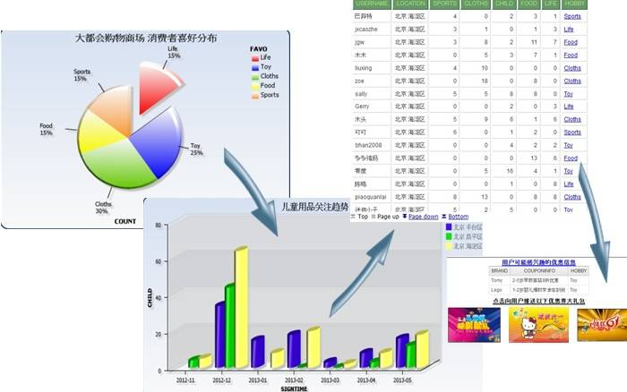

从 Cognos 展示的数据中可以看到，在北京几个地区的分布中，其中海淀区（柱状图中的黄色区域）的用户对儿童用品的关注度相对更高，那么在海淀地区的零售商或者零售商分店可以增加儿童用品的进货量或者在商场里增加儿童用品的分布等等措施；针对个别用户，客户肖像表格里最后一列为分析出来每个用户最关注的商品类型，商家可以根据用户关注最密切的商品类型，向用户推送优惠信息。

分析的流程从客户喜好开始，从整体喜好到某类商品的用户群喜好分析，再到针对每一个用户的分析。可以从时间、地点、年龄段等不同角度来了解用户群的分布、客户要求的集中程度等。客户针对某一类产品有需求或非常感兴趣的时候，商家即可推送优惠券和优惠信息给该用户。这种营销方式由于经过舆情分析，比广播式的推送准确度要高很多，用户的接受程度也高很多。未来，这种基于舆情分析的营销方式也会广泛被运用。

## 结束语

本文介绍了基于大数据的中文舆情分析系统，采用基于 Hadoop 平台的文本分析，以及 IBM Cognos 无缝集成 Db2 BLU 加速器的优化分析能力，提供快速的查询和分析功能。整个系统针对互联网大量的数据进行处理、文本分析，经过分析为客户定制肖像，商家可以根据肖像来向客户推送客户需要的优惠信息。经过样本数据测试，推送给用户的信息，与用户的自然标签（用户自己为自己设定的）对应性很高。在实时性、大量重复词汇的处理上面，由于中文语义分析的局限性，还有待优化和提高。

## 相关主题

- “ [Db2 10.5 信息中心](https://www.ibm.com/support/knowledgecenter/SSEPGG_10.5.0/com.ibm.db2.luw.kc.doc/welcome.html)”，介绍了如何使用 Db2 version10.5，以及 Db2 家族的数据库产品和功能。
- “ [IBM Cognos BI：在环境之间部署内容](https://www.ibm.com/developerworks/cn/data/library/cognos/infrastructure/cognos_specific/page581.html)”，介绍开发商业智能内容以及将其从一个环境部署到另一个环境提供指导。
- “ [实战 IBM BigInsights，轻松实现 Hadoop 的部署与管理](https://www.ibm.com/developerworks/cn/data/library/techarticle/dm-1109wangxj/)”，介绍 IBM BigInsights 并分析了 Hadoop 的部署与管理时易出现的问题。
- 通过 [多媒体课堂：体验魅力 Cognos BI 10 系列](https://www.ibm.com/developerworks/cn/data/cognos/)，了解最新 Cognos BI 10 的最新特性和相关技术，并介绍了 Cognos 商业智能报表开发的技术细节。
- 通过 [商业智能入门以及 Cognos 产品介绍](https://www.ibm.com/developerworks/cn/data/library/techarticles/dm-0903gaoxf/)，了解商业智能的基本概念和相关技术，并介绍了 Cognos 商业智能相关的产品。
- “ [SystemT: A Declarative Information Extraction System](https://www.aclweb.org/anthology/P11-4019)” 介绍了 SystemT，一个英文的信息提取系统。