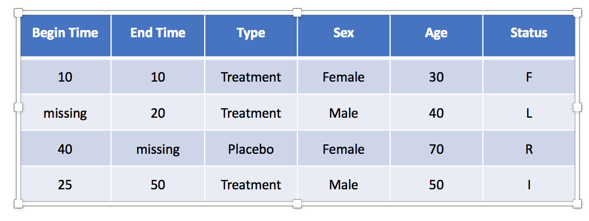
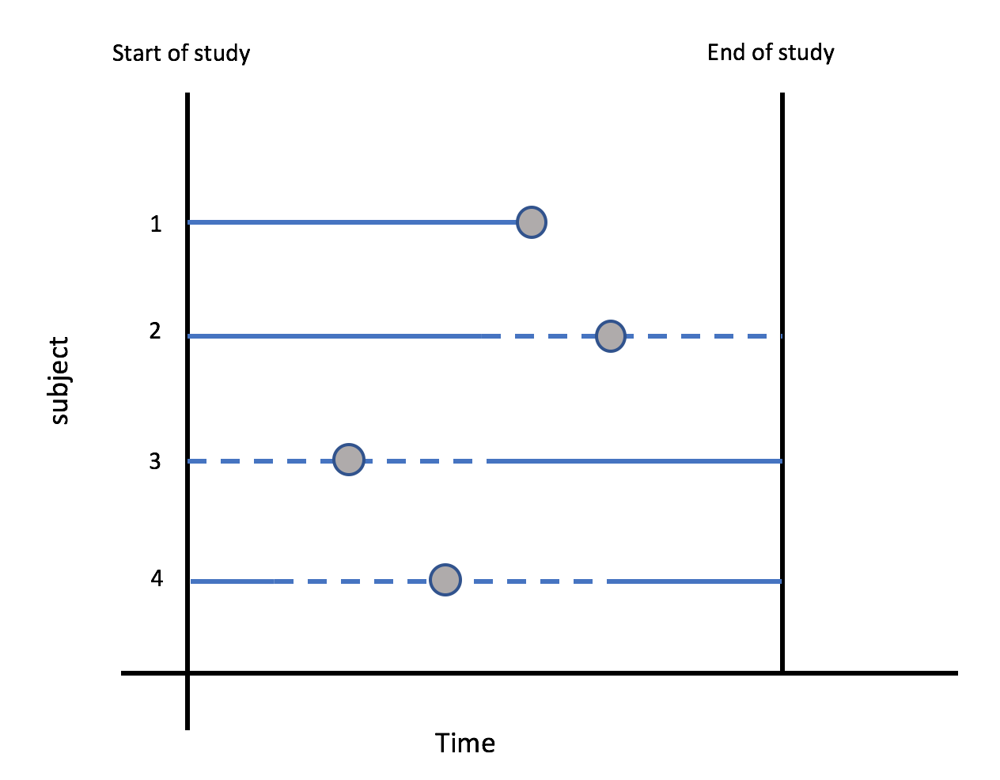
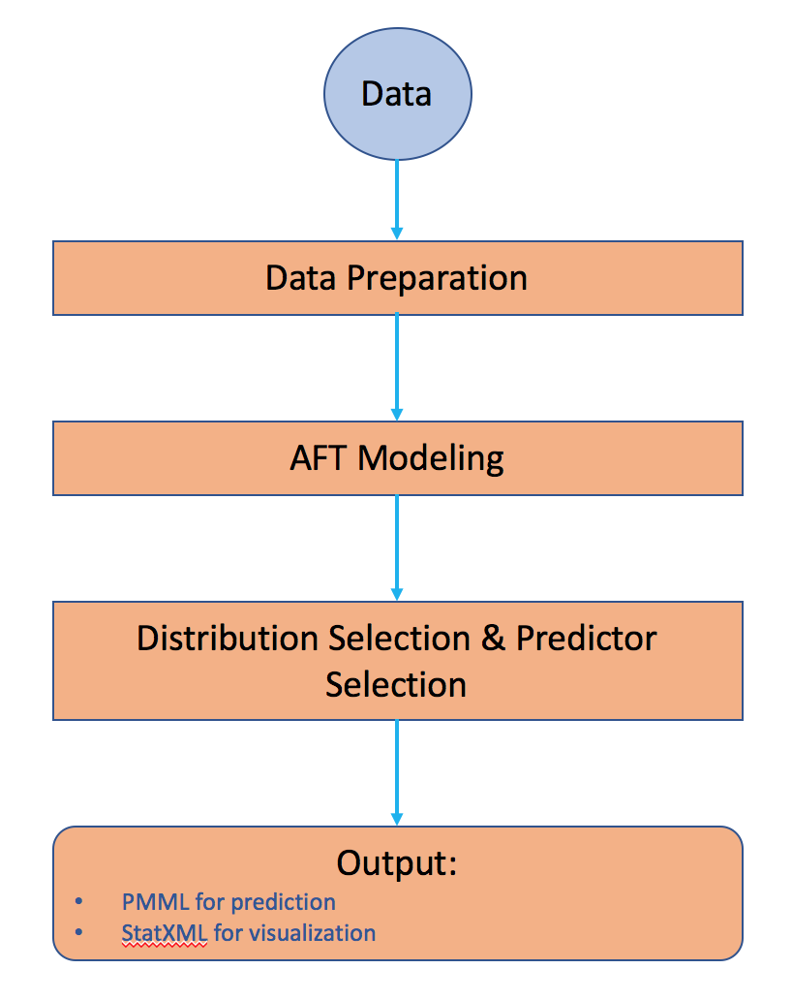
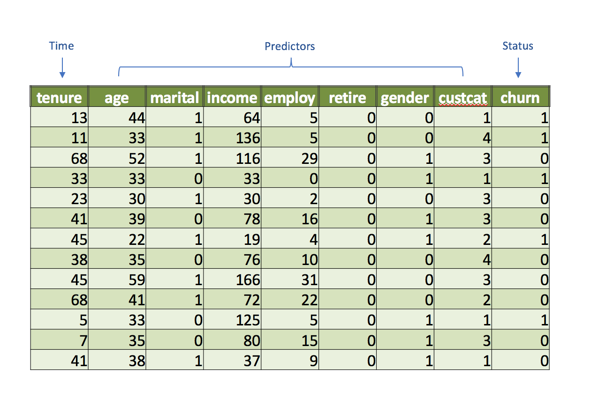
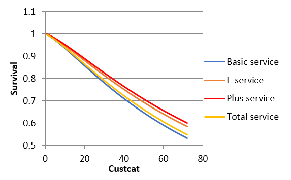
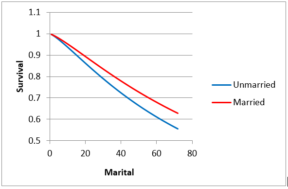
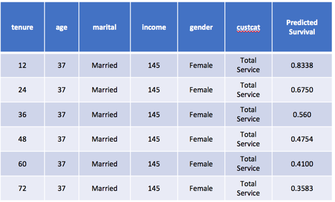

# 基于大数据的生存分析模型与预测
了解大数据对生活的影响

**标签:** 分析

[原文链接](https://developer.ibm.com/zh/articles/ba-cn-bigdata-survival-analysis/)

常盎, 康维珊, 刘振铎

发布: 2017-11-29

* * *

生存分析在医学、生物学、金融学等领域是都是应用相当广泛的统计学分支。最初是应用于医学研究中， 例如病人确诊疾病之后多长时间会死亡，疾病治愈之后多久会复发等等。然而 生存分析中的生存并不仅仅指生物学上的生存，还可以引申为其他各类在一定时间间隔内观察对象是否发生某事件的实验。如今，生存分析已经被广泛的应用到金融、工程、网络等各个领域，例如用来分析机器零件的损坏情况，预测信息在社交网络的传播程度，分析某项服务的用户流失度等等。

IBM SPSS 计划在后续版本中提供对生存分析中较为实用的参数回归模型（Parametric Regression Modeling，简称 PRM）的支持。

## 生存分析基本概念

生存分析（Survival Analysis），是指将事件是会否发生以及发生的时间综合分析的一种统计方法。简而言之，生存分析研究的就是被观察对象会在何时发生某个事件的问题。

传统的线性分析并不能够很好的解决生存分析问题，主要原因有以下两点：

- 在生存数据存储过程中，无论是时间点还是时间间隔，通常都会被存储为一个正数。 因此常规的线性回归模型并非解决生存分析问题的最好选择 。
- 线性回归问题不能很好的处理删失数据。数据删失现象之所以会出现，是因为观察实验中的种种限制条件造成的。数据删失是在生存数据中非常常见的一种现象，在下文中会详细介绍数据删失出现的原因以及在数据中的具体表现。

生存分析的目标，就是通过对已经发生的事件的观察，来分析和预测事件在观察对象上的发生情况。通过生存分析，我们希望能够得到研究对象的生存情况在时间上的特点，估计生存率和平均生存时间，进而研究影响生存时间和观察时间发生的保护因素和不利因素。

## 生存分析的特征

1. 数据特征

     正如上文所提到的，生存数据具有两大特征，一是生存时间通常是一个非负的值，二是生存数据存在数据删失现象。图 1 是一个典型的生存分析问题的数据。

     在图 1 中的 “Begin Time”数据列，表示失效事件（Failure Event）发生的起始时间（Initial Event） 。”End Time”数据列，表示失效事件发生的结束时间（End Event）。

     从”Type”数据列到”Age”数据列，都是每个观察对象的特征属性（Predictors）。这些属性都可能会在某种程度上影响被观察对象的生存时间。可以是连续型或者离散型。

    ##### 图 1 生存数据示例

    

2. 数据删失

     数据删失是指在对研究对象的观察过程中，该对象的生存时间没有被完整的观测到，因而造成生存数据不完整的现象。在实际的观察实验中，通常很难准确的观察到对象状态发生变化的精确时间点。比如患者在治愈之前自行终止治疗，或者在整个研究的观察期间都没有被治愈。由于观察手段或者被观察对象存在种种限制，因此难免会出现观察数据不完整的情况 。

     删失数据，通常分为左删失，右删失和区间删失三种情况：

    - 左删失（Left Censored）：是指失效事件的发生时间只能确定是在某一时间点之前，即失效事件的起始时间没有观测到。
    - 右删失（Right Censored）：是指失效事件的发生时间只能确定是在某一时间点之后，即失效事件的结束时间没有观测到。
    - 区间删失（Interval Censored）：是指失效事件的发生时间可以确定在某一时间区间内。

        非删失数据（Failure Data），就是准确的观察到了失效事件发生的事件点的生存数据。也就是说失效事件的起始时间和结束时间相等的数据。

        在生存数据中，通常用 F 来表示非删失数据，L 表示左删失，R 表示右删失，I 表示区间删失。由此我们可以看到在图 1 中失效事件的时间与删失状态之间的关系。

        ##### 图 2 删失数据示例

        

        在图 2 中，我们可以更加直观的看到不同删失状态的数据之间的差别。其中，点表示失效事件发生的真实时间，直线表示对象被观察的时间段，虚线表示对象没有被观察到的时间段。可以从图 2 中看出，对象 1 的失效事件是发生在被观察的事件内的，因此属于非删失数据。对象 2 的失效事件发生在对象没有被观察的事件段中，因此只能确定失效事件发生在某个时间之后，属于右删失数据。对象 3 的失效事件能被确定在某个时间点之前，因此属于左删失数据。对象 4 的失效事件可以确定发生在一个时间区间内，因此数据区间删失数据。

        在实际中，有时也会只用一个数据列来表示失效事件发生的事件。比如按照某固定频率进行的观察实验，这样的实验观察到的生存数据中，就只会有非删失数据和左删失数据，因此只需要用一个数据列来保存时间信息。
3. 相关特征函数

     在生存分析中，最为重要的就是对生存函数的估计。生存函数（Survival Function），是指被观察对象生存时间长于时间 t 的概率，即观察对象经历 t 时间之后仍然存活的可能性。因此，生存函数又称作（Cumulative Survival Rate）。

     除了生存函数之外，风险函数也是生存分析研究的一个重要目标。风险函数（Hazard Function），表示被观察对象在观察时刻 t 的死亡概率。这个概率越高，改观察对象发生事件的可能就越大。

## 生存分析模型

1. 常见生存分析模型

     常见的生存分析模型一般被分为非参数模型和参数模型。

     非参数模型在估计生存函数时，不会对生存时间的分布做出假设，并且检验危险因素对生存时间的影响采用的是非参数检验方法。虽然这种方法可以估计生存函数，但是不能建立生存时间于危险关系之间的关系模型。 Kaplan–Meier 是最常用的非参数模型。

     参数模型是根据样本观测值来估计假设分布模型中的参数，进而获得生存时间的概率分布模型。参数模型可以更好的分析生存数据中其他参数对生存时间的影响。在估计生存时间所服从的分布是常用的分布有：指数分布，Weibull 分布，指数分布，对数分布以及 Logistic 分布等。

     在 IBM SPSS 准备支持的 PRM 中，主要支持两种类型的模型，Accelerated Failure Time (AFT) model 和 Shared Frailty Model。其中，Shared Frailty Model 是用来分析在生存分析中很常见的另外一类数据，复发生存数据的。在本文中，将主要介绍 AFT Model。

2. AFT 模型

     AFT 模型是传统 Cox Regression 模型的一种补充，常用于分析观察对象的属性对于生存时间的影响。在 AFT 模型建模过程中，会假设观察对象的所有属性会对对象的生存时间产生加速或者减缓的作用。

     AFT 模型和其他类型生存分析模型的最大区别在于，通过 AFT 模型用户可以直观的看到在所有特征属性对生存时间的影响。在商业应用中，可以更有针对性的知道用户对生存时间加以影响。

## PRM 建模流程

##### 图 3 PRM 简要流程

- 输入数据要求符合前面所介绍的生存数据的基本要求。
- Data Preparation：是在对于删失数据的时间和状态进行检查，对于状态和时间数据存在冲突的数据进行处理。对冲突数据通常有三种处理方法，以状态为标准修改数据，以数据为标准修改状态以及删除存在冲突的数据。
- AFT Modeling：可以指定生存时间的分布，也可以用多个分布来建立多个模型。
- Distribution Selection & Predictor Selection：从不同分布的模型中选取最有模型，并从所有参数中选择出来对观察对象生存有显著影响的参数。
- Output：建模的结果被存储在 PMML 和 StatXML 中。其中，PMML 中存储了利用模型来对数据做预测的信息，StatXML 中存储了模型的信息和可视化展示。

## 商业应用案例

电信行业用户流失分析与预测

某电信运营商希望能对用户流失情况进行研究，了解用户流最可能发生的时间，并且了解那些因素有可能影响用户流失的情况。根据这些研究的结果，电信运营商就可以制定更好的营销策略来维护客户。

1. 数据

    ##### 图 4 电信运营数据

    

     可以看到在上图中，”tenure”是表示用户已经使用服务的时间，可以理解为生存分析中的时间（Time）。由于使用时间肯定是从 0 开始，因此可以只用一列数据来表示。”churn”用来表示该用户是否已经流失，可以理解为生存分析中的状态（Status）。其他的参数都是表示用户的特征属性（Predictors）。

2. 建立模型

     在建立模型时，我们选择 Weibull 作为分布假设。根据建立模型的结果，我们可以得知在数据中，”Custcat”和”Marital”两项数据对于用户流失时间有显著的影响。因此根据模型结果，分别正对这两项数据绘制生存曲线图。

    <h5 id=”图-5-” custcat”生存曲线图>图 5 “Custcat”生存曲线图

    

    <h5 id=”图-6-” marital”生存曲线图>图 6 “Marital”生存曲线图

    

     从图中我们可以看出，在 Custcat 中属于”Basic Service”分类的用户，以及在”Marital”中属于”Unmarried”分类的用户，有更大的概率流失。

3. 模型预测

    ##### 图 7 模型预测结果

    

在模型预测的结果中我们可以看到，在原始数据之后多添加了一列”Predicted Survival”。该数据表示根据之前建立模型，该用户在当前时间流失的概率。根据这个预测结果，运营商便可以更有针对性的采取营销措施来保留客户，产生商业价值。

## 结束语

生存分析是一种非常有效的数据分析手段。对于事件何时再目标上发生这类问题，AFT 模型可以对影响事件发生的因素进行评估，并进行预测，结合商业场景可以帮助用户做出更加合理的商业决策。