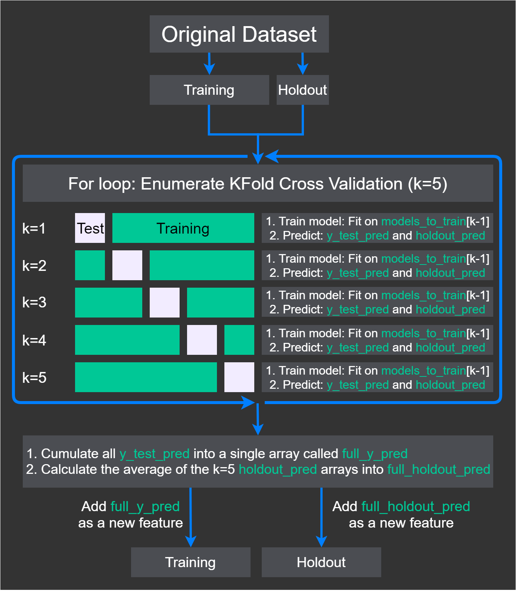
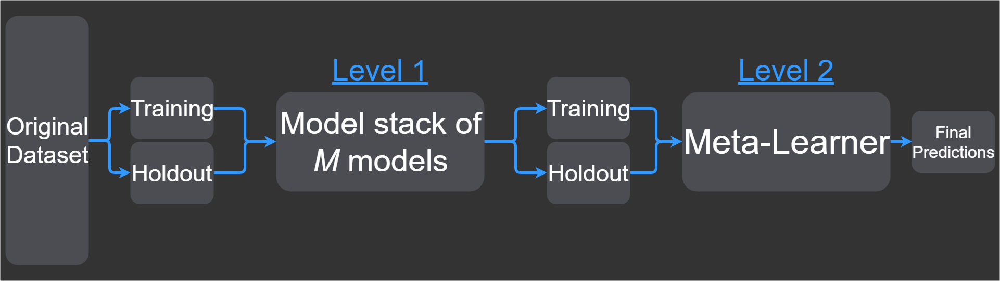
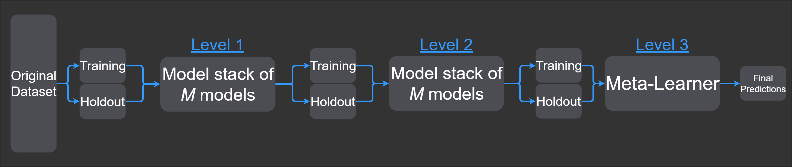
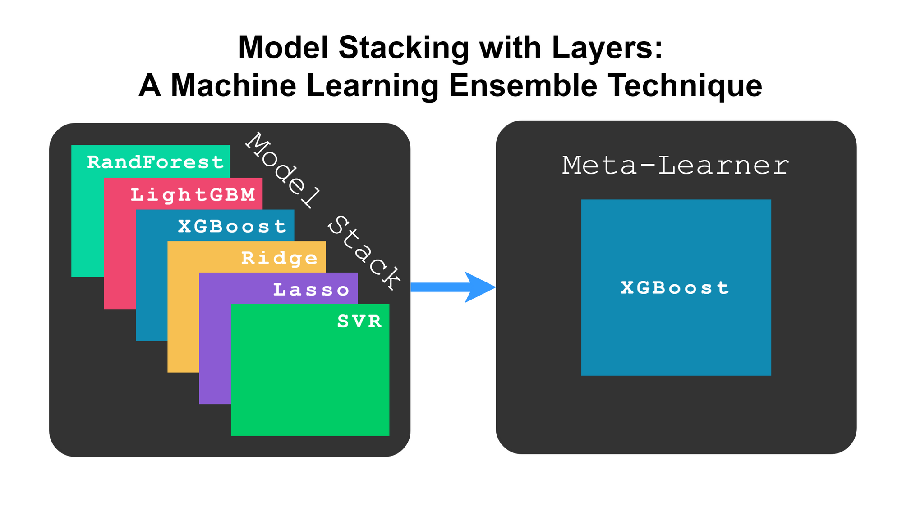

# 堆叠机器学习模型：获得更好的结果
使用您自己的模型，学习如何将堆叠应用于您自己的数据集

**标签:** 人工智能,机器学习

[原文链接](https://developer.ibm.com/zh/articles/stack-machine-learning-models-get-better-results/)

Casper Hansen

发布: 2020-02-18

* * *

有时您会发现一些通过改进代码从而让操作变得更轻松的小技巧和窍门，比如更好的可维护性和效率。本文概述了一个技巧，尽管需要一些额外的想法来实现，但使用这一技巧可以改进机器学习模型并获得更好结果。这就是本文我会向您介绍的机器学习中的堆叠。使用您自己的模型，学习如何将堆叠应用于您自己的数据集。

要学习本文，您应该熟悉过度拟合、欠拟合和交叉验证。

## 什么是模型堆叠？

堆叠是一个接一个使用不同机器学习模型的过程，您可以从每个模型中添加预测，从而形成新特性。

通常有两个不同的堆叠变体： [变体 A 和 B](https://www.kaggle.com/getting-started/18153)。在本文中，我将重点介绍变体 A，与变体 B 相比，变体 A 似乎能获得更好的结果，因为模型更容易与变体 B 中的训练数据过拟合。这可能也是许多从业人员使用变体 A 的原因，尽管它不能消除过拟合。

注意，没有正确的实现模型堆叠的方法 ( [David H. Wolpert](https://www.sciencedirect.com/science/article/abs/pii/S0893608005800231))，因为模型堆叠仅描述将多个模型与最终的广义模型相结合的过程。变体 A 在实践中被证明效果很好，因此我选择使用它。

## 模型堆叠过程

模型堆叠应始终伴随交叉验证，以减少模型对训练数据的过拟合。这是常见的做法。如果您愿意，可以 [阅读](https://mlfromscratch.com/nested-cross-validation-python-code/#what-is-cross-validation) 更多相关信息。

了解了算法内部发生的情况后，您会发现模型堆叠似乎是一种可以改进结果的简单技术。但是存在很多组件相互作用，要保持对所有组件的跟踪可能极具挑战性，尤其是在第一次学习这个概念时。为了让您充分理解算法，我创建了一个逐步操作的图像并进行了详细解释。

首先，在使用交叉验证执行模型堆叠时，我们需要三个参数：Training 数据集、Holdout 数据集（验证数据集）和名为 models\_to\_train 的模型列表。

_图 1\. 模型堆叠图_



此处最重要的部分是，每个模型的预测都成为了新特性的一部分，这样每个模型就可以预测这个新特性的一部分训练数据。

现在，让我们将图 1 转换成文本来解释所发生的事情。稍后，您将看到 Python 中的真实示例。

1. 将具有优化超参数的模型收集到 `models_to_train` 数组中。
2. 将原始数据集拆分为 Training 和 Holdout 数据集。
3. 让 Training 继续进入下一个循环，并保存 Holdout 直至下一个循环的最后一部分。
4. 对 Kfold 交叉验证（其中 k=5）进行 `for` 循环。
    - 在每次迭代中，将 Training 数据集拆分为另一个训练和测试数据集。将其命名为 X\_train、y\_train、X\_test 和 y\_test。图 1 中的白色部分表示 X\_test 和 y\_test，而绿色部分表示 X\_train 和 y\_train。
    - 将当前模型设置为 `models_to_train[k-1]`。
    - 在 X\_train 和 y\_train 上训练当前模型。
    - 对测试数据集 X\_test 进行预测并将其称为 y\_test\_pred。使用预测 y\_test\_pred 扩展数组 `full_y_pred`。
    - 对 Holdout 数据集 Holdout 进行预测并将其称为 holdout\_pred。使用预测 holdout\_pred 扩展数组 `full_holdout_pred`。
    - 在 Training 中添加 `full_y_pred` 作为新特性，在 Holdout 中添加 `full_holdout_pred` 作为新特性，以便在下一层中使用。

注意，我们使用一个模型来预测整个训练数据集的一个部分。我们一次预测一个 fold，每次都使用不同的模型。

现在我们有了一些堆叠式机器学习模型，如何使用它们呢？接下来的步骤采用新的 Training 和 Holdout 数据集，并将它们用作下一层的输入。

## 模型堆叠层简介

堆叠机器学习模型是分层完成的，可以有许多任意层，具体取决于您训练了多少模型以及这些模型的最佳组合。例如，第一层可能正在学习一些具有强大预测能力的特性，而下一层可能正在执行其他操作，例如减少噪音。

我们将模型堆叠分层放置，通常具有不同的目的。最后，我们得到最终的数据集，并将其输入到最后一个模型中。最后一个模型称为元学习器（例如，元回归器或元分类器），其目的是将每一层的所有特性归纳到最终预测中。

图 2 给出了应用模型堆叠时每个级别表示总管道中新层的位置说明（虽然层和级别的含义是相同的，但在层和级别之间有一个切换）。该示例仅显示两个级别，其中级别 2 是给出最终预测（输出）的最终模型。

_图 2\. 模型堆叠的层（按级别）_



如果您想添加更多层，那么可以仅在级别 1 之后添加另一个级别，然后将元学习器级别设置为 3。如果我们要增加层数，那么级别 2 将是 M 模型（例如级别 1）的另一轮模型堆叠。元学习器始终位于最后一层，这就是您为何需要在元学习器之前插入新级别的原因。

_图 3\. 向图 2 添加层_



总而言之，我们通过不同的模型堆叠生成新特性，这些特征组合在一个新数据集中以在最后做出最终预测。有时在这些模型堆叠中还会结合其他方法，比如特性选择或标准化，但是我在这里不讨论其他方法。

## 什么是堆叠模型？

从字面上看，是指您为每层定义一个模型堆叠，然后从第一层中的第一个模型一直运行到最后一层中的最后一个模型，同时在各级别之间进行预测。这些模型堆叠可以包含任何类型的模型。例如，您可以有一个包含 XGBoost、神经网络和线性回归的堆叠。

图 4 显示了模型如何分层堆叠，尽管它不像前面显示的那样具体。

_图 4\. 模型分层堆叠_



## 为什么要使用堆叠？

在本文中我提到过更好的结果。现在，让我来证明在使用模型堆叠时如何以及为何可以获得更好的结果。

1. 竞争的赢家者和从业者选择使用模型堆叠，它很简单。您的元学习器的归纳能力要优于单个模型。也就是说，与仅使用单个模型相比，元学习器可以对看不见的数据做出更好的预测。

2. 关于该主题的一篇很好的论文： [Stacked Generalization，作者 David H. Wolpert](https://www.sciencedirect.com/science/article/abs/pii/S0893608005800231 (1992))。Wolpert 认为，模型堆叠可以推断出特定数据集上模型的偏差，以便我们稍后可以在元学习器中校正偏差。

3. 在模型堆叠变得流行且广泛使用之前，存在一种称为贝叶斯模型平均 (BMA) 的技术。在此模型中，权重是模型的后验概率。但是， [Bertrand Clarke](http://www.jmlr.org/papers/volume4/clarke03a/clarke03a.pdf) 的实验证据表明，具有交叉验证功能的模型堆叠可以执行 BMA，同时具备健全性，因为模型堆叠对数据集中的变化不那么敏感。


我认为您最应该注意的论点是第一点。大多数人使用模型堆叠来获得更好的结果。但如果您想知道它为什么有效，我建议您阅读 Wolpert 的论文。

## 分步介绍：用于在 Python 中实现堆叠的代码

现在，我们来介绍大多数开发者认为最有趣的部分。在该部分中，我们将应用通过阅读有关什么是模型堆叠以及它如何精确地提高预测能力而学到的知识。您可以在此 [GitHub 存储库](https://github.com/casperbh96/model-stacking) 中找到整个代码。

在机器学习项目中要做的第一件事是查找数据集。在本文中，我使用的是一个小数据集（不需要数据清理或转换的数据集）。

### 导入和准备数据

在导入数据集之前，必须导入一些用于处理数据集的基本软件包。

```
import pandas as pd
import numpy as np
from sklearn.datasets import load_boston
import warnings

```

Show moreShow more icon

下一步是将数据集加载到 [Pandas](https://pandas.pydata.org/pandas-docs/stable/reference/api/pandas.DataFrame.html) 中，以便您可以轻松建立索引和检查数据集。您可以从 sklearn 提供 `load_boston` 函数，并将其输入到函数中，如以下代码所示。这将返回一个数据帧，其中包含 Boston Housing [数据集](https://www.cs.toronto.edu/~delve/data/boston/bostonDetail.html) 中的所有特性和样本。

```
def dataset_to_df(load):
    # Load the input data into the dataframe
    df = pd.DataFrame(load.data, columns=load.feature_names)

    # Add the output data into the dataframe
    df['label'] = pd.Series(load.target)

    # Return the dataframe
    return df

df = dataset_to_df(load_boston())

```

Show moreShow more icon

在加载数据集后，我们通常希望对其进行检查并了解特性的含义。此处省略了该任务，但是下表提供了五个数据样本以及数据集中每个特性的含义。您还可以找到所有特性的 [描述](https://www.cs.toronto.edu/~delve/data/boston/bostonDetail.html)。

检查数据集中的前五行，我们可以看到一些值。但我们不清楚它们的含义。

CRIMZNINDUSCHASNOXRMAGEDISRADTAXPTRATIOBLSTATlabel00.0063218.02.310.00.5386.57565.24.09001.0296.015.3396.904.9824.010.027310.07.070.00.4696.42178.94.96712.0242.017.8396.909.1421.620.027290.07.070.00.4697.18561.14.96712.0242.017.8392.834.0334.730.032370.02.180.00.4586.99845.86.06223.0222.018.7394.632.9433.440.069050.02.180.00.4587.14754.26.06223.0222.018.7396.905.3336.2

1-13 是我们的输入，而 14 是我们在给定看不见的测试数据集的情况下尝试尽可能精确地预测的输出。

1. CRIM：城镇人均犯罪率
2. ZN：划定面积超过 25,000 平方英尺的住宅用地比例
3. INDUS：每个城镇非零售业务用地的比例
4. CHAS：Charles River 哑变量（如果土地限定河流，那么值为 1；否则值为 0）
5. NOX：一氧化氮浓度（千万分之一）
6. RM：每个住宅的平均房间数
7. AGE：1940 年之前建造的自有住房的比例
8. DIS：到波士顿的五个就业中心的加权距离
9. RAD：辐射式公路的可达性指数
10. TAX：每 10,000 美元的全值财产税率
11. PTRATIO：城镇师生比率
12. B：1000(Bk-0.63)^2，其中 Bk 是城镇黑人比例
13. LSTAT：地位较低人口百分比 (%)
14. MEDV (label)：自有住房的中位数价值（以 1000 美元计）

## 堆叠前网格搜索

在开始进行模型堆叠之前，我们希望针对每种算法优化超参数以进行基线比较。这通常是通过搜索算法完成的。例如，scikit-learn 提供 [网格搜索](https://scikit-learn.org/stable/modules/generated/sklearn.model_selection.GridSearchCV.html) 和 [随机搜索](https://scikit-learn.org/stable/modules/generated/sklearn.model_selection.RandomizedSearchCV.html) 算法。

如果您不能进行超出基线模型的基线预测，那么不应尝试模型堆叠。然而，有时由于样本数量少或数据不够复杂，模型堆叠并不能使结果改善那么多。

在开始堆叠之前，我们将数据集 df 拆分为四个变量 `X_train`、`X_test`、`y_train` 和 `y_test`。任何名为 `X` 的变量通常是我们的输入数据，而 `y` 是我们要预测的内容（输出数据）。

```
from sklearn.model_selection import train_test_split

# Getting the output variable
y = df['label']

# Getting the input variables
X = df.drop(['label'], axis=1)

# Diving our input and output into training and testing sets
X_train, X_test, y_train, y_test = train_test_split(
                                    X, y,
                                    test_size=0.33,
                                    random_state=42
                                   )

```

Show moreShow more icon

我创建了一个函数用于进行超参数调优。此函数为我们提供了想要的内容、最佳模型、预测以及最佳模型在测试数据集上的得分。它使用来自 scikit-learn 包 (sklearn) 的导入，这使得运行网格搜索算法更加容易。

作为该函数的参数，您可以传入数据、模型和不同的超参数进行调优。

```
from sklearn.model_selection import GridSearchCV
from sklearn.metrics import r2_score

def algorithm_pipeline(X_train_data, X_test_data, y_train_data, y_test_data,
                       model, param_grid, cv=10, scoring_fit='neg_mean_squared_error',
                       scoring_test=r2_score, do_probabilities = False):
    gs = GridSearchCV(
        estimator=model,
        param_grid=param_grid,
        cv=cv,
        n_jobs=-1,
        scoring=scoring_fit,
        verbose=2
    )
    fitted_model = gs.fit(X_train_data, y_train_data)
    best_model = fitted_model.best_estimator_

    if do_probabilities:
      pred = fitted_model.predict_proba(X_test_data)
    else:
      pred = fitted_model.predict(X_test_data)

    score = scoring_test(y_test_data, pred)

    return [best_model, pred, score]

```

Show moreShow more icon

接下来，我们定义用于随模型一起调优的超参数。我们在以下代码中使用随机森林、LightGBM 和 XGBoost，因为它们通常表现最佳。首先，我们导入并实例化模型的类，然后定义一些参数以输入到网格搜索功能中。

```
from sklearn.ensemble import RandomForestRegressor
from lightgbm import LGBMRegressor
from xgboost import XGBRegressor

# Defining our estimator, the algorithm to optimize
models_to_train = [XGBRegressor(), LGBMRegressor(), RandomForestRegressor()]

# Defining the hyperparameters to optimize
grid_parameters = [
    { # XGBoost
        'n_estimators': [400, 700, 1000],
        'colsample_bytree': [0.7, 0.8],
        'max_depth': [15,20,25],
        'reg_alpha': [1.1, 1.2, 1.3],
        'reg_lambda': [1.1, 1.2, 1.3],
        'subsample': [0.7, 0.8, 0.9]
    },
    { # LightGBM
        'n_estimators': [400, 700, 1000],
        'learning_rate': [0.12],
        'colsample_bytree': [0.7, 0.8],
        'max_depth': [4],
        'num_leaves': [10, 20],
        'reg_alpha': [1.1, 1.2],
        'reg_lambda': [1.1, 1.2],
        'min_split_gain': [0.3, 0.4],
        'subsample': [0.8, 0.9],
        'subsample_freq': [10, 20]
    },
    { # Random Forest
        'max_depth':[3, 5, 10, 13],
        'n_estimators':[100, 200, 400, 600, 900],
        'max_features':[2, 4, 6, 8, 10]
    }
]

```

Show moreShow more icon

现在我们已经定义了所有模型和超参数用于调优，我们可以简单地将数据输入到先前定义的函数中。

```
models_preds_scores = []

for i, model in enumerate(models_to_train):
    params = grid_parameters[i]

    result = algorithm_pipeline(X_train, X_test, y_train, y_test,
                                 model, params, cv=5)
    models_preds_scores.append(result)

```

Show moreShow more icon

检查结果，我们可以运行以下代码来查看哪些模型表现最佳。

```
for result in models_preds_scores:
    print('Model: {0}, Score: {1}'.format(type(result[0]).__name__, result[2]))

```

Show moreShow more icon

我们可以从结果中看出，XGBoost 明显胜过其他两个算法。因此，我们将使用 XGBoost 作为元学习器。

```
Model: XGBRegressor, Score: 0.8954
Model: LGBMRegressor, Score: 0.8679
Model: RandomForestRegressor, Score: 0.8697

```

Show moreShow more icon

我们有一个要超越的分数，XGBRegressor 分数为 0.8954。堆叠的重点是我们可以改善结果。让我来向您展示如何实现这一目标。

## 堆叠模型

在对现有包进行一些研究后，我发现了 [pystacknet](https://github.com/h2oai/pystacknet) 和 [mlxtend](http://rasbt.github.io/mlxtend/user_guide/regressor/StackingCVRegressor/)。在本文中，我使用 mlxtend 是因为它与 scikit-learn 很好地集成，后者定义了 XGBoost、LightGBM 和其他包遵循的出色 API。

我们首先从运行此代码所需的包中导入类。我们假设没有用于堆叠的超参数。这意味着我们为每个模型使用预定义的超参数。

```
from mlxtend.regressor import StackingCVRegressor
from sklearn.linear_model import Ridge, Lasso
from sklearn.svm import SVR
from sklearn.ensemble import RandomForestRegressor
from lightgbm import LGBMRegressor
from xgboost import XGBRegressor

xgb = XGBRegressor()
lgbm = LGBMRegressor()
rf = RandomForestRegressor()
ridge = Ridge()
lasso = Lasso()
svr = SVR(kernel='linear')

```

Show moreShow more icon

现在，我们已经定义了所有模型，我们可以通过堆叠一些模型来改善结果。如我们此处所见，我们定义了两个级别，其中第一级别有 6 个模型，第二级别有元学习器。

**注意**：在尝试混合包时，XGBoost/mlxtend 有一个错误。这就是为什么我们将 X\_test 的列名编辑为 f0、f1 等的原因。XGBoost 在内部重命名 X\_train 的特性，并且如果我们不提供完全相同的名称，它将无法运行。为了重现本文显示的相同结果，我们还将使用 `shuffle=False` 和 `random_state=42`。

```
stack = StackingCVRegressor(regressors=(ridge, lasso, svr, rf, lgbm, xgb),
                            meta_regressor=xgb, cv=12,
                            use_features_in_secondary=True,
                            store_train_meta_features=True,
                            shuffle=False,
                            random_state=42)

stack.fit(X_train, y_train)

X_test.columns = ['f0', 'f1', 'f2', 'f3', 'f4', 'f5', 'f6', 'f7', 'f8', 'f9', 'f10', 'f11', 'f12']
pred = stack.predict(X_test)
score = r2_score(y_test, pred)

```

Show moreShow more icon

最后，在解决了整个代码中的一些小任务之后，我们得到了结果。

```
0.9071

```

Show moreShow more icon

r2 分数大约提高了 0.01，这说得通。此处使用的数据集是高度线性的，这意味着很难捕获基线算法无法捕获的任何模式。但它仍然证明了堆叠的效果，即使在高度线性的数据集上，堆叠的效果也更好。

## 结束语

为更复杂的数据集优化结果的可能性要大得多，如果您想在 Kaggle 上参与竞赛，我建议您选择一个模型堆叠版本。这是一个相当简单的例子。在 Kaggle 上，您会看到 100 多个模型在一个单独的层中堆叠。Gilberto 和 Stanislav 在 [Kaggle](https://www.kaggle.com/c/otto-group-product-classification-challenge/discussion/14335) 上从头开始优化了 33 个模型，并将它们组合到模型堆叠中，早在几年之前赢得了第一名的奖金就已经是 5000
美元。今天，用于检测 [Deepfakes](https://www.kaggle.com/c/deepfake-detection-challenge) 的价格更是高达 1,000,000 美元。

本文翻译自： [Stack machine learning models: Get better results](https://developer.ibm.com/technologies/machine-learning/articles/stack-machine-learning-models-get-better-results)（2020-01-17）。