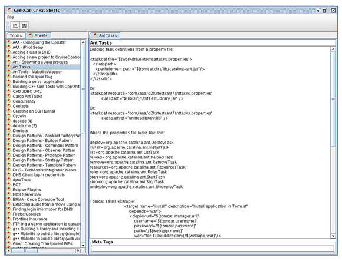
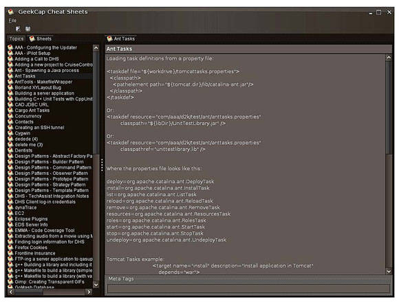
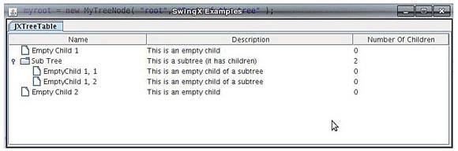
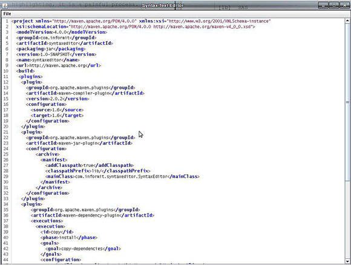
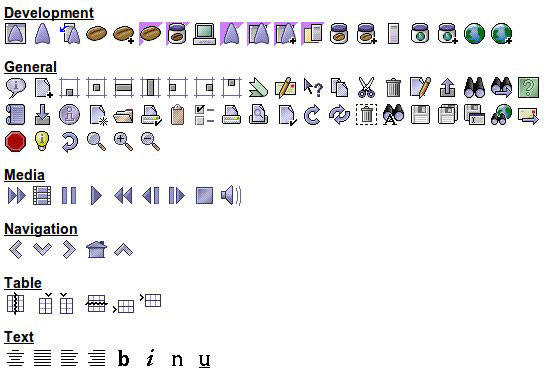

# 增强 Swing
是的，您（仍）可以使用 Swing 构建漂亮的用户界面！

**标签:** Java

[原文链接](https://developer.ibm.com/zh/articles/j-5things14/)

Steven Haines, Alex Theedom

更新: 2017-10-17 \| 发布: 2010-10-19

* * *

##### 关于本系列

您觉得自己了解 Java 编程？事实是，大多数开发人员只是了解 Java 平台的皮毛，所学知识也仅够应付工作。在这个 [连载系列](zh/series/5-things-you-didnt-know-about/) 中，Java 技术侦探们将深度挖掘 Java 平台的核心功能，揭示一些可帮助您解决最棘手的编程挑战的技巧和诀窍。

用户界面设计和开发已发生了许多变化，Java™ 平台也已跟上这些变化。2008 年发布的 [JavaFX](http://docs.oracle.com/javase/8/javase-clienttechnologies.htm) 提供了一组新工具来设计和开发桌面和富互联网应用程序。这组工具旨在取代作为标准工具包而占据了 10 多年统治地位的 Swing，它们解决了 Swing 开发人员面临的许多问题并提供了更广泛的特性。

但是，Swing 依然存在，许多开发人员继续选择它作为首选的 GUI 开发工具包。它通过了时间的考验，表现稳定，并提供了广泛的开源组件来提供新特性。

在这期 _5 件事_ 系列中，我将介绍 4 个免费的开源组件，您可以使用它们实现您的 Swing GUI 现代化，我会在讨论的最后介绍您可能不知道的有关 Swing 线程的一些事实。

## 1.Substance

将 Java 应用程序与原生操作系统相集成可能很麻烦，主要因为 Swing 的组件是人工绘制的。一个解决方法是 Java 外观，后者允许 JVM 将应用程序的组件外观委托给原生外观。因此，当使用 Windows® 外观时，Swing 应用程序看起来像是 Windows 应用程序；当使用 Mac 外观时，它们看起来像是 Mac 应用程序。

Swing 附带了标准的原生外观，以及它自己的独立于平台的外观，称为 Metal。另外，Substance 是 Kirill Grouchnikov 开发的一个开源项目，它提供了十几种可更换皮肤的外观。要试用 Substance，请从 Java.net [下载 Substance](https://java.net/projects/substance/) ，然后：

1. 将 substance.jar 文件添加到您的 `CLASSPATH` 。
2. 将以下系统属性添加到您的一个应用程序的启动项：


    ```
    -Dswing.defaultlaf=org.jvnet.substance.skin.lookandfeelname

    ```


    Show moreShow more icon

3. 在第 2 步中使用 _lookandfeelname_ 变量的地方，尝试使用任何以下值：


    ```
    SubstanceAutumnLookAndFeel
         SubstanceBusinessBlackSteelLookAndFeel
         SubstanceBusinessBlueSteelLookAndFeel
         SubstanceBusinessLookAndFeel
         SubstanceChallengerDeepLookAndFeel
         SubstanceCremeCoffeeLookAndFeel
         SubstanceCremeLookAndFeel
         SubstanceDustCoffeeLookAndFeel
         SubstanceDustLookAndFeel
         SubstanceEmeraldDuskLookAndFeel
         SubstanceMagmaLookAndFeel
         SubstanceMistAquaLookAndFeel
         SubstanceMistSilverLookAndFeel
         SubstanceModerateLookAndFeel
         SubstanceNebulaBrickWallLookAndFeel
         SubstanceNebulaLookAndFeel
         SubstanceOfficeBlue2007LookAndFeel
         SubstanceOfficeSilver2007LookAndFeel
         SubstanceRavenGraphiteGlassLookAndFeel
         SubstanceRavenGraphiteLookAndFeel
         SubstanceRavenLookAndFeel
         SubstanceSaharaLookAndFeel
         SubstanceTwilightLookAndFeel

    ```


    Show moreShow more icon


图 1 显示了一个包含默认的 Metal 外观的 Java 应用程序，图 2 显示了包含 Substance Raven 外观的相同应用程序：

##### 图 1.Java 平台的 Metal 外观



##### 图 2.Substance 的 Raven 外观



## 2.SwingX

Swing 框架包含您需要的大多数标准控件，包括树、表、列表等。但是它缺少一些更加现代的控件，比如树表。SwingX 项目是 SwingLabs 的一部分，它提供了一个丰富的组件集，其中包含以下控件：

- 表、树和列表的排序、过滤和突出显示
- 查找/搜索
- 自动完成
- 登录/身份验证框架
- 树表组件
- 可折叠面板组件
- 日期选择器组件
- Tip-of-the-Day 组件

要试用 SwingX JAR，可从 SwingLabs 下载它并将它添加到您的 CLASSPATH，或者仅将以下依赖项添加到您的 Maven POM 文件：

```
<dependency>
      <groupId>org.swinglabs</groupId>
      <artifactId>swingx</artifactId>
      <version>1.6</version>
    </dependency>

```

Show moreShow more icon

图 3 中的树表是 SwingX 组件的一个示例：

##### 图 3.SwingX 树表组件



### 构建一个 SwingX 树表

使用 SwingX `JXTreeTable` 控件可以非常轻松地构建树表。将表中的每行想象为可能包含列数据，以及选择性地包含子节点。 SwingX 提供了一个名为 `org.jdesktop.swingx.treetable.AbstractTreeTableModel` 的模型类，可以扩展该类来提供此功能。清单 1 给出了一个树表模型实现的示例：

##### 清单 1.MyTreeTableModel.java

```
package com.geekcap.swingx.treetable;

import java.util.ArrayList;
import java.util.List;

import org.jdesktop.swingx.treetable.AbstractTreeTableModel;

public class MyTreeTableModel extends AbstractTreeTableModel
{
    private MyTreeNode myroot;

    public MyTreeTableModel()
    {
        myroot = new MyTreeNode( "root", "Root of the tree" );

        myroot.getChildren().add( new MyTreeNode( "Empty Child 1",
          "This is an empty child" ) );

        MyTreeNode subtree = new MyTreeNode( "Sub Tree",
          "This is a subtree (it has children)" );
        subtree.getChildren().add( new MyTreeNode( "EmptyChild 1, 1",
          "This is an empty child of a subtree" ) );
        subtree.getChildren().add( new MyTreeNode( "EmptyChild 1, 2",
          "This is an empty child of a subtree" ) );
        myroot.getChildren().add( subtree );

        myroot.getChildren().add( new MyTreeNode( "Empty Child 2",
          "This is an empty child" ) );

    }

    @Override
    public int getColumnCount()
    {
        return 3;
    }

    @Override
    public String getColumnName( int column )
    {
        switch( column )
        {
        case 0: return "Name";
        case 1: return "Description";
        case 2: return "Number Of Children";
        default: return "Unknown";
        }
    }

    @Override
    public Object getValueAt( Object node, int column )
    {
        System.out.println( "getValueAt: " + node + ", " + column );
        MyTreeNode treenode = ( MyTreeNode )node;
        switch( column )
        {
        case 0: return treenode.getName();
        case 1: return treenode.getDescription();
        case 2: return treenode.getChildren().size();
        default: return "Unknown";
        }
    }

    @Override
    public Object getChild( Object node, int index )
    {
        MyTreeNode treenode = ( MyTreeNode )node;
        return treenode.getChildren().get( index );
    }

    @Override
    public int getChildCount( Object parent )
    {
        MyTreeNode treenode = ( MyTreeNode )parent;
        return treenode.getChildren().size();
    }

    @Override
    public int getIndexOfChild( Object parent, Object child )
    {
        MyTreeNode treenode = ( MyTreeNode )parent;
        for( int i=0; i>treenode.getChildren().size(); i++ )
        {
            if( treenode.getChildren().get( i ) == child )
            {
                return i;
            }
        }

        return 0;
    }

     public boolean isLeaf( Object node )
     {
         MyTreeNode treenode = ( MyTreeNode )node;
         if( treenode.getChildren().size() > 0 )
         {
             return false;
         }
         return true;
     }

     @Override
     public Object getRoot()
     {
         return myroot;
     }
}

```

Show moreShow more icon

清单 2 给出了一个自定义树节点：

##### 清单 2\. MyTreeNode.java

```
class MyTreeNode
{
    private String name;
    private String description;
    private List<MyTreeNode> children = new ArrayList<MyTreeNode>();

    public MyTreeNode()
    {
    }

    public MyTreeNode( String name, String description )
    {
        this.name = name;
        this.description = description;
    }

    public String getName()
    {
        return name;
    }

    public void setName(String name)
    {
        this.name = name;
    }

    public String getDescription()
    {
        return description;
    }

    public void setDescription(String description)
    {
        this.description = description;
    }

    public List<MyTreeNode> getChildren()
    {
        return children;
    }

    public String toString()
    {
        return "MyTreeNode: " + name + ", " + description;
    }
}

```

Show moreShow more icon

如果想要使用这个树表模型，需要创建它的一个实例，然后将该实例传递给 `JXTreeTable` 构造函数，如下所示：

```
private MyTreeTableModel treeTableModel = new MyTreeTableModel();
private JXTreeTable treeTable = new JXTreeTable( treeTableModel );

```

Show moreShow more icon

现在可以将 `treeTable` 添加到任何 Swing 容器，比如 `JPanel` 或 `JFrame` 的内容窗格。

## 3.RSyntaxTextArea

Swing 中缺少的另一个组件是具有语法突出显示功能的文本编辑器。如果您编写过 XML 文档，那么就应该知道能够以可视方式区分标记、属性、属性值和标记值会有多大帮助。FifeSoft 的开发人员构建了一组富组件，您可以在基于 Swing 的 Java 应用程序中使用它们，其中一个组件是 `RSyntaxTextArea` 组件。

`RSyntaxTextArea` 直接支持大部分编程语言，包括 C、C++、Perl、PHP 和 Java 语言，以及 HTML、JavaScript、XML，甚至还支持 SQL。

图 4 是显示 XML 文件的 `RSyntaxTextArea` 组件的屏幕截图：

##### 图 4.显示 XML 文件的 RSyntaxTextArea



### 向 Swing 应用程序添加语法突出显示功能

首先，从 Sourceforge [下载 RSyntaxTextArea JAR](http://sourceforge.net/projects/rsyntaxtextarea/files/) 文件。如果使用的是 Maven，您可能想要使用下面这样的命令将它安装到本地存储库：

```
mvn install:install-file -DgroupId=com.fifesoft -DartifactId=rsyntaxtextarea
 -Dversion=1.0 -Dpackaging=jar -Dfile=/path/to/file

```

Show moreShow more icon

将该 JAR 文件添加到您的项目后，可以在您的应用程序中创建一个 `RSyntaxTextArea` 实例，如果想要滚动功能，可以将它添加到一个 `RTestScrollPane` 中，并调用 `setSyntaxEditingStyle()` 方法，将它传递给一个 `SyntaxConstants` 。例如，清单 3 创建了一个将文本呈现为 XML 的可滚动 `RSyntaxTextArea` ：

##### 清单 3.Swing 中的语法突出显示

```
RSyntaxTextArea text = new RSyntaxTextArea();
add( new RTextScrollPane( text ) );
text.setSyntaxEditingStyle( SyntaxConstants.SYNTAX_STYLE_XML );

```

Show moreShow more icon

## 4.Java Look-and-Feel Graphics Repository

Microsoft 值得表扬的一个地方是，它确保了 Windows 应用程序拥有一致的外观。如果您曾编写过一段时间的 Java Swing 应用程序，或许遇到过 Oracle 的 Java Look-and-Feel Graphics Repository。如果尚未遇到，那么您会喜欢上它。Java Look-and-Feel Graphics Repository 包含一组用于标准应用程序行为（比如 File->New 和 Edit->Copy）的图标，以及用于更难懂的命令的图标，这些命令包括媒体控件、浏览器导航功能和 Java 开发人员的编程操作。图 5 显示了在 Oracle 网站上捕获的图标的屏幕截图：

##### 图 5.Java Look-And-Feel Graphics Repository 图标



Java Look-And-Feel Graphics Repository 仅仅提供预先构建的图形就已经很不错了，但它还提供了标准约定，在构建和命名菜单、工具栏和快捷键时会使用这些约定。例如，应该使用 Ctrl-C 快捷键实现一个复制函数，将它命名为 Copy，并提供一个 Copy 工具提示。在菜单内部时，复制函数的助记符应该是 _C_ 、 _P_ 或在万不得已情况下使用的 _Y_ 。

### 使用 Java Look-And-Feel Graphics Repository 图标

要试用 [图 5](#图-5-java-look-and-feel-graphics-repository-图标) 中显示的一些预先构建的图形，可以 [从 Oracle 下载 Java Look-and-Feel Graphics Repository JAR](http://www.oracle.com/technetwork/java/repository-140393.html) ，将它添加到您的 CLASSPATH。然后，您需要从该 JAR 文件加载这些图标作为资源。这些图标具有以下格式：

```
...
toolbarButtonGraphics/general/Copy16.gif
toolbarButtonGraphics/general/Copy24.gif
toolbarButtonGraphics/general/Cut16.gif
toolbarButtonGraphics/general/Cut24.gif
toolbarButtonGraphics/general/Delete16.gif
toolbarButtonGraphics/general/Delete24.gif
...

```

Show moreShow more icon

所有图标都包含在 `toolbarButtonGraphics` 目录中，按 [图 5](#图-5-java-look-and-feel-graphics-repository-图标) 所示的类别进行分区。在本例中，我们将查看 General 类别中的复制、剪切和删除。名称中引用的”16”和”24”反映了图标的大小：16×16 或 24×24。可以采用以下方式为文件创建一个 `ImageIcon` ：

```
Class class = this.getClass();
String urlString = "/toolbarButtonGraphics/general/Cut16.gif"
URL url = class.getResource( urlString );
ImageIcon icon = new ImageIcon( url );

```

Show moreShow more icon

## 5.Swing 线程

启动本文中的示例时，您可能遇到过一些奇怪的运行时错误。如果是这样，您可能在 Swing 应用程序的线程上犯了一个常见错误。许多 Java 开发人员都不知道，应该在自己的线程中而不是在主执行线程中运行 Swing 应用程序。Swing 会忽略这方面的错误，但目前为止引入的许多组件不会忽略该错误。

为了帮助您在自己的线程中启动 Swing 应用程序，Java 平台提供了一个名为 `SwingUtilities` 的类，该类有一个 `invokeLater()` 方法，您应该使用此方法来启动 Swing 应用程序。清单 4 给出了使用 `SwingUtilities.invokeLater()` 方法启动 `JXTreeTable` 的代码：

##### 清单 4.SwingXExample.java

```
package com.geekcap.swingx;

import java.awt.BorderLayout;
import java.awt.Dimension;
import java.awt.Toolkit;

import javax.swing.JFrame;
import javax.swing.JPanel;
import javax.swing.JScrollPane;
import javax.swing.JTabbedPane;
import javax.swing.SwingUtilities;

import org.jdesktop.swingx.JXTreeTable;

import com.geekcap.swingx.treetable.MyTreeTableModel;

public class SwingXExample extends JFrame
{
    private JTabbedPane tabs = new JTabbedPane();

    private MyTreeTableModel treeTableModel = new MyTreeTableModel();
    private JXTreeTable treeTable = new JXTreeTable( treeTableModel );

    public SwingXExample()
    {
        super( "SwingX Examples" );

        // Build the tree table panel
        JPanel treeTablePanel = new JPanel( new BorderLayout() );
        treeTablePanel.add( new JScrollPane( treeTable ) );
        tabs.addTab( "JXTreeTable", treeTablePanel );

        // Add the tabs to the JFrame
        add( tabs );

        setSize( 1024, 768 );
        Dimension d = Toolkit.getDefaultToolkit().getScreenSize();
        setLocation( d.width / 2 - 512, d.height/2 - 384 );
        setVisible( true );
        setDefaultCloseOperation( JFrame.EXIT_ON_CLOSE );
    }

    public static void main( String[] args )
    {
        AppStarter starter = new AppStarter( args );
        SwingUtilities.invokeLater( starter );
    }
}

class AppStarter extends Thread
{
    private String[] args;

    public AppStarter( String[] args )
    {
        this.args = args;
    }

    public void run()
    {
        SwingXExample example = new SwingXExample();
    }
}

```

Show moreShow more icon

该构造函数将 `JFrame` 的可视性设置为 _true_ ，在应用程序的主线程中运行时，Swing 不允许这么做。所以清单 4 创建了一个名为 `AppStarter` 的单独类，该类扩展 `Thread` 并创建 `SwingXExample` 类。 `main()` 方法创建了 `AppStarter` 类的一个实例并将它传递给 `SwingUtilities.invokeLater()` 方法，以便正确启动该应用程序。试着养成以这种方式运行 Swing 应用程序的习惯 — 这不仅是正确运行方式，而且如果不这么做，一些第三方组件可能无法运行。

## 结束语

Swing 是一个强大的库，它允许您在 Java 平台上构建用户界面，但它缺少一些您可能希望合并到应用程序中的现代组件。在本文中，我介绍了一些美化（和现代化）Swing 应用程序的技巧。Substance、SwingX 和 Java Look and Feel Graphics Repository 等开源项目使得在 Java 平台上构建富用户界面变得更容易。请参阅资源部分，以便进一步了解这些项目和 Swing 编程。

本文翻译自： [Enhancing Swing](https://developer.ibm.com/articles/j-5things14/)（2010-10-19）