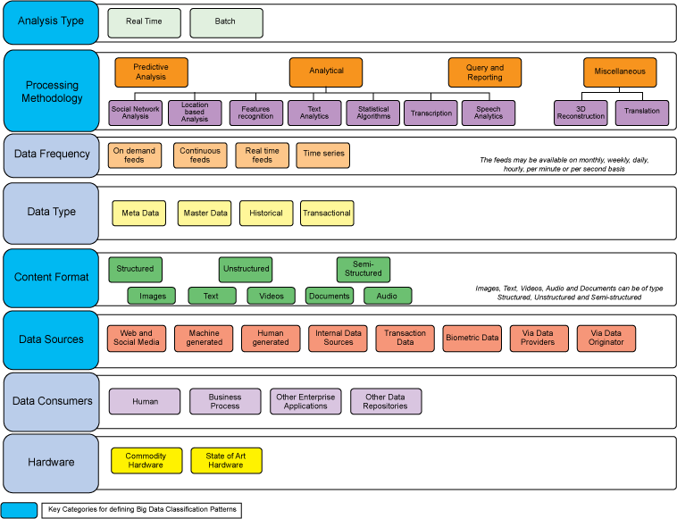

# 大数据分类和架构简介
如何将大数据分为不同的类别

**标签:** 分析

[原文链接](https://developer.ibm.com/zh/articles/bd-archpatterns1/)

Divakar Mysore, Shrikant Khupat, Shweta Jain

发布: 2014-08-28

* * *

## 概述

大数据可通过许多方式来存储、获取、处理和分析。每个大数据来源都有不同的特征，包括数据的频率、量、速度、类型和真实性。处理并存储大数据时，会涉及到更多维度，比如治理、安全性和策略。选择一种架构并构建合适的大数据解决方案极具挑战，因为需要考虑非常多的因素。

这个 “大数据架构和模式” 系列提供了一种结构化和基于模式的方法来简化定义完整的大数据架构的任务。因为评估一个业务场景是否存在大数据问题很重要，所以我们包含了一些线索来帮助确定哪些业务问题适合采用大数据解决方案。

## 从分类大数据到选择大数据解决方案

##### 试用 IBM 大数据解决方案

下载 IBM 大数据解决方案的试用版，查看它在您自己的环境中如何工作。从多款产品中进行选择：

- [BigInsights Quick Start Edition](http://www.ibm.com/developerworks/cn/downloads/im/biginsightsquick/)，IBM 基于 Hadoop 的产品，通过 Big SQL、文本分析和 BigSheets 等功能扩展了开源 Hadoop 的价值。
- [InfoSphere Streams Quick Start Edition](http://www.ibm.com/developerworks/cn/downloads/im/streamsquick/index.html) 是 InfoSphere Streams 的一个非生产版本，是一个可快速获取、分析和关联从数千个实时来源传来的信息的高性能计算平台。
- 其他许多大数据和分析产品 [提供了试用版下载](http://www.ibm.com/developerworks/cn/downloads/#bd)。

如果您花时间研究过大数据解决方案，那么您一定知道它不是一个简单的任务。本系列将介绍查找满足您需求的大数据解决方案所涉及的主要步骤。

我们首先介绍术语 “大数据” 所描述的数据类型。为了简化各种大数据类型的复杂性，我们依据各种参数对大数据进行了分类，为任何大数据解决方案中涉及的各层和高级组件提供一个逻辑架构。接下来，我们通过定义原子和复合分类模式，提出一种结构来分类大数据业务问题。这些模式有助于确定要应用的合适的解决方案模式。我们提供了来自各行各业的示例业务问题。最后，对于每个组件和模式，我们给出了提供了相关功能的产品。

第 1 部分将介绍如何对大数据进行分类。本系列的后续文章将介绍以下主题：

- 定义大数据解决方案的各层和组件的逻辑架构
- 理解大数据解决方案的原子模式
- 理解用于大数据解决方案的复合（或混合）模式
- 为大数据解决方案选择一种解决方案模式
- 确定使用一个大数据解决方案解决一个业务问题的可行性
- 选择正确的产品来实现大数据解决方案

## 依据大数据类型对业务问题进行分类

业务问题可分类为不同的大数据问题类型。以后，我们将使用此类型确定合适的分类模式（原子或复合）和合适的大数据解决方案。但第一步是将业务问题映射到它的大数据类型。下表列出了常见的业务问题并为每个问题分配了一种大数据类型。

##### 不同类型的大数据业务问题

业务问题大数据问题描述公用事业：预测功耗机器生成的数据公用事业公司推出了智慧仪表，按每小时或更短的间隔定期测量水、天然气和电力的消耗。这些智慧仪表生成了需要分析的大量间隔数据。 公用事业公司还运行着昂贵而又复杂的大型系统来发电。每个电网包含监视电压、电流、频率和其他重要操作特征的复杂传感器。 要提高操作效率，该公司必须监视传感器所传送的数据。大数据解决方案可以使用智慧仪表分析发电（供应）和电力消耗（需求）数据。电信：客户流失分析Web 和社交数据 交易数据电信运营商需要构建详细的客户流失模型（包含社交媒体和交易数据，比如 CDR），以跟上竞争形势。 流失模型的值取决于客户属性的质量（客户主数据，比如生日、性别、位置和收入）和客户的社交行为。 实现预测分析战略的电信提供商可通过分析用户的呼叫模式来管理和预测流失。市场营销：情绪分析Web 和社交数据营销部门使用 Twitter 源来执行情绪分析，以便确定用户对公司及其产品或服务的评价，尤其是在一个新产品或版本发布之后。 客户情绪必须与客户概要数据相集成，才能得到有意义的结果。依据客户的人口统计特征，客户反馈可能有所不同。客户服务：呼叫监视人类生成的IT 部门正在依靠大数据解决方案来分析应用程序日志，以便获取可提高系统性能的洞察。来自各种应用程序供应商的日志文件具有不同的格式；必须将它们标准化，然后 IT 部门才能使用它们。零售：基于面部识别和社交媒体的个性化消息Web 和社交数据 生物识别零售商可结合使用面部识别技术和来自社交媒体的照片，根据购买行为和位置向客户提供个性化的营销信息。 此功能对零售商忠诚度计划具有很大的影响，但它具有严格的隐私限制。零售商需要在实现这些应用程序之前进行适当的隐私披露。零售和营销：移动数据和基于位置的目标机器生成的数据 交易数据零售商可根据位置数据为客户提供特定的促销活动和优惠券。解决方案通常旨在在用户进入一个店铺时检测用户的位置，或者通过 GPS 检测用户的位置。 位置数据与来自社交网络的客户偏好数据相结合，使零售商能够根据购买历史记录针对性地开展在线和店内营销活动。通知是通过移动应用程序、SMS 和电子邮件提供的。FSS、医疗保健：欺诈检测机器生成的数据 交易数据 人类生成的欺诈管理可预测给定交易或客户帐户遇到欺诈的可能性。解决方案可实时分析事务，生成建议的立即执行的措施，这对阻止第三方欺诈、第一方欺诈和对帐户特权的蓄意滥用至关重要。 解决方案通常旨在检测和阻止多个行业的众多欺诈和风险类型，其中包括： _信用卡和借记卡欺诈_ 存款帐户欺诈 _技术欺诈_ 坏账 _医疗欺诈_ 医疗补助计划和医疗保险欺诈 _财产和灾害保险欺诈_ 工伤赔偿欺诈 _保险欺诈_ 电信欺诈

按类型对大数据问题分类，更容易看到每种数据的特征。这些特征可帮助我们了解如何获取数据，如何将它处理为合适的格式，以及新数据出现的频率。来自不同来源的数据具有不同的特征；例如，社交媒体数据包含不断传入的视频、图像和非结构化文本（比如博客文章）。

我们依据这些常见特征来评估数据，下一节将详细介绍这些特征：

- 内容的格式
- 数据的类型（例如，交易数据、历史数据或主数据）
- 将提供该数据的频率
- 意图：数据需要如何处理（例如对数据的临时查询）
- 处理是否必须实时、近实时还是按批次执行。

## 使用大数据类型对大数据特征进行分类

按特定方向分析大数据的特征会有所帮助，例如以下特征：数据如何收集、分析和处理。对数据进行分类后，就可以将它与合适的大数据模式匹配：

- 分析类型 — 对数据执行实时分析还是批量分析。请仔细考虑分析类型的选择，因为这会影响一些有关产品、工具、硬件、数据源和预期的数据频率的其他决策。一些用例可能需要混合使用两种类型：

    - 欺诈检测；分析必须实时或近实时地完成。
    - 针对战略性业务决策的趋势分析；分析可采用批量模式。
- 处理方法 — 要应用来处理数据的技术类型（比如预测、分析、临时查询和报告）。业务需求确定了合适的处理方法。可结合使用各种技术。处理方法的选择，有助于识别要在您的大数据解决方案中使用的合适的工具和技术。
- 数据频率和大小 — 预计有多少数据和数据到达的频率多高。知道频率和大小，有助于确定存储机制、存储格式和所需的预处理工具。数据频率和大小依赖于数据源：

    - 按需分析，与社交媒体数据一样
    - 实时、持续提供（天气数据、交易数据）
    - 时序（基于时间的数据）
- 数据类型 — 要处理数据类型 — 交易、历史、主数据等。知道数据类型，有助于将数据隔离在存储中。
- 内容格式（传入数据的格式）结构化（例如 RDMBS）、非结构化（例如音频、视频和图像）或半结构化。格式确定了需要如何处理传入的数据，这是选择工具、技术以及从业务角度定义解决方案的关键。
- 数据源 — 数据的来源（生成数据的地方），比如 Web 和社交媒体、机器生成、人类生成等。识别所有数据源有助于从业务角度识别数据范围。该图显示了使用最广泛的数据源。
- 数据使用者 — 处理的数据的所有可能使用者的列表：

    - 业务流程
    - 业务用户
    - 企业应用程序
    - 各种业务角色中的各个人员
    - 部分处理流程
    - 其他数据存储库或企业应用程序
- 硬件 — 将在其上实现大数据解决方案的硬件类型，包括商用硬件或最先进的硬件。理解硬件的限制，有助于指导大数据解决方案的选择。

[大数据分类](#大数据分类) 描绘用于分类大数据的各种类别。定义大数据模式的关键类别已识别并在蓝色方框中突出显示。大数据模式（将在下一篇文章中定义）来自这些类别的组合。

##### 图 1.大数据分类

## 结束语和致谢

在本系列剩余部分中，我们将介绍大数据解决方案的逻辑架构和各层，从访问到使用大数据。我们将提供数据源的完整列表，介绍专注于大数据解决方案的每个重要方面的原子模式。我们还将介绍复合模式，解释可如何结合使用原子模式来解决特定的大数据用例。本系列最后将提供一些解决方案模式，在广泛使用的用例与各个产品之间建立对应关系。

感谢 Rakesh R. Shinde 在定义本系列的整体结构上提供的指导，以及对本系列的审阅和提供的宝贵评论。

本文翻译自： [Introduction to big data classification and architecture](https://developer.ibm.com/articles/bd-archpatterns1/)（2014-08-28）