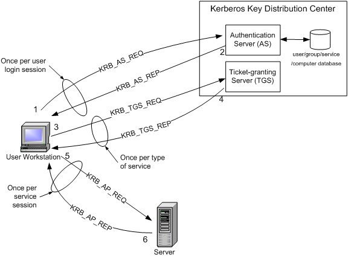
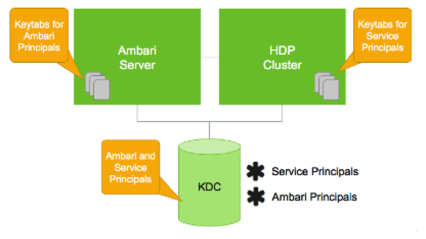
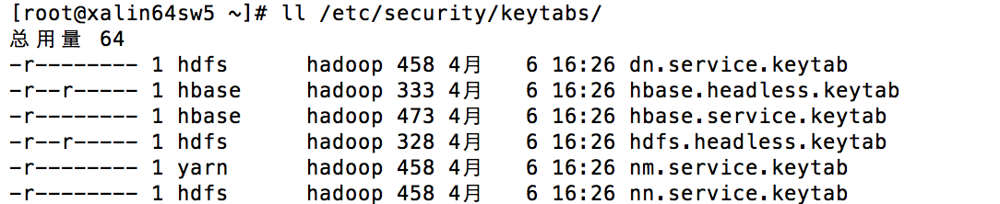
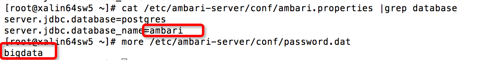
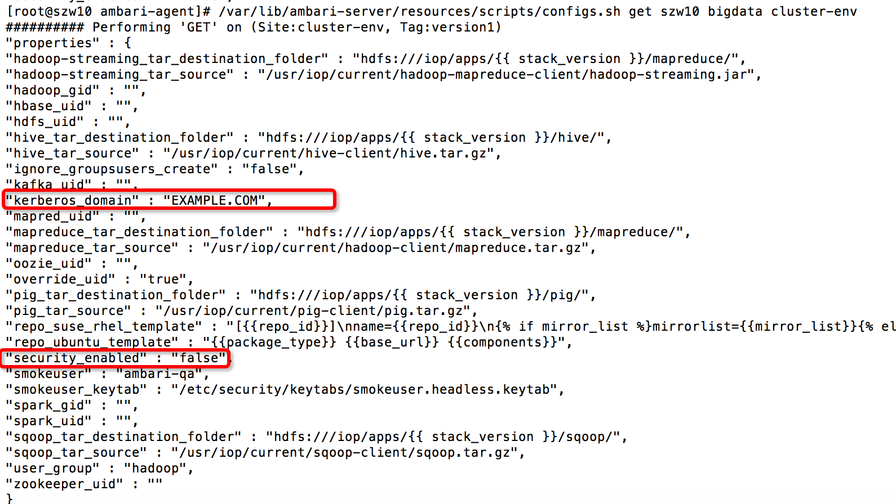
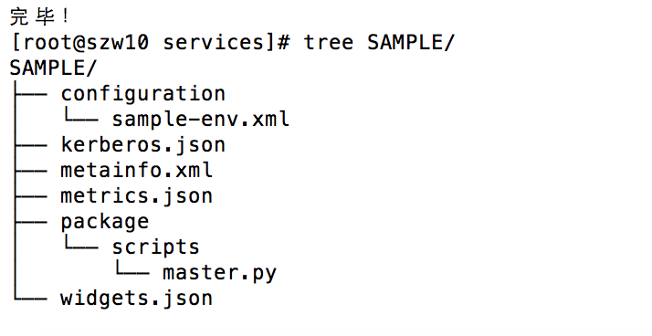

# 大数据平台搭建利器 Ambari 之 Kerberos 集成之路
Kerberos 快速上手

**标签:** Python,分析

[原文链接](https://developer.ibm.com/zh/articles/os-cn-ambrri-kerberos/)

沈钊伟

发布: 2016-04-25

* * *

## Kerberos 介绍

Kerberos 是一个网络认证的框架协议，其设计的初衷便是通过密钥系统为 Client 和 Server 应用程序之间提供强大的认证服务。在使用 Kerberos 认证的集群中，Client 不会直接和 Server 进行认证，而是通过 KDC（Key Distribution Center）来完成互相的认证。首先，我们需要简单的介绍下跟 Kerberos 相关的术语，如表 1 所示。

##### 表 1.Kerberos 相关的术语

术语简述KDC（Key Distribution Center）在启用 Kerberos 的环境中，KDC 用于验证各个模块Kerberos KDC ServerKDC 所在的机器Kerberos Client任何一个需要通过 KDC 认证的机器（或模块）Principal用于验证一个用户或者一个 Service 的唯一的标识，相当于一个账号，需要为其设置密码（这个密码也被称之为 Key）Keytab包含有一个或多个 Principal 以及其密码的文件Relam由 KDC 以及多个 Kerberos Client 组成的网络KDC Admin AccountKDC 中拥有管理权限的账户（例如添加、修改、删除 Principal）Authentication Server (AS)用于初始化认证，并生成 Ticket Granting Ticket (TGT)Ticket Granting Server (TGS)在 TGT 的基础上生成 Service Ticket。一般情况下 AS 和 TGS 都在 KDC 的 Server 上

Kerberos 的认证过程如下图所示。我们可以简单的理解为，一个 User 或者一个 Service 会用 Principal 到 AS 去认证，AS 会返回一个用 Principal Key 加密的 TGT，这时候只有 AS 和这个 Principal 的使用者可以识别该 TGT。在拿到加密的 TGT 之后，User 或者 Service 会使用 Principal 的 Key 来解密 TGT，并使用解密后的 TGT 去 TGS 获取 Service Ticket。在 Kerberos 认证的集群中，只有拿着这个 Service Ticket 才可以访问真正的 Server 从而实现自己的业务逻辑。一般我们将 TGT 的存放文件，称为 Kerberos Confidential 文件，默认的存放目录为/tmp，文件名则由 krb5cc 和用户的 id 组成，例如”/tmp/krb5cc\_0”为 root 的 confidential 文件。

##### 图 1\. Kerberos 的认证流程



##### 表 2\. 常用的 Kerberos 命令

命令名命令简介Kadmin用于管理 Kerberos 相关配置的，需要用 Principal 登录（需要 Principal 的 Key），可以在任一个 Kerberos Client 机器上使用Kadmin.local同 Kadmin，不过这个命令供 root 使用（只能在 KDC Server 上用）Kinit生成初始化 ticket，也就是 TGT，并保存到一个 cache 文件，一般存放在/tmp 目录Klist用于列出 Kerberos 的 Confidential 信息，默认会列出/tmp 目录下的 cache 文件中的 Confidential 信息，也可以列出 keytab 文件的 ticket 信息Ktutil用于管理 keytab 文件

有兴趣的读者可以在 Kerberos 的环境中试试以上的命令。目前业界常见的 Kerberos 的实现有 MIT Kerberos 和 Microsoft Kerberos，从名称便可以知道分别是由麻省理工和微软实现的。本文将要介绍的 Ambari 的 Automated Kerberization 机制，使用 MIT Kerberos。

## Ambari 与 Kerberos

在 Ambari 环境中，Kerberos 本身是作为 Ambari 的一个 Service 而存在。当用户通过 Ambari 的 Automated Kerberization 机制启用 Kerberos 认证的时候，Ambari 会为各个 Service 创建对应的 Principal 以及 Keytab 文件。在 Linux Redhat6（CentOS 6）上，Ambari 默认的会使用 Kerberos1.10.3 的版本，而在 Redhat7（CentOS 7）上，则默认使用 Kerberos1.13.2。因此，需要启用 Kerberos 认证的集群，需要注意 Kerberos 版本的兼容性问题。Ambari、Stack、Service 以及 KDC 的关系大致如下图所示：

##### 图 2\. Ambari 与 KDC 的关系图



当一个模块或者一个用户要通过 KDC 认证自己的时候，会需要一个 Principal 以及该 Principal 的 Key。当 Keytab 文件存在的时候，模块（或用户）则可以直接使用 Principal 以及包含该 Principal 的 Keytab 文件向 KDC 认证。因而，对 Ambari 而言，其功能就是要为对应的 Service 或者 Component 创建 Principal 以及该 Principal 的 Keytab 文件。这里要理解，Principal 是在 KDC 中创建，并保存在 KDC Server 的数据库。Keytab 是一个存放 Principal 以及加密过的 Principal Key 的文件，该文件需要存放在 Kerberos Client 对应的机器中，并且要对相应的用户设置只读权限。在 Ambari 的环境中，Ambari 已经为用户完成了以上的操作。有兴趣的读者可以想想，为什么这里需要定向的设置只读权限。

##### 图 3\. 启动 Kerberos 的 Ambari 机器上面的 Keytab 文件权限



### Ambari Server 端的接口

下来我们简单看下 Ambari 如何创建 Principal 以及 Keytab 文件。首先我们需要假设 Ambari Server 已经获取到将要创建的 Principal 的名字以及存放 Keytab 文件的路径（这些参数都定义在 Kerberos Descriptor 中，后面会详细介绍）。这里主要涉及两个 Java 代码文件，分别是 CreatePrincipalServerAction.java 和 CreateKeytabFileServerAction.java。具体接口如下：

##### 清单 1\. 创建 Principal 的代码（Ambari Server）

```
/**CreatePrincipalServerAction.java
* Creates a principal in the relevant KDC
*
* @param principal the principal name to create
* @param isServicePrincipal true if the principal is a service principal; false if the
* principal is a user principal
* @param kerberosConfiguration the kerberos-env configuration properties
* @param kerberosOperationHandler the KerberosOperationHandler for the relevant KDC
* @param actionLog the logger (may be null if no logging is desired)
* @return a CreatePrincipalResult containing the generated password and key number value
*/
public CreatePrincipalResult createPrincipal(String principal, boolean isServicePrincipal,
Map<String,String> kerberosConfiguration, KerberosOperationHandler kerberosOperationHandler,
ActionLog actionLog) {
....
//根据用户设定的规则生成一个密码字符串
String password = securePasswordHelper.createSecurePassword(length, minLowercaseLetters,
                      minUppercaseLetters, minDigits, minPunctuation, minWhitespace);
...
...
//调用 kerberosOperationHandler 向 KDC 创建 Principal
Integer keyNumber = kerberosOperationHandler.createPrincipal(principal, password, isServicePrincipal);
...
}

```

Show moreShow more icon

从上面的简要代码中，我们可以看到是由 Ambari Server 调用 KDC 的接口创建的 Principal。有兴趣的读者可以看看完整的开源代码，这里 Principal 的 Key，也就是 password 变量。Ambari Server 会根据用户在 Kerberos 中配置的密码限制条件生成一个临时密码串来作为 Principal 的 Key，并且不会将该密码保存到持久化的存储中（但是会保存到内存中一个 Map 的数据结构）或者返回。也就是说 Ambari Server 并不会给自己赋予管理 Principal 密码的责任。这是由 Ambari 的设计决定的。熟悉 Ambari 的读者，应该清楚 Ambari Server 会将所有的相关配置信息持久化的存储在 Postgres 数据库中。默认情况下，库的名字为 ambari，并且数据库对应的访问密码为 bigdata。 Ambari 目前的实现中，并不会将数据库的密码等信息加密存储，而是明文的放在”/etc/ambari-server/conf/password.dat”。所以，一个别有用心的人可以很容易的获取 Ambari 数据库的信息，甚至可以更改其中的内容。

##### 图 4\. Ambari 的数据库密码



由此，我们可以认为 Ambari Server 数据库中的数据本身就不是很安全，所以如果将固定的 Principal 密码存放在 Postgres 数据库中，就显得更不合理了。并且对于 Kerberos 的认证机制来说，是完全可以抛弃密码而使用 Keytab 来代替的。如果有的读者需要将第三方服务托管给 Ambari，并且期望使用 Ambari 的 Automated Kerberization 机制，就需要注意，在 Service 的配置项中不要提供 Principal 的密码（其实也不必要）。

到这里，我们已经大致了解了 Ambari 如何创建 Principal。下来让我们再看下 Ambari 如何创建对应的 Keytab 文件。具体的接口如下：

##### 清单 2\. 创建 Keytab 的入口代码（Ambari Server）

```
/**CreteKeytabFilesServerActon.java
* For each identity, create a keytab and append to a new or existing keytab file.
* <
*
*@param identityRecord a Map containing the data for the current identity record
*@param evaluatedPrincipal a String indicating the relevant principal
*@param operationHandler a KerberosOperationHandler used to perform Kerberos-related
* tasks for specific Kerberos implementations
* (MIT, Active Directory, etc...)
* @param kerberosConfiguration a Map of configuration properties from kerberos-env
* @param requestSharedDataContext a Map to be used a shared data among all ServerActions related
* to a given request @return a CommandReport, indicating an error
* condition; or null, indicating a success condition
* @throws AmbariException if an error occurs while processing the identity record
*/
@Override
protected CommandReport processIdentity(Map<String, String> identityRecord, String evaluatedPrincipal,
KerberosOperationHandler operationHandler,
Map<String, String> kerberosConfiguration,
Map<String, Object> requestSharedDataContext)
throws AmbariException {
...
//创建 Keytab 文件的内容，也就是 Keytab data
Keytab keytab = createKeytab(evaluatedPrincipal, password, keyNumber,
                operationHandler, visitedPrincipalKeys != null, canCache, actionLog);
...
...
//将创建的 Keytab data，写入 Keytab 文件中，如果文件不存在就创建，如果存在，就将内容 merge 到一起
operationHandler.createKeytabFile(keytab, destinationKeytabFile)) {
ensureAmbariOnlyAccess(destinationKeytabFile);
...
}

```

Show moreShow more icon

在上面这个接口中，我只简要的列出了两行比较关键的代码，前一行是生成 Keytab 的内容，后一行则将内容写入 Keytab 文件中。我们从代码中看到的 password 参数，这个参数也就是来源于创建 Principal 的函数中。在上一段描述中，已经提到 Ambari Server 虽然不会将 Principal 的密码存入数据库，但会放到一个共享的 Map 中，这里便会从该 Map 中取出对应的 Principal 密码，并生成该 Principal 的 Keytab Data。有兴趣的读者可以仔细阅读完整的 Ambari Server 代码，这里我们还需要注意一个变量，便是 destinationKeytabFile，也就是 Keytab 文件的存放路径，这个路径可能是远程的（不在 Ambari Server）。如果需要完整的理解 Ambari Server 创建 Keytab 和 Principal 的流程，还需要查看很多代码如 Keytab 类以及 KerberosOperationHandler（接口类，提供具体操作 Principal 和 Keytab 的方法）。

### Ambari Agent 端接口

为了更好的理解 Ambari Server 在 Automated Kerberization 中的职责，我们介绍了 Ambari Server 中比较关键的两个函数。接下来让我们再看下 Ambari Agent 中提供的 Kerberos 相关的方法。首先我们知道 Agent 主要是由 Python 代码以及一些 Shell 脚本实现。因而，下面的内容主要也是以 Python 和 Shell 为基础。在之前的文章中我们已经了解，在 Agent 端，Service 必须实现 install\\start\\stop\\status 等控制函数，这些都是最基础的逻辑。对于 Automated Kerberization 来说，Service 首先需要获取当前集群 Kerberos 认证启用的状态（enabled/disabled），而这个状态被保存在 cluster-env 中。以下我们就先介绍下如何获取该状态的方法。

在之前的文章中已经介绍过 Script 类以及其提供的 get\_config 接口，调用该接口可以在 Agent 端获得 Ambari 集群配置信息的全集，也就自然会包含 Kerberos 状态的信息。简要的 Python 示例代码如下：

##### 清单 3\. Python 示例代码

```
from resource_management.libraries.script.script import Script
config = Script.get_config()
security_enabled = config['configurations']['cluster-env']['security_enabled']
if security_enabled:
#do something
pass

```

Show moreShow more icon

在 Ambari Server 的安装目录中提供了一个名为 configs.sh 的 Shell 脚本，其通过 curl 命令以及 sed 编辑器，实现了获取 Ambari 集群配置的功能，并且会格式化输出结果。因此，我们可以将该脚本同步到 Agent 机器，在 Agent 端直接调用这个脚本获取 Kerberos 的状态信息。这里需要注意，该脚本不仅可以获取集群的相关配置，也可以更新或删除某一个配置项。本质上讲，该脚本就是通过 curl 命令调用 Rest API 来操作 Ambari 的 Desired Configuration（Ambari 的一种资源概念）信息，有兴趣的读者可以尝试更多该脚本的功能。获取 Kerberos 状态的示例命令如下 (configs.sh 脚本路径为/var/lib/ambari-server/resources/scripts/)：

configs.sh get ambari-server cluster-name cluster-env

##### 图 5\. 执行 configs.sh 脚本的结果



通过以上的方法，我们便可以从 Agent 端获取到集群的 Kerberos 状态，这只是第一步。Ambari 只会帮助 Service 创建对应的 Principal 和 Keytab 文件，如何使用则是 Service 该考虑的问题。当 Ambari 中的 Service 成功拿到 Principal 和 Keytab 的名称之后，便需要通过 KDC 去认证，进而生成对应的 Kerberos Confidential 文件。该文件一般为 8 小时有效，并默认存放在/tmp 目录中。有了该文件便可以直接向其他模块通信。所以在 Service 的控制脚本中，一般需要生成 Kerberos Confidential 文件。这里 Ambari 提供了一个公用的方法”get\_kinit\_path”获取 Kinit 命令的路径，这样脚本便可以调用 Kinit 来生成 Kerberos 的 Confidential 文件。如果要使用该方法，需要在 Python 脚本中导入该模块，具体如下：

from resource\_management.libraries.functions import get\_kinit\_path

## Ambari Kerberos Descriptor 介绍

从上面的介绍中，我们了解了 Ambari Server 如何创建 Principal 和 Keytab，以及如何在 Agent 端获取对应的 Kerberos 信息。这一小节，便介绍下如何在 Ambari 中对一个 Service 定义相关的 Kerberos 参数，而这个定义文件，便称之为 Kerberos Descriptor。

Kerberos Descriptor 是一个 Json 格式的文件，存放于 Service 或者 Stack 的根目录，并命名为 kerberos.json，其包含有 Principal 的名字、Keytab 的路径等 Kerberos 相关的配置。这里需要注意，当一个 Service 通过 Kerberos.json 声明相关的 Kerberos 配置时，其所归属的 Stack 也必须存在 Kerberos.json 文件。换句话说，先要有 Stack 级别的 Kerberos.json，才能有 Service 级别的 Kerberos.json，并且在 Service 级别的配置文件中，又会有 Compoent 级别的区分。下面我们用 Spark 的 kerberos.json 为例，来介绍下该文件。

##### 清单 4\. Spark 的 kerbers.json

```
{
"services": [
{
"name": "SPARK",
"identities": [
{
"name": "/smokeuser"
},
{
"name": "sparkuser",
"principal": {
"value": "${spark-env/spark_user}-${cluster_name}@${realm}",
"type" : "user",
"configuration": "spark-defaults/spark.history.kerberos.principal",
"local_username" : "${spark-env/spark_user}"
},
"keytab": {
"file": "${keytab_dir}/spark.headless.keytab",
"owner": {
"name": "${spark-env/spark_user}",
"access": "r"
},
"group": {
"name": "${cluster-env/user_group}",
"access": ""
},
"configuration": "spark-defaults/spark.history.kerberos.keytab"
}
}
],
"configurations": [
{
"spark-defaults": {
"spark.history.kerberos.enabled": "true"
}
}
],
"components": [
{
"name": "SPARK_JOBHISTORYSERVER",
"identities": [
{
"name": "/HDFS/NAMENODE/hdfs"
}
]
},
{
"name": "SPARK_CLIENT"
}
]
}
]
}

```

Show moreShow more icon

从以上的配置代码中可以看到，Spark 只在 Service 级别定义了一个 sparkuser 段，并配置了 Principal 和 Keytab 等定义。因此，这里我们就先仔细看下 sparkuser 段的配置。该段中配置了 Principal 的名称，由 spark-env 中的 spark\_user（默认为 spark）加上 Ambari 的 cluster name 和 Kerberos 的 REALM 名组成。Type 为 user（也可以是 service）。Principal 段和 Keytab 段中的 configuration 标签用于关联该 Service 的配置项参数，从而呈现在 Ambari WEB 中。当在 Ambari 启用 Automated Kerberization 机制的时候，如果已经部署了 Spark，Ambari 会读取 kerberos.json 中的 Principal 和 Keytab 的值，并将其中 value 段的配置关联到 spark-default 中的 spark.history.kerberos.principal 和 spark.history.kerberos.keytab。在 Keytab 字段中，还通过 file 标签配置了 keytab 的存放路径（{keytab\_dir} 默认为/etc/security/keytabs，可以在启用 Automated Kerberization 的时候更改）。Owner 和 group 配置了文件的用户组权限，这里注意 keytab 一般只能配置为只读权限，否则会有安全问题。另外，在独立的 configuration 段的配置会被增加到该 Service 的 Desired Configuration 信息中。用户也可以在 Compoent 段为 Service 的模块配置不同的 Principal 和 Keytab。在 Service 的 Kerberos.json 文件中，也可以关联其他 Service 的配置，或者关联 Stack 级别的配置。当需要关联的时候，只需要使用字符”/”。例如”/smokeuser”关联的便是 Stack 级别的配置，”/HDFS/NAMENODE/hdfs”则是关联 HDFS 中 namenode 的配置。Kerberos.json 在 Stack 之间以及 Service 版本之间，存在继承关系。不过目前的实现中还不支持部分更新。也就是说 Service 或者 Stack 的新版本，如需要定义一个新的 Kerberos.json 文件，就必须完整重写上一个版本的所有配置。在 Ambari 中启用 Kerberos 之后，我们可以使用 configs.sh 的脚本查看 spark-defaults 的更新，以及 cluster-env 的变化。

##### 图 6\. 使用 configs.sh 获得 spark-defaults 的配置项（启用 Kerberos 之后）


### 为第三方的 Service 定义 Kerberos Descriptor

这里我简要的实现了一个 Sample Service，其目录结果如下：

##### 图 7\. 示例 Sample 目录结构



我们主要看下其中的 sample-env 和 Kerberos.json 文件。

##### 清单 5\. Kerberos.json 配置代码

```
{
"services": [
{
"name": "SAMPLE",
"identities": [
{
"name": "sample1",
"principal": {
"value": "sample1/_HOST@${realm}",
"type" : "user",
"configuration": "sample-env/sample1.principals",
"local_username" : "root"
},
"keytab": {
"file": "${keytab_dir}/sample1.keytab",
"owner": {
"name": "root",
"access": "r"
},
"group": {
"name": "${cluster-env/user_group}",
"access": ""
},
"configuration": "sample-env/sample1.keytab"
}
},
{
"name": "sample2",
"principal": {
"value": "sample2/_HOST@${realm}",
"type" : "service",
"configuration": "sample-env/sample2.principals",
"local_username" : "root"
},
"keytab": {
"file": "${keytab_dir}/sample2.keytab",
"owner": {
"name": "root",
"access": "r"
},
"group": {
"name": "${cluster-env/user_group}",
"access": ""
},
"configuration": "sample-env/sample2.keytab"
}
}

],
"configurations": [
{
"sample-env": {
"mysample.kerberos.enabled": "true"
}
}
],
"components": [
{
"name": "MY_MASTER",
"identities": [
{
"name": "my_master",
"principal": {
"value": "sample/master@${realm}",
"type" : "service",
"configuration": "sample-env/mymaster.principals",
"local_username" : "root"
},
"keytab": {
"file": "${keytab_dir}/mymaster.keytab",
"owner": {
"name": "root",
"access": "r"
},
"group": {
"name": "${cluster-env/user_group}",
"access": ""
},
"configuration": "sample-env/mymaster.keytab"
}
}
]
}
]
}
]
}

```

Show moreShow more icon

之上的配置中，我在 Service 级别定义了两个 identity，Component 级别只定义了一个，并且没有引用 Stack 和其他 Service 的配置。其中有一个 user 类型，两个 service 类型。对于 user 类型，Ambari 会将其配置显示在 Kerberos 配置的首页。在配置中，引用了 `_HOST` 这个变量，Ambari 会用对应得主机名替换掉该变量。使用 HOST 作为 Principal 的一部分，可以使 Principal 在集群范围内保持唯一性（如果多个机器在同一个集群中使用一个 Principal，并且同时去 KDC 认证，KDC 会以重复为由拒绝掉其他的链接）。接着我们看下 sample-env.xml 的默认配置，如下。

##### 清单 6\. Sample-env.xml 的配置

```
<configuration supports_final="true"
xmlns:xi="http://www.w3.org/2001/XInclude">
<property>
<name>mymaster.principals</name>
<display-name>master principals</display-name>
<value>none</value>
</property>
<property>
<name>mymaster.keytab</name>
<value>none</value>
</property>
<property>
<name>sample1.principals</name>
<value>none</value>
</property>
<property>
<name>sample1.keytab</name>
<value>none</value>
</property>
<property>
<name>sample2.principals</name>
<value>none</value>
</property>
<property>
<name>sample2.keytab</name>
<value>none</value>
</property>
</configuration>

```

Show moreShow more icon

Sample 的 sample-env.xml 文件，只是为了让 Ambari Web 在 Sample 的 Config 页面显示这 6 个属性值而存在。虽然这 6 个参数，是以 Service 的配置项存在，却不需要用户在安装的时候修改。Ambari 目前的实现并不支持将 Kerberos.json 中的定义显示在 Config 页面，所以才间接使用 configuration 目录的配置文件。也就是说当启用 Automated Kerberization 的时候，Ambari 会将该配置中的 none 更新成 Kerberos.json 中关联的属性值，进而显示在 Config 页面。

当在 Ambari Server 中增添 Sample 的代码之后，需要重启 Ambari Server 来读取所有的配置。如果在 Ambari 中已经启用了 Kerberos 认证，这时候只需要在 Web 中增加该 Service，Ambari Server 便会对该 Service 调用 Automated Kerberization 机制。当成功部署 Sample 之后，Ambari 会在 Kerberos 的页面以及 Service 的 Config 页面显示对应值（由于更新的页面较多，这里只例举下 Service 的 Config 页面）。

##### 图 8\. Sample 的 Config 页面

我们可以在机器的目录”/etc/security/keytab”中看到 Ambari 为 Sample Service 生成的三个 keytab 文件，sample1.keytab、sample2.keytab、mymaster.keytab。有兴趣的读者可以使用 klist 命令查看 keytab 文件中的 Principal 列表（需要指定参数-kt）。由于我并未在控制脚本中使用 kinit 文件，所以/tmp 目录中不存在该 Service 相关的 Confidential 文件。这时候，我们也可以使用 configs.sh 脚本查看 Sample Service 的 Kerberos 配置信息，这里就不再举例了。

## 结束语

随着云计算和终端的发展，安全问题逐渐成为一个大众关心的话题。大数据相关的框架往往处于关键的基础构建层，所以也不得不想方设法提升其安全性。Hadoop 等框架都默认的支持了 Kerberos 的认证，因此作为其部署和监管的工具，Ambari 也不得不提升其安全性进而支持 Kerberos。不过目前 Ambari 对 Kerberos 的支持还比较有限，希望未来能得到更多的关注和发展。