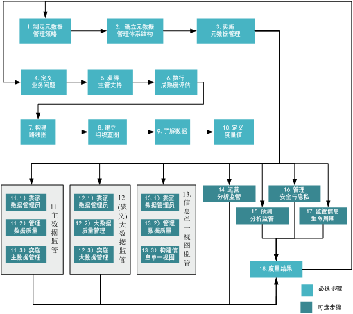
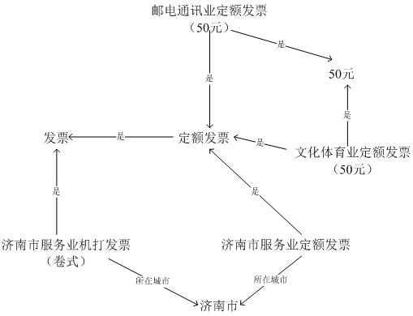
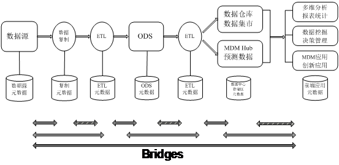
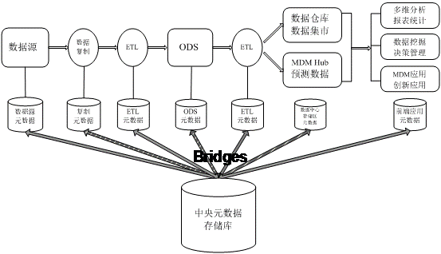
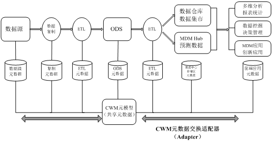
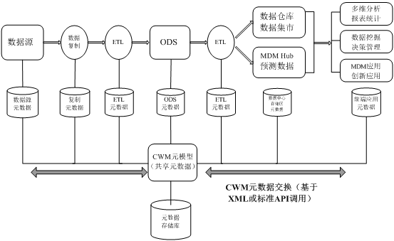
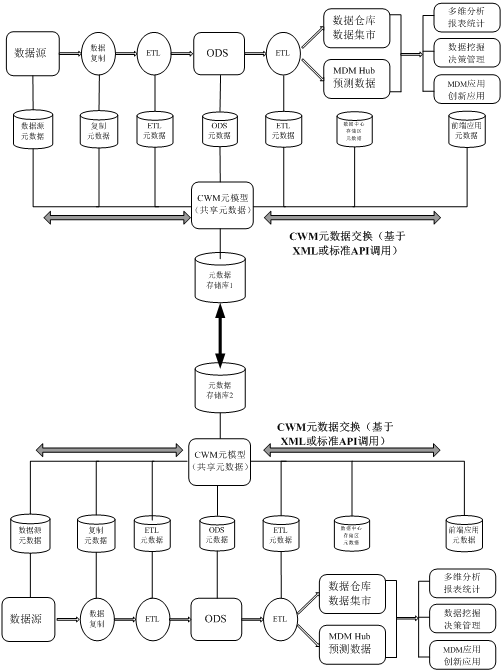
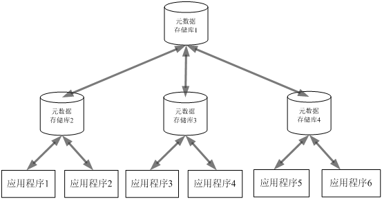

# 大数据治理统一流程模型概述和明确元数据管理策略
大数据治理的核心是为业务提供持续的、可度量的价值

**标签:** 分析

[原文链接](https://developer.ibm.com/zh/articles/bd-1503bigdatagovernance1/)

程 永

发布: 2015-03-05

* * *

[大数据治理专题](http://www.ibm.com/developerworks/cn/bigdata/governance/index.html) 详细阐述了什么是大数据治理、为何要做大数据治理，并结合实际业务问题介绍了大数据治理统一流程参考模型的实施步骤，以及 IBM 相关的大数据治理的产品介绍。

## 大数据治理概述

（狭义）大数据是指无法使用传统流程或工具在合理的时间和成本内处理或分析的信息，这些信息将用来帮助企业更智慧地经营和决策。而广义的大数据更是指企业需要处理的海量数据，包括传统数据以及狭义的大数据。（广义）大数据可以分为五个类型：Web 和社交媒体数据、机器对机器（M2M）数据、海量交易数据、生物计量学数据和人工生成的数据。

- Web 和社交媒体数据：比如各种微博、博客、社交网站、购物网站中的数据和内容。
- M2M 数据：也就是机器对机器的数据，比如 RFID 数据、GPS 数据、智能仪表、监控记录数据以及其他各种传感器、监控器的数据。
- 海量交易数据：是各种海量的交易记录以及交易相关的半结构化和非结构化数据，比如电信行业的 CDR、3G 上网记录等，金融行业的网上交易记录、core banking 记录、理财记录等，保险行业的各种理赔等。
- 生物计量学数据：是指和人体识别相关的生物识别信息，如指纹、DNA、虹膜、视网膜、人脸、声音模式、笔迹等。
- 人工生成的数据：比如各种调查问卷、电子邮件、纸质文件、扫描件、录音和电子病历等。

在各行各业中，随处可见因数量、速度、种类和准确性结合带来的大数据问题，为了更好地利用大数据，大数据治理逐渐提上日程。在传统系统中，数据需要先存储到关系型数据库/数据仓库后再进行各种查询和分析，这些数据我们称之为静态数据。而在大数据时代，除了静态数据以外，还有很多数据对实时性要求非常高，需要在采集数据时就进行相应的处理，处理结果存入到关系型数据库/数据仓库、MPP 数据库、Hadoop 平台、各种 NoSQL 数据库等，这些数据我们称之为动态数据。比如高铁机车的关键零部件上装有成百上千的传感器，每时每刻都在生成设备状态信息，企业需要实时收集这些数据并进行分析，当发现设备可能出现问题时及时告警。再比如在电信行业，基于用户通信行为的精准营销、位置营销等，都会实时的采集用户数据并根据业务模型进行相应的营销活动。

大数据治理的核心是为业务提供持续的、可度量的价值。大数据治理人员需要定期与企业高层管理人员进行沟通，保证大数据治理计划可以持续获得支持和帮助。相信随着时间的推移，大数据将成为主流，企业可以从海量的数据中获得更多的价值，而大数据治理的范围和严格程度也将逐步上升。为了更好地帮助企业进行大数据治理，笔者在 IBM 数据治理统一流程模型基础上结合在电信、金融、政府等行业进行大数据治理的经验，整理了大数据治理统一流程参考模型，整个参考模型分为必选步骤和可选步骤两部分。

## 大数据治理统一流程参考模型

如图 1 所示，大数据治理统一流程参考模型必要步骤分为两个方向：一条子线是在制定元数据管理策略和确立体系结构的基础上实施全面的元数据管理，另一条子线是在定义业务问题、执行成熟度评估的基础上定义数据治理路线图以及定义数值治理相关的度量值。在 11 个必要步骤的基础上，企业可以在 7 个可选步骤中选择一个或多个途径进行特定领域的数据治理，可选步骤为：主数据监管、（狭义）大数据监管、信息单一视图监管、运营分析监管、预测分析监管、管理安全与隐私以及监管信息生命周期。企业需要定期对大数据治理统一流程进行度量并将结果发送给主管级发起人。

##### 图 1\. 大数据治理统一流程参考模型

## 第一步：明确元数据管理策略

在最开始的时候，元数据（Meta Data）是指描述数据的数据，通常由信息结构的描述组成，随着技术的发展元数据内涵有了非常大的扩展，比如 UML 模型、数据交易规则、用 Java，.NET，C++等编写的 APIs、业务流程和工作流模型、产品配置描述和调优参数以及各种业务规则、术语和定义等 [1]。在大数据时代，元数据还应该包括对各种新数据类型的描述，如对位置、名字、用户点击次数、音频、视频、图片、各种无线感知设备数据和各种监控设备数据等的描述等。元数据通常分为业务元数据、技术元数据和操作元数据等。业务元数据主要包括业务规则、定义、术语、术语表、运算法则和系统使用业务语言等，主要使用者是业务用户。技术元数据主要用来定义信息供应链（Information Supply Chain，ISC）各类组成部分元数据结构，具体包括各个系统表和字段结构、属性、出处、依赖性等，以及存储过程、函数、序列等各种对象。操作元数据是指应用程序运行信息，比如其频率、记录数以及各个组件的分析和其它统计信息等。

从整个企业层面来说，各种工具软件和应用程序越来越复杂，相互依存度逐年增加，相应的追踪整个信息供应链各组件之间数据流动、了解数据元素含义和上下文的需求越来越强烈。在从应用议程往信息议程的转变过程中，元数据管理也逐渐从局部存储和管理转向共享。从总量上来看，整个企业的元数据越来越多，光现有的数据模型中就包含了成千上万的表，同时还有更多的模型等着上线，同时随着大数据时代的来临，企业需要处理的数据类型越来越多。为了企业更高效地运转，企业需要明确元数据管理策略和元数据集成体系结构，依托成熟的方法论和工具实现元数据管理，并有步骤的提升其元数据管理成熟度。

为了实现大数据治理，构建智慧的分析洞察，企业需要实现贯穿整个企业的元数据集成，建立完整且一致的元数据管理策略，该策略不仅仅针对某个数据仓库项目、业务分析项目、某个大数据项目或某个应用单独制定一个管理策略，而是针对整个企业构建完整的管理策略。元数据管理策略也不是技术标准或某个软件工具可以取代的，无论软件工具功能多强大都不能完全替代一个完整一致的元数据管理策略，反而在定义元数据集成体系结构以及选购元数据管理工具之前需要定义元数据管理策略。

元数据管理策略需要明确企业元数据管理的愿景、目标、需求、约束和策略等，依据企业自身当前以及未来的需要确定要实现的元数据管理成熟度以及实现目标成熟度的路线图，完成基础本体、领域本体、任务本体和应用本体的构建，确定元数据管理的安全策略、版本控制、元数据订阅推送等。企业需要对业务术语、技术术语中的敏感数据进行标记和分类，制定相应的数据隐私保护政策，确保企业在隐私保护方面符合当地隐私方面的法律法规，如果企业有跨国数据交换、元数据交换的需求，也要遵循涉及国家的法律法规要求。企业需要保证每个元数据元素在信息供应链中每个组件中语义上保持一致，也就是语义等效（semantic equivalence）。语义等效可以强也可以弱，在一个元数据集成方案中，语义等效（平均）越强则整个方案的效率越高。语义等效的强弱程度直接影响元数据的共享和重用。

**本体（人工智能和计算机科学）**

本体（Ontology）源自哲学本体论，而哲学本体论则是源自哲学中”形而上学”分支。本体有时也被翻译成本体论，在人工智能和计算机科学领域本体最早源于上世纪 70 年代中期，随着人工智能的发展人们发现知识的获取是构建强大人工智能系统的关键，于是开始将新的本体创建为计算机模型从而实现特定类型的自动化推理。之后到了上世纪 80 年代，人工智能领域开始使用本体表示模型化时间的一种理论以及知识系统的一种组件，认为本体（人工智能）是一种应用哲学。

最早的本体（人工智能和计算机科学）定义是 Neches 等人在 1991 给出的：“一个本体定义了组成主题领域的词汇的基本术语和关系，以及用于组合术语和关系以及定义词汇外延的规则”。而第一次被业界广泛接受的本体定义出自 Tom Gruber，其在 1993 年提出：“本体是概念化的显式的表示（规格说明）”。Borst 在 1997 年对 Tom Gruber 的本体定义做了进一步的扩展，认为：“本体是共享的、概念化的一个形式的规范说明”。在前人的基础上，Studer 在 1998 年进一步扩展了本体的定义，这也是今天被广泛接受的一个定义：“本体是共享概念模型的明确形式化规范说明”。本体提供一个共享词汇表，可以用来对一个领域建模，具体包括那些存在的对象或概念的类型、以及他们的属性和关系 [2]。一个简单的本体示例发票概念及其相互关系所构成的语义网络如图 2 所示：

##### 图 2\. 简单本体（发票）示例

随着时间的推移和技术的发展，本体从最开始的人工智能领域逐渐扩展到图书馆学、情报学、软件工程、信息架构、生物医学和信息学等越来越多的学科。与哲学本体论类似，本体（人工智能和计算机科学）依赖某种类别体系来表达实体、概念、事件及其属性和关系。本体的核心是知识共享和重用，通过减少特定领域内概念或术语上的分歧，使不同的用户之间可以顺畅的沟通和交流并保持语义等效性，同时让不同的工具软件和应用系统之间实现互操作。

根据研究层次可以将本体的种类划分为“顶级本体”（top-level ontology）、应用本体（application ontology）、领域本体（domain ontology）和任务本体（task ontology），各个种类之间的层次关系如图 3 所示。

##### 图 3\. 本体层次关系

- 顶级本体，也被称为上层本体（upper ontolog）或基础本体（foundation ontology），是指独立于具体的问题或领域，在所有领域都适用的共同对象或概念所构成的模型，主要用来描述高级别且通用的概念以及概念之间的关系。
- 领域本体是指对某个特定的领域建模，显式的实现对领域的定义，确定该领域内共同认可的词汇、词汇业务含义和对应的信息资产等，提供对该领域知识的共同理解。领域本体所表达的是适合自己领域的术语的特定含义，缺乏兼容性，因而在其他领域往往不适用。在同一领域内，由于文化背景、语言差异、受教育程度或意识形态的差异，也可能会出现不同的本体。很多时候，随着依赖领域本体系统的扩展，需要将不同的领域本体合并为更通用的规范说明，对并非基于同一顶级本体所构建的本体进行合并是一项非常具有挑战的任务，很多时候需要靠手工来完成，相反，对那些基于同一顶级本体构建的领域本体可以实现自动化的合并。
- 任务本体是针对任务元素及其之间关系的规范说明或详细说明，用来解释任务存在的条件以及可以被用在哪些领域或环境中。是一个通用术语的集合用来描述关于任务的定义和概念等。
- 应用本体： 描述依赖于特定领域和任务的概念及概念之间的关系，是用于特定应用或用途的本体，其范畴可以通过可测试的用例来指定。

从详细程度上来分，本体又可以分为参考本体（reference ontologies）和共享本体（share ontologies），参考本体的详细程度高，而共享本体的详细程度低。

**本体（哲学）**

哲学中的本体（ontology）也被称为存在论，源自哲学中“形而上学”分支，主要探讨存在的本质，也就是存在的存在。英文 ontology 实际上就是来源于希腊文“ον”（存在）和“λ `ό` γο `ς` ”（学科）的组合。本体是由早期希腊哲学在公元前 6 世纪到公元前 4 世纪提出的“始基”延伸出来的。始基（Principle，又称本原）最早由泰勒斯（米利都学派）最早提出来，认为万物由水而生，其学生阿那克西曼德认为万物由一种简单的原质组成，该原质不是水 [3]。而毕达哥拉斯（学派）认为“万物都是数”，数不仅被看作万物的本原，而且被看作万物的原型、世界的本体。后来巴门尼德（爱利亚学派）提出了“存在”的概念，认为存在才是唯一真正存在的真理，其创造了一种形而上学论证方式，之后的哲学一直到近时期为止，都从巴门尼德处接受了其“实体的不可毁灭性”。苏格拉底继承了巴门尼德的存在概念，主张“真正的善”并完善了巴门尼德弟子芝诺的辩证法，其学生柏拉图提出了“理念论”，认为只要若干个个体拥有一个共同的名字，它们就有一个共同的理念或形式。亚里士多德（柏拉图学生）总结了先哲们的思想，完成了《形而上学》，并将本体总结为：对世界上客观存在事物的系统的描述，即存在论，也就是最形而上学的知识。形而上学不是指孤立、静止之类的意思，而是指超越具体形态的抽象意思，是关于物质世界最普遍的、最一般的、最不具体的规律的学问。

## 第二步：元数据集成体系结构

在明确了元数据管理策略后需要确定实现该管理策略所需的技术体系结构，即元数据集成体系结构。各个企业的元数据管理策略和元数据管理成熟度差别较大，因此元数据集成体系结构也多种多样。大体上元数据集成体系结构可以分为点对点的元数据集成体系结构、中央辐射式元数据体系结构、基于 CWM（Common Warehouse MetaModel，公共仓库元模型）模型驱动的点对点元数据集成体系结构、基于 CWM 模型驱动的中央存储库元数据集成体系结构、分布式（联邦式）元数据集成体系结构和层次/星型元数据集成体系结构等。

针对信息供应链中不同的组件，为了实现跨组件的元数据交换和集成，最开始人们采用点对点的方式进行，也就是每一对组件之间通过一个独立的元数据桥（metadata bridge）进行元数据交换，桥一般是双向的能够理解两个方向的元数据映射 [4]。点对点的元数据集成体系结构帮助用户实现了跨企业的元数据集成和元数据交换，对提升信息化水平提供了巨大帮助。这种体系结构在应用过程中，也暴露了很多问题，比如元数据桥的构建工作量和耗时都非常大，对中间件厂商、应用厂商、集成商和用户来说都是一个巨大的挑战，而且构建元数据桥还必须具有所有者的元数据模型和接口的详细信息。构建完成的桥很多时候无法在构建其他元数据桥时进行重用，因此开发和维护费用大幅度增加，用户投资回报率（ROI）不高。以动态数据仓库为例，其点对点的元数据集成体系结构具体如图 4 所示，信息供应链各组件之间的空心箭头表示全部的数据流，实心箭头表示不同的元数据桥和与之关联的元数据流。

##### 图 4\. 点对点的元数据集成体系结构

通过使用中央元数据存储库（central metadata repository）取代各个工具软件和应用程序之间的点对点连接方式，改成中央元数据存储库与各个工具软件和应用程序实现元数据交换的访问层（也是一种桥），可以有效降低总成本，减少建立点对点元数据桥的工作，提高投资回报率。信息供应链各组件可以从存储库访问元数据，不必与其他产品进行点对点交互。这种使用中央元数据存储库方式进行元数据集成的方式就是中央辐射式元数据体系结构（hub-and-spoke meta data architecture），具体如图 5 所示。由于特定的元数据存储库是围绕其自身的元模型、接口和交付服务建立的，所以仍需要建立元数据桥实现与 ISC 各组件的互相访问。

##### 图 5\. 中央辐射式元数据体系结构

采用模型驱动的元数据集成方法（比如使用 CWM）可以有效降低元数据集成的成本和复杂度，无论点对点元数据集成体系结构还是中央辐射式元数据集成体系结构都可以因此受益。在点对点体系结构中，通过使用基于模型的方法可以不必在每一对需要集成的产品之间构建元数据桥，每个产品只需要提供一个适配器（adapter）即可实现各个产品之间的元数据交换，适配器既了解公共的元模型也了解本产品元模型的内部实现。如图 6 所示，基于 CWM 模型驱动点对点元数据集成体系结构使用通用元模型，不再需要在各个产品间建立元数据桥，在各个产品之间通过适配器实现了语义等价性。

##### 图 6\. 基于 CWM 模型驱动的点对点元数据集成体系结构

如图 7 所示，在基于模型驱动（比如 CWM）的中央辐射式元数据体系结构中，中央存储库包含公共元模型和整个领域（domain）用到的该元模型的各个实例（模型）、存储库自身元模型及其实例、理解元模型（公共元模型和自身元模型）的适配器层，当然存储库也可以直接实现公共元模型的某些内部表示。

##### 图 7\. 基于 CWM 模型驱动的中央存储库元数据集成体系结构

如图 8 所示，这种体系架构是基于 CWM 模型驱动的中央存储库元数据集成体系结构的一个变种，两个中央辐射式的拓扑结构通过各自的元数据存储库连接起来，也被称为分布式（Distributed）或联邦（Federated）体系结构。两个元数据存储库之间通过元数据桥连接，两个存储库使用相同的元模型和接口，也可以使用不同的元模型和接口。建立分布式元数据集成体系结构的原因有很多种，比如企业基于多个区域单独部署自己的应用，每个区域有自己的数据中心。

##### 图 8\. 分布式（联邦式）元数据集成体系结构

如图 9 所示，这种体系结构是分布式体系结构的变体，根存储库实现了元模型的公共部分（横跨整个企业），叶子存储库实现了一个或多个特定的公共元模型子集，并只保存这些自己所对应的元数据实例。特定客户可以主要访问其感兴趣的元数据所在的叶子存储库，也可以访问其它叶子存储库和根存储库。这种体系结构被称为层次或星型拓扑结构。

##### 图 9\. 层次或星型元数据集成体系结构

## 结束语

本文详细介绍了大数据治理的基本概念和统一流程参考模型，并阐述了该模型的第一步“明确元数据管理策略”和第二步“元数据集成体系结构”等内容。在第一步“明确元数据管理策略”中讲述了元数据的基本概念以及本体在人工智能/计算机科学和哲学中的含义。在第二步“元数据集成体系结构”讲述了元数据集成体系结构的六种示例，分别为：点对点的元数据集成体系结构、中央辐射式元数据体系结构、基于 CWM 模型驱动的点对点元数据集成体系结构、基于 CWM 模型驱动的中央存储库元数据集成体系结构、分布式（联邦式）元数据集成体系结构和层次/星型元数据集成体系结构。在本系列文章的 [下一部分](http://www.ibm.com/developerworks/cn/data/library/bd-1503bigdatagovernance2/index.html) 将继续介绍大数据治理统一流程参考模型第二步“元数据集成体系结构”，具体包括元模型、元-元模型、公共仓库元模型（CWM）、CWM 发展史、OMG 的模型驱动体系结构（Model Driven Architecture，MDA）。

## 参考文献

1. David Frankel Consulting，”Using Model Driven Architecture™ to Manage Metadata”，P3；
2. Fredrik Arvidsson and Annika Flycht-Eriksson，2008，Ontologies I，”An ontology provide a shared vocabulary，which can be used to model a domain，thatis，the type of objects and/or concepts thatexist，and their properties and relations”；
3. 更多内容请参考： [专著] /（英）伯特兰. 罗素/著 孙绍武/主编 <<西方哲学史 >>；
4. John Poole，Dan Chang，Douglas Tolbert and David Mellor，2002，Common Warehouse Metamodel，p18-32，p180-202；
5. 本系列文章参考了 Sunil Soares 编写的《The IBM Data Governance Unified Process》和《Bigdata Governance》书中内容。

## 相关主题

- 在 [developer 大数据技术主页](https://developer.ibm.com/zh/technologies/analytics/)，了解关于大数据的更多信息，获取技术文档、how-to 文章、培训、下载、产品信息以及其他资源。
- [BigInsights 3.0 信息中心。](https://www.ibm.com/support/knowledgecenter/en/SSPT3X_3.0.0/com.ibm.swg.im.infosphere.biginsights.welcome.doc/doc/welcome.html)