# 如何利用 Robot Framework 实现软件的定时自动下载和安装
一款基于 Python 的自动化测试框架

**标签:** DevOps,Python

[原文链接](https://developer.ibm.com/zh/articles/os-cn-robot-framework-autotest/)

牛凤枝, 阮高远, 陳佳蘊

发布: 2017-11-29

* * *

在我们测试和开发，特别是持续交付过程中，产品安装包更新很快，这就要求我们频繁的更新产品安装包。有没有一种方式可以更好的为我们节约时间，把精力放在更重要的事情上呢？

答案是肯定的！Robot Framework(RF)是一款开源自动化测试框架。特别适合用在多轮次的验收测试和验收测试驱动开发（ATDD）过程中。测试用例位于 HTML 或者 TSV(以 tab 分割值)或者文本文件中，使用在测试库中实现的关键字在测试中运行程序。ROBOT FRAMEWORK 灵活易扩展，很适合用于测试具有多种接口的复杂软件：用户接口、命令行、Web Service、编程接口等。结合本篇文章重点，我们着重介绍如何利用 ROBOT FRAMEWORK 提供的测试库：OperatingSystem Library, SSH Library 和 FTP Library 实现软件的下载、上传和安装。

## Robot Framework 架构介绍

ROBOT FRAMEWORK 是一个通用的，应用和技术相互独立的框架。请参照以下高度模块化的体系结构图，如图 1 所示。

### Robot Framework 架构

##### 图 1\. Robot Framework 架构

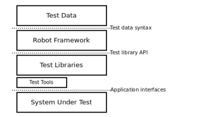

测试数据是简单，易于编辑的表格格式。当 Robot Framework 启动后，会处理测试数据，执行测试用例，产生测试报告和日志。但是核心框架并不清楚测试目标是什么，起作用的是测试库。测试库直接调用应用接口或者使用底层测试工具来驱动。

### Robot Framework 优点

- 采用表格式语法，测试用例格式统一
- 重用性好，可以利用现有关键字来组合新的关键字(也就是下面要用到的用户关键字)
- 支持变量
- 支持基于创建数据驱动的测试用例
- 结果报告和日志采用 HTML 格式，易于阅读
- 提供标签以分类和选择将被执行的测试用例
- 平台和应用无关
- 功能全面，支持 Web 测试，Java GUI 测试，启动进程，终端，SSH 等
- 易于扩展，提供简单的 API，用户可以定于基于 Python 或 Java 的测试库
- 易于集成，提供命令行接口和基于 XML 的输出文件
- 易于与版本管理集成

## 安装和配置

请参考 [Robot Framework 的安装配置和简单的实例介绍](https://www.ibm.com/developerworks/cn/opensource/os-cn-robot-framework/) 这篇文章的 **安装和配置章节**

## Robot Framework 基础知识

在我们讲解实例之前，先让我们熟悉 Robot Framework 基础知识。

### RIDE 编辑器

Robot Framework 支持多种格式，如 HTML、TSV、纯文本等。它们长相大同小异，用处各有所长。但是描述的都是同样的内容。方便起见，推荐使用 RIDE 编辑器来编写测试用例。这些文本在 RIDE 环境下打开是一样的。

##### 图 2\. RIDE 编辑器启动界面

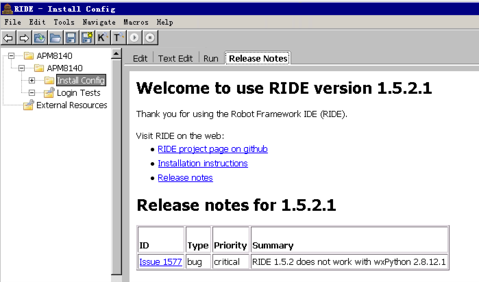

Robot Framework 安装成功后，执行命令[PythonDir]\\Scripts\\ride.py，就可以打开 RIDE 编辑器。如图 2 所示，打开之后就可以进行创建测试项目、测试用例等操作。在后面的实例介绍中有具体的实例讲解。

一个文件被称作一个测试套件(Test Suite), 其可以包含多个测试用例。测试套件也能嵌套，比如同一个目录下的多个测试套件组成一个更高级的测试套件，嵌套的层次无限多。创建的过程依次是： 创建项目—>创建测试套件—>创建测试用例。

### 测试套件的内部结构

一个测试套件包含四段内容：Setting, Variable, Test case, Keyword

- Setting 部分作用：引用测试类库(test library), 引用资源文件(resource files), 引用变量文件(variable files)，为测试套件或者测试用例定义元数据(metadata)
- Variable 部分作用：定义测试用例中使用的变量
- Test case 部分作用：使用测试关键字完成测试用例
- Keyword 部分作用：把现有关键字组合，生成更高级关键字

## 实例介绍

具备了上述知识，让我们来看一个从软件的下载、上传到安装，最后再以如何利用 Windows 定时任务来定时实现其过程的自动化的实例。

### 软件下载

这里要用到两个测试库： OperatingSystem 和 FTP Library。

OperatingSystem 测试库主要提供和操作系统相关操作的功能，此例主要是把下载的产品安装包保存到一个创建好的文件夹下。它属于 Robot Framework 标准库的一部分，如果您已经安装了 Robot Framework，那么就不需要再另外安装此库了。

FTP Library 主要提供 FTP client 功能。在此主要是下载产品安装包。FTP Library 不属于标准库，所以需要额外安装。建议用 pip 来安装，如果您已经安装了最新版本的 Python，那么 pip 已经安装好了。通过以下命令安装：

pip install robotframework-ftplibrary

### 创建测试项目

选择菜单栏 **File —>New Project** ，输入项目名称， **T ype** 选择目录( **Directory**)。

##### 图 3\. 创建测试项目

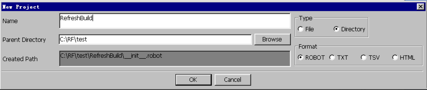

### 创建测试套件

右键点击刚创建的测试项目，选择 **New Suit** ，输入 **Name**, 选择 **File Type** 。

##### 图 4\. 创建测试套件

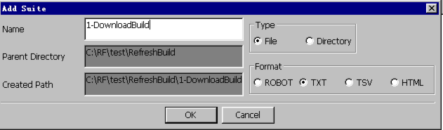

### 创建测试用例

右键点击刚创建的测试套件，选择 **New Test Case** ，输入名称。

##### 图 5\. 创建测试用例

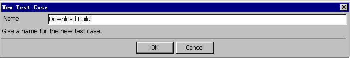

Robot Framework 用资源文件来共享关键字和变量，其结构和测试用例非常相似。

##### 图 6\. 创建资源文件

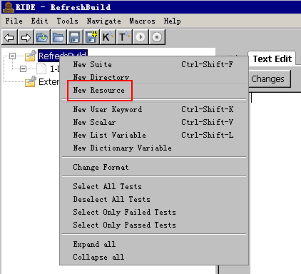

##### 图 7\. 创建资源文件

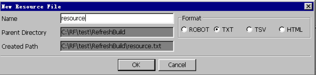

资源文件结构由 Setting、Variable、Keywords 部分组成。作用和测试套件的内部结构章节介绍的一样。

##### 图 8\. 资源文件样例

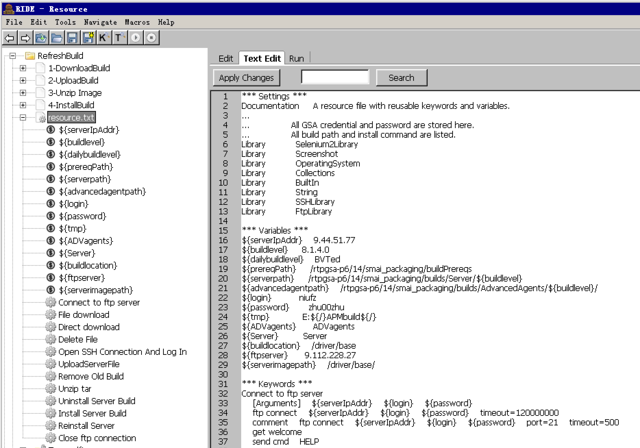

正如前面提到过的，下载软件主要用到两个测试库：OperatingSystem Library 和 FTP Library 首先我们就需要在资源文件中导入它们：

如上图图 8：

- Library OperatingSystem
- Library FtpLibrary

然后利用这两个库的关键字，建立更高级的用户关键字。

##### 图 9\. 创建用户关键字 Connect to ftp server

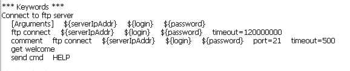

- Connect to ftp server 是用户创建的关键字，可以直接被测试用例调用
- ftp connect, get welcome, send cmd 都是来自 FTPLibrary 关键字
- ftp 用于建立到 ftp server 连接
- get welcome 得到来自 ftp server 的 welcome 信息
- send cmd 发送 HELP 命令给 ftp server，返回 ftp server 的输出信息

##### 图 10\. 创建用户关键字 Direct download

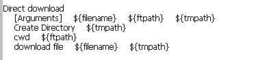

- Create Directory 是 OperatingSystem Library 关键字
- Cwd 和 Download File 是 FTPLibrary 关键字
- Create Directory 创建一个文件夹，用于存放下载的产品安装包
- Cwd 变换工作目录，返回 server 输出
- Download File 从 ftp server 下载文件到当前工作目录
- 当然，这里面用到了三个变量：filename, ftpath, tmpath, 它们都需要在测试用例里提供值

##### 图 11\. 测试用例内容

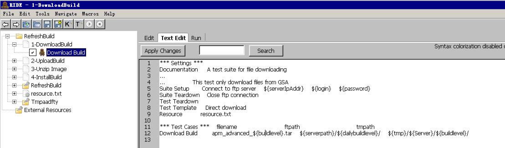

至于像 buildlevel, serverpath, dailybuildlevel, tmp, Server, buildlevel 这些变量，则需要在资源文件的 Variable 部分定义。详情请参照图 8。

下面我们来详细解释下图 11 的内容：

- Documentaion: 测试套件文档
- Suite setup and teardown: Suite setup 在测试套件的测试用例执行之前被执行。Suite teardown 反之。
- 测试用例文件也可以有属于它自己的 settings.

    - Test Setup, Test Teardown: 指定测试的设置和拆卸
    - Test Template: 默认的模版关键字
- Resource: 导入共享的资源文件

整个执行的过程即：

- 先建立要下载软件所在的 FTP 服务器的连接。
- 倒入共享的资源文件，它存储着测试用例要用到的变量，关键字
- 下载软件并把它存储到本地
- 关闭 FTP 连接

### 测试用例的执行

可以通过勾选测试用例名称来执行：

##### 图 12\. 勾选要执行的测试用例

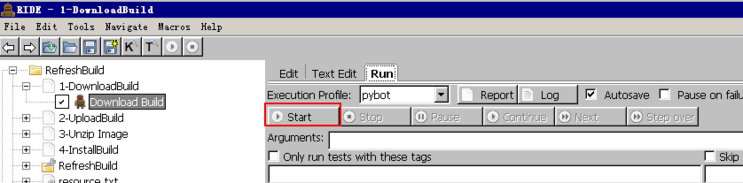

##### 图 13\. 测试结果

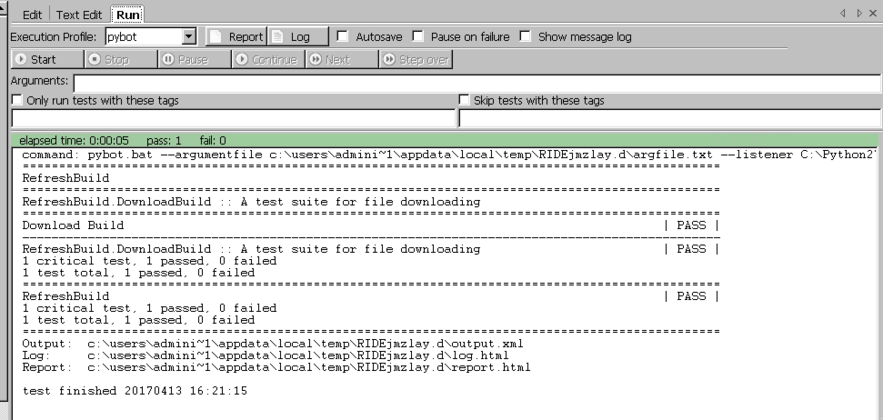

详细的执行过程可以通过图 13 列出的执行结果：Log 和 Report 等来查看。

### 软件上传

大致过程与软件类似。详细的过程如下：

##### 图 14\. 上传软件测试用例内容

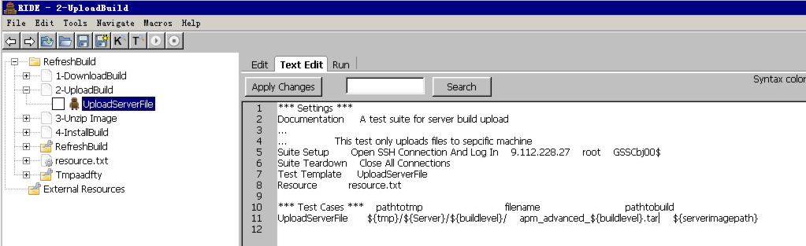

所不同的是，用到了 SSHLibrary, 此库提供 SSH 和 SFTP 的相关操作。它并不是标准库的一部分, 需要安装, 指令如下：

pip install robotframework-sshlibrary

在资源文件中需要导入这个库，如图 15。

##### 图 15\. 导入 SSHLibrary

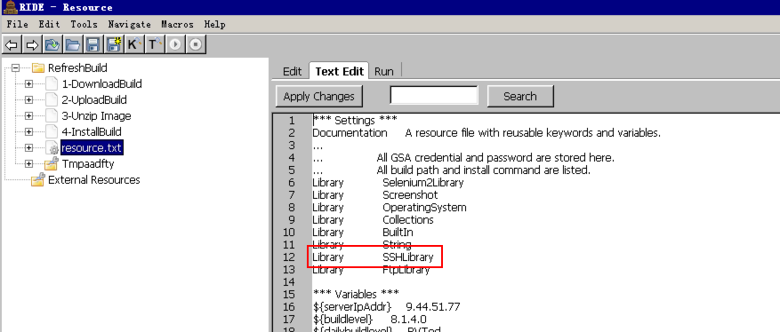

Test Template: Upload Server File 也需要在 resource.txt 中定义

在上传文件前需要建立 SSH 连接。于是我们在共享的资源文件 resource.txt 中创建了 Open SSH Connect And Log In 关键字。

##### 图 16\. Open SSH Connect And Log In

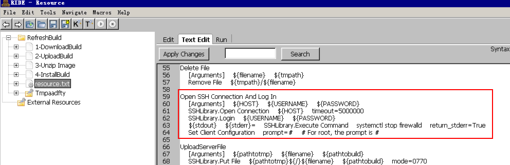

定义了三个参数：HOST, USERNAME, PASSWORD，它们分别被以下 SSHLibrary 关键字使用:

- Open Connect: 提供主机名和端口，打开一个 SSH 连接
- Login: 在打开的 SSH 连接基础上，利用用户名密码登录
- Execute Command: 在远程机器上执行命令并且返回输出
- Set Client Configuration: 更新目前连接的配置

至此，连接建立起来了。下面需要执行上传及安装的过程了：

##### 图 17\. Upload Server File 内容

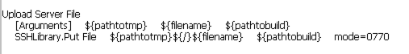

SSHLibrary 测试库的 Put File 关键字用来上传文件到远程机器。

### 软件安装

在共享的资源文件 resource.txt 中创建 Install Server Build 用户关键字。如图 18：

##### 图 18\. 安装软件测试用例

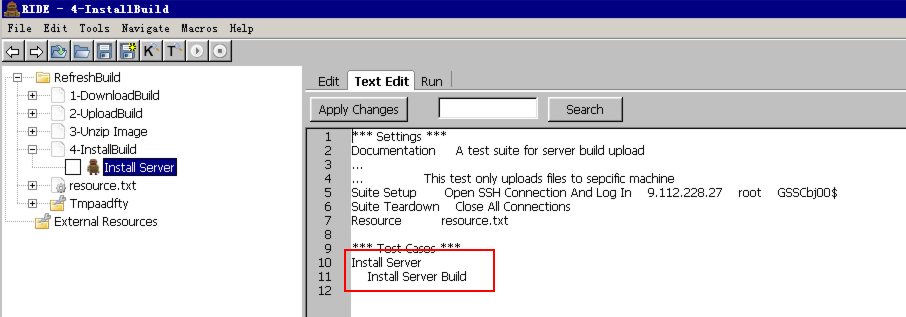

##### 图 19\. Install Server Build

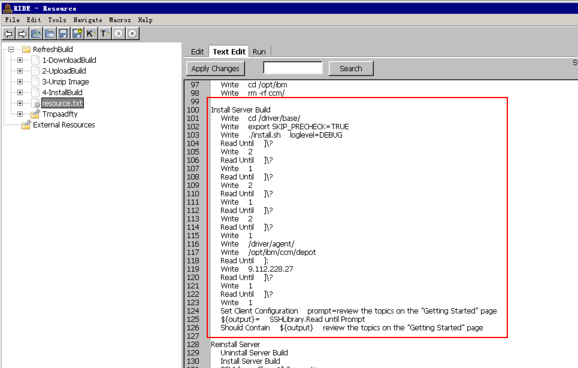

从图 19 可见，我们主要用到了：Write 和 Read Until 关键字。之所以选择它们是因为我们的软件是在启动 install.sh 后和 shell 交互的状态下执行的。而 Execute Command 和 Start Command 是在远程机器上建立一个新的 shell 执行，这就意味着环境的改变（如工作目录的切换，设置环境变量）在后续的关键字都不可见。

- Write: 在远程机器上写给定的文本，并追加换行符
- Read Until: 返回输出直到 expected（参数）字串出现
- Read Until Prompt: 返回输出知道 prompt（参数）字串出现，在使用这个关键字前，prompt 必须用 Set Client Configuration 先设置。在此我们设置安装成功字符串作为 prompt.
- Should Contain: 包含在 BuiltIn 测试库（标准库之一）。如果${output}包括后面的字符串：review the topics on the “Getting Started” page 至少一次，则表示安装成功。

### 执行顺序

测试用例按照在测试套件中的顺序来执行。较高级别测试套件中的测试套件（前面我们提到过，测试套件是可以嵌套的）按照文件或目录名的字母顺序（不区分大小写）。命令行则是遵循提供的顺序。

## 使用 Windows 定时任务使其定期自动安装

万事俱备，只欠东风。

接下来让我们看看如何利用 Windows 定时任务把整个过程自动化起来。首先我们需要知道，Robot Framework 如何在命令行执行测试用例。这个在创建 Windows 定时任务时会用到。Robot Framework 有多种命令行执行方式，详情请参阅附录 Robot Framework 用户指南。在此我们采用：

robot path/to/

下面介绍如何创建此实例自动化的 Windows 定时任务。

- 打开 **计算机管理** ，点击 **创建任务 ….,** 输入任务名称

##### 图 20\. 创建 Windows 定时任务步骤 1

##### 图 21\. 创建 Windows 定时任务步骤 2

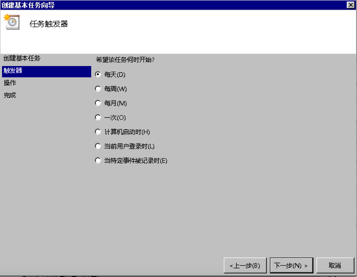

在此(图 22)我们定义每天的 14:19:40 执行整任务, 当然您可以根据自己的需要来定义这些。

##### 图 22\. 创建 Windows 定时任务步骤 3

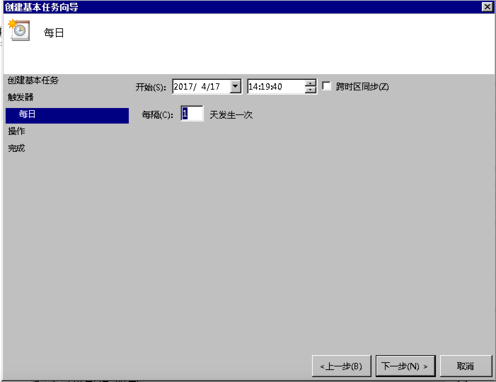

##### 图 23\. 创建 Windows 定时任务步骤 4

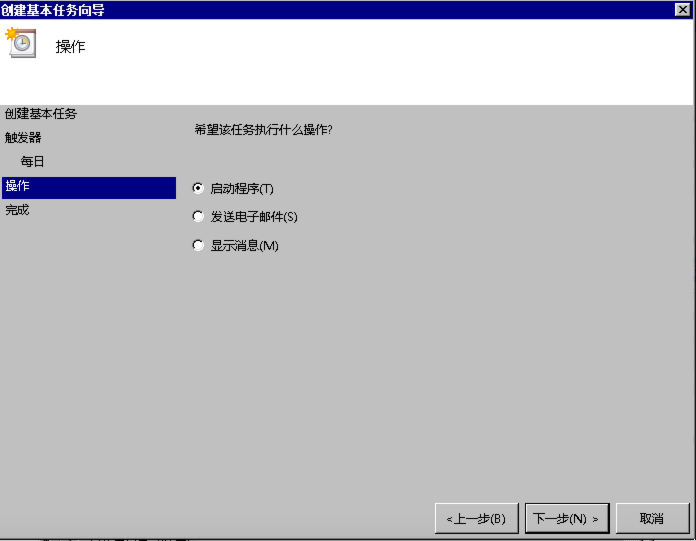

下面(图 24)要填的信息就用到上面提到的命令行执行方式。

- 程序或脚本(P)：填写 Python 执行程序的位置（如果已经添加到路徑环境变量，此处也可直接敲入 Python）
- 添加参数(可选)(A): 此处填写项目所在目录

##### 图 24\. 创建 windows scheduler task 步骤 5

点击 **下一步** 完成即可。

执行此任务，让我们看一下执行报告：（执行报告在 Python 安装路径下 Scripts 目录下）

##### 图 25\. 测试项目执行报告

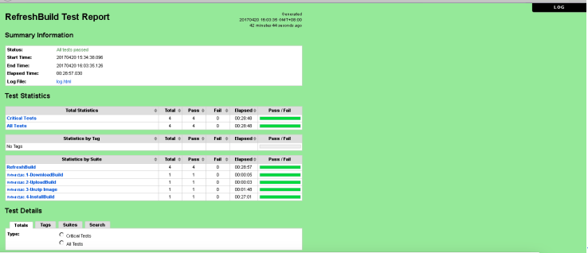

通过这个报告，可以看到各个测试套件及测试用例执行结果等信息，还可以点击右上角的” **Log**“按钮查看详细的日志。

## 结束语

至此，我们详细介绍了如何使用 Robot Framework 实现软件下载、上传、安装以及如何使用 Windows 定时任务定时执行它。

Robot Framework 基于关键字驱动，将数据和关键字结合来描述如何使用数据执行测试。这种方式具备数据驱动的优势，同时非编程人员也可以建立新类型测试。所有测试由同一个框架执行，无需不同的驱动脚本。Robot Framework 提供了多种测试库，而且易于扩展，相信它会是我们在自动化方面的好助手！