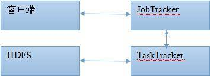
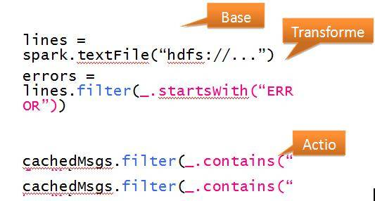

# 如何将 MapReduce 转化为 Spark
深入理解 MapReduce

**标签:** 分析

[原文链接](https://developer.ibm.com/zh/articles/os-cn-mapreduce-spark/)

周明耀

发布: 2015-05-26

* * *

## MapReduce VS Spark

目前的大数据处理可以分为以下三个类型：

- 复杂的批量数据处理（batch data processing），通常的时间跨度在数十分钟到数小时之间；
- 基于历史数据的交互式查询（interactive query），通常的时间跨度在数十秒到数分钟之间；
- 基于实时数据流的数据处理（streaming data processing），通常的时间跨度在数百毫秒到数秒之间。

大数据处理势必需要依赖集群环境，而集群环境有三大挑战，分别是并行化、单点失败处理、资源共享，分别可以采用以并行化的方式重写应用程序、对单点失败的处理方式、动态地进行计算资源的分配等解决方案来面对挑战。

针对集群环境出现了大量的大数据编程框架，首先是 Google 的 MapReduce，它给我们展示了一个简单通用和自动容错的批处理计算模型。但是对于其他类型的计算，比如交互式和流式计算，MapReduce 并不适合。这也导致了大量的不同于 MapReduce 的专有的数据处理模型的出现，比如 Storm、Impala 等等。但是这些专有系统也存在一些不足：

1. 重复工作：许多专有系统在解决同样的问题，比如分布式作业以及容错，举例来说，一个分布式的 SQL 引擎或者一个机器学习系统都需要实现并行聚合，这些问题在每个专有系统中会重复地被解决。
2. 组合问题：在不同的系统之间进行组合计算是一件麻烦的事情。对于特定的大数据应用程序而言，中间数据集是非常大的，而且移动的成本很高。在目前的环境下，我们需要将数据复制到稳定的存储系统，比如 HDFS，以便在不同的计算引擎中进行分享。然而，这样的复制可能比真正的计算所花费的代价要大，所以以流水线的形式将多个系统组合起来效率并不高。
3. 适用范围的局限性：如果一个应用不适合一个专有的计算系统，那么使用者只能换一个系统，或者重写一个新的计算系统。
4. 资源分配：在不同的计算引擎之间进行资源的动态共享比较困难，因为大多数的计算引擎都会假设它们在程序运行结束之前拥有相同的机器节点的资源。
5. 管理问题：对于多个专有系统，需要花费更多的精力和时间来管理和部署，尤其是对于终端使用者而言，需要学习多种 API 和系统模型。

Spark 是伯克利大学推出的大数据处理框架，它提出了 RDD 概念 (Resilient Distributed Datasets)，即抽象的弹性数据集概念。Spark 是对 MapReduce 模型的一种扩展。要在 MapReduce 上实现其不擅长的计算工作 (比如迭代式、交互式和流式)，是比较困难的，因为 MapReduce 缺少在并行计算的各个阶段进行有效的数据共享的能力，而这种能力是 RDD 的本质所在。利用这种有效地数据共享和类似 MapReduce 的操作接口，上述的各种专有类型计算都能够有效地表达，而且能够获得与专有系统同等的性能。

## MapReduce 和 Spark 介绍

### MapReduce

MapReduce 是为 Apache Hadoop 量身订做的，它非常适用于 Hadoop 的使用场景，即大规模日志处理系统、批量数据提取加载工具 (ETL 工具) 等类似操作。但是伴随着 Hadoop 地盘的不断扩张，Hadoop 的开发者们发现 MapReduce 在很多场景下并不是最佳选择，于是 Hadoop 开始把资源管理放入到自己独立的组件 YARN 里面。此外，类似于 Impala 这样的项目也开始逐渐进入到我们的架构中，Impala 提供 SQL 语义，能查询存储在 Hadoop 的 HDFS 和 HBase 中的 PB 级大数据。之前也有类似的项目，例如 Hive。Hive 系统虽然也提供了 SQL 语义，但由于 Hive 底层执行使用的是 MapReduce 引擎，仍然是一个批处理过程，难以满足查询的交互性。相比之下，Impala 的最大特点也是最大卖点就是它的效率。

第一代 Hadoop MapReduce 是一个在计算机集群上分布式处理海量数据集的软件框架，包括一个 JobTracker 和一定数量的 TaskTracker。运行流程图如图 1 所示。

##### 图 1\. MapReduce 运行流程图



在最上层有 4 个独立的实体，即客户端、jobtracker、tasktracker 和分布式文件系统。客户端提交 MapReduce 作业；jobtracker 协调作业的运行；jobtracker 是一个 Java 应用程序，它的主类是 JobTracker；tasktracker 运行作业划分后的任务，tasktracker 也是一个 Java 应用程序，它的主类是 TaskTracker。Hadoop 运行 MapReduce 作业的步骤主要包括提交作业、初始化作业、分配任务、执行任务、更新进度和状态、完成作业等 6 个步骤。

### Spark 简介

Spark 生态系统的目标就是将批处理、交互式处理、流式处理融合到一个软件框架内。Spark 是一个基于内存计算的开源的集群计算系统，目的是让数据分析更加快速。Spark 非常小巧玲珑，由加州伯克利大学 AMP 实验室的 Matei 为主的小团队所开发。使用的语言是 Scala，项目的 core 部分的代码只有 63 个 Scala 文件，非常短小精悍。Spark 启用了内存分布数据集，除了能够提供交互式查询外，它还可以优化迭代工作负载。Spark 提供了基于内存的计算集群，在分析数据时将数据导入内存以实现快速查询，速度比基于磁盘的系统，如 Hadoop 快很多。Spark 最初是为了处理迭代算法，如机器学习、图挖掘算法等，以及交互式数据挖掘算法而开发的。在这两种场景下，Spark 的运行速度可以达到 Hadoop 的几百倍。

Spark 允许应用在内存中保存工作集以便高效地重复利用，它支持多种数据处理应用，同时也保持了 MapReduce 的重要特性，如高容错性、数据本地化、大规模数据处理等。此外，提出了弹性分布式数据集 (Resilient Distributed Datasets) 的概念：

1. RDD 表现为一个 Scala 对象，可由一个文件创建而来；
2. 分布在一个集群内的，不可变的对象切分集；
3. 通过并行处理（map、filter、groupby、join）固定数据（BaseRDD）创建模型，生成 Transformed RDD；
4. 故障时可使用 RDD 血统信息重建；
5. 可高速缓存，以便再利用。

图 2 所示是一个日志挖掘的示例代码，首先将日志数据中的 error 信息导入内存，然后进行交互搜索。

##### 图 2\. RDD 代码示例



在导入数据时，模型以 block 形式存在于 worker 上，由 driver 向 worker 分发任务，处理完后 work 向 driver 反馈结果。也可在 work 上对数据模型建立高速缓存 cache，对 cache 的处理过程与 block 类似，也是一个分发、反馈的过程。

Spark 的 RDD 概念能够取得和专有系统同样的性能，还能提供包括容错处理、滞后节点处理等这些专有系统缺乏的特性。

1. 迭代算法：这是目前专有系统实现的非常普遍的一种应用场景，比如迭代计算可以用于图处理和机器学习。RDD 能够很好地实现这些模型，包括 Pregel、HaLoop 和 GraphLab 等模型。
2. 关系型查询：对于 MapReduce 来说非常重要的需求就是运行 SQL 查询，包括长期运行、数小时的批处理作业和交互式的查询。然而对于 MapReduce 而言，对比并行数据库进行交互式查询，有其内在的缺点，比如由于其容错的模型而导致速度很慢。利用 RDD 模型，可以通过实现许多通用的数据库引擎特性，从而获得很好的性能。
3. MapReduce 批处理：RDD 提供的接口是 MapReduce 的超集，所以 RDD 能够有效地运行利用 MapReduce 实现的应用程序，另外 RDD 还适合更加抽象的基于 DAG 的应用程序。
4. 流式处理：目前的流式系统也只提供了有限的容错处理，需要消耗系统非常大的拷贝代码或者非常长的容错时间。特别是在目前的系统中，基本都是基于连续计算的模型，常住的有状态的操作会处理到达的每一条记录。为了恢复失败的节点，它们需要为每一个操作复制两份操作，或者将上游的数据进行代价较大的操作重放，利用 RDD 实现离散数据流，可以克服上述问题。离散数据流将流式计算当作一系列的短小而确定的批处理操作，而不是常驻的有状态的操作，将两个离散流之间的状态保存在 RDD 中。离散流模型能够允许通过 RDD 的继承关系图进行并行性的恢复而不需要进行数据拷贝。

### Spark 内部术语解释

Application：基于 Spark 的用户程序，包含了 driver 程序和集群上的 executor；

Driver Program：运行 main 函数并且新建 SparkContext 的程序；

Cluster Manager：在集群上获取资源的外部服务 (例如:standalone,Mesos,Yarn)；

Worker Node：集群中任何可以运行应用代码的节点；

Executor：是在一个 worker node 上为某应用启动的一个进程，该进程负责运行任务，并且负责将数据存在内存或者磁盘上。每个应用都有各自独立的 executors；

Task：被送到某个 executor 上的工作单元；

Job：包含很多任务的并行计算，可以与 Spark 的 action 对应；

Stage：一个 Job 会被拆分很多组任务，每组任务被称为 Stage(就像 Mapreduce 分 map 任务和 reduce 任务一样)。

## SparkDemo 程序运行

Spark 源代码可以在 `http://spark-project.org/download` 处下载，也可以到 github 直接复制 Spark 项目。Spark 提供基本源码压缩包，同时也提供已经编译好的压缩包。Spark 是通过 Scala Shell 来与外界进行交互的。

开始安装，推荐的方法是首先在第一个节点上部署和启动 master，获取 `master spark url`，然后在部署到其他节点之前修改 `conf/spark-env.sh` 中的内容。

开始单机 master 服务：`./bin/start-master.sh`

下载了 spark-0.9.1-bin-cdh4 后上传到/home/zhoumingyao 目录 (可以自定义目录，本例使用的是 CentosV6.5 操作系统) 下，具体子目录如清单 1 所示。

##### 清单 1\. 目录列表

```
-rw-r--r-- 1 root root 3899 3 月 27 13:36 README.md
-rw-r--r-- 1 root root 25379 3 月 27 13:36 pom.xml
-rw-r--r-- 1 root root 162 3 月 27 13:36 NOTICE
-rw-r--r-- 1 root root 4719 3 月 27 13:36 make-distribution.sh
-rw-r--r-- 1 root root 21118 3 月 27 13:36 LICENSE
-rw-r--r-- 1 root root 127117 3 月 27 13:36 CHANGES.txt
drwxr-xr-x 4 root root 4096 5 月 6 13:35 assembly
drwxr-xr-x 4 root root 4096 5 月 6 13:36 bagel
drwxr-xr-x 2 root root 4096 5 月 6 13:36 bin
drwxr-xr-x 2 root root 4096 5 月 6 13:36 conf
drwxr-xr-x 4 root root 4096 5 月 6 13:37 core
drwxr-xr-x 2 root root 4096 5 月 6 13:37 data
drwxr-xr-x 4 root root 4096 5 月 6 13:37 dev
drwxr-xr-x 3 root root 4096 5 月 6 13:37 docker
drwxr-xr-x 7 root root 4096 5 月 6 13:37 docs
drwxr-xr-x 4 root root 4096 5 月 6 13:37 ec2
drwxr-xr-x 4 root root 4096 5 月 6 13:37 examples
drwxr-xr-x 7 root root 4096 5 月 6 13:38 external
drwxr-xr-x 3 root root 4096 5 月 6 13:38 extras
drwxr-xr-x 5 root root 4096 5 月 6 13:38 graphx
drwxr-xr-x 5 root root 4096 5 月 6 13:38 mllib
drwxr-xr-x 3 root root 4096 5 月 6 13:38 project
drwxr-xr-x 6 root root 4096 5 月 6 13:38 python
drwxr-xr-x 4 root root 4096 5 月 6 13:38 repl
drwxr-xr-x 2 root root 4096 5 月 6 13:38 sbin
drwxr-xr-x 2 root root 4096 5 月 6 13:38 sbt
drwxr-xr-x 4 root root 4096 5 月 6 13:39 streaming
drwxr-xr-x 3 root root 4096 5 月 6 13:39 target
drwxr-xr-x 4 root root 4096 5 月 6 13:39 tools
drwxr-xr-x 5 root root 4096 5 月 6 13:39 yarn

```

Show moreShow more icon

进入 bin 目录，执行 spark-shell.sh，进入 scala shell 状态，如清单 2 所示。

##### 清单 2\. 运行命令

```
scala> val data = Array(1, 2, 3, 4, 5) //产生 data
data: Array[Int] = Array(1, 2, 3, 4, 5)

```

Show moreShow more icon

下面开始将 data 处理成 RDD，如清单 3 所示。

##### 清单 3\. 处理成 RDD

```
scala> val distData = sc.parallelize(data) //将 data 处理成 RDD
distData: spark.RDD[Int] = spark.ParallelCollection@7a0ec850（显示出的类型为 RDD）

```

Show moreShow more icon

##### 清单 4\. 在 RDD 上运算

```
scala> distData.reduce(_+_) //在 RDD 上进行运算，对 data 里面元素进行加和

```

Show moreShow more icon

##### 清单 5\. 启动 Spark

```
[root@facenode1 sbin]# ./start-all.sh
starting org.apache.spark.deploy.master.Master,
     logging to /home/zhoumingyao/spark-0.9.1-bin-cdh4/sbin/../logs/
       spark-root-org.apache.spark.deploy.master.Master-1-facenode1.out
localhost: Warning: Permanently added 'localhost' (RSA)
to the list of known hosts.localhost:
     starting org.apache.spark.deploy.worker.Worker, logging to
     /home/zhoumingyao/spark-0.9.1-bin-cdh4/sbin/../
       logs/spark-root-org.apache.spark.deploy.worker.Worker-1-facenode1.out

```

Show moreShow more icon

##### 清单 6\. 查看服务

```
[root@facenode1 sbin]# ps -ef | grep spark
root 29295 1 11 16:45 pts/1 00:00:03 /usr/java/jdk1.6.0_31/bin/java
       -cp :/home/zhoumingyao/spark-0.9.1-bin-cdh4/conf:/home/
           zhoumingyao/spark-0.9.1-bin-cdh4/assembly/target/scala-2.10/
              spark-assembly_2.10-0.9.1-hadoop2.0.0-mr1-cdh4.2.0.jar:/etc/alternatives/
                hadoopconf -Dspark.akka.logLifecycleEvents=true -Djava.library.path= -Xms512m -Xmx512m
                 org.apache.spark.deploy.master.Master --ip facenode1 --port 7077 --webui-port 8080
root 29440 1 12 16:45 ? 00:00:03 java -cp :/home/zhoumingyao/
    spark-0.9.1-bin-cdh4/conf:/home/zhoumingyao/spark-0.9.1-bin-cdh4/
      assembly/target/scala-2.10/spark-assembly_2.10-0.9.1-hadoop2.0.0-mr1-cdh4.2.0.jar
          -Dspark.akka.logLifecycleEvents=true -Djava.library.path= -Xms512m -Xmx512m
             org.apache.spark.deploy.worker.Worker spark://facenode1:7077

```

Show moreShow more icon

可以启动多个工作站，通过以下命令连接到 master 服务器，如清单 7 所示。

##### 清单 7\. 连接 Master 服务器

```
./spark-class org.apache.spark.deploy.worker.Worker spark://facenode1:7077
输出如下：
14/05/06 16:49:06 INFO ui.WorkerWebUI: Started Worker web UI at http://facenode1:8082
14/05/06 16:49:06 INFO worker.Worker: Connecting to master spark://facenode1:7077...
14/05/06 16:49:06 INFO worker.Worker: Successfully registered with master spark://facenode1:7077

```

Show moreShow more icon

进入 master server 的 Web UI 可以看到主节点、从节点的工作情况，如清单 8 所示。

##### 清单 8\. 访问 Web 客户端

```
http://10.10.19.171:8080/

```

Show moreShow more icon

注意，如果是集群方式，请在 conf 文件夹下面的 slaves 文件里面逐行加入需要加入集群的 master、works 服务器的 ip 地址或者 hostname。

## MapReduce 转换到 Spark

Spark 是类似于 MapReduce 的计算引擎，它提出的内存方式解决了 MapReduce 存在的读取磁盘速度较慢的困难，此外，它基于 Scala 的函数式编程风格和 API，进行并行计算时效率很高。

由于 Spark 采用的是 RDD(弹性分布式结果集) 方式对数据进行计算，这种方式与 MapReduce 的 Map()、Reduce() 方式差距较大，所以很难直接使用 Mapper、Reducer 的 API，这也是阻碍 MapReduce 转为 Spark 的绊脚石。

Scala 或者 Spark 里面的 map() 和 reduce() 方法与 Hadoop MapReduce 里面的 map()、reduce() 方法相比，Hadoop MapReduce 的 API 更加灵活和复杂，下面列出了 Hadoop MapReduce 的一些特性：

1. Mappers 和 Reducers 通常使用 key-value 键值对作为输入和输出；
2. 一个 key 对应一个 Reducer 的 reduce；
3. 每一个 Mapper 或者 Reducer 可能发出类似于 0,1 这样的键值对作为每一次输出；
4. Mappers 和 Reducers 可能发出任意的 key 或者 value，而不是标准数据集方式；
5. Mapper 和 Reducer 对象对每一次 map() 和 reduce() 的调用都存在生命周期。它们支持一个 setup() 方法和 cleanup() 方法，这些方法可以被用来在处理批量数据之前的操作。

试想这么一个场景，我们需要计算一个文本文件里每一行的字符数量。在 Hadoop MapReduce 里，我们需要为 Mapper 方法准备一个键值对，key 用作行的行数，value 的值是这一行的字符数量。

##### 清单 9\. MapReduce 方式 Map 函数

```
public class LineLengthCountMapper
extends Mapper<LongWritable,Text,IntWritable,IntWritable> {
@Override
protected void map(LongWritable lineNumber, Text line, Context context)
throws IOException, InterruptedException {
context.write(new IntWritable(line.getLength()), new IntWritable(1));
}
}

```

Show moreShow more icon

清单 9 所示代码，由于 Mappers 和 Reducers 只处理键值对，所以对于类 LineLengthCountMapper 而言，输入是 TextInputFormat 对象，它的 key 由行数提供，value 就是该行所有字符。换成 Spark 之后的代码如清单 10 所示。

##### 清单 10\. Spark 方式 Map 函数

```
lines.map(line => (line.length, 1))

```

Show moreShow more icon

在 Spark 里，输入是弹性分布式数据集 (Resilient Distributed Dataset)，Spark 不需要 key-value 键值对，代之的是 Scala 元祖 (tuple)，它是通过 (line.length, 1) 这样的 (a,b) 语法创建的。以上代码中 map() 操作是一个 RDD，(line.length, 1) 元祖。当一个 RDD 包含元祖时，它依赖于其他方法，例如 reduceByKey()，该方法对于重新生成 MapReduce 特性具有重要意义。

清单 11 所示代码是 Hadoop MapReduce 统计每一行的字符数，然后以 Reduce 方式输出。

##### 清单 11\. MapReduce 方式 Reduce 函数

```
public class LineLengthReducer
extends Reducer<IntWritable,IntWritable,IntWritable,IntWritable> {
@Override
protected void reduce(IntWritable length, Iterable<IntWritable> counts, Context context)
throws IOException, InterruptedException {
int sum = 0;
for (IntWritable count : counts) {
sum += count.get();
}
context.write(length, new IntWritable(sum));
}
}

```

Show moreShow more icon

Spark 里面的对应代码如清单 12 所示。

##### 清单 12\. Spark 方式 Reduce 函数

```
val lengthCounts = lines.map(line => (line.length, 1)).reduceByKey(_ + _)

```

Show moreShow more icon

Spark 的 RDD API 有一个 reduce() 方法，它会 reduce 所有的 key-value 键值对到一个独立的 value。

我们现在需要统计大写字母开头的单词数量，对于文本的每一行而言，一个 Mapper 可能需要统计很多个键值对，代码如清单 13 所示。

##### 清单 13\. MapReduce 方式计算字符数量

```
public class CountUppercaseMapper
extends Mapper<LongWritable,Text,Text,IntWritable> {
@Override
protected void map(LongWritable lineNumber, Text line, Context context)
throws IOException, InterruptedException {
for (String word : line.toString().split(" ")) {
if (Character.isUpperCase(word.charAt(0))) {
context.write(new Text(word), new IntWritable(1));
}
}
}
}

```

Show moreShow more icon

在 Spark 里面，对应的代码如清单 14 所示。

##### 清单 14\. Spark 方式计算字符数量

```
lines.flatMap(
_.split(" ").filter(word => Character.isUpperCase(word(0))).map(word => (word,1))
)

```

Show moreShow more icon

MapReduce 依赖的 Map 方法这里并不适用，因为每一个输入必须对应一个输出，这样的话，每一行可能占用到很多的输出。相反的，Spark 里面的 Map 方法比较简单。Spark 里面的方法是，首先对每一行数据进行汇总后存入一个输出结果物数组，这个数组可能是空的，也可能包含了很多的值，最终这个数组会作为一个 RDD 作为输出物。这就是 flatMap() 方法的功能，它对每一行文本里的单词转换成函数内部的元组后进行了过滤。

在 Spark 里面，reduceByKey() 方法可以被用来统计每篇文章里面出现的字母数量。如果我们想统计每一篇文章里面出现的大写字母数量，在 MapReduce 里程序可以如清单 15 所示。

##### 清单 15\. MapReduce 方式

```
public class CountUppercaseReducer
extends Reducer<Text,IntWritable,Text,IntWritable> {
@Override
protected void reduce(Text word, Iterable<IntWritable> counts, Context context)
throws IOException, InterruptedException {
int sum = 0;
for (IntWritable count : counts) {
sum += count.get();
}
context.write(new Text(word.toString().toUpperCase()), new IntWritable(sum));
}
}

```

Show moreShow more icon

在 Spark 里，代码如清单 16 所示。

##### 清单 16\. Spark 方式

```
groupByKey().map { case (word,ones) => (word.toUpperCase, ones.sum) }

```

Show moreShow more icon

groupByKey() 方法负责收集一个 key 的所有值，不应用于一个 reduce 方法。本例中，key 被转换成大写字母，值被直接相加算出总和。但这里需要注意，如果一个 key 与很多个 value 相关联，可能会出现 Out Of Memory 错误。

Spark 提供了一个简单的方法可以转换 key 对应的值，这个方法把 reduce 方法过程移交给了 Spark，可以避免出现 OOM 异常。

reduceByKey( _\+_).map { case (word,total) => (word.toUpperCase,total) }

setup() 方法在 MapReduce 里面主要的作用是在 map 方法开始前对输入进行处理，常用的场景是连接数据库，可以在 cleanup() 方法中释放在 setup() 方法里面占用的资源。

##### 清单 17\. MapReduce 方式

```
public class SetupCleanupMapper extends Mapper<LongWritable,Text,Text,IntWritable> {
private Connection dbConnection;
@Override
protected void setup(Context context) {
dbConnection = ...;
}
...
@Override
protected void cleanup(Context context) {
dbConnection.close();
}
}

```

Show moreShow more icon

在 Spark 里面没有这样的方法。

## 结束语

通过本文的学习，读者了解了 MapReduce 和 Spark 之间的差异及切换成本。本文针对的是对 Spark 完全没有了解的用户，后续文章会从实际应用出发，从安装、应用程序的角度给出更加实际的教程。