# 如何构建一个内容分析集合
Watson Explorer 实战操作

**标签:** 人工智能

[原文链接](https://developer.ibm.com/zh/articles/watson-explorer-content-analytics1/)

廖显, 曾滔

发布: 2018-01-10

* * *

Watson Explorer （以下简称 WEX）历史源远流长！早在 1997 年，IBM 研究院就启动了一个做文本挖掘的项目，利用自然语言的技术来处理机器翻译和数据图书馆的的需求。1998 年，诞生了文本挖掘和知识管理系统（Text Analysis and Knowledge Mining – TAKMI），这就是 Watson Explorer 的前身。它当年被用于分析约 50 万份 PC 用户联系记录，即呼叫中心的客户交互数据，极大改善了客服质量和显著地降低了成本，同时发现和定位了大量的产品问题。它最核心的技术就是基于 Unstructed Information Mangement Architecture – UIMA 架构的自然语言处理功能。最终让这个产品一战成名还是 2011 年美国著名的人机智力竞赛：Jeopardy! 机器居然能在实时问答的智力抢答竞赛中战胜了人类。

## 简介

本系列文章是一个 Watson Explorer 实战操作的系列文章，注重软件的操作，文章可能会出现自然语言处理的相关知识属于，但不会着重深入的讲解。该文档公包含下练习：

- 练习 01：构建内容分析集合
- 练习 02：使用 Content Analytics Miner
- 练习 03：使用 Content Analytics Studio 创建注释
- 练习 04：管理内容分析
- 练习 05：使用 REST API
- 练习 06：使用 Content Analytics Studio 进行更多注释（可选）

本文是该系列文章中的第一篇”构建内容分析集合”，其他内容操作将在接下来的文章中体现。

本例中如无特殊说明，所有的操作都运行在同一的虚拟机中。本文并不会讲解 WEX 的具体安装启动的方法，如需要安装配置 WEX 相关操作，请访问 IBM knowledge center 查看相关文档。本例的虚拟机环境如下：

##### 图 1\. 虚拟机的环境配置

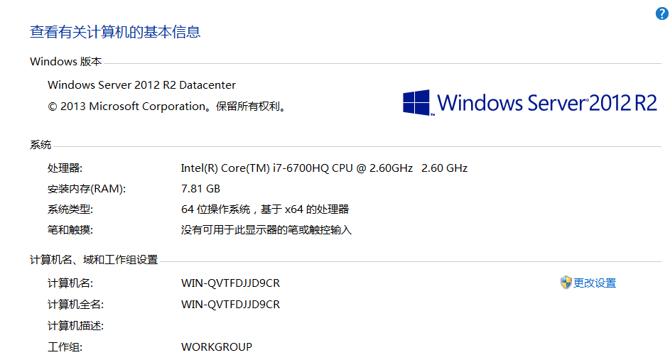

该实例是以 2016 A 股财务报表为分析文本。

## 操作目标

在本案例中，将演示 IBM Watson Explorer 内容的分析功能 Analytics（分析）发现结构化和非结构化内容数据的能力。介绍从文档中提取洞察力所需的管理和文本分析应用程序采集。

在管理应用程序中，您将创建一个包含从预填充的数据进行爬网的集合目录（即，中国上市公司 2017 年半年报），创建索引字段，构面，然后索引结构化和非结构化信息。 创建索引后，您将遍历分析应用程序来发现自然语言处理（NLP）的洞察力，发现各个方面之间的相互关系数据，随着时间的推移学习趋势，并预测可预见的事件。

## 要求

需要有一个 Watson Explorer 的虚拟机

## 项目说明

在本实验中，您可以从在中国上海证券交易所 2017 年的半年报创建内容分析系列。启动 CA 服务器。创建一个集合并定义抓取者年报信息。可以定义可用于搜索的构面收藏的内容。启动抓取工具将投诉输入收藏。解析和索引组件来解析和索引年报信息。最后，开始搜索和分析组件，以便搜索集合中的信息。在本课的实验练习中，需要选择或输入粗体打印的项目。 斜体项目指示应用程序的名称，窗口/屏幕的标题或字段名称。

## 实验一：启动 Content Analytics 服务器和管理控制台

### 章节 1：启动远程桌面

- 从 windows 桌面点击 crtl+r 来启动 cmd 命令行
- 在命令行里面输入 mstsc

    ##### 图 2\. 命令行输入

    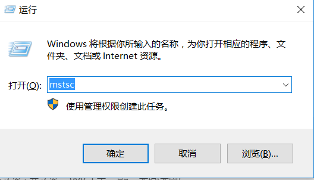
- 输入远程 IP 点击链接

    ##### 图 3\. IP 输入

    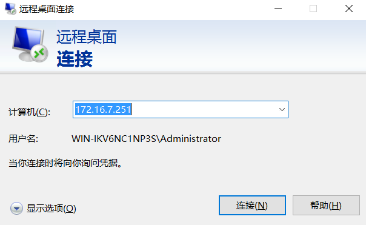
- 输入账号密码后点击确定

    ##### 图 4\. 虚拟机的环境配置

    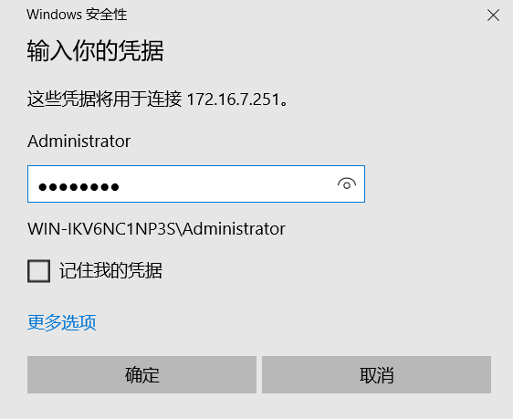

以上操作是进入远程桌面的操作

### 章节 2：启动 content analytics 服务

从 Windows 桌面任务栏中，右键 WEX 启动命令，选择以管理员方式运行。

##### 图 5\. 以管理员身份运行

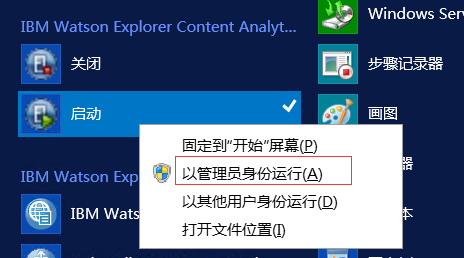

### 章节 3：就进入 content analytics

创建集合，可以使用 Watson Explorer 内容管理控制台分析应用程序

- 通过 URL 访问 WEX 内容分析控制台
- 输入账号密码

    ##### 图 6\. 登陆

    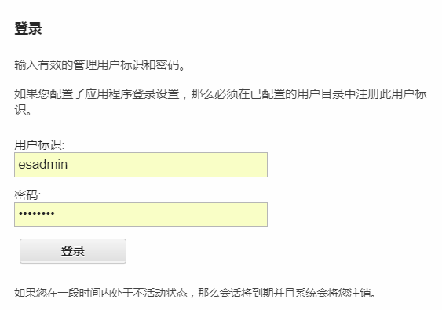
- 进入内容分析控制台

    ##### 图 7\. 进入内容分析控制台

    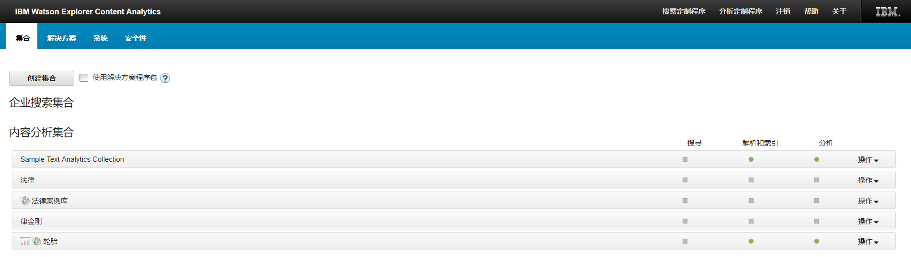

## 实验二：浏览将要分析的数据

### 数据分析

本实验供了本练习中要使用的内容的背景信息。

要构建集合，需要了解您要包含的文档采集。 需要了解哪些领域（结构化和非结构化）可用和搜索文档需要哪些领域。对于这个练习，使用了中国 A 股上市公司 2017 年的财报分析。

通常情况下，需要确定为每个字段设置的配置值。 作为一个提醒，以下列表显示列和说明。

- 可返回（Returnable） – 显示搜索结果中字段的值
- 构面搜索（Faceted search） – 使该字段在搜索结果中显示为一个构面。
- 免费文本搜索（Free text search） – 使用自由文本查询来搜索该字段
- 字段搜索（Fielded search） – 按字段名称启用字段
- 参数搜索（Parametric search） – 使用参数化查询启用该字段排序。不能同时启用此选项和文本可排序。
- 可分析（Analyzable） – 使该字段能够作为文档内容进行分析

## 实验三：创建一个集合

在这个实验中，创建一个集合

注意：如果在此实验期间的任何时间，收到一条所需系统服务之一的消息不运行，或解析器和索引或搜索和内容中的服务器存在问题分析组件，公共通信层或 CCL 可能已停止。

##### 图 8\. 启动 CCL

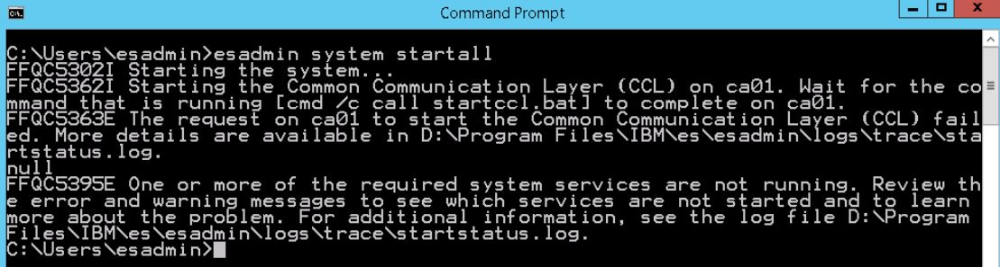

### 以下步骤是启动 CCL

1. 从 Windows 桌面，双击桌面图标关闭，停止服务
2. 从 Windows 工具栏中，单击命令提示符图标以打开命令提示窗口。
3. 在命令提示符窗口中，输入 startccl -fg 启动内容分析公共通讯层在前台，按回车键。必须离开这个窗口打开以保持 CCL 运行。 最小化此窗口。
4. 从 Windows 工具栏中，右键单击并选择命令提示符打开命令提示窗口。
5. 从”命令提示符”窗口中，输入 esadmin start 以启动 Content Analytics 和按回车。这需要几分钟的时间才能开始。在消息中，按任意键继续…，按 Enter 键关闭窗口。
6. 有时，CCL 可能无法启动。 从 Windows 工具栏中，右键单击并选择命令提示符打开另一个命令提示符窗口。 输入 esadmin 检查并按 Enter 键。 您可以检查管理员的服务会话（管理
7. 控制台）和 searchapp（Content Analytics Miner）启动。 关闭此命令 esadmin 检查的提示窗口。

### 创建一个集合

- 在”管理控制台”窗口的”集合”选项卡上，单击”创建集合”按钮采集。 
- 在”创建集合”窗口中，完成以下步骤：

输入集合名称作为”2017 上市公司半年报分析”，并选择集合类型为内容分析集合。

##### 图 9\. 输入集合名称

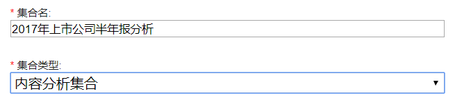

- 对于解决方案程序包选项，保持默认值，不要应用解决方案包。

    ##### 图 10\. 选择“不应用解决方案程序包”

    

对于文档缓存选项，选择选项，启用文档缓存。

- 选项允许重新构建索引，而无需重新抓取数据源。

    ##### 图 11\. 选择“启用文档高速缓存”

    
- 对于缩略图生成选项，选择启用缩略图。只能为特定类型的文档生成缩略图（例如，

Microsoft Office 和 PDF），本实验呢启用缩略图。

##### 图 12\. 选择“启用缩略生成”

- 点击高级选项

输入收集说明，

##### 图 13\. 输入集合的描述说明

集合安全：该选项一旦设置将不可更改，因此本实验不启用该选项

##### 图 14\. 选择“不启用集合安全性”

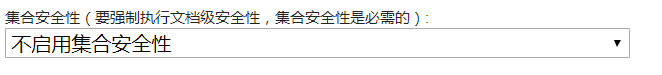

文档重要性：可以选择静态企业搜索和内容分析工具使用的排名方法应用程序优先考虑结果。 对于本实验练习，保持默认值，不要应用任何静态排名（此选项可在创建集合后更改）。

##### 图 15\. 选择“不要应用任何静态排名”

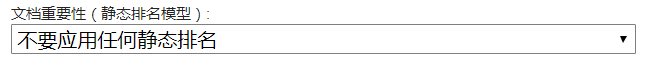

重复的文档检测：它允许您过滤掉重复或者来自搜索结果的重复项。 选择启用重复文档

从下拉式按钮进行检测。此选项也可以在之后更改该集合已创建。

##### 图 16\. 选择“不启用重复文档检测功能”

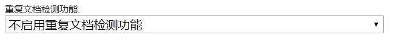

关注词汇：帮助分析师可以快速的发现在特定领域的专业词汇，通过这个内容分析认为高度重要的术语。本实验启用自动识别术语。

##### 图 17\. 选择“启用自动标识关注词汇”

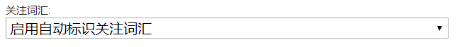

情感分析：选择选项，启用情绪分析。解析器识别正，负或中性的情绪。因为该练习是财务报表分析，不存在情感分析，因为本实验禁用情感分析。

##### 图 18\. 选择“禁用观点分析”

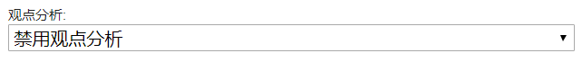

查询日志索引。 如果要提前提供类型，请启用此选项在企业搜索或 Content Analytics Miner 应用程序中支持（不能在创建集合后启用查询日志索引）。 保持默认，启用查询日志索引，用于本实验练习。

##### 图 19\. 选择“启用查询日志索引”

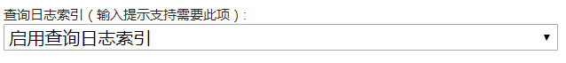

基于规则的分类。 对于这个实验练习，启用基于规则的分类。

##### 图 20\. 选择“启用基于规则的分类”

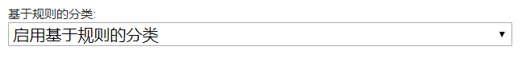

文档集群，能够提取提出的元数据索引中文件的子集（集群）的术语，并使用术语进行分类

内容。 保持默认状态，不要启用文档集群，为本实验练习。

##### 图 21\. 选择“不启用社交数据支持”

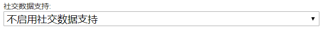

社交数据支持。 保持默认状态，不启用社交数据。

叠加索引:。 保持默认值，不要启用叠加索引。

##### 图 22\. 选择“不启用叠加索引”

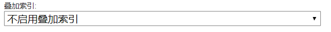

N-gram 分段，仅适用于使用中文的集合，日语或韩语，白色空间不划分字边界。本例中启用 N-gram 分段

##### 图 23\. 选择“同时启用形态分段和 N-gram 分段”并且注意策略

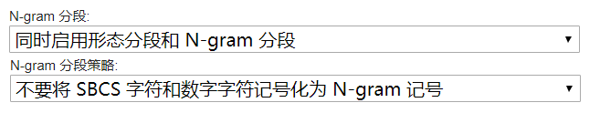

添加文档元数据的缺省构面。选中此复选框表示想要为某些文档属性自动创建方面（文件扩展名，文件大小和上次修改日期）。 选择此复选框 此集合的分区数。 保持选项为 1.何时您创建一个企业搜索集合，可以选择创建多个索引分区。 内容分析集合会自动分区。分区启用系统平衡跨多个分区的数百万个文档的处理，使得每个分区处理大致相同数量的文档。

##### 图 24\. 保持选项为 1

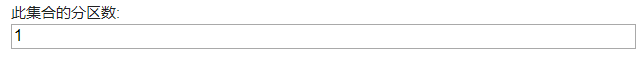

集合数据的位置：允许在默认值之间进行选择位置，D：\ Program Files \ IBM \ es \ esadmin \ data \ ，或指定驱动器和收集数据所在的目录。 在生产环境中，收集数据可能需要非默认位置。 对于这个实验练习，保持收集数据的位置为默认位置。

##### 图 25\. 保持缺省位置选择

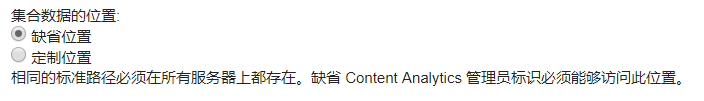

集合标识:。 此选项允许您指定集合 ID，而默认 ID 不太有意义，可能导致您不得不查找系统将来生成 ID。 对于本实验练习，选择自定义 ID 按钮，并在单选按钮下方显示的文本框中输入 financial\_report\_analytics。集合 ID 必须遵守的规则。

##### 图 26\. 选择“定制标识”

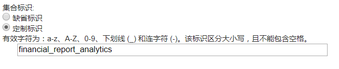

在”集合语言”窗格中，在”可用语言”框中选择中文，和单击两个框之间的箭头图标将中文移动到限制语言被使用的盒子。

##### 图 27\. 选择语言

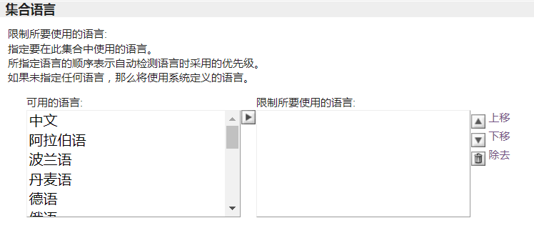

收集时区选项默认为 CA 服务器的时区，并用于转换文档日期值（在时代，自 1 月 1 日起的毫秒数，1970，00:00:00 GMT）到日期狗奶奶的年，月，日和小时元素。可以使用下拉列表将时区设置到您的位置。

##### 图 28\. 选择集合时区

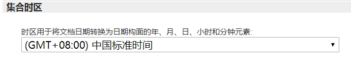

点击”确定”完成创建

- 返回到管理控制台上的”集合”选项卡，可以看到刚刚创建的集合，如下图

    ##### 图 29\. 查看创建的集合

    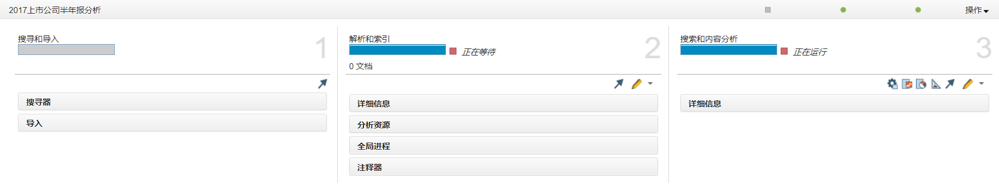

## 实验四：搜寻和导入

### 章节 1：创建一个爬虫

- 集合面板中有”搜寻和导入”，”解析和索引”，”搜索和内容分析”三个面板

- 单击集合”2017 上市公司半年报分析”面板，扩展子面板

- 在”解析和索引”窗格中，显示状态消息”正在等待”，左边的红色方块状态消息是停止图标。 单击停止图标（红色方块）停止解析和索引过程。解析和索引状态消息已更改为已停止。 停止图标（红色正方形）已更改为绿色三角形（开始图标）。
- 在搜寻和导入窗格中，新增一个”搜寻器”

    ##### 图 30\. 新增一个搜寻器

    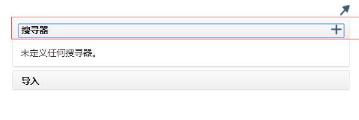
- 在”搜寻器类型”选择 Windows 文件系统，然后单击下一步。

    ##### 图 31\. 选择“Windows 文件系统”类型

    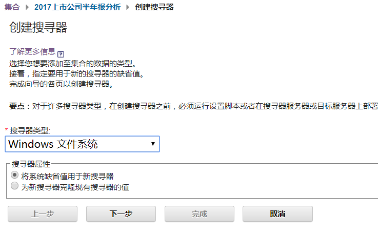
- 在 windows 文件系统中完成一下步骤

- 命名为 Windows 文件系统搜寻器 -财务报表

- 向下滚动窗口以查看各种高级选项。输入描述，10000 文档，完全抓取。
- 更改启动爬网程序会话选项以启动完全搜寻。这将确保如果更改文档的解析方式则会重新爬行所有内容。当集合更新完成，将从新爬去新增内容和修改内容。

    ##### 图 32\. 属性填写细节

    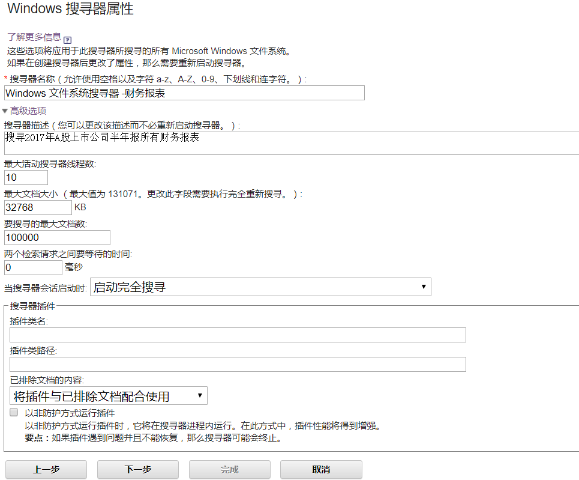

我们将所有的 2017 年上市公司的 PDF 文档放在 C:\\Data\\Fianial 目录下面，如图

##### 图 33\. 找到目录下数据

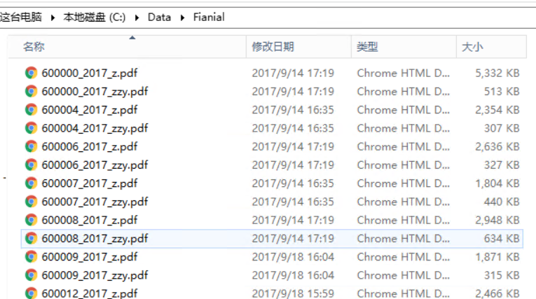

将该目录设置为爬去目录，

##### 图 34\. 设置目录

点击完成创建此集合，返回首页，点击绿色三角箭头，启动爬虫

##### 图 35\. 启动爬虫

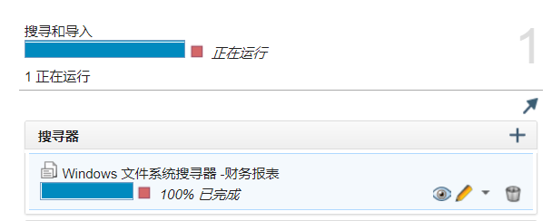

## 实验五：解析和索引

### 章节 1：创建一个索引字段

对于内容分析集合，需要定义索引字段并指定每个索引字段属性。 在本实验习中，您将创建要定义的索引字段。 其中一些指标字段稍后定义为方面，并映射到文档中的 XML 字段。

- 从”2017 年上市公司半年报分析”页面的”解析和索引”窗格中，单击铅笔图标配置此集合的解析和索引设置），然后单击链接索引字段。

    ##### 图 36\. 选择点击索引字段

    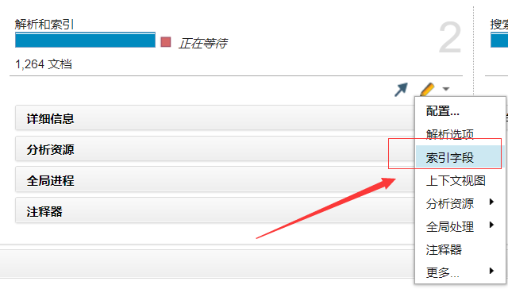
- 打开”索引字段定义”窗口。 已经存在的八个索引字段是与所有 Windows 文件系统抓取器相关联的本机元数据索引字段。

    ##### 图 37\. 存在的元数据索引字段

    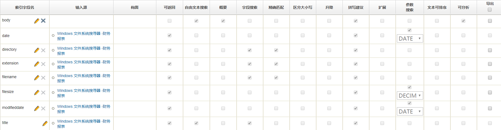

点击 创建一个索引字段

- 在创建索引字段窗口中，键入字段名称文本框为资产负债表和选中可返回，自由文本搜索，文档摘要，字段搜索搜索和构面搜索。 展开浏览器窗口，然后单击底部的”确定”窗口创建字段。

    ##### 图 38\. 创建索引字段详细

    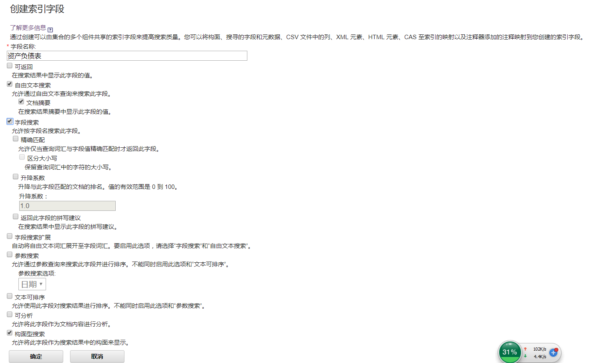

然后再添加一下字段

##### 图 39\. 添加字段

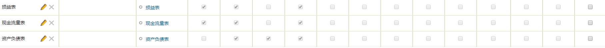

现在索引字段由自定义的索引字段和本机自带的索引字段组成。可以选择在最右边或窗口导出的索引字段定义。可以保存索引字段定义并将其导入不同的集合。

一些原生索引字段是必需的;提取的字段是取决于爬去的集合的类型。 例如，字段列表中，有一些字段图标（索引字段名称列中的 X 图标）并不表示索引字段（如 date 和 title）。 其他本地字段可以被删除，如 body，directory，extension，filesize，modifieddate。 未使用的索引字段占用空间在索引中，因此如果不使用索引，则可以将其删除。

### 章节 2：创建构面

上面已经定义了索引字段，现在需要配置这些索引字段为构面，作为每个更容易被理解的构面名称。 在本节中，将创建一个构面树将索引字段关联到树上的面节点。

- 点击创建一个”构面树”

    ##### 图 40\. 创建一个“构面树”

    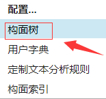
- 在创建构面树的窗口中，完成一下操作

- 点击 My Keywords

- 在”编辑构面”窗格中，可以更改现有构面。 更改构面路径

    ##### 图 41\. 更改构面路径

    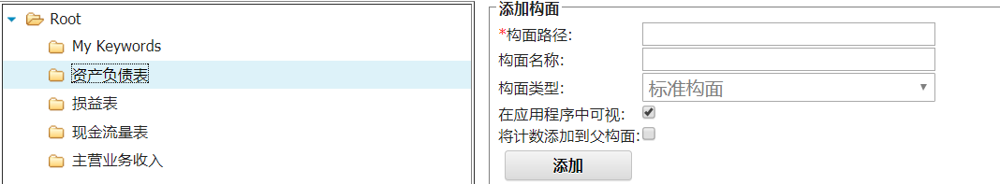

现在已经定义了索引字段和构面树，然后需要将索引字段映射到每个文档中的标签。

- 在”2017 年上市公司半年报分析”窗口的”解析和索引”窗格中，单击”铅笔”图标，单击更多>用于解析和内存分析建立的索引。将内存大小改写为了 4124M
- 在”解析选项”窗口中，将索引线程数更改为 10.单击”确定”。需要在搜索和内容上增加搜索服务器的内存分析组件部分。

    ##### 图 42\. 选择“解析选项”

    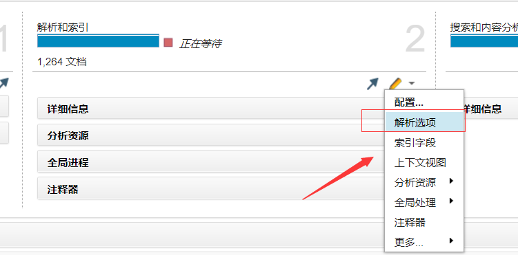

    ##### 图 43\. 更改线程数

    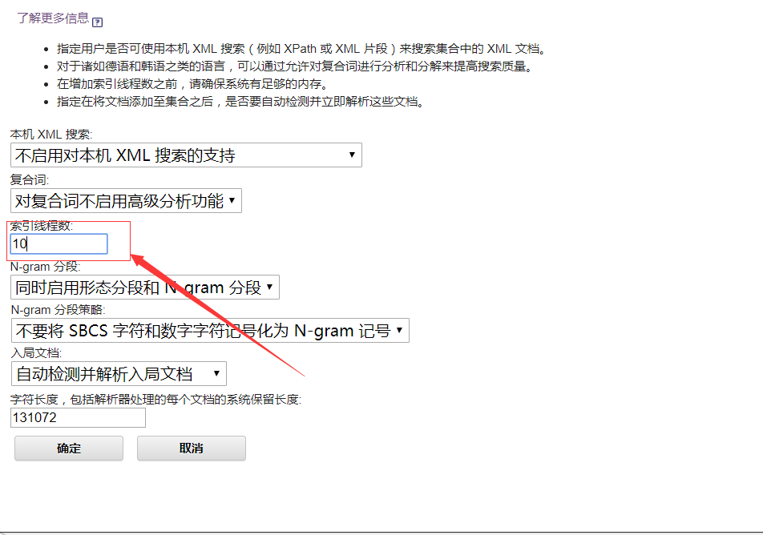
- 关于”2017 年上市公司半年报分析”搜索和内容分析组件窗口中，单击”铅笔”图标，单击”搜索服务器的内存”，改为 4124M

    ##### 图 44\. 选择“搜索服务器的内存”

    
- 在 2017 上市公司半年报分析窗口中，单击操作>设置>编辑集合设置。

    ##### 图 45\. 选择“编辑集合设置”

    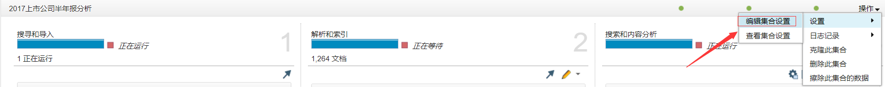

停止并启动解析和索引组件以使更改生效。

##### 图 46\. 选择“勇于解析和建立索引的内存”

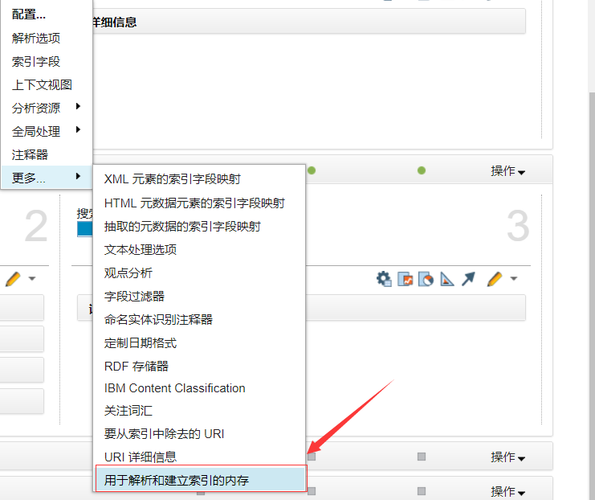

## 实验六：启动爬虫，部署分析资源，重建索引

在实验中，将执行启动解析器和搜索服务器所需爬虫程序。该抓取工具从配置的子目录中提取文档。 解析器解析并索引将数据抓取到 tokens 中，并应用上述部分中定义的搜索和定义规则。

- 在 2017 上市公式半年报分析中，完成一下操作

单击”搜索和导入”窗格中的”搜索引擎”框， 单击 Windows 文件系统的绿色三角形图标（启动此爬虫程序）抓取工具右侧显示的百分比完成显示状态。

##### 图 47\. 监控抓取进度

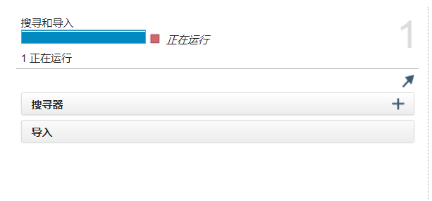

- 爬虫程序启动（状态消息正在爬网）后，单击 图标，监视此抓取工具抓取的内容的详细信息和统计信息。观察爬行器的进度。

    ##### 图 48\. 观察爬行器的进度

    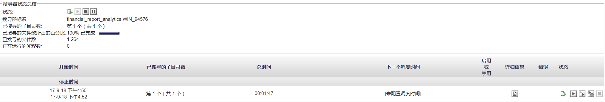

单击定期刷新，等待窗口刷新，看到响应之前，可能需要缓慢的几次点击。

注意：如果对构面树进行了更改，则需要重新部署分析资源并重新构建索引。单击”分析资源”框扩展显示。单击绿色三角形（部署分析资源）以重新部署分析资源。重新部署完成后，从”详细信息”框中，单击绿色三角形（重建索引）重建索引。 在消息中，索引重建未进行中。 您可以重新启动完整的索引构建。要启动索引的完整重建吗？，请单击确定。

当重建索引消息 100％停止时，再次单击”详细信息”框以折叠显示。默认情况下，搜索和内容分析过程应该运行。 如果没有运行，请单击开始图标（绿色右对角三角形）启动搜索服务器。 停止任何其他集合运行。

## 实验七：验证内容分析工具中已更改的内容

- 进入 Watson Explorer Content Analytics 界面
- 在分析界面完成以下操作

- 验证 2017 上市公司半年报分析的导航栏

    ##### 图 49\. 导航栏

    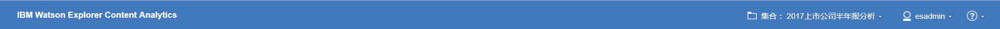
- 如果 2017 上市公司半年报分析（集合）链接，请选择 2017 上市公司半年报分析，然后单击保存。

    ##### 图 50\. 选择“2017 上市公司半年报分析”

    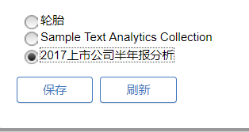
- 点击构面按钮，再点击左边的自带的词性标注，显示如下

    ##### 图 51\. 词性标注

    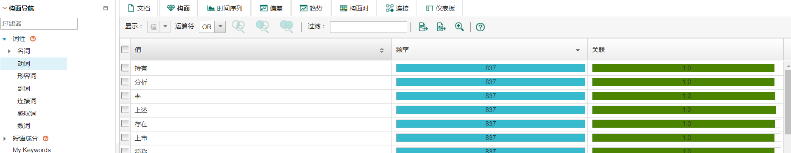
- 点击创建资产负债表等自定的构面，会发现目前后面内容为空

    ##### 图 52\. 检查创建的资产负债表等自定义构面

    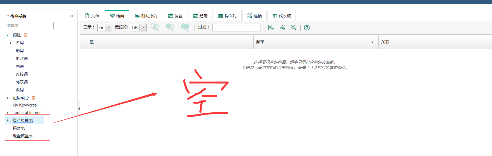

注意：如果发现有错误，则需要更正错误，重新部署分析资源并重建索引。

## 实验八：创建一个用户字典

实验五已经创建了一个构面，但是到目前为止，构面还没有任何内容。需要创建一个用户字典来分类您平时关心的内容

- 从分析资源中进入构面树

    ##### 图 53\. 进入构面树

    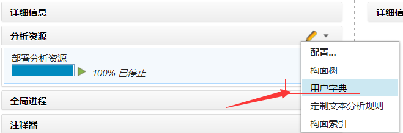

先配置资产负债表的用户字典，配置内容：

##### 图 54\. 配置用户字典

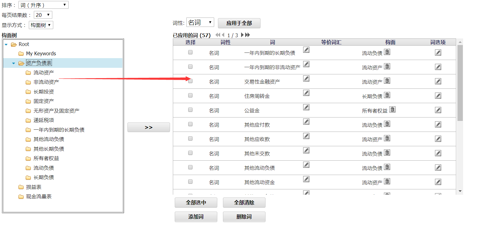

- 重新部署分析资源，点击如下图的绿色三角箭头

    ##### 图 55\. 选择“分析资源”

    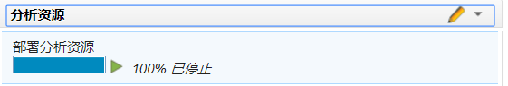

重建索引，点击如下图所示的重建索引绿色三角符号。该操作如果文件数量较多的化，可能会话费比较多的时间。

##### 图 56\. 重建索引

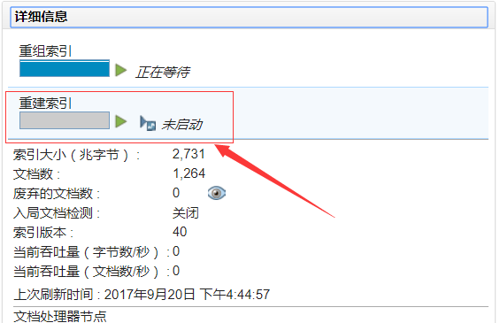

检验：进入分析页面，点击构面—最左边的资产负债表，右边构面不再为空则说明刚刚的用户字典已经生效了，如下图：

##### 图 57\. 进入分析页面

## 结束语

以上是对 Watson Explorer 的常用操作进行了说明，并对相关的场景进行了举例说明。按照以上步骤对 Watson Explorer 操作完成后，会对 NPL 在 Watson Explorer 的实现有大概的了解。接下来的章节将会更深入的介绍 NPL 在 Watson Explorer 中的应用场景操作。