# 如何构建一个复杂的 Watson Conversation 服务
使用对话服务来创建一个对话框，帮助用户与认知汽车仪表板交互

**标签:** 分析

[原文链接](https://developer.ibm.com/zh/articles/ba-cn-watson-conversation/)

廖显, 曾滔

发布: 2017-12-20

* * *

IBM Watson 提供了强大的认知计算能力。通过链接物联网，可实现人机智慧交流。在本文中，您将使用对话服务来创建一个对话框，帮助用户与认知汽车仪表板交互。

## IBM Watson Conversation 介绍

IBM Watson Conversation 是 IBM 在人工智能领域 QA（问答技术）的一个核心技术，并且整个 IBM Watson Conversation 已经完全封装成一个云应用可以为用户/合作伙伴调用使用，而无需了解和掌握其中的技术原理，是 IBM 基于云的认知应用的一个典型代表。

如何构建一个聊天机器人，这个是现在人工智能领域一个非常流行的话题，而 IBM Watson Conversation 的使用可以帮助企业快速的搭建起一个基于企业服务内容需要的聊天服务机器人，能够让企业快速的增强在 AI 时代里的用户连接能力，以及基于这种链接力的洞察。快速的构建和部署一个聊天机器人或则一个虚拟的机器人代理，并且可以延伸到无论是移动设备，还是聊天应用，或者甚至就是一个实体机器人的大脑里，IBM Watson Conversation 都值得 AI 技术开发者一试。

IBM Watson Conversation 在使用过程中，有如下几个特点：

1. 部署非常的方便和友好。容易开始，容易使用，很快的可以找到应用价值，并且可以和不同的渠道平台集成起来。
2. 云的使用方式，API 调用，整个后台机制由 IBM 来维护，无需在技术机理上投入太多资源和专家。
3. 数据安全，整个使用上，云上的数据都是企业拥有，IBM 会保护企业数据的隐私性，IBM 也不会查看和拥有企业数据，IBM 只提供技术能力。

因为在人工智能领域，QA（问答技术）是一个非常基础并且关键的应用技术，它是人工智能里参与式系统（System of Engagement）的一个代表，一般使用这样的技术来建立与用户的对话链接，从而让后期的自然语言分析成为可能，因此 IBM Watson Conversation 的使用是学习人工智能技术很好的开始。

## 学习目标

- 完成本教程之后，您将知道：
- 定义实体
- 开发一个 dialog
- 在 dialog 中使用节点和响应条件

## 持续时间

本教程大约需要 2 到 3 个小时才能完成。

条件：该文档是建立在您已经对 watson conversation 有一定了解的基础上，对于相关概念有一定的认知。

您将使用您创建的对话教程工作区，并将节点添加到您作为入门练习的一部分构建的简单对话框中。

## 步骤 1：添加意图和示例

在意图标签上添加意图。 意图是用户输入中表达的目的或目标。

1. 在”汽车”教程工作区的”意向”页面上，单击

。

1. 添加意图名称为”开灯”的意图，然后按 Enter 键：

    ##### 图 1\. 添加名为“打开”的意图

    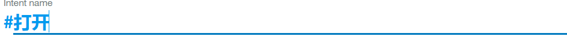

     意图名称会自动新增一个#键。 “#打开”意图表示用户想要打开诸如收音机，挡风玻璃刮水器或前灯的设备。

2. 在” **User example**“字段中，键入以下话语，然后按 Enter 键：

    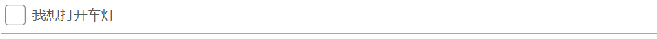

     然后再添加以下这 5 个例子来帮助 Watson 认识到#打开的意图。

    ##### 图 2\. 添加 5 个例子来认识“打开”意图

    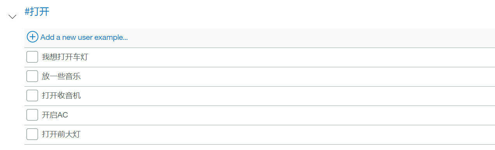

3. 分别再创建”#问候”，”#再见”两个意图，如图

    ##### 图 3\. 再创建两个意图

    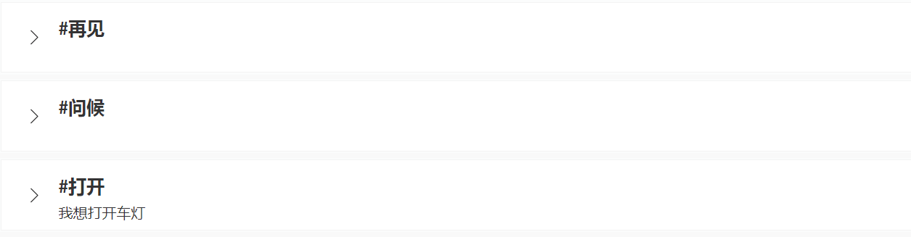

你现在有三个意图，#打开，#问候和#再见，所有的例子都是例句。 这些例子有助于训练沃森识别用户输入的意图。

## 步骤 2：添加实体

实体定义包括可用于触发不同响应的一组实体值。 每个实体值可以有多个同义词，它们定义了在用户输入中可以指定相同值的不同方式。

创建可能发生在具有”#打开”意图的用户输入中的实体，以表示用户要打开的内容。

1. 单击” **entities**“选项卡以打开”实体”页面。
2. 点击” **Create new “**
3. 添加名称为 **“装置”** 的实体名称

##### 图 4\. 添加名为“装置”的实体

@加在指定的实体名称之前。”@装置”实体表示用户可能想要打开的汽车中的设备。

1. 点击切换开启模糊匹配。

    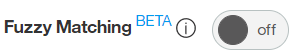此设置有助于服务器识别对用户输入中的实体的引用，即使实体与您在此使用的语法并不是完全匹配（注意，fuzzy matching 目前还不支持中文，所以，该实例中是中文演示，并没有开起此功能）。

2. 将”收音机”添加到实体下，该值表示用户可能要打开的特定设备。并添加”音乐”，”曲目”，”歌曲”，”广播”作为该实体的同义词。
3. 同样的方法，添加如下实体和同义词

##### 图 5\. 添加 5 个例子来认识“打开”意图

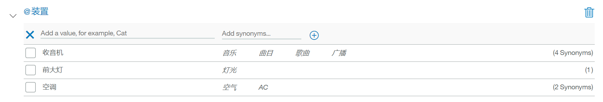

重复以上步骤，新增@音乐类型实体，如下图

##### 图 6\. 新增其他的实体

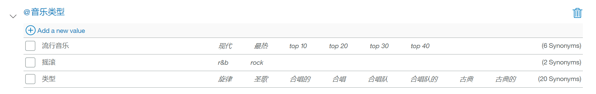

以上定义了两个实体：@装置（表示机器人可以打开的设备）和@风格（表示用户可以选择听的音乐类型）。

当接收到用户的输入时，对话服务识别意图和实体。定义一个使用意图和实体来选择正确响应的对话框。

## 步骤 3：创建一个复杂的对话框

在这个复杂的对话框中，我们将使用之前定义的”#打开”意图

为#打开意图新增一个节点

创建一个对话框分支来响应#打开意图。 首先创建基本节点：

我们先创建一个对话框

##### 图 7\. 创建一个对话框

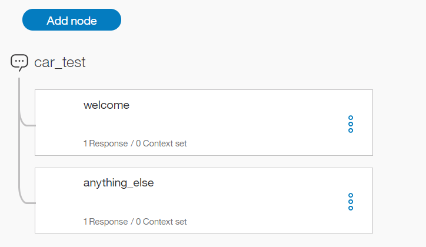

在 welcome 节点点击

，然后点击 add node below,如下图：

##### 图 8\. 选择 Add node below

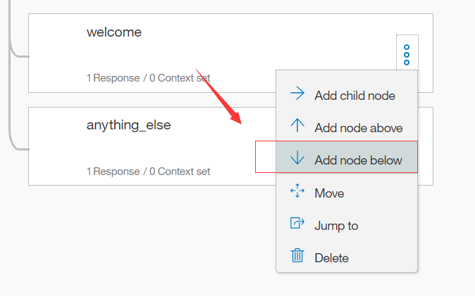

在弹出的对话框中，If bot recognizes:中输入#打开，其他保持为空，关闭。如下图

##### 图 9\. 输入“\#打开”

### 场景

对话框需要确定用户想要打开的设备。 要处理此问题，请根据其他条件创建多个响应。

根据您定义的意图和实体，有三种可能的情况：

场景 1：用户想打开音乐，在这种情况下，机器人必须要求用户确定音乐类型

场景 2：用户想要打开任何其他有效的设备，在这种情况下，机器人会在指示正在打开的消息中显示所请求的设备的名称

场景 3：用户没有指定可识别的设备名称，在这种情况下，机器人必须要求澄清。以此顺序添加检查这些场景条件的节点，以便对话框首先评估最具体的条件

### 场景 1

添加地址方案 1 的节点，这是用户打开音乐的节点。 作为回应，机器人必须要求音乐流派。

添加一个子节点，检查设备类型是否是音乐

1. 在#打开节点下新增一个子节点
2. 在条件字段中，输入@装置:收音机。 如果”entities 选项卡中定义的@装置实体的值为收音机或其同义词之一，则此条件为真。
3. 在回应领域，输入你想听什么样的音乐？
4. 节点命名为 音乐

##### 图 10\. 输入“@装置：收音机”

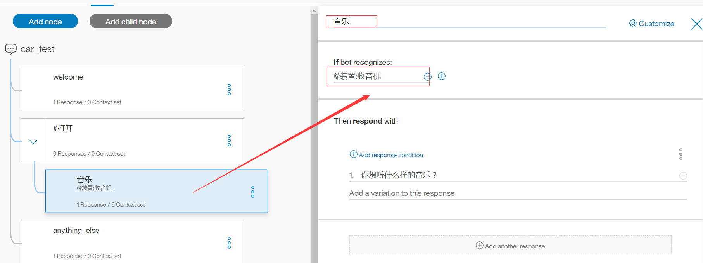

从#打开节点添加一个跳转到音乐节点

点击#打开节点的

，选择 jump to，选择音乐子节点，然后选择 [If bot recognizes (condition)](https://watson-conversation.ng.bluemix.net/us-south/ce46e6c8-333e-4a1a-8510-9f5c212721e4/workspaces/3d192087-642e-46f4-bf93-8a30ef824d37/build/dialog) 以指示要处理音乐节点的条件。

##### 图 11\. 选择 If bot recognizes (condition)以指示要处理音乐节点的条件

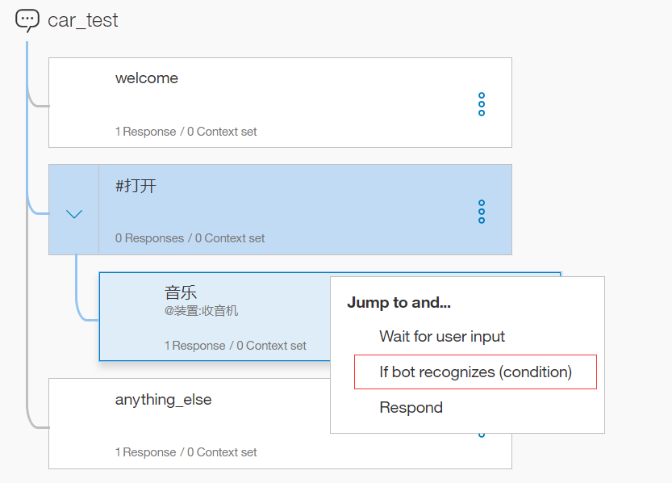

请注意，在添加跳转到操作之前，您必须创建目标节点（要跳转到的节点）。创建跳转到关系后，您将在树中看到一个新条目：

##### 图 12\. 新条目出现

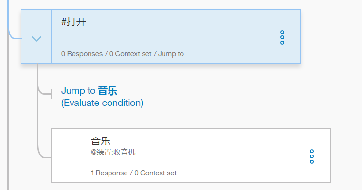

添加一个检查音乐类型的子节点

1. 在音乐节点点击：

    选择 **Add child node**. 只有在用户回答有关他们想要听到的音乐类型的问题之后，才会评估此子节点。 因为我们需要在此节点之前确定用户输入，所以不需要使用 **Jump to** 动作。

2. 将@音乐类型添加到条件字段。 当检测到@音乐类型实体的有效值时，此条件为真
3. 在回复中输入:好的，即将播放@音乐类型

##### 图 13\. 输入:好的，即将播放@音乐类型

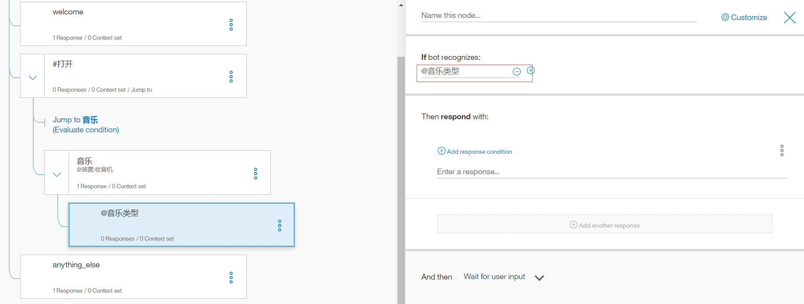

添加在用户响应中处理无法识别的类型类型的节点

在创建对话框的时候，这个节点是自动生成的，所以此处不再赘述。如果想全面了解此节点，可去相关文档查看。自动生成的节点如下图：

##### 图 14\. 自动生成的节点

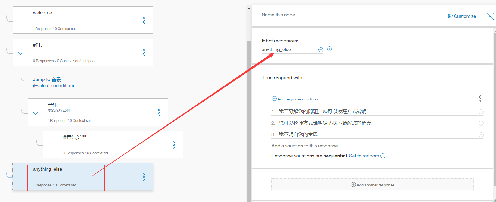

测试音乐对话框

1. 点击：

    打开聊天对话框

2. 输入播放音乐。 机器人识别#打开意图和@音乐类型：音乐实体，并通过要求音乐类型作出响应。
3. 输入一个有效的@音乐值（例如，摇滚）。 bot 识别@音乐类型实体并进行适当响应。

##### 图 15\. bot 识别@音乐类型实体并进行适当响应

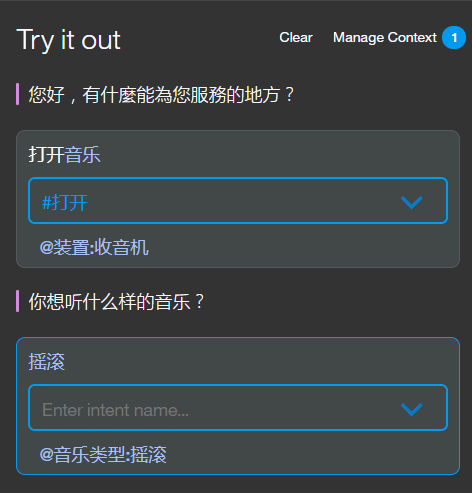

键入其他内容时，但此时间为该类型指定无效的响应。 机器人回应说它不明白。

##### 图 16\. 机器人回应

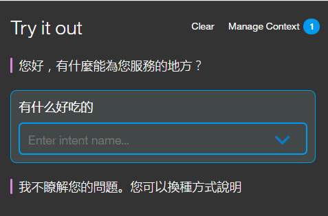

### 场景 2

我们将添加场景方案 2 的节点，即用户要打开另一个有效的设备。 在这种情况下，机器人会在指示正在打开的消息中回读所请求的设备的名称。

添加一个检查设备的子节点

1. 新增一个节点，当用户输入一个有效的@装置时触发。对于其他的@装置，bot 并不需要用户输入更多的信息就能得到正确的回答。
2. 点击音乐节点，在新增节点点击 Add node below，
3. 输入条件为@装置，如果用户输入包括除音乐之外的@appliance 实体的任何识别的值，则触发条件。

##### 图 17\. 输入条件

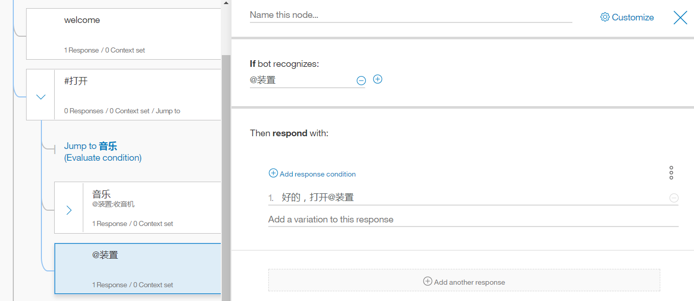

测试这个节点

##### 图 18\. 测试节点

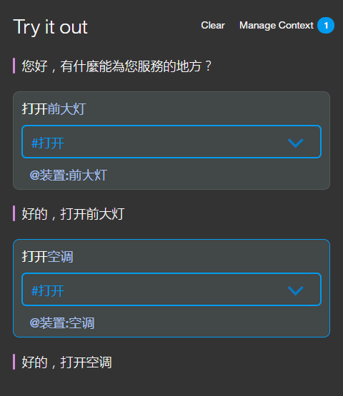

### 场景 3

添加如果用户没有指定有效的设备类型时触发的对等节点

1. 在#打开节点下新建一个节点
2. 条件输入 true，此条件指定如果对话流到达此节点，则应始终将其评估为 true。 （如果用户指定了一个有效的@设备值，则不会访问该节点。）
3. 输入：不好意思，我没有明白你的意思，请指定您要打开什么

##### 图 19\. 输入：不好意思，我没有明白你的意思，请指定您要打开什么

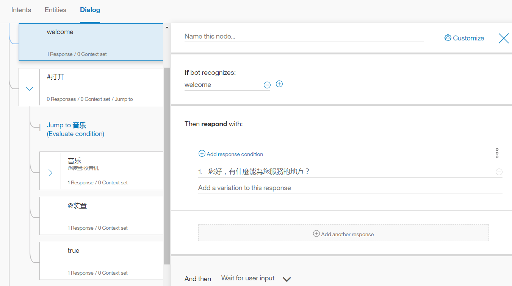

测试

##### 图 20\. 测试

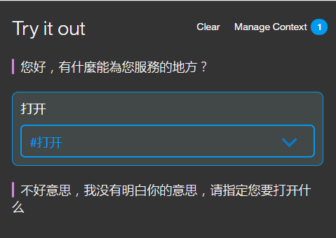

## 步骤 4：部署教程工作区

现在您已经构建并测试了您的工作区，您可以将其连接到用户界面进行部署有几种方法：

### 在 slack 中部署

您可以使用测试部署工具将其作为聊天机器人部署在 Slack 通道中，只需几步。 此选项是部署工作区进行测试的最快捷且最简单的方法，但它有局限性。

### 构建您自己的前端应用程序

您可以使用 Watson SDK 构建您自己的前端应用程序，该应用程序使用对话 REST API 连接到工作空间。

### 部署到社交媒体或消息传递渠道

您可以使用 Botkit 框架构建一个可以与社交媒体和消息通道（如 Slack，Facebook 和 Twilio）集成的应用程序。

## 参考资源

阅读本文之前，需要建立对于 AI 的基础知识，并且对于 IBM Watson 的使用场景需要有一定掌握。

- [IBM Watson Conversation 知识库](https://www.ibm.com/watson/developercloud/conversation/api/v1/)
- [IBM Cloud 使用文档](https://console.bluemix.net/docs/services/conversation/getting-started.html)