# 如何结合使用 Subversion 和 Eclipse
集成其实很简单

**标签:** DevOps,软件开发

[原文链接](https://developer.ibm.com/zh/articles/os-ecl-subversion/)

Chris Herborth

发布: 2006-09-25

* * *

原有的 Eclipse 安装已集成了对 CVS（一种流行的开放源码变更管理系统）的支持。CVS 的功能及其局限性众所周知，但是许多小组一直在研究其他版本控制的系统，以便提供更好的伸缩性、对合并变更和分支版本的更好支持以及对二进制文件格式的更好支持。

Subversion（SVN）是最受欢迎的 CVS 替代品，它提供了更好的性能（允许智能本地缓存和数据库后端）、轻松而又快速的分支（branching）以及对使用 CVS 时常见的所有问题的应答。

继续阅读本文，了解如何向 Eclipse 添加 Subversion 支持，以及如何通过 IDE 执行基本的版本控制活动。

## 开始之前

为顺利学习本文内容，您需要下载并安装 Eclipse（参见 参考资料 ）。为您的平台下载 Eclipse SDK 包将为您提供基本的 Eclipse IDE（也称为 Eclipse Platform）和 Java™ Development Kit。如果您计划使用 C/C++ （我正打算这么做），请访问 C Development Tooling（CDT）Web 站点并使用更新管理器安装 CDT（下一节将介绍如何使用更新管理器）。

您还需要访问 Subversion 存储库。如果需要建立一个 Subversion 存储库，可在 Subversion 的 Web 站点（参见 参考资料 ）中找到一些出色的参考资料。出于演示目的，我将向您展示如何检出 Subclipse 项目，并在局域网上使用存储库中的项目。

## 将 Subclipse 添加到 Eclipse

Subclipse 是一个为 Eclipse IDE 添加 Subversion 支持的项目。我们将使用 Eclipse 的更新管理器将 Subclipse 添加到 Eclipse IDE。在 Eclipse 中的 “Help” 菜单中选择 **Software Updates > Find and Install** 打开更新管理器。

##### 图 1\. Eclipse 更新管理器

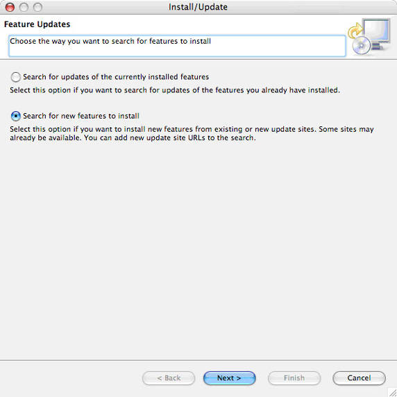

除了使用这个更新管理器查找软件更新外，我们还可以使用该更新管理器查找并安装新特性，如 Subclipse。务必选中 **Search for new features to install** ，然后单击 **Next** 以继续。Eclipse 会显示更新管理器的下一个面板。

##### 图 2\. 更新管理器站点

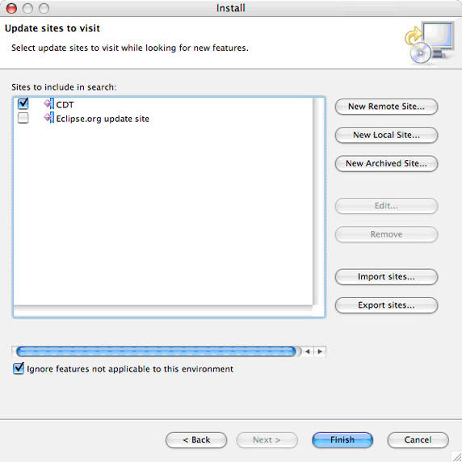

由于我们需要的是特定特性，所以取消选中现有站点，然后单击 **New Remote Site** ，显示 New Update Site 对话框（参见图 3）。我们将使用此对话框将 Subclipse 更新站点添加到列表。

##### 图 3\. 添加新的更新站点

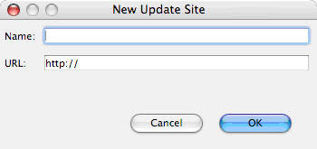

在 Name 中输入您需要的内容（ `Subclipse` 是最佳选择），并输入以下 URL： `http://subclipse.tigris.org/update_1.0.x` （当前 Subclipse 更新站点）。单击 **OK** 将 Subclipse 更新站点添加到更新管理器的列表中。

在更新管理器窗口中，单击 **Finish** ，开始搜索新特性。在本例中，我们需要的新特性是 Subclipse。片刻之后，更新管理器的搜索完成，并显示搜索结果。

##### 图 4\. 可以安装的新特性

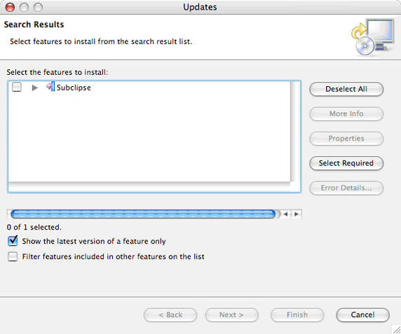

选中 Subclipse（您可以单击提示三角符号来查看此特性的详细内容），然后单击 **Next** 查看该特性的许可条款。接受条款，然后单击 **Next** 检查您选择安装的特性。单击 **Finish** 下载并安装 Subclipse。

更新管理器下载 Subversion 组件。在安装任何内容之前，Eclipse 都将通知您该特性没有数字签名（图 5）。这是您取消安装的最后一次机会。单击 **Install All** 继续安装。

##### 图 5\. Subclipse 没有数字签名

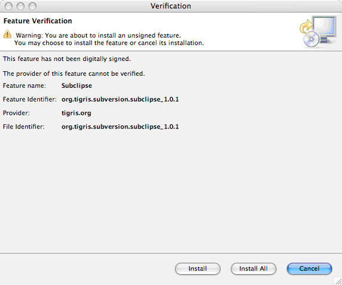

安装 Subversion 后，Eclipse 会立即通知您可能需要重新启动 IDE 才能激活新特性（参见图 6）。周全起见，重新启动 Eclipse。

##### 图 6\. 安装新特性后重新启动 Eclipse

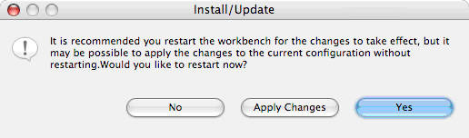

备份 Eclipse 后，才能安装并顺利使用 Subclipse。

如果在 Mac OS X 或 Linux® 上运行 Eclipse，您可能需要安装 JavaHL 库，在 Subclipse FAQ 中的 Troubleshooting 部分对该库进行了描述（请参阅 参考资料 ）。在继续尝试使用 Subclipse 之前，请做好这些准备工作。

### 快速测试

完成安装之后，测试新特性总是令人愉快；我们将从 Subversion 存储库检出 Subclipse 的副本，以确保其安装正确。

在 Eclipse 的 File 菜单中选择 **Import** 打开导入管理器（参见图 7）。选择 **Checkout Projects** from SVN，然后单击 **Next** 。

##### 图 7\. 导入管理器

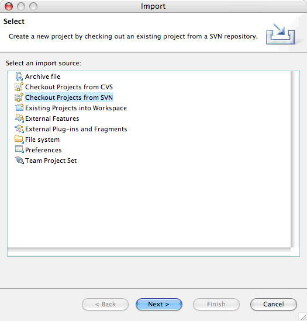

在 Select/Create Location 面板中（参见图 8），我们需要创建一个新位置（因为尚未进行任何配置），因而单击 **Next** 继续。若 **Next** 按钮禁用，请切换到 **Use existing repository location** 选项，然后返回到 **Create a new repository location** 以启用 **Next** 按钮。

##### 图 8\. 创建新的存储库位置

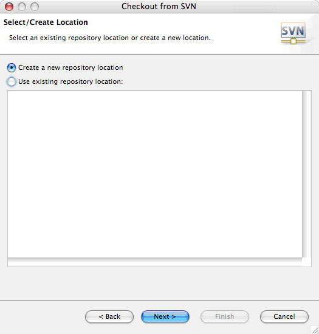

在接下来的部分（参见图 9）中，将存储库 URL（ `http://subclipse.tigris.org/svn/subclipse/` ）添写到 Url 字段中，然后单击 **Next** 。片刻之后，Eclipse 提示您输入用户 ID 和口令。如果您在 Subclipse 站点上没有账号，请输入 `guest` 作为用户 ID，并输入空格作为口令，选中 **Save Password** 框，并单击 **OK** 。

##### 图 9\. 添加存储库 URL

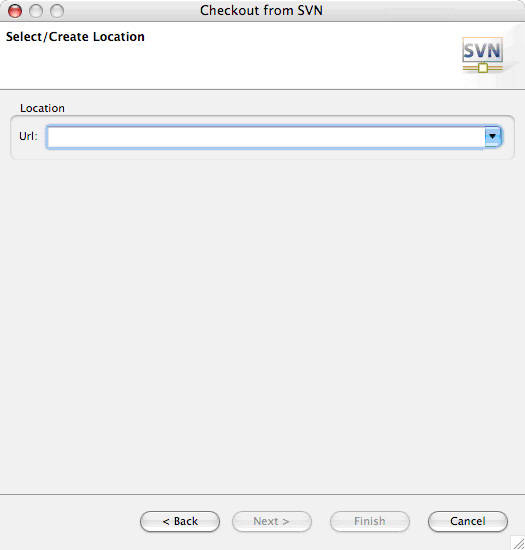

Eclipse 会显示 Subclipse 存储库中的文件夹（参见图 10）。展开 trunk 选中 subclipse 文件夹，然后单击 **Finish** 即可检出您自已的 Subclipse 项目的源代码副本。由于您对此没有任何概念，所以在 New Project 向导提示您时，请选择 **Simple > Project** 。

##### 图 10\. Subclipse 存储库

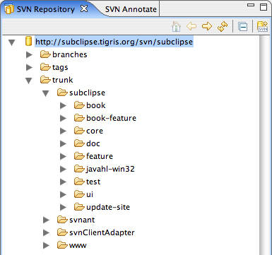

## 基本的 Subversion 操作

至此，我们已成功地安装了 Subclipse，并在 Eclipse 设置中添加了对 Subversion 服务器的支持，通过从存储库下载最新的 Subclipse 源代码，我们对 Subclipse 进行了测试。现在该考虑使用我们自已的代码和 Subversion 存储库来做些事情了。

向您展示如何使用 Subversion 之前，先简单介绍一下我的存储库。它驻留在称为 dogma 的机器上，端口为 8000，我为与我的 developerWorks 文章相关的代码新建了一个 developerworks 存储库。我将项目直接放置在存储库的根目录中。其他存储库的根目录下通常会有 trunk、tags 和 branches 文件夹，分别用于存放开发版本、标签和分支。但我不希望为 developerWorks 文章中代码的标签和分支操作而烦心。

我已经添加了两个项目，即 forkWork 和 threadWork，这两个项目来自我的第一篇 developerWorks 文章。我的 Eclipse 工作区（参见图 11）还包含三个来自 developerWorks 文章的其他项目（getopt\_demo、getopt\_long\_demo 和 readdir\_demo）。

##### 图 11\. 我的 Eclipse C/C++ 项目

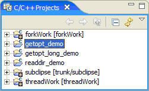

现在，我们做好了一切准备，可以开始工作。

### 将项目添加到存储库

要将新的项目添加到 Subversion 存储库，请右击该项目（可以在任何 Eclipse 的项目视图或 Navigator 视图），并且从菜单中选择 **Team > Share Project** 。Eclipse 会显示 Share Project 对话框。

##### 图 12\. Share Project 对话框

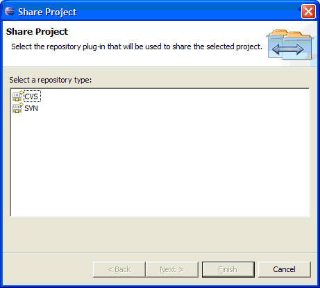

从 Eclipse 当前支持的存储库列表中选择 SVN，然后单击 **Next** 。接下来的对话框（参见图 13）让您选择现有存储库位置，或者创建一个新位置。

##### 图 13\. 选择存储库位置

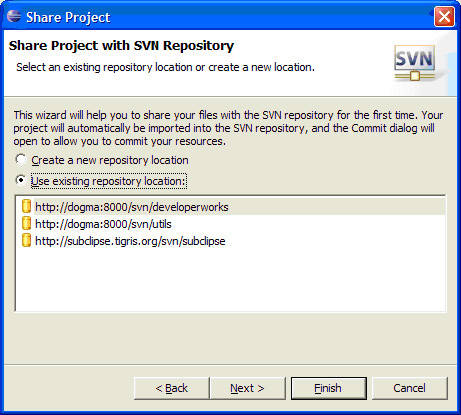

如果您的存储库已列出（如您所见，我已经添加了自已的库），选中它，并单击 **Finish** 。如果您的存储库未列出，请添加它（有关说明，请参阅 [快速测试](#快速测试) ），并继续。Eclipse 将在存储库中创建新目录，其名称与项目相同，并显示项目中的所有文件和文件夹的列表。

##### 图 14\. 添加项目的内容

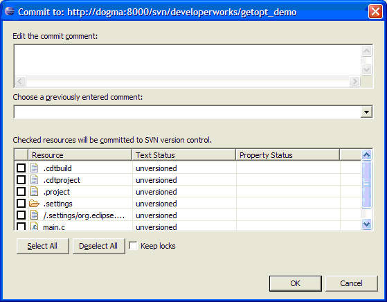

在顶部的字段中输入适当的内容来描述此项目，然后单击 **Select All** 选中该项目的所有文件。单击 **OK** 以检入项目，并将其当前状态传递给 Subversion 存储库。

Subversion 的命令和输出结果显示在 Console 视图中，通常位于 Eclipse 窗口的底部（如果您查看 Subclipse 究竟对项目执行了什么操作）。

### 更新项目

版本控制系统的重要特性之一是其他开发人员能够随时继续开发，并在准备好时提交其变更。要下载这些变更，并将其与本地副本集成，您需要更新项目。

右击您要更新的项目，然后从菜单中选择 **Team > Update** 。Eclipse 将从存储库中检索任何变更，并尝试将它们与本地副本合并。

### 添加文件或目录

如果将文件添加到项目中（参见图 15），它不会自动成为版本控制的一部分 —— 您需要明确将其添加到特定的存储库中。在下面的屏幕快照中，您可以看到，我已经将 ReadMe.txt 文件添加到了 threadWork 项目中。

##### 图 15\. 添加新文件

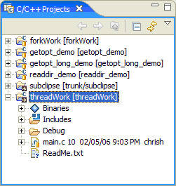

右击新文件，然后选择 **Team > Add to Version Control** 。就是这样！下一次将此项目中的变更提交给存储库时，新文件也会检入。

### 删除文件或目录

如果将文件添加到了与项目不在相关的存储库中，您可以轻松地删除它。右击文件，然后选择 **Delete** 。不需要使用 Team 菜单，Subclipse 自动将标记要删除的文件，并将它从项目中移除。下一次将变更提交给存储库时，该文件被删除了。

### 重命名文件或目录

要重命名 Subclipse 控制的文件或目录，请右击它，然后选择 **Rename** 。在输入字段中键入项的新名称，按 **Enter** 键。文件是在项目中重命名的，重命名操作（通过 Add 操作添加新名称、通过 Delete 操作删除旧名称）排队等待您下一次提交。在图 16 中，您可以看到将 main.c 重命名为 threadWork.c 之后、提交更改之前的 threadWork 项目。注意，Subclipse 为 “新” 文件添加的蓝色小加号表示该文件被安排在下一次提交时添加。

##### 图 16\. 重命名文件是原子操作，尽管它包含一个 add 操作和一个 delete 操作

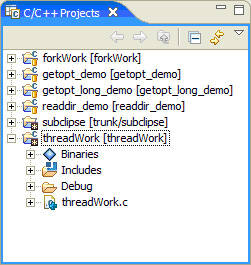

### 忽略文件

如果项目生成文件，或者包括您不想检入的 Subversion 存储库文件，则可以通知 Subclipse 忽略它们。右击您要在版本控制中排除的文件或目录，然后选择 **Team > Add to svn:ignore** 即可显示Add to svn:ignore 对话框。

##### 图 17\. 忽略不纳入版本控制的资源

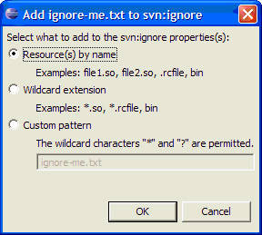

单击 **OK** 将这个特定的文件添加到项目目录的 svn:ignore 属性中。选择 **Wildcard extension** 忽略具有当前文件扩展名的所有文件，或选择 **Custom pattern** 在忽略列表中添加您自己的通配符。下一次提交变更时，对忽略列表的这些更改将添加到存储库中。

### 提交更改

如果您对项目的变更感到满意，确定了您的代码可以编译，并且已经对变更进行测试，则应将它们提交给 Subversion 存储库。在您的工作站崩溃时，它可以作为一个备份，并允许其他开发人员更新其本地副本以包含您的变更。

在尝试提交变更之前，请确保更新您的项目（参阅 “更新项目”）。右击项目，并从菜单中选择 **Team > Commit** 。Eclipse 会显示一个 Commit 对话框（参见图 18），其中汇总了您作出的变更。

##### 图 18\. 将变更提交给存储库

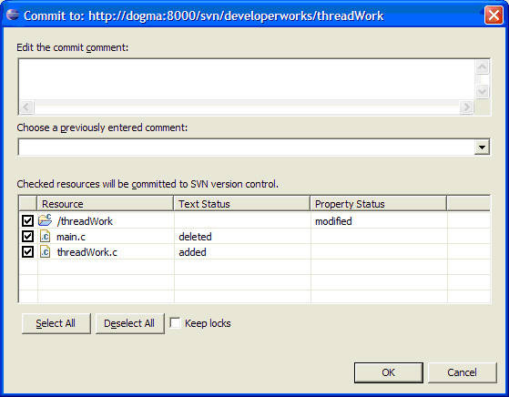

如果仔细观察，您会看到一个属性更改为项目目录（我已经添加了 `svn:ignore` 属性，以使某些文件保留在存储库外），并且在添加 threadWork.c 时，删除了 main.c。这一变更对实际上表示的是一个操作（文件重命名）。

此时，如果您要使某些资源保留在存储库外，则可以取消对这些资源选择。如果您在一个文件中完成了部分工作，并且不希望检入未完成的变更，则这种方法非常有用。在顶部的文本字段中输入适当的注释，然后单击 **OK** 将变更检入存储库。

## 结束语

Subclipse 项目将对 Subversion 版本控制系统的支持与 Eclipse 出色的团队项目管理功能集成在一起（后者仅对 CVS 服务器提供开箱即用的支持）。使用 Eclipse 的更新管理器，您可以轻松地将 Subclipse 添加到您的 Eclipse 安装中，这允许您直接从 Eclipse 中使用这一高级（至少我是这么认为）版本控制系统。

虽然将项目添加到存储库 —— 并管理您的项目资源（如果存在）—— 对不熟悉 Subversion 的用户来说，是一项望而生畏的任务，但常用操作的过程非常简单。本文为您详细介绍了日常操作，帮助您熟悉 Subclipse。