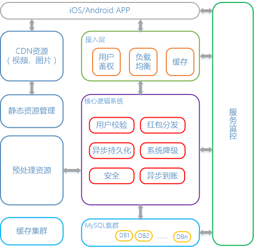
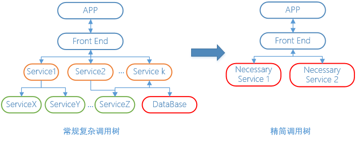
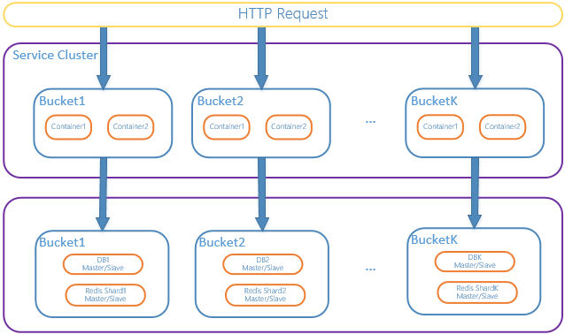

# 如何设计一个小而美的秒杀系统？
恰当的方案使你的应用更加强大

**标签:** Web 开发

[原文链接](https://developer.ibm.com/zh/articles/wa-design-small-and-good-kill-system/)

刘鹏

发布: 2017-06-21

* * *

## 概览

现如今，春节抢红包的活动已经逐渐变成大家过年的新风俗。亲朋好友的相互馈赠，微信、微博、支付宝等各大平台种类繁多的红包让大家收到手软。鸡年春节，公司的老总们也想给 15 万的全国员工发福利，于是我们构建了一套旨在支撑 10 万每秒请求峰值的抢红包系统。经实践证明，春节期间我们成功的为所有的小伙伴提供了高可靠的服务，红包总发放量近百万，抢红包的峰值流量达到 3 万/秒，最快的一轮抢红包活动 3 秒钟所有红包全部抢完，系统运行零故障。

## 红包系统面临的挑战

红包系统，类似于电商平台的秒杀系统，本质上都是在一个很短的时间内面对巨大的请求流量，将有限的库存商品分发出去，并完成交易操作。比如 12306 抢票，库存的火车票是有限的，但瞬时的流量非常大，且都是在请求相同的资源，这里面数据库的并发读写冲突以及资源的锁请求冲突非常严重。现在，我们将分析实现这样一个红包系统，需要面临如下的一些挑战：

首先，到活动整点时刻，我们有 15 万员工同时涌入系统抢某轮红包，瞬间的流量是很大的，而目前我们整个链路上的系统和服务基础设施，都没有承受过如此高的吞吐量，要在短时间内实现业务需求，在技术上的风险较大。

其次，公司是第一次开展这样的活动，我们很难预知大家参与活动的情况，极端情况下可能会出现某轮红包没抢完，需要合并到下轮接着发放。这就要求系统有一个动态的红包发放策略和预算控制，其中涉及到的动态计算会是个较大的问题（这也是为系统高吞吐服务），实际的系统实现中我们采用了一些预处理机制。

最后，这个系统是为了春节的庆祝活动而研发的定制系统，且只上线运行一次，这意味着我们无法积累经验去对服务做持续的优化。并且相关的配套环境没有经过实际运行检验，缺少参考指标，系统的薄弱环节发现的难度大。所以必须要追求设计至简，尽量减少对环境的依赖（数据路径越长，出问题的环节越多），并且实现高可伸缩性，需要尽一切努力保证可靠性，即使有某环节失误，系统依然能够保障核心的用户体验正常。

能负责有技术挑战的项目，对于工程师来说总是压力和兴趣并存的。接手项目后一个月的时间内我们完成了技术调研，原型设计研发，线上运维等工作。关于这个过程中的细节，下面为读者一一道来。

## 系统设计

系统架构图如图 1 所示。整个系统的主干采用主流的 Web 后台设计结构，子系统各自部署为集群模式并且独立。APP 客户端与网关接入层（负责用户鉴权、流量负载均衡、整合数据缓存等）进行交互，再往后是核心的逻辑系统（用户资格校验、红包分发、数据异步持久化、异步财务到账、降级等），数据持久化采用的 MySQL 集群。除此之外还有静态资源的管理（红包页面图片、视频等资源的访问优化）以及配套的服务整体运行监控。所有的静态资源提前部署在了第三方的 CDN 服务上。为了保障整体系统可靠性，我们做了包括数据预处理、水平分库、多级缓存、精简 RPC 调用、过载保护等多项设计优化，并且在原生容器、MySQL 等服务基础设施上针对特殊的业务场景做了优化。

##### 图 1\. 系统架构

红包本身的信息通过预处理资源接口获取。运行中用户和红包的映射关系动态生成。底层使用内部开发的 DB 中间件在 MySQL 数据库集群上做红包发放结果持久化，以供异步支付红包金额到用户账户使用。整个系统的绝大部分模块都有性能和保活监控。

## 优化方案

优化方案中最重要的目标是保障关键流程在应对大量请求时能稳定运行，做到这一点，需要很高的系统可用性。因此，业务流程和数据流程要尽量精简，减少容易出错的环节。此外，cache、DB、网络、容器环境，任何一个部分都有可能会出现短时故障，我们需要提前做处理预案。针对以上的目标难点，我们总结了如下的实践经验。

### 数据预处理

我们结合活动预案要求，将红包本身的属性信息（金额，状态，祝福语，发放策略），使用一定的算法提前生成好所有的信息，这些数据所占空间不是很大。为了最大化提升性能，我们事先将这些红包数据，我们事先存储在数据库中，然后在容器加载服务启动时，直接加载到本地缓存中当作只读数据。另外，我们将员工信息也做了一定的裁剪，最基本的信息也和红包数据一样，预先生成，服务启动时加载。

此外，我们的活动页面，有很多视频和图片资源，如果这么多的用户从网关实时访问，带宽很可能直接就被这些大流量的请求占满了，用户体验可想而知。最后这些静态资源，我们都部署在了 CDN 上，通过数据预热的方式加速客户端的访问速度，网关的流量主要是来自于抢红包期间的小数据请求。

### 精简 RPC 调用

服务请求流程通常是在接入层访问用户中心进行用户鉴权，然后转发请求到后端服务，后端服务根据业务逻辑调用其他上游服务，并且查询数据库资源，再更新服务/数据库的数据。每一次 RPC 调用都会有额外的开销，所以，比如上面一点所说的预加载，使得每个节点在系统运行期间都有全量的查询数据可在本地访问。抢红包的核心流程就被简化为了生成红包和人的映射关系，以及发放红包的后续操作。再比如，我们采用了异步拉的方式进行红包发放到账，用户抢红包的请求不再经过发放这一步，只记录关系，性能得到进一步提升。 如图 2 所示。

##### 图 2\. 服务依赖精简示意图

实际上有些做法的可伸缩性是极强的。例如红包数据的预生成信息，在当时的场景下是能够作为本地内存缓存加速访问的。当红包数据量很大的时候，在每个服务节点上使用本地数据库、本地数据文件，甚至是本地 Redis/MC 缓存服务，都是可以保证空间足够的，并且还有额外的好处，越少的 RPC，服务抖动越少，我们只需要关注系统本身的健壮性即可，不需要考虑外部系统 QoS。

### 抢红包的并发请求处理

春节整点时刻，同一个红包会被成千上万的人同时请求，如何控制并发请求，确保红包会且仅会被一个用户抢到？

- 做法一：使用加锁操作先占有锁资源，再占有红包。

    可以使用分布式全局锁的方式（各种分布式锁组件或者数据库锁），先申请 lock 该红包资源且成功后再做后续操作。优点是不会出现脏数据问题，某一个时刻只有一个应用线程持有 lock，红包只会被至多一个用户抢到，数据一致性有保障。缺点是，所有请求同一时刻都在抢红包 A，下一个时刻又都在抢红包 B，并且只有一个抢成功，其他都失败，效率很低。

- 做法二：单独开发请求排队调度模块。

    排队模块接收用户的抢红包请求，以 FIFO 模式保存下来，调度模块负责 FIFO 队列的动态调度，一旦有空闲资源，便从队列头部把用户的访问请求取出后交给真正提供服务的模块处理。优点是，具有中心节点的统一资源管理，对系统的可控性强，可深度定制。缺点是，所有请求流量都会有中心节点参与，效率必然会比分布式无中心系统低，并且，中心节点也很容易成为整个系统的性能瓶颈。

- 做法三：巧用 Redis 特性，使其成为分布式序号生成器（我们最终采用的做法）。

    前文已经提到，红包系统所使用的红包数据都是预先生成好的，我们使用数字 ID 来标识，这个 ID 是全局唯一的，所有围绕红包的操作都使用这个 ID 作为数据的关联项。在实际的请求流量过来时，我们采用了”分组”处理流量的方式，如下图 3 所示。

    访问请求被负载均衡器分发到每个 Service Cluster 的分组 Bucket，一个分组 Bucket 包含若干台应用容器、独立的数据库和 Redis 节点。Redis 节点内存储的是这个分组可以分发的红包 ID 号段，利用 Redis 特性实现红包分发，各服务节点通过 Redis 原语获取当前 拆到的红包。这种做法的思路是，Redis 本身是单进程工作模型，来自分布式系统各个节点的操作请求天然的被 Redis Server 做了一个同步队列，只要每个请求执行的足够快，这个队列就不会引起阻塞及请求超时。而本例中我们使用了 DECR 原语，性能上是可以满足需求的。Redis 在这里相当于是充当一个分布式序号发生器的功能，分发红包 ID。

    此外，落地数据都持久化在独立的数据库中，相当于是做了水平分库。某个分组内处理的请求，只会访问分组内部的 Redis 和数据库，和其他分组隔离开。

整个处理流程核心的思想是， **分组的方式使得整个系统实现了高内聚，低耦合的原则，能将数据流量分而治之，提升了系统的可伸缩性，当面临更大流量的需求时，通过线性扩容的方法，即可应对。** 并且当单个节点出现故障时，影响面能够控制在单个分组内部，系统也就具有了较好的隔离性。

##### 图 3\. 系统部署逻辑视图

### 系统容量评估，借助数据优化，过载保护

由于是首次开展活动，我们缺乏实际的运营数据，一切都是摸着石头过河。所以从项目伊始，我们便强调对系统各个层次的预估，既包括了活动参与人数、每个 APP 界面上的功能点潜在的高峰流量值、后端请求的峰值、缓存系统请求峰值和数据库读写请求峰值等，还包括了整个业务流程和服务基础设施中潜在的薄弱环节。后者的难度更大因为很难量化。此前我们连超大流量的全链路性能压测工具都较缺乏，所以还是有很多实践的困难的。

在这里内心真诚的感谢开源社区的力量，在我们制定完系统的性能指标参考值后，借助如 wrk 等优秀的开源工具，我们在有限的资源里实现了对整个系统的端到端全链路压测。实测中，我们的核心接口在单个容器上可以达到 20,000 以上的 QPS，整个服务集群在 110,000 以上的 QPS 压力下依然能稳定工作。

正是一次次的全链路压测参考指标，帮助我们了解了性能的基准，并以此做了代码设计层面、容器层面、JVM 层面、MySQL 数据库层面、缓存集群层面的种种优化，极大的提升了系统的可用性。具体做法限于篇幅不在此赘述，有兴趣的读者欢迎交流。

此外，为了确保线上有超预估流量时系统稳定，我们做了过载保护。超过性能上限阈值的流量，系统会快速返回特定的页面结果，将此部分流量清理掉，保障已经接受的有效流量可以正常处理。

### 完善监控

系统在线上运行过程中，我们需要对运行情况实时获取信息，以便能够对出现的问题进行排查定位，及时采取措施。所以我们必须有一套有效的监控系统，能够帮我们观测到关键的指标。在实际的操作层面，我们主要关注了如下指标：

- 服务接口的性能指标

    借助系统的请求日志，观测服务接口的 QPS，接口的实时响应总时间。同时通过 HTTP 的状态码观测服务的语义层面的可用性。

- 系统健康度

    结合总的性能指标以及各个模块应用层的性能日志，包括模块接口返回耗时，和应用层日志的逻辑错误日志等，判断系统的健康度。

- 整体的网络状况

    尽量观测每个点到点之间的网络状态，包括应用服务器的网卡流量、Redis 节点、数据库节点的流量，以及入口带宽的占用情况。如果某条线路出现过高流量，便可及时采取扩容等措施缓解。

- 服务基础设施

    应用服务器的 CPU、Memory、磁盘 IO 状况，缓存节点和数据库的相应的数据，以及他们的连接数、连接时间、资源消耗检测数据，及时的去发现资源不足的预警信息。

对于关键的数据指标，在超过预估时制定的阈值时，还需要监控系统能够实时的通过手机和邮件实时通知的方式让相关人员知道。另外，我们在系统中还做了若干逻辑开关，当某些资源出现问题并且自动降级和过载保护模块失去效果时，我们可以根据状况直接人工介入，在服务不停机的前提下，手动触发逻辑开关改变系统逻辑，达到快速响应故障，让服务尽快恢复稳定的目的。

### 服务降级

当服务器压力剧增的时候，如果某些依赖的服务设施或者基础组件超出了工作负荷能力，发生了故障，这时候极其需要根据当前的业务运行情况对系统服务进行有策略的降级运行措施，使得核心的业务流程能够顺利进行，并且减轻服务器资源的压力，最好在压力减小后还能自动恢复升级到原工作机制。

我们在开发红包系统时，考虑到原有 IDC 机房的解决方案对于弹性扩容和流量带宽支持不太完美，选择了使用 AWS 的公有云作为服务基础环境。对于第三方的服务，缺少实践经验的把握，于是从开发到运维过程中，我们都保持了一种防御式的思考方式，包括数据库、缓存节点故障，以及应用服务环境的崩溃、网络抖动，我们都认为随时可能出问题，都需要对应的自动替换降级策略，严重时甚至可手动触发配置开关修改策略。当然，如果组件自身具有降级功能，可以给上层业务节约很多成本资源，要自己实现全部环节的降级能力的确是一件比较耗费资源的事情，这也是一个公司技术慢慢积累的过程。

## 结束语

以上就是我们整个系统研发运维的一些经验分享。对于这类瞬时大流量的秒杀系统而言，高可用是最大的优化目标，分而治之是核心的架构思想；防御式思维，假定任何环节都可能有弱点，能够提升系统的稳定性。另外，一定要加强监控，及时发现问题，解决问题。做好了如上几点，相信各位读者在应对类似问题时，也能更加全面的思考，少走一些弯路，做出更加优秀的系统。

这次春节红包活动，在资源有限的情况下成功抵抗超乎平常的流量峰值压力，对于技术而言是一次很大的挑战，也是一件快乐的事情，让我们从中积累了很多实践经验。未来我们将不断努力，希望能够将部分转化成较为通用的技术，沉淀为基础架构组件，去更好的推动业务成功。真诚希望本文的分享能够对大家的技术工作有所帮助。