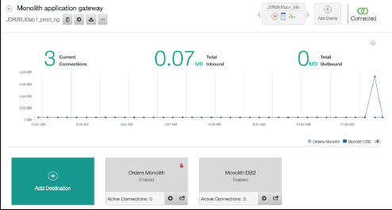
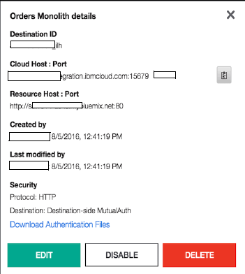
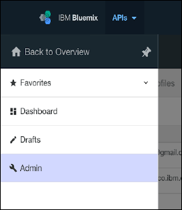
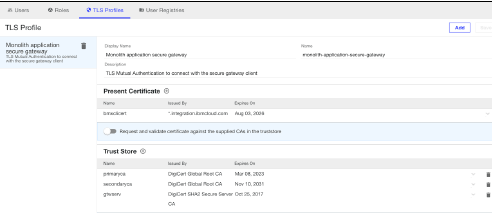
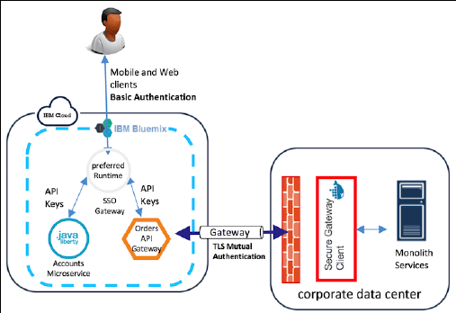

# 安全和治理
微服务架构的安全性和治理

**标签:** Java,云计算,微服务

[原文链接](https://developer.ibm.com/zh/articles/j-cn-java-and-microservice-7/)

IBM Developer

更新: 2017-03-21 \| 发布: 2017-03-28

* * *

在整体式架构中，由于运行应用程序的运行时环境相对隔离，所以治理和安全保护很简单。微服务架构具有典型的革新特征，给活动的治理和应用程序的安全威胁保护带来了更多挑战。

## 微服务架构中的安全性

微服务架构通过定义分布式特征来获得灵活性，系统中的服务能够以分散方式独立开发和部署。从安全角度讲，这种开放架构的一个缺陷是，系统现在更脆弱，因为攻击面增加了。开放的端口更多，API 是公开的，而且安全保护变得更复杂，因为需要在多个位置执行安全保护。本节将简要介绍在设计受微服务启发的系统时要考虑的一些安全方面。

### 身份验证和授权

身份验证和授权是两个核心流程，在尝试与 IT 系统交互时通常涉及这两个流程。这些核心流程可以确保系统面对攻击时的安全性：

- _身份验证_ 是确认系统项目干系人具有他们声明的身份的过程。在人类世界，项目干系人通常通过提供用户名和密码对来进行身份验证。有一些先进、复杂的机制可用来执行身份验证；这些机制可能包括生物特征身份验证、多因素身份验证等。被验证的对象（人或特定的子系统）通常被称为 _主体 。_
- _授权_ 机制用于确定允许一个主体在系统上执行哪些操作，或者主体可访问哪些资源。授权流程通常在身份验证流程后触发。通常，当主体通过身份验证后，会提供主体的信息来帮助确定该主体能够和不能执行哪些操作。

在整体式应用程序中，身份验证和授权简单而又普通，因为它们由应用程序实际处理；不需要拥有高级机制来提供更安全的用户体验。但是，在具有典型的分布式特征的微服务架构中，必须采用更高级的模式来避免提供凭证的服务调用之间的反复拦截。您希望一次可以验证主体的一个身份。这个身份简化了身份验证和授权流程，利用了自动化功能，并提高了可扩展性。

避免冗余地提供用户名和密码的一个著名解决方案是使用单点登录 (SSO) 方法。一些流行的 SSO 实现提供了这项功能。示例包括 OpenID Connect、SAML、OAuth2 等。每种实现适合一种特定的业务用例。表 1 对比了这些方法。

##### 表 1 对比 SAML、OpenID Connect 和 OAuth

考虑因素SAMLOpenID ConnectOAuth2身份验证是是伪身份验证授权是否是传输HTTP Redirect (GET)绑定、SAML SOAP 绑定、HTTP POST 绑定等HTTP Get, PostHTTP令牌格式XMLJSONJSON 或 SAML2安全隐患XML Signature Wrapping to impersonate any user网络钓鱼。 OAuth 2.0 不支持签名，加密，渠道绑定或客户端验证。 相反，它完全依赖于TLS保密。网络钓鱼。 OAuth 2.0 不支持签名，加密，渠道绑定或客户端验证。 相反，它完全依赖于TLS保密。最佳用途企业 SSO 难以采用移动平台SSO 为公众消费者应用API 授权

在微服务架构中应用 SSO 时，需要考虑的一种技术是创建一个 SSO 网关，并将它放在服务与身份提供者之间。然后，该网关可代为处理从系统传到外部和从外部传到系统的身份验证和授权流量。此技术可帮助避免每个微服务都需要与同一个身份提供者单独握手的情形，从而消除了冗余的流量。此技术的一个缺点是，与网关建立了额外的关联，这违背了微服务架构的演化原则。

### 服务间身份验证和授权

在为微服务架构建立安全策略时，可以考虑以下服务间身份验证和授权实践：

- 信任边界

一种选择可能是隐式地信任在一个已知、隔离的边界内的服务之间发出的所有调用。此技术初看起来像是不安全，因为存在受到典型中间人攻击的风险。但实际上，随着专为微服务设计的成熟工具和技术的出现，此技术变得更加合理。

您可以使用容器化技术（比如 Docker）来降低风险。Docker 提供的许多功能使开发人员能在不同层面灵活地、最大限度地提高微服务和整个应用程序的安全性。在构建服务代码时，开发人员可以自由使用渗透测试工具，对构建周期的任何部分执行压力测试。因为构建 Docker 镜像的源代码已在 Docker 分布组件（Docker 和 Docker Compose 文件）中明确地以声明形式进行了描述，所以开发人员可以轻松地处理镜像供应链，并在需要时执行安全策略。此外，能够通过将服务放入 Docker 容器中来轻松加固服务，使它们不可变，从而给服务增添强大的安全保障。

通过采用软件定义基础架构，可以使用脚本语言快速创建和配置私有网络，而且可以在网络级别上执行强大的安全策略。来自 HashiCorp 的 Terraform® 是脚本语言的一个良好示例，该语言可帮助您从虚拟机、网络等不同层级快速创建整个基础架构。

- 利用 SSO

如果您已经使用 SSO 模式作为 IT 系统的身份验证和授权模式，那么此过程会很简单。可将 SSO 用于微服务架构中的服务之间的内部交互。此方法可使用现有的基础架构，也可简化对服务的访问控制，将所有访问控制操作都集中在一个企业访问目录服务器中。

- 基于 HTTP 的哈希运算消息验证码 (HMAC)

一种常用的服务间身份验证模式是基于 HTTP 的基本身份验证。它之所以得到普遍使用，是因为它非常简单、是轻量的且成本很低。但是，它的一个缺点是，如果将它与简单的 HTTP 结合使用，则存在着凭证被轻松”嗅探”的风险。通过在服务间的每次交互中使用 HTTPS，可以减轻这些风险。但是，仅使用 HTTPS 的方法会增添大量的流量和证书管理开销。HMAC 可能是用来取代基本身份验证的候选方案。

在 HMAC 中，请求内容与一个私钥一起执行哈希运算，将得到的哈希值与请求一起发送。然后，通信的另一端使用它的私钥副本和收到的请求内容来重新创建哈希值。如果哈希值匹配，则允许请求通过。如果请求已被篡改，则哈希值不匹配，另一端就会知道并做出适当的反应。

- 使用特殊用途服务管理密钥

要消除微服务架构等分布式模型中的凭证管理开销，并从所构建系统的高安全性中获益，一种选择是使用一个综合性密钥管理工具。此工具允许存储、动态地租用、更新和撤销密钥（例如密码、API 密钥和证书）。由于微服务中规定的自动化原则，这些操作在微服务中非常重要。市场中已有一些项目拥有这个领域的功能；Vault（来自 HashiCorp）或 Keywhiz（来自 Square）是两个例子。

- 混淆代理问题

当一个服务（客户端）尝试调用另一个服务（服务器）时，在完成身份验证后，客户端开始在请求后从服务器收到信息。但是，为了满足来自客户端的请求，服务器通常需要与其他下游服务建立其他连接，以获取服务器没有的其他信息。在这种情况下，服务器会代表客户端尝试访问下游服务的信息。如果下游服务允许访问不允许客户端拥有的信息，这就称为 _混淆代理问题_ 。

您需要了解这种情况，并拥有克服混淆代理问题的对策。一个解决方案可能是安全地分发一个综合令牌，该令牌可以帮助识别客户端，又可以用它来进一步了解客户端有权访问哪些资源，并接受流量开销。

### 数据安全

数据被视为 IT 系统中最重要的资产，尤其是敏感数据。各种各样的机制可用于保护安全信息。

但是，无论选择哪种方法，一定要考虑以下一般性的数据安全准则：

- 使用著名的数据加密机制

尽管从理论上讲，不存在无法攻破的数据加密方法，但仍然存在一些成熟的、经过检验的、常用的机制（比如 AES-128 或 AES-256 等）。在进行安全考虑时使用这些机制，而不是在内部创建自己的方法。另外，及时更新和修补用于实现这些机制的库。

- 使用一个综合性工具来管理密钥

如果您的密钥未得到妥善管理，您为数据加密投入的所有努力都会白费。首要做法是不将密钥和数据存储在同一个位置。另外，不要让密钥管理复杂性违背微服务架构的灵活性原则。尝试使用具有微服务设计思路的综合性工具，这种工具不会破坏您的连续集成和连续交付管道。来自 HashiCorp 的 Vault 或 Amazon Key Management Service 是”微服务友好的”密钥管理工具的例子。

- 针对业务需求来调整安全策略

安全性是有代价的。不要加密所有数据，仅将精力放在最宝贵或最敏感的数据上。根据业务需求来制定安全策略，并不断调整策略，因为战略目标可能不断改变，解决方案中包含的技术也是如此。

### 深度防御

因为没有哪种解决方案能同时解决所有安全问题，所以提高微服务架构安全性的最佳方法是结合使用所有成熟的技术。更重要的是，将它们应用于架构的不同层级。

除了身份验证、授权和数据安全之外，还可以考虑以下技术来提供进一步保护：

- 设置防火墙

防火墙常用于对外监视，阻止对系统的不良意图的尝试。如果使用得当，防火墙可过滤掉大量恶意攻击，最大限度减少要在系统内的下游层级上完成的工作。防火墙还可以放在不同层级上。一种常用的模式是在系统边缘设置一个防火墙，然后在每个主机本地设置一个防火墙。考虑到每个主机一个服务的模型的快速普及，这可能成为微服务的运行时环境。您可以进一步定义一些 IP 表规则，以便仅允许已知 IP 范围的用户访问主机。借助防火墙，您可以执行一些安全措施，比如访问控制、速率限制、HTTPS 终止等。

- 网络隔离

微服务架构的分布式特性带来了一些安全挑战。但是，每个服务的细粒度和高度针对性的特征意味着，您可以轻松地将微服务放在网络中的不同隔离网段中，从而控制它们之间的交互。通过采用云技术和软件定义基础架构，网络隔离想法更容易实现，因为可以轻松地脚本化和自动化该过程。OpenStack 技术拥有一个名为 Neutron 的综合性网络技术栈。此技术栈允许您快速配置虚拟私有网络，将虚拟服务器放在不同的子网中，可配置这些子网，以您想要的方式让它们进行交互。您可以在分开的私有网络上实施安全策略，使用新兴的工具（比如 Terraform）通过脚本来加强服务安全性。

- 容器化服务

一种在微服务构建过程中被广泛采用的领先实践是：采用不可变基础架构。要实现此目的，可利用 Docker 等技术来容器化您的服务。每个微服务都可以部署到一个单独的 Docker 容器中，从而在每个服务中详细地执行安全策略。这使得整个容器不可变，就像创建了一个加固的只读部署单元一样。可以将特定服务部署的每个基本映像放入扫描过程中，以便在较低的级别上保证服务的运行时环境的安全。

## 微服务架构中的治理

一般而言，治理活动指的是规定微服务架构中的服务如何协同实现构建系统的战略目标，并付诸于行动。基于微服务的系统中缺乏对服务的严谨治理，这使得微服务计划很快偏离了正确方向。软件开发中的两种常用治理方法是：

- 设计时治理：根据一组通用的策略和标准来定义和控制软件组件的创建，包括组件的 设计和实现
- 运行时治理：在运行时的执行过程中实施组件策略

在微服务架构中，服务是独立构建和部署的。它们是高度解耦的服务，可能是使用各种不同的技术和平台构建的。因此，从理论上讲，不必为服务设计和开发定义一种通用标准，因为每个服务能够以不同方式构建，只要它能履行自己的专门职责。微服务架构意味着只能使用去中心化的运行时治理功能。服务必须与它们负责的业务能力明确一致；服务不得尝试执行其上下文边界外的操作。否则，会让服务位于一个紧密耦合的架构中，导致交付熵值 (delivery entropy) 混乱和内聚混乱 (cohesion chaos)。

微服务架构的运行时治理中的一些常用概念可能是监视、服务发现、通用安全要求等。

## 案例分析

[第 6部分小节”实际示例：创建新微服务”](https://www.ibm.com/developerworks/cn/java/j-cn-java-and-microservice-6/index.html) 中已创建新的 Search Catalog 和演化后的 Accounts 微服务。现在，您可以执行其他更改，以便在一个安全环境中将整体式 Orders 系统与新微服务集成。

在整体式应用程序示例中，身份验证流程是使用基本身份验证方法来完成的，也就是说，将凭证与关系数据库中存储的用户名和密码进行比较验证。执行身份验证后，用户能看到应用程序的所有选项。

我们来回顾一下，以下是该系统的 3 个主要部分，它们分别被描述为所拥有的数据类型、允许（不允许）谁查看该数据，以及如何保护该数据：

- Catalog Search 微服务

Catalog Search 微服务拥有产品的所有信息。此信息可供任何人查看，所以 API 不需要身份验证。用户无需登录即可查看该目录；该目录也是在 HTTP 中公开的，以便允许缓存信息来加快交互速度。因此，对于这个微服务，没必要执行更改。在未来，您可能会使用 API 管理解决方案，根据一种受控且安全的策略来向其他公司公开 Catalog API。

- Accounts 微服务

这个微服务拥有客户的所有信息，此信息是每个客户私有的。对于此微服务，必须保护信息，以保证只有经过验证的用户能看到和更新他们自己的信息。

- Orders 整体式系统

Orders 整体式系统必须与其他微服务集成。您必须确保只有经过验证的用户才能创建和查看他们的订单，而且不允许创建或查看其他用户的订单。

基于这个回顾，可以看到您必须保护两个组件。为此，创建一个 SSO 网关，使用整体式应用程序中使用的身份验证方法来验证用户；配置 Accounts 和 Orders 微服务，以便只允许使用来自此单点登录帐户的调用。首先，在可以使用此 SSO 网关安全地连接的云环境中内，将整体式应用程序的 Orders 方法公开为 API。为此，使用创建的同一个 Secure Gateway 来连接整体式系统的 DB2 和 IBM Cloud 中的 _API Connect_ 服务。

### 集成和保护整体式系统

要集成整体式应用程序的服务，需要建立一条从 IBM Cloud 到企业内部数据中心的安全连接，然后创建一个 API 网关，在 IBM Cloud 内安全地提供服务。

#### 连接到整体式应用程序的服务

在”企业内部数据库连接”中，您在 IBM Cloud 中创建了一个 Secure Gateway 服务，并配置了一个与 DB2 数据库具有安全连接的目标。现在，可以执行以下步骤，配置另一个目标来连接到整体式 Orders 应用程序所公开的 REST 服务：

1. 使用您的 IBM id 登录到 [IBM Cloud](http://www.bluemix.net) 。
2. 创建一个新目标：

    A.在 IBM Cloud 控制台中，单击您的 **Secure Gateway** 服务转到仪表板。

    B.在 Secure Gateway 仪表板中，单击创建来连接企业内部数据中心的网关（参见” [企业内部数据库连接](https://www.ibm.com/developerworks/cn/java/j-cn-java-and-microservice-6/index.html)“）。

    C.单击 **Add Destination** 。

    D.Add Destination Wizard 中，选择 **On-Premises** 并单击 **Next** 。

    E.输入您想连接的资源的主机名（或 IP 地址）和端口，在本例中为整体式应用程序部署到的应用服务器的本地 IP 地址或主机名。

    F.选择 **HTTPS** 或 **HTTP** 作为连接服务的协议。单击 **Next** 。

    G.选择 **Mutual Auth** 作为身份验证方法，并为证书选择 **Auto-generate** 选项。单击 **Next** 。

    此选项可确保在连接的客户端与 Secure Gateway 客户端之间执行安全身份验证。借助此选项，您可以控制哪些客户端可连接后端服务，方法是向它们提s供使用传输层安全 (TLS) 相互身份验证所生成的证书。

    H.将 IP 表规则留空。单击 **Next** 。

    在此选项中，还可以创建规则来仅允许来自已知 IP 地址的连接，例如来自开发和质量保证团队的 IP 地址。在这种情况下，还必须配置第 g 步中生成的证书。

    I.输入您想为目标使用的名称，在本例中为 **Orders Monolith** ，然后单击 **Finish** 。

    图 1 中显示了该整体式应用程序的网关窗口。 _Orders Monolith_ 目标显示了一个较小的红色手形图标（位于磁贴右上角），表明访问被访问控制表阻止。

    图 1.包含数据库和服务目标的 Secure Gateway 仪表板

    

    J. Orders Monolith 目标窗口（如图 2 所示）显示了用于连接企业内部的 REST 服务的云主机和端口。单击 **Download Authentication Files** （证书）并将它们保存到本地文件夹中。

    图 2\. 后端服务目标信息

    

    K.在网关客户端控制台中输入以下命令来配置访问控制表 (ACL)，以便允许流量进入企业内部数据库：


    ```
    acl allow <services ip address or hostname>:<port>

    ```


    Show moreShow more icon

    对于此示例，使用的命令为：


    ```
    acl allow orders.xxxx.net:80

    ```


    Show moreShow more icon

3. 创建一个 _密钥库_ 和 _信任库_ 来使用生成的证书：

    A. 打开一个 SSH 或 Telnet 客户端。

    B. 要为客户端创建密钥库，可在所下载证书的解压目录中输入以下命令：


    ```
    openssl pkcs12 -export -out "sg_key.p12" -in JDR26UI0ab1_iIh_destCert.pem
    -inkey JDR26UI0ab1_iIh_destKey.pem -password pass:"<a password>" -name
    BmxCliCert -noiter

    ```


    Show moreShow more icon

    现在您已拥有密钥库 sg\_key.p12，可以使用它执行相互身份验证。

    C. 要创建一个包含所有服务器和 CA 证书的信任库，可在所下载证书的解压目录中发出以下命令：


    ```
    keytool -import -alias PrimaryCA -file DigiCertCA2.pem -storepass password
    -keystore sg_trust.jks
    (answer 'yes' to trust it)
    keytool -import -alias SecondaryCA -file DigiCertTrustedRoot.pem -storepass
    password -keystore sg_trust.jks
    keytool -import -alias GtwServ -file secureGatewayCert.pem -storepass
    password -keystore sg_trust.jks
    keytool -importkeystore -srckeystore sg_trust.jks -srcstoretype JKS
    -deststoretype PKCS12 -destkeystore key_trust_store.p12
    (enter a password for the trustore, repeat the password and leave empty the
    source password)

    ```


    Show moreShow more icon

    现在您拥有 sg\_trust.jks 和 key\_trust\_store.p12 文件，可使用它们执行相互身份验证。


#### 在云环境中将整体式服务公开为 API

在”连接整体式应用程序的服务”中，您在 IBM Cloud 与企业内部的整体式应用程序的服务之间建立了安全连接。现在可以使用 API Connect IBM Cloud 服务将后端服务公开为 API，以便在您的 IBM Cloud 空间内轻松使用它。

1. 使用您的 IBM id 登录到 [IBM Cloud](http://www.bluemix.net) 。
2. 创建 API Connect 服务：

    a. 转到 IBM Cloud 目录。

    b. 在 _APIs_ 类别中选择 **API Connect service** 。

    c. 单击 **Create** 。

3. 配置一个 TLS 配置文件，以便向 Secure Gateway 客户端执行身份验证：

    a. 在 API Connect 仪表板中，单击左上角的 **Navigation to** 图标，然后单击 **Admin** （图 3）。

    图 3\. API Connect 上的 Navigation To 图标

    

    b. 单击顶部菜单中的 **TLS Profiles** ，然后单击 **Add** 。

    c. 输入您的 TLS 配置文件的名称和描述。

    d. 单击仪表板右上角的 **Save** 选项保存该配置文件。

    e. 单击 **Present Certificate** 选项旁边的加号 (+)。

    f. 单击 **Select File** 并搜索第 b 步中生成的 sg\_key.p12 文件。

    g. 输入您在创建 sg\_key.p12 文件时配置的密码（第 b 步）。

    h. 单击 **Upload** 。

    i. 通过将 **Request and validate the certificate against the supplied CAs in the truststore** 滑块滑动到 **On** 位置，验证该证书。

    j.单击 **Save** 。

    k.单击 **Trust Store** 选项旁边的加号 (+)。

    l.单击 **Select File** 并搜索第 c 步中生成的 key\_trust\_store.p12 文件。

    m. 输入您在创建 key\_trust\_store.p12 文件时提供的密码。

    n. 单击 **Upload** 。

    您的 TLS 配置文件现在类似于图 4 中的配置文件。

    图 4\. API Connect 的 TLS 配置文件配置

    

4. 使用启用了相互身份验证的 Secure Gateway 云主机创建整体式服务 API：

    a. 转到 API Connect 仪表板。

    b. 在 API Connect 仪表板中，单击左上角的 **Navigation to** 图标，然后单击 **Drafts** 。

    c. 单击 **APIs** 。

    d. 单击 **Add** → **New API** 。

    e. 输入 API 标题，选择 **Add to a new product** ，输入新产品标题，然后单击 **Add** 。

    f. 在 Design API 选项中，输入联系人、条款和许可，以及外部文档等一般信息。

    g. 在 Schemes 字段中，选择 **HTTP** 。

    h. 在 Host 字段中，输入 Secure Gateway 所提供的云主机:端口。

    i. 输入整体式服务的基础路径。在此示例中，该路径为：/CustomerOrderServicesWeb/jaxrs/

    j.选择服务返回的数据类型，在本例中为 **application/json** 。

    k.在 Security Definitions 选项中，保持 clientID (API Key) 选项不变。

    l.在 Security 中，选择选项 **1 clientID (API Key)** 。

    m. 在 Paths 选项中，输入服务路径（在本例中为 /customer/openorder），然后单击 **add** 操作并选择 **POST** 。

    n. 对于 Parameters 选项，选择您想发送到您的服务的信息，在本例中为以下信息：


**ID**要创建的订单的 ID**Date**订单日期**Line Item**包含要加入订单的产品的 JSON 对象**Total**产品价格

o. 返回到 API 仪表板并选择 **Drafts and the products** 。

p. 选择第 e 步中创建的产品。

q.选择您想要对此 API 使用的选项，在本例中为以下信息：

**Visibility**Authenticated users**Subscribable by**Authenticated users

r.单击窗口右上角的 **Stage** ，然后选择您希望将 API 发布到的目录。

s. 在 Products 选项卡上，单击临时存储产品右侧的 3 个点，然后单击 **Publish。** 在 Edit visibility 中，为两个选项都选择 **Authenticated Users** ，然后单击 **Publish** 。

t. 在 API Connect 仪表板上，选择临时存储 API 的目录，单击 **Developers** 选项卡，然后单击 **Add IBM Cloud Organization** 。

u. 输入使用此目录中公开的 API 的用户的电子邮箱。

v. 单击 API Connect 发送的电子邮件中的链接，以接受使用该 API 的邀请。

w. 选择您想在哪个组织中使用该 API。

现在，您可通过这个私有 API 来使用您的整体式应用程序创建订单。

#### 创建 SSO 网关

现在您已与该整体式应用程序建立安全连接，并将它的 API 公开为 IBM Cloud Organization 内的私有服务。您可以创建 SSO 服务来验证用户，然后代表用户调用 Orders API 和 Account 微服务。

## 最终架构

图 5 给出了最终的应用程序架构。

#### 图 5 安全的架构



## 总结

本文围绕微服务架构的安全性和治理展开了讨论，并在文章最后有案例分析的介绍，希望对大家有所帮助。下一部分将是本系列的最后一部分，将探讨与转换为微服务有关的另一个主要问题：性能成本。好了，学习愉快，我们下次再见！

## 参考资源

- 本文转自红皮书： [Evolve the Monolith to Microservices with Java and Node](http://www.redbooks.ibm.com/redpieces/abstracts/sg248358.html?Open&pdfbookmark)