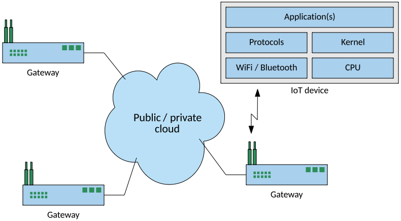
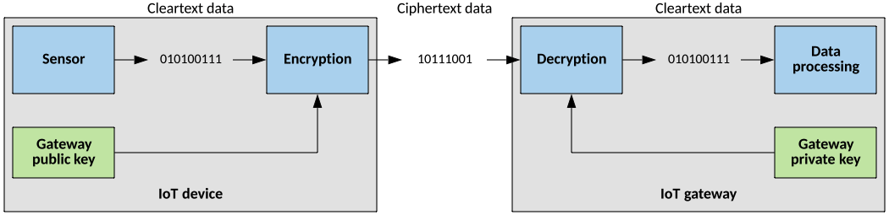

# 安全性与 IoT 生态系统
在设计阶段实现安全性

**标签:** IoT

[原文链接](https://developer.ibm.com/zh/articles/se-iot-security/)

M. Tim Jones

发布: 2018-04-25

* * *

人们倾向于将系统设计和开发中的安全性视为事后措施，但在整个产品生命周期中都应考虑安全性。一个攻击次数在不断激增的领域是快速发展的物联网 (IoT) 市场。本文将探索 IoT 背景中的一系列安全性，包括访问安全性（身份验证）、数据安全性（加密）和安全性分析（基于策略的控制）。

要从 IoT 角度了解安全性的范围，您需要了解 Shodan 搜索引擎。Shodan 专注于联网设备，使用户能够基于设备类型进行搜索，比如网络摄像头、智能电视、冰箱、数据采集与监视控制系统 (SCADA)、路由器或交通灯。用户可以将搜索细化到特定的国家或城市、某个设备上的操作系统或 Web 服务器，或者公开某个服务（比如 Minecraft 服务器）的端口。用户甚至可以基于缺少的配置来搜索设备（例如，通过使用默认密码）。安全研究人员以及那些具有更多邪恶意图的人也在使用 Shodan，它展示了 IoT 设备的自然状态。

据一项 [IHS Markit 调查](https://ihsmarkit.com/Info/1017/internet-of-things.html) 估计，目前有 800 亿个 IoT 设备 — 这一数字到 2030 年将增长到 1250 亿。IoT 的快速发展和它的安全状态说明了一个不断扩大的问题。

## IoT 生态系统

之所以将这种趋势称为 _物联网_ ，是因为它依赖于互联网连接性来收集和集中数据，以便将数据用于分析或向用户公开数据。但是，向设备引入互联网访问能力使得这些设备在许多不同层级上成为攻击目标。

一般而言，可以将 IoT 生态系统划分为 3 个层级（参见 [IoT 生态系统提供了多个攻击层级](#iot-生态系统提供了多个攻击层级) ）：

- 数据中心（公有或私有云）
- 网关（中间通信网关）
- 端点设备（分布式 IoT 设备）

##### 图1\. IoT 生态系统提供了多个攻击层级

顶层是数据中心，由一个公有或私有云（或由二者构建的混合云）表示。数据中心有两个用途：它可以是 IoT 设备控制的来源，也可以是从分散的 IoT 设备传入的数据的端点。在数据中心与 IoT 设备之间是中间通信网关（也称为 _边缘网络设备_ ）。这些网关可以是厂房里的设备，它们通过蓝牙或 WiFi 连接从分布式端点收集数据，然后将该数据传输到数据中心。

最后是 IoT 设备：可穿戴设备、车载计算机、分布式传感器、无线摄像头、气象站，以及组成不断变化的 IoT 宇宙的许多设备。您通常会在边缘设备与 IoT 设备之间发现一种共生关系，因为在 IoT 设备变得更加简单和数量倍增时，它们依靠边缘网关来执行更多的功能（比如数据压缩或安全功能）。

## 访问安全性

身份验证在 IoT 生态系统中发挥着许多作用。作为用户，在登录到一个系统时，您要向该系统进行身份验证。作为此过程的一部分，身份验证提供了访问控制，以确定您可以在目标系统上执行何种操作。诸如用户登录之类的身份验证方法基于一个共享密码 — 双方都知道的信息。此模型中有一个用户名和密码，您必须正确地提供二者，才能成功验证您自己。该流程类似于机器对机器 (M2M) 通信模型中的流程，其中一个 IoT 设备可以向一个网关执行身份验证并连接到它，以便传输数据或者更新固件或配置。

但是静态密码可能存在问题，不推荐将它用于生产系统（尽管它们普遍存在于诸如网络摄像头之类的用户系统中）。默认密码所导致的弱密码或配置缺少（如 Shodan 所演示的）代表一个真正的漏洞。最近，启用了网络的灯泡 LIFX 通过 WiFi [以明文形式广播用户名和密码](http://www.bbc.com/news/technology-28208905) ，这使它很容易被利用。

## 数据安全性

在两个实体相互进行身份验证时，它们可以交换信息（例如，IoT 网关将收集的数据传输到基于云的基础架构）。但是，通过网络以明文形式发送信息，意味着数据容易被窃听和收集。类似地，如果攻击者能访问 IoT 网关（无论是物理上还是通过网络），他们就可以破坏设备上的数据。

这些问题表明了对数据安全性的需求，无论是在通信期间（传输中），还是在设备内部的介质上（静止）。数据安全性通常是通过加密来执行的，这会将数据转换为一种只有通过密钥解锁才能阅读的格式。与访问安全性类似，用于加密数据的密钥是共享密码的另一种形式。如果密钥存储在需要加密和解密该数据的设备中，这个共享密码就存在缺陷。

数据安全性不是一个理论问题，没有保护其数据的 IoT 设备的示例有许多。Symantec 发现， [19% 的 IoT 设备在设备与基于云的后端应用程序之间使用未加密的网络进行通信](https://docs.broadcom.com/doc/insecurity-in-the-internet-of-things-en) 。（根据 [Open Web Application Security Project](https://wiki.owasp.org/index.php/Top_10_IoT_Vulnerabilities_(2014)）在 10 大 IoT 漏洞中，缺乏传输加密名列第四。

访问安全性和数据安全性的解决方案是公钥基础架构 (PKI)。

## 公钥基础架构

PKI 用于支持非对称密码学（也称为 _公钥密码学_ ）。在这个密码学系统中，有一对实现密码学功能的密钥（参见 [公钥密码学](#公钥密码学) ）。公钥不是密码，任何设备都可以用它来加密数据（在本例中为网关）。私钥是密码（仅为接收方所知），可用来解密数据。通过在通信之前加密数据，没人能窃听或使用密文数据（使用中间人攻击）。如果一个不法设备尝试将自己仿冒为 IoT 网关，它可以从 IoT 设备收到数据，但无法在没有私钥的情况下使用该数据。

### 公钥密码学

在设备中静态地配置密钥可能是一个管理问题（想想一个包含数百万台设备的大型 IoT 系统），但也会导致安全问题。这个问题介绍了管理密钥的必要性，因为密钥的构建和发布（和撤销）可以实现自动化。这就是 PKI 的由来。

PKI 具有许多种类，但总体上讲，PKI 通过一个证书颁发机构 (CA) 将公钥绑定到设备（比如 IoT 端点设备）。这种绑定有两个目的。首先（也是最明显的），它允许 IoT 设备加密数据，以便在诸如互联网之类的公有网络上传输数据时保护它。其次，绑定过程允许向 IoT 网关验证某个设备，只要（通过一个涉及 CA 的公钥的安全流程）将公钥绑定到特定设备。随着 IoT 规模的扩大，使用 PKI 有助于提高 IoT 系统的安全性，并限制管理其安全性所需的工作。

就功率和计算复杂性而言，密码学可能都是昂贵的。出于这个原因， [轻量级密码学标准应运而生](https://eprint.iacr.org/2017/511.pdf) ，以帮助保护低功耗、低带宽的设备。

## 安全性分析

2016 年 10 月，一场大规模的分布式拒绝服务攻击 (DDoS) 使美国东岸的大部分互联网陷入瘫痪。这次攻击的重点是域名系统 (DNS) 服务器，这些服务器将 Web 地址转换为 IP 地址（允许客户端连接它们）。这次 DDoS 攻击的独特之处在于，攻击的来源不是少量计算机，而是由 IoT 设备（比如 DVR、网络摄像头或 WiFi 路由器）组成的庞大的僵尸网络，所有这些设备都感染了一种称为 Mirai 的特定类型的恶意软件。一旦被感染，僵尸网络就会被激活来与 DNS 服务器进行通信，发送 SYN 包进行攻击，使尝试解析地址和网上冲浪的用户无法访问它们。

这种攻击不是一蹴而就的，全世界的设备都感染了 Mirai 恶意软件，加入了潜伏的僵尸网络大军。防范这种攻击需要深入了解 IoT 设备。例如，设备的行为是否与典型设备不同？设备是否表现出故障？它是否连接到可能未被授权的端点或接收来自这些端点的连接？监控大量 IoT 设备不是一项手动任务；因此，需要一些新的技术。

这时安全性分析就派上了用场。 _安全性分析_ 是对 IoT 生态系统（从 IoT 设备到网关，再到云）执行的一种多维分析。安全性分析必须是自动化的，在整个生态系统中精心编排，将人类干预减至最低。诸如 [IBM® Watson® IoT Platform](https://www.ibm.com/internet-of-things/solutions/iot-platform/watson-iot-platform) 之类的系统提供了一系列分析功能，它们以一种可扩展的方式结合了实时分析、机器学习和边缘分析，以保护 IoT 生态系统。

## IoT 安全性的未来

尽管存在缺陷，但 IoT 仍然生存了下来。事实上，它不仅生存了下来，还将变得更智能、更分散（从智能家居到智慧城市）。IoT 将在安全功能方面不断改进，但计算机安全性将在 IoT 的压力下发生改变。

IoT 将推动安全性发展的一个领域是区块链领域。区块链最广为人知的名称是”数字账本”，加密货币交易（表示为区块）通过它被添加到一个不断增长的链中。这些记录受到保护且不能修改，因为它们包含链中前一个区块的密码散列。在加密货币的背景下，这些记录表示交易。区块链不是单一的链，而是一个分布式、去中心化的系统，没有单点故障，且不能在事后修改。

此技术不仅在加密货币中很有用，还可用于记录一些事件，比如在 IoT 设备中收集的传感器数据（以防止恶意数据）。它也可以记录设备的历史数据，比如访问、固件升级和其他事务，以便检测尝试性访问或设备策略违规。要进一步了解此技术，请查阅 [解放区块链：IBM 区块链博客](https://www.ibm.com/blogs/blockchain/) 。

## 结束语

最初创建互联网是为了使用标准协议来连接远程计算机。但是，随着互联网的演变，它也在不断扩展，以将大量提供广泛功能的设备汇集在一起。这种大规模扩展带来了新的问题，并要求 IoT 生态系统中的设备将安全性作为一个关键设计元素，而不仅仅是事后措施。这些设备还需要基于分析进行主动管理，以确保它们继续正常运行。包括机器学习、区块链和轻量级密码学在内的未来技术，将有助于确保 IoT 设备不会被用作攻击我们的武器。