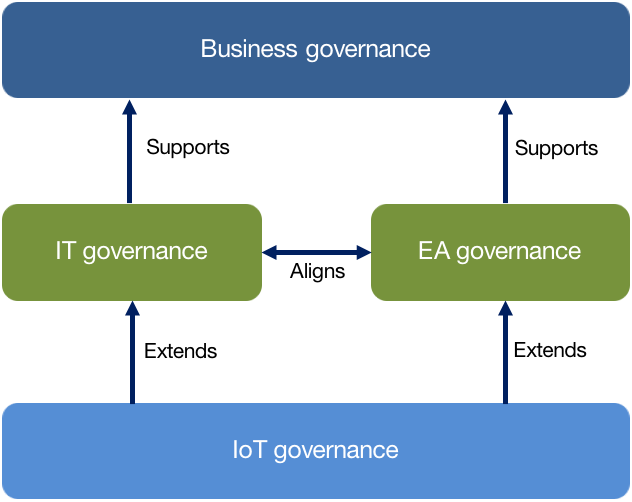
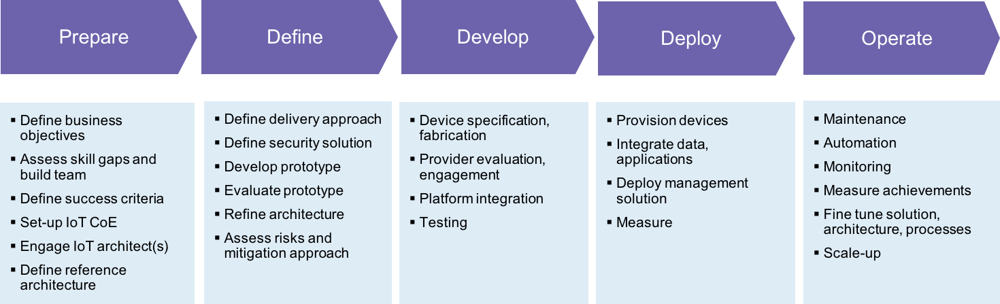
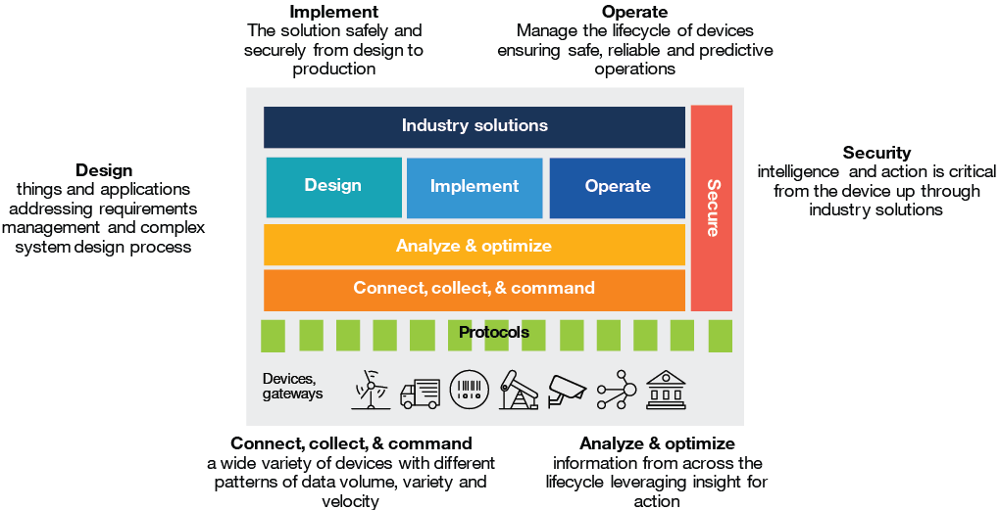
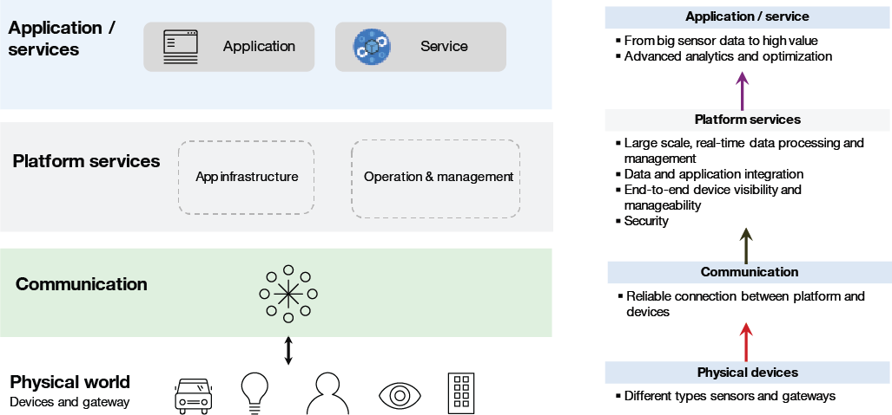
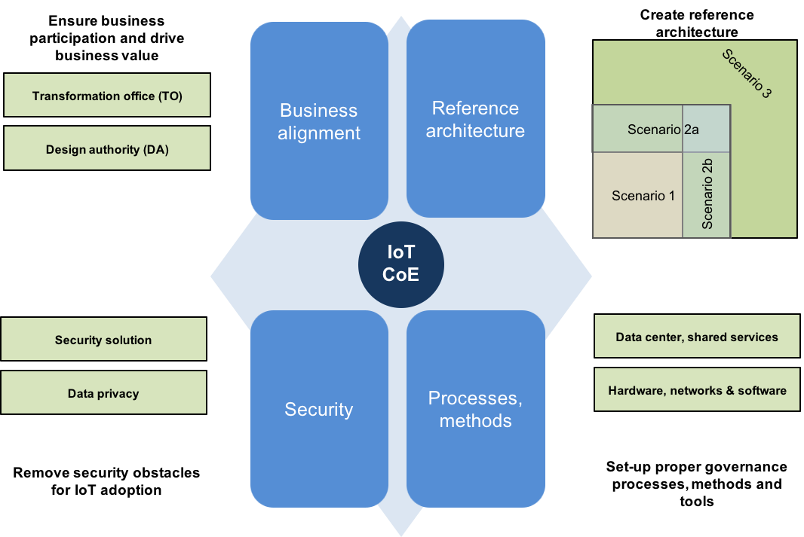
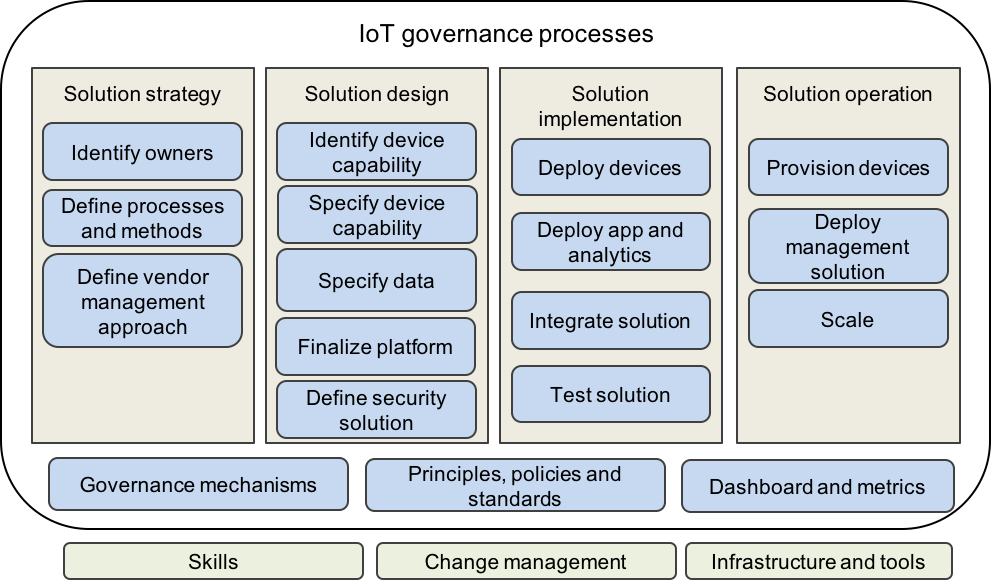

# 定义 IoT 治理实践
如何管理整个企业的 IoT 计划

**标签:** IoT,治理

[原文链接](https://developer.ibm.com/zh/articles/iot-governance-01/)

Amitranjan Gantait, Joy Patra, Ayan Mukherjee

发布: 2018-03-06

* * *

IoT 解决方案十分复杂。互联设备与 IT 服务集成为网络、通信、数据量、实时数据分析和安全带来了巨大的挑战。IoT 解决方案涉及许多不同的技术，需要复杂的开发周期，包括重要测试和持续监控。

为克服这些难题，IT 组织必须：

- 制定全面的技术战略来化繁为简
- 为 IoT 解决方案定义参考架构
- 培养设计、开发和部署该解决方案所需的技能
- 定义 IoT 治理流程和策略

IoT 解决方案治理模式应能够自如应对这些挑战。

可将 IoT 解决方案治理视为是将业务治理、IT 治理和企业架构 (EA) 治理应用于物联网（请参阅 [IoT 解决方案治理模式](#iot-解决方案治理模式)）。实际上，IoT 治理是对 IT 治理的扩展，其中 IoT 治理专门用来处理 IoT 设备生命周期、IoT 解决方案管理的数据和企业 IT 全景中的 IoT 应用程序。IoT 治理定义了在 IT 治理方面的变更，从而确保其分布式架构的概念和原理受到正确的管理，并且能够实现声明的业务目标。

##### IoT 解决方案治理模式

## 制定 IoT 技术战略

要实现成功的 IoT 互动，IT 组织就必须定义技术战略，包括开发参考架构、决定技术平台和制定设计，以及开发必要的流程来设计、开发和运作 IoT 解决方案。除非各团队制定了统一的 IoT 技术战略，否则整个企业内的各个团队将会自行定义方法，这通常会产生各种支离破碎的计划，致使企业付出更多成本，取得成功的可能性也微乎其微。

技术战略可包含阶段性的活动和明确定义的角色、职责与交付成果（请参阅 [IoT 技术战略的阶段、角色和交付成果](#iot-技术战略的阶段、角色和交付成果)）。

##### IoT 技术战略的阶段、角色和交付成果

技术战略必须记录并处理所有业务、技术和运营需求与约束。它还必须满足当前和将来的业务需求，并灵活适应业务和技术变更。

## 定义 IoT 参考架构

您可在以下 IBM Developer 文章中了解有关 IoT 架构规划的更多信息： [通过 IoT 架构简化 IoT 解决方案的开发](https://www.ibm.com/developerworks/cn/iot/library/iot-lp201-iot-architectures/index.html)。

为确保多个 IoT 项目之间的一致性，IoT 解决方案应采用可重复的框架，并开发标准参考架构，为单项 IoT 实施提供指导。每个项目都不得自行定义各自的设备集成方式或与 IoT 平台的通信方式。IoT 参考架构必须满足不同组织单位的需求，并定义可供所有 IoT 项目使用的技术标准。

IoT 参考架构提供了一组架构模式、标准和最佳实践，以供在开发 IoT 解决方案过程中使用。使用 IoT 参考架构中经核准的架构工件，可减少项目中设计活动的数量和复杂性，进而降低项目风险和成本。您企业的 IoT 参考架构可基于标准 IoT 参考架构或行业参考架构。

IoT 生态系统需要连接到各种类型的设备，并安全地收集和存储数据。完整的 IoT 解决方案需要包含生态系统的所有组件，包括完整解决方案的设备、网络、软件、服务和安全。您的 IoT 参考架构必须考量 IoT 生态系统的方方面面（请参阅 [IoT 生态系统](#iot-生态系统)）。

##### IoT 生态系统

数据是由设备 _生成_ 的，从这些数据中发掘的洞察则供用户或自动操作 _使用_。实时数据和近乎实时的分析支持及时采取行动。行业类型和数据性质推动了相应的成果以及参考架构的选择。

随着企业的 IoT 日趋成熟，他们从简单的资产监控升级为包含不同资产参数的优化和高级预测。而对设备产生的数据进行收集和存储只是初始步骤。通过添加更多分析和优化功能，可进一步提升 IoT 解决方案的价值。您的 IoT 参考架构必须足以应对这些更高级的功能。

最后，无论 IoT 解决方案多么出色，只有在安全性得到保障的前提下，拥有它才有价值。IoT 解决方案的各个层面都必须受到保护，避免出现漏洞和遭到潜在攻击。您的 IoT 参考架构可以帮助确保安全性并非只是“马后炮”。

当企业透彻了解了 IoT 解决方案生态系统（如 [IoT 生态系统](#iot-生态系统) 中所示）后，就可以创建详细的技术参考架构，为此生态系统提供支持。 [简单的 IoT 参考架构](#简单的-iot-参考架构) 显示了较为简单的 IoT 解决方案参考架构，供企业根据自身特定需求加以采用。您可以 [在 IBM Cloud 架构中心内查看更详细的 IoT 参考架构](https://www.ibm.com/cloud/garage/content/architecture/iotArchitecture/0_1/)。

##### 简单的 IoT 参考架构

IoT 参考架构需要考量 IoT 解决方案中的以下各方面，才能有效实施 IoT 治理策略：

- **应用程序层**

    - 以近乎实时的方式管理大量传感器数据的收集、处理、分析和持久存储
    - 支持极高的数据率，远高于一般 IT 基础架构
    - 实施预测分析功能
    - 应对安全难题，例如，数据安全、基于角色的数据访问和控制功能。要了解有关 IoT 安全的更多信息，请阅读以下 IBM Developer 系列：“ [保护 IoT 设备和网关](https://www.ibm.com/developerworks/cn/iot/library/iot-trs-secure-iot-solutions1/index.html)”。
- **平台层**

    - 提供传感器数据管理、应用程序集成和设备管理
    - 支持互联网规模的消息传递，包括数据收集、发布/订阅、数据仲裁、数据分派，当然还有安全管理
    - 应对安全难题。要了解有关 IoT 安全的更多信息，请阅读以下 IBM Developer 系列：“ [保护 IoT 设备和网关](https://www.ibm.com/developerworks/cn/iot/library/iot-trs-secure-iot-solutions1/index.html)”。
    - 要了解有关 IoT 平台以及为何应使用此类平台的更多信息，请阅读以下 IBM Developer 文章：“ [使用 IoT 平台简化 IoT 应用程序的开发](https://www.ibm.com/developerworks/cn/iot/library/iot-lp101-why-use-iot-platform/index.html)”。
- **通信层**

    - 提供可靠的网络来捕获和控制传感器数据
    - 支持以可靠的方式将数据从设备传输至 IoT 平台
    - 应对安全难题。要了解有关 IoT 安全的更多信息，请阅读以下 IBM Developer 系列：“ [保护 IoT 设备和网关](https://www.ibm.com/developerworks/cn/iot/library/iot-trs-secure-iot-solutions1/index.html)”。
    - 要了解有关 IoT 网络注意事项和挑战的更多信息，请阅读以下 IBM Developer 文章：“ [连接物联网中的所有事物](https://www.ibm.com/developerworks/cn/iot/library/iot-lp101-connectivity-network-protocols/index.html)”。
- **物理设备层**

    - 支持各种传感器、设备和网关
    - 支持远程监控和管理
    - 应对安全难题，例如，受保护的引导、固件升级、入侵检测和安全事件日志记录。要了解有关 IoT 安全的更多信息，请阅读以下 IBM Developer 系列：“ [保护 IoT 设备和网关](https://www.ibm.com/developerworks/cn/iot/library/iot-trs-secure-iot-solutions1/index.html)”。

## 在开发团队中设立合适的角色或具备相应的技能

当企业的技术战略和参考架构准备就绪后，企业必须为技术专员提供技术培训。企业需要在 IoT 解决方案的各个层面都具备充足的技能。

### IoT 开发团队中的 IoT 角色

IoT 开发团队的关键角色和职责包括：

- **IoT 架构设计师**，此角色与 IT 组织内的基础架构设计师和安全架构设计师密切协作。IoT 架构设计师负责定义端到端的 IoT 解决方案架构（基于所采用的 IoT 参考架构），制定所有关键的架构相关决策。IoT 架构设计师的关键职责之一是定义 IoT 平台战略，以及如何基于 IoT 平台集成所有解决方案组件。IoT 架构设计师还负责为 IoT 解决方案的开发、部署和管理确立标准和准则。
- **IoT 开发者** ，负责定义并实施数据收集、消息传递、应用程序和数据分析。
- **数据分析师** ，负责定义数据收集计划、数据模型、数据映射以及总体数据分析和报告战略。
- **IoT 测试员** ，负责执行总体解决方案测试，以及设备功能测试和安全测试。
- **设备主题专家 (SME)**，负责根据数据收集需求和 IoT 解决方案架构最终确定设备规格，同时还负责为 IoT 解决方案选择合适的设备。设备主题专家与 IoT 架构设计师和基础架构设计师协作，共同设置用于连接 IoT 设备的通信网络。在最终确定设备管理策略和原则（包括物理设备安全和网络设备安全）方面，设备主题专家也起到了至关重要的作用。
- **安全架构设计师**，负责支持 IoT 架构设计师定义端到端的安全解决方案。该角色应具备以下技能：

    - 分析数据、基础架构和应用程序安全需求
    - 就网络运行环境安全问题给出建议
    - 开发隐私解决方案和安全治理实践
    - 设计、规划和实施安全的编码实践和安全测试方法，执行安全测试，并进行安全审计
    - 测试和评估安全相关工具
    - 管理第三方供应商，确保这些供应商能够实现安全目标

### IoT 卓越运营中心 (CoE)

IoT 卓越运营中心 (CoE) 同样可作为企业 IT 部门内的关键组织，可使所有利益相关方都齐心协力地完成一个共同的目标。IoT CoE 的职能包括定义适当的设备生命周期管理流程、识别适合企业的适当技术，以及定义相应的策略、标准和准则来治理 IoT 解决方案（从业务需求到运营）。专门的 IoT 卓越运营中心 (CoE) 是企业为提高 IoT 实施成功几率可采取的最重要的附加措施之一。请参阅 [IoT CoE 的关注领域](#iot-coe-的关注领域)。

IoT 解决方案架构设计师在 IoT 解决方案的规划与治理方面扮演关键的角色，并且与业务架构设计师、企业架构设计师和安全架构设计师密切协作。所有 IoT 相关工作和活动都必须通过此 CoE 来传达，以便消除重复工作并加速实现投资回报。

##### IoT CoE 的关注领域

IoT CoE 为 IoT 解决方案的确立和采用提供全面的方法。若能在适当的级别进行实施，IoT CoE 将会减少通常阻碍 IoT 解决方案采用的政治问题和其他各类复杂事宜。IoT CoE 的职责包括：

- 为 IoT 注入活力，提供思想领导力
- 确立并使用 IoT 参考架构
- 促进采用最佳实践
- 规划设备投资组合，包括功能需求、选择条件、配置和生命周期管理
- 为设备供应商和 IoT 平台供应商管理制定相应的战略
- 建立治理模式，强制实施、监视和控制其采用情况
- 管理各利益相关方（包括业务部门和 IT 部门）之间的沟通情况
- 收获或复用先前 IoT 项目中的资产
- 提供专业的 IoT 技能和资源
- 提供工具支持
- 传授和培训技能
- 开展架构审查，确保符合 IoT 准则

## 定义 IoT 治理流程和策略

在任何治理模式中，流程和策略都可随时付诸实施。通过遵循、应用和实施这些活动，即可治理和管理所有 IoT 计划。

[IoT 治理模式的关键组件](#iot-治理模式的关键组件) 显示了 IoT 治理和管理模式的关键组件。

##### IoT 治理模式的关键组件

除了管理 IoT 解决方案开发之外，IoT 治理模式还定义了以下领域的相关准则、流程和标准：

- **设备投资组合管理**，可解决众多难题，包括设备生命周期融资、设备共享、激励和融资、IT 流程以及保持特定 IoT 目标状态所需的相应变更等等。
- **设备和平台供应商管理** 可帮助甄别和管理 IoT 解决方案所需的合适供应商。它还专注于建立合作伙伴战略，进而开发端到端的 IoT 解决方案，因为没有任何一个团队或一家供应商可以提供完整的 IoT 解决方案。IoT 的供应商管理非常重要，原因如下：

    - **IoT 解决方案的复杂性**。任何一个 IoT 项目都会涉及许多不同的技术和硬件/软件组件。
    - **特定领域的专业知识**。除技术功能之外，IoT 解决方案还需要特定领域的分析专业知识，从而为客户创造商业价值。技术和行业领域技能的结合，要求企业应与合适的团队和供应商建立合作关系，确保他们能够在适当的时机适当程度上参与进来。
    - **运营管理**，处理设备生命周期管理、设备监控、容量和性能、安全、变更管理以及设备登记等方面的事宜。这一领域负责处理运营和管理 IoT 环境所需的各种工具和基础架构变更。

## 结束语

许多企业都希望能够充分利用 IoT 解决方案所具有的各种优势。但是，如果不具备合适的治理模型，那么其中大部分计划都可能惨遭失败，抑或是无法实现预期的收益。IoT 治理模式需要制定适当的技术战略并开发相应的参考架构，从而在整个企业内的所有 IoT 计划中推行标准化和最佳实践。另外，IoT 治理模式还需要甄别具备相应技能的角色，并定义可精简所有此类计划的相关职责；理想情况下，应创立 IoT 卓越运营中心。最后，IoT 治理模式需要定义相应的治理流程和策略，全面管理整个 IoT 生命周期内的各项活动。安全和隐私问题是部署基于 IoT 的解决方案时遭遇的主要瓶颈之一，因此，在开发 IoT 治理流程时，必须牢记这些安全问题，而不要留到进入 IoT 解决方案流程后再来处理安全问题，此时已经为时已晚。

IoT 治理解决方案的重要功能之一就是管理设备生命周期，包括新设备注册、升级现有设备和淘汰旧设备或过时设备。用于管理 IoT 设备的各种标准层出不穷。本系列的第 2 部分将讨论设备管理的不同方法，并演示 IBM Watson IoT Platform 的设备管理功能。

由于数据是任何 IoT 解决方案的核心组件，因此在任何 IoT 治理模式中，治理整个数据生命周期都是至关重要的一环。IoT 数据治理涵盖了数据的完整生命周期，从设备生成数据开始，然后通过网络将数据发送至基于云的 IoT 平台，接着存储数据，最后分析数据并给出数据报告。任何 IoT 治理解决方案都需要解决隐私和安全问题，时刻牢记法规和其他合规要求。本系列的第 3 部分将着重介绍 IoT 数据治理。

本文翻译自： [Defining your IoT governance practices](https://developer.ibm.com/articles/iot-governance-01/)（2018-02-19）