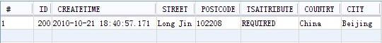
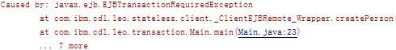
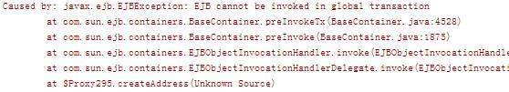

# 实例详解 EJB 中的六大事务传播属性
在Java EE 项目逻辑层的开发中以不变应万变

**标签:** Java

[原文链接](https://developer.ibm.com/zh/articles/j-lo-springejbtrans/)

王汉敏

发布: 2012-06-04

* * *

## 前言

事务 (Transaction) 是访问并可能更新数据库中各种数据项的一个程序执行单元 (unit)。在关系数据库中，一个事务可以是一条或一组 SQL 语句，甚至整个程序。它有通常被称为 ACID 的原子性（Atomicity）、一致性（Consistency）、隔离性（Isolation）、持续性（Durability）四大特性：

原子性（Atomicity）：一个事务是一个不可分割的工作单位，事务中包括的诸操作要么都做，要么都不做。

一致性（Consistency）：事务必须是使数据库从一个一致性状态变到另一个一致性状态。一致性与原子性是密切相关的。

隔离性（Isolation）：一个事务的执行不能被其他事务干扰。即一个事务内部的操作及使用的数据对并发的其他事务是隔离的，并发执行的各个事务之间不能互相干扰。

持久性（Durability）：持续性也称永久性（permanence），指一个事务一旦提交，它对数据库中数据的改变就应该是永久性的。接下来的其他操作或故障不应该对其有任何影响。

在 Java EE 的应用开发中，事务的应用是必不可少的，同时由于方法调用的原因，比如方法 A 调用方法 B 的时候。如果方法 A 在事务环境中运行，那么方法 B 是否也要在事务中运行呢，方法 B 是要和方法 A 在同一个事务中运行还是新开起一个事物呢？等等。要弄清楚这些问题，就要牵涉到事务传播属性的问题，EJB 中针对不同的的情况提供了下面六种不同的事物传播属性：

**Required** ：用该属性标注的方法或组件总是在事务中运行。如果客户端已经在事务中，则在原事务中运行；如果没有事务，则开启一个新事务，在其中运行。

**Requires\_New** ：方法或组件总是在新开启的事务中运行。如果客户端已经在事务中，则首先将原事务挂起，然后新开启一个事务，在其中运行，新事务结束之后，原来事务从挂起点继续执行；如果没有事务，则开启一个新事务，在其中运行。

**Supports** ：和 Required 属性的不同点是，在没有事务的环境中不会开启一个新事务；如果存在事务的话则加入其中运行，这点和 Reuqired 相同。

**Not\_Supported** ：如果事务已经存在的情况下，则原来的事务要挂起，然后调用标注该属性的方法或组件，调用结束之后，继续原来的事务；无事务环境中调用的时候，不开启新事务，这点和 Supports 相同。

**Mandatory** ：调用标注该属性的方法或组件的客户端，必须已经在事务中，如果不在事务中则会抛出异常；如果已经在事务中，则加入原来事务运行。和 Required 不同的是，该属性不会自动开启新的事务；

Never **：** 用 Never 属性标注的方法或组件，不能在事务中运行。如果调用该方法或组件的客户端已经在事务中，则抛出异常。

下面就实例详细介绍一下 EJB 中这六种不同的事务传播属性。

## 前期准备工作

首先，我们创建如下几个类，来作为我们后续中的实例。

##### 清单 1\. Address 实体 Bean

```
@Entity
public class Address implements Serializable {
    private static final long serialVersionUID = 1L;
    @Id
    @GeneratedValue(strategy = GenerationType.AUTO)
    private Long id;
    private String country;
    private String city;
    private String street;
    private String postCode;
    private String TsAttribute;
    @Temporal(javax.persistence.TemporalType.TIMESTAMP)
private Date createTime;
// Getters and Setters
}

```

Show moreShow more icon

我们在 Address 实体 Bean 中添加一些字段：

##### 清单 2\. Person 实体 Bean

```
@Entity
public class Person implements Serializable {
    private static final long serialVersionUID = 1L;
    @Id
    @GeneratedValue(strategy = GenerationType.AUTO)
    private Long id;
    private String firstName;
    private String lastName;
    private int age;
    private String TsAttribute;
     @Temporal(javax.persistence.TemporalType.TIMESTAMP)
private Date createTime;
// Getters and Setters
}

```

Show moreShow more icon

同样我们在 Person 实体 Bean 中添加一些字段：

##### 清单 3\. 无状态的 SessionBean CommonEJB

```
@Stateless
public class CommonEJB implements CommonEJBRemote {

    @PersistenceContext(unitName = "Transaction-ejbPU")
    EntityManager em;
    @Override
    public void createAddress() {

        Address address = new Address();
                   /*
                    *
                    * 对 address 对象
                    * 的属性进行赋值
                    *
                    */

        em.persist(address);

    }
}

```

Show moreShow more icon

我们在 CommonEJB 中创建了一个名为 createAddress() 的业务方法，使用这个方法来持久化 Address 实体 bean，因此我们也使用 @PersistenceContext 注入了相应的持久化单元，我们将会将 Address 持久化到这个持久化单元对应的数据库中。

##### 清单 4\. 无状态的 SessionBean ClientEJB

```
@Stateless
public class ClientEJB implements ClientEJBRemote {
    @EJB
    private CommonEJBRemote commonEJB;
    @PersistenceContext(unitName = "Transaction-ejbPU")
    EntityManager em;
    @Override
    public void createPerson() {
        Person person = new Person();

                    /*
                    *
                    * 对 person 对象
                    * 的属性进行赋值
                    *
                    */

        em.persist(person);
        commonEJB.createAddress();// 调用 CommonEJB 中的 createAddress 方法

    }
}

```

Show moreShow more icon

同样，我们在 ClientEJB 创建了一个名为 createPerson() 的业务方法，使用这个方法来持久化 Person 实体 bean。稍有不同的是我们不仅注入了相应的持久化单元，而且注入了 CommonEJB 到这个 EJB 中，并且在 createPerson() 方法中调用了 CommonEJB 中的业务方法。

好了现在，我们所有的准备工作都已完成下面我们开始逐一介绍这六大事务传播属性。

## 传播属性实例祥解

### Required

当一个方法的事务传播属性被设置成为”Required”的时候，说明该方法需要在事务的环境中运行。如果调用该方法的客户端不在事务中，这个时候，当该方法执行的时候就会开启一个新的事务；相反，如果调用该方法的方法已经运行在一个事务之中，那么该方法就会加入原来的事务运行。

下面举例说明一下

##### 清单 5\. 调用 ClientEJB 的 Main 函数

```
public class Main {
    @EJB
    private static ClientEJBRemote clientEJB;

    public static void main(String[] args) {

      clientEJB.createPerson();
    }
}

```

Show moreShow more icon

我们使用 NetBeans 中独有的技术来调用 EJB，这样的话我们就不需要手动使用 JNDI 了，直接使用依赖注入的技术，在 main() 方法中注入我们要调用的 EJB，这里我们调用的是名为 ClientEJB 的 EJB。根据自 Java EE 5 引入的”Configuration by Exception”的原则，确省情况下这个 EJB 使用的是”Required”这个事务传播属性，根据”Required”事务传播属性的要求，ClientEJB 被 main() 方法调用的时候会开启一个新的事务。

##### 清单 6.ClientEJB 持久化 Person 实体 Bean

```
@Stateless
public class ClientEJB implements ClientEJBRemote {
    @EJB
    private CommonEJBRemote commonEJB;
    @PersistenceContext(unitName = "Transaction-ejbPU")
    EntityManager em;
    @Override
    public void createPerson() {
        Person person = new Person();
        person.setId(100l);
        person.setFirstName("Leo");
        person.setLastName("Wang");
        person.setAge(88);
        person.setTsAttribute("Required");

        person.setCreateTime(new Date());
        em.persist(person);

        commonEJB.createAddress();

        System.out.println("----ClientEJB Excute completely!-------");
    }
}

```

Show moreShow more icon

在 ClientEJB 这个无状态 EJB 中的 createPerson() 业务方法中我们持久化了一个 Person 对象到数据库中。

##### 清单 7.CommonEJB 持久化 Address 实体 Bean

```
@Stateless
public class CommonEJB implements CommonEJBRemote {

    @PersistenceContext(unitName = "Transaction-ejbPU")
    EntityManager em;
    @Override
    @TransactionAttribute(TransactionAttributeType.REQUIRED)
    public void createAddress() {

        Address address = new Address();
        address.setId(200l);
        address.setCountry("China");
        address.setCity("Beijing");
        address.setStreet("Long Jin");
        address.setPostCode("102208");
        address.setTsAttribute("REQUIRED");
        address.setCreateTime(new Date());
        em.persist(address);

        System.out.println("------ClientEJB Excute completely!---------");
    }
}

```

Show moreShow more icon

在 CommonEJB 这个无状态 EJB 中的 createAddress () 业务方法中我们持久化了一个 Person 对象到数据库中。

TransactionAttribute 这个注解的定义如下：

##### 清单 8.TransactionAttribute 注解定义

```
@Target(value={METHOD,TYPE})
@Retention(value=RUNTIME)

```

Show moreShow more icon

从它的定义中可以看出，这个注解可以定义在类的层次上，也可以定义在方法上。如果两个层次同时定义的话，定义在方法上的属性会覆盖定义在类层次上的属性。EJB 中类层次上的和方法层次上的传播属性默认均为”Required”。

这里我们显示地将 CommonEJB 中的 CreateAddress() 方法的传播属性设置成了”Required”，虽然我们没有必要这么做，他确省就是”Required”。我们在 ClientEJB 中的 CreatePerson() 方法中调用了这个 CreateAddress() 方法，根据”Required”传播属性的定义，CreateAddress() 方法将会加入调用者 CreatePerson() 开启的事务当中，成为其中的一部分。下面是这个程序运行的结果

##### 图 1.GlassFish 控制台输出


图 1 显示两个方法均执正常行完毕，没有任何异常抛出。

##### 图 2\. 实体 Bean Person 对应的数据库表



CreatePerson() 方法正常执行完毕后，ID 为 200 的人被持久化到数据库中。

##### 图 3\. 实体 Bean Address 对应的数据库表


CreateAddress() 方法正常执行完毕后，ID 为 100 的地址被持久化到数据库中。

这就说明这两个方法均在事务的环境中进行了持久化的操作，且没有回滚。

下面我们使用依赖注入，将 SessionContext 注入到 ClientEJB，并在 createPerson() 中调用 setRollbackOnly() 将这个方法所在的事务设置成 Doomed 事务。Doomed 事务就是那些铁定要回滚的事务，无论他进行了什么操作，无论成功与否，都要回滚，这就是他的宿命。

##### 清单 9\. 客户端 createPerson() 回滚

```
@Stateless
public class ClientEJB implements ClientEJBRemote {
    @EJB
    private CommonEJBRemote commonEJB;
    @PersistenceContext(unitName = "Transaction-ejbPU")
    EntityManager em;
@Resource
    private SessionContext ctx;
    @Override

    public void createPerson() {
        Person person = new Person();
        person.setId(100l);
        person.setFirstName("Leo");
        person.setLastName("Wang");
        person.setAge(88);
        person.setHeight(170);
        person.setWeight(65);
        person.setCreateTime(new Date());
        em.persist(person);

        commonEJB.createAddress();

        ctx.setRollbackOnly();

        System.out.println("-----ClientEJB Excute completely!---------");
    }
}

```

Show moreShow more icon

这个时候 我们保持 CommonEJB 不变，然后执行这个程序。

使用同样的办法，我们将 ClientEJB 保持不变，将 CommonEJB 中的 createAddress() 方法所在的事务设置成 Doomed 事务，然后执行程序。

##### 清单 10\. 被调用者 createAddress() 回滚

```
@Stateless
public class CommonEJB implements CommonEJBRemote {

    @PersistenceContext(unitName = "Transaction-ejbPU")
EntityManager em;
@Resource
private SessionContext ctx;
    @Override
    @TransactionAttribute(TransactionAttributeType.REQUIRED)
    public void createAddress() {

        Address address = new Address();
        address.setId(200l);
        address.setCountry("China");
        address.setCity("Beijing");
        address.setStreet("Long Jin");
        address.setPostCode("102208");
        address.setCreateTime(new Date());
        em.persist(address);

ctx.setRollbackOnly();
        System.out.println("--------ClientEJB Excute completely!--------");
    }
}

```

Show moreShow more icon

上述两种情况，从控制台上我们均可以看出两个方法正确执行完毕，但是两个方法中数据均没有被持久化到数据库中，这就是说，他们所在的事务一起进行了回滚。出现这样的情况是因为，”Required”属性是加入原有事务，也就是说它们处于同一个事物当中，一方滚另一方也回滚。

### Requires\_New

当一个方法的事务传播属性被设置成为”Requires\_New”的时候。如果调用该方法的客户端不在事务中，这个时候，当该方法执行的时候就会开启一个新的事务；相反，如果调用该方法的方法已经运行在一个事务之中，那么该方法同样会开启一个新的事务，并在新事物中运行，而原来的事务则挂起，等待新开启的事情执行完毕之后再继续执行。

##### 清单 11 .Requires\_New 属性中 ClientEJB 客户端

```
@Stateless
public class ClientEJB implements ClientEJBRemote {
    @EJB
    private CommonEJBRemote commonEJB;
    @PersistenceContext(unitName = "Transaction-ejbPU")
    EntityManager em;
    @Override
    public void createPerson() {
        Person person = new Person();
        person.setId(88l);
        person.setFirstName("Tom");
        person.setLastName("Zhang");
        person.setAge(88);
        person.setTsAttribute("Required");

        person.setCreateTime(new Date());
        em.persist(person);
        commonEJB.createAddress();

        System.out.println("------ClientEJB Excute completely!---------");
    }
}

```

Show moreShow more icon

我们仍然保持 ClientEJB 的默认属性不变，而仅仅将 CommonEJB 中的 createAddress() 方法的事务传播属性设置成”Requires\_New”，如清单 12 所示

##### 清单 12\. Requires\_New 属性中 CommonEJB

```
@Stateless
public class CommonEJB implements CommonEJBRemote {

    @PersistenceContext(unitName = "Transaction-ejbPU")
    EntityManager em;
    @Override
    @TransactionAttribute(TransactionAttributeType.REQUIRES_NEW)
    public void createAddress() {

        Address address = new Address();
        address.setId(55l);
        address.setCountry("China");
        address.setCity("Shanghai");
        address.setStreet("Long Jin");
        address.setPostCode("102208");
        address.setTsAttribute("REQUIRES_NEW");
        address.setCreateTime(new Date());
        em.persist(address);

        System.out.println("----------ClientEJB Excute completely!--------");
    }
}

```

Show moreShow more icon

当我们运行程序的时候其结果如下，说明程序正确执行完毕，数据也持久化到了数据库中

##### 图 4 .Person 表


CreatePerson() 方法正常执行完毕后，ID 为 88 的人被持久化到数据库中。

##### 图 5 .Address 表


CreateAddress() 方法正常执行完毕后，ID 为 55 的地址被持久化到数据库中。

下面我们将 ClientEJB 设置为 Doomed 事务，而保持 CommonEJB 不变，看看是什么情况。

外围事务回滚，不影响新开启的事务。

##### 清单 13\. Requires\_New 属性中被设定为 Doomed 的 ClientEJB

```
@Stateless
public class ClientEJB implements ClientEJBRemote {
    @EJB
    private CommonEJBRemote commonEJB;
    @PersistenceContext(unitName = "Transaction-ejbPU")
    EntityManager em;
    @Resource
    SessionContext ctx;
    @Override
    public void createPerson() {
        Person person = new Person();
        person.setId(88l);
        person.setFirstName("Tom");
        person.setLastName("Zhang");
        person.setAge(88);
        person.setTsAttribute("Required");

        person.setCreateTime(new Date());
        em.persist(person);

        ctx.setRollbackOnly();

        commonEJB.createAddress();

        System.out.println("------ClientEJB Excute completely!---------");
    }
}

```

Show moreShow more icon

当我们执行完程序之后，Glass Fish 控制台显示程序正确执行没有异常抛出，但是数据库中显示只有 Address 被持久化到了数据库中。

##### 图 6.Address 表


这就因为 createPerson() 所在的事务进行了回滚，而 createAddress() 所在的事务没有回滚。

内围事务回滚，不影响外围事务。

下面我们将 CommonEJB 设置为 Doomed 事务，而保持 ClientEJB 不变，看看是什么情况。

##### 清单 14.Requires\_New 属性中被设定为 Doomed 的 CommonEJB

```
@Stateless
public class CommonEJB implements CommonEJBRemote {

    @PersistenceContext(unitName = "Transaction-ejbPU")
    EntityManager em;
    @Resource
    SessionContext ctx;
    @Override
    @TransactionAttribute(TransactionAttributeType.REQUIRES_NEW)
    public void createAddress() {

        Address address = new Address();
        address.setId(55l);
        address.setCountry("China");
        address.setCity("Shanghai");
        address.setStreet("Long Jin");
        address.setPostCode("102208");
        address.setTsAttribute("REQUIRES_NEW");
        address.setCreateTime(new Date());
        em.persist(address);

        ctx.setRollbackOnly();

        System.out.println("----------ClientEJB Excute completely!--------");
    }
}

```

Show moreShow more icon

当我们正确执行完程序之后，数据库中只有 Person 的记录，这就说明 createAddress() 所在的方法进行了回滚，而 createPerson() 没有。

##### 图 7.Person 表


以上两种情况说明，Require\_New 开启的是一个新事务，外围事务也就是调用者或客户端所在事务的回滚，不会影响到这个新开起的事务；同样，新开起的事务的回滚与否对外围事务也没有任何影响。

### Supports

当一个方法的事务传播属性被设置成为”Supports”的时候，如果调用该方法的客户端不在事务中，这个时候，当该方法执行的时候不会开启一个新的事务，仍会在无事务的环境中运行；相反，如果调用该方法的方法已经运行在一个事务之中，那么该方法就会加入原来的事务运行，这点和”Required”相同。

##### 清单 15.Supports 属性中 ClientEJB 客户端

```
@Stateless
public class ClientEJB implements ClientEJBRemote {
    @EJB
    private CommonEJBRemote commonEJB;
    @PersistenceContext(unitName = "Transaction-ejbPU")
    EntityManager em;
    @Override
    public void createPerson() {
        Person person = new Person();
        person.setId(33l);
        person.setFirstName("Jerry");
        person.setLastName("Leoo");
        person.setAge(22);
        person.setTsAttribute("Required");

        person.setCreateTime(new Date());
        em.persist(person);

        commonEJB.createAddress();

        System.out.println("------ClientEJB Excute completely!---------");
    }
}

```

Show moreShow more icon

我们仍然保持 ClientEJB 的默认属性不变，而仅仅将 CommonEJB 中的 createAddress() 方法的事务属性设置成”Supports”。

##### 清单 16.Supports 属性中 CommonEJB

```
@Stateless
public class CommonEJB implements CommonEJBRemote {

    @PersistenceContext(unitName = "Transaction-ejbPU")
    EntityManager em;
    @Override
    @TransactionAttribute(TransactionAttributeType.SUPPORTS)
    public void createAddress() {

        Address address = new Address();
        address.setId(66l);
        address.setCountry("USA");
        address.setCity("NewYork");
        address.setStreet("Seventh Avenue");
        address.setPostCode("123-456");
        address.setTsAttribute("SUPPORTS");
        address.setCreateTime(new Date());
        em.persist(address);

        System.out.println("----------ClientEJB Excute completely!--------");
    }
}

```

Show moreShow more icon

当我们执行之后，可以看到两个方法中的数据均持久化到了数据库中

##### 图 8.Person 表


##### 图 9.Address 表


当调用者自己新开起一个事务，或已经处于某个事务之中的时候，被调用者会加入调用者的事务。这样调用者和被调用者就处于同一个事务之中，在任何一个方法内出现引起事务回滚的事件，调用者和被调用者都要回滚。

当调用者不在事务中运行，而被调用者的事务传播属性为”SUPPORTS”时，被调用者也不会开启新事务，仍旧在无事务的环境中运行，这个时候和普通得 Java 方法之间的调用毫无区别，任何一个 Java 程序员对这种情况都会司空见惯，这里也不再赘叙。

### Not\_Supported

当一个方法的事务传播属性被设置成为”Not\_Supported”的时候，如果调用该方法的客户端不在事务中，这个时候，当该方法执行的时候也不会开启一个新的事务，而仍是在无事务中的环境中运行，这点和用无事务的方法调用传播属性为”Suppots”的方法相同，不再赘叙；相反，如果调用该方法的客户端已经运行在一个事务之中，那么原来的事务则挂起，等待被调用者在无事务的环境中运行完毕之后，再继续执行原来挂起的事务，原来事务的回滚与否对被调用者均无影响。

##### 清单 17.Not\_Supported 属性中 ClientEJB 客户端

```
@Stateless
public class ClientEJB implements ClientEJBRemote {
    @EJB
    private CommonEJBRemote commonEJB;
    @PersistenceContext(unitName = "Transaction-ejbPU")
    EntityManager em;
    @Override
    public void createPerson() {
        Person person = new Person();
        person.setId(123l);
        person.setFirstName("Marry");
        person.setLastName("Bush");
        person.setAge(22);
        person.setTsAttribute("Required");

        person.setCreateTime(new Date());
        em.persist(person);

        commonEJB.createAddress();

        System.out.println("------ClientEJB Excute completely!---------");
    }
}

```

Show moreShow more icon

ClientEJB 中 createPerson() 方法我们仍然使用默认传播属性，而将 CommonEJB 中的 createAddress() 的传播属性设置成了 Not\_Supported。

##### 清单 18.Not\_Supported 属性中 CommonEJB

```
@Stateless
public class CommonEJB implements CommonEJBRemote {

    @PersistenceContext(unitName = "Transaction-ejbPU")
    EntityManager em;
    @Override
    @TransactionAttribute(TransactionAttributeType.NOT_SUPPORTED)
    public void createAddress() {

                   /*
                    * 此处省略了一些业务处理的代码 ,
                    * 因为 persist(Object obj) 必须在事务中执行
                    * 所以此处暂时不能使用
                    *
                    */

        System.out.println("----------ClientEJB Excute completely!--------");
    }
}

```

Show moreShow more icon

运行程序完毕之后，从图 10 中可以看到 ID 为 123 的 Person 已经持久化到了数据库中，说明 createPerson() 所在事务在调用 createAddress() 方法时，把事务挂起，当 createAddress() 执行完毕，继续事务的过程中完成了提交。

##### 图 10.Person 表


如下所示，我们将 createPerson() 方法新开起的事务设定成 Doomed 事务，执行完毕后，由于事务的回滚，Person 数据并没有持久化到数据库中。而 createAddress() 方法一直在无事务的环境中运行，所以当外围事务回滚的时候，对他并没有人很影响。

##### 清单 19.Not\_Supported 属性中 ClientEJB 客户端

```
@Stateless
public class ClientEJB implements ClientEJBRemote {
    @EJB
    private CommonEJBRemote commonEJB;
    @PersistenceContext(unitName = "Transaction-ejbPU")
    EntityManager em;
    @Resource
    SessionContext ctx;
    @Override
    public void createPerson() {
        Person person = new Person();
        person.setId(123l);
        person.setFirstName("Marry");
        person.setLastName("Bush");
        person.setAge(22);
        person.setTsAttribute("Required");

        person.setCreateTime(new Date());
        em.persist(person);
        ctx.setRollbackOnly();
        commonEJB.createAddress();

        System.out.println("------ClientEJB Excute completely!---------");
    }
}

```

Show moreShow more icon

### Mandatory

当一个方法的事务传播属性被设置成为”Mandatory”的时候，说明这个方法必须在一个事务环境下执行。如果调用该方法的客户端不在事务中，这个时候，调用该方法时，就会抛出 javax.ejb.EJBTransactionRequiredException 异常；相反，如果调用该方法的方法已经运行在一个事务之中，那么该方法就会加入原来的事务运行，这点和”Required”相同。

##### 清单 20.Mandatory 属性中 ClientEJB 客户端

```
@Stateless
public class ClientEJB implements ClientEJBRemote {
    @EJB
    private CommonEJBRemote commonEJB;
    @PersistenceContext(unitName = "Transaction-ejbPU")
    EntityManager em;
    @Override
    public void createPerson() {
        Person person = new Person();
        person.setId(88l);
        person.setFirstName("Min");
        person.setLastName("Zhao");
        person.setAge(22);
        person.setTsAttribute("Required");

        person.setCreateTime(new Date());
        em.persist(person);
        commonEJB.createAddress();

        System.out.println("------ClientEJB Excute completely!---------");
    }
}

```

Show moreShow more icon

我们仍然保持了 ClientEJB 中 createPerson() 方法的默认传播属性，而将 CommonEJB 中的 createAddress() 方法事务传播属性设置成了”Mandatory”。

##### 清单 21.Mandatory 属性中 CommonEJB

```
@Stateless
public class CommonEJB implements CommonEJBRemote {

    @PersistenceContext(unitName = "Transaction-ejbPU")
    EntityManager em;
    @Override
    @TransactionAttribute(TransactionAttributeType.MANDATORY)
    public void createAddress() {

        Address address = new Address();
        address.setId(66l);
        address.setCountry("Japan");
        address.setCity("Tokyo");
        address.setStreet("Seventh Avenue");
        address.setPostCode("444-789");
        address.setTsAttribute("MANDATORY");
        address.setCreateTime(new Date());
        em.persist(address);

        System.out.println("----------ClientEJB Excute completely!--------");
    }
}

```

Show moreShow more icon

运行结果如下图所示，说明两个方法都是在事务中得到了执行。由于使用”Mandatory”传播属性的方法是加入原来的外围事务，也就是说它们处于同一个事务当中，所以在任何一个方法中如果调用 setRollbackOnly() 方法将事务设定成 Doomed 事务后，事务中的所有方法的持久化操作都会随着事务的回滚而回滚。这里不再重复举例。

##### 图 11.Person 表


##### 图 12.Address 表


如清单 22 我们把 ClientEJB 的传播属性修改为”Mandatory”，因为 Main() 不在事务中运行，所以在 Main() 方法中调用 ClientEJB 是就会抛出异常。

例如：

##### 清单 22.Mandatory 属性中 ClientEJB

```
@Stateless
public class ClientEJB implements ClientEJBRemote {
    @EJB
    private CommonEJBRemote commonEJB;
    @PersistenceContext(unitName = "Transaction-ejbPU")
    EntityManager em;
    @Override
    @TransactionAttribute(TransactionAttributeType.MANDATORY)
    public void createPerson() {
        Person person = new Person();
        person.setId(88l);
        person.setFirstName("Min");
        person.setLastName("Zhao");
        person.setAge(22);
        person.setTsAttribute("Required");

        person.setCreateTime(new Date());
        em.persist(person);
        commonEJB.createAddress();

        System.out.println("------ClientEJB Excute completely!---------");
    }
}

```

Show moreShow more icon

当我们再次运行的时候，控制台就会抛出如下异常：

##### 图 13.EJBTransactionRequiredException



### Never

当一个方法的事务传播属性被设置成为”Never”的时候，说明这个方法必须在无事务环境下执行。如果调用该方法的方法不在事务中，该方法将会在无事务环境中运行；相反，如果调用该方法的方法已经运行在一个事务之中，那么调用该方法的时候就会抛出”`RemoteException` ”异常。

##### 清单 23.Never 属性中的 ClientEJB 客户端

```
@Stateless
public class ClientEJB implements ClientEJBRemote {
    @EJB
    private CommonEJBRemote commonEJB;
    @PersistenceContext(unitName = "Transaction-ejbPU")
    EntityManager em;
    @Override
    public void createPerson() {
        Person person = new Person();
        person.setId(88l);
        person.setFirstName("Ying");
        person.setLastName("Tong");
        person.setAge(22);
        person.setTsAttribute("Required");

        person.setCreateTime(new Date());
        em.persist(person);
        commonEJB.createAddress();

        System.out.println("------ClientEJB Excute completely!---------");
    }
}

```

Show moreShow more icon

ClientEJB 中 createPerson() 方法采用了默认的传播属性，CommonEJB 中 createAddress() 方法使用了”Never”的传播属性。

##### 清单 24.Never 属性中的 CommonEJB

```
@Stateless
public class CommonEJB implements CommonEJBRemote {

    @PersistenceContext(unitName = "Transaction-ejbPU")
    EntityManager em;
    @Override
    @TransactionAttribute(TransactionAttributeType.NEVER)
    public void createAddress() {

        Address address = new Address();
        address.setId(66l);
        address.setCountry("Korea");
        address.setCity("Souel");
        address.setStreet("Tian Jian");
        address.setPostCode("4444444");
        address.setTsAttribute("NEVER");
        address.setCreateTime(new Date());
        em.persist(address);

        System.out.println("----------ClientEJB Excute completely!--------");
    }
}

```

Show moreShow more icon

当我们运行的时候控制台抛出了如下图所示的异常，由于程序未能正确执行，所以方法内持久化操作均不能完成，数据库中也没有相应的数据。

##### 图 14.Never 中抛出异常



综上所述，EJB 中事务的传播属性可以用如下表格进行概括：

##### 表 1\. 事务传播属性总表

事务传播属性客户端在事务中运行客户端不在事务中运行`MANDATORY`加入客户端所在的事务抛出 `TransactionRequiredException` 异常`NEVER`抛出 `RemoteException` 异常方法在无事务环境中运行`NOT_SUPPORTED`客户端的事务挂起，方法在无事务环境中运行，客户端的事务继续执行方法在无事务环境中运行`REQUIRED`加入客户端所在的事务为该方法新开起一个事务`REQUIRES_NEW`客户端的事务挂起，为该方法新开起一个事务，客户端的事务继续执行为该方法新开起一个事务`SUPPORTS`加入客户端所在的事务方法在无事务环境中运行

### Nested

Spring 中还有一个没有在 EJB 标准中定义的 Nested 的事务传播属性，这个属性和 Requires\_New 极为类似，同样被已在事务环境中的 Client 调用的时候须开启一个新事务。唯一不同的就是 Nested 事务传播属性，更像一个嵌套属性，也就是说它新开起的这个事物要依附于父事务，如果父事务提交或者回滚了，它也需要跟着提交或者回滚。而 Requies\_New 新开起的事务和父事务没有这种关系，它们是完全独立的两个事务，一方提交或者回滚不影响另一方。因为这个并不是 Java EE 标准中的事务传播属性，所以在这里也就不再赘叙了，有兴趣的读者可以参看相关资料。

## 结束语

逻辑层是 Java EE 项目开发中的核心层，而事物是逻辑层中的灵魂所在，所以掌握好逻辑层中的事物处理方式，对 Java EE 开发起到关键的作用，虽然开源领域中，事务处理的方式各有不同，但是在逻辑层事物传播属性中，上面所提到的六大传播属性，已经被大家认可并广泛接受，已经被不同的逻辑层中间件普遍采用，使用已经很广，所以掌握了上面的那些传播属性的使用方法，我们就可以在以后 Java EE 项目逻辑层的开发中以不变应万变了。