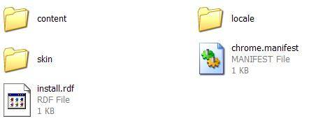
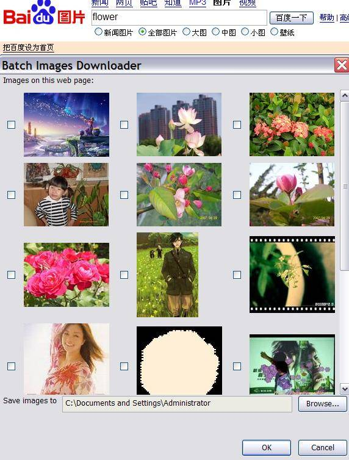

# 实战 Firefox 扩展开发
批量下载某个 HTML 页面上所有图片

**标签:** JavaScript,Web 开发

[原文链接](https://developer.ibm.com/zh/articles/wa-lo-firefox-ext/)

成富

发布: 2008-02-28

* * *

## 案例介绍

本文中所要构建的是一个能够批量下载某个 HTML 页面上所有图片的 Firefox 扩展。通常我们在浏览包含许多图片的网页时，如果想要把自己感兴趣的图片全部下载下来，需要逐一在图片上点击右键，然后选择另存为，再选择文件存放的目录，最后才能把图片保存在本机上。另外一种做法是把整个网页都保存下来，不过这样会保存不需要的信息，包括 JavaScript 脚本和 CSS 文件等，会增加所需的磁盘空间，浏览起来也不方便。该扩展要做的事情就是把网页上所有的图片在一个新窗口中列出来，用户可以勾选其感兴趣的图片，并指定需要保存的目录。然后该扩展能够一次性把用户选择的图片都下载下来。用户以后浏览起来也更加方便。

## 构建开发环境

在动手开发之前，首先需要构建扩展开发所需的环境。Firefox 把用户的个人信息，包括设置、已安装的扩展等，都保存在一个概要文件中，默认是使用名为 default 的概要文件。通过创建一个专门为开发使用的概要文件，可以不影响正常的使用，也不会破坏个人信息。为了创建另外一个概要文件，运行 `firefox –P` ，在弹出的”选择概要文件”的对话框中，新建一个名为 dev 的概要文件，并使用此概要文件来运行 Firefox。接下来需要安装几个帮助开发的扩展，分别是 Venkman、Extension Developer’s Extension 、Console2、Chrome List 和 Firebug。可以在 参考资源 部分找到这些扩展的下载地址。最后修改 Firefox 的设置使得调试更加容易。在地址栏输入 `about:config` 可以打开 Firefox 的参数设置页面。按照如下的设置修改参数：

##### 清单 1\. Firefox 扩展开发环境参数设置

```
javascript.options.showInConsole = true //把 JavaScript 的出错信息显示在错误控制台
nglayout.debug.disable_xul_cache = true //禁用 XUL 缓存，使得对窗口和对话框的修改不需要重新加载 XUL 文件
browser.dom.window.dump.enabled  = true //允许使用 dump() 语句向标准控制台输出信息
javascript.options.strict        = true //在错误控制台中启用严格的 JavaScript 警告信息

```

Show moreShow more icon

至此，开发环境就构建完成了。当需要进行扩展开发时，运行 `firefox -P dev` 启动 Firefox 即可。

## 构建初始的扩展目录结构

接下来正式进行扩展开发。首先介绍一下一个 Firefox 扩展的基本目录结构。

##### 图 1\. Firefox 扩展目录结构



在 图 1 中，content 目录下面存放的是扩展的描述界面的 XUL 文件和增加行为的 JavaScript 文件。locale 目录存放的是本地化相关的文件。如果需要支持英文和中文，就可以在 locale 目录下面新建 en-US 和 zh-CN 目录来存放相应的本地化字符串。skin 目录存放的是一些 CSS 文件，用来定义扩展的外观。chrome.manifest 是 Chrome 注册的清单文件（参见 [什么是 Chrome？](#什么是-chrome？) ）。install.rdf 分别包含了扩展安装的信息。

##### 什么是 Chrome？

Chrome 指的是应用程序窗口的内容区域之外的用户界面元素的集合，这些用户界面元素包括工具条，菜单，进度条和窗口的标题栏等。Chrome 提供者能为特定的窗口类型（如浏览器窗口）提供 chrome。有三种基本的 chrome 提供者：

- 内容（Content）：通常是 XUL 文件。
- 区域（Locale） ：存放本地化信息。
- 皮肤（Skin）：描述 chrome 的外观。通常包含 CSS 和图像文件。

在构建了初始的目录结构之后，需要让 Firefox 能够识别并加载该扩展。首先需要找到当前的概要文件所对应的目录。在 Microsoft Windows 2000 和 XP 的电脑上面，该目录是 C:\\Documents and Settings\\<您的登录用户名>\\Application Data\\Mozilla\\Firefox\\Profiles。找到该目录之后，可以看到以 dev 结尾的目录，那就是我们之前构建的开发环境的概要文件所在的目录。在其下的 extensions 目录下面，新建一个文件，其文件名为 install.rdf 中指定的扩展的 ID，此处为 batchimagesdownloader@cn.ibm.com。该文件的内容就是扩展内容所在的实际目录，比如： C:\\FirefoxExtDev\\batchimagesdownloader。Firefox 就能识别并加载我们添加的扩展了。在每次对扩展做了一定的修改之后，不需要重新启动 Firefox，只需要安装之前介绍的 Extension Developer’s Extension，并在 **Tools** 菜单中单击 **Extension Developer** \> **Reload all Chrome** 即可。接下来就可以尝试为扩展添加功能了。

## 构建基本的用户界面

我们首先从用户界面入手。如之前所述，我们希望在一个新的窗口中显示当前 HTML 页面中所有的图片，并可以让用户进行选择。Firefox 扩展使用 XUL 来描述其用户界面。XUL 提供了一套基于 XML 的描述方式，可以用来描述用户界面的各种组件，比如按钮、菜单和工具条等。最初始的界面包含显示图片的一个表格以及 OK 和 Cancel 两个按钮。

##### 清单 2\. 基本用户界面的 XUL 描述

```
<?xml version="1.0"?>
<?xml-stylesheet href="chrome://global/skin/" type="text/css"?>
<window
id="batchimagesdownloader-mainwindow" title="Batch Images Downloader"
orient="horizontal" onload="mainWindowOnLoad();"
xmlns="http://www.mozilla.org/keymaster/gatekeeper/there.is.only.xul">
<vbox flex="1">
    <vbox flex="1">
      <label value="Images on this web page:" />
      <spacer style="height: 5px"/>
      <hbox height="500" width="750" style="overflow:auto;">
        <grid>
          <columns>
            <column/>
            <column/>
            <column/>
          </columns>
          <rows id="imagesContainer"></rows> <!-- 显示图片的表格 -->
        </grid>
      </hbox>
    </vbox>
    <spacer style="height: 10px"/>
    <hbox>
      <spacer flex="1"/>
      <button id="mainWindow-add-button" label="OK" default="true"
        oncommand="download();"/>
      <button id="mainWindow-cancel-button" label="Cancel" oncommand="close();"/>
    </hbox>
    <spacer style="height: 5px"/>
</vbox>
</window>

```

Show moreShow more icon

上面就是显示图片的新窗口的界面元素的声明。下面需要添加用户的交互行为。

## 添加菜单事件响应

我们希望当用户点击 Firefox 上面的一个菜单项时，弹出刚才构建的新窗口。我们这里要做的是向 Firefox 自带的 **Tools** 菜单添加一个新的名为 **Batch Images Downloader** 的菜单项。当用户点击此菜单项时，就会弹出 [清单 2](#清单-2-基本用户界面的-xul-描述) 中定义的窗口。在扩展中可以使用覆盖（Overlay）来向已有的界面中添加元素。使用覆盖可以在运行时向一个 XUL 文档添加新的组件。我们在 chrome.manifest 中定义了名为 overlay.xul 的文件，会对 Firefox 已有的用户界面进行一定的修改。只需要在 overlay.xul 中添加下面的内容即可：

##### 清单 3\. 增加菜单项的 XUL 描述

```
<menupopup id="menu_ToolsPopup">
<menuitem id="batchimagesdownloader-show" label="Batch Images Downloader"
              oncommand="BatchImagesDownloader.show(event);"/>
</menupopup>

```

Show moreShow more icon

上面定义了当点击菜单项时，会调用 `BatchImagesDownloader.show` 方法，这是在 overlay.js 中定义的一个 JavaScript 方法，用来处理新窗口的弹出。overlay.js 由 overlay.xul 包含进来。

##### 清单 4\. 菜单项的事件响应方法

```
var BatchImagesDownloader = {
show : function() {
    var doc = window.getBrowser().selectedBrowser.contentDocument;
    var imageNodes = doc.getElementsByTagName("img"); //获取所有的 img 节点
    var params = {"imageNodes" : imageNodes};
    this.openWindow("BatchImagesDownloader.mainWindow",
      "chrome://batchimagesdownloader/content/mainWindow.xul",
      "chrome=yes,centerscreen", params);
},

//打开一个新的窗口，或是使得已经创建的窗口获得焦点
openWindow : function(windowName, url, flags, params) {
    var windowsMediator = Components.classes["@mozilla.org/appshell/window-mediator;1"]
      .getService(Components.interfaces.nsIWindowMediator);
    var aWindow = windowsMediator.getMostRecentWindow(windowName);
    if (aWindow) {
      aWindow.focus();
    }
    else {
      aWindow = window.openDialog(url, windowName, flags, params);
    }
    return aWindow;
}
};

```

Show moreShow more icon

添加上述的代码之后，可以通过点击 **Tools** 菜单项下来的 **Batch Images Downloader** 菜单项来弹出新的窗口。

## 显示图片

可以在 `BatchImagesDownloader.show` 方法中看到，当弹出新窗口的时候，会把当前页面上的所有 img 节点都作为参数传递给新打开的窗口。这些 img 节点就是需要展现给用户并供其选择的。接下来要做的就是在新窗口中显示这些图片。在 JavaScript 的方法中，可以像在 HTML 中的 DOM 操作一样，对 XUL 定义的 DOM 树进行修改。这其中包括使用 `document.createElementNS` 来创建新的 XUL 元素，同样也可以使用 CSS 来修改 XUL 元素的外观。

##### 清单 5\. 显示图片的 JavaScript 方法

```
const COLUMNS_PER_ROW = 3;    //每行显示3张图片
function mainWindowOnLoad() {
var params = window.arguments[0];
var imageNodes = params.imageNodes;
displayImages(imageNodes);
}

function displayImages(imageNodes) {
imageNodes = imageNodes || [];
var cols = COLUMNS_PER_ROW, row, image, hbox, checkbox;
var rows = document.getElementById("imagesContainer");
for (var i = 0, n = imageNodes.length; i < n; i++) {
    var imageNode = imageNodes[i];
    var imageSrc = imageNode.getAttribute("src");
    if (imageSrc == "") {
      continue;
    }
    if (cols >= COLUMNS_PER_ROW) {
      row = document.createElementNS(XUL_NS, "row"); //开始新的一行
      row.setAttribute("align", "center");
      rows.appendChild(row);
      cols = 0;
    }
    else {
      hbox = document.createElementNS(XUL_NS, "hbox");
      hbox.setAttribute("style", "padding:5px 5px 5px 5px;");
      image = document.createElementNS(XUL_NS, "image");//创建 XUL 图像元素来显示图片
      image.setAttribute("src", imageSrc);
      checkbox = document.createElementNS(XUL_NS, "checkbox");//创建 XUL 复选框元素以供用户选择
      checkbox.setAttribute("imageUrl", imageSrc);
      hbox.appendChild(checkbox);
      hbox.appendChild(image);
      row.appendChild(hbox);
      cols++;
    }
}
}

```

Show moreShow more icon

我们需要在新窗口加载完成之后，就显示当前页面的所有图片。因此需要注册新窗口的 onload 事件的响应方法。这里是 `mainWindowOnLoad` 。在 `mainWindowOnLoad` 中，通过 `window.arguments[0]` 可以获得作为打开新窗口的参数传进来的 img 节点列表。然后根据这些 img 节点的 src 属性，创建相应的 XUL 图像元素并显示在表格中，并在每个图片下面创建一个复选框以供用户选择。

## 下载图片

为了让用户能够下载所选的图片，需要添加新的界面元素让用户可以指定下载图片存放的目录，并提供一个进度条来显示当前的下载进度。

##### 清单 6\. 支持下载的用户界面 XUL 描述

```
<hbox>
<label value="Save images to" />
<textbox id="mainWindow-save-path" readonly="true" style="min-width: 15em;" flex="1"/>
<button label="Browse..." oncommand="selectSaveDirectory();"/>
</hbox>
<spacer style="height: 10px"/>
<progressmeter mode="determined" id="downloadProgress"
value="0" style="visibility:hidden;"/>

```

Show moreShow more icon

该扩展提供了一个默认的图片保存路径，那就是当前用户的根目录。用户也可以选择他想要的保存图片的目录。

##### 清单 7\. 用户选择图片保存目录的 JavaScript 方法

```
var saveDirectory = getDefaultSaveDirectory();
function selectSaveDirectory() {
const nsIFilePicker = Components.interfaces.nsIFilePicker;
var fp = Components.classes["@mozilla.org/filepicker;1"].createInstance(nsIFilePicker);
fp.init(window, "", nsIFilePicker.modeGetFolder);
var result = fp.show(); //显示目录选择对话框
if (result == nsIFilePicker.returnOK) {
    var file = fp.file;
    saveDirectory = file;
    byId("mainWindow-save-path").value = file.path;//把目录的路径显示在文本框中
}
}

//获得默认的图片保存目录，也就是当前用户的根目录
function getDefaultSaveDirectory() {
var file = Components.classes["@mozilla.org/file/directory_service;1"]
                .getService(Components.interfaces.nsIProperties)
                .get("Home", Components.interfaces.nsIFile);
return file;
}

```

Show moreShow more icon

当用户对图片进行了选择，并点击 OK 之后，需要执行图片下载的任务。在下载图片中，会使用 Firefox 的 XPCOM 的实现，请参看 [什么是 XPCOM？](#什么是-xpcom？) 和 参考资料 ，获得关于 XPCOM 的更多信息。

##### 清单 8\. 下载单张图片的 JavaScript 方法

```
function downloadSingleImage(uri, callback) {
var ios = Components.classes["@mozilla.org/network/io-service;1"]
              .getService(Components.interfaces.nsIIOService);
var imageURI = ios.newURI(uri, null, null); //创建图像的 URI
var imageFileName = uri.substring(uri.lastIndexOf("/") + 1);
var channel = ios.newChannelFromURI(imageURI);  //创建读取 URI 指定的数据流的通道
var observer = {
    onStreamComplete : function(loader, context, status, length, result) {
      var file = Components.classes["@mozilla.org/file/local;1"]
                    .createInstance(Components.interfaces.nsILocalFile);
      file.initWithFile(saveDirectory);  //图片保存的目录
      file.appendRelativePath(imageFileName);
      var stream = Components.classes["@mozilla.org/network/safe-file-output-stream;1"]
                     .createInstance(Components.interfaces.nsIFileOutputStream);
      stream.init(file, -1, -1, 0);
      var bstream = Components.classes["@mozilla.org/binaryoutputstream;1"]
                      .createInstance(Components.interfaces.nsIBinaryOutputStream);
      bstream.setOutputStream(stream);
      bstream.writeByteArray(result, length); //把图片流的全部字节写入输出文件流中
      if (stream instanceof Components.interfaces.nsISafeOutputStream) {
        stream.finish();
      }
      else {
        stream.close();
      }
      if (typeof callback == "function") {
        callback();
      }
    }
};
var streamLoader = Components.classes["@mozilla.org/network/stream-loader;1"]
             .createInstance(Components.interfaces.nsIStreamLoader);
streamLoader.init(channel, observer, null);
}

```

Show moreShow more icon

##### 什么是 XPCOM？

XPCOM 是一种跨平台的组件对象模型，类似于微软的 COM。它有多种的语言绑定，可以在 JavaScript，Java，Python 和 C++ 中使用和实现 XPCOM 的组件。XPCOM 本身提供了一系列核心组件和类，比如文件和内存管理，线程，基本的数据结构（字符串，数组）等。

这里的实现方式是读取从远程获取的图片数据流，并把相应的数据写入到本地磁盘指定的目录中。为了实现以异步的方式读取和保存数据，使用了 `nsIStreamLoader` 接口的实现。它从指定的通道读取数据，当数据读取完成之后，会通知相应的监听器。在这里，我们用图片的URL地址来初始化一个通道，同时创建了一个监听器。在 `onStreamComplete` 的方法中，把得到的图片字节流写入到本地文件存储中。最后，如果注册了回调函数，就执行此回调函数。

##### 清单 9\. 下载用户选择的全部图片的 JavaScript 方法

```
function download() {
var rows = document.getElementById("imagesContainer");
var checkboxes = rows.getElementsByTagName("checkbox");
var imageUrls = [];
for (var i = 0, n = checkboxes.length; i < n; i++) {
    if (checkboxes[i].checked) {
      imageUrls.push(checkboxes[i].getAttribute("imageUrl")); //用户选择的图片的 URL
    }
}
var progressmeter = byId("downloadProgress");
progressmeter.style.visibility = "visible";
var total = imageUrls.length, step = 100 / total, current = 0;
for (var i = 0; i < total; i++) {
    downloadSingleImage(imageUrls[i], function() {
      var value = parseInt(progressmeter.value); //更新进度条
      progressmeter.value = value + step;
    });
}
close();
}

```

Show moreShow more icon

下载全部图片时，会逐个检查复选框的状态，把用户选择的图片的 URL 记录下来。对每张图片，都会调用 `downloadSingleImage` 以异步的方式来下载。在单张图片下载完成之后，会有回调函数来通知主窗口，更新进度条的状态。当所有图片都下载完成之后，关闭当前窗口。

至此，整个扩展就开发完成了。实际的扩展的截图如下：

##### 图 2\. 该 Firefox 扩展实际使用的截图



在 图 2 中，HTML 页面的内容是使用”flower”作为关键字来访问百度图片搜索。

## 打包、发布和更新

### 打包

扩展打包的过程非常简单。只需要把整个目录的内容打包成一个 ZIP 格式的文件，并把文件的扩展名改为 xpi 即可。需要注意的是 install.rdf 要在 ZIP 文件的根目录下面，这样扩展才能安装到 Firefox 中。

### 发布

如果您想让别人也来使用您开发的扩展，一种方式是直接把打包好的 xpi 文件发给对方，他只需要用 Firefox 打开这个文件，就会自动提示安装。另外一种方式是把该 xpi 文件存放在某个公开的 HTTP 服务器中，对方只需要用 Firefox 访问该 xpi 文件，就同样会自动提示安装。这里需要注意的是要正确的设置 xpi 文件的 MIME 类型。Firefox 能识别的 xpi 文件的 MIME 类型是 application/x-xpinstall。您可能需要配置您的 HTTP 服务器。

### 更新

如果您的扩展的开发周期较长，需要发布多个版本的话，可以利用扩展的自动更新的能力。这样当有新的版本发布时，Firefox 会自动提示用户去获取最新的版本。要实现自动更新，需要在扩展的 install.rdf 中指定描述更新信息的 rdf 文件的位置，该 rdf 文件通常命名为 update.rdf。在 update.rdf 中声明了当前最新的版本号和最新版本的下载地址。如果用户安装的扩展的版本低于 update.rdf 中声明的版本，则 Firefox 会提示用户是否更新。请参考本文附带的源代码中的 update.rdf 文件。

## 批量下载图片的 Firefox 扩展的源代码

[batchimagesdownloader.zip](batchimagesdownloader.zip)