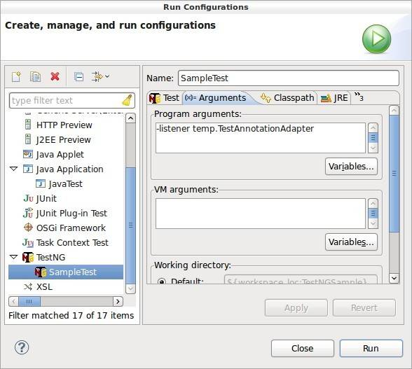

# 实战 TestNG 监听器
TestNG 是一款被广泛使用的自动化测试框架

**标签:** DevOps

[原文链接](https://developer.ibm.com/zh/articles/os-cn-testinglistener/)

沈 锐

发布: 2015-01-26

* * *

## TestNG 简介

TestNG 是一个开源的自动化测试框架，其灵感来自 JUnit 和 NUnit，但它引入了一些新功能，使其功能更强大，更易于使用。TestNG 的设计目标是能够被用于进行各种类型测试：单元测试、功能测试，端到端测试、集成测试，等等。NG 是 Next Generation 的简写，表示下一代，意在表示其产生的目的是要超越当前所有测试框架。TestNG 类似于 JUnit（特别是 JUnit 4），但它不是 JUnit 的扩展，而是独立的全新设计的框架。TestNG 的创造者是 Cedric Beust（塞德里克·博伊斯特）。

TestNG 有如下特点：

- 支持 Java 注释功能
- 测试运行在任意大的线程池中，并且有多种运行策略可供选择（所有测试方法运行在自己的线程中、每个测试类一个线程，等等）。
- 线程安全
- 灵活的测试配置
- 支持数据驱动测试（通过 @DataProvider 注释）
- 支持参数化
- 强大的运行模型（不再使用 TestSuite）
- 有多种工具和插件支持（Eclipse, IDEA, Maven, 等等）
- 内嵌 BeanShell 以进一步增强灵活性
- 默认提供 JDK 的运行时和日志功能
- 提供应用服务器测试依赖的方法

## TestNG 监听器概述

尽管 TestNG 的默认配置已经提供了不少强大的功能和灵活的选项，但是没有一种方案能够解决所有的问题。在实际应用中，我们多多少少会发现 TestNG 自带的功能无法满足我们的一些实际需求，尤其是关于测试方法运行的行为、报表以及通知功能。此时，我们就需要使用 TestNG 的监听器定制额外的功能以满足我们的需要。

以下是 TestNG 提供的几种监听器：

- IAnnotationTransformer
- IAnnotationTransformer2
- IHookable
- IInvokedMethodListener
- IMethodInterceptor
- IReporter
- ISuiteListener
- ITestListener

尽管名字叫监听器，但事实上它们只是一些预定义的 Java 接口。用户创建这些接口的实现类，并把它们加入到 TestNG 中，TestNG 便会在测试运行的不同时刻调用这些类中的接口方法。接下来，我们一一介绍 TestNG 中的每种监听器。

### IAnnotationTransformer

大多数情况下，在运行时我们不需要改动源代码中定义的注释，但有时需要这样做。这时，我们就需要使用 IAnnotationTransformer 监听器。IAnnotationTransformer 只能用来修改 @Test 注释，如果需要修改其他 TestNG 的注释（比如，@DataProvider, @Factory 以及 @Configuration），需要使用 IAnnotationTransformer2 监听器。IAnnotationTransformer 要求实现 transform 方法，其方法签名如下：

```
void transform(ITest annotation, Class testClass, Constructor testConstructor, Method testMethod);

```

Show moreShow more icon

annotation 代表就是为 testMethod 定义的 @Test 注释。调用其方法可以更改 @Test 注释属性。例如，下面的代码在运行时将属性 enabled 改为 false 从而禁用了当前的测试方法。

```
annotation.setEnabled(false);

```

Show moreShow more icon

### IAnnotationTransformer2

前文已提到 IAnnotationTransformer2 监听器是用来在运行时修改除 @Test 以外的 TestNG 的注释。下面是该监听器要求实现的方法。

```
void transform(IConfigurationAnnotationannotation, java.lang.ClasstestClass,
java.lang.reflect.ConstructortestConstructor,
java.lang.reflect.MethodtestMethod)
void transform(IDataProviderAnnotationannotation, java.lang.reflect.Methodmethod)
void transform(IFactoryAnnotationannotation, java.lang.reflect.Methodmethod)

```

Show moreShow more icon

可见，目前只有 @Configuration,@DataProvider 以及 @Factory 注释能够通过该监听器修改。而事实上，@Configuration 在最新版本中已不被推荐使用，需用 @BeforeSuite，@AfterSuite 等注释替代。

### IHookable

IHookable 监听器提供了类似与面向方面编程（AOP）中的 Around Advice 的功能。它在测试方法执行前后提供了切入点，从而使用户能够在测试方法运行前后注入特定的功能。例如，用户可以在当前测试方法运行前加入特定的验证逻辑以决定测试方法是否运行或者跳过，甚至覆盖测试方法的逻辑。下面是 IHookable 监听器要求实现的方法签名。

```
void run(IHookCallBack callBack, ITestResult testResult)

```

Show moreShow more icon

如要运行原始测试方法逻辑，需要调用 runTestMethod 方法。

```
callBack.runTestMethod(testResult);

```

Show moreShow more icon

### IInvokedMethodListener

与 IHookable 类似，IInvokedMethodListener 提供了类似与面向方面编程（AOP）中的 Before Advice 和 After Advice 的功能。它允许用户在当前测试方法被执行前和执行后注入特定的逻辑，比如，可以加入日志方法。用户需要实现的方法如下。

```
void afterInvocation(IInvokedMethod method, ITestResult testResult)
void beforeInvocation(IInvokedMethod method, ITestResult testResult)

```

Show moreShow more icon

### IMethodInterceptor

TestNG 启动之后，第一件要做的事情是将所有的测试方法分成两类：一类是顺序运行的测试方法；一类是没有特定运行顺序的测试方法。

TestNG 通过 @Test 注释中的 dependsOnGroups 和 dependsOnMethods 使用户能够定义测试方法之间的依赖关系。这种依赖关系也就决定这些测试方法必须按着怎样的顺序运行，这就是第一类。除此以外的便是第二类。对于第二类中的测试方法，尽管默认 TestNG 会尝试用类名将它们分组，但是理论上，它们的运行顺序是随机的，甚至每次运行的顺序都可能不同。因此为了使用户拥有对第二类测试方法更大的控制权，IMethodInterceptor 监听器产生了。用户要实现的方法如下。

```
java.util.List<IMethodInstance> intercept(java.util.List<IMethodInstance> methods, ITestContext context)

```

Show moreShow more icon

intercept 方法在所有测试方法被分类后以及所有测试方法被执行前被调用。所有的测试方法将按照 intercept 返回值列表中的顺序被执行。因此，用户在 intercept 方法中可以对列表进行修改，比如重新排序，甚至增加或者减少测试方法。

### IReporter

TestNG 提供了默认的测试报表。但如果用户希望有不同格式的测试报表，就需要使用 IReporter 监听器。IReporter 监听器只有一个方法需要实现。

```
void generateReport(java.util.List<XmlSuite> xmlSuites, java.util.List
<ISuite> suites, java.lang.String outputDirectory)

```

Show moreShow more icon

该方法在所有测试方法执行结束后被调用，通过遍历 xmlSuites 和 suites 能够获取所有测试方法的信息以及测试结果。outputDirectory 是默认的测试报表生成路径，当然你可以指定其他路径生成报表。

### ISuiteListener

ISuiteListener 类似于 IInvokedMethodListener，区别是 IInvokedMethodListener 针对的是测试方法，而 ISuiteListener 针对的是测试套件。ISuiteListener 使用户有机会在测试套件开始执行以及执行结束之后嵌入自己的逻辑。该监听器要求实现的方法如下。

```
void onFinish(ISuite suite)
void onStart(ISuite suite)

```

Show moreShow more icon

### ITestListener

如果要在测试方法执行成功、失败或者跳过时指定不同后续行为，可以通过 IInvokedMethodListener 实现，不过更为简便的方式是利用 ITestListener 监听器。ITestListener 监听器要求实现的方法中包含如下三个。

```
void onTestFailure(ITestResult result)
void onTestSkipped(ITestResult result)
void onTestSuccess(ITestResult result)

```

Show moreShow more icon

除了以上三个方法，ITestListener 还声明了其他一些方法，大家可以自行查阅 TestNG Javadoc 了解细节。

另外，TestListenerAdapter 已经实现 ITestListener，并且提供了一些有用的方法，比如分别获取所有成功失败跳过三种测试结果的测试方法的方法，并且 ITestListner 中有很多方法而 TestListenerAdapter 已给出了默认实现。因此，继承 TestListenerAdapter 后，便只需关注需要修改的方法。

## 监听器的使用方法

前文已讲过，监听器的编码过程就是定义一个 Java 类实现监听器接口。下面简单介绍一下监听器的几种使用方法。

### 在 testng.xml 中使用 TestNG 监听器

TestNG 通过 testng.xml 配置所有的测试方法。Testng.xml 提供了 listeners 和 listener 标签用来添加自定义的监听器。下面示范的是本文示例代码中包含的 testng.xml 文件。

```
<suite name="TestNGSample">
    <listeners>
        <listener class-name="listeners.OSFilter" />
        <listener class-name="listeners.ProgressTracker" />
    </listeners>
    <test name="ProgressTracker Demo">
        <classes>
            <class name="tests.SampleTest" />
        </classes>
    </test>
</suite>

```

Show moreShow more icon

### 在源代码中使用 TestNG 监听器

通过 @Listeners 注释，可以直接在 Java 源代码中添加 TestNG 监听器。下面示范的是本文示例代码中如何使用 @Listeners 注释。

```
@Listeners({ OSFilter.class, ProgressTracker.class })
public class SampleTest {

    @Test(groups = { OSNames.OS_LINUX })
    public void test1() {
        sleep(5000);
        System.out.println(">>>test1");
    }

```

Show moreShow more icon

值得注意的是：

- 在 @Listeners 中添加监听器跟在 testng.xml 添加监听器一样，将被应用到整个测试套件中的测试方法。如果需要控制监听器的应用范围（比如添加的监听器仅使用于某些测试测试类或者某些测试方法），则必须在监听器类中编写适当的判断逻辑。
- 在 @Listeners 中添加监听器跟在 testng.xml 添加监听器的不同之处在于，它不能添加 IAnnotationTransformer 和 IAnnotationTransformer2 监听器。原因是因为这两种监听器必须在更早的阶段添加到 TestNG 中才能实施修改注释的操作，所以它们只能在 testng.xml 添加。
- TestNG 对添加的监听器不做去重判断。因此，如果 testng.xml 和源代码中添加了相同的监听器，该监听器的方法会被调用两次。有关这一点，大家可以通过运行本文附带的示例代码包中 testng.xml 验证。因此，切记，不要通过多种方式重复添加监听器。

### 通过 ServiceLoader 使用 TestNG 监听器

Java SE 6 开始提供了 ServiceLoader。它可以帮助用户查找、加载和使用服务提供程序，从而在无需修改原有代码的情况下轻易地扩展目标应用程序。通过 ServiceLoader 的方式使用 TestNG 监听器，简单来说，就是创建一个 jar 文件，里面包含 TestNG 监听器的实现类已经 ServiceLoader 需要的配置信息，并在运行 TestNG 时把该 jar 文件加载到类路径中。具体步骤请查阅 TestNG 官方文档。这样做的好处是：

1. 可以轻松地与其他人分享 TestNG 监听器。
2. 当有很多 testng.xml 文件时，不需要重复把监听器添加到每个文件中。

### 通过命令行使用 TestNG 监听器

通过命令行使用 TestNG 监听器，需要在命令行中加入 “-listener” 参数。如要指定多个监听器，用逗号分隔。下面是一个调用的示例。

```
java org.testng.TestNG -listener MyListener testng1.xml [testng2.xml testng3.xml ...]

```

Show moreShow more icon

### 通过 IDE 使用 TestNG 监听器

TestNG 在多种 IDE 中都有插件支持，比如 Eclipse 和 IDEA。因为最终 IDE 也是以命令行的方式调用 TestNG，因此在 IDE 中也是通过添加 “-listener” 参数使用 TestNG 监听器。下图以 Eclipse 为例示范了 TestNG 监听器的配置方法。

##### 图 1\. Eclipse 中 TestNG 监听器的配置



除此之外，ANT 跟 Maven 也都有相应 Task 和插件运行 TestNG 测试，按照相应的文档配置监听器即可，这里便不一一赘述。

## 示例

本文提供了两个示范的监听器的实现，它们分别实现了动态测试方法过滤和测试进度跟踪功能。

### 动态测试方法过滤监听器（listeners.OSFilter）

TestNG 提供了分组特性，但它的局限是组名必须是静态的。假如，现在有一些测试方法，部分适用于 Linux 和 Windows，部分仅适用于其一。通过默认的 TestNG 分组特性，大概要定义两个 testng.xml 文件，指定不同的组名，并且在指定测试应用时要小心不要把配置与环境的对应弄错。

示例代码中的监听器采用的方法是在每个测试方法执行前，动态获取操作系统类型信息并将其与 @Test 注释中定义的操作系统比较以决定哪些测试方法应该运行。这样便省却了上述配置的麻烦。

如果仅仅为了跳过不合适的测试方法，也可以选用 IInvokedMethodListener 监听器。但因为该监听器还要统计所有传入的测试方法以及被忽略的测试方法的数目，所以选用了 IMethodInterceptor。值得注意的是，在 TestNG 的生命周期中，IMethodInterceptor 监听器的 intercept 方法事实上会被调用两次。为了避免代码被重复执行，本示例代码将返回的测试方法列表定义为成员变量，并通过判断该成员变量是否为 null 决定是否执行过滤逻辑。

### 测试进度跟踪监听器（listeners.ProgressTracker）

自动化单元测试和 API 测试通常运行比较快，但是 UI 测试运行较慢。对于长时间运行的测试，我们常常想要知道当前正在运行的测试方法名称以及预计剩余执行时间。这便是该监听器实现的功能。

由于需要通过统计每个测试方法的运行时间来预估剩余执行时间，该监听器选用了 IInvokedMethodListener。另外，预估剩余执行时间还需要知道整个测试套件要执行的测试方法的数目，单单使用 IInvokedMethodListener 无法得到该信息，因此，该监听器通过 listeners.OSFilter 计算全部要执行的测试方法的数目。预估的算法是根据已经使用的时间和执行的测试方法数量计算出每个测试方法的平均执行时间，然后用该平均时间乘以未执行的测试方法数目，从而得出预估剩余时间。该算法的问题在于，当每个测试方法执行时间差异较大并且测试方法数目较少时，该方法春在较大的误差，因此该时间只能作为参考。

### 如何运行示例代码

示例代码是一个 Eclipse 项目导出的压缩文件，因此只要在 Eclipse 中导入该文件并安装 TestNG 的 Eclipse 插件即可运行。

tests.SampleTest 是一个示范的 TestNG 测试类，该类中定义了 5 个测试方法：一个指定为仅运行在 Linux，两个指定为运行在 Linux 和 Windows，另外两个指定为仅运行在 Windows。为简单期间，测试方法体仅用 Thread.sleep（）模拟。该类中已添加了 @Listeners 注释，将该类作为 TestNG 测试运行，将得到如下的正常输出（此为 Linux 下的输出结果）。

```
[TestNG] Running:
/tmp/testng-eclipse-814456884/testng-customsuite.xml

Ignored Test Methods: [test4(tests.SampleTest), test5(tests.SampleTest)]
[Begin] test1(SampleTest)
>>>test1
[Progress]33% (1/3) , Elapsed:00:00:05, Estimated Time Remaining:00:00:10
[End] test1(SampleTest): Passed

[Begin] test2(SampleTest)
>>>test2
[Progress]67% (2/3) , Elapsed:00:00:08, Estimated Time Remaining:00:00:04
[End] test2(SampleTest): Passed

[Begin] test3(SampleTest)
>>>test3
[Progress]100% (3/3) , Elapsed:00:00:10, Estimated Time Remaining:00:00:00
[End] test3(SampleTest): Passed

PASSED: test1
PASSED: test2
PASSED: test3

===============================================
Default test
Tests run: 3, Failures: 0, Skips: 0
===============================================

===============================================
Default suite
Total tests run: 3, Failures: 0, Skips: 0
===============================================

[TestNG] Time taken by org.testng.reporters.JUnitReportReporter@5a31442c: 12 ms
[TestNG] Time taken by org.testng.reporters.EmailableReporter@64a0401: 5 ms
[TestNG] Time taken by org.testng.reporters.XMLReporter@a98e9456: 20 ms
[TestNG] Time taken by org.testng.reporters.SuiteHTMLReporter@276fc2ae: 77 ms
[TestNG] Time taken by [FailedReporter passed=0 failed=0 skipped=0]: 1 ms
[TestNG] Time taken by org.testng.reporters.jq.Main@6517ab3c: 63 ms

```

Show moreShow more icon

示例代码包中还包含有一个 testng.xml 文件。testng.xml 中也添加了监听器，因此运行 testng.xml 将看到重复的测试进度信息输出。需删除 tests.SampleTest 中 @Listeners 注释才能使 testng.xml 正常运行测试。

## 结束语

通过本文的介绍，大家可以了解到，TestNG 提供的多种监听器接口使 TestNG 具备强大的扩展性。选用什么监听器接口需根据实际需求而定。在动手开发自己的 TestNG 监听器之前，不妨先搜索一下互联网，兴许其他用户已经开发了类似的功能。例如，ReportNG 就是一款较为成熟的用于增强 TestNG 报表功能的插件。

## 下载代码示例

[TestNGSample.zip](http://www.ibm.com/developerworks/cn/opensource/os-cn-testinglistener/TestNGSample.zip)