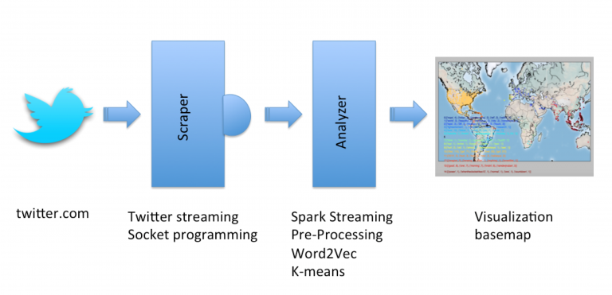
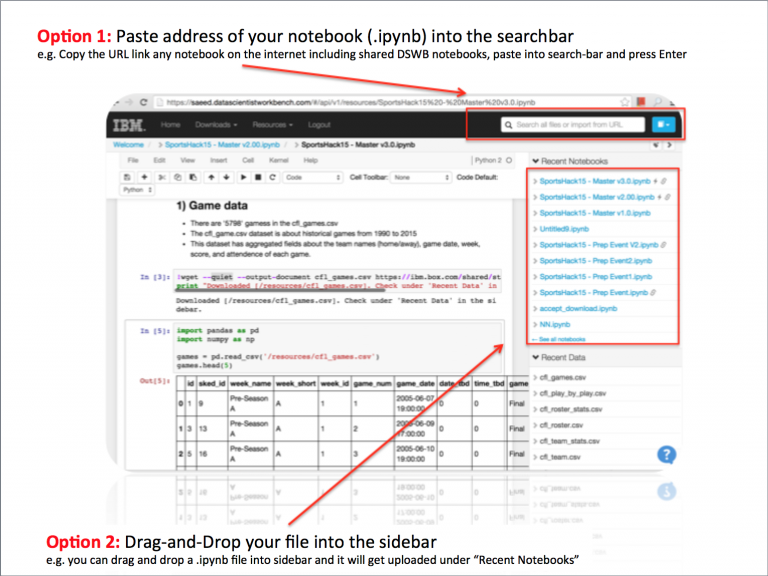
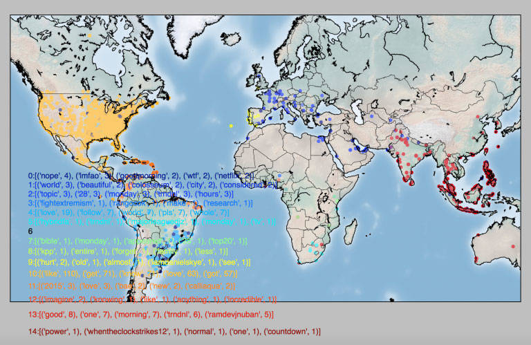
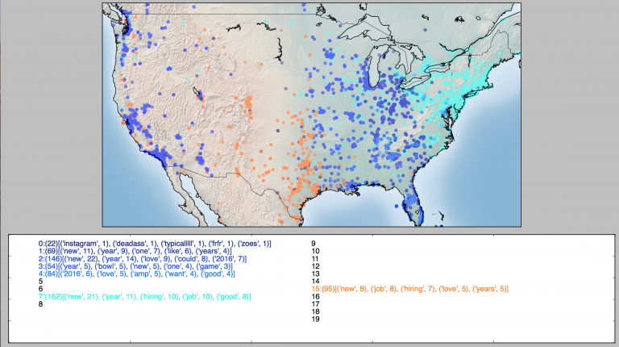

# 实时分析社交媒体数据
Spark Streaming 介绍

**标签:** 分析

[原文链接](https://developer.ibm.com/zh/articles/analyze-social-media-data-real-time/)

developerWorks 中国网站编辑组

发布: 2016-02-22

* * *

这是一篇关于使用 Spark Streaming 实时分析社交媒体数据的简短教程。

您想知道人们在发微博谈论世界的哪些不同地方吗，是在谈论各大洲还是在谈论您的国家？您想要了解某个地区的人们的倾向或看法吗？您需要检测事件吗？数据科学可以帮助您实时获取此信息。

这是一篇关于使用 Spark Streaming 实时分析社交数据的简短指南。我创建了一个不停运转的流程序，实时获取 Twitter 数据，根据文本和位置来收集推文，并使用了 k 均值算法。我的目标是向您展示如何使用最先进的方法（比如 Spark）使我们能够快速而又轻松地编写具有最少代码行的程序。在这里，您将练习采用各种各样的 Spark 命令来实现此应用程序。



这就是我们的 Spark Streaming 程序中的数据流：Twitter 数据被提供给 Spark Streaming，Spark Streaming 将它们收集在一起，并在地图上实时标绘出推文。

首先，我们需要读取 Twitter 数据。不过，不同于传统的方法，在本教程中，我们并没有将推文实际保存到我们的磁盘或者数据库中。相反，我们会实时地清理、分析和可视化这些 Twitter 数据。所以在这种情况下，我们不必面对可伸缩性问题——我们可以花几个小时的时间读取数据，并继续在一个地图上可视化它们。

本指南包含两个部分：

- Scraper：从 Twitter 中读取数据
- Analyzer：清理、分析和可视化数据

在 Scraper 部分，我们从 Twitter 中读取数据，并将它们写入一个套接字中。为什么呢？因为稍后在本教程的第二部分（Analyzer 部分）中，我们会以流的方式从该套接字中动态读取数据并分析它们。所以，Scraper 的基本任务就是成为 Twitter（原始数据）流与 Analyzer 之间的调停者。

为了使用 Python 编写这段代码，我们使用了一个便捷的平台，即 Data Scientist Workbench (DSWB)，它承载了科学数据中使用的大量开源工具，比如 Jupyter Notebooks、RStudio 和 Zeppelin。它还为每个工具预先安装了 Apache Spark。所有一切都已经准备就绪，我们需要做的就是编写您的代码。您可以观看这个 3 分钟的视频，了解有关这些的更多信息。您可以使用以下两个选项之一上传 Notebook：

1) 在顶部菜单中，转到 “Build Analytics”，然后转到 “IPython/Jupyter Notebooks”。现在，在右上角搜索栏中，复制和粘贴下面的 URL 并按下 Enter。

- **Scraper.ipynb：**

[https://share.datascientistworkbench.com/#/api/v1/workbench/10.115.89.160/shares/tBMdz4H7LoyxWSj/Scraper.ipynb](https://share.datascientistworkbench.com/#/api/v1/workbench/10.115.89.160/shares/tBMdz4H7LoyxWSj/Scraper.ipynb)

- **Analyzer.ipynb：**

[https://share.datascientistworkbench.com/#/api/v1/workbench/10.115.89.160/shares/BbOY3brvUkhP9iq/Analyzer.ipynb](https://share.datascientistworkbench.com/#/api/v1/workbench/10.115.89.160/shares/BbOY3brvUkhP9iq/Analyzer.ipynb)

2) 或者，您可以下载此处的 IPython Notebooks：

- [Scraper](https://gist.github.com/saeedaghabozorgi/6c3872a6fdde18197c04)
- [Analyzer](https://gist.github.com/saeedaghabozorgi/ddbc78fb02cf0b1b77ef)

并在显示 DSWB 时将每个文件拖放到侧边栏中。



该图显示了如何将一个文件上传到 Data Scientist Workbench 中。

让我们先来看一下 **Scraper** 。它是一段 Python 代码，充当着 Twitter 与 Analyzer 文件之间的管道 。

**Scraper** 运行三个任务：

1. 打开一个套接字，监听并接受来自 Analyzer 的连接请求
2. 从 Twitter Streaming API 中读取流推文数据
3. 采用 JSON 格式将推文写入套接字中

我们创建了一个服务器套接字来写入推文，以便 **Analyzer** 稍后可以从该套接字中读取流数据。为此，我们应该使用一个任意的非特权端口，将套接字绑定到 _本地主机_ 和 _端口_ ，然后开始监听数据。函数 _socket.socket_ 创建了一个套接字，并返回使用的套接字。我们将对此套接字使用端口 9999：

```
s = socket.socket('localhost', 9999)
         s.bind(('localhost', 9999))

```

Show moreShow more icon

下面的代码块将会从 Twitter 中读取数据并将它们写入套接字。要读取推文，应设置一些变量，这些变量包含用于访问 Twitter API 的用户凭证。用户凭证包括访问令牌和密码，还包括使用者秘钥和密码。您可以在 [连接到流端点](https://dev.twitter.com/streaming/overview/connecting) 中找到关于用户凭证的更多信息。然后，我们建立了到流 API (streaming API) 的连接。

```
auth = requests_oauthlib.OAuth1(consumer_key, consumer_secret,access_token, access_token_secret)

```

Show moreShow more icon

我们从 Twitter Streaming API（也称为消防水管）中获得一个推文选择。我们使用一个非常 “持久” 的 HTTP 请求，并以递增方式解析响应。从概念上讲，您可以认为这一步是通过 HTTP 下载一个无限长的文件。流输出取决于以下流端点的内容：

```
url='https://stream.twitter.com/1.1/statuses/filter.json'

```

Show moreShow more icon

此外，我们可以定义一些参数来限制结果，例如，对于 _英文_ 的推文，可以限定一个地理边界（比如美国），还可以根据一些关键字来筛选推文。

```
data = [('language', 'en'), ('locations', '-130,-20,100,50') ,('track','ibm', 'Cloud', 'BigData')]
                query_url = url + '?' + '&'.join([str(t[0]) + '=' + str(t[1]) for t in data])
                response = requests.get(query_url, auth=auth, stream=True)

```

Show moreShow more icon

然后，我们将遍历流推文，使用函数 _send_ 来简化向打开的套接字发送/写入数据的过程。

第二部分 **Analyzer** 中，我们使用 [Spark 的流 API](https://spark.apache.org/docs/1.2.0/streaming-programming-guide.html) 从套接字中读取数据，预处理推文，在数据到达某个流时收集推文，并推出结果以便将结果可视化。

首先，我们将初始化一些参数。 _Batch interval_ 是更新流 API 的间隔、 _window length_ 是窗口的持续时间， _window length_ 是执行窗口操作的时间间隔。此外，我已经确定了为每个更新（使用 _ClustNum_ 实现）使用的集群数量为 15，该值是一个任意数字，表示我们想要使用多少个集群。

```
BATCH_INTERVAL = 10 # How frequently to update (seconds)
                WINDOWS_LENGTH=60 #the duration of the window
                SLIDING_INTERVAL=20 #the interval at which the window operation is performed
                clusterNum=15 #Number of Clusters

```

Show moreShow more icon

像对待其他任何 Spark 程序一样，我们首先创建了一个 _SparkContext_ 对象，因为我是在笔记本电脑上完成我的设置（还有其他 4 个工人），所以我指定该程序使用本地 Spark 实例。在该程序中，我们使用了 k 均值算法来收集推文。k 均值算法会使用一个无人监管的方法，根据分组数据的相似性来收集它们。

但 k 均值算法只能处理数值向量数据。因此，我们必须将推文转换为特性或向量。有许多方法可用于将文本转换为向量，比如 _TF-IDF_ 、 _Word2Vec_ 和 _CountVectorizer_ 。Spark 提供了一个非常不错的 [Word2Vec](https://code.google.com/p/word2vec/) 功能来将词语转换为向量。Word2Vec 计算词语的分布式向量的表示形式。分布式表示形式的主要优点是将类似的词语收集到向量空间中。 _Word2Vec_ 使用文档的语料库来计算构建矢量。请考虑下列情况，我们将使用流数据，我们不能为每个批次都创建一个模型，因为首先，计算的费用很高，其次，批次的大小没有想象中的那样大。因此，我们使用了预先训练的模型（在本 [示例](http://spark.apache.org/docs/latest/mllib-feature-extraction.html#word2vec) 中，是从 text8 中构建）来实现矢量化。为了以低成本的方式加载此模型，我已在离线模式下构建了该模型，然后使用了 Spark 的 _SQLContext_ ，我创建了一个 broadcast 变量来使得每台机器上的模型能够作为一个缓存的、只读的变量，而不是在任务中传递模型的副本。这以有效的方式为每个节点都提供了模型的副本。要启动 _SQLContext_ 和 _StreamingContext_ ，需要实例化 [SparkContext](http://spark.apache.org/docs/latest/api/scala/index.html#org.apache.spark.SparkContext) ，它是 Spark 功能的主要入口点。SparkContext 已经在 DSWB 中实例化为 “sc”，所以我们只需开始使用它即可。

```
sqlContext=SQLContext(sc)
                lookup = sqlContext.read.parquet("word2vecModel/data").alias("lookup")
                lookup.printSchema()
                lookup_bd = sc.broadcast(lookup.rdd.collectAsMap())

```

Show moreShow more icon

然后，我实例化了一个 _StreamingContext_ 对象，并建立一个批次间隔。Spark Streaming 是核心 Spark API 的一个扩展，它支持实时数据流的流处理。因为我们稍后将使用一些有状态的转换，所以我们启动了 _检查点_ 。它会将生成的 RDDs 保存到一个可靠的存储。

```
ssc = StreamingContext(sc, BATCH_INTERVAL)
                ssc.checkpoint("checkpoint")

```

Show moreShow more icon

然后，我们创建了一个 DStream，它将连接到一个主机名和一个端口，比如 _localhost:9999_ 。我们使用 _窗口_ 对数据的滑动窗口应用了转换（之前已使用 60 和 20 对窗口长度和滑动窗口进行了初始化）。这意味着，每隔 20 秒，我们就要将最后 60 秒的推文提供给 _dstreamwin_ 。

```
dstream = ssc.socketTextStream("localhost", 9999)
                dstreamwin=dstream.window(WINDOWS_LENGTH, SLIDING_INTERVAL)

```

Show moreShow more icon

接下来，我们读取推文，并在 _dstreamtweets_ RDD（这是基本的文本挖掘概念）上执行以下操作：

- 寻找推文的协调性
- 符号化推文的文本
- 删除停用词、标点、URL，等等
- 使用 Word2Vec 模型和 Doc2Vect 功能实现向量化。

随后，我们将构建培训和测试 RDD 来熟悉流 k 均值聚类 (k-means clustering)。在数据到达时，该算法会动态地评估集群。Spark MLlib 为流 k 均值聚类提供了支持，使用参数来控制衰减估计（或 “健忘”）。

```
model = StreamingKMeans(k=clusterNum, decayFactor=0.6).setRandomCenters(102, 1.0, 3)
model.trainOn(trainingData)
clust=model.predictOnValues(testdata)

```

Show moreShow more icon

为了展示流 k 均值算法的工作原理，请查看这个二维点聚类示例：

- [视频演示——流 k 均值算法工作原理](http://bigdatauniversity.com/bdu-wp/wp-content/uploads/2016/01/streaming-k-means.mp4)

然后，我们使用 _foreachRDD_ 推出数据并终止流。 _foreachRDD_ 是一个输出操作符，它将 put 应用于从流中生成的每个 RDD，并将输出发送给某个队列，以便将其可视化。直到我们调用 _start()_ ，才开始进行实际的处理。最后，我们调用 _awaitTermination_ 来等待计算终止。

```
clust.foreachRDD(lambda time, rdd: q.put(rdd.collect()))
textdata.foreachRDD(lambda time, rdd: f.put(rdd.collect()))
ssc.start()
ssc.awaitTermination()

```

Show moreShow more icon

结果将被发送到一个函数，该函数使用 Python 的地图可视化工具 _Basemap_ 来显示推文。在这张地图中，每个点都表示该位置（基于推文的经纬度）上发表的一篇推文。点的颜色指示了每篇推文所属的集群。类似推文会划分到同一个集群中，这里的相似性是根据推文的地理位置以及推文中的关键字的类似性来定义的。所以，如果有两篇推文具有相同的颜色，那么它们文本中的术语是相同的，或者是位置相近。接下来，在找到每个集群后，我们会寻找每个集群中最常用的关键字，最常用关键字的列表会揭示该区域中的事件/新闻/趋势。例如，下图显示了全世界的集群：



让我们更深入地研究该图，查看某个特定区域内（比如美国）的推文。我们会尝试寻找一些集群，查看每个集群，了解是什么让每个集群能够与其他集群区分开来。

下图是开始该过程一段时间后、形成所有集群之前的情形。似乎大多数推文都是关于 “新年、2016” 或 “工作、招聘” 的。但是，您也可以在 Cluster 3 中看到一些不同于其他群组的推文，这些关键字都是关于 “游戏、Bowl” 的碗，可能代表一些体育赛事。



继续执行该流，动态集群已完成，出现了新的集群。我们可以更深入地调查这些集群，进一步了解它们。

- [视频演示——流、动态集群](http://bigdatauniversity.com/bdu-wp/wp-content/uploads/2016/01/streaming-k-means-USA.mp4)

使这种类型的可视化变得容易实现有几个优势：

- 它是一个不停运行的应用程序。它将是一个不断演变的系统，不需要过一会再次运行 k 均值算法
- 它不需要大量存储。唯一的存储部分是保存一个离线的 Word2Vec 模型和一些用于存储检查点的功能，以保留窗口存在的时间长度（比如 60 秒） 的历史记录

您可以通过更改一些参数来调优系统：

- 更改集群的数量
- 通过更改经纬度来更改收集推文的区域
- 筛选已收集的推文

该应用程序是一个使用 Spark Streaming 来处理流数据的简单示例。您可以通过调整代码来改进程序：

- 使用更好/更大的 Word2Vec 模型作为预先训练的脱机模式
- 使用不断进化的模型（持续培训模型）替换离线的 Word2Vec 模型
- 向位置和 Doc2Vec 添加权重，以获得更准确的集群
- 充分利用其他资源，比如新闻标题、Facebook 文章，等等。
- 使用更有趣的图形将大多数关键字可视化

希望您喜欢这篇教程，如果您有任何疑问或意见，请将它们贴到下方！

您还可以在 [此处](https://github.com/saeedaghabozorgi/TwitterSparkStreamClustering) 下载 Scraper 和 Analyzer 的 python 代码。

本文翻译自： [Analyze Social Media Data in Real Time](https://cognitiveclass.ai/blog/analyze-social-media-data-real-time/)（2016-02-22）