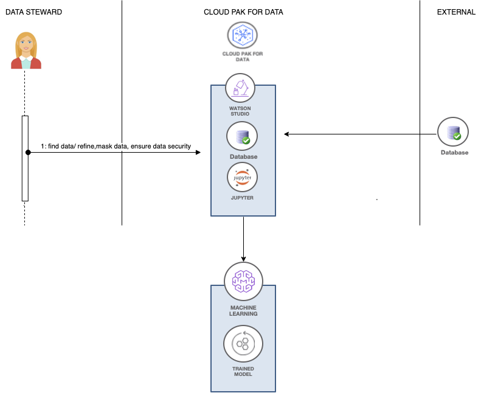
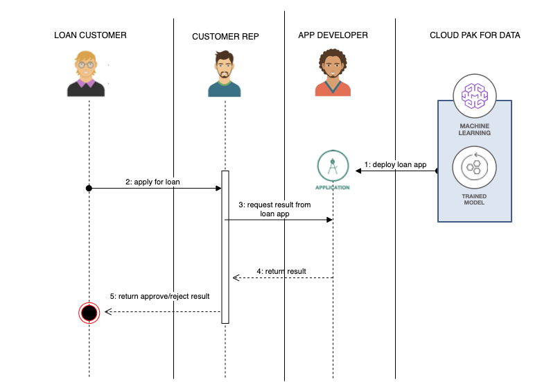
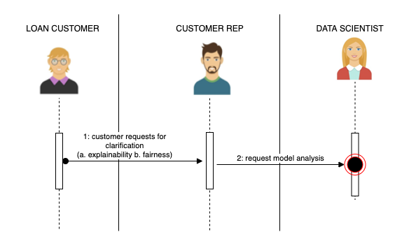
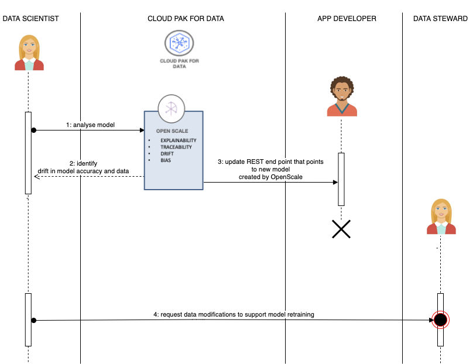
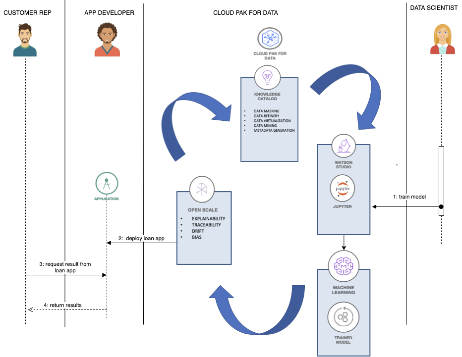

# 实现银行贷款部门现代化
旨在缩短决策时间和提高决策准确性的案例研究

**标签:** IBM Cloud Pak for Data,Watson OpenScale,Watson Studio,人工智能,分析,数据科学,机器学习

[原文链接](https://developer.ibm.com/zh/articles/modernizing-your-bank-loan-department/)

[Samaya Madhavan](https://developer.ibm.com/zh/profiles/smadhava), Laura Bennett, [Horea Porutiu](https://developer.ibm.com/zh/profiles/horea.porutiu)

发布: 2020-07-23

* * *

一家银行的消费贷款部门需要对客户的贷款申请进行多重审查，才能决定批准或拒绝贷款。在此过程中，贷款代理人或客户代表必须手动评估申请人所提供的信息，其中包括信用记录、存款、贷款期限、贷款金额和住房信息等。然后，将这些信息与类似申请人的大量历史数据进行比较和分析，以确定批准或拒绝其贷款是否存在风险。这个评估过程需要一段时间，这样一来，该银行的潜在客户就有可能流失到另一家银行。

为了缩短决策时间和提高决策准确性，越来越多的银行已经开始使用基于机器学习的解决方案。这种现代化方法使客户代表只需单击一个按钮，便可对贷款申请进行预测。

## 使用 IBM Cloud Pak for Data on Red Hat OpenShift 分析信贷风险

构建这一应用程序需要执行以下步骤。

1. 在 OpenShift 上设置 IBM® Cloud Pak® for Data
2. 管理和保护客户端数据
3. 开发和部署信贷风险模型
4. 在 Red Hat OpenShift 上部署贷款应用程序
5. 监控机器学习模型
6. ModelOps 周期

### 在 OpenShift 上设置 IBM Cloud Pak for Data

我们使用 [IBM Cloud Pak for Data](https://www.ibm.com/cn-zh/products/cloud-pak-for-data) 中提供的各种服务来分析数据，以及构建、部署和监控机器学习模型。IBM Cloud Pak for Data 是一个在 [RedHat OpenShift Kubernetes Container](https://www.openshift.com/products/container-platform) 上运行的数据和 AI 平台。

您可以通过 IBM Cloud 目录中的磁贴来安装 IBM Cloud Pak for Data，详细步骤可参见 [从 IBM Cloud 目录安装 Cloud Pak for Data](https://developer.ibm.com/tutorials/install-cloud-pak-for-data-from-the-ibm-cloud-catalog) 教程。

### 管理和保护客户端数据

收集和整理数据是构建机器学习管道的基础步骤。为使数据安全访问，从多个来源收集数据，以及实现数据可视化，IBM Cloud Pak for Data 提供了诸如 _data virtualization_ 和 _data refinery_ 之类的服务。

为分析风险预测而收集的数据包含敏感个人信息（例如社会保障编号），因此必须遵守法规和安全标准。为了处理这些政策、安全性和合规性因素以及治理数据，IBM Cloud Pak for Data 提供了一项名为 [Watson Knowledge Catalog](https://www.ibm.com/cn-zh/cloud/watson-knowledge-catalog) 的服务。

数据专员或管理员通常使用 Watson Knowledge Catalog 来掩藏敏感信息，制定适用于银行领域的规则和术语，以及确保数据安全。您可以使用 [实施数据治理以管理和保护客户端数据](https://developer.ibm.com/tutorials/implement-data-governance-to-manage-and-secure-clients-data/) 教程，了解使用 Watson Knowledge Catalog 来处理信贷风险数据集的步骤。

### 开发和部署信贷风险模型

实现银行贷款部门现代化的下一步是建立一个二元分类模型，用于预测特定申请是否存在风险。要构建此模型，需要将从上一步中获得的经过整理的数据用作为训练数据。为了支持数据科学家构建此模型管道，IBM Cloud Pak for Data 提供了 [Watson Studio](https://www.ibm.com/cn-zh/cloud/watson-studio) 服务。

在 Watson Studio 中，可以通过两种方式来创建这种模型管道。

1. 在 Jupyter Notebook 中编写 Python 代码。这种构建信贷风险模型的方法说明可参见 [在贷款部门平台中注入 AI](https://developer.ibm.com/tutorials/infuse-a-loan-department-platform-with-ai) 教程。

2. 运行 Watson AutoAI 以生成多个管道，并从中选出最佳管道。 [生成机器学习模型管道以选出适用于问题的最佳模型](https://developer.ibm.com/zh/tutorials/generate-machine-learning-model-pipelines-to-choose-the-best-model-for-your-problem-autoai/) 教程详细讨论了 Watson AutoAI 方法。

构建模型后，您可以使用 IBM Cloud Pak for Data 中提供的 [Watson Machine Learning](https://www.ibm.com/cn-zh/cloud/machine-learning) 服务来部署这些模型，以便其可以在环境外部使用。这两种方法都介绍了完成此部署的方式，而且该模型可以在 IBM Cloud Pak for Data 外部作为一种 RESTful 服务使用。

## 在 OpenShift 上部署贷款应用程序

数据科学家构建模型并使其可用后，应用程序开发者将创建一个 Web 应用程序。示例 Flask 应用程序调用了已部署的信贷模型，该示例应用程序已部署在 OpenShift 集群中。

然后，客户代表可以使用此 Web 应用程序提交申请人的详细信息，获取返回的结果。结果包括两种情况， _NO RISK_ 表示可以批准客户的贷款， _RISK_ 表示批准贷款存在风险。如果出现 RISK 结果，客户代表可以调整各项参数（比如贷款金额），然后再查看贷款能否获得批准。

## 监控机器学习模型

我们假设一位贷款客户通过使用这种现代化应用程序的银行申请了一笔贷款。如果该应用程序显示这位客户的贷款无法获得批准，那么客户有权知道贷款被拒绝的理由。

客户可以与客户代表交流，了解贷款被拒绝的理由。客户代表可以查看申请，有时能够得出一些猜测，例如申请的贷款金额太高或信用评分较低。但客户代表只能猜测。有时，机器学习模型的预测可能并不准确。

遇到这种情况，客户代表可以将这个案例返回给负责构建模型的数据科学家。数据科学家需要能够解释其数据模型生成现有结果的原因。

如果数据科学家无法解释和证明该模型产生的结果是公平的，那么数据科学家就需要找到 AI 模型的薄弱环节，了解哪些地方需要改进。

为了消除人们认为 AI 建模是个“黑匣子”的这种认知， [Watson OpenScale](https://www.ibm.com/cn-zh/cloud/watson-openscale) 可以帮助解释 AI 结果，例如分析银行应用程序从而找出偏差。

Watson OpenScale 可跟踪并衡量 AI 模型返回的结果，帮助确保这些模型的公平性、可解释性和合规性，无论您在任何地方构建或运行模型。Watson OpenScale 的设计是一种开放平台，能够与各种模型开发环境和各种开源工具（包括 TensorFlow、Keras、SparkML、Seldon、Amazon SageMaker 和 Azure Machine Learning）协同运行。

Watson OpenScale 提供一组监控和管理工具，可帮助您建立信任，并围绕 AI 投资实施控制和治理结构。

- 提供生产监控以确保合规性和安全性（例如审核模型决策和检测偏差）。
- 确保模型能够灵活应对多变的情况（例如漂移）。
- 使模型性能与业务成果（例如绩效和准确性）保持一致。

[使用 Watson OpenScale 监控模型偏移](https://developer.ibm.com/zh/tutorials/monitoring-model-drift-with-watson-openscale) 教程介绍了针对此用例如何监控数据的偏移或模型准确性的偏移。

## ModelOps 周期

目前为止，我们在本文中已经讨论了如何单独使用 IBM Cloud Pak for Data 中的某些服务来开发应用程序的不同部分。在下图中，我们将向您展示如何将不同的用户、技术和工具结合起来，端到端地开发和维护这种智能应用程序。

通过将一切结合起来，数据专员（图中未显示）使用 Watson Knowledge Catalog 来准备数据，然后通过 Watson Studio 来检索数据。接着，数据科学家使用准备好的数据进行训练，从而构建机器学习模型。数据科学家使用 Watson Machine Learning 部署模型。应用程序开发者构建了一个应用程序，该应用程序从内部调用上述模型以获取结果，将结果提供给客户代表。Watson OpenScale 监控此模型的可解释性、偏差和漂移。由于机器学习模型可通过发送给它的请求和接收到的反馈而不断学习，因此 IBM Cloud Pak for Data 中的流程能够循环进行。

本文翻译自： [Modernizing your bank loan department](https://developer.ibm.com/articles/modernizing-your-bank-loan-department/)（2020-06-19）