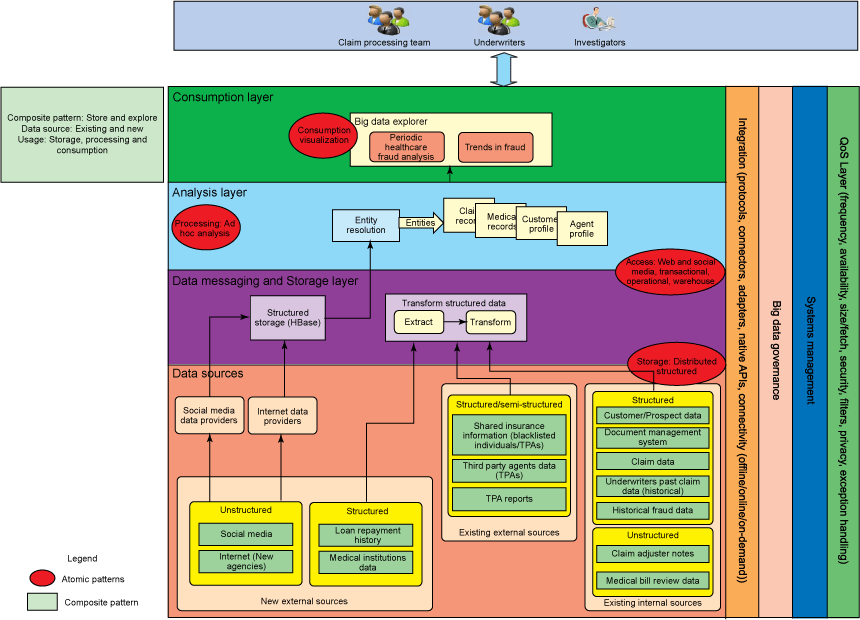
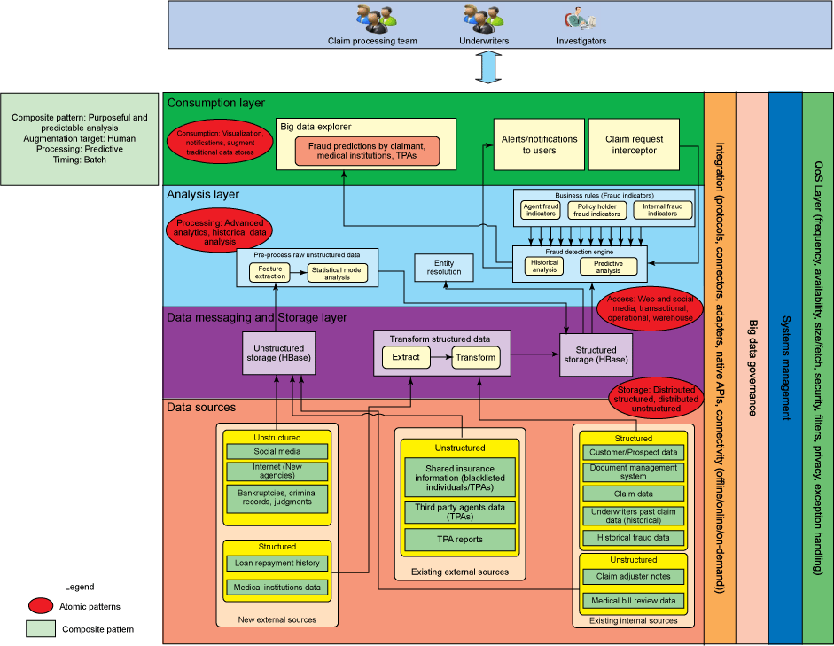
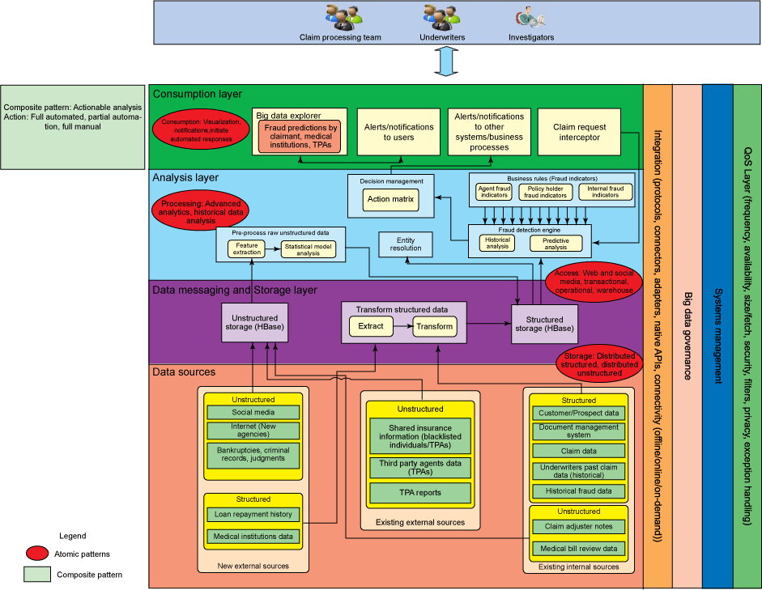
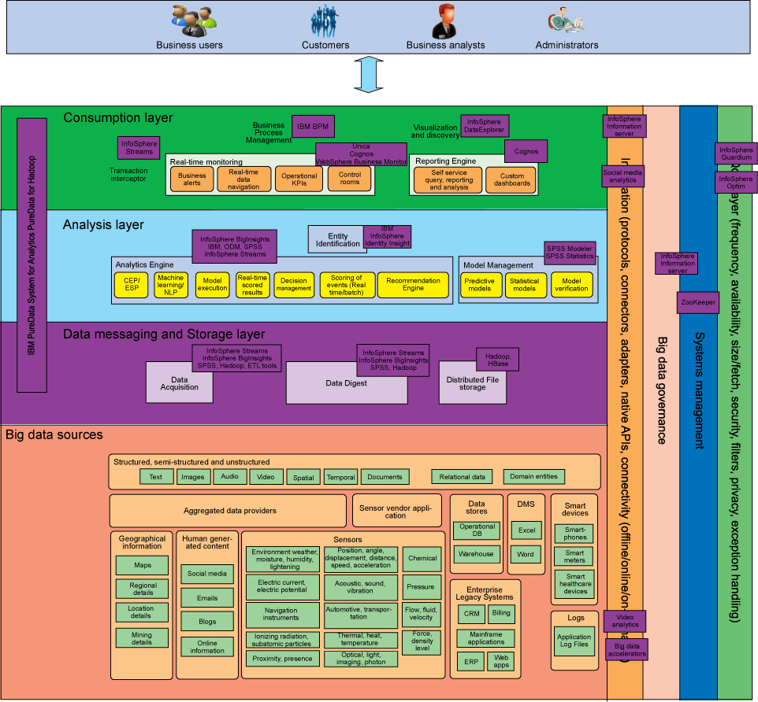

# 对大数据问题应用解决方案模式并选择实现它的产品
探索原子和复合模式，解决最常见和重复出现的大数据问题及其解决方案

**标签:** 分析,预测分析

[原文链接](https://developer.ibm.com/zh/articles/bd-archpatterns5/)

Divakar Mysore, Shrikant Khupat, Shweta Jain

发布: 2014-10-30

* * *

## 简介

本系列的 [第 3 部分](http://www.ibm.com/developerworks/cn/data/library/bd-archpatterns3/index.html) 描述了针对最常见的、经常发生的大数据问题及其解决方案的原子模式和复合模式。本文将推荐可以用于架构大数据解决方案的三个 _解决方案模式_ 。每个解决方案模式都使用了一个复合模式，该模式由逻辑组件构成（参见第 3 部分的介绍）。在本文末尾处，列出了产品和工具清单，它们可映射到每一个解决方案模式的组件。

## 解决方案模式

以下各节将介绍可以用于架构大数据解决方案的三个解决方案模式。为了说明这些模式，我们将它们应用到特定的用例（例如，如何检测医疗保险欺诈），但这些模式可以用于解决其他许多业务场景。每个解决方案模式都利用了一个复合模式的优势。在下表中，列出了本文介绍的解决方案模式，以及作为其基础的复合模式。

##### 每个解决方案模式所使用的复合模式

解决方案模式复合模式[解决方案模式：入门](#解决方案模式：入门)存储和探索[解决方案模式：获得高级业务洞察](#解决方案模式：获得高级业务洞察)专用和预测分析[解决方案模式：采取下一个最佳行动](#解决方案模式：采取下一个最佳行动)可操作的分析

## 用例描述：保险欺诈

财务欺诈对金融业的所有领域都带来了巨大的风险。在美国，保险公司每年要损失数十亿美元。在印度，仅仅是 2011 年的亏损总额就达到 3000 亿印度卢比。除了经济损失，保险公司还会失去一些业务，因为客户感到不满意。虽然许多保险监管机构已经定义了框架和流程来控制欺诈行为，但他们往往只是对欺诈做出反应，而不是采取主动措施来预防它们。传统的方法（如循环列入黑名单的客户、保险代理人和员工）并不能解决欺诈问题。

本文为大数据解决方案提出了一种解决方案模式，以本系列的第 3 部分中介绍的逻辑架构以及 [第 4 部分](http://www.ibm.com/developerworks/cn/data/library/bd-archpatterns4/index.html) 中介绍的复合模式为基础。

保险欺诈是为了让做出欺诈的当事人或其他关联方获得不正当或非法的好处的行为或疏忽。欺诈行为的种类包括：

- _**保单持有人欺诈和索赔欺诈**_ — 在购买和执行保险产品时对保险公司的欺诈包括提出保险索赔时的欺诈。
- _**中介欺诈**_ — 保险代理人、企业代理、中介或第三方代理人对保险公司或者保单持有人所做的欺诈。
- _**内部欺诈**_ — 保险公司的董事、经理，或其他任何人员或办公室成员对保险公司所做的欺诈。

### 目前的欺诈检测流程

保险监管委员会已经建立了反欺诈政策，其中包括明确定义的欺诈行为监控流程、搜索潜在的欺诈指标（并发布列表）的流程，以及与执法部门协调的流程。保险公司配置了专门分析欺诈索赔的工作人员。

### 目前的欺诈检测流程的问题

保险监管机构已明确定义了欺诈检测和缓解的流程。传统的解决方案使用的模型基于历史欺诈数据、被列入黑名单的客户和保险代理人，以及有关特定于领域的欺诈的数据。可用于检测欺诈的数据被局制于给定保险公司的 IT 系统和一些外部源。

目前的欺诈检测流程大多是手工的，只能处理有限的数据集。保险公司可能无法调查所有指标。通常很迟才检测到欺诈，而且保险公司很难对每个欺诈案例都进行适当的跟进。

目前的欺诈检测依赖于对现有欺诈案件的已知情况，所以每一种新型诈骗发生时，保险公司都不得不承担第一次的损失。最传统的方法在一个特定的数据源内工作，无法容纳不断增长的各种不同来源的数据。大数据解决方案可以帮助解决这些挑战，并在保险公司的欺诈检测中发挥重要作用。

## 解决方案模式：入门

该解决方案模式基于存储和探索复合模式。它集中处理数据的获得并存储来自企业内部或外部的不同来源的相关数据。在图 1 所示的数据源只是一个示例；领域专家可以识别适当的数据源。

因为必须收集、存储和处理来自多个来源的大量不同数据，此业务挑战是大数据解决方案的良好候选场景。

下图显示了解决方案模式，它映射到了在 [第 3 部分](http://www.ibm.com/developerworks/cn/data/library/bd-archpatterns3/index.html) 中介绍过的逻辑架构。

##### 图 1.入门解决方案模式

图 1 使用以下数据提供者：

- 外部数据源
- 结构化数据存储
- 经过转换的结构化数据
- 实体解析
- 大数据浏览器组件

医疗保健欺诈检测所需的数据可以从不同的数据源和系统中获得，比如银行、医疗机构、社交媒体和 Internet 机构。这些数据包括来自博客、社交媒体、新闻机构、各机构的报告，以及 X 光报告等来源的非结构化数据。更多示例请参见图 1 中的数据源层。利用大数据分析，这些不同来源的信息可相互关联和组合，并且被分析（在已定义规则的帮助下），以确定欺诈的可能性。

在这种模式中，所需的外部数据是从数据供应者那里获得的，他们贡献经过预处理的非结构化数据，这些数据已被转化为结构化或半结构化数据。在经过初始预处理后，这些数据被存储在大数据存储中。下一步是找出可能的实体，并从数据生成即席报告。

实体识别是在数据中识别命名元素的任务。识别分析所需的所有实体必须都被识别出来，包括那些与其他实体没有关系的松散实体。实体识别主要由数据科学家和业务分析师执行。实体解析可以像根据数据关系和上下文识别单一实体或复杂实体一样简单。此模式使用了简单形式的实体解析组件。

您可以简单地将结构化数据转换成最适合于分析的格式，并直接存储在大数据结构化存储中。

可以在此数据上执行即席查询，以获得相关信息：

- 给定的客户、区域、保险产品、代理或审批人员在给定期间内的整体欺诈风险
- 某些代理或审批人员，或跨保险公司的客户过往的索赔检查

顾名思义，组织一般采用这种模式开始使用大数据。组织采用探索式方法，根据可用的数据评估可以生成什么样的洞察。在这个阶段，组织一般不会对高级分析技术进行投资，比如机器学习、特征提取和文本分析。

## 解决方案模式：获得高级业务洞察

这种模式比入门模式更高级。它在索赔处理的三个阶段预测欺诈：

1. 索赔已经解决。
2. 索赔处理正在进行中。
3. 刚刚收到索赔请求。

对于前两种情况，可以批量处理索赔，而且可以启动欺诈检测流程，它可能是常规报告流程的一部分，也可以由业务请求启动。第 3 种情况可以近实时地进行处理。索赔请求拦截器会拦截索赔请求，启动欺诈检测流程（如果指示器报告这可能是一个欺诈案件），然后通知在系统中识别的利益相关者。越早检测到欺诈，风险或损失的严重性就会越低。

##### 图 2.获得高级业务洞察的解决方案模式

图 2 使用：

- 非结构化数据存储
- 结构化数据存储
- 经过转换的结构化数据
- 经过预处理的非结构化数据
- 实体解析
- 欺诈检测引擎
- 业务规则
- 大数据浏览器
- 对用户的警告和通知
- 索赔请求拦截器

在这个模式中，组织可以在分析之前选择对非结构化数据进行预处理。

数据被获取并按原样存储在非结构化数据存储中。然后，它被预处理成可以被分析层使用的格式。有时，预处理可能会非常复杂和费时。您可以使用机器学习技术进行文本分析，Hadoop Image Processing Framework 对于处理图像很有用。最广​​泛使用的技术是 JSON。经过预处理的数据随后被存储在结构化数据存储中，如 HBase。

此模式的核心组件是欺诈检测引擎，由高级分析功能构成，可以帮助预测欺诈。被明确定义并经常更新的欺诈指标有助于识别欺诈行为。下面欺诈指标可以帮助检测欺诈，并且可以使用技术来实现打击欺诈行为的系统。下面是常见欺诈指标的列表：

- 保单生效后不久进行索赔。
- 在处理索赔时发生严重核保失误。
- 被保险人在追求快速解决时具有明显的攻击性。
- 被保险人愿意接受小额赔偿，而不是记录所有损失。
- 文件的真实性值得怀疑。
- 被保险人在背后偿还贷款。
- 所产生的伤害是不可见的。
- 不存在已知伤亡的高价值索赔。
- 个人集群之间存在关系，包括保单持有人、医疗机构、联营公司、供应商与合作伙伴。
- 持牌及非持牌医疗服务提供者之间存在联系。

仅使用传统方法不足以预测诈骗。用户还需要使用社交网络分析来检测持牌及非持牌医疗服务提供者之间的联系，并检测保单持有人、医疗机构、联营公司、供应商与合作伙伴之间的关系。验证文件的真伪，并找到个人的信用评分，这是用传统方法难以完成的艰巨任务。

在分析过程中，对所有这些指标的搜索可能会在庞大数量的数据上同时发生。每一个指标都被加权。所有指标的加权总值表示预测欺诈的准确性和严重程度。

在分析完成后，可以向相关利益方发送警报和通知，并且可以生成报表，以显示分析结果。

此模式适合于需要使用大数据进行高级分析的企业，包括进行复杂的预处理，以利用先进的技术（如特征提取、实体解析、文本分析、机器学习和预测分析）可以进行分析的形式存储数据。这种模式不涉及采取任何行动或根据分析的输出提供建议。

## 解决方案模式：采取下一个最佳行动

在关于获得高级业务洞察的解决方案模式中所做的欺诈预测通常导致应采取特定行动，例如拒绝索赔，或暂缓赔偿，直至收到进一步的澄清和信息，或报告它，以采取法律行动。在这种模式中，为预测的每个结果定义了行动。这个行动对结果（action-to-outcome）的表被称为 _行动决策矩阵_ 。

##### 图 3.下一个最佳行动的解决方案模式

图 3 使用：

- 非结构化数据存储
- 结构化数据存储
- 经过转换的结构化数据
- 经过预处理的非结构化数据
- 实体解析
- 欺诈检测引擎
- 业务规则
- 决策矩阵
- 数据探索工具
- 对用户的警告和通知
- 索赔请求拦截器
- 对其他系统和业务流程组件的变更和通知

通常可以采取 3 种行动：

- 可以向利益相关者发送通知，以采取必要的行动，例如，通知用户采取针对申索人的法律行动。
- 系统在采取进一步行动之前通知用户，并等待用户的反馈。系统可以等待用户响应任务，也可以停止或暂缓索赔处理事务。
- 对于不需要人工干预的场景，系统可以采取自动行动。例如，系统可以向流程发送一个触发器，以停止理赔程序，并将有关申索人、代理人和审批人的信息通知给法律部门。

此模式适合于需要使用大数据进行高级分析的企业。此模式使用高级功能来检测欺诈行为，通知并提醒相关利益方，启动自动工作流，根据处理的结果采取行动。

## 形成大数据解决方案骨干的产品和技术

下图显示了大数据软件如何映射到第 3 部分中所描述的逻辑架构的各个组件。这些产品、技术或解决方案可以在大数据解决方案中使用；必须根据您自己的需求和环境来决定选择用于部署的工具。

图 4 显示了大数据设备，如 IBM PureData™ System for Hadoop 和 IBM PureData System for Analytics，它们跨越多个层次。这些设备具有内置的可视化、内置的分析加速器，以及单一系统控制台等特性。使用设备有很多优点。（请参阅 参考资料 ，了解有关 IBM PureData System for Hadoop 的更多信息。）

##### 图 4.映射到逻辑层次图的产品和技术

## 在欺诈检测中使用大数据分析的好处

与传统方法相比，使用大数据分析来检测欺诈具有多种优势。保险公司可以构建包含所有相关数据源的系统。一个包罗万象的系统有助于检测不常见的欺诈案件。预测模型等技术可以深入分析欺诈实例，筛选明显的案例，并参照低发欺诈案件执行进一步分析。

大数据解决方案还可以帮助建立整个企业的反欺诈工作的全局视角。通过链接组织内的关联信息，全局视角往往导致更好的欺诈检测。欺诈行为可以在多个起源点发生：理赔、保险退保、缴费、申请新的保单，或者与员工相关的欺诈或第三方欺诈。各种来源的数据相结合可以实现更好的预测。

分析技术使组织能够从非结构化数据中提取重要信息。虽然大量结构化信息存储在数据仓库中，大多数关于欺诈的关键信息都是非结构化数据，比如第三方报告，它们很少被分析。在大多数保险机构中，社交媒体数据没有被正确地存储或分析。

## 结束语

利用基于保险行业中的识别欺诈用例的业务场景，本文介绍了复杂性各不相同的几种解决方案模式。最简单的模式解决来自不同来源的数据的存储，并执行一些初步的探索。最复杂的模式涵盖如何从数据中获得洞察，并根据分析采取行动。

每一个业务场景都被映射到组成解决方案模式的相应原子模式和复合模式。架构师和设计师可以应用解决方案模式来定义高级的解决方案，以及相应的大数据解决方案的功能组件。

本文翻译自： [Apply a solution pattern to your big data problem and choose the products to implement it](https://developer.ibm.com/articles/bd-archpatterns5/)（2014-10-30）