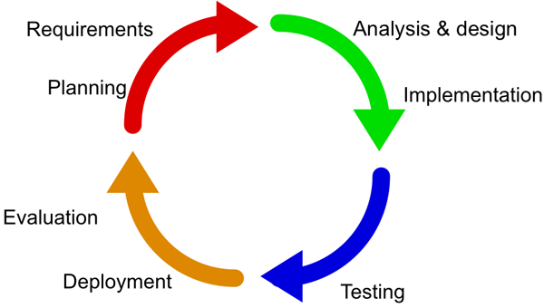
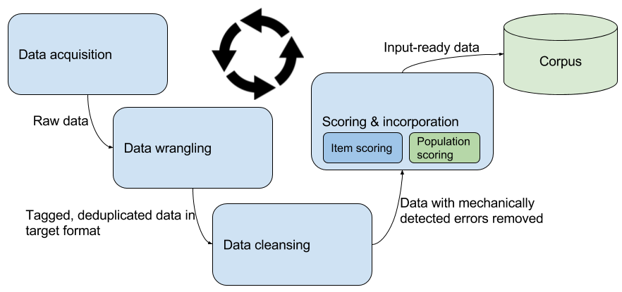

# 对提供给 AI 应用程序的数据应用软件开发生命周期
了解如何使用与执行代码相同的规则来处理 AI 数据

**标签:** 人工智能

[原文链接](https://developer.ibm.com/zh/articles/cc-cognitive-big-brained-data-pt2/)

Uche Ogbuji

发布: 2017-12-20

* * *

人工智能 (AI) 炙手可热，您的兴趣会让您喋喋不休地谈论正向或反向链、神经网络、深度学习、贝叶斯逻辑、集群、分类器系统等。这些都是 AI 技术，但 AI 被埋没的神奇能力来自它对所需数据的巨大数量和质量给予了同样的重视。实际上，AI 需要大数据。在我的上一篇教程“ [聪明的数据，第 1 部分](http://www.ibm.com/
/cn/cognitive/library/cc-cognitive-big-brained-data-pt1/index.html)”中，我深入介绍了数据在 AI 中的作用。在本教程中，我将介绍如何对用于 AI 应用程序的数据应用著名的软件开发生命周期 (SDLC) 的迭代版本。尽管有许多 AI 算法在以不同的方式使用数据，但机器学习是一种对当前的 AI 繁荣提供了最大助力的算法。出于这个原因，而且为了与上一篇教程一致，本教程中的大部分讨论和示例仍以机器学习为重点。

## AI 数据生命周期

考虑有效收集，准备和使用 AI 数据的最佳方式类似于软件开发生命周期。 本着与最近发展的敏捷开发的相同精神，我喜欢采用明确定义的、迭代式的方法来管理用于 AI 的数据，而不是采用严格的“瀑布（waterfalls）”方法。

开发人员应该已经熟悉迭代式 SDLC。在启动一个项目后，项目会进入规划和需求象限，然后在软件的整个寿命中持续迭代，真正将“周期”融入到生命周期中。该概念有诸多变体，包括认为部署就是在测试后退出该流程的概念。

当然，开发人员通常从功能规范、数据库模式、代码接口和结构图、程序代码和测试案例方面来考虑这些阶段。最好的情况是，设计中包含数据流图，但在 SDLC 中似乎经常零散地处理数据，这对 AI 发展是一种损害。

## 规划和需求

从整体上讲，团队可以做的最重要事情是，将对数据的需求连同一般性问题定义和对部署环境的理解一起包含在规划中。 如果团队正在使用需要训练实例的许多 AI 技术之一，团队应该确定要获取哪种训练数据。这取决于哪些数据可用，以及问题陈述和需求， 因为训练数据越多，就像部署软件所需的结果范围越多，成功的几率就越大。

可能有一种反馈循环，在该循环中，缺乏适用的训练数据会导致修改解决方案的需求。原始需求或许可以在未来的迭代中得到恢复。例如，假设团队正在开发一个鸢尾花标识器程序，但最初可用于训练的数据只有著名的鸢尾花数据集（参见 [第 1 部分](http://www.ibm.com/developerworks/cn/cognitive/library/cc-cognitive-big-brained-data-pt1/index.html) 了解更多信息）。团队可能决定，对于早期迭代，目标应是以较高的置信度从另外两个种类中识别出山鸢尾，但在区分维吉尼亚鸢尾和杂色鸢尾时接受较低的置信度。在以后的迭代中获得更好的技术或数据后，可以在自信地分配所有 3 个种类的方向提高预期。

## 分析和设计

在分析和设计代码时，您应该为 AI 整合原始数据源。开始收集此数据时，您会开始理解需要如何进行审查、扩充、维护和评估。尽早确定格式限制和参数，比如图像的最小和最大规格，或者音频的长度。对于像鸢尾花数据集这样的数据，不要忘记控制数据单位。您不希望将按英寸记录的测量值与按厘米记录的测量值混在一起。请记住资深数学老师的话，每个地方的每个数字都需要标注单位，无论是在数据值自身中（作为抽象数据类型），还是在数据模式中。在任何情况下，您可能都希望在代码或指令中包含某种单位验证或转换，以供专家评审。

应包含在数据设计中的一个非常重要但常常被忽略的方面是来源。每个数据项来自何处，我们能多有效地跟踪它？它在到达您的应用程序之前，在人员或系统中的保管链是什么？您的应用程序到底如何更改了它，是通过算法还是通过专家评审？如果发现异常、偏见原因或其他问题，来源可能是理解您需要修复或丢弃更大的聚合语料库中的哪些数据的关键。它对持续改进系统也很重要。随着您的应用程序发展成熟，而且您更深入地了解了哪些技术和流程是有效和无效的，您就可以拥有对数据源的相同理解。

第 1 部分更完整地解释了维度。在这一阶段，您还必须决定或重新考虑用作训练样本或用在算法中的数据维度。向数据添加更多细节是否会降低性能？这样做会改进结果，还是会由于维度灾难而损害结果的可靠性？分析和设计是您确立降维技术的常见阶段。

### 数据流

数据流图 (DFD) 是一种非常重要但利用不足的设计工件。在 20 世纪 70 年代末的很有影响力的期刊 _结构化设计_ 中，Ed Yourdon 和 Larry Constantine 第一次详细介绍了作为软件工程流程的一个关键部分的数据流图。这项工作基于 David Martin 和 Gerald Estrin 的更早期的工作。在线安全性等领域的开发人员认识到了数据流图对在线银行应用程序的重要性，因为需要将它从远程用户的浏览器传递到零售账本和后端对账系统中更安全的层。类似级别的详细描述是确定 AI 数据准备流程的重要部分，而这又是取得领域成功的一个重要因素。

AI 数据的 DFD 倾向于基于常见的数据获取和准备技术。下图是一个 DFD 的抽象版本，您应该基于问题领域的性质、数据的性质和您采用的算法，采用更具体的步骤来更新它。

数据流图关乎数据，而不是流程。圆角方框是流程，但应该从如何处理数据的角度描述它们。箭头是显示数据在流程中经历的步骤的键。数据的最终存储库是您的应用程序的语料库。尽管 DFD 不是流程流，但我提供了循环图标，以提醒该流程应持续运行，不断获取分析所需的新数据（比如数据集评分的结果）并注入语料库中。

为了帮助您针对自己的项目专门创建一个 DFD，这里描述了本示例中包含的一些抽象流程。

- 数据获取是获取最终包含在语料库中的原始数据的过程。这可以通过数字化或数据抓取（从网页或其他地方的某个来源暴力提取数据）的方式来完成。
- 数据整理这一过程将数据格式转换为输入所需的格式，检测机器所理解的元数据特征（包括来源）并标注数据。您还会在这里尝试识别离散的数据项并消除重复。
- 数据清理是评估已识别和标记的数据项，从而更正或删除遭到损坏、不完整或不准确的数据的过程。
- 评分和整合是指应用统计分析来确保结果语料库的整体健康。每个数据项都可以依据它与语料库维护需求的适合性来进行评分。可以对要添加到语料库的整个数据项集合进行评分，以确保它的组合方式能最大限度地提高算法的效率和准确性。

评分步骤的一个流行模型是探索性数据分析 (EDA)，它涉及到整个集合中不同变量之间的关系的可视化表示的许多组合。执行全面的 EDA 是成功降维的重要因素。

在本教程中，我将继续分析 SDLC 中的后面阶段，但至关重要的是接受如下原则：数据分析和准备是 AI SDLC 的所有阶段中的持续活动。

## 实施和测试

从早期出现的许多软件开发方法中学到的一个关键 SDLC 经验是，将实施落实到位。大部分人从事编程工作都是因为他们发现这是一项令人兴奋的事业。逐步指导计算机并观察它做一件特别的事情会让人激动不已。甚至搜索错误和寻找算法的改进之处也会让人万分激动。

这种心理因素意味着，开发人员始终倾向于尽快进入实施阶段，而没有对规划、分析、设计、结构化测试、系统管理和成功项目的其他方面予以足够重视。与实际编码相比，其他这些阶段看似很无聊，但经验和工程规范表明，项目问题与超支和超出时限的常见原因包括未能清楚地协调需求，以及对结构化测试的关注不够。

在 SDLC 图中，可以看到实施通常只是分析和设计的结尾部分，这种重视也延伸到了数据上。在实施阶段对数据进行关注主要是为了确保算法编码能忠实反映设计。

在测试期间，一切都会改变。在 AI 应用程序中，通过测试，可以看到所有数据收集和准备工作是否成功。训练数据经过算法处理并与预期结果进行比较。预期结果可能已在最初获取训练语料库的过程中获得，或者可能已从 SDLC 的前几次迭代中获得。在开发 AI 应用程序时，测试与评估之间的联系尤为受重视，而且这个关键节点也是 AI 通常需要比其他情况更多次地迭代 SDLC，才能将它用在生产中的原因。

## 评估，周期继续

测试的核心是比较预期结果与实际输出，这是对算法流程是否按预期训练了样本的机械评估。这只是确保 AI 生成了可靠、实用结果的过程的开始。评估通常由专家监督，专家负责处理来自潜在的真实应用程序的非计划数据。如果您在开发一个移动代理，您可能有一组来自多位已知发言人的短语录音，比如“加纳有多少人口？”，您可以将语音回复与预期答案相比较。评估可能包括让新发言人询问同样的问题或稍微变化的问题，比如“尼日利亚有多少人口？”，评估结果的专家能更好地理解该代理在更真实的条件下提供的可能结果。

评估过程通常包括部署应用程序，让公测人员使用它，然后让客户使用它。来自所有这些数据的反馈可以指导后续规划阶段，从而帮助完成后续迭代。或许来自现场的报告表明，该代理无法区分一些发言人的问题“加纳有多少人口？”与“圭亚那有多少人口？”这可能变成一个用于后续迭代中的训练和测试的重要样本。

## 结束语

第一篇 [教程](http://www.ibm.com/developerworks/cn/cognitive/library/cc-cognitive-big-brained-data-pt1/index.html) 介绍了数据对创建 AI 和认知应用程序有多重要，以及这种重要性如何在该学科的整个历史中延续，以及它与历史上的 AI 成败有何联系。在本教程中，我解释了如何按照处理代码的相同原则，在一个与代码类似的流程中处理 AI 数据。应用传统的迭代式 SDLC 来充分利用目前可用的大量数据带来的优势，同时对危险保持警惕。

本文翻译自： [Apply the software development lifecycle to the data that feeds AI applications](https://developer.ibm.com/articles/cc-cognitive-big-brained-data-pt2/)（2017-10-02）