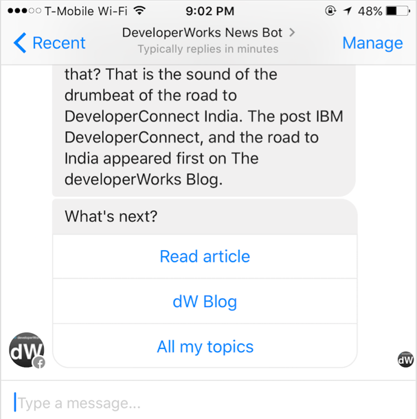
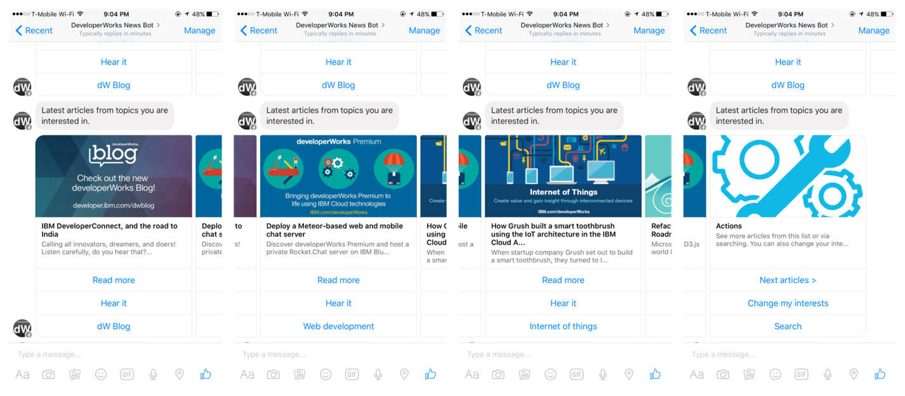
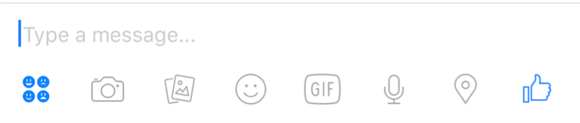
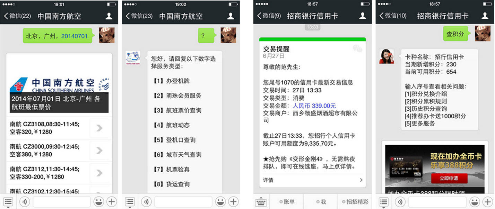

# 对话聊天框设计挑战
Learn why chatbots can fail and what can be done to make them successful

**标签:** 人工智能

[原文链接](https://developer.ibm.com/zh/articles/cc-cognitive-chatbot-conversational-design/)

Michael Yuan

发布: 2016-12-21

* * *

用户喜欢聊天机器人，因为它们非常简单且要求极低 — 它们可以简单到只是一种线索式文本对话。用户喜欢停留在他们最喜欢的消息应用程序内。他们希望直奔主题，而无需导航应用程序、Web URL、菜单、按钮、广告、谷歌浏览器和其他元素。但是，这种简单性也存在巨大的设计挑战。聊天机器人必须准确地理解用户输入的信息，并采取恰当的行动。甚至对于如今最优秀的自然语言人工智能 (AI)，这也是非常离谱的要求。

考虑到 AI 的当前发展状态，线索式文本对话或对话 UI (CUI) 几乎总是没有精心设计的图形 UI (GUI) 受欢迎。与 GUI 相比，CUI 仍处于发展初期。作为一个社区，我们仍在探索 CUI 的设计模式和最佳实践。在本教程中，我将解释聊天机器人差强人意的原因，以及如何才能成功地实现它们。

**备注：** Robert Kosara 博士最近发表一篇题为“ [拟人化用户界面的陷阱](https://eagereyes.org/blog/2016/the-personified-user-interface-trap)” 的博客文章。他描述了 Shneiderman 和 Maes 在 1997 年对于 UI 的“直接操作”与“接口代理”样式的争议。他的结论是，20 年前的教训今天仍然适用：除非“代理”能完美地预测用户的需求（完美的 AI），否则为用户呈现一个 GUI 窗口会更好一些，因为信息更容易被发现，而且交互不需要“语法”。但是，用户对其喜爱的消息应用程序中的极简 UI 表现出的强烈喜欢不容忽视。

## 聊天机器人失败的原因

Facebook 在 2016 年 4 月启动它的机器人平台后，许多人试用了“启动伙伴”特色功能，发现 [存在很多缺陷](http://gizmodo.com/facebook-messenger-chatbots-are-more-frustrating-than-h-1770732045)。聊天机器人 [甚至无法理解其应用领域中的基本问题](http://techcrunch.com/2016/04/13/facebooks-new-chatbots-still-need-work/) （例如，检查天气或鲜花快递。尤其令人痛苦的是，当用户尝试“自然地”谈话并偏离聊天机器人期望的机械式问题时，就会看到 [机器人崩溃](https://www.theguardian.com/technology/2016/apr/14/facebook-messenger-spammy-chatbot-must-improve-and-fast)。

Facebook Messenger 产品经理 Mikhail Larionnov 检查了 Facebook 平台上的许多聊天机器人，确定了一些聊天机器人缺乏吸引力的 3 个原因：

- 受理工作做得不好，对聊天机器人的用途解释得非常少
- 尝试在一个聊天机器人中实现太多用途，价值不明确
- 过于依赖自然语言处理

## 创建成功的聊天机器人的方式

但是，Larionnov 也提供了一些解决这些问题的具体建议。

首先，聊天机器人应拥有非常有限的范围。它应在一个很小的主题上提供价值，并将这件事做好。更重要的是，应该能用一两句话解释它的操作。

第二，在用户受理过程中，您应该使用每个消息平台的内置功能表达聊天机器人的特性。Facebook Messenger 采用了精心设计的问候窗口和操作要求。对于 Slack，该功能就是机器人商店中的描述。

第三，您应该尽可能多地使用结构化按钮。如果需要采用自由用户输入格式，则需要处理 AI 无法理解输入的情况，并提供有关如何正确使用语法的帮助消息。聊天机器人的语法是触发操作的命令和关键词。

我还想添加第 4 点，那就是您不能刷屏。聊天机器人必须理解并响应停止、退订和取消等命令。此外，它应该立即停止发送消息。如果您的机器人向用户发送了大量不想要的消息，用户除了屏蔽您的聊天机器人外，别无选择。据知，如果 4% 的用户屏蔽了您的聊天机器人，Facebook 就会将您的聊天机器人下线。

## 设计一个命令控制 CUI

CUI 通常会提醒人们输入 DOS 和 UNIX 时代古老的计算机命令。事实上，当聊天机器人最初流行时，他们被开发人员广泛用于执行高技术任务。例如，GitHub 的 [HUBOT](https://hubot.github.com/) 在内部使用命令来管理许多操作。在该使用案例中，“对话”通常是开发人员直接将命令输入聊天窗口，然后机器人执行这些命令。这是否意味着，构建一个机器人来响应用户必须记住的预定义命令是可接受的？在许多情况下确实如此。

我们来查看两个使用案例：

- 用于工作和生产的聊天机器人可能更适合命令。这些聊天机器人用户通常是精通计算机的专业人员，他们习惯于在工作中使用命令。事实上，许多超级用户已掌握应用缓慢的 GUI 执行重复任务的命令行提示和键盘快捷键。所以，在此场景中，高效的“命令行”机器人或许比聊天式机器人更可取。
- 随计算机一起成长的年轻用户一生都在使用文本消息。他们可能更注重命令的效率而不是缓慢的 GUI。

如果您设计一个命令控制 CUI，以下是一些具体的设计考虑因素：

- 提供自动完成或其他形式的帮助，确保用户能够正确地拼写命令。特别关注 iOS 和 Android 设备的自动更正功能，因为如果用户命令的拼写不合常规，它们可以修改用户的输入。内置命令帮助的一个不错示例是 Slack 的 Slash 命令。Slack 应用程序 UI 建议正确的拼写，并对您键入的命令提供解释。
- 编写您的聊天机器人来容忍常见的拼写错误或同义词。例如，“help” 也可以是 “How do I do this?”。此场景要求创建一个同义词列表，其中许多同义词可以是正则表达式，并在运行时将它们与用户输入进行匹配。

## 设计一种填空式的简单对话

与命令行相反的是可与用户进行自然对话的聊天机器人。但是，考虑到自然语言 AI 的当前发展状态，与用户进行任意范围的对话几乎不可能。而且您不需要这么做。聊天机器人要想变得实用，通常只需使用高度脚本化的对话。例如，要询问聊天机器人天气，您可能会说：

`德克萨斯州奥斯汀明天是什么天气？`

在这里可以注意到，您拥有：

- 意图：天气报告
- 地点：德克萨斯州奥斯汀
- 时间：明天

聊天机器人现在可以查询天气。但是有时候，用户没有一次提供所有信息。如果用户最开始仅提供了意图，聊天机器人应能要求用户完成其他所需的参数，这些参数称为空位。这是可能的对话情形：

```
Human: What is the weather?

Bot: I will look up weather for you. Do you want to check your local weather or somewhere else?

Human: Somewhere else

Bot: Okay, where is it?

Human: Austin Texas

Bot: Thanks. Do you want to know the weather right now or do you want a forecast?

Human: Forecast

Bot: Okay, when?

Human: Tomorrow

Bot: The weather tomorrow at Austin, Texas, is sunny with a high of 80 degrees and low of 75 degrees.

```

Show moreShow more icon

您已获得想要的信息。这种高度脚本化的对话可能在许多场景中发生。一般而言，当您要求机器人执行某项任务时，机器人应该能够进行一次简短对话来填上所有需要的空位。

有一些工具能够帮助您进行这些对话。例如， [IBM Watson Assistant 服务](https://cloud.ibm.com/catalog/services/watson-assistant?cm_sp=ibmdev-_-developer-articles-_-cloudreg) 可支持在对话脚本中填空。

## 交互式对话的设计

命令和填空式对话是解决缺乏真正的对话 AI 的有效方式。但还有另外一种更直接的方法 – 在要求特定回复的消息后显示按钮。以便您能清晰地传达希望用户提供的回复。这是一个 Facebook Messenger 聊天会话内的按钮示例。



如果没有这些按钮，聊天机器人通常会提供编号选项或关键词选项（例如，“回复 1 读取更多信息，回复 2 查看所有故事”）。这种交互类型通常给人一种机械化的感觉。无论如何，当聊天机器人要求用户从一个编号列表中进行选择时，它应该能够处理用户输入，比如 1、一、第一、第一个选择和其他同义词。

请记住，用户可能未使用您提供的按钮或编号列表。用户可能跳过按钮并键入完全不同的信息。一个常见的示例是，用户看到一组按钮时，不知道如何回复，而键入 `help` 或 `menu`。您的聊天机器人应准备好应对这种场景，通过分析任何自由回复来查看用户是做出了您请求的选择，还是希望启动一个全新的任务。

当然，如果您拥有按钮，也可以拥有其他交互式元素。例如，Facebook Messenger 支持一个可水平滚动的滚轮。这是提供一组选项的好方法，无需让一个非常长的列表塞满整个窗口。



## 预测多模式用户输入

现代消息应用程序的一个不错功能是，能够发送图像、音频、视频、表情、位置和其他输入。Facebook Messenger 是这类丰富的聊天功能的一个好示例。



自然，一些用户更倾向于使用语音通信，而其他用户可能喜欢发送图片。最好通过一个位置来回答“您在哪里”的问题。Facebook Messenger 为您的聊天机器人提供了所有这些用户生成的资源。但您的聊天机器人需要弄清楚它们的含义（例如，语音到文本转换、图像识别、OCR、经纬度与地址的映射，以及其他输入）。

**备注：** 不同的消息应用程序支持不同类型的用户生成的多模式输入，而且它们提供了不同的方法将此数据发送到聊天机器人。因此，很难创建一个在所有消息应用程序中一致运行的通用跨平台聊天机器人。

## 粗鲁用户与作家 UI 设计师

在编写聊天机器人时，需要预测用户可能提供的各种各样的信息。有时，用户会故意粗鲁地对待聊天机器人，只为了挑战极限，看看聊天机器人会如何反应。您应准备许多机智的回复来处理粗鲁的评论。

一般而言，对于您的所有回复，您首先应该检测用户的意图，然后对该意图尝试不同的回复。与一次又一次地看到聊天机器人的准确回复相比，没有什么让人感觉更机械化。对话管理工具（比如 API.ai 和 IBM Watson [Assistant](https://cloud.ibm.com/catalog/services/watson-assistant?cm_sp=ibmdev-_-developer-articles-_-cloudreg) 或 [Dialog](https://www.ibm.com/watson/developercloud/dialog.html) 服务）可帮助您在每个场景中从一个预备答案列表中随机选择答案。

对聊天机器人提供机智的回复和个性的需求，催生了“作家即 UI 设计师”运动。 [据报道，硅谷公司正在招聘英语专业生和诗人](https://www.washingtonpost.com/news/the-switch/wp/2016/04/07/why-poets-are-flocking-to-silicon-valley/) 来改善其初生的机器人。

## 案例分析：来自微信的教训

微信是中国最大的消息平台，每月拥有 7 亿多活跃用户。2013 年，微信开辟了一个名为“公众号”的非常成功的机器人程序。从聊天机器人交互方面讲，微信上有哪些成功或失败之处？

微信目前支持两种公众号机器人：订阅号和服务号。二者最开始都是聊天机器人，但也逐渐演变为不太关注“人工智能聊天”。两种公众号都支持 CUI。

订阅号由内容发布者用来向其订阅者提供新内容。通常，发布者每天一次向其所有订阅者发送当天的新内容文章列表。

用户也可以回复文本来获得具体的文章或执行具体操作，例如：

- 一篇文章可能说“输入 42 下载文中提到的 PowerPoint 幻灯片”。
- 用户可以输入 “toc” 获取最近发表的文章的列表。
- 用户可以输入 “contact” 获取一个 Web 链接来联系订阅号管理员。

请注意，这些都是非常简单的命令或触发关键词。它们旨在快速将您引导至网页或下载地址。很少有订阅号（如果有）尝试与用户进行漫长的自然语言对话。

客户服务部门使用服务号在微信上与其客户交互。示例包括航空公司、酒店或电子商务商店。微信很早就认识到，AI 自动聊天机器人无法处理人类客户支持问题。因此，与 Facebook 页面非常相似，每个服务号可以将一个或多个人类用户帐户指定为“支持人员”。

以下这些屏幕截图显示了来自一个航空公司和一个信用卡公司的实际的客户服务聊天会话。尽管文字为中文，但您可以想象这里经历的过程。这同样是简单的触发文字和命令。



对于一些客户服务号，服务号所有者会尝试与用户进行更长的对话。同样地，对话仅在开头是自动化的，在机器人发现用户的意图后，聊天很快转移到一个相关的网页（例如重新预定机票）或与该服务号相关的人类代理。

微信高度发展的机器人生态系统带来的关键结论是：

- 不同的机器人应用程序需要不同风格的对话 UI。对于许多机器人，引导至一个 Web 视图的简单命令或触发文字就足够了。
- 更长的机器人对话适合高度脚本化的使用案例，比如特定产品的客户支持。即使在那时，根据需要将用户转移到 Web 应用程序或人类代理仍是明智之举。
- 消息机器人的价值通常体现在与平台集成，以便机器人可无缝地访问用户的身份、支付信息和其他信息。

## 结束语

在本教程中，我讨论了聊天机器人的对话设计面临的关键问题，列出了创建成功的机器人的方式，而且通过分析微信消息平台演示了这些方式。我建议了 3 种交互类型：命令控制、填空和交互式对话。我还提及了多模式用户输入和如何富有创意地提供回复。

本文翻译自： [The conversational chatbox design challenge](https://developer.ibm.com/articles/cc-cognitive-chatbot-conversational-design/)（2016-08-15）