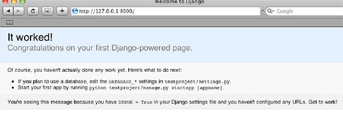
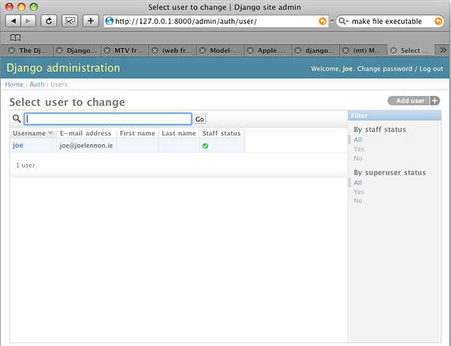

# 将 Django 应用程序部署到生产服务器
一个基于 Python 的开源 Web 应用程序框架

**标签:** Python,Web 开发

[原文链接](https://developer.ibm.com/zh/articles/os-django/)

Joe Lennon

发布: 2009-05-04

* * *

## Django

Django 是一个针对 Python 语言的开源 Web 开发框架，其目的是尽可能自动化更多的开发流程，使您能够专注于软件开发。这个框架既是松散耦合的，又是紧密相连的，因为框架的各个部分可以相互连接，但它们之间是彼此独立的。框架的独立性意味着您可以仅使用所需的 Django 部分，而不用担心依赖性带来的问题。

Django 加快了 Web 应用程序的编写，并且大大减少了所需的代码，从而使维护应用程序更加容易。Django 严格遵循 Don’t Repeat Yourself (DRY) 原则，因此每个不同的代码片段或数据仅在一个位置上出现。这意味着需要进行更改时，只修改一个地方就行，从而使更改软件更快、更轻松。

Django 是由 Lawrence Journal-World 报的 Web 开发团队在 2003 年开发的。当时该团队需要在很紧迫的时间内发布应用程序和改进，因此他们决定创建一个能节省时间的 Web 框架，以在期限内交付产品。该团队在 2005 年 7 月以开源软件的方式发布了这个框架，现在由来自世界各地的开发人员进行维护和开发。

Django 框架是在 Berkeley Software Distribution (BSD) 开源许可下发布的，因此能够再分发或重用这些源代码和二进制文件（可以修改），但必须在再分发包中保留版权需知、许可条款和免责声明。这些注意事项必须包含在再分发软件的文档和补充材料中。该许可规定，在未获得书面许可的情况下，不得使用 Django 这个名称或 Django 贡献者的名称冠名或促销衍生产品。

## 设置基本的 Django 开发环境

由于 Django 的安装非常直观，所以能够轻松地设置开发环境。Django 完全是用 Python 编写的，因此在安装 Django 之前必须先安装 Python。如果您使用 Mac OS X 或 Linux® 操作系统，可能已经安装了 Python。仅需在 shell 中运行 `python` （在 Mac 上使用 Terminal.app），您就可以看见清单 1 所示的内容。

##### 清单 1\. 确保 Python 正在运行

```
$ python
Python 2.5.1 (r251:54863, Nov 11 2008, 17:46:48)
[GCC 4.0.1 (Apple Inc. build 5465)] on darwin
Type "help", "copyright", "credits" or "license" for more information.
Listing 1 - Checking for Python on Mac OS X

```

Show moreShow more icon

只要您的系统安装了 2.3 至 2.6 版本的 Python，就能够安装 Django。如果您是 Microsoft® Windows® 用户，或者您需要升级到更新的版本，请 [下载 Python](http://www.python.org/download/) 。有一个针对 Windows 用户的简单的安装包，因此安装 Python 应该不会很难。

当您确定您的计算机已经安装了 Python 之后，就可以进一步安装 Django 了。Django 有 3 个安装选项：安装官方发布版，安装用于分发的安装包，或安装来自 Subversion 的最新的 “trunk” 版本。对于本文，我只介绍官方发布版的安装。关于 trunk 版本的安装信息，请参阅官方文档说明（见 参考资料 ）。

安装官方 Django 发布版的第一步是从 Django 下载页面获取 tarball。下载这个文件之后，对其进行解压缩。在 Linux 中，仅需在 shell 提示符处发出以下命令（确保导航到下载该包的目录）。注意，V1.0.2 是撰写本文时的最新版本，因此要用您下载的包的文件名替换这个文件名： `tar zxvf Django-1.0.2-final.tar.gz` 。

在 Mac OS X 中，Web 浏览器很可能会在下载完成之后自动解压缩这个包，因此得到的文件是 Django-1.0.2-final.tar。使用以下命令解压缩这个文件： `tar xvf Django-1.0.2-final.tar` 。如果您使用的是 Windows，您可以使用类似于 7-Zip 的工具解压缩这个 tarball。

解压缩 tarball 之后（可能解压缩到硬盘上类似于 Django-1.0.2-final 的位置），在命令提示符中导航到相应的文件夹。要安装 Django，发出以下命令（Mac OS X 或 Linux）： `sudo python setup.py install` 。对于 Windows 用户，确保已经使用管理员特权打开命令提示符，并发出以下命令： `setup.py install` 。

完成以上操作之后，Django 将被安装到您的 Python 安装的 site-packages 文件夹中，您可以开始在 Django 中进行开发了。在剖析 Django 应用程序之前，我们先测试开发环境是否正确。首先，我们检查 Django 是否安装正常。打开 shell 或命令提示符，并发出命令 `python` 启动 Python 交互工具。现在，在 Python 提示符上发出如清单 2 所示的命令（不要输入 `>>>` ）：

##### 清单 2\. 检查 Django 是否正确安装

```
>>> import django
>>> django.VERSION

```

Show moreShow more icon

如果安装成功，将看到如清单 3 所示的文本。

##### 清单 3\. 成功安装

```
(1, 0, 2, 'final', 0)
>>>

```

Show moreShow more icon

在检查到 Django 已正确安装之后，我们还需要测试开发服务器是否正常工作。为此，我们需要创建一个项目。创建一个目录（我的 Mac OS X 系统使用的是 /home/joe/django）来储存您的 Django 项目，然后导航到该目录。在这里，使用命令： `django-admin.py startproject testproject` 。

这将在您的项目目录内创建一个新的目录 testproject。这个目录包含 4 个文件： **init**.py、manage.py、settings.py 和 urls.py。现在还不要考虑这些文件是做什么的；我们跳过这步，先运行项目。确保您现在在项目文件夹中（在提示符上使用 `cd testproject` ），并发出命令： `python manage.py runserver` 。您应该看到如下所示的输出。

##### 清单 4\. 运行 Django 开发服务器

```
Validating models...
0 errors found

Django version 1.0.2 final, using settings 'testproject.settings'
Development server is running at http://127.0.0.1:8000/
Quit the server with CONTROL-C.

```

Show moreShow more icon

这个消息告诉我们开发服务器在 URL `http://127.0.0.1:8000/` 上运行。打开您最喜欢的 Web 浏览器，并将这个 URL 粘贴到地址栏。您应该会看到如下所示的页面。

##### 图 1\. Welcome to Django 页面



现在，您已经有一个正在运行的 Django 开发环境。需要注意，尽管您可以在这个环境中运行完整的 Django 应用程序，但它并不适合在生产环境中使用。我们将在本文的后面讨论部署用于生产的 Django 应用程序。

## 剖析 Django 应用程序

Django 的架构松散地基于模型-视图-控制器（Model-View-Controller，MVC）模式。在该模式中，应用程序逻辑、用户界面（UI）和数据访问层是分开的，从而允许在不影响到其他层的情况下独立地修改各个层。不过，根据 Django 文档的描述，Django 采用的是类似的模式： _模型-模板-视图（Model-Template-View，MTV）_ 架构。这里的模型可以看作数据访问层，应用程序在这里与其他数据库和信息源交互。模板层定义向用户显示数据的方式，这相当于 MVC 模式中的视图层。在 MTV 架构中，视图层描述应该向用户显示哪些数据。它不定义数据的显示方式；它将这个任务交给模板层处理。至于 MVC 的控制器层，Django 将它看作框架本身，因为它决定向其发送请求的视图（像在 URL 配置中定义的那样）。

除了模型、模板和视图层之外，Django 还提供一些高级的开箱即用的特性，比如 URL 配置、自动管理界面和缓存等。像 Python 一样，Django 背后的关键思想之一就是 “大批包含”，这意味着它自带了大量由其他包组成的标准库，您可以在应用程序中直接使用，而不需另外下载。

Django 应用程序的模型层由 Django 的数据访问层处理。在这个层中，可以找到所有与数据相关的内容：连接设置、验证参数和关系等等。Django 开箱即用地支持 PostgreSQL（Django 创建者最喜欢的数据库）、MySQL、SQLite 和 Oracle。在设置文件中储存了可以使用的数据库，选择哪个数据库对模型层没有任何影响。

Django 中的模型可以看作是对用 Python 代码表示的数据库表架构的描述。Django 使用模型在数据库中生成和执行 SQL 语句，反过来，这些 SQL 语句会返回一个结果。然后 Django 切换到一个您的 Django 应用程序可以使用的 Python 数据结构。在这里，一个明显的优势就是您可以在不同的数据库系统之间进行热切换（例如，从 MySQL 切换到 PostgreSQL），并且不需要更改您的模型。

清单 5 中的代码是一个示例模型定义。它通常存储在 Django 应用程序目录下的 models.py 文件中。

##### 清单 5\. 示例 Django 模型

```
from django.db import models

class Person(models.Model):
    first_name = models.CharField(max_length=30)
    last_name = models.CharField(max_length=30)
    email = models.EmailField()
    date_of_birth = models.DateField()

```

Show moreShow more icon

Django 应用程序的模板层允许您将 Web 应用程序的 UI 或显示布局与它的数据分开。它使用占位符变量和简单的逻辑语句定义应该在模板中填充的数据。模板通常输出 HTML 文档，但也可以输出 XML 或其他类型的文档。

模板层背后的思想就是表示层代码与业务层代码分离。这意味着 Python 开发人员可以专注于开发软件，而由 Web 设计人员处理模板。此外，开发人员和设计人员还可以同时开发同一个项目，因为这两个组件是完全分离的。

注意，Django 的模板系统不允许直接从模板执行 Python 代码。它提供一组基础的编程特性，比如变量、逻辑语句（ `if` 语句）和循环结构（比如 `for` 循环），这就为数据表示提供充足的逻辑。清单 6 是一个示例 Django 模板。

##### 清单 6\. 示例 Django 模板

```
<html> <head>
<title>Your message has been sent</title>
</head>
<body>
<h1>Thank you!</h1>
<p>Just wanted to say a quick thanks, {{ name }}, for the message you have just
    sent.</p>
<p>It was sent on {{ sent_date|date:"j F Y" }}. We aim to respond within
    48 hours.</p>
<p>Thanks again!</p>
</body>
</html>

```

Show moreShow more icon

清单 7 显示了如何在 Django 应用程序中使用这个模板。

##### 清单 7\. 在视图中加载示例 Django 模板

```
def send_message(request):
    name = "Joe Lennon"
    sent_date = datetime.datetime.now()
    return render_to_response('thankyou.html', locals())

```

Show moreShow more icon

_视图函数_ （通常称为 “视图”）是基础的 Python 函数，它接受一个请求参数并返回一个响应。这种请求通常来自 Web 服务器，视图接受随该请求一起传递的所有参数。然后该视图在返回响应之前，执行确定适当的响应所需的逻辑。可以将视图储存在 Django 应用程序中的任意位置，但它们通常储存在名为 views.py 的文件中。清单 5 是一个示例视图函数 `send_message` 。它接受 `request` 参数，并返回一个显示模板（thankyou.html）作为响应。

您刚才了解到可以将视图储存在任何位置。但是如果真这样做的话，Django 如何找到它们呢？这就需要用到 _URLconfs_ ，它定义 URL 和与之对应的视图的关系。URLconfs 储存在一个称为 urls.py 的文件中，并且将 URL 映射到视图函数中。例如，url /send\_message/ 将映射到我们的 send\_message 视图，如清单 7 所示。事实上，URLconfs 的工作方式允许它使用更简洁的 URL — 换句话说，您的 URL 可能不是查询字符串 `myfile.php?param1=value1` ，而是 /myfile/value1/。

清单 8 中的代码是一个示例 urls.py 文件，它像在清单 7 中定义的那样，将 URL `/send_message/` 连接到我们的 `send_message` 视图函数。

##### 清单 8\. 示例 URLconf

```
from django.conf.urls.defaults import *
from testproject.views import send_message

urlpatterns = patterns('',
    ('^send_message/$', send_message),
)

```

Show moreShow more icon

最有趣、最经常被提起的 Django 特性之一就是它的自动管理界面。有些项目不仅需要开发前端界面，而且还要开发后端管理界面，参与这些项目的 Web 应用程序开发人员将会尝到沮丧和烦恼的滋味。管理界面通常很枯燥，并且没有什么技巧可谈，您的编程能力在此也无用武之地。Django 的自动管理界面特性在这里能帮上大忙，因为它通过自动化整个任务轻松满足这一需求。

当您为应用程序创建了模型并设置好数据库之后，您就可以为它启用管理界面了。完成之后，将浏览器指向 `http://127.0.0.1:8000/admin/` 并登录以管理 Django 应用程序的后端。这个界面是高度可定制的，并且具有优秀的基于用户和组的身份认证控件。下面是它的屏幕截图。

##### 图 2\. Django 自动管理界面的实际效果



我们已经概述过如何创建 Django 应用程序，以及它所基于的 MTV 模式是如何工作的。我们查看了模型、模板、视图和 URLconfs 等概念；并且稍微了解了 Django 优秀的自动管理界面系统。如果您想深入了解如何开发 Django 应用程序，请访问 Django 项目的官方 Web 站点，阅读其中的文档或 _Django Book_ （见 参考资料 ）。它们出色地介绍了关于 Django 的各个方面，并且非常详尽。

接下来，检查一下 Django 应用程序，然后将其部署到生产服务器。

## 准备部署 Django 应用程序

我们在前面已经看到，Django 框架还包含了一个开发服务器，用它调试和测试 Django 应用程序非常方便。不幸的是，这个服务器只能在本地环境中运行，不能承受由许多用户同时使用的生产 Web 应用程序产生的负载。因此，您需要将 Django 应用程序部署到生产级 Web 服务器，比如 Apache 或 lighttpd。通过一些步骤使您的应用程序成为生产级应用程序，然后学习如何准备 Web 服务器，让它能够为 Django 应用程序提供服务。

在讨论如何为 Django 应用程序设置生产环境之前，我们先要对 Django 应用程序进行一些设置。这些设置更改很重要，因为 Django 应用程序的任何漏洞都将暴露在 Web 上。

您通常不希望在开发环境中更改这些设置，因为调试消息和错误对应用程序的维护十分有用。为了解决这个问题，您可以保留 2 个独立的设置文件：一个用于开发服务器，一个用于生产服务器。此外，您也可以通过以下技巧将这两个设置放在相同的文件中，并让 Django 在开发环境中只使用开发设置。为了实现这个目的，您必须按照以下方式布置 settings.py 文件（很明显，将使用您的开发服务器的主机名替换 `joe-mac-mini` ，如清单 9 所示）。

##### 清单 9\. 分离开发和生产环境的设置

```
import socket
if socket.get_hostname() == 'joe-mac-mini':
    #Development Server Settings go here
else:
    #Production Server Settings go here

```

Show moreShow more icon

现在，已经将用于两个环境的设置分开，我们将更改用于生产环境的设置。在生产环境中必须更改的两个设置是 `DEBUG` 和 `TEMPLATE_DEBUG` 。在您使用 django-admin.py `startproject` 创建 Django 应用程序时，它们的默认设置为 True。在生产环境中，您必须将其更改为 False，这十分关键。在 Procduction 部分的 settings.py 中，这行代码应该为： `DEBUG = TEMPLATE_DEBUG = False` 。

默认情况下，当 Django 应用程序出现无法解决的异常时，Django 将发送一个电子邮件。要启用这个特性，必须告诉 Django 电子邮件的接收者是谁。这可以通过在 settings.py 文件中使用 `ADMINS` 设置来实现。

##### 清单 10\. 定义应用程序管理员

```
ADMINS = (
    ('Joe Lennon', 'joe@joelennon.ie'),
)

```

Show moreShow more icon

如果您在开发 Django 应用程序时遇到错误，就会注意到 Django 生成的错误页面，它包含大量有用信息，帮助您找到问题的根源。当您关闭调试模式时，这些错误页面就会消失，因为它们是潜在的安全威胁。因此，如果某人遇到一个错误（例如，404 Page Not Found、403 Forbidden 或 500 Internal Server Error 等错误），他将看到一个难看的错误代码页面。为了解决这个问题，我们建议创建一个美观的说明性错误模板页面，然后将其放到应用程序的模板文件夹中。应该根据每个模板所表示的错误代码对其进行命名。对于 Page Not Found，应该对 404.html 文件进行命名；对于 Internal Server Error，应该对 500.html 进行命名，等等。

现在已经配置好用于生产环境的设置，接下来我们将演示如何为 Django 应用程序设置生产环境。虽然也可以使用 FastCGI 和 lighttpd 运行 Django 应用程序，但我们通常使用 Apache 和 mod\_python。我们现在看看如何将 Django 应用程序部署到运行 Apache 和 mod\_python 的服务器。然后粗略了解一下如何将 Django 应用程序部署到共享的 Web 宿主环境，在这里不能访问 httpd.conf。

## 将 Django 应用程序部署到运行 mod\_python 的 Apache

根据 Django 文档，建议对运行 mod _python 的 Apache Web 服务器进行设置，然后再部署 Django 应用程序。Django 支持对 Apache HTTP Server V2.0 和 mod\_python V3.0 或更高版本进行设置。 \_mod\_python_ 是一个 Apache 模块，它将对 Python 编程语言的支持集成到 Web 服务器中。与用传统的 CGI 方法执行 Python 脚本相比，这种方法要快得多。

为了将 mod\_python 模块加载到 Apache，需要将以下几行代码添加到您的服务器的 httpd.conf 文件中： `LoadModule python_module /usr/lib/apache2/modules/mod_python.so` 。

除了加载 mod\_python 模块之外，您还需要设置一个 `Location` 指令，它将告诉 Apache 将您的 Django 应用程序关联到哪个 URL。为了方便演示，这里的设置适用于前面创建的 testproject 项目。

##### 清单 11\. testproject `Location` 指令

```
<Location "/testproject">
    SetHandler python-program
    PythonHandler django.core.handlers.modpython
    SetEnv DJANGO_SETTINGS_MODULE testproject.settings
    PythonDebug Off
</Location>

```

Show moreShow more icon

它将告诉 Apache 可以通过 /testproject URL 访问您的 Django testproject 项目。例如，如果您的服务器域名为 example.com，通过 `http://www.example.com/testproject/` 就可以访问您的应用程序。为了将这个新设置加载到 Apache，仅需重启 Apache 服务器。

Django 开发人员极力建议不要在您的 Web 应用程序所在的 Web 服务器上提供媒体文件（比如图像、视频和音频等），但在很多情况下，您可以添加媒体文件。为了在 Web 站点上设置一个可以提供媒体文件的区域，您可以将以下指令添加到 httpd.conf 文件中。

##### 清单 12\. 告诉 Apache 不对媒体文件使用 mod\_python

```
<LocationMatch "\.(png|gif|jpg|mov|mp3|avi|wav)$">
    SetHandler None
</LocationMatch>

```

Show moreShow more icon

现在已经完全设置好 Apache 和 mod\_python，您可以将 Django 应用程序部署到生产 Web 服务器了。接下来，我们看看一个常见的部署场景：将 Django 应用程序部署到不能修改 httpd.conf 文件的共享 Web 宿主服务器。

## 将 Django 应用程序部署到共享 Web 宿主环境

不幸的是，专用服务器和虚拟私有服务器非常昂贵，因此这不是针对大众的可行选择。常见的做法是先将 Web 应用程序部署到共享宿主环境，当应用程序变得流行时再升级到专用服务器。好消息是，大部分 Web 宿主服务器都支持 Python，因此在这个场景中可以部署 Django 应用程序。

与专用环境不同，终端用户通常不能选择运行独立的服务器进程，或编辑 httpd.conf 配置文件。这意味着他们不能完成前面小节描述的更改，因此就不能以这种方式运行 Django。幸运的是，可以使用执行 FastCGI 程序的 Web 服务器衍生进程，从而将 Django 部署到共享宿主环境。接下来，创建一个名为 .htaccess 的文件，并将其放到 Django 应用程序所在的目录。

##### 清单 13\. .htaccess 文件

```
AddHandler fastcgi-script .fcgi
RewriteEngine On
RewriteCond %{REQUEST_FILENAME} !-f
RewriteRule ^(.*)$ testproject.fcgi/$1 [QSA,L]

```

Show moreShow more icon

然后创建一小段 Python 脚本，告诉 Apache 您的 Django 项目的不同设置，并执行 FastCGI 程序。这个文件的名称并不重要，但它必须与 .htaccess 中 `RewriteRule` 行的文件名相同。在清单 14 中，我们使用的文件名为 testproject.fcgi，因此我的脚本也使用这个名称。

##### 清单 14\. testproject.fcgi 文件

```
#!/usr/bin/python
import sys, os
sys.path.insert(0, "/home/joelennon/python")
os.environ['DJANGO_SETTINGS_MODULE'] = "testproject.settings"

from django.core.servers.fastcgi import runfastcgi
runfastcgi(method="threaded", daemonize="false")

```

Show moreShow more icon

确保这个文件能够执行。如果能够通过 shell 访问共享宿主服务器，请登录该服务器，并转到包含该文件的目录，然后运行 `chmod 755 testproject.fcgi` 。

如果不能通过 shell 访问，可以通过更正规的 FTP 客户端更改文件授权。每次更改应用程序代码之后，都需要更改该文件的时间戳。这告诉 Apache 应用程序已经更新，然后它会重启 Django 应用程序。如果能够通过 shell 访问，仅需运行 `touch testproject.fcgi` 。如果不能通过 shell 访问，那么您可以重新加载或进行编辑保存，这样也能更新文件的时间戳。

如果您不希望处理这些配置文件，那么可以使用支持 Django 应用程序的宿主服务。最流行的 MediaTemple 宿主提供商随 GridService 产品提供一个 Django GridContainer 插件，256 MB RAM 的价格为 20 美元/月。GridContainer 运行预先调好的 lighttpd/FastCGI 设置，并且以后可以根据应用程序的需求增加 RAM。

## 扩展 Django 部署

如果您的 Django 应用程序非常成功，那么您将希望部署具有很强的伸缩能力。在一般的负载下，Web 应用程序都能够很好地工作，但是 Digg 之类的操作会给应用程序提交大量数据，应用程序难以承受突然增加的负载。还好，Django 和 Python 本身是高度可伸缩的，但随着应用程序使用的增加，您还需要考虑其他问题。

如果您在共享宿主环境中运行 Django 应用程序，并且感觉到现有的资源已经不够用，您的当务之急就是升级到专用服务器。如果难以承受昂贵的成本，那么可以使用虚拟私有服务器，它的价格介于共享宿主和专用服务器之间。

随着应用程序的增长，专用服务器的资源也会很快就变得捉襟见肘。下面的方法能够减轻服务器的负担：

- 关闭不使用的进程或守护进程，比如邮件服务器、流服务器、游戏服务器或其他不必要的进程，它们占用宝贵的 CPU 时间和 RAM。
- 将媒体文件转移到云平台，比如 Amazon S3。这样您的 Web 服务器就专门用于 Django 请求，而媒体文件则放在另一个服务器上。
- 关闭 Apache 的 Keep-Alive 选项。Keep-Alive 是 HTTP 协议的一个扩展，它允许通过 HTTP 持久地进行连接。这允许使用同一个 TCP 连接发送多个请求，从而大大提高呈现静态 HTML 和图像的速度。不幸的是，这个扩展对 Django 应用程序的性能有负面影响。记住，如果您已经将媒体文件移动到其他服务器，那么请关闭这个选项。要关闭 Keep-Alive，请在 httpd.conf 文件中找到相关的行，并将其改为 Keep-Alive Off。
- 使用 Django 的内置缓存框架。它受流行的分布式内存对象缓存系统 memcached 支持。高效的缓存能够极大地提升 Django 应用程序的性能。
- 升级服务器。Upgrade your server. 尽量加大 RAM，如果磁盘空间比较勉强，可以考虑添加一个新磁盘。如果服务器反应缓慢，很可能是 RAM 耗尽引起的。不要将钱花在升级处理器上，而是考虑加大 RAM。
- 购买一台服务器。您的服务器总有一天会无法满足 Django 应用程序负载。碰到这种情况时，可以添加一台服务器。这样，Web 服务器和数据库服务器分别运行在不同机器上。不过，一定要将 RAM 更多的机器分配给数据库服务器。如果需要，可以加大新机器的 RAM 和磁盘空间。
- 使用数据库复制。如果数据库服务器的资源耗尽，您可以将其复制到多个服务器。复制就绪之后，您就在需要时添加更多服务器，以提供额外资源。
- 添加冗余。对于大型应用程序而言，Web 服务器或数据库服务器的单点失败都是灾难性的。您应该在需要的地方添加冗余服务器，它们在主服务器失败时接管其工作。另外，使用负载平衡硬件或软件（比如 mod\_proxy）在多个服务器间分配数据流量，这样能大大提高服务器的性能。

您应该尽早为 Django 应用程序找到一种扩展方法，这非常重要。这样，您就能够在各种场景下实施计划。因此，如果 Digg 操作严重影响到您的应用程序，那么您必须开始考虑一个扩展计划。这样，不仅能够愉快地欢迎新用户，而且也使应用程序的运行更快。

## 结束语

在本文中，我们从两个角度去看待 Django 框架，一是刚开始使用该框架的开发人员，二是已经准备好 Django 应用程序，为将其部署到 Web 寻找指导的开发人员。我们还讨论了未来扩展时需要考虑的事项。我们查看了 Django 应用程序的组成，并了解它基于的 Model-Template-View (MTV) 模式。如我们所见，Django 是一个轻量级、容易安装、容易掌握的框架。它具有优秀的文档和充满活力的社区，因此 Django 是为您的下一个 Web 应用程序提供的出色框架。