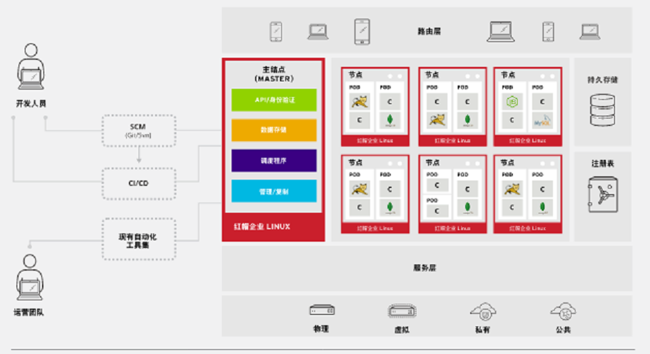
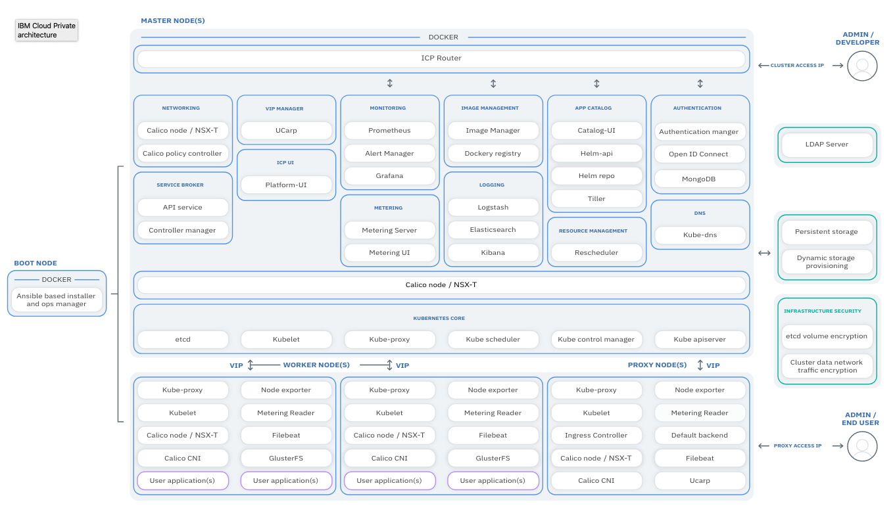

# 将 MySQL 数据库从 IBM Cloud Private 平台迁移到 RedHat OpenShift 平台
通过示例展示如何迁移 MySQL 数据库

**标签:** IBM Cloud Private,云计算

[原文链接](https://developer.ibm.com/zh/articles/cl-lo-mysql-ibm-cloud-private-redhat-openshift/)

于柏林

发布: 2020-08-26

* * *

## 前言

2019 年 7 月 9 日，IBM 正式收购 Red Hat，共同打造下一代混合多云平台，加速企业创新。前不久，IBM 正式推出 IBM Cloud Paks 企业级全栈式云解决方案，可以帮助企业实现现代化并迁移到云端，该方案同时也支持 RedHat OpenShift 容器平台。

## RedHat OpenShift 容器平台介绍

RedHat OpenShift® 是一个企业就绪型 Kubernetes 容器平台，可以实现全堆栈自动化运营，管理混合云和多云部署。RedHat OpenShift 容器平台基于经严格验证的开源技术构建，旨在帮助应用开发和 IT 运维团队实现应用现代化、交付新服务并加速开发流程。

### OpenShift 基本架构

OpenShift 平台（这里以 3.11 版本为例）由三部分组成：

- Kubernetes 基础架构 (Kubernetes Infrastructure)
- 容器镜像仓库 (Image Registry)
- Web 界面（Web Console）

**图 1\. OpenShift 架构**



如图 1 所示，它的上层是一个路由（Router）也就是一个容器化的 HAProxy，用于 DNS 解析和转发，确保用户能够调用到 OpenShift 集群中的服务。红色的部分是跑在 RHEL 操作系统上的 Kubernetes 集群，侧面是外部存储服务，因为集群里的计算单元是漂浮的，所以通常 Kubernetes 集群只提供计算能力，数据持久化需要依赖一些外部的存储服务，比如 NFS、GlusterFS、S3、EBS 等，允许用户同时运行有状态的应用和无状态的云原生应用。最下层表示该平台可以按照客户特定需求，选择在无论虚拟、公共、私有甚至混合云基础架构上运行应用。

## IBM Cloud Private 平台介绍

IBM Cloud™ Private 是一个可靠且可扩展的云平台，可在您的基础架构上运行。它在容器、Kubernetes 和 Cloud Foundry 等开源框架的基础上构建。此外，它还提供面向自助服务部署、监控、日志记录和安全性的通用服务，以及包含中间件、数据和分析的产品组合。

**图 2\. ICP 架构**



如图 2 所示，ICP 是基于 Kubernetes 为核心的扩展，包括私有的容器镜像仓库、安全的管理界面以及开源的监控框架。左边的启动节点是基于 Ansible 的自动安装脚本，网络层 SDN 采用 Calico 作为容器的网络接口插件，存储类型包括块存储、文件存储、对象存储，支持的类型也很多，包括 GlusterFS、Rook Ceph、Minio、 vSphere、hostpath、NFS、IBM Spectrum Scale 等。基于高可用方面的考虑，建议安装 3 个 Master 节点，Worker 节点可以随着业务扩展，随时添加。

## MySQL 部署在 Kubernetes 上的几种方式

无论是 OpenShift 还是 ICP，都是基于 Kubernetes 的企业产品，所以 MySQL 的部署方式也很类似。

- 开发测试环境可以暂时不用考虑高可用、灾备甚至数据的持久化，所以可以快速的部署一个 MySQL 容器。OpenShift 中自带模板，一条命令即可安装：

    1. 创建 MySQL 容器和服务：


        ```
        # oc new-app mysql-ephemeral

        ```


        Show moreShow more icon

    2. 验证安装的结果：


        ```
        #oc get svc,po
        NAME            TYPE        CLUSTER-IP      EXTERNAL-IP   PORT(S)    AGE
        service/mysql   ClusterIP   172.30.158.54   <none>        3306/TCP   3h

        NAME                READY     STATUS    RESTARTS   AGE
        pod/mysql-1-s8qw7   1/1       Running   0          3h

        ```


        Show moreShow more icon
- 生产环境需要考虑数据的持久性、高可用性以及灾备等等。MySQL HA 在官网上分了 3 个层次，分别是：

    - Data Replication
    - Clustered & Virtualized Systems
    - Shared-Nothing, Geographically-Replicated Clusters

这三个层次的可用性依次递增，复杂的也随之增加，当然价格也会越来越贵。由于本文重点介绍的是 MySQL 的迁移，不再阐述这三种部署方式的细节。仅以 Data Replication 的方式部署到 ICP 和 OpenShift 上。
OpenShift 有类似的 Template（MySQL Data Replication Template of OpenShift: [mysql-replication-example.json](https://raw.githubusercontent.com/sclorg/mysql-container/master/examples/replica/mysql_replica.json)），大家可以根据实际情况做相应调整。

1. 添加 Template 到 OpenShift：


    ```
    #oc create -f  https://raw.githubusercontent.com/sclorg/mysql-  container/master/examples/replica/mysql_replica.json

    ```


    Show moreShow more icon

2. 创建 MySQL replication 容器，服务以及存储：


    ```
    #oc new-app mysql-replication-example

    ```


    Show moreShow more icon

3. 验证安装的结果：


    ```
    #oc get po,svc,pvc
    NAME                       READY     STATUS    RESTARTS   AGE
    pod/mysql-master-1-k8rs4   1/1       Running   0          21h
    pod/mysql-slave-1-zxcxx    1/1       Running   0          21h

    NAME                                                            TYPE        CLUSTER-IP       EXTERNAL-IP   PORT(S)    AGE
    service/glusterfs-dynamic-mysql-master                           ClusterIP   172.30.206.225   <none>        1/TCP      10d
    service/glusterfs-dynamic-mysql-slave                            ClusterIP   172.30.59.158    <none>        1/TCP      9d
    service/mysql-master                                             ClusterIP   None             <none>        3306/TCP   21h
    service/mysql-slave                                              ClusterIP   None             <none>        3306/TCP   21h

    NAME                                 STATUS    VOLUME                                     CAPACITY   ACCESS MODES   STORAGECLASS        AGE
    persistentvolumeclaim/mysql-master   Bound     pvc-80fad5e5-1bf1-11ea-aabc-fa163e1c8387   1Gi        RWO            glusterfs-storage   21h
    persistentvolumeclaim/mysql-slave    Bound     pvc-80ff75d1-1bf1-11ea-aabc-fa163e1c8387   1Gi        RWO            glusterfs-storage   21h

    ```


    Show moreShow more icon


## MySQL 迁移的步骤及注意事项

本节介绍 MySQL 迁移比较常用的两种方法：

1．逻辑备份与恢复（mysqldump 导出和导入）。

- 优点：会重建数据文件，减少数据文件的占用空间，兼容性最好，导出导入很少发生问题，需求灵活。
- 缺点：导出导入时间占用长。

2．物理备份与恢复（停机备份和恢复 data 文件）。

- 优点：时间占用短，文件可断点传输，操作步骤少。
- 缺点：新旧服务器中 MySQL 版本及配置必须相同，可能引起未知问题。

本实验环境信息如下：

- ICP 3.2.1 + GlusterFS + MySQL 5.7
- OpenShift 3.11 + GlusterFS + MySQL 5.7
- 用户数据库 userdb
- 表 icp\_tbl2

### 方法一步骤

1. 备份 ICP 环境的 MySQL。

    a. 登录 ICP 命令行。


    ```
    #cloudctl login

    ```


    Show moreShow more icon

    b. 查看 MySQL Master 的容器和所在的 Worker 节点。


    ```
    #kubectl get po -o wide
    NAME                            READY   STATUS    RESTARTS   AGE   IP            NODE        NOMINATED NODE   READINESS GATES
    mysql-master-7674bcf7f9-hb76q   1/1     Running   0          25h   10.100.0.19   10.0.1.46   <none>           <none>
    mysql-slave-6bf6495958-xt99r    1/1     Running   0          25h   10.100.0.3    10.0.1.41   <none>           <none>

    ```


    Show moreShow more icon

    c. 登录 MySQL Master 容器，并做导出全部数据库的命令。


    ```
    #kubectl exec -it mysql-master-7674bcf7f9-hb76q bash
    bash-4.2$mysqldump -u root -p --set-gtid-purged=OFF --all-databases > all-databases.sql

    ```


    Show moreShow more icon

    (注：MySQL 5.7 导出数据库，需要使用 `--set-gtid-purged=OFF` 的参数禁止导出 GTID 信息，再导入进目标数据库。)

2. 拷贝导出文件到 OpenShift 环境中。

    a. 查看 MySQL Master 的容器的 PVC 信息。


    ```
    #kubectl get pvc
    NAME           STATUS   VOLUME                                     CAPACITY   ACCESS MODES   STORAGECLASS   AGE
    mysql-master   Bound    pvc-f14dac41-1bc2-11ea-bfe0-fa163e753c1f   1Gi        RWO            glusterfs      29h
    mysql-slave    Bound    pvc-d81c8af2-1bc2-11ea-bfe0-fa163e753c1f   1Gi        RWO            glusterfs      29h

    ```


    Show moreShow more icon

    b. 登录容器所在的 Worker 节点，并找到该 PVC 所挂载的目录。


    ```
    [root@bastion01 ~]# ssh 10.0.1.46
    [root@icp-worker3 ~]# df -h |grep pvc-f14dac41-1bc2-11ea-bfe0-fa163e753c1f
    10.0.1.37:icp_mysql-cluster_mysql-master_f2f33e72-1bc2-11ea-8356-fa163e753c1f 1014M   96M  919M  10% /var/lib/kubelet/pods/2d45b573-1bdc-11ea-bfe0-fa163e753c1f/volumes/kubernetes.io~glusterfs/pvc-f14dac41-1bc2-11ea-bfe0-fa163e753c1f

    ```


    Show moreShow more icon

    c. 拷贝出文件 all-databases.sql。

3. 粘贴上述文件 all-databases.sql 至 OpenShift MySQL Master 节点。

    a. 登录 OpenShift 命令行。


    ```
    #oc login

    ```


    Show moreShow more icon

    b. 查看 MySQL Master 容器和所在 Application 节点。


    ```
    #oc get po,pvc -o wide
    NAME                       READY     STATUS    RESTARTS   AGE       IP             NODE      NOMINATED NODE
    pod/mysql-master-1-k8rs4   1/1       Running   0          23h       10.130.2.144   os-app3   <none>
    pod/mysql-slave-1-zxcxx    1/1       Running   0          23h       10.130.2.143   os-app1   <none>

    NAME                                 STATUS    VOLUME                                     CAPACITY   ACCESS MODES   STORAGECLASS        AGE
    persistentvolumeclaim/mysql-master   Bound     pvc-80fad5e5-1bf1-11ea-aabc-fa163e1c8387   1Gi        RWO            glusterfs-storage   23h
    persistentvolumeclaim/mysql-slave    Bound     pvc-80ff75d1-1bf1-11ea-aabc-fa163e1c8387   1Gi        RWO            glusterfs-storage   23h

    ```


    Show moreShow more icon

    c. 粘贴 all-databases.sql 至 os-app3 的 PVC 挂载目录下。


    ```
    [root@os-app3 ~]# df -h |grep pvc-80fad5e5-1bf1-11ea-aabc-fa163e1c8387
    10.0.1.32:vol_3fa8ca7035a5db47e2e4aa14828c14da 1014M   98M  917M  10% /var/lib/origin/openshift.local.volumes/pods/63375df4-1bf1-11ea-a6d9-fa163edd7f12/volumes/kubernetes.io~glusterfs/pvc-80fad5e5-1bf1-11ea-aabc-fa163e1c8387

    ```


    Show moreShow more icon

4. 导入该文件，并查看数据。

    a. 登录 OpenShift MySQL Master 容器，导入数据库文件。


    ```
    #oc rsh mysql-master-1-k8rs4
    sh-4.2$ mysql -u root -p$MYSQL_ROOT_PASSWORD -h $HOSTNAME < all-databases.sql

    ```


    Show moreShow more icon

    b. 查看数据是否完整。


    ```
    sh-4.2$ mysql -u root -p$MYSQL_ROOT_PASSWORD -h $HOSTNAME
    mysql: [Warning] Using a password on the command line interface can be insecure.
    Welcome to the MySQL monitor.  Commands end with ; or \g.
    Your MySQL connection id is 19
    Server version: 5.7.24-log MySQL Community Server (GPL)

    Copyright (c) 2000, 2018, Oracle and/or its affiliates. All rights reserved.

    Oracle is a registered trademark of Oracle Corporation and/or its
    affiliates. Other names may be trademarks of their respective
    owners.

    Type 'help;' or '\h' for help. Type '\c' to clear the current input statement.

    mysql> use userdb;
    Database changed
    mysql> show tables;
    +------------------+
    | Tables_in_userdb |
    +------------------+
    | icp_tbl2         |
    +------------------+
    1 row in set (0.01 sec)

    ```


    Show moreShow more icon


### 方法二步骤

如果执行物理备份与恢复，请注意有一些前提条件：

- 源数据库与目标数据库的版本要一致；
- 配置文件也要一致；
- 源数据库拷贝数据时需要短暂的停掉服务。

具体步骤如下：

1. 备份 ICP 环境的 MySQL 数据文件。

    a. 暂停数据库服务。

    在传统的平台，我们可以执行关闭服务命令 `mysqladmin -uroot shutdown`，但在 Kubernetes 平台，此命令不适用，我们需要彻底停掉容器，暂时设置 `replicas=0`。

    b. 选择要备份的文件。

    默认数据路径在 `/var/lib/mysql/data` 下，如果只备份用户数据库(userdb)，那么只需拷贝文件 ibdata1 和目录 userdb。

    c. 拷贝备份文件。

    由于容器删除，与其对应的 GlusterFS volume 也会 unmount，此时需要手工挂载，并拷贝备份文件。


    ```
    [root@bastion01 ~]# ssh 10.0.1.46
    [root@icp-worker3 ~]#mkdir /mnt/master
    [root@icp-worker3 ~]#mount -t glusterfs 10.0.1.37:icp_mysql-cluster_mysql-master_f2f33e72-1bc2-11ea-8356-fa163e753c1f /mnt/master
    [root@icp-worker3 ~]#cp /mnt/master/ibdata1 .
    [root@icp-worker3 ~]#cp -r /mnt/master/userdb .

    ```


    Show moreShow more icon

2. 拷贝数据文件到 OpenShift 环境中。

    a. 暂停数据库服务（操作同上，设置 replicas=0）。

    b. 拷贝文件到 GlusterFS volume 对应的目录中。

    注意：文件拷贝进 OpenShift 之后，记得 unmount GlusterFS volume


    ```
    文件拷贝完之后，要修改文件属性(chown -R ...)。

    ```


    Show moreShow more icon

3. 启动 Master 数据库，并验证数据。

    a. 恢复容器（设置 replicas=1）。

    b. 验证数据是否恢复完整。


    ```
    sh-4.2$ mysql -u root -p$MYSQL_ROOT_PASSWORD -h $HOSTNAME
    ……
    mysql> use userdb;
    Database changed
    mysql> show tables;
    +------------------+
    | Tables_in_userdb |
    +------------------+
    | icp_tbl2         |
    +------------------+
    1 row in set (0.01 sec)
    Mysql> show master status;
    +------------------+----------+--------------+------------------+--------------------------------------------+
    | File             | Position | Binlog_Do_DB | Binlog_Ignore_DB | Executed_Gtid_Set                          |
    +------------------+----------+--------------+------------------+--------------------------------------------+
    | mysql-bin.000003 |  1629876 | mysql,userdb |                  | 789939f6-1bf1-11ea-a841-0a580a820290:1-271 |
    +------------------+----------+--------------+------------------+--------------------------------------------+
    1 row in set (0.00 sec)
    mysql> SELECT MASTER_POS_WAIT('mysql-bin.000003',1629876);
    +---------------------------------------------+
    | MASTER_POS_WAIT('mysql-bin.000003',1629876) |
    +---------------------------------------------+
    |                                        NULL |
    +---------------------------------------------+
    1 row in set (0.00 sec)

    ```


    Show moreShow more icon

    c. 验证 Slave 容器的 Replication 是否正常。


    ```
    # oc rsh mysql-slave-1-zxcxx
    sh-4.2$ mysql -u root -p$MYSQL_ROOT_PASSWORD -h $HOSTNAME
    ……
    mysql> show slave status;
    mysql> use userdb;
    Database changed
    mysql> show tables;
    +------------------+
    | Tables_in_userdb |
    +------------------+
    | icp_tbl2         |
    +------------------+
    1 row in set (0.02 sec)

    ```


    Show moreShow more icon


## 结束语

OpenShift 做为 IBM 混合云的主打平台，也在不断的升级和创新，最新版本 4.2 已经支持全栈自动部署，包括 AWS、Microsoft Azure、Google Cloud Platform (GCP) 以及 Red Hat OpenStack Platform，支持一键升级和滚动升级，用户体验更加友好，提升了可用性。

另外 IBM Cloud Paks 也会同步支持 OpenShift 4.2，提供各种混合云场景的解决方案，同时又会有一些数据迁移的需求出来，我们会继续研究并与客户共同解决。