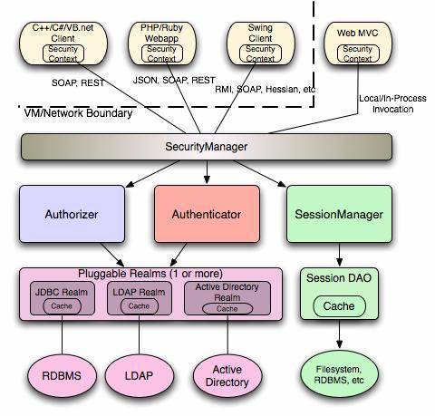
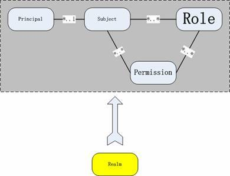
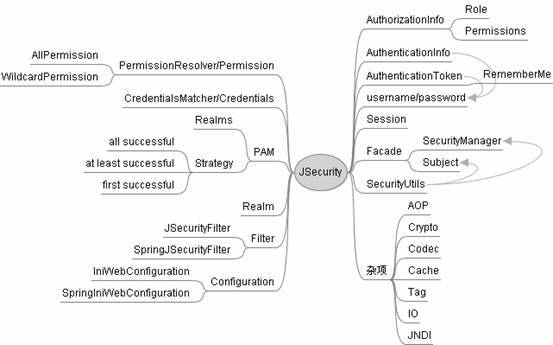
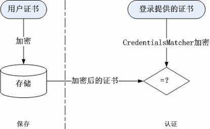
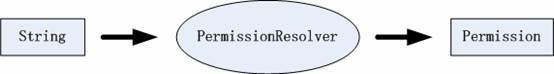
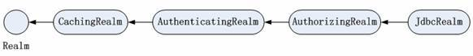
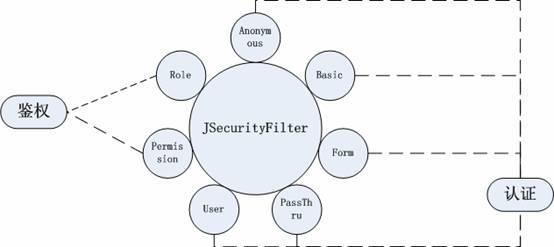
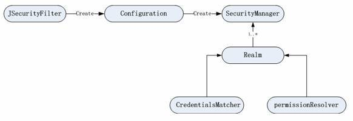
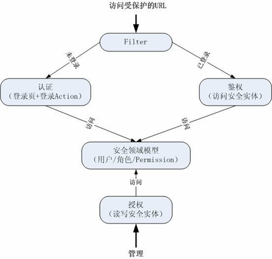

# 将 Shiro 作为应用的权限基础
Shiro 的关键概念和权限模型

**标签:** Java

[原文链接](https://developer.ibm.com/zh/articles/os-cn-shiro/)

胡 伟红

发布: 2010-03-29

* * *

## 前言

[Shiro](http://cwiki.apache.org/confluence/display/SHIRO/Index) 是 JAVA 世界中新近出现的权限框架，较之 JAAS 和 Spring Security，Shiro 在保持强大功能的同时，还在简单性和灵活性方面拥有巨大优势。本文就带领读者一睹 Shiro 的风采。

可能大家早先会见过 J-security，这个是 Shiro 的前身。在 2009 年 3 月初之前，这个安全框架叫做 J-security，由于某些原因，更名为 Shiro（或者 Ki，意为 Fortress），是 Apache 的孵化项目，鉴于本文编写时 Shiro 的还没有正式发布的版本，本文使用的是 Jsecurity 的稳定版本 0.9，本文中 Shiro 等同于 Jsecurity。

本文将涉及 Shiro 的整体框架、安全模型、关键概念类，同时给出了 Shiro 以及 Grails Shiro Plugin 的使用示例，可以下载文中使用的源代码。

本文代码的开发环境：

- Jsecurity 0.9
- Grails 1.2.0
- Grails Shiro Plugin 1.0.1
- SpringSource Tool Suite 2.3

Shiro 是一个强大而灵活的开源安全框架，能够非常清晰的处理认证、授权、管理会话以及密码加密。如下是它所具有的特点：

1. 易于理解的 Java Security API；
2. 简单的身份认证（登录），支持多种数据源（LDAP，JDBC，Kerberos，ActiveDirectory 等）；
3. 对角色的简单的签权（访问控制），支持细粒度的签权；
4. 支持一级缓存，以提升应用程序的性能；
5. 内置的基于 POJO 企业会话管理，适用于 Web 以及非 Web 的环境；
6. 异构客户端会话访问；
7. 非常简单的加密 API；
8. 不跟任何的框架或者容器捆绑，可以独立运行。

目前还有其他出现较早的安全框架，比如 JAAS，Spring Security。

JAAS —面世的时间最早，但是鉴于其在使用上有很大的限制，很少有人真正的使用它。可以说它不是一个好的应用程序级别的安全框架；

Spring Security —目前是 Java 安全框架领域当之无愧的老大，已经非常成熟了；如果使用 Spring 框架，可以首选 Spring Security，但是对于单应用来说，Shiro 更显简单方便。

下面就开始我们的 Shiro 之旅吧！

## 整体架构

首先，我们来看看的 Shiro 的整体架构，见下图：

##### 图 1\. 整体架构



从上图可以看出，Shiro 主要有四个组件：

1. SecurityManager

    典型的 Facade，Shiro 通过它对外提供安全管理的各种服务。

2. Authenticator

    对”Who are you ？”进行核实。通常涉及用户名和密码。

    这个组件负责收集 principals 和 credentials，并将它们提交给应用系统。如果提交的 credentials 跟应用系统中提供的 credentials 吻合，就能够继续访问，否则需要重新提交 principals 和 credentials，或者直接终止访问。

3. Authorizer

    身份份验证通过后，由这个组件对登录人员进行访问控制的筛查，比如”who can do what”， 或者”who can do which actions”。Shiro 采用”基于 Realm”的方法，即用户（又称 Subject）、用户组、角色和 permission 的聚合体。

4. Session Manager

    这个组件保证了异构客户端的访问，配置简单。它是基于 POJO/J2SE 的，不跟任何的客户端或者协议绑定。


Shiro 的认证和签权可以通过 JDBC、LDAP 或者 Active Directory 来访问数据库、目录服务器或者 Active Directory 中的人员以及认证 / 签权信息。SessionManager 通过会话 DAO 可以将会话保存在 cache 中，或者固化到数据库或文件系统中。

## 安全模型

从 Shiro 的框架图，已经能够体会到这个工具的简单了。下面让我们来看看 Shiro 是如何工作的。先了解一下它的安全模型吧！见下图：

##### 图 2\. 安全模型



上图中，涉及了 Shiro 的五个概念：

- Subject 是安全领域术语，除了代表人，它还可以是应用。在单应用中，可将其视为 User 的同义词。
- Principal 是 Subject 的标识，一般情况下是唯一标识，比如用户名。
- Role 和 Permission 分别代表了不同粒度的权限，从上图中可以看出 Role 的粒度更大些，Permission 代表了系统的原子权限，比如数据的修改、删除权限。对于简单的权限应用，可以不需要 Permission。
- Realm 是一个执行者，负责真正的认证和鉴权。

实现应用的安全模块的关键在于：定义合适的 role 和 permission，这就需要遵循如下原则：

1. role 没有实质内容，只是代表一组 permission，目的是为了管理的方便，一般都是动态定义；
2. permission 一般都是预先定义好的，不允许动态改变，除非源代码改动，它才会变化，它是整个安全模块的基础；
3. 要使 permission 也能动态定义，并非不可能，但是这将使鉴权非常复杂，甚至可能导致鉴权语句遍布整个程序，得不偿失；
4. 当然有一个例外：如果知道 permission 动态定义的规则和鉴权规则，如 Grails 的 fileter 中”${controllerName}:${actionName}:${params.id}”也可实现 permission 的动态定义

## 关键概念类

理解 Shiro 的架构和安全模型了，我们来看看更具体些的内容。下图显示了 Shiro 中的关键概念类（参考资料 — JSecurity Mini Guide）。

##### 图 3\. 关键类



**AuthenticationToken 和 AuthenticationInfo**

前者在认证前使用，描述认证所需的信息，最常用的就是 username 和 password 对；后者在认证后使用，内容同前，但是表示已经经过认证的信息。

**RememberMe**

代表的是一种可能状态，并不表示该 Subject 已经经过了认证。对于一些普通的操作，这种可能状态并无大碍，但一旦涉及安全敏感的操作，必须经过认证。

**Credentials 和 CredentialsMatcher**

Credentials 是 Subject 的证书，在认证时使用，最常用的就是 password。在通常情况下，为了安全起见，Subject 的 credentials 都需要加密保存，于是 CredentialsMatcher 的作用就体现出来了，见下图：

##### 图 4\. CredentialsMatcher 的作用



这里 CredentialsMatcher 需要将加密后的证书跟用户登录时提供的证书进行比对，完成认证的过程。

**PAM= Pluggable Authentication Modules**

在有多个 Realm 的时候使用。由认证策略决定认证结果，即 PAM= Relams + 认证策略。一般的策略有 3 种：AllSuccessful、AtLeastOneSuccessful 和 FirstSuccessful。

**AuthorizationInfo**

可以看成是 Role + Permission 的组合体。

**PermissionResolver 和 Permission**

它们之间的关系如下：

##### 图 5\. PermissionResolver 和 Permission 的关系



在 Shiro 中，权限被转化为一种字符串描述（字符串分级表示，称之为 WildcardPermission），从而将权限转化为类似于对象 equals 的操作（Shiro 中的 implies 方法）。

内置的权限有 2 个：

- AllPermission，总是返回 true
- WildcardPermission，权限字符串的表示方式。

这里重点声明一下。WildcardPermission 是 Shiro 的精妙之处，我们可以将权限表示成字符串，这样对权限的控制可以不拘泥于物理存储，比如对 messagge 类具有修改和删除权限可以标识为：`message:update,delete:*`，其中 `*` 表示所有；第一级分隔符为 `:` ；第二级分隔符为 `,`，而对于权限字符串的解释完全可以由应用自己来定。

如果要比较权限字符串，可以使用 permission1.implies(permission2)，它分别比较对应位置的字符串，在如下情况中，结果会返回 true：

- permission1 中的子串有 \* 或 permission1 子串 ==permission2 子串；
- permission1 无子串，permission2 有；
- permission1 有子串，permission2 无，permission1 的所有子串都是 \*。

总的说来，Shiro 中的 Permission 需要注意如下内容：

1. 权限的比较实际是字符串的比较，只不过是考虑到了字符串的分级
2. 字符串的分级划分完全由使用者自己决定，Shiro 的惯例是 3 级：资源 : 操作 : 实例。
3. 字符串的使用必须一致，分隔符之间不要有空格，避免无意间引入的不一致。如：定义使用”file : create, update : 1”，而验证使用”file : update”，那么分解之后一个是” update ”，一个是” update”，因空格而引起不等。

**Realm**

这是一个实际访问安全实体的组件，一般是应用相关的，跟数据源的关系是 1-1。它负责完成认证和鉴权，getAuthenticationInfo 代表了 login 的尝试，鉴权方法则由 Authorizer 继承而来。此处也体现了 Shiro 代码的另一个特点，通过继承来扩充功能。以常用的 JdbcRealm 为例，其继承链如下：

##### 图 6\. JdbcRealm 的继承链



**Session**

它关联一个 Subject 的上下文，其作用类似于在 HttpSession 中保存用户标识，session 一旦过期，则重新登录。Shiro 的 Session 是独立的，其目的是做到环境无关性。为了利用 Web 环境中，Shiro 实现了一个直接使用 HttpSession 的 WebSession。

**SecurityManager**

这是一个 Façade 接口，=Authenticator + Authorizer + SessionFactory。在整体框架图中已经看到了它在 Shiro 中所处的位置。其特点同 Realm，一样是使用继承不断地扩充功能。对于 Web 应用一般使用 DefaultWebSecurityManager。

**Filter**

在 Web 环境下使用 filter 进行认证和权限检查是毋庸置疑的，而 Shiro 的特点则在于由一个主 Filter 将一群子 filter 串起来：

##### 图 7\. Filter 的作用



在实际使用时，须注意：

1. web.xml 中只需配置 JSecurityFilter。对于 Spring 应用，则使用 SpringJSecurityFilter；
2. 子 filter 作为主 filter 的配置参数值出现，特点是：顺序相关

    - 对于多个 URL，验证顺序是由上至下，类似 Exception 的匹配。因此，使用顺序应该是由细到粗。
    - 对于同一 URL，子 filter 的验证顺序是从左至右的 AND 操作。
3. 如果配置值中含有分隔符，如 Permission，就需要使用引号来转义。

**Subject**

subject 代表了一个用户的状态和操作，它提供了所有安全相关的操作，包括认证和签权。可以将其视为另一种形式的 Façade。缺省实现是将这些操作委派给其内部包含的 SecurityManager。

**Configuration**

configuration 负责将所有这些组件串起来，最终创建 SecurityManager。在 Shiro 中，缺省格式是 ini。整个配置关系如下图：

##### 图 8\. 配置关系



其中：

- JSecurityFilter 创建 Configuration 实例，并将 ini 参数值传给 Configuation。在 Spring 环境中，分别使用 SpringJSecurityFilter 和 SpringIniWebConfiguration。
- Configuration 实际就是 SecurityManager 的 Factroy，对 SpringIniWebConfiguration 而言，它需要知道 SecurityManager 的 BeanName，该值由 SpringJSecurityFilter 的初始化参数”securityManagerBeanName”值决定。即 SpringJSecurityFilter，实际有两个初始化参数：

- config，是 ini 配置文件内容

- securityManagerBeanName，是 SecurityManager 的 BeanName

**SecurityUtils**

这是 Shiro 中最重要的工具类，由它可以方便地获得 Subject 和 SecurityManager。

**杂项**

- AOP，提供 AOP 方面的支持，实现对某个类某个方法的拦截，从而使权限控制延伸至类的方法。
- Cache，提供缓存支持
- Codec，提供编码方面的支持
- Crypto，提供加密支持
- IO，从多个资源位置读写原始数据
- JNDI，提供 jndi 支持
- util，工具类支持
- 标签类，用于 Web 页面

## 典型使用

对 Shiro 有了一个感官认识后，下面我们就亲自动手试试这个框架吧！下面给大家举了两个使用案例。

在开始案例的学习之前，先作好准备工作 — 获得 Shiro 相关的 jar 包，获取途径有两种：

1. 直接到 J-security 的网站上 [下载](http://sourceforge.net/projects/jsecurity/files/jsecurity/0.9.0/) ，本文用到的就是这个；
2. 由于 Shiro 目前是 Apache 的孵化项目，还没有发布正式的版本，但是我们可以到 Subversion 上下载代码，之后使用 Maven 构建。

    mkdir shiro

    cd shiro

    svn co [https://svn.apache.org/repos/asf/incubator/shiro/trunk/](https://svn.apache.org/repos/asf/incubator/shiro/trunk/)

    mvn install


之后会得到 shiro-all-1.0-incubating-SNAPSHOT.jar，就可以使用 Shiro 了。

### 示例一：让 Shiro 为你的应用服务

这个案例中，我们使用 Grails 向大家讲述 Shiro 的使用。我们要实现如下功能：

1. 用户登录后方可进入系统；
2. 假定一个 message 的安全内容，用户可以创建 message 的内容，但是如果需要修改 / 删除 message 的内容就必须具有相应的权限；
3. Admin 具有所有的权限；
4. message 的权限跟角色关联。

示例程序执行的流程如下：

##### 图 9 程序执行的流程



从上图中可以看到，任何人要访问应用中受保护的 URL，首先要通过 Filter 检查用户是否经过认证；对于没有认证的用户会将访问定向到登录页面；对于已经认证的用户，会对用户进行鉴权，这个用户是否具有访问其所提交的 URL 的权限；而管理员可以给角色授权。

好了，开始程序的编写啦！

**创建安全领域类**

最常见的就是 User、Role 和 Permission，见清单 1。

##### 清单 1\. User/Role/Permission 的 Domain class

```
class User {
    String username
    String password
    static hasMany= [roles: Role]
    static belongsTo= Role
......
}
class Role {
    String rolename
    static hasMany= [users: User, permissions: Permission]
......
}
class Permission {
    String permission

    static hasMany= [roles: Role]
    static belongsTo= Role
......
}

```

Show moreShow more icon

这里使用了最简单的情形，即权限传递结构为：Permission -> Role -> User。通常情况下，Permission 也可以分配给单个 User。

**创建一个安全实体**

实体名为 message，见清单 2。只有经过授权的用户才能对这个实体进行修改和删除。

##### 清单 2\. message 的 Domain class

```
class Message {
String details
User user
    static constraints = {
}
}

```

Show moreShow more icon

**配置 web.xml**

##### 清单 3\. 在 web.xml 加入 SecurityFilter 的内容：

```
<filter>
        <filter-name>SecurityFilter</filter-name>
        <filter-class>
org.jsecurity.spring.SpringJSecurityFilter
</filter-class>
        <init-param>
            <param-name>securityManagerBeanName</param-name>
            <param-value>jsecSecurityManager</param-value>
        </init-param>
</filter>
<filter-mapping>
        <filter-name>SecurityFilter</filter-name>
        <url-pattern>/*</url-pattern>
</filter-mapping>

```

Show moreShow more icon

这里需要注意：

- 这个 Filter 应该在 Grails 的 web.xml 中所有缺省的 Filter 最后；
- url-pattern 不要使用 `/**`，因为这样会造成登录页的 css 和图片无法访问。解决办法，可以通过遵循”只能通过 Controller/Action 访问”这个规则，并使用 Grails 的 Filter 机制，可以保证所有安全 URL 不被非法访问。

**创建 realm**

##### 清单 4\. conf/spring/resources.groovy

```
beans = {
    credentialMatcher(
org.jsecurity.authc.credential.Sha1CredentialsMatcher) {
        storedCredentialsHexEncoded = true
}

    permissionResolver(
org.jsecurity.authz.permission.WildcardPermissionResolver)

    realm(org.jsecurity.realm.jdbc.JdbcRealm){
        permissionResolver = ref("permissionResolver")
        dataSource = ref("dataSource")
        permissionsLookupEnabled= true
        permissionsQuery= "select permission from
permission, role_permissions, role where
permission.id= permission_id and role_id= role.id and rolename= ?"
        userRolesQuery= "select rolename from role, role_users, user
where role.id=role_id and user_id= user.id and username=?"
        authenticationQuery= "select password from user where username=?"
    }

jsecSecurityManager(
org.jsecurity.web.DefaultWebSecurityManager) {
bean ->bean.destroyMethod = "destroy"
        realms = [ ref("realm") ]
    }
}

```

Show moreShow more icon

这里使用了 JdbcRealm，同时根据应用情况修改了相应的 SQL。如果允许 Permission 直

接分配给 User，即 Permission 和 User 之间是多对多关系，那么 permissionsQuery 应该使用 union，即”role 相关 permission union user 相关 permission”。对于 User 有多个 Role 的情况，JdbcRealm 会循环得出总的结果。

**安全守护神：SecurityFilters**

下面就是我们的安全守护神：SecurityFilters，这里遵循 Grails 的 Filter 语法。见清单 5。

##### 清单 5\. SecurityFilters

```
import org.jsecurity.SecurityUtils

class SecurityFilters {
    def filters = {
        authc(controller:'*', action:'*', ) {
            before = {
                if(controllerName!='auth'){
                    def subject = SecurityUtils.subject
                    if (!subject.authenticated) {
                        redirect(
                                controller: 'auth',
                                action: 'login',
                                params: [
                                targetUri: request.forwardURI - request.contextPath
                                 ])
                        return false
                    }
                }
            }
        }

        admin(controller: 'user|role|permission', action: '*'){
            before = {
                def subject= SecurityUtils.subject
                if(!subject.hasRole('admin')){
                    redirect(controller: 'auth', action: 'unauthorized')
                    return false
                }
            }
        }

        editmessage(controller: 'message', action: 'update|delete'){
            before = {
                def subject= SecurityUtils.subject
                if(!subject.isPermitted(
"${controllerName}:${actionName}:${params.id}")){
                    redirect(controller: 'auth', action: 'unauthorized')
                    return false
                }
            }
        }
    }
}

```

Show moreShow more icon

代码中 :

- authc 表示的是所有用户对应用系统的任何访问都要经过 auth 认证，对于没有认证的用户的访问会重定向到登录界面；
- admin 表示的是属于 admin 角色的用户对 user/role/permission 具有所有权限，对于非 admin 角色的用户会对其提示没有 user/role/permission 的访问权限；
- editmessage 表示当用户对 message 进行修改或者删除的时候对其进行鉴权，只有具有 message 的 update/delete 权限的用户才能对 message 进行修改。

在上述代码中还可以看出，我们通常可以由 SecurityUtils 为出发点获得 Subject 和 SecurityManager。需要注意的是，认证的 Filter（authc）要打头阵。

**认证的代码**

##### 清单 6\. 认证代码

```
def signIn = {
       // 创建 AuthenticationToken
        def authToken = new UsernamePasswordToken(
         params.username,
         params.password)
        if (params.rememberMe) {
            authToken.rememberMe = true
        }
        try{
            // 使用 SecurityManager 的 login 登录
            this.jsecSecurityManager.login(authToken)
        flash.message = message(code: "$params.username")
            def targetUri = params.targetUri ?: "/"
            log.info "Redirecting to '${targetUri}'."
            redirect(uri: targetUri)
        }
        catch (AuthenticationException ex){
            // 如果出现异常，显示出错信息
            log.info "Authentication failure for user '${params.username}'."
            flash.message = message(code: "login.failed")
            def m = [ username: params.username ]
            if (params.rememberMe) {
                m['rememberMe'] = true
            }
            if (params.targetUri) {
                m['targetUri'] = params.targetUri
            }
            redirect(action: 'login', params: m)
        }
    }

```

Show moreShow more icon

授权部分很简单，即对安全实体进行 CRUD。其中 Permission 的权限字符串根据实际情况形成，在本例中：

- 如果对所有 message 具有修改权限，权限字符串可以为：message:delete,update:\*；
- 如果针对某一个 message 具有修改权限，权限字符串可以为：message:update,delete:messageid。

### 示例二：使用 Shiro Plugin 快速构建安全模块

在示例一中，所有的代码都是自己手动写的，这就对初学者要求有些高了。但可喜的是 Grails 社区有了 Shiro 的 plugin，让我们的工作变得非常简单。同样示例一的功能，看看 plugin 能够给我们带来什么样的惊喜？

使用步骤如下：

1. 安装 Shiro Plugin，在你的 grails 项目中运行： `grails install-plugin shiro` ，会创建 grails-app/realms 目录，并提供如下新的 Grails 命令：

    - `grails create-auth-controller` ，创建 AuthController 以及登录窗口，Controller 提供了登录、登出和权限验证失败处理等 Action。
    - `grails create-db-realm` ，创建一个访问数据库的 Realm
    - `grails create-ldap-realm` ，创建一个访问 ldap 的 Realm
    - `grails create-wildcard-realm` ，创建一个访问数据库的 Realm，但使用的是 Shiro 的 WildcardPermission。
    - `grails quick-start` ，它是 create-auth-controller 和 create-db-realm 的集合体，是 Shiro 的快速入门，在接下来的内容中将详细介绍它的使用。
2. 下面进行 Shiro 快速入门。在 grails 项目的目录下执行： `grails quick-start` ，这个命令会创建如下内容：

    - 在 grails-app/realms 下创建 ShiroDbRealm，这个 realm 是访问控制的信息库，用来决定一个用户有权访问哪些内容；
    - 在 grails-app/domain 创建 ShiroRole.groovy 和 ShiroUser.groovy；
    - 在 grails-app/controllers 下创建 AuthController，这里提供了登录和退出的 action；
    - 在 grails-app/views 下创建 auth 文件夹以及 login.gsp；
    - 在 grails-app/conf/ 下创建 SecurityFilters.groovy，这里管理着对所有 controller 和 action 的访问控制。
3. 启动程序，当访问 controller 的时候，页面就会重定向到登录页面。但是这个时候是无法登录，因为我们没有添加用户。
4. 进入到 grails-app/conf/ 修改 BootStrap.groovy，

##### 清单 7\. 修改后的 BootStrap.groovy

```
def init = { servletContext ->
    def user = new User(username: "user",
            passwordHash: new Sha1Hash("user").toHex())
        user.save()
        def role= new Role(name:"admin").addToUsers(user).save()
        }

```

Show moreShow more icon

重新启动程序，就能使用 user/user 登陆了。

1. 在 plugin 缺省创建的 SecurityFilters 中使用了对所有 URL 进行 before 拦截，但是我们根据实际情况进行修改，例如我们要示例一的 filter 内容，就可以做如下更改：

##### 清单 8\. 更改后的 SecurityFilters

```
auth(controller: "*", action: "*"){
         before={
           accessControl{true}
         }
    }
　　　 management(controller: "user|role|permission", action: "*"){
          before={
             accessControl{role("admin")}
          }
        }
        message(controller: "message", action: "delete|update"){
          before={
             accessControl{
　　　　　　　   permission("message:${actionName}:${params.id}")
             }
          }
        }

```

Show moreShow more icon

看到这里，读者可能已经注意到了，这里的代码比示例一中的 Filter 的代码简单的许多。对，Shiro 插件已经将示例一中的类似代码封装到 ShiroGrailsPlugin.groovy 中了，我们使用的时候只需要：

调用 accessControl 方法，该方法的参数可以是 Map、Closure 或者 Map+Closure；

使用 role(…… )，验证访问对象是否具有相应的角色；

使用 permission(…… )，验证访问对象是否具有相应的 Permission。

1. 授权部分内容参见上一示例，这里不做冗述。
2. Shiro Plugin 中除了为我们提供了上述方便之外，还提供了一些常用的 taglib 来增强用户界面 , 这些 taglib 都在 pluginPath/grails-app/taglib /ShiroTagLib.groovy 中定义，我们可以直接在 gsp 中使用它们。

    比如，只有具有修改权限的用户才能够看到一些修改类的按钮显示，可以这样写：


##### 清单 9\. Taglib 的使用

```
<shiro:hasPermission permission="message:update,delete">
      <span class="button">
    <g:actionSubmit class="edit" value="Edit" />
    </span>
      <span class="button">
    <g:actionSubmit class="delete"
    onclick="return confirm('Are you sure?');"
    value="Delete" />
    </span>
    </shiro:hasPermission>

```

Show moreShow more icon

如下是经常使用到的 Tag：

- [principal](///C:/Documents%20and%20Settings/ada/.grails/1.1.2/plugins/grails-shiro-1.0.1/docs/gapi/grails-app/taglib/ShiroTagLib.html#principal) ，输出当前用户的标识
- hasRole，判断当前用户是否属于给定的角色，参数：name
- hasPermission, 判断当前用户是否具有指定的权限，参数：type，action 或者 permission
- [isLoggedIn](///C:/Documents%20and%20Settings/ada/.grails/1.1.2/plugins/grails-shiro-1.0.1/docs/gapi/grails-app/taglib/ShiroTagLib.html#isLoggedIn) ，判断当前用户是否已经登录
- hasAnyRole，判断当前用户是否属于给定的某个角色，参数：in

更多的 Tag 请参考 Shiro Plugin 的 gapi 的文档。

如果您已经非常了解了 Shiro，可以采用示例一的方式自己写所有的代码，但是对于初学者，作者还建议使用 Shiro plugin，这个插件帮助我们生成了安全相关的基本内容，以及提供了方便的 Tag。

## 结束语

读到这里，是不是觉得 Shiro 真的不错？！

这里给大家举的示例只是抛砖引玉。Shiro 真正的精髓还需要在项目中慢慢的体会。本文是引领我们走向 Shiro 的第一步。在这里要感谢胡键对本文编写的大力支持。

源代码中，shiroApp 是示例一的源代码，ShiroPlugin 是示例二的源代码。

## 下载示例代码

[shirossc.rar](http://download.boulder.ibm.com/ibmdl/pub/software/dw/cn/opensource/os-cn-shiro/shirossc.rar)