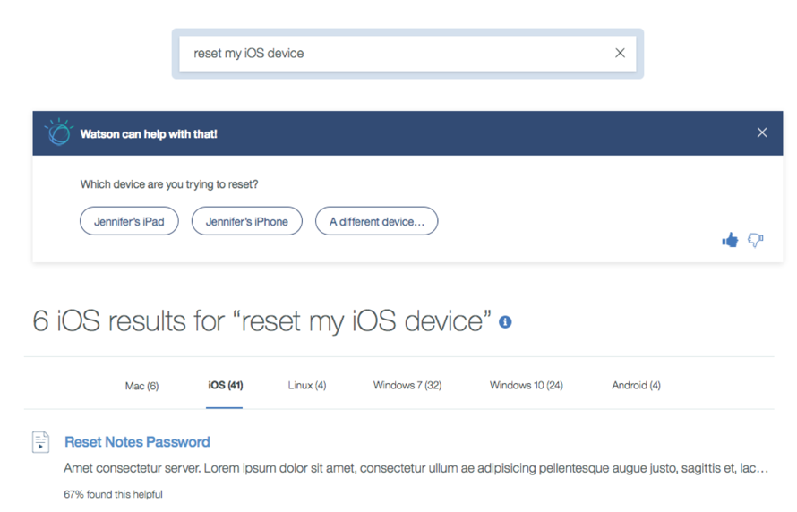
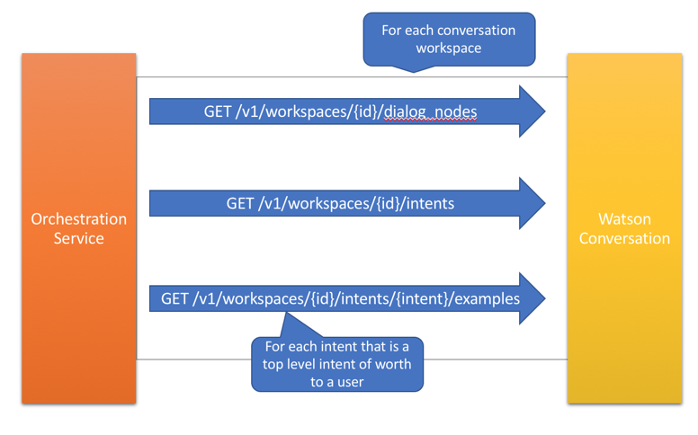
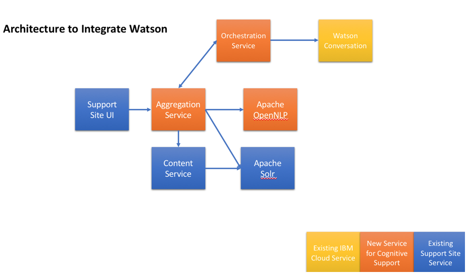
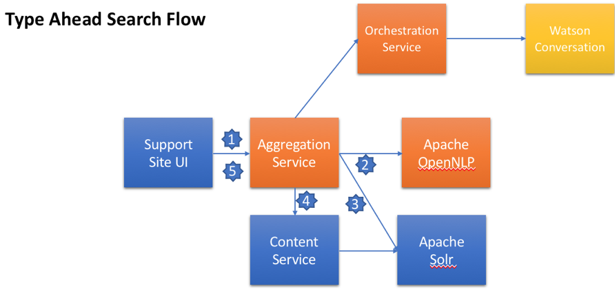
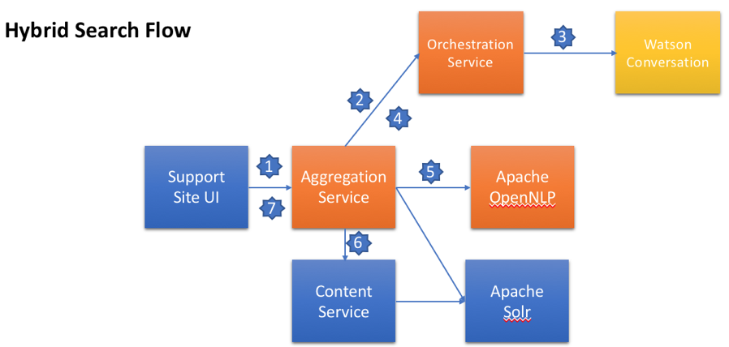

# 将 Watson Assistant 集成到现有站点中的一种混合方法
构建与 AI 技术契合的强大搜索引擎

**标签:** 人工智能,对话

[原文链接](https://developer.ibm.com/zh/articles/cc-hybrid-integrating-watson-assistant/)

Kenn Roberson, Jon Temple

发布: 2018-07-04

* * *

Watson Assistant 原名为 Watson Conversation，它为构建应用奠定了卓越的技术基础，此类应用能够理解自然语言，并使用自然语言做出响应，例如，消息传递渠道、Web 应用或虚拟助手。由于此类技术的普及，聊天机器人几乎无处不在。

但并非所有聊天机器人都生来平等，用户预期可能也大相径庭。某些聊天机器人可能就像著名的 Watson Jeopardy AI 一样，而另一些则更像是交互式常见问答程序，只能对特定问题给出通用而冗长的响应。用户根据初次互动情况可能会心情愉快，也可能会感到十分乏味，而这种体验则影响了用户是否会再次光临。遗憾的是，广泛的训练对于新生的聊天机器人并非始终可行。如果聊天机器人受到的训练不足，它们可能只会将受过训练的内容告知用户，而这不一定能够帮助用户解决具体的问题。它们也可能会降级为执行搜索，但所能提供的内容却又无法与适当的搜索界面相比。

对于许多人而言，搜索仍然是寻找答案的有效途径，而用户可能面临是探索新的聊天机器人还是仍继续自行搜索的两难选择。这两种截然不同的解决方案在功能上可能存在重叠，当聊天机器人被迫频繁降级为执行搜索时尤为如此。如果聊天机器人无法满足其初始期望，用户可能就会恢复使用搜索，而在将来避免再使用聊天机器人。在提供选择时，第一印象对于能否长期采用至关重要。如果有其他方法可以代替弃之不用的聊天机器人，即使日后此聊天机器人做出重大改进，可能也无法让这些用户回头。

另一个考虑因素就是自然语言的作用。聊天机器人需要一个丰富的词汇表，包括相应知识库中的同义词、习语和技术术语。用户可能被迫猜测并记住特定的词汇，而且还可能会产生误解。自然语言支持是一种宝贵的工具，而认清其局限性则可以提供更好的整体用户体验。例如，不要让自然语言支持阻碍关键字的使用。通过适当的方式使用高级功能（例如，引号、布尔值、排除和包含）进行关键字搜索，效果着实不可思议。理想的解决方案将酌情支持使用自然语言和关键字搜索词。

当我们着手将此技术集成到现有应用中时，我们探索了一种全新的方法来克服上述诸多缺点，同时充分利用这一激动人心的新技术。

## 混合搜索：实现陪您一同成长的聊天机器人的不同方法

我们规避这些问题的方法是，根据典型搜索范式将搜索和聊天机器人技术同时集成到单一用户界面中，避免从互相竞争的系统中进行抉择。现有搜索系统具有基于关键字且使用 Apache Solr 的强大搜索引擎，并且此系统已经过调优，可作为解决方案独立使用。在此基础上，我们引出了 Watson Assistant 以及来自 Solr 的结果。这种“混合搜索”方法使用户期望与他们对传统搜索引擎的期望一致。不过，在围绕特定意图进行训练时，能够充分理解自然语言的 Watson Assistant 做出的回应简直让用户喜出望外，这可能是传统搜索引擎无法给出的问题的答案，也可能是一份自助服务表单。

这种方法具有诸多优势。通过以传统搜索范式为基础，始终都会返回搜索结果，但 Watson 仅在经过具体训练的情况下才会提供相应解决方案。这对于通过更多训练逐步扩展 Watson 组件极其有用。传统聊天机器人会降级为执行搜索，而混合搜索方法则会随着时间推移在更多解决方案中进行训练，从而逐步变得更加智能。

另一个分歧点在于将自然语言的使用范围限制为识别正确的 Watson 意图，而不是提供受限制或半指导式的对话呈现方法。例如，如果用户在传统聊天机器人中输入“I want to reset my mobile device”这句话，那么对话可能会提供一个列表，询问用户要重置哪台设备。此时，用户可能会输入有效的响应或者完全不同的、可能导致对话流出现问题的答案。它至少可将对话重置为初始状态，并进入另一条路径，或者导致 Watson 重新提出问题。

我们的方法是将用户限制为从 Watson 已接受过训练的一组选项中进行选择。对于有关重置设备的相同提示，混合搜索会使用一组预定义的替代选项作为响应，一种用于已注册的每台设备，另一种则用于“未列出”的设备。这降低了使用自然语言情况下可能出现的误解风险，并避免了无谓的猜测。



通过在仅提供有效选项这一构想上加以扩展，我们还在前端添加了智能技术，用来检测 Watson 可能返回的不同类型的响应。例如，如果我们确定响应为某个“支持选项”（例如，电话号码、创建凭单或开始与人交谈），那么将以用户可与之互动的卡片类型格式来显示信息。如果返回文档列表，那么混合 UI 会检索有关这些文档的信息，以便用户不必打开这些文档就可以做出更佳选择。Watson 仍可通知混合 UI 输入格式化文本（例如，序列号）或自由格式文本。这些类型的控件是互动表单的基础，可带来更丰富的支持体验。

## 通过 Watson 进行搜索时的自动补全功能（快速结果）

当用户在搜索栏中输入信息时，我们的应用会实施自动补全结果模式，向这些用户显示主要搜索结果的快速列表。在开始将 Watson 集成到搜索中时，我们遇到了一些限制。当用户输入搜索字符串时，此应用会检查输入的每个字符，查看是否存在可直接提供给用户的结果。这种调用必须异常迅速。此应用不会耐心等待从位于 IBM Cloud 中的 Watson 返回响应以创建会话、执行意图匹配，然后再做出响应。另一个问题是，Watson 返回的响应可能是表单、文档、支持定义或请求提供更多信息。这无法适用于快速搜索或自动补全范式。最后，还存在成本因素。Watson 是一项计费服务，您必须按使用量付费。自动补全关键字搜索方法的使用量是完整关键字搜索的 10-20 倍。


为了使我们能够在快速结果中包含基于 Watson 的意图，我们开发了从应用使用的 Watson Assistant 语料库中提取信息的自定义服务。在这项新服务中，我们对每个语料库使用了现有 Watson API 来检索所有意图和对话信息。对话信息用于抽取顶级意图（即进入用户对话流的切入点）。随后，通过移除非关键意图（如“conversation\_start”和“anything\_else”）可进一步限制此集合。在逐步缩小至核心意图之后，我们从 Watson 中抽取意图示例。逻辑上，我们将意图及其示例视作为一个“文档”。由此生成的文档与已建立索引的其他内容一起存储在 Solr 中。此进程会在每晚运行。



现在，当用户开始在搜索查询中输入内容时，我们会显示来自 Solr 中原始内容的结果，以及可在 Watson 中开始对话的关键意图。出于对自身目的的考虑，我们促进了品牌化宣传，并在 Watson 意图中的其他内容之上增加了品牌标记，以便展示这项新技术。从用户角度来看，在自动补全结果区域中，他们会将第一个示例意图视作为可能的结果。如果用户从下拉菜单中选择此项，那么会将其转至完全混合的搜索结果，并且示例意图已传递到 Watson 中，就像用户输入的一样。由此即可创建 Watson 会话，并保证积极的结果。

## 支持自然语言处理及基于关键字的搜索

当用户日渐熟悉应用中集成的 Watson 后，我们期望他们将开始执行更多自然语言处理 (NLP) 搜索。原先，用户会输入基于关键字的搜索，例如，输入“connect to vpn”来查找有关如何连接到企业 VPN 的帮助。当他们认识到 Watson 也在查看他们输入的内容时，聪明的用户可能会开始输入完整的短语，例如，“I can’t connect to VPN from home”。

NLP 短语的使用带来了搜索结果质量可能下降的问题。从我们完成的测试来看，Solr 本身无法妥善处理 NLP 语句。为帮助提供准确的结果，我们添加了来自 Apache OpenNLP 组件的功能。该组件可以查看语句并抽出不同的词性。我们使用该功能来抽取名词和动词短语，通过输入的语句有效构建关键字搜索。将先前的 NLP 示例输入到处理器中，结果可能类似于：

```
I_PRP can't_MD connect_VB to_TO VPN_NNP from_IN home_NN

```

Show moreShow more icon

请注意，在上面的输出中，后缀是该词词性的缩写。

通过仅抽取名词和动词短语，可以得到一组关键字“connect IBM home”。仅当输入字符串超过单词数的特定阈值（例如，5 个或更多）时，此逻辑才适用。这组全新的关键字将与原始字符串一起用于构建组合结果，该结果中应包含精确匹配项和关键字。请注意，仅向 Watson 发送原始字符串，它将自行执行 NLP 意图匹配。从用户角度来看，我们高效而充分地结合了二者之所长。

## 技术解决方案

以下是有关此应用的一些背景信息。它是一项微服务架构，使用 Docker 镜像来部署。每一项服务都在独立的 Docker 镜像中托管，并部署在高可用性环境中。为加强对上述功能的支持，我们对应用架构进行了如下更改。请注意，显示的内容代表了架构的简化视图，为清晰起见，还有多项无影响的服务并未显示。



以下是上面所列组件的简要描述：

- 支持站点 UI：这是 Web 前端应用，用户使用它与系统进行交互。
- 内容服务：此项微服务用于执行搜索，并从内容存储库中检索有关多种不同类型文档的信息。它结合使用 CouchDB 与 Solr 来促进完成此任务。
- Apache Solr：一种快速的开源搜索索引引擎。
- 聚合服务：这是新创建的一项服务，UI 的单一组合界面可调用该服务来检索并组合来自 Watson 和现有应用源的信息。在集成更多 Watson 服务和其他系统的外部数据时，我们提供此项服务作为一个扩展点。
- 编排服务：由于我们将对其他表示层（例如，聊天机器人或语音响应单元）使用相同的工作空间，我们创建了该层以作为 Watson Assistant 的包装程序和集成服务。它使我们可以利用存储在对话外部的信息来扩充并完善来自对话流的响应。
- Apache OpenNLP：我们用于识别词性的开源自然语言处理组件。

当用户输入搜索词时，将使用以下流程。第一个流程表示自动补全流程。请注意，搜索全部发生在应用内部，已建立索引的意图表示进入 Watson Assistant 的潜在切入点。



1. UI 会将当前输入的搜索查询和其他用户相关信息（个性化、认证级别等）一起发送到自动补全服务切入点。
2. 聚合服务会确定输入短语的大小。如果超出单词数的指定大小，那么会调用 OpenNLP 抽取关键的名词/动词短语。
3. 聚合服务会调用 Solr 来查看当前短语与建立索引的意图示例是否匹配。由于这是从用户角度出发的，因此响应必须快速，而 Solr 查询仅用于前 2 个或 3 个意图匹配。
4. 与此同时，聚合器服务还会调用现有内容服务的切入点来检索自动补全结果。它会根据以上步骤 2 中所发生的情况，传入原始搜索字符串或名词/动词短语。此结果集同样仅限于前 2 个或 3 个结果。
5. 此流程的结果是，用户会将来自现有内容以及主要意图（我们向用户显示意图的第一个示例）的一组潜在主要匹配结果视为对话切入点。如果用户选择 Watson 意图，它会触发以下所述的混合搜索流程。

在混合搜索流程中，将调用 Watson 作为此流程的一部分。如果 Watson 以足够高的置信度返回结果，并可帮助用户执行查询，那么会通过交互以及传统搜索的现有结果指引用户完成相关过程。此流程为：



1. UI 将搜索查询和其他用户相关信息（如，个性化或认证级别）一起发送到自动补全服务切入点。
2. 聚合服务调用编排服务，通过 Watson 启动会话。
3. 编排服务调用 Watson 并创建会话。
4. 编排服务确定 Watson 的响应是否具有足够高的置信度，然后使用任何必要数据来扩充信息。如果置信度不够高，那么编排服务会告知聚合服务 Watson 无法为用户提供任何结果。
5. 聚合服务会确定输入短语的大小。如果超出单词数的指定大小，那么会调用 OpenNLP 抽取关键的名词/动词短语。
6. 聚合器服务还会调用现有内容服务的切入点来检索基于关键字的结果。它会根据以上步骤 2 中所发生的情况，传入原始搜索字符串或名词/动词短语。
7. 此流程的结果是，用户会将来自现有内容以及主要意图（我们向用户显示意图的第一个示例）的一组潜在主要匹配结果视为对话切入点。如果用户选择 Watson 意图，它会触发混合搜索流程。

## 结束语

混合搜索是使用 Watson Assistant 的一种全新方式，它摒弃了传统聊天机器人的一些限制。这种方法使您能够尽显两方面的优势：一方面就是强大的搜索引擎，这种搜索引擎与 AI 技术相契合；另一方面，AI 技术又能够随着 Watson 不断接受更多训练而逐步演进。高级用户保留了关键字和高级搜索方法的强大功能，而其他用户只需使用自然语言提问即可。虽然与搜索和快速结果进行集成在架构上带来了一些独特的挑战，但我们已经概述了一些技术解决方案，这些方案可帮助其他采用者让自己的混合搜索应用顺利落地。

本文翻译自： [Archived \| A hybrid approach to integrating Watson Assistant into an existing site](https://developer.ibm.com/articles/cc-hybrid-integrating-watson-assistant/)（2018-05-01）