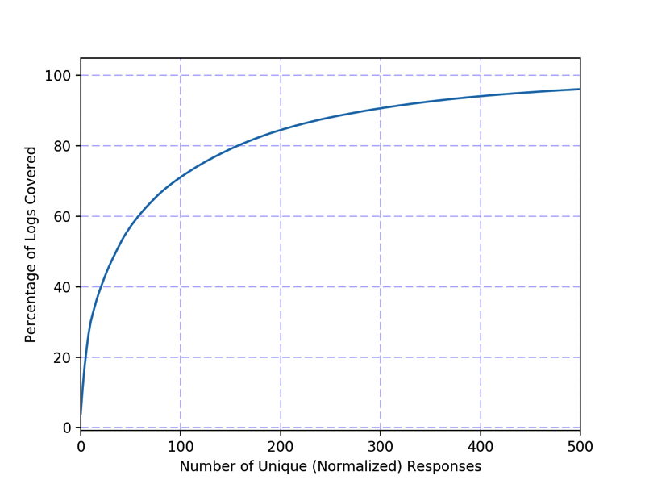
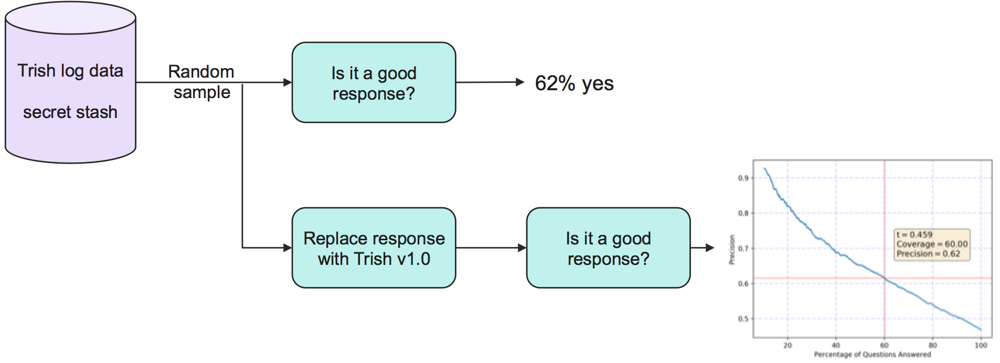
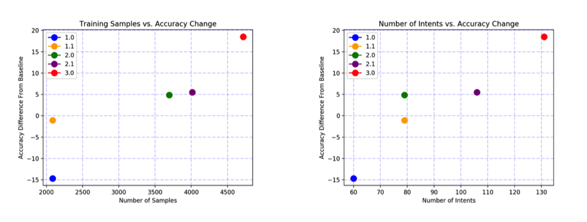

# 将业务聊天机器人移植到 Watson Assistant
了解该团队如何制作一个更“智能”的机器人

**标签:** 人工智能,零售

[原文链接](https://developer.ibm.com/zh/articles/cc-port-business-chatbot-watson-conversation/)

Anna Chaney, Sarah Lynch, Alex Block

发布: 2018-04-18

* * *

作为 Watson Applied Research 团队的成员，经常有人咨询我们如何创建新鲜、新颖、富有创新的解决方案，以解决过去影响我们集体生产力的历史难题。去年夏季，我们的一个客户联系我们，要求解决一个大家非常熟悉的问题：他们的聊天机器人没有达到他们的预期。他们想要知道是否能够使用 IBM Watson Assistant API 来改进解决方案？我们接受了他们的挑战（和他们的聊天机器人日志），并使用 Watson 构建了一个新系统。在本教程中，将讨论我们的方法、我们的指标，以及新机器人有多“智能”。

## 为我展示一些数据

任何数据科学家请求的第一样东西就是 _数据_。根据定义，有监督机器学习模型需要带标签的数据，因此，您可以为您的模型获取此数据的绝佳位置就是已部署的解决方案。在项目开始的时候，这可能引起先有鸡还是先有蛋的问题。有些人采用了综合训练，而我们更喜欢不使用实际的机器学习 (ML) 算法来部署解决方案，而是采用一个更确定的版本，然后在足够多的人与系统交互后切换到 ML 模型。

值得庆幸的是，这个客户为我们提供了人们与旧聊天机器人系统的数万次交互，我们将这个系统称为“0 号聊天机器人”。一座数据科学金矿。

## 衡量它

### 性能

测量系统性能对我们来说是一件容易的事情，我们都认为需要执行测量系统性能，但在涉及到细节的时候，它的准确含义是什么呢？由于自然语言表达的本质，可能没有一种表达某些概念的方法。而且，从理论上讲，可能有多个概念适用于某个特定情况。

我们的方法是始终从用户的角度看待问题，并在展示客户与聊天机器人的交流时，向我们的人类裁判询问“这是一个很好的回复吗？”。我们让我们的注解大军\*来回答”是”或”否”。

#### 注解大军\*

注解大军是一群人，他们在聊天机器人的规则领域获得了足够的培训，他们的意见有很高的价值，并被视为聊天机器人正确与否的最终仲裁者。请注意，在实践中，始终会存在内部注解分歧。例如，如果您向 10 位专家展示相同的信息，所有 10 个人 _几乎_ 永远都不会就正确结果达成一致意见（ _几乎所有_ 的定义都取决于该数据集的复杂程度）。因此，为了实现我们的目的，我们在确定每个判断时询问 5 个人，并采用 5 位专家中 3 位达成一致的判断。

通过人类来最终度量系统，有助于让我们的解决方案更接近人类可接受的机器人。使用拥有已知的可接受解决方案的“黄金数据”上的结果，可能会让您有陷入数据集创建者偏见的风险。这一领域的机器学习已针对它的使用方式进行了优化，而不是针对它的设计方式。

### 回答频率

当分析其他人创建的机器人的输出时，您可能会问自己，“这些人认为这个机器人应该知道什么？”身处商业领域，我们认识到每个生产运行系统的工程团队都必须做一些正确的事情，而且从正确的事情中学习与从错误的事情中学习同样重要。但是我们在这里谈论了多少件事呢？我最喜欢的可视化这一信息的方法是，按照在日志中返回答案的频率对所有答案进行排序。通过使用累积和直方图，可以非常轻松地获得这样的陈述“前 100 个答案占了日志数据的 70%”，如 [日志覆盖范围图：最常用回复的累积和直方图。97% 的日志包含来自 0 号聊天机器人的 500 种回复之一](#日志覆盖范围图：最常用回复的累积和直方图。97-的日志包含来自-0-号聊天机器人的-500-种回复之一) 中的日志覆盖范围图所示。

##### 日志覆盖范围图：最常用回复的累积和直方图。97% 的日志包含来自 0 号聊天机器人的 500 种回复之一

## 通过 Watson 进行重建

### 1.0 版

研究日志覆盖范围图的结果并考虑到自己的人为局限性后，我们决定在我们的 Watson Assistant 的第一个版本中包含 60 个意图。意图是对我的 Watson 系统将尝试识别的人类表达的分类。我们认识到，0 号聊天机器人拥有 500 多种回复，所以我们对我的 60 意图系统没抱太大期望，但我们从较小的规模开始来了解这个系统，并熟悉这一领域。

为 Watson Assistant 机器学习训练创建数据集的过程如 [处理用于 Watson Assistant 意图训练的数据](#处理用于-watson-assistant-意图训练的数据) 所示。我们先从大量的日志数据缓存开始，并随机抽取样本。我们将该样本发送给一些人，以判断 0 号聊天机器人是否提供了良好的回复。如果是，而且该回复属于前 60 种回复，则将其作为训练数据添加到与该回复匹配的意图中。如果不是，则由一个人类来判断该人类表达，看它是否是前 60 种意图之一的示例，如果是，则将它添加到训练中。

##### 处理用于 Watson Assistant 意图训练的数据

请注意，我们打算将意图与回复等同化，尽管在某个系统中这样做不一定是正确的。回复可以通过上下文进行更改，例如，一个用户询问最近商店的地址，正确的回复可能有许多，但所有这些回复都有着找到最近商店的相同意图。我们对数据集应用了一些自然语言处理技术，尝试删除特定于上下文的回复中的重复信息，从而获得规范化的回复。例如，“离您最近的零售门店是[…]”删除了地址，这样，一个唯一字符串计数就会将所有这些回复分组到一起。

### 不记名测试：使用秘密储备

还记得我们告诉过您我们拥有大量日志数据吗？我们将利用标准技巧，即使我们获得了 4 个月的数据，我们也会假装我们没有获得上月的数据，将它保留为我们的测试集。现在，我们可以使用上月的数据来模拟部署和测试。当然，用户可能在其中输入了一些来自训练集的数据，但我们将在一个使用旧的交流信息训练过的模型上测试用户体验。

测试很简单：将聊天机器人交流信息提供给注解大军，而不显示它来自哪个系统。Watson Assistant 现在已完成训练，而且来自 Watson 的回复可以取代来自 0 号聊天机器人的回复。参见 [利用上月的日志数据创建一个秘密储备](#利用上月的日志数据创建一个秘密储备-and-use-it-to-test-the-performance-of-a-watson-assistant-model-trained-only-with-older-watson-assistants)。

##### 利用上月的日志数据创建一个秘密储备

### 1.1 版

在这个项目中，这是一个激动人心的时刻。结果已经出来了，现在我们正式知道 Watson Assistant 机器人做得比 0 号聊天机器人更糟糕。但是，1.0 版只是我们可以继续执行构建的基础。从这里，我们可以向模型添加两种主要的数据类型：现有意图和新意图的样本。每次对数据进行扩充时，都会对每个意图/样本对进行第二次检查，确认它处于应该在的位置。

作为一个次要版本，我们首先决定将重点放在扩充意图的数量上。我们使用 0 号聊天机器人的正确回复中的主要意图，以及通过对所有数据进行排序得到的一些人类直觉。将数据添加到训练集，并重复执行测试。

### 2.0 版

使用之前的所有意图，向每个意图类添加更多的训练样本。并行使用 0 号聊天机器人和新的 Watson Assistant 机器人，向注解大军询问对人类的回复。

### 清理并重复

现在我们有了主要/次要模式，我们迭代了两次，然后在最后一次迭代中，即 3.0 版中，我们同时使用了两个机器人，因为它是该项目的最后一搏。

## 不断改进

### 人/机器人交互

##### 从 0 号聊天机器人到 Watson Assistant 的聊天机器人相对改进

在图 4 中，我们将结果表达为相对于基准系统（0 号聊天机器人）的性能增量。1.0 版 Watson Assistant 的性能比原始系统低 15%，但从那以后，它很快就变得更好。仅在接下来的训练迭代中，即 1.1 版中，Watson Assistant 的性能就几乎等同于 0 号聊天机器人了。在本报告中的最后一次迭代中，我们使用 3.0 版 Watson Assistant 实现了比 15% 略高一点的改进。

### 维护

除了原始准确率的提高之外，您可能已经注意到，3.0 版的 Watson Assistant 只有大约 130 个意图。这在比 0 号聊天机器人更少的差异中实现了更高的准确率，使文字编辑更容易维护聊天机器人回复。

## 附录：什么都没做

因为 Watson Assistant 是一个 _获得正确回答的概率_ 技术示例，而不是一个完美的系统，所以始终有着接近完美系统的余地。Watson Assistant 提供了各种各样的强大工具，比如实体识别，用于立即收集一组信息的会话插槽，以及对话框流。所有这些工具都为您的聊天机器人增添了可以针对您的用例进行定制的维度。

祝聊天机器人开发愉快！

本文翻译自： [Port a business chatbot to Watson Assistant](https://developer.ibm.com/articles/cc-port-business-chatbot-watson-conversation/)（2018-03-16）