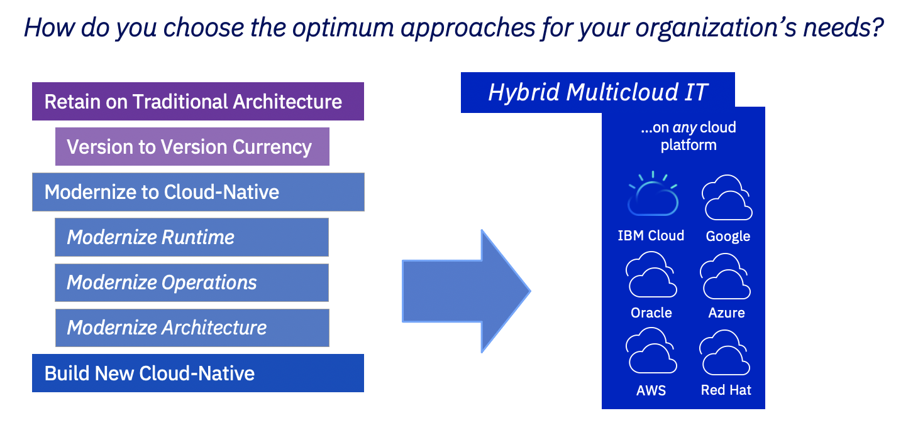

# 将有价值的 Java 应用程序现代化
针对您的业务和应用程序需求选择合适的现代化方法

**标签:** Eclipse MicroProfile,Java,Open Liberty,微服务

[原文链接](https://developer.ibm.com/zh/articles/modernize-your-valuable-java-applications/)

Graham Charters, Dave Sudlik

发布: 2020-12-17

* * *

## 简介

IT 行业媒体关于成功迁移到云的企业的报道铺天盖地，而且每天都有更多新的云原生应用程序被创建。然而，大多数迁移到云的应用程序是那些已经非常适合云环境的应用程序。但在过去的几十年来，企业纷纷投入了大量精力来构建更多的应用程序。2020 年的新冠病毒疫情只会增强这些现有资产对我们社会的重要性，需要以最少的投资让这些应用程序适应新的需求。

企业希望从现代应用程序中获益，以便：

- 大大缩短新的创新服务的上市时间
- 通过与客户实时互动，重新定义客户体验，并最大限度减少业务中断
- 优化 IT 资源以降低成本和复杂性，并获得竞争优势
- 提高安全性并保护敏感数据

要选择合适的现代化方法并实现恰当的投资回报，您需要首先了解每个应用程序的当前状态和您的业务需求。针对您的应用程序合适的现代化方法可能是：

- 将其保留在传统架构上（不是真正的现代化，但对于某些应用程序来说是个有效的选择）
- 使现有应用程序现代化，并在可能的情况下进行重构（利用现有投资来生成现代应用程序）
- 从头开始构建新的替代应用程序（在某些情况下有效）

本文将简要介绍第一种和第三种选项，并更详细地讨论第二种选项，以及通过实现运行时、运营和应用程序架构的现代化来使现有应用程序现代化有何意义。

## 针对 Java 应用程序选择合适的现代化方法

您所采取的现代化方法可能因每个应用程序而异，并且应该基于以下几个因素：

- 应用程序的预期寿命
- 应用程序的业务需求（例如，创新、敏捷性）
- 成本，无论旨在降低成本还是投资业务增长
- 技术技能和代码重用

尽管有许多言论指出，针对在容器中运行的应用程序使用微服务架构非常有效，但这并不意味着它是所有应用程序的最佳选择，而且 [您选择的架构会极大地影响您对运行时的选择](/zh/articles/choose-the-right-java-runtime-for-the-job/)。最终目标是让每个应用程序都在能为企业提供最佳投资回报的环境中运行。下图显示了可用的主要现代化选项：

我们来更详细了解一下选择每种现代化选项的原因。

## 保留在传统架构上

您可能会选择将应用程序保留在传统架构上，因为该应用程序不具有战略意义，或者由于各种原因导致使用寿命有限。现在投入时间和资源来使这些应用程序现代化可能并不值得。保留在传统架构上可以保护您的投资，同时您还可以规划其他现代化操作，例如重新架构和重新编写应用程序。

如果不进行迁移，无需执行任何操作，特别是已经在受支持的基础架构上的情况。但如果该基础架构的服务和支持终止，则需考虑升级到受支持的级别。为了保持为最新版本，修复关键安全漏洞，并在遇到问题时能够获得帮助，升级非常重要。您还将能够获得新功能和性能改进。

如果您的运行时是传统的 IBM WebSphere Application Server（V8.5.5 和 9.0.5）， [支持将至少持续到 2030 年](https://community.ibm.com/community/user/imwuc/blogs/michael-thompson/2020/03/24/was-2030-faq)，无需脱离 Java 8。如果需要升级到新版本，可考虑执行 [运行时现代化](#-1-) 作为替代方案。运行时现代化所带来的成本节省可以提高投资回报，如果需要，它将来还可以实现进一步的现代化。

## 云原生现代化

对于战略性应用程序，使其现代化并迁移到云有助于降低成本，提高敏捷性。在许多情况下，最终目标是能够在现代云架构和运行时上快速更新、重用和扩展应用程序的各个组件，从而大大缩短价值实现时间。一步到位可能具有挑战和风险，因此我们建议采用三个现代化步骤，每一步都能为业务产生价值，例如减少技术债务和运营成本，提高敏捷性：

1. _运行时现代化_（迁移到针对云和容器进行了优化的现代运行时）
2. _运营现代化_（迁移到基于 Kubernetes 的平台）
3. _架构现代化_（重构为单个可部署且可扩展的微服务）

这种顺序是最常见的方法，不过运行时现代化和运营现代化可以按顺序进行，也可以同时进行。通常，是否选择首先进行运行时现代化可能取决于企业是否已选择并推出了容器平台战略，例如 Red Hat OpenShift。如果还没有，那么运行时现代化是为容器做好准备非常重要的第一步。

我们来更详细地了解一下每个现代化步骤。

### 第 1 步. 运行时现代化：减少运营成本和技术债务

#### 操作

将现有应用程序从传统的运行时迁移到针对云和容器进行了优化的现代运行时。

#### 价值

传统应用程序服务器非常适合您，并且具有高可用性和可靠性，那么为什么要进行现代化？传统应用程序服务器的问题不在于这些特性 — 而是在于达到使工作负载投入生产的程度所需的时间和成本，以及这些工作负载投入生产后的效率。

现代敏捷交付最佳实践需要在由持续集成 (CI) 和持续交付 (CD) 流水线驱动、基于容器的部署中的轻量级运行时。这些方法消除了应用程序交付中的效率低下问题。它们可以：

- 降低运营成本（轻量级运行时消耗更少的资源，并具有更高的吞吐量）
- 减少技术债务（增强部署最新、安全且受支持的软件的能力）

传统应用程序服务器运行时在设计时没有考虑敏捷性和上云，因此它们最终将限制您兑现云原生承诺的能力。没错，您可以通过将现有应用程序和运行时放入容器中来实现运营现代化（这是迈向云原生的有效措施），但最终，您还是需要迁移到专为敏捷交付现代应用程序而设计的现代运行时。

#### 指南

实现应用程序现代化以便在 Liberty 上运行（ [Open Liberty](https://openliberty.io)，或者根据应用程序，在 [WebSphere Liberty](https://www.ibm.com/cn-zh/cloud/websphere-liberty) 上运行，因为 WebSphere Liberty 提供一些更老的传统 WebSphere 特定 API，您的应用程序可能正在使用这些）。牢记您要通过每个应用程序实现的目的。您可能想要通过采用容器/Kubernetes 实现运营现代化，并可能通过采用微服务实现架构现代化。您需要选择一个支持这个旅程的运行时。现代化的运行时需要支持整体式应用程序、微服务以及这两者所需的 API（Java EE、Jakarta EE、Eclipse MicroProfile 或 Spring Boot）。如果您选择的运行时不具有这些特征，那么您就不是在进行现代化 — 要么是在横向迁移到另一个传统运行时，要么是在进行重写，但重写很有可能带来更高的风险和更高的成本。由于 Liberty 支持 Java EE、Jakarta EE、MicroProfile 和 Spring Boot，而且能够针对特定工作负载定制运行时，因此是理想的选择。

**客户体验**

通过执行针对 Liberty 的运行时现代化，美国一家领先的医疗保健提供商将资源使用率优化了 75%，并将基础架构占用空间减少了一半。

查看“ [Open Liberty 成为开发和部署微服务的理想之选的六大理由](/zh/articles/6-reasons-why-open-liberty-is-an-ideal-choice-for-developing-and-deploying-microservices/)”（IBM Developer，2020 年 11 月），了解使用 Liberty 的好处。

当然，迁移到新的运行时并非易事，因此我们建议使用 [IBM Cloud Transformation Advisor](http://ibm.biz/cloudta) 来获得帮助。Transformation Advisor 可以：

- 评估您的现有应用程序甚至部署
- 关于需要变更的领域以及完成这些变更所需工作提供指导
- 生成配置以帮助完成迁移

### 第 2 步. 运营现代化：降低成本和复杂性，并提高灵活性

#### 操作

通过采用基于 Kubernetes 的容器编排平台，实现运营现代化。

#### 价值

采用 OpenShift 之类的容器编排平台可以使您摆脱专有的部署和集群方法，例如传统的 WebSphere Network Deployment 单元。这样，您将获得诸多好处：

- 通过技术和技能标准化，降低运营成本和复杂性。您将获得单一方法来在容器中部署、扩展和监控应用程序、数据库、缓存以及消息传递。
- 提高跨私有云和公共云的运营可移植性。几乎所有的云都支持 Kubernetes，并且所有的主要云平台都支持 OpenShift。

值得注意的是，Kubernetes 环境往往因云而异，因此，Kubernetes 可以在单一环境（例如 IBM Cloud Kubernetes Service）中为您带来一些好处，但如果选择多云管理的 Kubernetes 解决方案（例如 OpenShift），则可以在许多个云中带来这些好处。您可能不想部署到许多个云，或者认为自己不需要这样，但 [出于 GDPR 等监管原因，您可能不得不这么做](https://thenewstack.io/what-gdpr-schrems-2-and-the-end-of-privacy-shield-means-to-your-kubernetes-based-service/)。

#### 指南

要迁移到容器编排平台，您需要开始构建包含应用程序和配置的最佳实践容器镜像，并基于提供公共库、运行时、Java 和底层操作系统的容器镜像进行构建。

如果您已经执行了针对 Liberty 的运行时现代化，那么您现在所采用的运行时非常适合迁移到容器。 [Transformation Advisor](http://ibm.biz/cloudta) 工具有助于创建容器镜像，并提供有关将配置从传统 WebSphere 部署迁移到 Kubernetes 部署的建议。此外，Liberty 的每个版本都在 Docker Hub 中提供了容器镜像：

- [UBI 上的 WebSphere Liberty 容器镜像](https://hub.docker.com/r/ibmcom/websphere-liberty)
- [Ubuntu 上的 WebSphere Liberty 容器镜像](https://hub.docker.com/_/websphere-liberty)
- [UBI 上的 Open Liberty 容器镜像](https://hub.docker.com/r/openliberty/open-liberty)
- [Ubuntu 上的 Open Liberty 容器镜像](https://hub.docker.com/_/open-liberty)

用于创建这些镜像的指令、脚本和 Dockerfile 都是开源的，您可以使用它们来构建自己的容器镜像：

- [构建 WebSphere Liberty 容器镜像](https://github.com/WASdev/ci.docker)
- [构建 Open Liberty 容器镜像](https://github.com/openliberty/ci.docker)

最后， [Open Liberty Operator](https://github.com/OpenLiberty/open-liberty-operator) 有助于在 Kubernetes 环境中实现 Liberty 部署和管理。此运算符在基于 Kubernetes 的平台中（该平台支持 [Operator Framework](https://operatorframework.io/)，包括 OpenShift）与 WebSphere Liberty 和 Open Liberty 协同工作。

如果您选择先进行运营现代化再进行运行时现代化，而且您的应用程序目前在诸如传统 WebSphere 之类的传统应用程序服务器上运行，则可以将应用程序和服务器部署在单个容器中，并使用 OpenShift 对其进行扩展。 注意，Kubernetes/OpenShift 中并不提供在 WebSphere ND 中可用的全部集群功能（例如，远程 EJB 集群），因此需要小心以确保应用程序正确运行和扩展。

为了帮助使用传统 WebSphere Applications Server 实现运营现代化，IBM 针对当前支持的版本 [维护 Docker 镜像](https://hub.docker.com/r/ibmcom/websphere-traditional/)。

将传统应用程序服务器迁移到容器只能作为迈向云原生的垫脚石。传统服务器运行时在设计时从未考虑过容器、现代 DevOps 实践或云原生最佳实践，例如 [十二要素应用程序](https://12factor.net/)。从长远来看，迁移到专为容器和微服务设计的运行时将获得更好的体验，而 Liberty 是理想的选择。

### 第 3 步. 架构现代化：实现最佳扩展和云原生敏捷性

#### 操作

将整体式应用程序重构为更细粒度的云原生微服务。

#### 价值

您已经通过迁移到基于 Kubernetes 的平台实现了运营现代化，并将整体式应用程序迁移到了专为容器和云进行了优化的运行时上运行。下一步是开始采用微服务。这样，您将能够真正释放云原生微服务的全部优势：

- 通过持续集成和持续交付流水线，敏捷交付各个服务更新。交付更新不再受交付整个整体式应用程序的约束。
- 能够独立扩展单个服务，以优化云使用和云成本的方式响应各种工作负载需求。

#### 指南

架构现代化有很多个方面，但第一步是要确定整体式应用程序中需要重构为微服务的功能。一种由 AI 支持的新工具称为 [IBM Mono2Micro](/articles/mono2micro-automate-application-refactoring-using-ai/)（ [beta 版](http://ibm.biz/Mono2Micro) 可用 ），它可以分析整体式应用程序，并建议将“分区”作为要分为微服务的候选对象。您不必采用大爆炸方法来分解整个整体式应用程序。事实上，诸如“ [扼杀模式](https://www.ibm.com/garage/method/practices/code/chunking-strategy-strangler-pattern)”之类的策略已成功应用为增量方法。

在将整体式应用程序分解为微服务时，您不仅需要考虑如何分离业务逻辑，还要考虑如何分离任何关联数据。将您的应用程序重构为更小的可部署单元会有一些好处，可以用作为向独立微服务迈进的一步，但如果仍使用单片式数据存储来支持所有服务，那么您的服务仍然是耦合的。随着时间推移，可以成功采用数据现代化“扼杀”式 [数据解耦策略](https://robertheaton.com/2015/08/31/migrating-bajillions-of-database-records-at-stripe/)。这些策略包括为新服务设置单独的数据存储、批量数据复制、双重写入以及代理来自整体式应用程序的数据请求，以使新商店上线，并与整体式应用程序一起运行新服务。

迁移到松散耦合的逻辑和数据的内在需求是了解对事务的影响。 [CAP 定理](https://en.wikipedia.org/wiki/CAP_theorem) 规定，只能同时保证一致性、可用性和分区容错性中的两个特质。 在传统应用程序中，使用分布式两阶段事务管理器来确保始终一致。如果将应用程序分解为数十个或数百个微服务，而且每个微服务都由自己的数据存储进行支持，这使分布式事务变得不切实际。这就产生了有利于可用性和接受 [最终一致性](https://en.wikipedia.org/wiki/Eventual_consistency) 的方法。有两种方法可以实现上述目标： [Sagas](https://developer.ibm.com/depmodels/microservices/articles/use-saga-to-solve-distributed-transaction-management-problems-in-a-microservices-architecture#saga)（例如 [MicroProfile Long Running Actions](https://openliberty.io/blog/2020/10/27/microprofile40-jakartaee9-beta-200012.html#lra)）和 [命令查询职责分离 (CQRS)](https://www.ibm.com/cloud/architecture/architectures/event-driven-cqrs-pattern/)。从设计上看，在任何时间点，系统状态都可能是不一致的 — 视图数据可能无法立即反映最新更新，并且允许单独完成微服务之间的“协调”活动。

## 构建新的云原生应用程序

对于特别具有挑战性的应用程序，而且现代化成本高于收益，则可以考虑从头开始构建新的云原生应用程序。这样，您就有可能实现前面现代化章节中概述的好处，例如降低基础设施成本和提高敏捷性。

选择运行时以跨技能、技术和成本进行优化非常重要。如果要使现有应用程序现代化以及重写或编写新的应用程序，就有必要优化所使用的运行时和 API 数量。您选择的运行时应该有利于使用支持新的云原生 API（例如 MicroProfile）、现有 API（例如 Java EE）以及您可能使用的架构样式（例如整体式或微服务）的运行时。 还应考虑基础架构以及与使用该运行时相关的许可成本。不要假设所有新应用程序都应实现为微服务，因为这样做的收益和成本可能与您对应用程序的目标不符。

考虑 [不同架构样式的利弊，有助于您选择合适的运行时](https://developer.ibm.com/zh/languages/java/articles/choose-the-right-java-runtime-for-the-job/)，同时思考 [您为何可能需要使用 Liberty](https://developer.ibm.com/zh/components/open-liberty/articles/6-reasons-why-open-liberty-is-an-ideal-choice-for-developing-and-deploying-microservices/)。

## DevOps 的重要性

如果您已经在采用 DevOps、持续集成和持续交付，则需要考虑现代化对每个阶段的影响。本文讨论的每种现代化类型都会影响您的 DevOps 工作：在具有新运营功能的新运行时上构建、测试和部署。

如果您尚未采用 DevOps、持续集成或持续交付，则需要将其纳入现代化策略中。在现代化旅程中尽早采用 DevOps 具有很多好处，但如果您迁移到微服务，则绝对必须采用 DevOps（例如，作为 [架构现代化](#-3-) 或 [构建新应用程序](#16) 的一部分）。仅凭劳动密集型的手动交付流程和孤立的组织，您的微服务策略无法取得成功。

## 许可灵活性有助于现代化

无论采用哪种现代化策略，您的软件基础架构需求都会不断演变。尽管一开始可能是在传统的 WebSphere Application Server 上运行现有应用程序，但随着不断进步，一些工作负载将迁移到 Liberty，并可能带有新的架构，例如在 Kubernetes 上运行的容器化微服务。

IBM 提供了灵活的许可选项来帮助完成这个旅程。WebSphere Application Server 的每个单独版本均包含针对 Liberty 的权利。例如，您可以选择使用针对传统的 WebSphere 或 Liberty 的 WebSphere Application Server Network Deployment 权利。如果要在各个版本之间重新平衡，也可以使用 [IBM WebSphere Application Server Family Edition](https://www.ibm.com/no-en/marketplace/websphere-family-edition/details) 和 [IBM Cloud Pak for Applications](https://www.ibm.com/cn-zh/cloud/cloud-pak-for-applications) 之类的产品。您可以首先运行 WebSphere Application Server Network Deployment，然后等到需要在 Kubernetes 上部署到 Liberty 时，只需缩减所拥有的已部署 WebSphere Application Server Network Deployment 服务器的数量，并使用这些权利来部署 Liberty。

## 结束语

本文提供了一个用于为每个应用程序选择适当的现代化方法的框架。本文概述了如何将现代化旅程分为三个步骤，每个步骤都能实现价值，以及 Transformation Advisor 和 Mono2Micro 等工具如何提供帮助：

- 运行时现代化：迁移到针对微服务和容器进行了优化的现代运行时，以减少基础架构成本和技术债务。
- 运营现代化：迁移到基于 Kubernetes 的平台，以降低运营成本和复杂性，并提高跨公共云和私有云的可移植性。
- 架构现代化：分解为单个可部署且可扩展的微服务，以提高交付敏捷性，并优化云资源的使用。

本文描述了选择合适的运行时来支持现代化的重要性：支持整体式应用程序和微服务的运行时，两者所需的 API 以及 Liberty 为何是理想的运行时。本文还描述了 Kubernetes 作为通用云基础架构的好处，以及诸如 OpenShift 之类的平台如何真正实现跨公共云和私有云的自由部署。

我们希望这些信息对您规划和执行现代化旅程有所帮助。

本文翻译自： [Modernize your valuable Java applications](https://developer.ibm.com/articles/modernize-your-valuable-java-applications/)（2020-11-20）