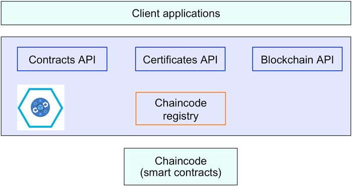
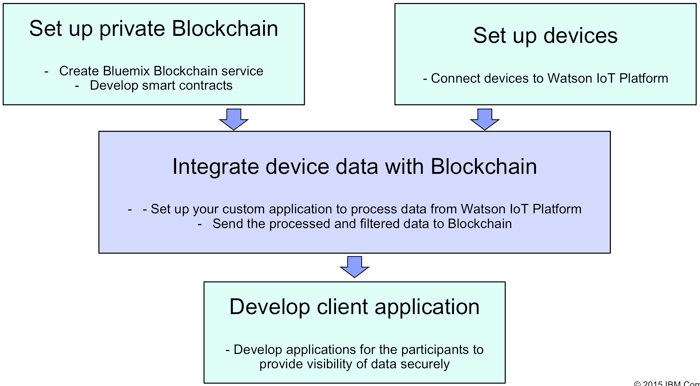
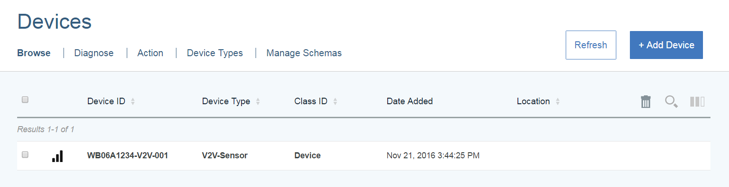

# 将设备数据与 IBM Blockchain 中的智能合约相集成
如何使用这两种技术构建端到端的、安全的、自动化的解决方案？

**标签:** 区块链

[原文链接](https://developer.ibm.com/zh/articles/cl-blockchain-for-cognitive-iot-apps-trs/)

Amitranjan Gantait, Joy Patra, Ayan Mukherjee

更新: 2017-08-07 \| 发布: 2017-02-21

* * *

各种不同的行业都开始采用物联网 (IoT) 解决方案，比如医疗、仓储、运输和物流行业。目前的集中化、基于云的 IoT 解决方案无法进行扩展，也无法解决大型企业面临的安全挑战。通过利用区块链作为参与节点之间的分布式事务账本和对等通信机制，可以解决这些问题。本文概括了受区块链支持的 IoT 解决方案，演示了如何将 IBM Blockchain 平台用于多合作伙伴环境中的 IoT 应用程序。

## 区块链是什么？

区块链是指一种分布式账本，它将事务记录列表存储在多个参与服务器中，而不是一个中央事务服务器上。区块链网络中的每个参与者都有权访问这个加密账本的最新副本，所以他们可以读取、写入和验证事务。请参阅相关主题来了解区块链的更多细节，并了解 IBM 对商用区块链的开发做出了哪些贡献。

尽管重要的区块链使用场景都在金融领域，但区块链最近在 IoT 解决方案中获得了高度关注。区块链可以为实现去中心化 IoT 的愿景提供极大帮助，简化交互设备之间的事务和协调。

## IoT 与 IBM Watson IoT Platform

IoT 给企业和用户带来了大量商机，尤其是在医疗、仓储、运输和物流领域。IoT 解决方案涉及一个由智能设备组成的复杂网络，而且 IoT 提供了根据受云支持的互联物理设备 — 从机器和汽车到家用电器 —— 来开发新服务的机会。IBM Cloud 支持的 IoT 解决方案包含 3 个主要层，每层本身都有具体的职责：

- **设备/网关：** 这些智能设备或传感器收集物理世界的数据，比如运输易腐食品的冷冻货柜的温度，或者住院患者的健康数据。设备连接到互联网，将此数据安全地传输到 IoT 平台，以便分析、处理该数据并根据该数据采取行动。
- **IBM Watson IoT Platform：** IBM 的 IoT Platform 从 IoT 设备收集数据，提供不同服务来分析数据，并采取后续行动来解决特定业务问题。Watson IoT Platform 提供了丰富的认知服务（比如机器学习、机器推理、自然语言处理和图像分析），这些服务增强了对从各种智能传感器收集的非结构化数据进行处理的能力。
- **IBM Cloud：** IBM Cloud 是一个基于开放标准的云平台，用于构建、运行和管理应用程序和服务。它支持 IoT 应用程序，能够通过多种运行时和服务，轻松地将分析和认知功能包含在这些应用程序中。

## 区块链与 IoT

尽管 IoT 采用率正在快速增长，但仍然需要解决一些关键难题，IoT 解决方案才能扩展并满足对越来越多互联设备的不断高涨的需求。IoT 解决方案必须解决围绕这些设备及其收集的数据的安全和隐私问题。一些挑战包括：

- **可伸缩性：** 目前集中化、基于云的 IoT 平台通过这些平台来执行消息路由。这种执行方式为将 IoT 解决方案扩展到大量设备上制造了瓶颈。
- **安全性：** 从数百万台设备收集的海量数据给个人、企业和政府带来了信息安全隐患和隐私问题。最近发生在　IoT 设备上的拒绝服务攻击证明，连接互联网的大量低成本设备给 IoT 的安全保障带来了重大挑战。
- **缺乏数据标准/统一性：** 世界正在朝开放数据格局转变，但没有统一的转变方法。存在着多种协议，而且没有单一平台用于连接来自所有制造商的设备。设备和平台的互操作性是 IoT 解决方案发展的关键挑战。
- **成本：** IoT 解决方案关系到大量设备及它们的网络设施。事实证明 IoT 解决方案的相关成本非常高，因为它们需要处理非常多的消息（通信成本）、设备生成的数据（存储成本）及分析流程（服务器成本）。后续发展肯定会增加这些成本。
- **架构：** 集中化的云平台仍然是端到端 IoT 解决方案中的瓶颈。其中的任何破坏都可能影响整个网络。

### 去中心化的 IoT 网络

区块链技术和 IoT 带来了一个充满希望的新世界，可利用它们来解决上述问题。基于开放标准的分布式 IoT 网络可以解决目前集中化、基于云的 IoT 解决方案的许多相关问题，包括安全性、可伸缩性和成本。例如，互联设备可以直接与分布式账本通信。然后智能合约可以使用来自这些设备的数据来更新和验证数据，随后将其传输给业务网络中所有感兴趣的参与方。这可以减少对人工监视和操作的需求，提高对设备生成的数据的信任。通过执行预定义的智能合约，并实现明确的共识机制，消除来自受损设备的操作，去中心化区块链网络也可以提高 IoT 解决方案的安全性。

IBM Watson IoT Platform 目前支持将 IBM Blockchain 服务用于 IoT 应用程序。来自 IoT 设备的数据现在可与私有区块链账本相集成，并高度安全地共享事务。区块链的分布式复制机制消除了收集并集中存储所有 IoT 数据的需求，支持以去中心化的方式使用 IoT 数据。

## 使用区块链的 IoT 用例

IoT 与区块链的结合使用，给在资产管理周期中使用智能设备创造了更多新的可能。在资产经历其生命周期的不同阶段期间，这些设备会监视不同方面，将来自资产的数据集成到业务参与方的区块链中，从而提供实时、可信的数据。借助区块链的智能合约，可创建规则来监视建筑的温度，并基于能源消耗和加入网络的供应商的能源价格信息来控制建筑温度。类似地，可基于运输途中使用的实时冷冻温度数据来确定食品的质量（及价格）。IBM（携手 Samsung）证明了能在自动洗衣机中使用区块链，这些洗衣机能够追加订购洗涤剂和替换部件，使用智能合约安排售后服务。

一些联盟（比如 [Chain of Things](http://www.chainofthings.com/)）和初创公司已证明可通过其他智能方式在 IoT 网络中利用分布式账本，自动化端到端流程以及与业务参与方的集成。下表列出了不同行业中的一些基于区块链的 IoT 用例：

行业用例供应链缺乏可视性是供应链中的一个关键问题。即使在流程数据可用时，它也不够可靠，不应触发具体操作。区块链可帮助解决供应链中的一些关键问题：可视性、优化和需求。它可以确保对供应链中参与方之间的共享数据进行合适的访问控制。与传统供应链相比，能连续实时访问区块链中可靠的共享数据的供应链能够得到更高效的优化。 基于 Blockchain 和 IoT 的具体供应链用例包括： _跟踪食品从农场到包装运输的过程_ 识别污染并减少供应链中的食品浪费 这些用例使用了 IoT 区块链中的位置、冷冻温度、土壤和天气数据流，将所有相关数据实时提供给参与方。汽车汽车行业是率先采用基于区块链的 IoT 解决方案的领先行业之一。基于区块链的解决方案正被用于提供实时信息，在关键业务合作伙伴之间执行事务 — 制造商、汽车融资公司、保险公司、服务提供商、监管机构及客户。除了在汽车供应链中采用区块链之外，来自各种车辆零部件的传感器数据也能与区块链集成，以便制定涉及服务和支付的实时决策和执行事务。 例如，Toyota 已开始使用区块链跟踪从不同国家、工厂和供应商运送来制造一辆车的数千个零部件。能源与公用事业区块链对能源行业有很大的潜力。受区块链支持的 IoT 能源网络支持对等能源事务。在一个应用中，过多的屋顶太阳能被出售给其他需要的用户 — 所有能源都通过区块链付费和记录。 Filament 等初创公司也在构建智能设备网状网络，以便监视能源网并尽可能快地解决任何出现的问题。医疗区块链的使用能帮助提高来自医疗监控设备的患者私人数据的安全性。数据安全地存储在分布式账本中，基于区块链中设置的智能访问规则向参与方提供访问权（例如经过 3 方或更多方批准）。 这也有助于向必要的参与方（比如保险公司或第三方管理者）提供实时、受信任的患者数据，帮助他们根据更准确的数据来发放款项。家庭自动化智慧城市和智能建筑中正在使用受 IoT 支持的技术来改善居民的经营活动、安全和体验。大量设备和传感器正被用于监控和管理这些设施。 受区块链支持的 IoT 网络能保护设备及从设备收集的数据。所有设施管理供应商都能参与一个私有区块链来提供及时服务，并根据完成的实际工作或服务质量来自动化支付流程。其他行业/应用区块链技术还有助于改进设备的管理和网络中的数据流的安全性。 区块链技术支持对流往不同参与方的数据执行访问控制，允许在参与方之间交换数据，并提供与数据流集成的必要支付服务。

## 区块链 IoT 应用程序的架构

下图显示了使用 IBM Cloud Hyperledger 服务的 IoT 应用程序的大体架构。

##### 区块链 IoT 应用程序架构

来自设备的数据使用 [MQTT 协议](http://mqtt.org/) 发送到 Watson IoT Platform。Watson IoT Platform 中的区块链代理根据一种预定义配置来将数据发送到链代码。根据设备数据在 IBM Cloud 中执行智能事务。

下一节将介绍各个组件。

### 解决方案组件

#### IBM Cloud Blockchain 服务

IBM Blockchain 提供私有区块链基础架构来开发受区块链支持的解决方案。 [IBM Cloud Blockchain 服务](https://cloud.ibm.com/catalog/services/blockchain?cm_sp=ibmdev-_-developer-articles-_-cloudreg) 是 Hyperledger Fabric 的一种实现。它提供了：

- 一个由 4 个对等节点组成的区块链网络
- 一个证书颁发机构服务器
- 智能合约代码（使用 Golang 开发的链代码）
- 全球/账本状态，其中包含智能合约数据的当前值（所有事务的历史记录也包含在区块链中）

下图显示了 IBM Blockchain 服务的不同子组件。

##### IBM Blockchain 服务的子组件

**智能合约** 形成基于区块链的解决方案的核心并封装业务逻辑。对智能合约的每次调用都记录为一次区块链事务。IBM Blockchain 合同（链代码）是使用 Go 语言开发的，而且需要实现 Contracts API。智能合约需要使用预定义 API 向 Blockchain 服务注册。

**Contracts API** 需要由智能合约开发人员实现。它有 3 个主要函数：`Init()`、`Invoke()` 和 `Query()`。请参阅 [IBM Cloud 文档](https://cloud.ibm.com/docs/services/blockchain?topic=blockchain-ibm-blockchain-platform) 了解此 API 的更多细节。

**Blockchain API** 是区块链应用程序的客户端 API。Hyperledger Fabric Client (HFC) SDK 使应用程序开发人员能够构建与区块链网络交互的 Node.js 应用程序。应用程序可使用此 API 安全地注册用户和提交事务。

可以通过多种方法为区块链开发客户端应用程序：

#### REST API

区块链 REST API 使用 http 服务帮助与区块链对等节点交互。下表给出了一组受支持的操作：

方法操作说明`GET``/chain/blocks/{Block}`返回区块链中特定区块的信息。`GET``/chain`chain 端点返回区块链的当前状态信息。`POST``/chaincode``/chaincode` 端点接收部署、调用和查询目标链代码的请求。`GET``/network/peers`此 API 返回与目标对等节点的所有现有网络连接的列表。该列表同时包含有效和无效的对等节点。`POST``/registrar`向证书颁发机构注册用户。`DELETE``/registrar/{enrollmentID}`从本地存储中删除任何现有的客户端登录令牌。完成此请求后，目标用户将无法再执行事务。`GET``/registrar/{enrollmentID}`确认指定的用户是否已向证书颁发机构注册。`GET``/registrar/{enrollmentID}/ecert`检索一个已向证书颁发机构注册的用户的登记证书。`GET``/registrar/{enrollmentID}/tcert`检索一个已向证书颁发机构注册的用户的事务证书。`GET``/transactions/UUID`此端点返回与指定 UUID 匹配的事务。

#### IBM-Blockchain-js

[IBM-Blockchain-js](https://github.com/IBM-Blockchain/ibm-blockchain-js) 是一个基于 IBM Cloud Blockchain 服务提供的 REST API 的 Node.js 包装器库。它在易用的 Node.js API 中提供与 REST API 中的功能类似的功能。

#### HFC SDK

Hyperledger Fabric Client (HFC) SDK for Node.js 是一个基于 gRPC 的 API，它提供了一个易用接口，用以开发基于 IBM Blockchain 服务的应用程序。HFC 是为了能在 Node.js JavaScript 中使用而设计的。有关更多细节，请参阅以下资源：

- [Hyperledger Fabric Client (HFC) SDK for Node.js](https://fabricdocs.readthedocs.io/en/latest/nodeSDK/node-sdk-guide.html)
- [GitHub 上的 Hyperledger Fabric](https://github.com/hyperledger/fabric/tree/v0.6/sdk/node)
- [IBM Blockchain 文档：HFC SDK for Node.js](https://cloud.ibm.com/docs/services/blockchain?topic=blockchain--)

#### 客户端应用程序

客户端应用程序负责向项目干系人提供所需的数据，以满足他们的业务需求并提供功能丰富的用户体验。客户端应用程序需要使用为智能合约提供的 Blockchain API 与业务账本进行交互。这些应用程序也可以处理区块链组件生成的事件。

#### IBM Watson IoT Platform

IBM Watson IoT Platform 从所有注册的设备接收数据，并将该数据处理为与区块链集成所需的格式。这意味着区块链合同开发人员不需要知道数据来源细节，可以将精力集中在开发合同逻辑上。

## 开发区块链 IoT 应用程序

下图显示了使用 IBM Watson IoT Platform 和 IBM Cloud Blockchain 服务开发受区块链支持的 IoT 应用程序的关键步骤。开发人员需要掌握多种技能，才能使用这些服务开发端到端 IoT 应用程序。

##### 开发区块链 IoT 应用程序

下面简要概述了该流程中的每个步骤：

#### 1.设置一个私有区块链基础架构

开发人员需要设置一个基于 IBM Blockchain 服务的私有区块链。请参阅 [IBM Cloud 文档](https://cloud.ibm.com/docs/services/blockchain?topic=blockchain-ibm-blockchain-platform) 了解如何设置私有区块链服务。

根据设备数据在区块链中开发和部署智能合约。合同可以设置为：如果（传感器测量的）货柜温度超过某个阈值，则拒绝装货或降低价格。

#### 2.将设备连接到 IBM Watson IoT Platform。

将传感器/网关连接到 Watson IoT Platform。这使得设备能发送将要过滤/聚合的数据，随后将它们转发到区块链。请按照 [文档](https://developer.ibm.com/recipes/tutorials/how-to-register-devices-in-ibm-iot-foundation/) 中的说明将设备添加到 Watson IoT Platform。成功添加后，Watson IoT 仪表板上的 Devices 页面将类似于：

##### Watson IoT 仪表板的 Devices 页面

#### 3.将设备数据与区块链分布式账本集成

收到设备数据后，需要将传入的原始数据或经过过滤/分析的数据发送给 IBM Cloud 中运行的 Blockchain 服务。可从 Node-RED 工作流使用 HFC REST API 来触发区块链智能合约。也可使用 Node-RED 聚合和/或过滤设备事件，并使用需要的参数调用智能合约。

#### 4.为最终用户开发客户端应用程序

最后一步是让最终用户能访问事务输出/事件。可以使用 Blockchain API 开发客户端服务（上一节已介绍），使用 IBM Cloud 支持的多种语言/平台开发其他分析服务。

## 结束语

如您所见，在 IoT 解决方案中使用区块链开发应用程序具有巨大的潜力，而且这种组合可解决一些限制采用 IoT 的关键问题，比如安全性和可伸缩性。具有嵌入式智能合约的分布式账本能提高安全性和信任，自动化由多个业务合作伙伴组成的完整流程。IBM Watson IoT Platform 能与基于 IBM Cloud 的 Blockchain 服务组合，为基于区块链（且基于开放标准）的 IoT 应用程序提供一个可立即部署的平台。

但是，仍有许多挑战需要克服。基于区块链的 IoT 应用程序的关键挑战之一是，许多 IoT 设备的计算能力有限。区块链事务的加密和验证可能需要大量处理能力，低端设备可能不具备这种能力。而且使用更多处理能力可能会增加解决方案的能耗和成本。

在本文的 [第 2 部分](http://www.ibm.com/developerworks/cn/cloud/library/cl-blockchain-for-cognitive-iot-apps2/index.html) 中，将演示如何集成 IBM Watson IoT Platform 与 IBM Blockchain 服务来开发一个应用程序，该应用程序使用（模拟）车辆和 V2V 传感器数据在 IBM Blockchain 中执行智能事务处理。

本文翻译自： [Integrate device data with smart contracts in IBM Blockchain](http://www.ibm.com/developerworks/cloud/library/cl-blockchain-for-cognitive-iot-apps-trs)（2017-06-01）