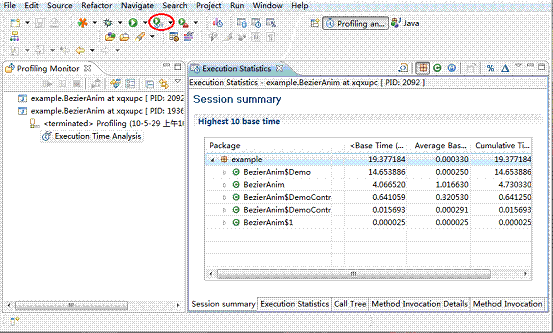
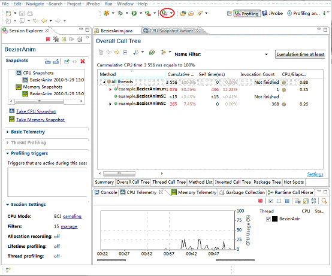
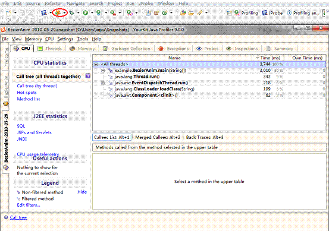
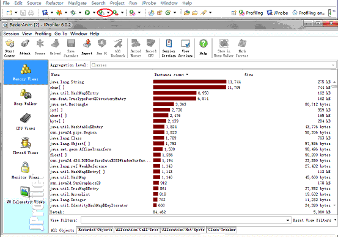

# 常用 Java Profiling 工具的分析与比较
帮助 Java 程序员选择合适的 Java Profiling 工具

**标签:** Java

[原文链接](https://developer.ibm.com/zh/articles/j-lo-profiling/)

周鹏, 徐晓琴

发布: 2010-08-13

* * *

相对于静态代码分析，Profiling 是通过收集程序运行时的信息来研究程序行为的动态分析方法。其目的在于定位程序需要被优化的部分，从而提高程序的运行速度或是内存使用效率。收集程序运行时信息的方法主要有以下三种：

- 事件方法：对于 Java，可以采用 JVMTI（JVM Tools Interface）API 来捕捉诸如方法调用、类载入、类卸载、进入/离开线程等事件，然后基于这些事件进行程序行为的分析。
- 统计抽样方法（sampling）: 该方法每隔一段时间调用系统中断，然后收集当前的调用栈（call stack）信息，记录调用栈中出现的函数及这些函数的调用结构，基于这些信息得到函数的调用关系图及每个函数的 CPU 使用信息。由于调用栈的信息是每隔一段时间来获取的，因此不是非常精确的，但由于该方法对目标程序的干涉比较少，目标程序的运行速度几乎不受影响。
- 植入附加指令方法（BCI）: 该方法在目标程序中插入指令代码，这些指令代码将记录 profiling 所需的信息，包括运行时间、计数器的值等，从而给出一个较为精确的内存使用情况、函数调用关系及函数的 CPU 使用信息。该方法对程序执行速度会有一定的影响，因此给出的程序执行时间有可能不准确。但是该方法在统计程序的运行轨迹方面有一定的优势。

目前市面上的 Java Profiler 工具采用的信息收集方法通常是以上三种方法的任意组合。

## Profiler 工具功能简介

虽然市场上的 Java Profiler 工具有不少，但是基本功能大多相似，本节首先对这些基本功能进行介绍。

- 遥测（Telemetry）：遥测是一种用来查看应用程序运行行为的最简单的方法。通常会有多个视图（View）分别实时地显示 CPU 使用情况、内存使用情况、线程状态以及其他一些有用的信息，以便用户能很快地发现问题的关键所在。

    - CPU Telemetry 视图一般用于显示整个应用程序的 CPU 使用情况，有些工具还能显示应用程序中每个线程的 CPU 使用情况。
    - Memory Telemetry 视图一般用于显示堆内存和非堆内存的分配和使用情况。
    - Garbage Collection Telemetry 视图显示了 JVM 中垃圾收集器的详细信息。
    - Threads Telemetry 视图一般用于显示当前运行线程的个数、守护进程的个数等信息。
    - Classes Telemetry 视图一般用于显示已经载入和还没有载入的类的数量。
- 快照（snapshot）：应用程序启动后，profiler 工具开始收集各种执行数据，其中一些数据直接显示在遥测视图中，而另外大部分数据被保存在内部，直到用户要求获取快照，基于这些保存的数据的统计信息才被显示出来。快照包含了应用程序在一段时间内的执行信息，通常有两种类型的快照：CPU 快照和内存快照。

    - CPU 快照主要包含了应用程序中函数的调用关系及运行时间，这些信息通常可以在 CPU 快照视图中进行查看。
    - 内存快照则主要包含了内存的分配和使用情况、载入的所有类、存在的对象信息及对象间的引用关系。这些信息通常可以在内存快照视图中进行查看。
- CPU Profiling：CPU Profiling 的主要目的是统计函数的调用情况及执行时间，或者更简单的情况就是统计应用程序的 CPU 使用情况。通常有两种方式来显示 CPU Profiling 结果：CPU 遥测和 CPU 快照。
- 内存 Profiling：内存 Profiling 的主要目的是通过统计内存使用情况检测可能存在的内存泄露问题及确定优化内存使用的方向。通常有两种方式来显示内存 Profiling 结果：内存遥测和内存快照
- 线程 Profiling：线程 Profiling 主要用于在多线程应用程序中确定内存的问题所在。 一般包括三个方面的信息：

    - 某个线程的状态变化情况
    - 死锁情况
    - 某个线程在线程生命期内状态的分布情况
- Profiling 的启动设置：类似于 eclipse 中 Run 和 Debug 的启动设置，进行 Profiling 之前也需要进行启动设置，包括：profiling 的模式 (CPU profiling 或内存 profiling)，信息获取类型（遥测 , 抽样统计或者 BCI) 等等。
- Profiler Preference 设置：主要用于 Profiler 过滤器（选择需要关注的包、类）、取样间隔时间的设置等。

## Java Profiler 工具介绍

本文接下来将对目前市场上常见的几种 Java Profiler 工具进行介绍。

### TPTP

TPTP（Test and Performance Tools Platform）是 eclipse 官方的 Profiling 工具插件。TPTP 提供了诸如测试，追踪（trace），性能测试，图形界面性能分析等功能。同时 TPTP 还是一个可扩展的开发平台框架，你可以对它加以扩展集成到你自己的产品中。TPTP 可以通过 Eclipse update Manager 或者是安装包进行安装，安装成功后会在 eclipse 中增加如下所示的按钮，另外一个专门的用于检查 TPTP profiling 结果的 perspective 也会添加进 eclipse 中，如下图所示：

##### 图 1\. TPTP

### CodePro Profiler

CodePro Profiler 是由 instantiations 公司推出的一款商用 eclipse 插件，它可以通过 Eclipse update Manager 进行安装或者是将安装包直接解压缩后保存在 eclipse 的指定目录下。与 TPTP 类似，安装成功后，有一个专门的用于查看 CodePro profiling 结果的 perspective 会添加进 eclipse 中，如下图所示：

##### 图 2\. CodePro

### YourKit Profiler

YourKit Java Profiler 也是一款商用软件，支持的操作系统包括：Windows, Linux, FreeBSD, Mac OS X, Solaris 以及 HP-UX；支持的 IDE 包括：Eclipse, JBuilder, JDeveloper, NetBeans 以及 Intellij IDEA。安装成功且首次启动 YourKit Java Profiler 后，会弹出一个对话框，让用户选择 YourKit Java Profiler 要集成进的 IDE，并指定该 IDE 的安装路径，点击”Install Plugin”按钮并集成成功之后，Eclipse 中会出现如下图标，用户就可以从 Eclipse 中启动 Profiling，但是 profiling 的结果需要在 YourKit Java Profiler 中进行查询，如下图所示：

##### 图 3\. YourKit

### JProfiler

JProfiler 是由 ej-technologies 推出的一款商用软件，支持的操作系统有：Windows, Linux, Mac OS X, FreeBSD, Solaris, AIX 以及 HP-UX；支持的 IDE 包括：Eclipse, NetBeans, Intellij IDEA, JBuiler 以及 JDeveloper。安装成功并首次启动 JProfiler 后，会弹出一个设置界面，当完成左栏所示的那些步骤后，Eclipse 中就会出现如下图标，用户就可以从 Eclipse 中启动 Profiling。与 YourKit Java Profiler 类似，profiling 的结果需要在 JProfiler 中进行查询，如下图所示：

##### 图 4\. JProfiler

## Java Profiler 工具比较

本章节将从如下几个方面对上述工具进行比较：

- 与 Eclipse 的集成性

    - TPTP：是一款基于 Eclipse 开发的插件，因此与 eclipse 的集成性很好。安装成功后，对 TPTP 的一切设置与操控都可以在 eclipse 中完成；另外，profiling 的结果也可以在 eclipse 中进行查询。
    - CodePro Profiler: 与 TPTP 类似，CodePro Profiler 也是一款基于 eclipse 开发的插件，因此与 eclipse 的集成性很好好。用户在 eclipse 中就可以完成对 profiling 的所有操作。
    - YourKit Java Profiler: YourKit Java Profiler 可以说是一个比较独立的工具，安装成功后，用户可以直接在 eclipse 中启动 YourKit Java Profiler 并对 profiling 选项进行配置，但是用户必须在 YourKit Java Profiler 工具中对 Profiling preferrence 进行配置，而且 profiling 信息必须在 YourKit Java Profiler 中进行查看。因此和 Eclipse 的集成度一般。
    - JProfiler: JProfiler 也是一款比较独立的工具，安装成功后，用户可以直接在 eclipse 中启动 JProfiler，其他所有操作必须回到 JProfiler 工具中进行。因此和 Eclipse 的集成性不好。
- 遥测种类

    - TPTP：目前使用的 4.6.2 的版本只提供了线程 Telemetry。
    - CodePro Profiler: 总共有五个类型：CPU, 内存 , 线程 , 载入的类以及垃圾收集。
    - YourKit Java Profiler: 与 CodePro Profiler 相比，缺少载入类的监测。
    - JProfiler: 与 CodePro Profiler 一样，总共有五个类型的监测方法。
- CPU 快照包含的统计数据类型

    - TPTP： CPU 快照包含的统计数据有：

        - 包的组成关系，细化到包含的类及类中的方法。
        - 方法的调用关系：以每个线程为根节点的方法调用信息，对于树中出现的代表方法的每个节点，列出了该方法的运行时间或运行时间百分比，以及该方法被调用的次数。
        - 方法被调用情况：列出了直接调用某方法的其他方法，以及这些方法调用该方法的次数及相关运行时间。
        - 热点列表：包含了 CPU 占用时间排列前十的方法、类或包。
    - CodePro Profiler: CPU 快照包含的统计数据类型有：

        - 包的组成关系，细化到包含的类及类中的方法。
        - 方法的调用关系。以树结构表示，根据根节点表示的对象的不同，分为三种类型：以每个线程为根节点的方法调用关系，以整个线程为根节点的方法调用关系，以及以每个方法为根节点的方法调用关系。对于树中出现的代表方法的每个节点，列出了该方法的运行时间或运行时间百分比，以及由该方法生成的对象个数和为这些对象分配的内存大小。
        - 方法的被调用关系。该关系以树结构表示，其中根节点为某个指定的方法，每个节点的子节点为父节点的调用者。
        - 热点列表：包含了 CPU 占用时间排前的一些方法。
    - YourKit Java Profiler：CPU 快照包含的统计数据类型与 CodePro Profiler 类似；
    - JProfiler：与 CodePro Profiler 相比，缺少以每个方法为根节点的方法调用关系。因此当要查看以某个方法为调用起点的调用关系时，需要到以线程为根的树结构当中去查找。另外，方法的被调用关系不是以树结构来表示的，而是以图的方式来显示的，当调用关系比较复杂的时候，很难在一个屏幕中看到一个全局关系图。
- 内存快照包含的统计数据类型

    - TPTP：包含了类实例的内存分配情况，包括实例化的对象个数，以及这些对象的本身占用内存的大小。相对于其它 Java Profiler 工具，TPTP 的内存快照包含的统计数据类型比较少。
    - CodePro Profiler: 包含的统计数据有

        - 类实例的内存分配情况，包括实例化的对象个数，以及这些对象的 shallow 和 retained 大小。（Shallow size 就是对象本身占用内存的大小，不包含对其他对象的引用；Retained size 是该对象自己的 shallow size，加上从该对象能直接或间接访问到的 shallow size 之和，即该对象被 GC 之后所能回收到内存的总和）。
        - 最大对象列表：包含了 retained 大小排前的一些对象。
        - 有可能存在内存泄漏的对象列表：包含了有可能存在内存泄漏的对象以及可能性大小。
    - YourKit Java Profiler：与 CodePro Profiler 相比，缺少内存泄露对象列表这一项。
    - JProfiler：与 CodePro Profiler 相比，缺少 retained size 统计数据及内存泄露对象列表。
- 源代码定位功能，即在快照中选中某个类、成员变量或者方法时，可以在源代码中定位到对应的定义。

    - TPTP：只能定位到某个类，无法定位到方法或其中的成员变量。
    - CodePro Profiler: 拥有该功能，但是只能定位到类及成员变量，无法定位到方法。
    - YourKit Java Profiler：可以定位到类、成员变量及方法。
    - JProfiler：与 CodePro Profiler 类似。
- 快照操作，主要从快照的获取、快照的保存及快照的比较这三方面进行比较。

    - TPTP：当应用程序启动后，用户可以选择在适当的时候进行快照获取；这些快照不会自动保存，因此当 eclipse 关闭后，这些快照数据将会消失，但是用户可以通过 export 的方式将需要的快照保存下来。
    - CodePro Profiler: 当应用程序启动后，用户可以选择在适当的时候进行快照获取；这些快照会被自动保存在 Eclipse Workspace 之外的一个临时的空间，当 eclipse 关闭后，这些快照将会消失，用户可以通过 export 的方式将需要的快照保存下来；CodePro Profiler 还提供了快照的比较功能，不过前提是这两个快照的类型必须相同（例如：都是以 sampling 模式或 BCI 模式运行的）。
    - YourKit Java Profiler：当应用程序启动后，用户可以选择在适当的时候进行快照获取，针对内存快照，YourKit Java Profiler 还提供了自动获取快照的功能；这些快照会被自动保存到一个临时的文件夹中，eclipse 关闭后，这些文件不会消失；另外，YourKit Java Profiler 也提供了快照比较功能。
    - JProfiler：工具会要求你指定一个目录来保存该 snapshot。
- 性能，在 sampling 模式下，这些工具的性能相差不大，这里主要比较在 BCI 模式下的性能。

    - TPTP：目前使用的 4.6.2 的版本没有 BCI 模式。
    - CodePro Profiler：当程序比较大的情况下，采用 BCI 模式进行 profiling 的速度比较慢；另外，在获取内存泄露候选者的时候，速度也是相当慢。（当程序代码量 5 万行时，用 CodePro Profiler 进行 Profiling 需要 5 分钟，在获取内存泄露候选者时，需要花费 20 分钟）
    - YourKit Java Profiler：BCI 模式下的运行速度还可以。（当程序代码量为 5 万行时，需要 1 分钟）
    - JProfiler：感觉不出程序运行速度受影响。（当程序代码量为 5 万行时，需要半分钟）
- 健壮性，采用 CodePro Profiler 对比较大的应用程序进行 profiling 时，很容易出现栈溢出的错误。

## 结束语

TPTP 是一款基于 eclipse 的开源软件，且提供的功能比较简单，因此适用于基于 eclipse 开发的应用程序，且该应用程序比较简单的情况；Codepro Profiler 提供的功能相对来说比较丰富，且与 eclipse 的集成性很好，但是在性能方面有待改善，因此适用于基于 eclipse 开发的应用程序，且对性能要求不高的情况；YourKit Java Profiler，JProfiler 与 Eclipse 的集成性都属于一般，提供的功能也比较丰富，且性能不错，因此适用于对 eclipse 集成度要求不高，且对性能要求较高的情况。

## 相关主题

- [Profiling 原理](https://en.wikipedia.org/wiki/Profiling_(computer_programming))
- [TPTP 介绍](https://www.eclipse.org/tptp/)
- [YourKit Java Profiler 介绍](https://www.yourkit.com/)
- [JProfiler 介绍](https://www.ej-technologies.com/products/jprofiler/resources.html)
- [使用 TPTP 对 Eclipse 插件进行性能剖析和调优](https://www.ibm.com/developerworks/cn/opensource/os-cn-ecl-tptpplugin/)