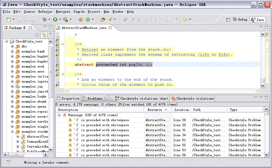
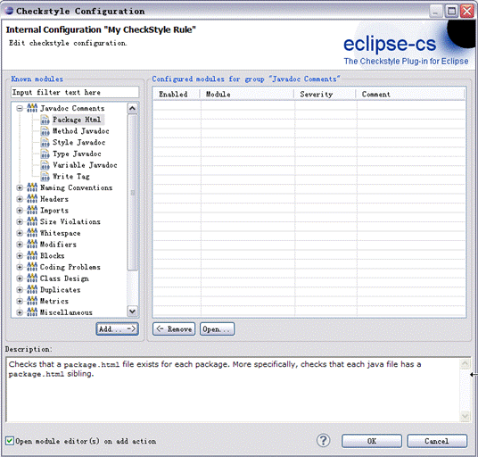
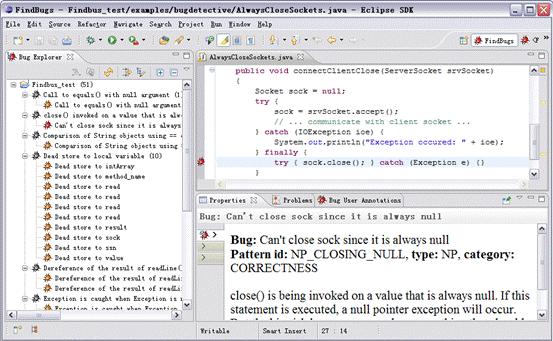
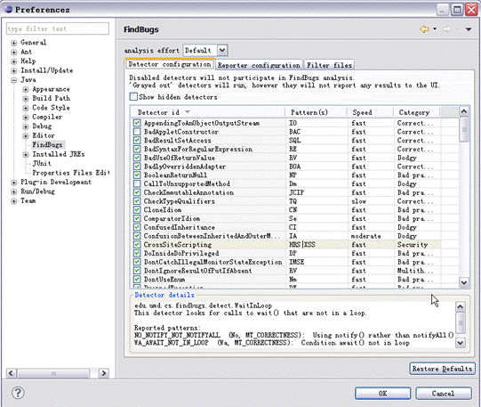
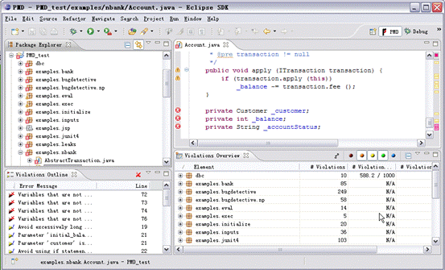
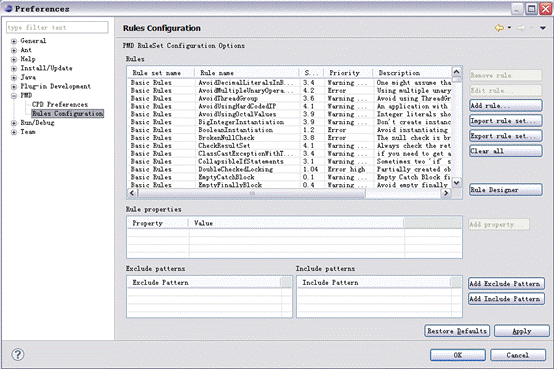
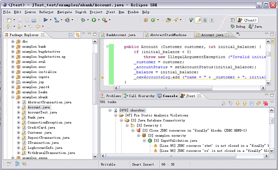
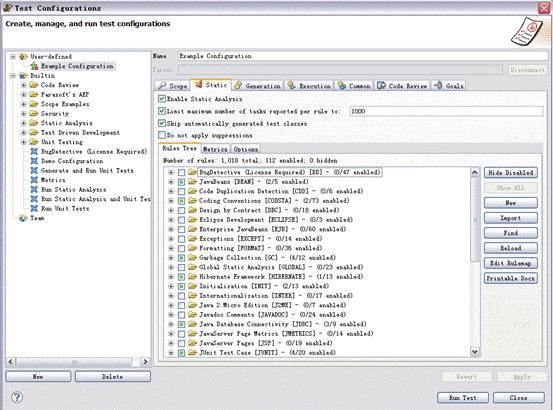

# 常用 Java 静态代码分析工具的分析与比较
4 种主流 Java 静态代码分析工具：Checkstyle，FindBugs，PMD，Jtest

**标签:** Java

[原文链接](https://developer.ibm.com/zh/articles/j-lo-statictest-tools/)

赵卓

发布: 2011-06-30

* * *

## 引言

在 Java 软件开发过程中，开发团队往往要花费大量的时间和精力发现并修改代码缺陷。Java 静态代码分析（static code analysis）工具能够在代码构建过程中帮助开发人员快速、有效的定位代码缺陷并及时纠正这些问题，从而极大地提高软件可靠性并节省软件开发和测试成本。目前市场上的 Java 静态代码分析工具种类繁多且各有千秋，因此本文将分别介绍现有 4 种主流 Java 静态代码分析工具 (Checkstyle，FindBugs，PMD，Jtest)，并从功能、特性等方面对它们进行分析和比较，希望能够帮助 Java 软件开发人员了解静态代码分析工具，并选择合适的工具应用到软件开发中。

## 静态代码分析工具简介

### 什么是静态代码分析

静态代码分析是指无需运行被测代码，仅通过分析或检查源程序的语法、结构、过程、接口等来检查程序的正确性，找出代码隐藏的错误和缺陷，如参数不匹配，有歧义的嵌套语句，错误的递归，非法计算，可能出现的空指针引用等等。

在软件开发过程中，静态代码分析往往先于动态测试之前进行，同时也可以作为制定动态测试用例的参考。统计证明，在整个软件开发生命周期中，30% 至 70% 的代码逻辑设计和编码缺陷是可以通过静态代码分析来发现和修复的。

但是，由于静态代码分析往往要求大量的时间消耗和相关知识的积累，因此对于软件开发团队来说，使用静态代码分析工具自动化执行代码检查和分析，能够极大地提高软件可靠性并节省软件开发和测试成本。

### 静态代码分析工具的优势

1. 帮助程序开发人员自动执行静态代码分析，快速定位代码隐藏错误和缺陷。

2. 帮助代码设计人员更专注于分析和解决代码设计缺陷。

3. 显著减少在代码逐行检查上花费的时间，提高软件可靠性并节省软件开发和测试成本。


## Java 静态代码分析理论基础和主要技术

- 缺陷模式匹配：缺陷模式匹配事先从代码分析经验中收集足够多的共性缺陷模式，将待分析代码与已有的共性缺陷模式进行模式匹配，从而完成软件的安全分析。这种方式的优点是简单方便，但是要求内置足够多缺陷模式，且容易产生误报。
- 类型推断：类型推断技术是指通过对代码中运算对象类型进行推理，从而保证代码中每条语句都针对正确的类型执行。这种技术首先将预定义一套类型机制，包括类型等价、类型包含等推理规则，而后基于这一规则进行推理计算。类型推断可以检查代码中的类型错误，简单，高效，适合代码缺陷的快速检测。
- 模型检查：模型检验建立于有限状态自动机的概念基础之上，这一理论将被分析代码抽象为一个自动机系统，并且假设该系统是有限状态的、或者是可以通过抽象归结为有限状态。模型检验过程中，首先将被分析代码中的每条语句产生的影响抽象为一个有限状态自动机的一个状态，而后通过分析有限状态机从而达到代码分析的目的。模型检验主要适合检验程序并发等时序特性，但是对于数据值域数据类型等方面作用较弱。
- 数据流分析：数据流分析也是一种软件验证技术，这种技术通过收集代码中引用到的变量信息，从而分析变量在程序中的赋值、引用以及传递等情况。对数据流进行分析可以确定变量的定义以及在代码中被引用的情况，同时还能够检查代码数据流异常，如引用在前赋值在后、只赋值无引用等。数据流分析主要适合检验程序中的数据域特性。

## 现有主流 Java 静态分析工具

### Checkstyle

Checkstyle 是 SourceForge 的开源项目，通过检查对代码编码格式，命名约定，Javadoc，类设计等方面进行代码规范和风格的检查，从而有效约束开发人员更好地遵循代码编写规范。

Checkstyle 提供了支持大多数常见 IDE 的插件，文本主要使用 Eclipse 中的 Checkstyle 插件。如下图 1 所示，Checkstyle 对代码进行编码风格检查，并将检查结果显示在 Problems 视图中。图中，代码编辑器中每个放大镜图标表示一个 Checkstyle 找到的代码缺陷。开发人员可通过在 Problems 视图中查看错误或警告详细信息。

##### 图 1\. 使用 Checkstyle 进行编码风格检查



此外，Checkstyle 支持用户根据需求自定义代码检查规范，在下图 2 中的配置面板中，用户可以在已有检查规范如命名约定，Javadoc，块，类设计等方面的基础上添加或删除自定义检查规范。

##### 图 2\. 使用 Checkstyle 添加自定义代码检查规范



### FindBugs

FindBugs 是由马里兰大学提供的一款开源 Java 静态代码分析工具。FindBugs 通过检查类文件或 JAR 文件，将字节码与一组缺陷模式进行对比从而发现代码缺陷，完成静态代码分析。FindBugs 既提供可视化 UI 界面，同时也可以作为 Eclipse 插件使用。文本将主要使用将 FindBugs 作为 Eclipse 插件。在安装成功后会在 eclipse 中增加 FindBugs perspective，用户可以对指定 Java 类或 JAR 文件运行 FindBugs，此时 FindBugs 会遍历指定文件，进行静态代码分析，并将代码分析结果显示在 FindBugs perspective 的 bugs explorer 中，如下图 3 所示：

##### 图 3\. 使用 FindBugs 进行静态代码分析



图中 Bug Explorer 中的灰色图标处为 Bug 类型，每种分类下红色图标表示 bug 较为严重，黄色的图标表示 bug 为警告程度。Propreties 列出了 bug 的描述信息及修改方案。

此外，FindBugs 还为用户提供定制 Bug Pattern 的功能。用户可以根据需求自定义 FindBugs 的代码检查条件，如下图 4 所示：

##### 图 4\. 使用 FindBugs 添加自定义代码检查规范



### PMD

PMD 是由 DARPA 在 SourceForge 上发布的开源 Java 代码静态分析工具。PMD 通过其内置的编码规则对 Java 代码进行静态检查，主要包括对潜在的 bug，未使用的代码，重复的代码，循环体创建新对象等问题的检验。PMD 提供了和多种 Java IDE 的集成，例如 Eclipse，IDEA，NetBean 等。本文主要使用 PMD 以插件方式与 Eclipse 集成。如下图 5 所示：在 Violations Overview 视图中，按照代码缺陷严重性集中显示了 PMD 静态代码分析的结果。

##### 图 5\. 使用 PMD 进行静态代码分析



PMD 同样也支持开发人员对代码检查规范进行自定义配置。开发人员可以在下图 6 中的面板中添加、删除、导入、导出代码检查规范。

##### 图 6\. 使用 PMD 添加自定义代码检查规范



### Jtest

Jtest 是 Parasoft 公司推出的一款针对 Java 语言的自动化代码优化和测试工具，Jtest 的静态代码分析功能能够按照其内置的超过 800 条的 Java 编码规范自动检查并纠正这些隐蔽且难以修复的编码错误。同时，还支持用户自定义编码规则，帮助用户预防一些特殊用法的错误。Jtest 提供了基于 Eclipse 的插件安装。Jtest 支持开发人员对 Java 代码进行编码规范检查，并在 Jtask 窗口中集中显示检查结果，如下图 7 所示：

##### 图 7\. 使用 Jtest 进行静态代码分析



同时，Jtest 还提供了对用户定制代码检查配置甚至自定义编码规则的支持，这一功能使得开发人员可以基于不同场景定制所需要的编码规范，如图 8 所示：

##### 图 8\. 使用 Jtest 添加自定义代码检查规范



## Java 静态分析工具对比

本章节将从以下几个方面对上述 Java 静态分析工具进行比较：

### 应用技术及分析对象

下表 1 列出了不同工具的分析对象及应用技术对比：

##### 表 1\. 不同工具的分析对象及应用技术对比

Java 静态分析工具分析对象应用技术CheckstyleJava 源文件缺陷模式匹配FindBugs字节码缺陷模式匹配；数据流分析PMDJava 源代码缺陷模式匹配JtestJava 源代码缺陷模式匹配；数据流分析

### 内置编程规范

Checkstyle：

- Javadoc 注释：检查类及方法的 Javadoc 注释
- 命名约定：检查命名是否符合命名规范
- 标题：检查文件是否以某些行开头
- Import 语句：检查 Import 语句是否符合定义规范
- 代码块大小，即检查类、方法等代码块的行数
- 空白：检查空白符，如 tab，回车符等
- 修饰符：修饰符号的检查，如修饰符的定义顺序
- 块：检查是否有空块或无效块
- 代码问题：检查重复代码，条件判断，魔数等问题
- 类设计：检查类的定义是否符合规范，如构造函数的定义等问题

FindBugs：

- Bad practice 坏的实践：常见代码错误，用于静态代码检查时进行缺陷模式匹配
- Correctness 可能导致错误的代码，如空指针引用等
- 国际化相关问题：如错误的字符串转换
- 可能受到的恶意攻击，如访问权限修饰符的定义等
- 多线程的正确性：如多线程编程时常见的同步，线程调度问题。
- 运行时性能问题：如由变量定义，方法调用导致的代码低效问题。

PMD：

- 可能的 Bugs：检查潜在代码错误，如空 try/catch/finally/switch 语句
- 未使用代码（Dead code）：检查未使用的变量，参数，方法
- 复杂的表达式：检查不必要的 if 语句，可被 while 替代的 for 循环
- 重复的代码：检查重复的代码
- 循环体创建新对象：检查在循环体内实例化新对象
- 资源关闭：检查 Connect，Result，Statement 等资源使用之后是否被关闭掉

Jtest

- 可能的错误：如内存破坏、内存泄露、指针错误、库错误、逻辑错误和算法错误等
- 未使用代码：检查未使用的变量，参数，方法
- 初始化错误：内存分配错误、变量初始化错误、变量定义冲突
- 命名约定：检查命名是否符合命名规范
- Javadoc 注释：检查类及方法的 Javadoc 注释
- 线程和同步：检验多线程编程时常见的同步，线程调度问题
- 国际化问题：
- 垃圾回收：检查变量及 JDBC 资源是否存在内存泄露隐患

### 错误检查能力

为比较上述 Java 静态分析工具的代码缺陷检测能力，本文将使用一段示例代码进行试验，示例代码中将涵盖我们开发中的几类常见错误，如引用操作、对象操作、表达式复杂化、数组使用、未使用变量或代码段、资源回收、方法调用及代码设计几个方面。最后本文将分别记录在默认检查规范设置下，不同工具对该示例代码的分析结果。以下为示例代码 Test.java。其中，代码的注释部分列举了代码中可能存在的缺陷。

##### 清单 1\. Test.java 示例代码

```
package Test;
import java.io.*;
public class Test {
    /**
     * Write the bytes from input stream to output stream.
     * The input stream and output stream are not closed.
     * @param is
     * @param os
     * @throws IOException
     */
    public  boolean copy(InputStream is, OutputStream os) throws IOException {
        int count = 0;
        //缺少空指针判断
        byte[] buffer = new byte[1024];
        while ((count = is.read(buffer)) >= 0) {
            os.write(buffer, 0, count);
        }
        //未关闭I/O流
        return true;
    }
    /**
     *
     * @param a
     * @param b
     * @param ending
     * @return copy the elements from a to b, and stop when meet element ending
     */
    public void copy(String[] a, String[] b, String ending)
    {
        int index;
        String temp = null;
        //空指针错误
        System.out.println(temp.length());
        //未使用变量
        int length=a.length;
        for(index=0; index&a.length; index++)
        {
            //多余的if语句
            if(true)
            {
                //对象比较 应使用equals
                if(temp==ending)
                {
                    break;
                }
                //缺少 数组下标越界检查
                b[index]=temp;
            }
        }
    }
    /**
     *
     * @param file
     * @return file contents as string; null if file does not exist
     */
    public  void  readFile(File file) {
        InputStream is = null;
        OutputStream os = null;
            try {
                is = new BufferedInputStream(new FileInputStream(file));
                os = new ByteArrayOutputStream();
                //未使用方法返回值
                copy(is,os);
                is.close();
                os.close();
            } catch (IOException e) {
                //可能造成I/O流未关闭
                e.printStackTrace();
            }
            finally
            {
                //空的try/catch/finally块
            }
    }
}

```

Show moreShow more icon

通过以上测试代码，我们对已有 Java 静态代码分析工具的检验结果做了如下比较，如下表 2 所示。

##### 表 2\. Java 静态代码分析工具对比

**代码缺陷分类****示例****Checkstyle****FindBugs****PMD****Jtest**引用操作空指针引用√√√√对象操作对象比较（使用 == 而不是 equals）√√√表达式复杂化多余的 if 语句√数组使用数组下标越界√未使用变量或代码段未使用变量√√√资源回收I/O 未关闭√√方法调用未使用方法返回值√代码设计空的 try/catch/finally 块√

由表中可以看出几种工具对于代码检查各有侧重。其中，Checkstyle 更偏重于代码编写格式，及是否符合编码规范的检验，对代码 bug 的发现功能较弱；而 FindBugs，PMD，Jtest 着重于发现代码缺陷。在对代码缺陷检查中，这三种工具在针对的代码缺陷类别也各有不同，且类别之间有重叠。

## 总结

本文分别从功能、特性和内置编程规范等方面详细介绍了包括 Checkstyle，FindBugs，PMD，Jtest 在内的四种主流 Java 静态代码分析工具，并通过一段 Java 代码示例对这四种工具的代码分析能力进行比较。由于这四种工具内置编程规范各有不同，因此它们对不同种类的代码问题的发现能力也有所不同。其中 Checkstyle 更加偏重于代码编写格式检查，而 FindBugs，PMD，Jtest 着重于发现代码缺陷。最后，希望本文能够帮助 Java 软件开发和测试人员进一步了解以上四种主流 Java 静态分析工具，并帮助他们根据需求选择合适的工具。

## 相关主题

- [让开发自动化: 用 Eclipse 插件提高代码质量](https://www.ibm.com/developerworks/cn/java/j-ap01117/index.html)
- [Checkstyle Eclipse 插件下载地址](https://checkstyle.org/eclipse-cs/)
- [FindBugs Eclipse 插件下载地址](https://findbugs.cs.umd.edu/eclipse)
- [PMD Eclipse 插件下载地址](https://pmd.sourceforge.io/eclipse/)
- [Jtest 插件下载地址](https://www.parasoft.com/products/jtest)