# 常见乱码问题分析和总结
常见的乱码种类、产生原因以及解决办法

**标签:** Java

[原文链接](https://developer.ibm.com/zh/articles/analysis-and-summary-of-common-random-code-problems/)

夏怀英, [David Chen](https://developer.ibm.com/zh/profiles/davidsc)

发布: 2018-01-17

* * *

在我们的日常工作生活中一定碰到过下面的情况：

**场 景 1** ： 安装完某个软件后，看到的安装程序变成类似这样的一组字符“µç×ÓË°Îñ¾ÖÖ¤ÊéÇý¶¯¼°·þÎñƽ̨”图 1 所示的样子；

##### 图 1\. 安装程序中的乱码

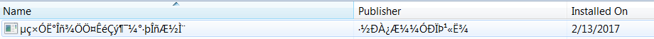

**场 景 2** ：打开一个文档发现里面的内容全面是问号？？？？？？如图 2 所示；

##### 图 2\. 带有问号的乱码

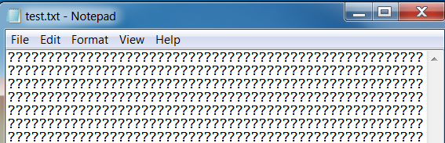

**场 景 3 ：** 打开某个网页，却显示成：如”бЇЯАзЪСЯ”、”�????????”？等等；

**场 景 4 ：** 打开某个文档后，出现§ § § § **。**

上面例子中看到的就是困扰着我们的乱码。这篇文章基于项目实践，分别从普通用户和编程角度总结了常见的乱码种类，产生原因以及如何解决这些乱码问题。在分析乱码原因和解决办法之前，首先阐述一下和乱码相关的术语。

## 编码解码概述

我们都知道计算机不能直接存储字母，数字，图片，符号等，计算机能处理和工作的唯一单位是”比特位（bytes）”，一个比特位通常只有 0 和 1，是（yes）和否（no），真（true）或者假（false）等等我们喜欢的称呼。利用比特位序列来代表字母，数字，图片，符号等，我们就需要一个存储规则，不同的比特序列代表不同的字符，这就是所谓的”编码”。反之，将存储在计算机中的比特位序列（或者叫二进制序列）解析显示出来成对应的字母，数字，图片和符号，称为”解码”，如同密码学中的加密和解密，下面将详细解释编码解码过程中涉及到的一些术语：

**字符集合（** Character set **）：** 是各种文字和符号的总称，包括各国家文字、标点符号、图形符号、数字等，简单理解就是一个字库，与计算机以及编码无关。

**字符编码集（** Coded character set **）：** 是一组字符对应的编码（即数字），为字符集合中的每一个字符给予一个数字，如 Unicode 为每一个字符分配一个唯一的码点与之一一对应。

**字符编码（** Character Encoding **）** ：简单理解就是一个映射关系，将字符集对应的码点映射为一个个二进制序列，从而使得计算机可以存储和处理。常见的编码方式有 ASCII 编码、ISO-8859-1(不支持中文)、GBK、GB2312（中国编码，支持中文）、UTF-8 等等,详情见表 1。

**字符集（C** harset **）：** 包括编码字符集和字符编码，如 ASCII 字符集、ISO-8859-X、GB2312 字符集（简中）、BIG5 字符集（繁中）、GB18030 字符集、Shift-JIS 等，即下文中提到的字符集。

##### 表 1\. 常见字符集和对应编码方式

**字符集****编码****详解**ASCIIASCII 编码**ASCII字符集：** 主要包括控制字符（回车键、退格、换行键等）；可显示字符（英文大小写字符、阿拉伯数字和西文符号。 **ASCII 编码：** 用一个字节的低 7 位表示，0~31 是控制字符如换行回车删除等；32~126 是打印字符；ASCII的最大缺点是只能解决了部份西欧语言的显示问题，但对更多其他语言依然无能为力。I 字 ISO-8859-X （常用的 ISO-8859-1）ISO-8859-1 编码 ISO-8859-2 编码… ISO-8859-15 编码**ISO-8859-X 字符集** ：扩展的 ASCII 字符集，包括 ISO-8859-1 ~ ISO-8859-15，涵盖了大多数西欧语言字符和希腊语。 **ISO-8859-1 编码** ：用 8 位表示一个字符，总共能表示 256 个字符，但还是单字节编码，不能对双字节如中日韩等进行编码。GBXXXXGB2312 编码**GB2312 编码** ：它的全称是《信息交换用汉字编码字符集 基本集》，它是双字节编码，每个汉字及符号以两个字节来表示。第一个字节称为”高位字节”（也称”区字节）”，第二个字节称为”低位字节”（也称”位字节”）。 总的编码范围是 A1-F7，其中从 A1-A9 是符号区，总共包含 682 个符号，从 B0-F7 是汉字区，它所收录的汉字已经覆盖中国大陆 99.75%的使用频率。对于 [人名](http://zh.wikipedia.org/wiki/人名) 、 [古汉语](http://zh.wikipedia.org/wiki/古汉语) 等方面出现的 [罕用字](http://zh.wikipedia.org/wiki/罕用字) ，GB2312 不能处理，这导致了后来 [GBK](http://zh.wikipedia.org/wiki/GBK) 及 [GB 18030](http://zh.wikipedia.org/wiki/GB_18030) 汉字字符集的出现。GBK 编码**GBK 编码** ： 全称叫《汉字内码扩展规范》，是在 GB2312-80 标准基础上的内码扩展规范，使用了双字节编码方案，其编码范围从 8140 至 FEFE（剔除 xx7F），共 23940 个码位，共收录了 21003 个汉字，完全兼容 GB2312-80 标准，支持国际标准 ISO/IEC10646-1 和国家标准 GB13000-1 中的全部中日韩汉字，并包含了 BIG5 编码中的所有汉字。GB18030 编码**GB18030-2005** 《信息技术中文编码字符集》是我国自主研制的以汉字为主并包含多种我国少数民族文字（如藏、蒙古、傣、彝、朝鲜、维吾尔文等）的超大型中文编码字符集强制性标准，其中收入汉字 70000 余个，解决了中文、日文、朝鲜语等的编码，兼容 GBK。 采用变长字节表示即单 [字节](https://baike.baidu.com/item/字节) 、双字节和四字节三种方式对 [字符编码](https://baike.baidu.com/item/字符编码) 。可表示27484个文字Big5Big5 编码**Big5 编码** ： 适用于台湾、香港地区的一个繁体字编码方案。 使用了双八码存储方法，以两个字节来安放一个字，第一个字节称为”高位字节”，第二个字节称为”低位字节。UnicodeUTF-8**UTF-8** ：采用变长字节 (1 ASCII, 2 希腊字母, 3 汉字, 4 平面符号) 表示，在网络传输中即使错了一个字节，不影响其他字节；存储效率比较高，适用于拉丁字符较多的场合以节省空间，UTF-8 没有字节顺序问题，所以 UTF-8 适合传输和通信。UTF-16**UTF-16** ：从先前的固定宽度的 16 位编码（UCS-2）发展而来的，能够对 Unicode 的所有 1,112,064 个有效 code point 进行编码。 其编码方式是可变长度的，因为 code point 是用一个或两个 16 位代码单元编码的。在 UTF-16 文件的开头，会放置一个 U+FEFF 字符作为 Byte Order Mark（BOM）：UTF-16LE（小端序）以 FF FE 代表，UTF-16BE（大端序）以 FE FF 代表，以显示这个文字档案是以 UTF-16 编码。 UTF-16 比起 UTF-8，好处在于大部分字符都以固定长度的字节 (2 字节) 储存，但 UTF-16 却无法兼容于 ASCII 编码，实际使用也比较少。UTF-32**UTF-32 (或 UCS-4)** ：对每一个 Unicode 码点使用 4 字节进行编码，其它的 Unicode 编码方式则使用不定长度编码。就空间而言，UTF-32 是非常没有效率的。尤其非基本多文种平面的字符在大部分文件中通常很罕见，以致于它们通常被认为不存在占用空间大小的讨论，使得 UTF-32 通常会是其它编码的二到四倍。虽然每一个码位使用固定长定的字节看似方便，它并不如其它 Unicode 编码使用得广泛。

**表 1 的几点说明：**

- GB2312、GBK、UTF-8、UTF-16 这几种格式都可以用来对双字节汉字进行编码，在实际应用中具体选择哪种编码方式，需要根据实际应用场景，当前的应用场景是编码效率重要还是减少存储空间重要。
- UTF-16 与 UCS-2 的关系：UTF-16 可看成是 UCS-2 的父集。在没有辅助平面字符（surrogate code points）前，UTF-16 与 UCS-2 所指的是同一的意思。但当引入辅助平面字符后，就称为 UTF-16 了。现在若有软件声称自己支持 UCS-2 编码，那其实是暗指它不能支持在 UTF-16 中超过 2 位元组的字集。对于小于 0x10000 的 UCS 码，UTF-16 编码就等于 UCS 码。
- 为什么中文默认使用 GB1832 而不使用 UTF-8？因为 GB1832 对绝大多数中文采用双字节编码，而 UTF-8 要用三字节，GB11832 大大节省了存储空间。

ANSI 编 **码** ：各个国家和地区独立制定的既兼容 ASCII 编码又彼此之间不兼容的字符编码，微软统称为 ANSI 编码。在 Windows 系统中，ANSI 编码一般代表系统默认的编码方式，并且不是确定的某一种特定编码方式，比如在英文 Windows 操作系统中，ANSI 指的是 ISO-8859-1；简体中文操作系统中 ANSI 编码默认指的是 GB 系列编码(GB2312、GBK、GB18030)等；在繁体中文操作系统中 ANSI 编码默认指的是 BIG5；在日文操作系统中 ANSI 编码默认指的是 Shift JIS 等等，并且默认的 ANSI 编码可以通过设置系统 Locale 更改。

**字符解码（C** haracter Decoding **）:** 根据一定规则，将二进制序列映射成对应的正确字符串，即二进制序列–>字符串，个人将其理解为”翻译”。

UCS **（** Universal Character Set **）：** 称作通用字符集，是由 ISO 制定的 ISO 10646（或称 ISO/IEC 10646）标准所定义的标准字符集。包括了其他所有字符集。它保证了与其他字符集的双向兼容，即，如果你将任何文本字符串翻译到 UCS 格式，然后再翻译回原编码，你不会丢失任何信息。

UTF **（** UCS Transformation Format/Unicode transformation format **）**: UCS 转换格式/Unicode 转换格式。

BOM **（** Byte Order Mark **）：** 字节顺序标记，出现在文本文件头部，Unicode 编码标准中用于标识文件是采用哪种格式的编码，其 Unicode 码点为 U+FEFF。

- UTF-8 不需要 BOM 来表明字节顺序，但可以用 BOM 来表明编码方式。字符 “零宽无间断间隔” 的 UTF-8 编码是 EF BB BF，如果接收者收到以 EF BB BF 开头的字节流，就知道这是 UTF-8 编码了。
- Big-Endian（BE）即大端序，UTF-16(BE)以 FEFF 作为开头字节，UTF-32(BE)以 00 00 FE FF 作为开头字节；
- Little-Endian (LE)即小端序，UTF-16(LE)以 FFFE 作为开头字节，UTF-32(LE)以 FF FE 00 00 作为开头字节。

BMP **（** Basic Multilingual Plane **）：** 称作 Unicode 的基本平面或基本多文种平面。也就是每个字符占用 2 个字节，这样理论上一共最多可以表示 216（即 65536）个字符。

Code Point **：** 称作码点或码位，是组成编码空间（或代码页）的数值。例如，ASCII 码包含 128 个码点，范围是 0 到 7F（16 进制）；ISO-8859-1 包含 256 个码点，范围是 0 到 FF；而 Unicode 包含 1,114,112 个码点，范围是 0 到 10FFFF。Unicode 码空间划分为 17 个 Unicode 字符平面（基本多文种平面，16 个辅助平面），每个平面有 65,536（= 216）个码点。因此 Unicode 码空间总计是 17 x 65,536 = 1,114,112。

Code Page **：** 代码页或者内码表，是 IBM 早期称呼计算机的 BIOS 所支持的字符集编码（也称作 OEM 代码页）。Windows 系统在没有使用 UTF-16 之前，为了解决由于不同国家和地区采用的字符集不一致，很可能出现无法正常显示所有字符的问题，使用了代码页（Codepage）转换表的技术来过渡性的部分解决这一问题，即定义了一系列支持不同国家和地区所制定的字符集，被称为 Windows 代码页或 ANSI 代码页，然而代码页一般与其所对应的字符集之间并非完全相同，有时候会对字符集有所扩展，可以理解为一张字符-字节序列映射表，通过查表实现编码解码功能。操作系统中不同 Locale 设置默认使用不同的代码页。

Locale **：** 是指特定于某个国家或地区的一组设定，包括代码页，以及数字、货币、时间和日期的格式等。在 Windows 内部，有两个 Locale 设置：系统 Locale 和用户 Locale。系统 Locale 决定代码页，用户 Locale 决定数字、货币、时间和日期的格式。

## 乱码产生原因概述

乱码产生的根源一般情况下可以归结为三方面即：编码引起的乱码、解码引起的乱码以及缺少某种字体库引起的乱码（这种情况需要用户安装对应的字体库），其中大部分乱码问题是由不合适的解码方式造成的，如图 3 所示的鱼骨图。

##### 图 3\. 乱码产生原因


下面通过几个常见例子，从普通用户角度分别阐述这几种原因导致的乱码表象和解决办法。

**编码引起的乱码表象分析**

在英文版 windows 系统（实验使用的是 win7 64 位专业版），新建一个 txt 文件，写上”你好”保存。然后再双击打开，将会看到保存的内容变成了”？？”，如图 4 所示

##### 图 4\. 不合适的编码方式引起的乱码

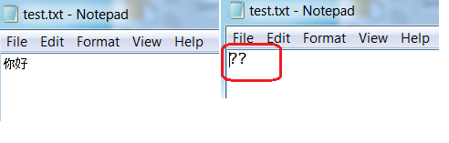

**原因分析：** Windows 默认选用 ANSI 编码，英文版 Windows7 默认的系统 Locale 是 English（United States），对应的 codepage 为 437 即编码方式为 ISO-8859-1。我们用十六进制查看器可以看到”你好”对应的的十六进制数为”3F3F”，这是因为中文和中文符号经过不支持中文的 ISO-8859-1 编码时，将不在字符集范围内的字符统一用 3F 表示，3F 对应的字符为问号”？”，如图 5 所示。

**解决办法：** 这种情况下形成的乱码是不可逆的，也就是说无论用什么解码方式都不能正确显示字符。我们在保存双字节字符的文档时，选择正确的编码方式，比如简中可以选择 GB2312 或者 UTF-8；繁中字符可以选择 BIG5 或者 UTF-8 等；如果安装的是英文操作系统，对于中文用户，可以将系统 Locale 更改为 Chinese(Simplified, PRC)。

##### 图 5\. 编码方式引起的乱码剖析

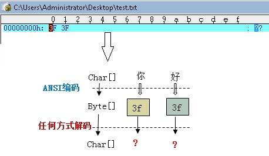

**解码引起的乱码表象分析**

在中文版 Windows 系统创建一个 txt 文件，写上”你好，中国”然后保存，再将这个 txt 文件复制到英文版 Windows 系统，双击打开，将会看到保存的内容变成”ÄãºÃ£¬Öйú”。

**原因分析：** 中文版 Windows 系统创建的 txt 文件以默认的 ANSI 编码即 GB2312，当复制到英文版 Windows 系统时，Notepad 默认的解码方式为 ISO-8859-1，如图 6 所示的表象分析。这种情况下产生的乱码是可逆的，只要使用正确的解码方式，就可以正确显示文件中的字符。

**解决办法：** 遇到类似解码问题引起的乱码，可以换一个编辑器打开，同时选择正确的解码方式。

##### 图 6\. 不正确的解码方式引起的乱码

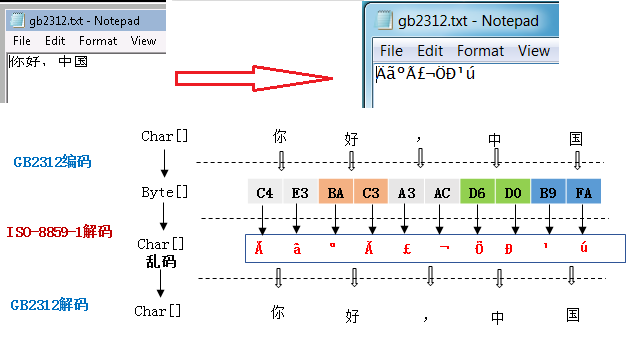

下面的例子是在英文版 Windows 系统上打开中文版 uedit32.exe 后菜单项全为乱码的现象，如图 7 所示。

**原因分析：** 对于支持 Unicode 的应用程序，Windows 会默认使用 Unicode 编码。对于不支持 Unicode 的应用程序 Windows 会采用 ANSI 编码 （也就是各个国家自己制定的标准编码方式，如对于西欧文字有 ISO/IEC 8859 编码，对于简体中文有 GB2312，对于繁体中文有 BIG-5 等。Uedit32 是不支持 Unicode 的，然后当前实验使用的英文版 Windows 7 默认的 locale 为英语（美国），其默认字符集是 ISO-8859-1，而中文版 uedit32 程序使用的是中文编码方式，使用 ISO-8859-1 解码时肯定出现乱码情况。这个例子的乱码根本原因也是不正确的解码方式造成的。

**解决办法** ：进入系统的控制面板，找到 Regional and Language Options 语言设置项，打开进入对应的页面，将标准与格式中的语言设置为简体中文；同时在 Advanced 标签页中将系统支持的非 Unicode 语言也设置为简体中文，从而在解码的时候就会使用中文自己的 ANSI 编码（实验环境为 GB1832）。

##### 图 7\. 解码导致的乱码

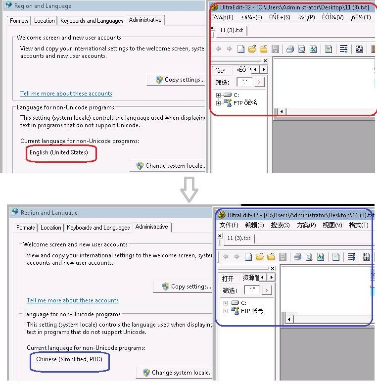

**缺少字体引起的乱码表象分析**

在英文 Windows 系统打开一个文件发现里面的内容有些显示为方框，如图 8 所示。

##### 图 8\. 带有中括号的乱码

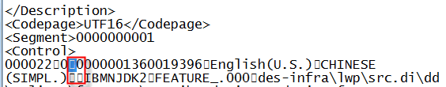

**原因分析：** 这个例子中显示为方框的都是中文字符。我们看到屏幕上的字符实际上经历了三种不同形态，从 **二进制字节序列** 转换成对应字符集中的 **码点** ，然后码点通过查找字体库找到对应的 **字符** ，最后通过点阵的方式显示在屏幕上。这里的方框是因为所查找的字体库缺少该码点对应的字符，或者根本没有安装该字体库，从而字符库中找不到的字符都以方框代替。

**解决办法：** 安装对应的字体库，比如 Windows 系统在 C:\\Windows\\Fonts 目录下会有安装好的字体库列表。安装字体库比较简单，下载后解压，然后复制到对应系统的 Fonts 目录下。这里有个问题就是如何知道缺少何种字体？有些阅读器比如 Adobe 在打开文档时会提示缺少什么字体，但是很多编辑器或者阅读器是不提示的，这个时候可能需要根据经验来判断。

## 从编程角度分析出现乱码的场景和解决办法

从编程角度来看，出现乱码的场景主要是有文本处理的时候，比如文件的新建和读取、复制和粘贴，导入和导出，打开和保存，数据存储和检索，显示，打印，分词处理，字符转换，规范化，搜索，整理和发送数据等，文本数据的示例包括平面文件，流文件，数据区域，目录名称，资源名称，用户标识等。图 9 是出现乱码的一个常见场景分类。

##### 图 9\. 出现乱码的场景

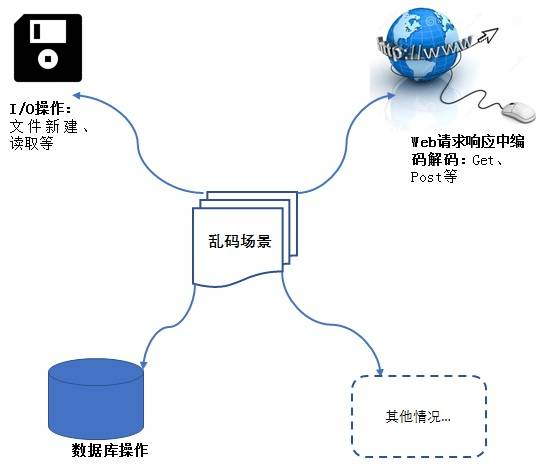

**I/ O 操作中出现乱码情况**

I/O 操作包括读（输入）写（输出）两方面，而所谓的输入和输出是以程序为中心的，数据流向程序即输入流，数据从程序中流出即输出流。读数据比如将文件中的内容显示出来，即字节–>字符的转换，也就是解码；写数据比如创建一个新文件，即字符–>字节转换，也就是编码；在分析 I/O 操作中出现乱码原因之前，先简要概述一下 Java I/O 操作接口。如图 10 所示：

##### 图 10\. Java I/O 接口

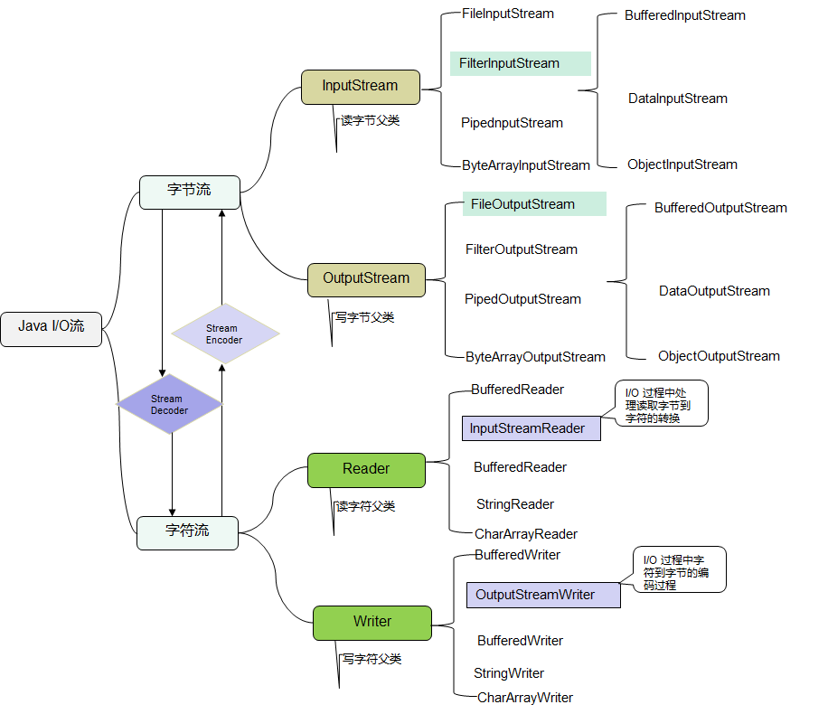

当我们想创建一个文件并且将对应的字符写入文件时将用到字节流 FileOutputStream和字符流 Writer，其流程为图 11 所示：

##### 图 11\. 写入文件的 I/O 流


Java 中与 I/O 操作相关的 API 一般都有是否指定字符集的重载形式，选择不指定字符集形式的函数时将使用默认字符集。如 String.getBytes()就有两种形式：String.getBytes() 和 String.getBytes(String charsetName)。下面是 String.getBytes()方法的详解。

String.getBytes(): Encodes this String into a sequence of bytes using the platform’s default charset, storing the result into a new byte array.

这个是 Java 帮助文档提供的解释，这里需要强调一下”The platform’s default charset”即 Charset.defaultCharset()，defaultCharset 由系统属性 file.encoding 决定，如果用户没有设置 JVM 的这个属性，其值依赖于启动该 JVM 的环境编码：比如是由操作系统命令行启动 JVM，则有操作系统的运行时的区域语言设置决定的编码；比如是在 Eclipse 里面启动 JVM，可以设置 JVM 的这个属性，默认情况下 file.encoding 属性由通用设置页面的编码决定。

在实际项目中，我们可能直接使用 String.getBytes()进行字符和字节的转换。在笔者的项目中就碰到一个这样的乱码问题，如清单 1 所示，在写入错误日志信息的时候使用了 String.getBytes(),这里没有指定字符集，将使用默认字符集，其值依赖于启动 JVM 的平台环境，结果显示出来的都是问号，结合前文显示问号通常是使用不正确的编码方式造成的。

##### 清单 1\. 使用 String.getBytes()出现乱码

```
public static void main(String[] args) {
    private static final String fileName = "c:\\log.txt" ;
    String str ="你好，中国";
    writeError(str);
}
private static void writeError(String a_error) {
    try {
        File logFile = new File(fileName);
        //创建字节流对象
        FileOutputStream outPutStream = new FileOutputStream(logFile, true);
        //使用平台的默认字符集将此字符串编码为一系列字节
        outPutStream.write(a_error.getBytes(), 0, a_error.length() );
        outPutStream.flush();
} catch (IOException e) {
       e.printStackTrace();
}
}

```

Show moreShow more icon

对于清单 1 中出现的乱码问题即错误的日志全是问号，只要我们指定正确的字符集就可以解决，如清单 2 所示。

##### 清单 2\. 使用 outputStreamWrite 指定字符集

```
private static void writeErrorWithCharSet(String a_error) {
    try {
        File logFile = new File(FileName);
        String charsetName = "utf-8";
        //指定字符字节转换时使用的字符集为 Unicode，编码方式为 utf-8
        Writer m_write = new BufferedWriter(
        new OutputStreamWriter(new java.io.FileOutputStream(logFile, true),
        charsetName) );
        m_write.write(a_error);
        m_write.close();
    } catch (IOException e) {
        e.printStackTrace();
    }
}

```

Show moreShow more icon

**强调** ：为了避免乱码问题出现，在调用 I/O 操作相关的 API 时，最好使用带有指定字符集参数的重载形式。

**Web 程序中出现的乱码情况**

在 web 应用程序中，存在用户输入以及输出显示的地方都有可能存在编码解码，图 12 简要概括了 HTTP web 请求响应环节。

##### 图 12\. Web 请求响应环节中的编码解码

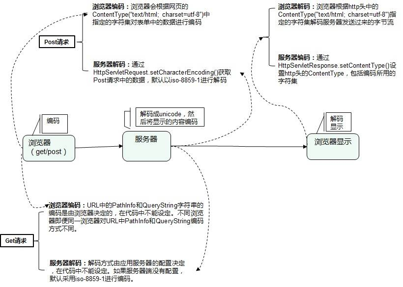

下面是对图 12 的几点说明：

- Web 应用程序中出现乱码的可能原因有：浏览器本身没有遵循 URI 编码规范；服务器端没有正确配置编码解码；开发人员对 Web 程序中涉及到的编码解码理解不太深入。
- HTTP Get 请 **求方式中的编码解码规则** ：Get 请求方式中请求参数会被附加到地址栏的 URL 之后，URL 组成：”域名:端口/contextPath/servletPath/pathInfo?queryString”，URL 中 pathInfo 和 queryString 如果含有中文等非 ASCII 字符，则浏览器会对它们进行 URLEncode，编码成为 16 进制，然后从右到左，取 4 位(不足 4 位直接处理)，每 2 位做一位，前面加上%，编码成%XY 格式。然而 URL 中的 PathInfo 和 QueryString 字符串的编码和解码是由浏览器和应用服务器的配置决定，在我们的程序中是不能设定的。即使同一浏览器对 pathInfo 和 queryString 的编码方式有可能不一样，因为浏览器对 URL 的编码格式是可设置的，这就对服务器的解码造成很大的困难。应用服务器端对 Get 请求方式解码中 pathInfo 和 queryString 的设定是不同的。比如 Tomcat 服务器一般在 server.xml 中设定的，pathInfo 部分进行解码的字符集是在 connector 的  中定义的；QueryString 的解码字符集一般通过 useBodyEncodingForURI 设定，如果没有设定，Tomcat8 之前的版本默认使用的是 ISO-8859-1，但是 Tomcat 8 默认使用的是 UTF-8。为了避免浏览器采用了我们不希望的编码，在我们的程序中最好不要在 URL 中直接使用非 ASCII 字符，而是对双字节字符进行 URI 编码后在放到 URL 中， [JavaScript](http://lib.csdn.net/base/18) §提供了 encodeURI()函数，它提供的是 UTF-8 的 URI 编码，也可以通过 java.net.URLEncoder.encode(str,”字符集”)进行编码。
- **HTTP Pos t 请 求方式中的编码解码** ：请求表单中的参数值是通过 request 包发送给服务器，此时浏览器会根据网页的 ContentType(“text/html; charset=utf-8″)中指定的编码进行对表单中的数据进行编码，然后发给服务器；JSP 中 contentType 设定<%@ page language=”java” contentType=”text/html; charset=”GB18030″ pageEncoding=”UTF-8″%>，JSP 页面命令中的 charset 的作用包括通知浏览器应该用什么编码方式解码显示网页；提交表单时浏览器会按 charset 指定的字符集编码数据（post body）发送给服务器；pageEncoding 属性里指定的编码方式是储存该 jsp 文件时所用的编码，比如 eclipse 的文本编辑器可以根据该属性决定储存该文件时采用的编码方式；服务器端通过 Request.setCharacterEncoding() 设置编码，然后通过 request.getParameter 获得正确的数据。图 13 是 POST 请求中没有设置 ContentType 出现的乱码的例子及解决办法如清单 3 所示。

##### 图 13\. POST 请求中出现乱码


##### 清单 3\. POST 请求设置 setContentType

```
protected void doPost(HttpServletRequest request, HttpServletResponse
response) throws ServletException, IOException {
    if(!ServletFileUpload.isMultipartContent(request)){
        throw new ServletException("Content type is not multipart/form-data");
    }
    response.setCharacterEncoding("UTF-8");//设置响应编码
    response.setContentType("text/html;charset=UTF-8");
    PrintWriter out = response.getWriter();
    out.write("<html><head></head><body>");
    try {
        List<FileItem> items = (List<FileItem>)
        uploader.parseRequest(request);
       ...
}

```

Show moreShow more icon

//JSP 代码片段，使用 POST 请求方式

<%@ page language=”java” contentType=”text/html; charset=utf-8″ pageEncoding=”utf-8″%>

<!DOCTYPE HTML PUBLIC “-//W3C//DTD HTML 4.01 Transitional//EN”>

index

选择上传文件：

- **浏览器显示** ：通常有 JSP 和 HTML 来展示，通过实验发现，对于网页中的静态内容，不同浏览器显示网页所使用的字符集原则是不一样的，Chrome 63 和 IE11 使用 JSP 页面命令中 contentType 和 charset 设置，html 页面中的 charset 设置，然而 firefox 52 却根据自己的 text encoding 方式来显示页面。

- **对于 JSP：** 通过 JSP 页面命令<%@ page language=”java” contentType=”text/html; charset=utf-8″ pageEncoding=”utf-8″%>中的 contentType 属性和 pageEncoding 属性设置。在 JSP 标准的语法中，如果 pageEncoding 属性存在，储存该 jsp 文件时所用的编码由该属性决定，如果没有指定 pageEncoding 属性，那么存储该 jsp 文件的编码就由 contentType 属性中的 charset 决定，如果 charset 也不存在，JSP 页面的字符编码方式就采用默认的 ISO-8859-1；charset 的作用包括通知浏览器应该用什么编码方式解码显示网页，如果没有指定 charset 默认的字符集为”ISO-8859-1″；提交表单时浏览器会按 charset 指定的字符集编码数据（post body）发送给服务器；Post 请求时，浏览器会根据 contentType 中 charset 指定的字符集对表单中的数据进行编码，然后提交给服务器。

- **对于 HTML:**，其中的 charset 左右和 JSP 中的 charset 作用一样。
- **对于动态页面内容** ：览器根据 http 头中的 ContentType(“text/html; charset=utf-8”)指定的字符集来解码服务器发送过来的字节流。在应用服务器端可以调用 HttpServletResponse.setContentType()设置 http 头的 ContentType，即服务器端编码方式。

另外一个乱码的例子就是我们在下载文件名为双字节的文件时，下载后文件名为乱码，如图 15 所示。这是因为 Header 只支持 ASCII 字符集，将不在 ASCII 字符集内中的其他字符全部编码为 3F 即问号？，解决办法就是对中文文件名使用 url 编码后 URLEncoder.encode（filename，charset）再放到 Header 中，如清单 4 所示。

##### 图 14\. GET 请求中出现乱码

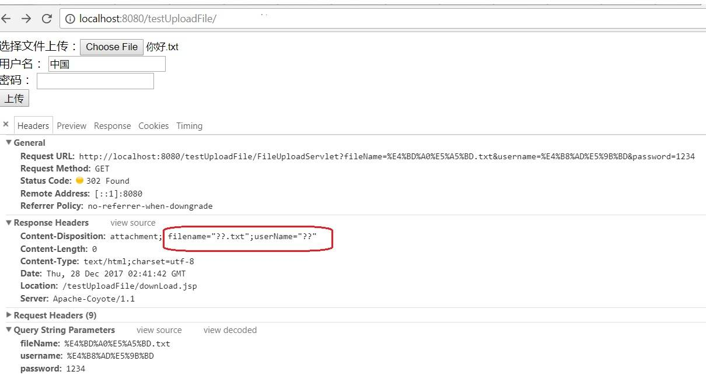

##### 清单 4\. 双字节文件名乱码

```
protected void doGet(HttpServletRequest request, HttpServletResponse
response) throws ServletException, IOException {
    String fileName = getDecodeParameter(request,"fileName");
    String userName = getDecodeParameter(request, "username");
    response.setHeader("Content-Disposition", "attachment; filename=\"" +
    URLEncoder.encode(fileName,"utf-8") + "\";userName=\"" +
    URLEncoder.encode(userName,"utf-8") + "\"");
}

```

Show moreShow more icon

**数据库操作过程中的乱码**

在实际应用中，和数据库操作相关的乱码可能出现在数据的导入和导出操作中，在整个过程中涉及到的字符集有服务器端数据库字符集、客户端操作系统字符集、客户端环境变量 nls\_lang(lang\_territory.charset)，这三个参数的工作流程如图 15 所示。如果这三个参数设置一样，整个数据库操作中就不会出现乱码问题，但是实际应用中客户端的情况复杂多样，很难保持三者一致，涉及到双字节字符就需要服务器端进行转码操作，而转码的桥梁就是 Unicode 字符集，这就要求数据库本身支持 UTF-8 编码方式。为了编码数据库操作过程中的乱码问题，在创建数据库的时候使用 UTF-8 编码方式，如果仅在某些列中使用多语言数据，则可以使用 SQL NCHAR 数据类型（NCHAR，NVARCHAR2 和 NCLOB）以 UTF-16 或 UTF-8 编码形式存储 Unicode 数据，避免存储空间的浪费。

##### 图 15\. Oracle 数据库字符集

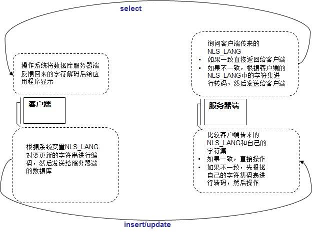

## 结束语

本文基于日常碰到的乱码现象和项目实践，详细综述了常用字符集，编码以及使用场景；作为普通用户碰到的乱码表象分析和解决办法，以及从编程角度总结和分析了常见乱码情况。希望能为读者深入理解和解决乱码问题提供帮助。

## 参考资料 (resources)

- [深入分析 web 请求响应中的编码问题](https://www.ibm.com/developerworks/cn/web/wa-lo-ecoding-response-problem/index.html) ：主要介绍 web 请求响应中的编码解码问题。
- [参考 RFC 官方网站](http://www.faqs.org/rfcs/rfc3986.html) ，了解更多有关 RFC 文档的信息。
- [深入分析 Java 中的中文编码问题](https://www.ibm.com/developerworks/cn/java/j-lo-chinesecoding/index.html) ：详细介绍 Java 程序的编码解码及乱码问题
- [Unicode 编码规范](http://www.unicode.org/charts/) ，详细描述了 Unicode 如何编码。