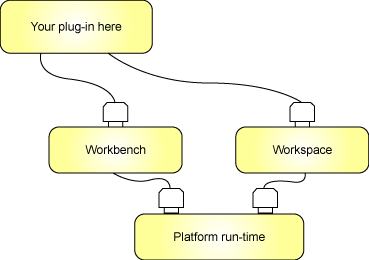
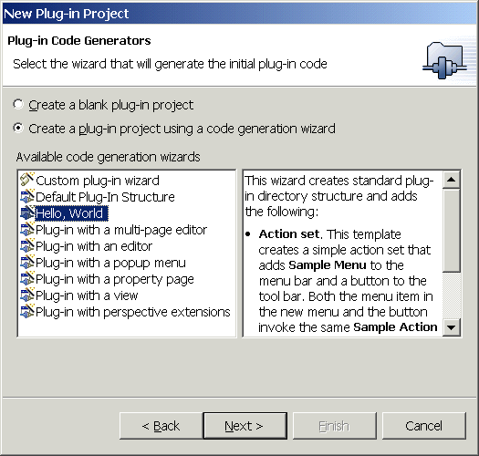
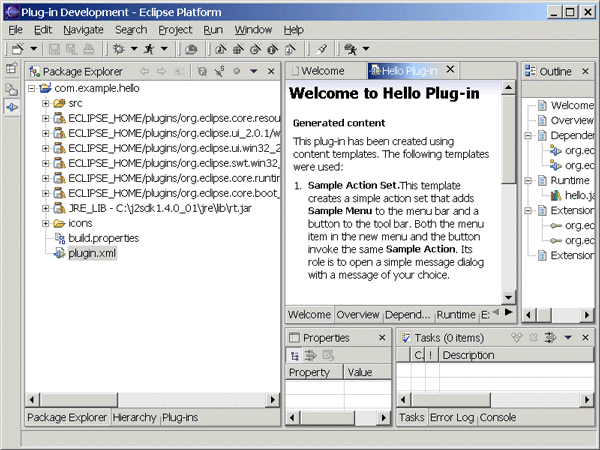
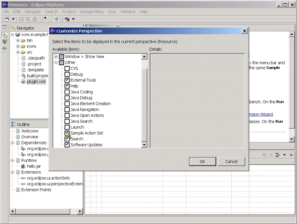
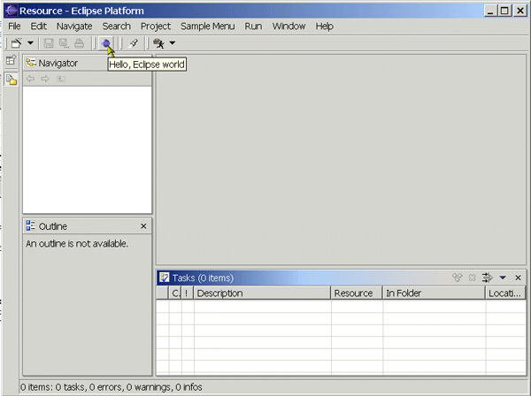

# 开发 Eclipse 插件
如何创建、调试和安装插件

**标签:** 软件开发

[原文链接](https://developer.ibm.com/zh/articles/os-ecplug/)

David Gallardo

发布: 2003-03-26

* * *

## 基于插件的体系结构

Eclipse 平台是 IBM 向开发源码社区捐赠的开发框架，它之所以出名并不是因为 IBM 宣称投入开发的资金总数 ― 4 千万美元 ― 而是因为如此巨大的投入所带来的成果：一个成熟的、精心设计的以及可扩展的体系结构。Eclipse 的价值是它为创建可扩展的集成开发环境提供了一个开放源码平台。这个平台允许任何人构建与环境和其它工具无缝集成的工具。

工具与 Eclipse 无缝集成的关键是 _插件_ 。除了小型的运行时内核之外，Eclipse 中的所有东西都是插件。从这个角度来讲，所有功能部件都是以同等的方式创建的。从这个角度来讲，所有功能部件都是以同等的方式创建的。

但是，某些插件比其它插件更重要些。Workbench 和 Workspace 是 Eclipse 平台的两个必备的插件 ― 它们提供了大多数插件使用的扩展点，如图 1 所示。插件需要扩展点才可以插入，这样它才能运行。

##### 图 1\. Eclipse Workbench 和 Workspace：必备的插件支持



Workbench 组件包含了一些扩展点，例如，允许您的插件扩展 Eclipse 用户界面，使这些用户界面带有菜单选择和工具栏按钮；请求不同类型事件的通知；以及创建新视图。Workspace 组件包含了可以让您与资源（包括项目和文件）交互的扩展点。

当然，其它插件可以扩展的 Eclipse 组件并非只有 Workbench 和 Workspace。此外，还有一个 Debug 组件可以让您的插件启动程序、与正在运行的程序交互，以及处理错误 ― 这是构建调试器所必需的。虽然 Debug 组件对于某些类型的应用程序是必需的，但大多数应用程序并不需要它。

还有一个 Team 组件允许 Eclipse 资源与版本控制系统（VCS）交互，但除非您正在构建 VCS 的 Eclipse 客户机，否则 Team 组件，就象 Debug 组件一样，不会扩展或增强它的功能。

最后，还有一个 Help 组件可以让您提供应用程序的联机文档和与上下文敏感的帮助。没有人会否认帮助文档是专业应用程序必备的部分，但它并不是插件功能的必要部分。

上述每个组件提供的扩展点都记录在 Eclipse Platform Help 中，该帮助在 Platform Plug-in Developer 指南的参考部分中。乍一看，尤其是 API 参考大全的 Workbench 部分，一开始会令人望而却步。我们不会深入了解众多可用扩展点的详细信息，而只是粗略地看一个简单插件及其组件。

## 插件简介

创建插件最简单的方法是使用 Plug-in Development Environment（PDE）。PDE 和 Java Development Tooling（JDT）IDE 是 Eclipse 的标准扩展。PDE 提供了一些向导以帮助创建插件，包括我们将在这里研究的”Hello, world”示例。

从 Eclipse 菜单，选择 **File=>New=>Other** （或按 Ctrl-N），然后选择 Select 对话框左边的 Plug-in Development 向导。在 Select 对话框的右边，选择 Plug-in Project。按 Next。在下一屏上，输入项目名称；我使用了 `com.example.hello` 。再次按 Next。在下一屏上，请注意，插件标识就与项目名称相同。使用项目名称作为插件标识可以将该插件与另一个插件的名称发生冲突的机会减到最小。再按一次 Next。下一屏让您选择是手工创建初始插件代码，还是运行代码生成向导。保留代码生成向导的缺省选项，选择”Hello, World”，然后按 Next，如图 2 所示。

##### 图 2\. 选择 “Hello, World” 代码生成向导



下一屏要求一些附加信息。请注意这一屏上的信息：它包含了插件名称、版本号、提供者名称和类名。这些是关于插件的重要信息，我们将在稍后研究。可以接受向导提供的缺省值。按 Next。在下一屏幕上，接受包名、类名和消息文本的缺省值。选择”Add the action set to the resource perspective”复选框。按 Finish。

如果接到通知：向导需要启用某些其它插件才能完成，那么按 OK。

过一会儿，向导将完成，而在您的工作区中将会有一个新的项目，名为 `com.example.hello` ，如图 3 所示。

##### 图 3\. PDE 透视图：Welcome to Hello Plug-in



在 Package Explorer 中，工作台的左边是向导创建的一些东西的概述。大多数项都不引人关注：包括项目类路径中的许多 `.jar` 文件（这些包括插件和 Java 运行时所需的 Eclipse 类）、一个图标文件夹（包含了工具栏按钮的图形），以及 `build.properties` 文件（包含自动构建脚本所使用的变量）。

这里最有意思的东西是 src 文件夹，它包含了插件和 plugin.xml 文件的源代码 ― plug-in.xml 是插件的清单文件。我们将先查看 plugin.xml。

## 插件清单文件

插件清单文件 plugin.xml 包含了 Eclipse 将插件集成到框架所使用的描述信息。缺省情况下，当第一次创建插件时，会在清单编辑器区域中打开 plugin.xml。编辑器底部的选项卡让您可以选择关于插件的不同信息集合。Welcome 选项卡显示了消息”Welcome to Hello Plug-In”，并且简要讨论了所使用的模板和关于使用 Eclipse 实现插件的提示。选择”Source”选项卡可以让您查看 plugin.xml 文件的完整源代码。

让我们看看插件清单文件的各个部分。首先是关于插件的常规信息，包括它的名称、版本号、实现它的类文件的名称和 `.jar` 文件名。

##### 清单 1\. 插件清单文件 ― 常规信息

```
<?xmlversion="1.0" encoding="UTF-8"?>
<plugin
id="com.example.hello"
name="Hello Plug-in"
version="1.0.0"
provider-name="EXAMPLE"
class="com.example.hello.HelloPlugin">

<runtime>
      <library name="hello.jar"/>
</runtime>

```

Show moreShow more icon

接着，列出了我们的插件所需的插件：

##### 清单 2\. 插件清单文件 ― 必需的插件

```
<requires>
      <import plugin="org.eclipse.core.resources"/>
      <import plugin="org.eclipse.ui"/>
</requires>

```

Show moreShow more icon

列出的第一个插件 `org.eclipse.core.resources` 是工作区插件，但实际上我们的插件并不需要它。第二个插件 `org.eclipse.ui` 是工作台。我们需要工作台插件，因为我们将扩展它的两个扩展点，正如后面的 extension 标记所指出的。

第一个 extension 标记拥有点属性 `org.eclipse.ui.actionSets` 。操作集合是插件添加到工作台用户界面的一组 _基值_ ― 即，菜单、菜单项和工具栏。操作集合分组了基值，这样用户可以更方便地管理它们。例如，我们的 Hello 插件的菜单和工具栏项将出现在 Resource 透视图中，因为当在运行代码生成向导时，我们做了这样的选择。如果用户要更改它，可以使用 **Window=>Customize Perspective** 菜单选项从要在 Resource 透视图中显示的项中除去”Sample Action Set”。

##### 图 4\. 定制 Resource 透视图



操作集合包含了两个标记： _menu 标记_ （描述菜单项应该出现在工作台菜单的什么位置，以及如何出现）和 _action 标记_ （描述它应该做什么）― 尤其是 action 标记标识了执行操作的类。注：这个类不是上面列出的插件类。

##### 清单 3\. 操作集合

```
<extension
         point="org.eclipse.ui.actionSets">
      <actionSet
            label="Sample Action Set"
            visible="true"
            id="com.example.hello.actionSet">
         <menu
               label="Sample &Menu"
               id="sampleMenu">
            <separator
                  name="sampleGroup">
            </separator>
         </menu>
         <action
               label="&Sample Action"
               icon="icons/sample.gif"
               class="com.example.hello.actions.SampleAction"
               tooltip="Hello, Eclipse world"
               menubarPath="sampleMenu/sampleGroup"
               toolbarPath="sampleGroup"
               id="com.example.hello.actions.SampleAction">
         </action>
      </actionSet>
</extension>

```

Show moreShow more icon

许多菜单和操作属性的目的相当明显 ― 例如，提供工具提示文本和标识工具栏项的图形。但还要注意 action 标记中的 `menubarPath` ：这个属性标识了 menu 标记中定义的哪个菜单项调用 action 标记中定义的操作。有关这个和其它工作台扩展点的详细信息，请参考 _Platform Plug-in Developer Guide_ ，尤其是”Plugging into the workbench”章节（可以从 Eclipse 的帮助菜单中获取该指南）。

由于我们选择了将插件添加到 Resource 透视图，于是生成了第二个 extension 标记。这个标记会导致当 Eclipse 第一次启动并装入我们的插件时，将插件添加到 Resource 透视图。

##### 清单 4\. extension 标记

```
<extension
         point="org.eclipse.ui.perspectiveExtensions">
      <perspectiveExtension
            targetID="org.eclipse.ui.resourcePerspective">
         <actionSet
               id="com.example.hello.actionSet">
         </actionSet>
      </perspectiveExtension>
</extension>
</plugin>

```

Show moreShow more icon

如果忽略这最后一个 extension，用户就需要使用 **Window=>Customize Perspective** 将插件添加到 Resource（或其它）透视图。

## 插件源代码

代码生成向导生成了两个 Java 源文件，打开 PDE Package Explorer 中的 src 文件夹就可以看到它们。第一个文件 `HelloPlugin.java` 是插件类，它继承了 `AbstractUIPlugin` 抽象类。 `HelloPlugin` 负责管理插件的生命周期，在更为扩展的应用程序中，它负责维护诸如对话框设置和用户首选项等内容。 `HelloPlugin` 要做的事就这么多：

##### 清单 5\. HelloPlugin

```
packagecom.example.hello.actions;

import org.eclipse.ui.plugin.*;
import org.eclipse.core.runtime.*;
import org.eclipse.core.resources.*;
import java.util.*;

/**
* The main plugin class to be used in the desktop.
*/
public class HelloPlugin extends AbstractUIPlugin {
      //The shared instance.
      private static HelloPlugin plugin;
      //Resource bundle.
      private ResourceBundle resourceBundle;

      /**
       * The constructor.
       */
      public HelloPlugin(IPluginDescriptor descriptor) {
            super(descriptor);
            plugin = this;
            try {
                  resourceBundle= ResourceBundle.getBundle(
                       "com.example.hello.HelloPluginResources");
            } catch (MissingResourceException x) {
                  resourceBundle = null;
            }
      }

      /**
       * Returns the shared instance.
       */
      public static HelloPlugin getDefault() {
            return plugin;
      }

      /**
       * Returns the workspace instance.
       */
      public static IWorkspace getWorkspace() {
            return ResourcesPlugin.getWorkspace();
      }

      /**
       * Returns the string from the plugin's resource bundle,
       * or 'key' if not found.
       */
      public static String getResourceString(String key) {
            ResourceBundle bundle= HelloPlugin.getDefault().getResourceBundle();
            try {
                  return bundle.getString(key);
            } catch (MissingResourceException e) {
                  return key;
            }
      }

      /**
      * Returns the plugin's resource bundle,
      */
      public ResourceBundle getResourceBundle() {
          return resourceBundle;
      }
}

```

Show moreShow more icon

第二个源文件 `SampleAction.java` 包含的类将执行在清单文件的操作集合中指定的操作。 `SampleAction` 实现了 `IWorkbenchWindowActionDelegate` 接口，它允许 Eclipse 使用插件的代理，这样不是在万不得已的情况下，Eclipse 就无需装入插件（这项优化工作使在装入插件时发生内存和性能方面的问题降到最低）。 `IWorkbenchWindowActionDelegate` 接口方法使插件可以与代理进行交互：

##### 清单 6\. IWorkbenchWindowActionDelegate 接口方法

```
package com.example.hello.actions;

import org.eclipse.jface.action.IAction;
import org.eclipse.jface.viewers.ISelection;
import org.eclipse.ui.IWorkbenchWindow;
import org.eclipse.ui.IWorkbenchWindowActionDelegate;
import org.eclipse.jface.dialogs.MessageDialog;

/**
* Our sample action implements workbench action delegate.
* The action proxy will be created by the workbench and
* shown in the UI. When the user tries to use the action,
* this delegate will be created and execution will be
* delegated to it.
* @see IWorkbenchWindowActionDelegate
*/
public class SampleAction implements IWorkbenchWindowActionDelegate {
      private IWorkbenchWindow window;
      /**
       * The constructor.
       */
      public SampleAction() {
      }

      /**
       * The action has been activated. The argument of the
       * method represents the 'real' action sitting
       * in the workbench UI.
       * @see IWorkbenchWindowActionDelegate#run
       */
      public void run(IAction action) {
            MessageDialog.openInformation(
                  window.getShell(),
                  "Hello Plug-in",
                  "Hello, Eclipse world");
      }

      /**
       * Selection in the workbench has been changed. We
       * can change the state of the 'real' action here
       * if we want, but this can only happen after
       * the delegate has been created.
       * @see IWorkbenchWindowActionDelegate#selectionChanged
       */
      public void selectionChanged(IAction action, ISelection selection) {
      }

      /**
       * We can use this method to dispose of any system
       * resources we previously allocated.
       * @see IWorkbenchWindowActionDelegate#dispose
       */
      public void dispose() {
      }

      /**
       * We will cache window object in order to
       * be able to provide parent shell for the message dialog.
       * @see IWorkbenchWindowActionDelegate#init
       */
      public void init(IWorkbenchWindow window) {
            this.window = window;
      }
}

```

Show moreShow more icon

## 运行和调试插件

当开发 Eclipse 的插件时，必须停止 Eclipse 并用新的插件重新启动它以便进行测试和调试，这很笨拙。幸好，Eclipse PDE 提供了一个自托管（self-hosted）的开发环境，它让您无需将插件安装在工作台的单独实例中即可运行。

要运行 Hello 插件，选择 **Run=>Run As=>Run-time Workbench** 来启动另一个 Workbench 实例，而该实例添加了插件的菜单选项和工具栏，如图 5 所示。

##### 图 5\. 在运行时工作台中运行的 Hello 插件



我们可以通过单击工具栏按钮或从”Sample Menu”菜单激活插件。任何一种方法都会生成一个框，其标题是”Hello Plug-in”，内容是”Hello, Eclipse world”，以及一个 OK 按钮，按该按钮可以关闭这个框。

通过选择 **Run=>Debug As=>Run-time Workbench** ，按类似的方法调试插件。这次，当插件在第二个工作台实例中运行时，我们可以在最初的工作台中单步执行源代码，以及检查变量等。

一旦插件经过测试并准备发布，我们就需要将它适当打包，以便在 Eclipse 中安装。

## 打包插件

Eclipse 在启动时会查看其插件目录来确定要装入哪些插件。要安装插件，我们需要在插件目录中创建一个子目录，并将程序文件和清单文件复制到那里。建议目录名称能表示插件的标识，并且后面跟下划线和版本号，但是这种做法不是必需的。假设 Eclipse 安装在 C:\\eclipse 中；我们要创建一个目录：

`C:\eclipse\plugins\com.example.hello_1.0.0.`

按照 Java 程序的标准，我们的程序文件需要归档到 `.jar` 文件中 — 我们的插件清单文件，您也许记得它包含这个项：

```
<runtime>
      <library name="hello.jar"/>
</runtime>

```

Show moreShow more icon

要创建 `hello.jar` 文件，我们可以通过突出显示项目名称，并从 Eclipse 菜单选择 **File=>Export** ，以导出插件文件。选择 JAR 文件作为导出方式，按 Next，然后浏览到我们为它创建的目录。下一步，我们还需要将 plugin.xml 文件复制到这个目录。也可以使用 **File=>Export** 菜单选项（但请要记住选择 File System 作为导出目的地）。

这就是安装插件所需的全部操作，但您将需要停止并重新启动 Eclipse，以便能识别这个新的插件。从帮助菜单中选择”About Eclipse Platform”，可以找到关于已安装插件的信息，包括版本号。在出现的屏幕上有一个按钮是 Plug-in Details；向下滚动列表来寻找 Hello 插件及其版本号。

## 更新插件版本

在目录名称中包含版本号的目的是允许在同一台机器上共存某个插件的多个版本（每次只装入一个版本）。我们可以通过创建一个 Hello 插件的已更新版本来看看这是如何工作的：例如，将 plugin.xml 文件中的版本号更改成”1.0.1”，然后将 `SampleAction.java` 中的文本更改成”New and improved Hello, Eclipse world”。从 Eclipse 菜单中选择 **Project=> Rebuild All** 。下一步，将项目文件以 JAR 形式导出到新的插件目录，例如， `com.example.hello_1.0.1` 。将修订过的 plugin.xml 文件复制到同一个目录中。当停止并重新启动 Eclipse 时，只会装入已更新的插件。

## 插件片段和功能部件

Eclipse 由插件组成，但在开发 Eclipse 的插件时，还要慎重考虑另外两个级别的组件 ― 插件片段和功能部件。

插件 _片段_ （如名称所暗示的）是完整插件的组成部分 ― _目标_ 插件。片段提供的功能与目标插件的功能合并。片段可以用于将插件本地化成各种语言；在无需形成一个全新发行版的情况下，以增量形式将功能部件添加到现有插件，或者提供特定于平台的功能。在许多方面，片段与插件一样。主要的区别就是片段没有插件类 ― 片段的生命周期由其目标插件管理。此外，片段的清单文件叫作 fragment.xml，它列出了目标插件的标识和版本号，以及片段的标识和版本号。

另一方面，插件 _功能部件_ 根本不包含编码。在 Eclipse 体系结构术语中，功能部件是将一组相关插件打包到完整的产品中。例如，JDT 是包含了象 Java 编辑器、调试器和控制台这样的插件的功能部件。名为 feature.xml 的清单文件描述了一个功能部件归档文件。在其中，该清单文件包含了对该功能部件所包含的插件和其它资源的引用、关于如何更新该功能部件的信息、版权信息和许可证信息。

在 Eclipse 中， _主功能部件_ 设置了 Eclipse 平台的外观。主功能部件旨在确定诸如给予 Eclipse 其身份的闪屏和其它特征之类的东西。Eclipse 只允许一个主功能部件。用这种方式，通过创建一组插件，将它们打包到功能部件中，并且使这个功能部件成为主功能部件，就可以重新创建 Eclipse 的品牌，并将它用于创建全新且不同的产品。如果从 Eclipse.org 下载，缺省主功能部件是 `eclipse.org.platform` 。

## 后续步骤

在插件的介绍里我们只是稍微了解一些插件的必要用法。学习插件的更多知识的最佳参考资料是 _Plug-in Developer’s Guide_ ，可以从 Eclipse 中的帮助菜单中获得该指南。该文档包含了编程指南、Eclipse API 和插件扩展点的参考大全、Eclipse.org 上可用的编程示例的指南，以及常见问题列表。另一个优秀参考资料是 Eclipse 本身的源代码。根据您的兴趣，您也许想要查找一些示例，以了解不同工作台功能部件（如视图和编辑器）是如何扩展的，或者如何使用 SWT（Eclipse 图形 API）。此外，下面的 参考资料 可以帮助您学到更多知识。

本文翻译自： [Developing Eclipse plug-ins](https://www.ibm.com/developerworks/library/os-ecplug/index.html)（2002-12-01）