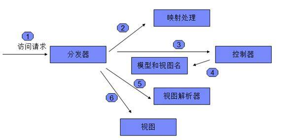
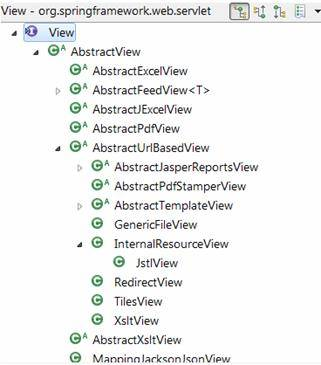
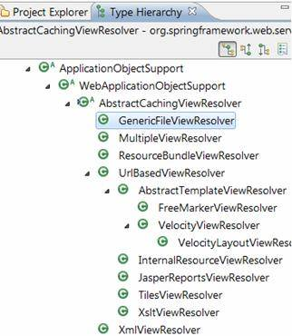
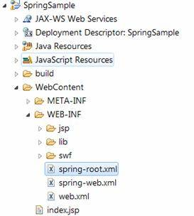
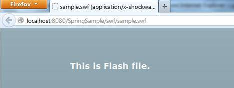

# 开发 Spring 自定义视图和视图解析器
显示后缀名为 SWF 的视图并为特定后缀名的视图注册相应的视图解析器

**标签:** Java

[原文链接](https://developer.ibm.com/zh/articles/j-lo-springview/)

仲光庆, 张坚

发布: 2013-01-09

* * *

## Spring 视图和视图解析器简介

### 什么是 Spring 视图和视图解析器

Spring MVC（Model View Controller）是 Spring 中一个重要的组成部分，而 Spring 视图和视图解析器则是 Spring MVC 中的组成部分。在介绍 Spring 视图和视图解析器前，我们先了解下在 Spring MVC 框架中，一个 Web 请求所需经历的六个阶段：

1. 请求会首先被 Spring MVC 的前端请求分发器（Dispatcher）拦截。该拦截器是一个 Servlet， 需要在 web.xml 中配置，所有符合所配置的 URL 样式的访问请求，将都会被该拦截器拦截。Spring 提供了默认的分发器 org.springframework.web.servlet.DispatcherServlet，您可以根据需要，决定是否需要定制自己的分发器。
2. 在接收到访问请求后，分发器会根据开发人员在 Spring 配置文件或代码中的注解（Annotation），来查找合适的控制器。
3. 分发器在查找到合适的控制器后，将请求转交给该控制器处理。
4. 通常，控制器会调用相应服务类来处理业务逻辑，在将请求处理后，控制器需返回处理后的结果数据模型（Model）以及下一个需要显示的视图名。
5. 在控制器处理结束并返回模型和视图名之后，Spring 会依次调用 Spring 容器中所注册的视图解析器，来查找符合条件的视图。
6. 在获得 Spring 视图后，Spring 会根据该视图的配置信息，显示该视图。

##### 图 1.Spring MVC 处理流程



通过以上 Spring MVC 的介绍，我们可以发现，视图和视图解析器将出现在整个请求处理流程中的最后部分。那么到底什么是视图和视图解析器？简而言之，视图是指 Spring MVC 中的 V（View），而视图解析器的功能则是依据指定的规则来查找相应的视图。

### 常用视图和视图解析器简介

在开发中，视图通常就是 JSP、Velocity 等。Spring 默认提供了多种视图解析器，比如，我们可以使用最常用解析器 InternalResourceViewResolver 来查找 JSP 视图（与之相对应的视图类为 InternalResourceView）。通常，一个视图解析器只能查找一个或多个特定类型的视图，在遇到 Spring 不支持的视图或者我们要自定义视图查找规则的情况下，我们就可以通过扩展 Spring 来自定义自己所需的视图解析器。目前，视图解析器都需要实现接口 org.springframework.web.servlet.ViewResolver， 它包含方法 resolveViewName，该方法会通过视图名查找并返回 Spring 视图对象。表 1 列出了常用的 Spring 视图解析器。

##### 表 1.Spring 常用视图解析器列表

视图解析器描述XmlViewResolver接口 ViewResolver 的实现，从 XML 配置文件中查找视图实现（默认 XML 配置文件为 /WEB-INF/views.xml）.ResourceBundleViewResolver接口 ViewResolver 的实现，用于从 properties 文件中查找视图。.UrlBasedViewResolver接口 ViewResolver 的实现，用于根据请求的 URL 路径返回相应的视图，该视图需为抽象类 AbstractUrlBasedView 的实现，它还有些子类，如 InternalResourceView 和 JstlView 等 .InternalResourceViewResolverUrlBasedViewResolver 的子类，通常用于查找 JSP（类 InternalResourceView）和 JSTL（类 JstlView，InternalResourceView 的子类）等视图。VelocityViewResolver /FreeMarkerViewResolverUrlBasedViewResolver 的子类分别用于支持 Velocity（类 VelocityView）和 FreeMark 视图（类 FreeMarkerView）。ContentNegotiatingViewResolver接口 ViewResolver 的实现，用于根据请求文件的后缀名或请求的 header 中的 accept 字段查找视图。

在多数项目中，InternalResourceViewResolver 是最常用的，该解析器可以返回指定目录下指定后缀的文件，它支持 JSP 及 JSTL 等视图技术，但是用该视图解析器时，需要注意设置好正确的优先级，因为该视图解析器即使没有找到正确的文件，也会返回一个视图，而不是返回 null，这样优先级比该视图解析器低的解析器，将不会被执行。

在 Web 开发中，我们的前端显示可以是 JSP、Excel、Velocity 等，在 Spring 中，不同的前端显示技术都有其对应的 Java 视图类，正如表 1 所提到的，InternalResourceView 可以代表 JSP 视图，FreeMarkerView 代表 FreeMarker 视图。目前，Spring 支持多种技术开发的视图，包括 JSP、JSTL、Excel，Velocity 等，在多数项目中，用户并不需要自定义自己的视图，在接下来的章节，我们将介绍如何定义开发视图和视图解析器。

## 示例场景介绍

在多数项目中，我们并不需要开发定制视图解析器和视图，但在某些情况下，比如我们项目中的视图格式并不是 Spring 所支持的，或者我们想使用自己的视图和视图解析器来更灵活的处理视图，此时，我们就可以开发自己的视图解析器和视图。

在本例中，我们提供了三种视图：JSP 文件、SWF 文件（flash 文件）以及一个自定义后缀名（.config）的文件，为了更方便的支持 SWF 视图和自定义文件后缀名的视图，我们开发了自定义的视图对象，希望能够使用该视图对象来支持 SWF 文件和 .config 文件，另外还开发了两个视图解析器来实现本例。

## 开发 Spring 视图

在 Spring 中，所有的视图类都需要实现接口 org.springframework.web.servlet.view.View，如图 2 所示，Spring 还提供了多个实现了 View 接口的抽象类，所以我们并不需要直接实现接口 View, 而是可以实现 Spring 所提供的抽象类。本例中的自定义视图类便是继承了抽象类 org.springframework.web.servlet.view.AbstractUrlBasedView，通过继承抽象类可以减轻定制开发的复杂度。

##### 图 2.Spring 视图接口继承体系图



为了简化程序开发和兼容更多的视图，本例开发的自定义视图类为一个通用视图类，它可以将请求文件的内容直接写到请求响应（HTTP Response）中，并设置为该视图类所配置的内容类型（HTTP content-type），但该视图类只能用于处理浏览器能直接显示的请求文件资源，如文本文件、SWF 文件等，但它并不能支持 JSP 等需要编译处理的文件。本例中，我们便是使用自定义视图类 GenericFileView 来显示 SWF 和 .config 文本文件。清单 1 给出了通用视图类代码。

##### 清单 1\. 通用视图类代码

```
public class GenericFileView extends AbstractUrlBasedView {

// 默认内容类型
private final static String CONTENT_TYPE = "text/plain";

//http response conent
private String responseContent;

public GenericFileView() {
     super();
     setContentType(CONTENT_TYPE);
}

@Override
public void setContentType(String contentType) {
     super.setContentType(contentType);
}

@Override
protected void renderMergedOutputModel(Map<String, Object> model,
       HttpServletRequest request, HttpServletResponse response)
       throws Exception {
     // 设置 content type
     response.setContentType(getContentType());
     // 写入 response 内容
     response.getWriter().write(this.responseContent);
     response.getWriter().close();
}

/**
* 设置 http response content
* @param responseContent
*/
public void setResponseContent(String responseContent) {
     this.responseContent = responseContent;
}

}

```

Show moreShow more icon

正如前文所述，本例中的视图类继承了抽象类 AbstractUrlBasedView，因此，我们的自定义通用视图类并不需太多代码，其代码主要就是设置文件内容类型和将响应的内容设置到请求响应对象中。

## 开发 Spring 视图解析器

有了视图类，我们还需要查找该视图类的视图解析器。所有的视图解析器都需要实现接口 org.springframework.web.servlet.ViewResolver，但同视图的实现一样，Spring 还提供了一个抽象类，我们同样可以通过实现抽象类来节省开发工作。

在本例中，我们开发了自定义视图解析器 GenericFileViewResolver，该类实现了抽象类 org.springframework.web.servlet.view.AbstractCachingViewResolver，从图 3 可以发现，常用的 Spring 中的视图解析器都继承了该抽象类。

##### 图 3\. 抽象类 AbstractCachingViewResolver 继承体系图



除了继承抽象类 AbstractCachingViewResolver 外，本例中的视图解析器还是实现了接口 org.springframework.core.Ordered，该接口用于设置视图解析器的调用优先级。这是因为，通常一个项目中会有多个视图解析器，那么就需要我们设定各个解析器被调用的优先级，尤其是和 InternalResourceViewResolver 混用的情况下，必须要定义正确的调用优先级，正如我们在前面提到的 InternalResourceViewResolver 会永远返回一个视图，即使在查找不到合适的视图的情况下也不会返回 null，导致后续的视图解析器不会被调用。

视图解析器的核心方法是 loadView，如清单 2 所示，在该方法中，需要根据请求的文件路径，找到该请求的文件，然后再生成一个新的视图，并将文件流写到视图对象中。清单 2 为自定义的视图解析器代码片段

##### 清单 2\. 自定义视图解析器代码片段

```
@Override
    protected View loadView(String viewName, Locale locale) throws Exception {
        if (location == null) {
            throw new Exception(
                    "No location specified for GenericFileViewResolver.");
        }
        String requestedFilePath = location + viewName;
        Resource resource = null;

        try {
            logger.finest(requestedFilePath);
            resource = getApplicationContext().getResource(requestedFilePath);

        } catch (Exception e) {
            // 返回 null, 以便被下一个 resolver 处理
            logger.finest("No file found for file: " + requestedFilePath);
            return null;
        }
        logger.fine("Requested file found: " + requestedFilePath + ",
                    viewName:" + viewName);
        // 根据视图名，获取相应的 view 对象
        GenericFileView view = this.getApplicationContext().getBean(this.viewName,
                GenericFileView.class);
        view.setUrl(requestedFilePath);
        // 写入 view 内容
        view.setResponseContent(inputStreamTOString(resource.getInputStream(),
                "ISO-8859-1"));
        return view;
}

```

Show moreShow more icon

需要注意的是，在找不到请求文件的时候，需要返回 null，这样 Spring 容器中所注册的其他低优先级的视图解析器才能被调用。

## 开发复合视图解析器

由于本例需要支持 SWF 及自定义后缀名的文件，所以我们期望能够根据不同请求的后缀名来调用不同的视图解析器。实际上，Spring 已经提供了类似的视图解析器-ContentNegotiatingViewResolver，它可以根据请求的文件后缀名或请求的 Accept 头来查找视图。ContentNegotiatingViewResolver 本身并不负责查找视图，它只是将视图查找工作代理给所注册的视图解析器，清单 3 给出了 ContentNegotiatingViewResolver 的配置文件片段。

##### 清单 3.ContentNegotiatingViewResolver

```
<bean class="org.springframework.web.servlet.view.ContentNegotiatingViewResolver">
<property name="mediaTypes">
    <map>
      <entry key="atom" value="application/atom+xml"/>
      <entry key="html" value="text/html"/>
      <entry key="json" value="application/json"/>
    </map>
</property>
<property name="viewResolvers">
    <list>
      <bean class="org.springframework.web.servlet.view.BeanNameViewResolver"/>
      <bean class="org.springframework.web.servlet.view.InternalResourceViewResolver">
        <property name="prefix" value="/WEB-INF/jsp/"/>
        <property name="suffix" value=".jsp"/>
      </bean>
    </list>
</property>
<property name="defaultViews">
    <list>
      <bean class="org.springframework.web.servlet.view.json.MappingJacksonJsonView" />
    </list>
</property>
</bean>

```

Show moreShow more icon

从清单 3 可以发现，在使用 ContentNegotiatingViewResolver 时，一般需要配置三个部分：

1. 注册所支持的媒体类型，也就是文件后缀名及其对应的文件内容类型。
2. 视图解析器，也就是 ContentNegotiatingViewResolver 在查找视图时，实际所代理使用的视图解析器。
3. 默认视图，当视图解析器没有查找到合适的视图时，将使用该默认视图。

关于 ContentNegotiatingViewResolver 的具体使用，读者可以参见 Spring 官方文档。

本例开发的复合视图解析器和 ContentNegotiatingViewResolver 类似，虽然本例也可以使用 ContentNegotiatingViewResolver 来实现相同的功能，但 ContentNegotiatingViewResolver 较为复杂，它在查找视图时，会将所有注册到 ContentNegotiatingViewResolver 下的视图解析器全部调用一遍，然后将所有查找到的视图保存为候选视图，最后再根据筛选条件，筛选出一个最为合适的视图。而本例中的复合视图解析器则简单实用的多，只需要注册文件后缀名和对应的视图解析器即可，当为请求找到相应的视图解析器时，便直接调用该视图解析器，而不需调用其所注册的所有视图解析器，清单 4 给出了在 Spring 配置文件中对该复合视图解析的配置文件片段。

##### 清单 4\. 复合视图解析器配置片段

```
<bean id="viewResolver"
          class="com.sample.web.viewresolver.MultipleViewResolver" p:order="0">
        <property name="resolvers">
            <map>

              <entry key="config">
                    <bean class="com.sample.web.viewresolver.GenericFileViewResolver"
                          p:location="/WEB-INF/config/" p:cache="false">
                        <property name="viewName" value="configFileView"/>
                    </bean>
                </entry>

                <entry key="swf">
                    <bean class="com.sample.web.viewresolver.GenericFileViewResolver"
                          p:location="/WEB-INF/swf/" p:cache="false">
                        <property name="viewName" value="swfFileView"/>
                    </bean>
                </entry>

            </map>
        </property>
    </bean>

```

Show moreShow more icon

在配置文件中，我们为不同的文件后缀名注册了相应的视图解析器，并为该视图解析器配置了所对应查找的视图类。同 ContentNegotiatingViewResolver 类似，本例中的复合视图解析器 MultipleViewResolver 也是将具体的视图查找工作代理给所注册的视图解析器，实际上，MultipleViewResolver 也是一个普通的视图解析器，不过在核心方法 loadView（如清单 5）中，首先获得请求视图的后缀名，然后根据后缀名获得所注册的视图解析器，最后，再使用获得的视图解析器查找视图。

##### 清单 5 .MultipleViewResolver 代码片段

```
@Override
protected View loadView(String viewName, Locale locale) throws Exception {
String fileExtension = StringUtils.getFilenameExtension(viewName);
// 返回 null 如果没有后缀名，以便下一个 resolver 处理
if (fileExtension == null) {
return null;
}
// 通过后缀名获取 resolver
ViewResolver resolver = resolvers.get(fileExtension);
//return null to invoke next resolver if no resolver found
return resolver == null ? null : resolver.resolveViewName(viewName,
locale);

}

```

Show moreShow more icon

在准备好了自定义视图和视图解析后，我们就可以开发 Spring MVC 中的控制器来处理 Web 请求。

## 开发控制器

在本例中，我们将要演示使用自定义视图解析器处理 SWF 和 .config 文件访问请求，另外还提供了处理 JSP 文件访问请求的能力，所以，本例提供了一个简单的控制器 SampleController，该控制器能够处理三个请求路径，并返回相应的视图，如清单 6 所示。

##### 清单 6 .SampleController 代码片段

```
@Controller
public class SampleController {

@RequestMapping("/jsp/sample")
public String getSampleJsp() {
return "SampleJsp";
}

@RequestMapping("/config/sample.config")
public String getSampleConfig() {
return "SampleConfig.config";
}

@RequestMapping("/swf/sample.swf")
public String getSampleSwf() {
return "SampleSwf.swf";
}

}

```

Show moreShow more icon

根据以上代码，控制器将为请求 /jsp/sample 返回视图 SampleJsp，为请求 /config/sample.config 返回视图 SampleConfig.config，并能够为请求 /swf/sample.swf 返回视图 SampleSwf.swf。

## 配置视图解析器

在完成控制器的开发后，我们就可以配置视图及相应的解析器。在开发中，我们通常会将 Spring 的配置文件至少分为两个部分，在本例中，我们创建了两个 Spring 配置文件 :spring-root.xml 和 spring-web.xml，如图 4 所示。spring-root.xml 用于存放非 web 管理相关的配置，而 spring-web.xml 则存放了所有与 web 相关的配置。由于本例比较简单，spring-root.xml 文件中并没有具体的配置内容。

##### 图 4\. 示例项目文件结构图



通过清单 6 可以发现，我们使用了注解（Annotation）来定义控制器，所以，我们需要在 spring-web.xml 中配置 Spring 扫描的根目录，如清单 7 所示。

##### 清单 7 设置 Spring 注解扫描路径

```
<context:component-scan base-package="com.sample.web.controller"/>

```

Show moreShow more icon

清单 4 中配置了复合视图解析器，除此之外，我们还需要定义解析器 jspViewResolver 来查找 JSP 文件，注意 order 属性值为 1，大于复合视图解析器的属性值，这样，我们就可以首先使用自定义的复合视图解析器查找视图，当没有找到合适的代理视图解析器或视图时，才会调用 jspViewResolver 来进行视图查找。

##### 清单 8\. 配置 InternalResourceViewResolver

```
<!-- View Resolver for JSP files -->
<bean id="jspViewResolver"
          class="org.springframework.web.servlet.view.InternalResourceViewResolver"
          p:order="1">
        <property name="prefix" value="/WEB-INF/jsp/"/>
        <property name="suffix" value=".jsp"/>
</bean>

```

Show moreShow more icon

在清单 4 中，我们还定义了所注册的视图解析器所对应的视图，所以，在配置文件中，我们还需要声明相关的视图，如清单 9 所示。

##### 清单 9\. 配置自定义视图

```
<bean id="configFileView" class="com.sample.web.view.GenericFileView"
          p:contentType="text/plain" p:url="" scope="prototype"/>

<bean id="swfFileView" class="com.sample.web.view.GenericFileView"
          p:contentType="application/x-shockwave-flash" p:url="" scope="prototype"/>

```

Show moreShow more icon

configFileView 用于表示一个文本文件视图，本例对应一个后缀名为 .config 的文本文件，swfFileView 用于表示一个 flash 文件视图，本例为一个后缀名为 .SWF 的 flash 文件。

## 示例运行

至此，本例的开发工作就都已经完成了，示例控制器只支持三个请求路径，但实际上，我们可以通过使用 @RequestMapping(value = “/path/{fileName}”) 能够让控制器处理更为通用的请求。

在运行示例前，需要准备好 Web 服务器和 Spring 运行环境，本例已经在 Tomcat 7.0 和 Spring 3.0.5 环境上测试通过，读者可以下载源代码部署在自己的环境上。

当我们输入请求地址 `http://localhost:8080/SpringSample/swf/sample.swf`， 控制器将通过使用我们自定义的视图解析器，查找到视图文件 SampleSwf.swf，并将文件内容作为 application/x-shockwave-flash 显示到浏览器中，如图 5 所示。

##### 图 5\. 请求访问 SWF 文件



处理自定义文件后缀名 .config 的处理流程同处理 SWF 文件类似，差别之处在于，视图的文件媒体类型为 text/plain，所以在浏览器中，我们将会看到一个文本显示， 如图 6 所示 .

##### 图 6\. 请求访问 .config 文件


另外，本例还支持 JSP 文件的访问，在本例中，当有 JSP 访问请求时，自定义的视图解析器将会被调用，但由于我们并没有注册查找空后缀名或 .jsp 请问的访问，所以自定义的视图解析器将返回一个 null，接下来，Spring 会接着调用我们已注册的 jspViewResolver（也就是 InternalResourceViewResolver）来继续视图查找，并最终返回所请求的 JSP 文件，如图 7 所示。

##### 图 7\. 请求访问 JSP 文件


## 总结

本文介绍了 Spring 视图和视图解析器的相关概念，并简单介绍了 Spring 所提供的视图和视图解析器，并结合示例介绍了如何开发自定义的视图和视图解析器。

## Download

[SampleProj.zip](http://www.ibm.com/developerworks/cn/java/j-lo-springview/SpringSample.zip): 示例代码