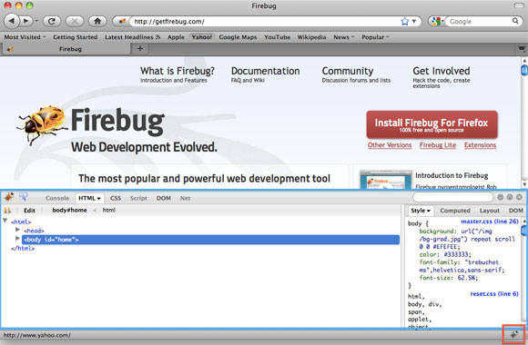
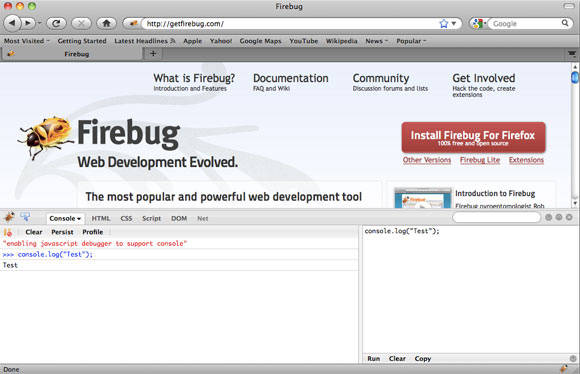
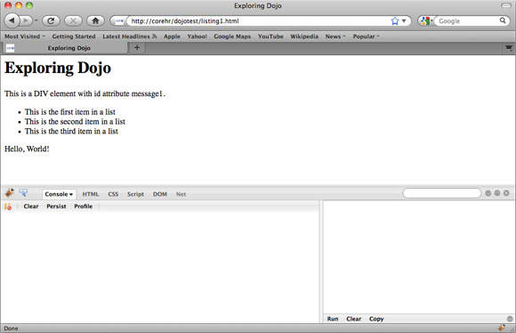
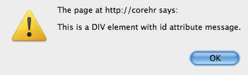
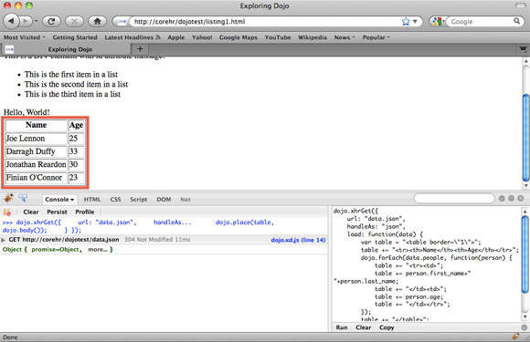

# 开始 Dojo 开发
从头开始开发 Dojo 驱动的应用程序

**标签:** Web 开发

[原文链接](https://developer.ibm.com/zh/articles/wa-ground/)

Joe Lennon

发布: 2012-01-05

* * *

## Dojo Toolkit 简介

Dojo 于 2004 年创建，使开发 DHTML 和 JavaScript web 应用程序开发流程更为容易，隐藏了很多现代 web 浏览器中普遍存在的跨浏览器矛盾。这使重点放在实现功能上，而不是调整代码使其在每个浏览器上运行。Dojo 属于 Dojo 基金会，该基金会是 Russell 和 Dylan Schiemann 于 2005 年创建的。Dojo 是一个开源软件（OSS），有双重许可，Academic Free License (AFL) 和一个修改的 BSD 许可，您可以选择遵守一个。

### 特性一瞥

Dojo Toolkit 的特性可以分到 4 个不同部分。这种划分使得开发人员可以将库大小保持到最小，确保应用程序性能不受大量 JavaScript 库下载的影响。例如，如果您只需要 Ajax 支持性能，您只需要包含 base 包；不需要包含扩展的 Dijit UI 组件，在本系列中稍后您将学习更多关于 Dojo 加载不同模块的方法。

- **Base**: Base 包提供 Dojo Toolkit 的基础，包括一些功能，比如 DOM 使用函数、CSS3 基于选择器的 DOM 查询、事件处理、基本的动画、以及 Dojo 基于类的面向对象特性。本文主要介绍 Base。
- **Core**: Core 包包含一些 Base 中没有包含的附加特性。通常，这些特性不像 Base 中的特性那样频繁使用；因此，它们单独加载减轻 Base 包的负担。从这一点上来讲，Core 包提供一些实际有用的组件，包括高级动画拖放、I/O、数据管理、国际化（i18n）、浏览器历史管理。Core 包不再本文范围之内。
- **Dijit**: Dijit 包包含 Dojo 小部件和组件的扩展 UI 库。这些小部件的一些示例包括对话框、日历、调色板、工具提示和树。它也包括一些表单控件，这比标准 HTML 表单控件提供更多的功能，还有一些完整的布局管理选项。本系列的第 3 部分将深入介绍 Dijit 特性。
- **DojoX**: Dojo eXtensions (DojoX) 包含工具箱的各个子项目。位于 DojoX 中的大多数是实验特性，但是也有一些稳定组件和特性。DojoX 将在本系列的第 3 部分做一简要介绍。

## 准备开始

Dojo 讨论的够多了。现在我们来看看工具包的实际使用。本小节将介绍在您的项目中使用 Dojo 的各种方法，如何使用 Firefox 和 Firebug 插件建立一个开发环境，以及如何编写 Dojo 代码来确保一切如预期正常运行。

### 建立 Dojo

建立 Dojo 最简单的方法是从一个 Content Delivery Network (CDN) 提供它，这将从附近的客户机器上传递 Dojo JavaScript 文件，而不是从您自己的服务器上。 这不仅有助于加速脚本加载，也意味着用户从其他网站加载 Dojo 文件的机会有所增加，这使得它们从缓存中加载，进一步提高了加载速度。

在本系列中，假设您使用的是 Dojo 1.5，尽管任何 1.x 版本都是可兼容的。包含在您的 HTML 页面中的以下 `<script>` 标记将从 Google 的 CDN 中下载 Dojo 1.5：

```
<script src="http://ajax.googleapis.com/ajax/libs/dojo/1.5/dojo/dojo.xd.js"></script>

```

Show moreShow more icon

另外，您可以下载 Dojo 到您自己的服务器上，然后从那里加载它。我的首选方法是从一个 CDN 加载，同时有一个本地副本在 CDN 服务器出现问题时作为后备。为了做到这一点，下载 Dojo 并将文件放在一个相对于存储您的 web 目录比较合适的位置。假设从您 web 目录到 Dojo 脚本文件的相对路径是 “script/”，清单 1 中的代码将首先从 CDN 加载 Dojo，如果失败，则加载本地版本。

##### 清单 1\. 使用本地回退从 CDN 加载 Dojo

```
<script src="https://ajax.googleapis.com/ajax/libs/dojo/1.5/dojo/dojo.xd.js">
</script>
<script>
typeof(dojo) === "undefined" && document.write(unescape('%3Cscript
src="js/libs/dojo-1.5.min.js"%3E%3C/script%3E'))
</script>

```

Show moreShow more icon

有一点很重要，将以 `typeof(dojo)` 开头的代码放在一行；否则，它将不能运行。如果您想测试副本是否起作用，只需要注释掉从 CDN 加载的这一行，然后使用 “Hello, World!” 示例（几分钟内就可以创建）测试您的页面即可。

### 使用 Firebug 控制台

与需要创建一个 web 页面来试验 Dojo 相比，本文中的很多示例是使用一个卓越的 Firefox 插件 Firebug 来执行的。Firebug 为 JavaScript 开发人员提供完整的控制台记录、调试和网络监控设施，这使得测试和修复 JavaScript 应用程序中的问题更为容易。其他的一些 web 浏览器实际上也包含这些特性，但是在本例中我使用的是 Firefox 和 Firebug，因为它们在各种平台上都可使用。

首先，您必须安装 Firefox 和 Firebug（更多下载信息见 参考资料 ）。安装了 Firefox 之后，启动它，然后下载和安装 Firebug 插件。Firebug 安装完成之后，在您 Firefox 窗口的右下角您可以看到一个像虫子的图标，如图 1 所示，单击这个图标就可以打开 Firebug 窗口。

##### 图 1\. Firebug 图标和窗口



要使用这个 Firebug 控制台，单击 Console 选项卡。您可能首先需要启动控制台，单击选项卡上的下箭头然后单击 **Enable** 。现在，在控制台窗口中，输入代码： `console.log("Test");` 。

您可以看到图 2 所示的结果，有一条消息显示 JavaScript 调试器被启动来支持控制台。

##### 图 2\. 使用 Firebug 控制台



### Hello, World!

接下来，我们来测试 Dojo。对于 “Hello, World!” 示例，当 DOM 完成加载后（见清单 2），您将使用 Dojo 附加一个函数。该函数只是将消息 “Hello, World!” 打印到页面结尾处。好了，所以说这的确不会改变您创建 web 应用程序的方法，它所做的只是让您确认 Dojo 在您的页面上可用。整篇文章中您都要加载这个页面，使用 Firebug 控制台探究 Dojo 特性。

##### 清单 2\. listing1.html：Dojo Hello World 应用程序

```
<html>
<head>
    <title>Exploring Dojo</title>
</head>
<body>
<h1>Exploring Dojo</h1>
<div id="message">This is a DIV element with id attribute message.</div>
<ul id="list">
    <li>This is the first item in a list</li>
    <li class="highlight">This is the second item in a list</li>
    <li>This is the third item in a list</li>
</ul>
<script src="http://ajax.googleapis.com/ajax/libs/dojo/1.5/dojo/dojo.xd.js">
</script>
<script>
dojo.addOnLoad(function() {
    dojo.create(
        "div",
        {
            "innerHTML": "Hello, World!"
        },
        dojo.body()
    );
});
</script>
</body>
</html>

```

Show moreShow more icon

该函数将附加一个 `anonymous` 函数，DOM 加载完成后触发该函数。这个函数使用 `dojo.create` 来构建一个新 DOM `<div>` 元素，将它的 `innerHTML` 属性设置为 “Hello, World!”，然后使用实用工具函数 `dojo.body` 将它插入到页面正文中。结果在图 3 中显示。您会注意到 “Hello, World!” 消息已经附加在页面的结尾处了。

##### 图 3\. “Hello World” 页面光彩夺目



暂时不要删除这个页面或者关闭它。在下一小节，您将会用到这个页面，只有一个目的 — 加载 Dojo，并且您将使用 Firebug 控制台直接试验 Dojo 的其他方面。

继续下一小节之前，还有一点非常重要需要指出，那就是关于 JavaScript 在页面上的定位。您可能注意到了，我没有将 Dojo 和这个 JavaScript 页面包含在 HTML 文档的 `<head>` 部分，而是将其添加在页面的结尾、 `<body>` 元素之前。这是因为将 JavaScript 放在这里不会影响页面其他元素的加载。在您的页面上使用 JavaScript 库时，确保它们不会影响页面其他元素的加载这一点很重要，这样您页面的性能就会达到最优。更多信息参见 参考资料 。

## 基础知识

在本小节，您将学习一些很有用的 Dojo 功能，使之更易于使用 DOM 和阵列。要实验本节中的示例，继续使用上小节您在 Firefox 中创建的页面，输入 Firebug 控制台窗口中的代码。

### DOM 实用函数

DOM 实用函数通过提供根据 ID 寻找条目的能力或者使用 CSS3 选择器，使得使用 DOM 中的元素比较容易。还有一些其他功能，可以创建和销毁元素，以及操作现有元素内容。

### `dojo.byId`

`dojo.byId` 函数使您可以通过 `id` 属性选择一个 DOM 节点。该函数是标准 JavaScript `document.getElementById` 函数的一个别名，但是显然简短易书写，而且还解决了很多跨浏览器矛盾。现在，我们来使用 Firebug 控制台，通过 ID “message” 获取 DOM 元素内容： `dojo.byId("message").innerHTML;` 。

在控制台左边您将看见清单 3 中显示的响应。

##### 清单 3\. 响应

```
>>> dojo.byId("message").innerHTML;
"This is a DIV element with id attribute message1."

```

Show moreShow more icon

清单 3 的第一行重复了发出的命令。第 2 行是该命令的结果，在本例中是 ID 为 “message” 的 `<h1>` 元素的内容。

继续介绍之前，我们来进行一个更有趣的尝试。在控制台编辑器中，输入清单 4 中的命令。

##### 清单 4\. `dojo.fadeOut` 命令

```
dojo.fadeOut({
    node: dojo.byId("message"),
    duration: 600
}).play();

```

Show moreShow more icon

您可以看到元素逐渐淡出，从页面上消失了。要想使其再次渐显回来，在命令行中将 `fadeOut` 修改为 `fadeIn` ，再次运行。很不错吧？这演示了如何使用 Firebug 控制台动态操控当前页面。当然，这些改进只适用于当前页面加载，并不是持久性的，如果您离开页面或者刷新了页面，这些更改将不再有效。

### `dojo.query`

在最后这一小节，您将学习如何通过使用其 `id` 属性获取对单个 DOM 元素的引用。虽然这很有用，但将这一属性添加到您想交互的每个元素并不可行。当然， `id` 必须是惟一的。那么如果您想一次引用几个元素呢？这就需要引入 `dojo.query` 函数了。

如果您想一次引用 ID 为 “list” 的无序列表的所有 `<li>` 子元素，然后将每个元素的内容打印到控制台上。有了 `dojo.query` ，这将非常简单（见清单 5）。

##### 清单 5\. `dojo.query` 命令

```
dojo.query("#list li").forEach(function(item) {
    console.log(item.innerHTML);
});

```

Show moreShow more icon

该命令在控制台上的输出，如清单 6 所示。

##### 清单 6\. 控制台上的输出

```
>>> dojo.query("#list li").forEach(function(item) { console.log
                                                       (item.innerHTML); });
This is the first item in a list
This is the second item in a list
This is the third item in a list
[li, li.highlight, li]

```

Show moreShow more icon

`dojo.query` 函数接受一个字符串参数，使用一个 CSS3 选择器引用您想选择的元素。在这个具体实例中，假设您想选择所有 `li` 元素，这是 ID 为 “list” 的元素的子元素。该函数返回一个组匹配查询的元素。在清单 6 的示例中，您使用 `dojo.forEach` 函数对这个数组进行遍历，然后将发现的每个元素的 `innerHTML` 属性输出到控制台。在下一小节您将学习关于该函数和其他数组函数的更多内容。

继续之前，我们先来使用 `dojo.query` 寻找任何类名为 `highlight` 的 HTML 元素，并应用一些样式使它们突出显示（见清单 7）。

##### 清单 7\. 使用 `dojo.query` 寻找任何类名为 `highlight` 的 HTML 元素

```
dojo.query(".highlight").style({
    backgroundColor: "yellow",
    color: "red"
});

```

Show moreShow more icon

您应该注意到了，页面上无序列表的第二项改为黄色背景，文本颜色改为红色。您可能还注意到了，在本例中 `dojo.forEach` 未被使用。我将在下一小节 “ [数组和 NodeLists](#数组和-nodelists) ” 中向您说明为什么这不需要。

### 其他有用的实用函数

除了 DOM 查询和元素选择之外，在 Dojo 中还有很多其他实用函数使得使用 DOM 更为容易。在 “Hello, World” 示例中您已经见过其中两个。 `dojo.body` 函数只返回文档的 `<body>` 元素， `dojo.body` 的一个引用，以及文档对象本身。 `dojo.create` 让您可以快速创建一个新元素、定义它的属性、然后将它放在 DOM 中。

现有的其他函数包括 `dojo.place` ，它允许您将现有的或新创建的元素放在文档的任何地方。 `dojo.empty` 只执行您所期望的 — 清空一个 DOM 元素的内容。 `dojo.destroy` 删除一个节点以及其所有子元素。关于这些函数的其他信息，参见 参考资料 获取 Dojo 参考文档的链接。

### 数组和 NodeLists

数组允许您存储一个值集合，在标准 JavaScript 中提供。在 Dojo 中，数组被扩展来包括几个帮助函数。这些扩展的数组被称为 NodeLists。一个 NodeList 可以使用任何标准数组函数，以及其他 Dojo 特定函数，当您使用上一小节中描述的 `dojo.query` 函数时，返回值是一个 NodeList（准确地说是 `dojo.NodeList` ）对象。我们来看看 NodeLists 中可用的函数。

### `dojo.forEach`

第一个值得一提的函数是 `dojo.forEach` ，这个函数您已经在上一小节的 `dojo.query` 示例中见过了。这个函数允许您在 NodeList 上定义一个迭代器，提供一个可以应用到 NodeList 中的每一项上的功能。我们在清单 8 中来看一个更为基本的示例。

##### 清单 8\. 基本示例

```
var list = ['My','name','is','Joe'];
dojo.forEach(list, function(item, i) {
    console.log((i+1)+'. '+item);
});

```

Show moreShow more icon

清单 8 中的代码输出的结果如清单 9 所示。

##### 清单 9\. 输出

```
>>> var list = ['My','name','is','Joe']; dojo.forEac...item, i)
                             { console.log((i+1)+'. '+item); });
1. My
2. name
3. is
4. Joe

```

Show moreShow more icon

正如您所看到的， `forEach` 函数遍历数组中的每一项，然后在其上执行附加功能。上面，您已经使用了一个 `anonymous` 函数，但是您还可以使用一个命名函数，如清单 10 所示。

##### 清单 10\. 使用一个命名函数通过 `dojo.forEach` 遍历一个数组

```
var list = ['My','name','is','Joe'];

var printArray = function(item, i) {
    console.log((i+1)+'. '+item);
}

dojo.forEach(list, printArray);

```

Show moreShow more icon

### `dojo.indexOf`

`dojo.indexOf` 函数使得您可以在一个数组中找出具体一个值的位置。最好是结合示例说明。使用上一小节创建的列表数组，尝试找出值为 `name` 的数组的地址： `dojo.indexOf(list, "name");`.

返回结果如清单 11 所示。

##### 清单 11\. 结果

```
>>> dojo.indexOf(list, "name");
1

```

Show moreShow more icon

在数组中值为 `name` 的项下标为 1。记住 JavaScript 数组的下标是从 0 开始的，因此该值是数组的第 2 项。如果您想要尝试使用该函数寻找一个数组中并不存在的值，返回值为 `-1` 。

该函数返回给定值的第一个位置的下标，因此，如果数组中有多个项有相同的值，它只停在第一项上，Dojo 提供一个类似的函数， `dojo.lastIndexOf` ，允许您寻找特定值的最后一个位置。该函数与 `dojo.indexOf` 运行方式完全一样。

### `dojo.filter`

`dojo.filter` 函数支持您创建一个新数组，这个新数组是另一个数组的过滤版。例如，如果您想为您早期创建的列表数组创建一个新版本，但是又不想包括值为 `is` 的那些项。您可以使用清单 12 所示的代码。

##### 清单 12\. 过滤一个数组来创建一个新数组

```
var filteredList = dojo.filter(list, function(item) {
    return item != "is";
});

dojo.forEach(filteredList, "console.log(item)");

This results in the following output:

>>> var filteredList = dojo.filter(list,
function(it...dojo.forEach(filteredList, "console.log(item)");
My
name
Joe

```

Show moreShow more icon

### 其他 NodeList 函数

Dojo 还有一些其他 NodeList 函数，在处理数组时非常有用。 `dojo.map` 函数允许您创建一个新数组 — 现有数组的修改版。例如，如果您想创建一个代表货币值的数字数组。您可以使用一个映射函数以货币格式返回这些值的一个数组。 `dojo.some` 允许您检查在数组中匹配指定标准的项是否至少有一个。类似地， `dojo.every` 用于检查是否每一项匹配指定标准。NodeList 函数的完整列表及其相关文档，见 参考资料 。

## Dojo 中的事件处理

多数 JavaScript 库都有一个本地 JavaScript 事件处理的跨浏览器实现，允许您附加函数，在事件触发时调用。这可能很有用，Dojo 通过允许您将函数链接到其他函数进一步延伸了这一概念，这可能是 DOM 事件、对象时间、用户定义函数、或者是 “topics”，我们将在下一节进行讨论。

### DOM 事件处理

将函数附加到 DOM 对象的第一个方法是使用 `dojo.connect` 函数。结合示例来说明最好不过。在 Firebug 控制台输入清单 13 中的代码。

##### 清单 13\. 使用 `dojo.connect` 附加函数到 DOM 事件

```
var message = dojo.byId("message");
dojo.connect(message, "onclick", function() {
    alert(message.innerHTML);
});

```

Show moreShow more icon

控制台中的输出如清单 14 所示。

##### 清单 14\. 输出

```
>>> var message = dojo.byId("message"); dojo.connect..., function()
                                              { alert(message.innerHTML); });
[div#message, "onclick", function(), 1]

```

Show moreShow more icon

这真的很棒，但是您不是就希望该功能可以真正地完成一些任务吗？它确实可以。Dojo 已将一个函数附加到 ID 为 “message” 的元素的 `click` 事件处理程序上了。想试试看吗？单击屏幕上的消息 “This is a DIV element with id attribute message.”。 您将看见一个 JavaScript 提示框，如图 4 所示。

##### 图 4\. 附加函数到 DOM 事件



漂亮且容易，不是吗？如果您想附加一个事件到数组的所有条目上该怎么办？例如，假设您想要页面上无序列表中的每一项在您单击时都以粗体突出显示。使用清单 15 中的代码就可以很轻松地完成。

##### 清单 15\. 附加事件到数组元素上

```
dojo.query("#list li").forEach(function(item) {
    dojo.connect(item, "onclick", function() {
        dojo.style(item, {
            fontWeight: "bold"
        });
    });
});

```

Show moreShow more icon

试试看，是有效的。Dojo 支持您以一种更简洁的方式编写这段代码。不需要使用 `forEach` 对整个数组进行迭代，使用 `NodeList.connect` 快捷函数即可完成，如清单 16 所示。

##### 清单 16\. 附加事件到数组元素上（改进的）

```
dojo.query("#list li").onclick(function(e) {
    dojo.style(e.target, {
        fontWeight: "bold"
    });
});

```

Show moreShow more icon

由于您已经附加了一个事件到这个列表上，在尝试清单 16 中的代码之前刷新页面，确保正常运行。 `e` 参数是 `Event` 对象的一个引用，对象的 `target` 属性帮助您确定触发事件的元素。您可以使用这个来指出粗体样式应该被应用的元素。试一下单击这 3 个列表项，单击之后每一个都会变成粗体。

### 连接函数到其他函数

在前面的示例中，您可以连接函数到 DOM 事件上。Dojo 也支持您以同样的方式将函数连接到其他函数。这方面的一个示例可能是这样一个函数，在您的页面的某个地方显示一个旋转轮子。当用户执行一个 Ajax 函数时，您想要显示这个图像。类似地，当函数返回一个响应时，您想要隐藏该图像。如果不使用 `dojo.connect` ，您的代码看起来像清单 17 这样。

##### 清单 17\. 不使用 `dojo.connect` 将函数连接到其他函数

```
function toggleImage() {
    //Code to show/hide loading image goes here
}

function callAjax() {
    toggleImage();
    //Code to call Ajax function goes here
}

function handleResponse() {
    //Code to handle Ajax response goes here
    toggleImage();
}

```

Show moreShow more icon

这段代码没什么问题， `toggleImage` 函数定义包含在 `callAjax` 和 `handleResponse` 函数中。如果您想添加另一个函数调用，您需要再次修改这些函数来包含额外调用。现在不需要向这些函数本身添加函数调用，只需要使用 `dojo.connect` 来在它们之间建立一个链接。清单 18 显示 `dojo.connect` 方法。

##### 清单 18\. 使用 `dojo.connect` 连接函数到其他函数

```
function toggleImage() {
    //Code to show/hide loading image goes here
}

function callAjax() {
    //Code to call Ajax function goes here
}

function handleResponse() {
    //Code to handle Ajax response goes here
}

dojo.connect(callAjax, toggleImage);
dojo.connect(handleResponse, toggleImage);

```

Show moreShow more icon

这种编码风格未必每个开发人员都会喜欢，但是它允许您以这样一种方式组织您的代码，使它阅读起来更容易些。

### 发布和订阅 _主题_

Dojo 事件处理最后值得注意的一点是发布和订阅主题的能力。这使得 Dojo 组件可以彼此交互，即使它们没有意识到彼此的存在。例如，假设您定义了一个名为 `printName` 的主题，它绑定了一个 `message` 对象包含一个人的姓和名。您可以有一个订阅这个主题的组件，在任何时候当另一个组件使用一个人的名字发布到该主题时，这将会将这个名字打印到控制台。清单 19 显示了这类订阅的一个示例（在 Firebug 中随意尝试）。

##### 清单 19\. 订阅

```
dojo.subscribe("printName", function(msg) {
    console.log("The person's name is: "+msg.first_name+" "+msg.last_name);
});

```

Show moreShow more icon

要发布到该主题，您需要传递一个附带主题 API 的对象数组，（在本例中，对象必须有一个名称和一个姓氏）。清单 20 是一个示例。

##### 清单 20\. 发布到一个主题

```
dojo.publish("printName", [
    {
        first_name: "Joe",
        last_name: "Lennon"
    }
]);

```

Show moreShow more icon

生成的输出如清单 21 所示。

##### 清单 21\. 输出

```
>>> dojo.publish("printName", [ { first_name: "Joe", last_name: "Lennon" } ]);
The person's name is: Joe Lennon

```

Show moreShow more icon

正如您所看到的，通过发布这个对象到 `printName` 主题，您的订阅函数将相应的一个消息输出到控制台。

## 使用 dojo.xhr\* 增强 Ajax

创建 Ajax 驱动的 web 应用程序通常是通过创建 `XmlHttpRequest` (`XHR`) 对象完成的，这将向指定的 URL 发出一个 HTTP 请求，传递一个请求头部和正文并定义回调函数，来定义当返回一个成功响应正文或一个 HTTP 失败响应时该完成什么操作。实现跨浏览器 XHRs，至少可以说是很麻烦，但是，谢天谢地，Dojo 使用一组 `dojo.xhr*` 函数极大地减轻了这个令人头疼的麻烦，允许发出 `GET` 、 `POST` 、 `PUT` 和 `DELETE` 请求。

提供如下 4 个函数：

- `xhrGet`
- `xhrPost`
- `xhrPut`
- `xhrDelete`

所有这些函数都遵守相同的语法：接受一个属性配置对象作为参数。在这些对象中您可以定义您想要发出的 Ajax 请求的各个方面。再一次说明，这些选项在所有 XHR 函数中都是一样的。

### 配置选项

`XHR` 函数一些比较有用的配置选项如下：

- **`url`**: 这是 HTTP 请求的 URL。它必须和发出这一请求的页面有同样的域和端口组合。
- **`handleAs`**: 允许您定义响应的处理格式，默认是 `text` ，但是， `json` 、 `javascript` 、 `xml` 、还有一些其他选项也可用。在本节后面您将看到一个创建 Ajax 请求的示例，使用一个处理 JSON 响应格式的回调函数。
- **`form`**: `<form>` 元素的一个引用或者字符串 ID 表示。form 中每个字段的值将被同请求一起作为请求体发送。
- **`content`**: 一个对象，包含您想要传递给请求体中资源的参数。如果两者都提供，这个对象将与从 `form` 属性中获取的值混合在一起。

`XHR` 函数的一个示例如清单 22 所示。

##### 清单 22\. XHR 函数调用的示例

```
dojo.xhrGet({
    url: "save_data.php",
    content: {
        id: "100",
        first_name: "Joe",
        last_name: "Lennon"
    }
});

```

Show moreShow more icon

这将在同一个位置（与文档本身）异步向 save\_data.php 文件发出一个 HTTP `GET` 请求。它也传递内容对象属性到 PHP 脚本作为参数。在 PHP 中，您可以使用 `$_GET` 变量检索这些值，然后可能将它们保存到一个数据库。

### 回调函数

在之前的示例中，您学习了如何使用 `dojo.xhrGet` 调用一个 Ajax 请求。这个示例对于实际发出请求已经足够了，它不提供设施来处理任何响应。回调函数也被传递到配置对象，下列选项是可用的：

- **`load`**: 当 Ajax 请求返回一个成功响应消息时，执行此函数。响应数据和请求对象作为参数被传递到这个函数。
- **`error`**: 如果 Ajax 请求出现问题，该函数将被调用。如果在 Ajax 请求中定义的 URL 无效、请求超时或者发生其他 HTTP 错误，这将会出现。错误消息和请求对象被作为参数传递。
- **`handle`**: 该函数允许您将加载和错误回调函数合并到一个函数中（如果您确实不关心请求结果是成功或是出现错误，这将非常有用）。

在下面的示例中，您将使用一个加载回调函数创建一个 Ajax 调用，将从一个 JSON 文件中加载一些值然后打印到页面上。

### 使用 JSON 数据运行

我们通过创建一个更为真实的示例将 `dojo.xhr*` 函数用来进行一个更好的测试。首先，创建一个新文件 — 将该文件放在与 listing1.html 文件相同的目录下 — 并向其中添加一些 JSON 数据。文件内容如清单 23 所示。

##### 清单 23\. data.json — JSON 数据通过一个 Ajax 请求来处理

```
{
    count: 4,
    people: [
        {
            first_name: "Joe",
            last_name: "Lennon",
            age: 25
        },{
            first_name: "Darragh",
            last_name: "Duffy",
            age: 33
        },{
            first_name: "Jonathan",
            last_name: "Reardon",
            age: 30
        },{
            first_name: "Finian",
            last_name: "O'Connor",
            age: 23
        }
    ]
}

```

Show moreShow more icon

现在，在 Firebug 中创建一个 Ajax 请求（确保 listing1.html 页面被加载到 Firefox 中，这样 Dojo 才可以被加载）。该请求使用 `load` 回调函数处理 JSON 响应，并打印一个表格到页面（见清单 24）。

##### 清单 24\. 使用 Ajax 加载并处理 JSON 数据

```
dojo.xhrGet({
    url: "data.json",
    handleAs: "json",
    load: function(data) {
        var table = "<table border=\"1\">";
        table += "<tr><th>Name</th><th>Age</th>
</tr>";
        dojo.forEach(data.people, function(person) {
            table += "<tr><td>";
            table += person.first_name+" "+person.last_name;
            table += "</td><td>";
            table += person.age;
            table += "</td></tr>";
        });
        table += "</table>";
        dojo.place(table, dojo.body());
    }
});

```

Show moreShow more icon

在 Firebug 中试一下清单 24 中的代码。一个表格将动态地添加到您的页面上，其中含有从 JSON 文件中加载的数据，如图 5 所示。

##### 图 5\. 源自 JSON 文件的加载 Ajax 的表格



在真实的示例中，您可以使用一个服务器端语言（比如 PHP、Python、ASP.NET 或者 Java）、根据通过 Ajax 请求传递给它的参数动态生成 JSON 数据。

## 结束语

在这篇从头开始学习 Dojo 的系列文章中，您学习了关于 Dojo 和使用它的基本知识。特别是，您学习了各种 DOM 实用函数、数组函数、事件处理和 HXR 特性，在本系列的下一期中，您将学习如何使用 Dojo 类似 Java™ 的基于类的面向对象特性。

## 下载文档源代码

[dojo.ground.1.zip](http://public.dhe.ibm.com/software/dw/web/wa-ground/dojo.ground.1.zip)