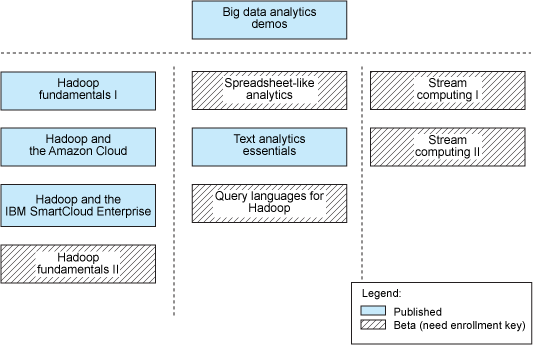
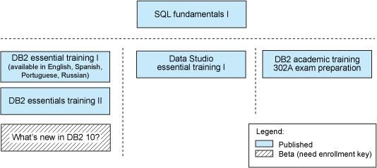
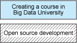

# 开始参加大数据培训
包含您可在云上运行的动手实验的免费课程！

**标签:** 数据科学

[原文链接](https://developer.ibm.com/zh/articles/dm-1205bigdatauniversity/)

[Raul Chong](https://developer.ibm.com/zh/profiles/rfchong)

发布: 2012-07-30

* * *

## 简介

毋庸置疑，大数据和云计算是如今两个最热门的 IT 主题。这些领域对熟练人才的需求和所提供的薪资正在迅速增长。幸运的是，两个领域具有一定的相关性，所以您可以开始参加大数据培训，同时在此过程中体验和学习云计算概念。尽管可以花一些时间研究 Internet 上的这些主题，但有一种更好且更轻松的方式：浏览 Big Data University 中的免费课程。

[BigDataUniversity.com](http://bigdatauniversity.com/) 是一个在线培训的 Web 站点，提供了有关大数据和数据库的免费课程。该站点由社区运行，社区中有大量 IBM 人员自愿为课程的开发和站点的完善做出自己的贡献。向行业精英学习 @yourpace、@yourplace 是他们的座右铭。Big Data University 的一个吸引人的地方是，大部分课程都包含您可以在云上执行的动手实验。例如，Big Data University 的其中一门课程由 Amazon Web Services 赞助，后者提供了一个 25 美元的积分来在其云上学习大数据。Big Data University 中的每门课程都有一个简短测试，如果您通过了测试，就可以自行打印一份结业证书。

本文列出了 [Big Data University](http://bigdatauniversity.com/) 中目前推出的课程和即将发布的课程。尽管所有课程都没有前提条件，但为您提供了一条按顺序学习它们的建议路径。

## 建议的学习路径

Big Data University 课程划分为 3 个类别：

- 大数据相关主题
- 数据库 (DB2) 相关主题
- 其他主题

### 面向大数据相关主题的课程

图 1 显示了大数据类别中的课程列表，以及我们依据您当前的大数据概念知识，推荐您学习它们的建议顺序（从上到下，从左到右）。

##### Big Data University 课程 – 大数据类别

上图顶部的 “大数据分析演示” 课程概述了大数据的概念、它至关重要的原因和它的特征。它还介绍了静态数据分析（以海洋作为类比：有大量的数据，但没有真正流动）和动态数据分析（以河流或小溪作为类比：数据流在不断流动，必须实时分析它们）的概念。

图 1 左侧的课程（”Hadoop 基础 I”、”Hadoop 与 Amazon Cloud”、”Hadoop 与 IBM SmartCloud Enterprise” 以及 beta 版的 “Hadoop 基础 II”）主要针对静态数据分析。它们指导您如何使用 Hadoop，这是一个开源的 Java 框架，可帮助您快速处理大量数据。请注意，这些课程拥有可在 Amazon Cloud 或 IBM SmartCloud Enterprise 上运行的实验。我们建议按所列出的顺序从上到下学习本节中的课程。

在图 1 的中间，列出了 3 门课程：

- “类似电子表格的分析”（beta 版）允许非技术用户利用大数据技术，而无需学习如何编写程序来运行 Hadoop、JAQL 等。它使用 BigSheets，这个插件可在 Hadoop 上运行，适用于熟悉 MS Excel 等电子表格工具的业务用户。
- “文本分析精要 I” 向您介绍在非结构化数据上执行分析的基础知识，非结构化数据包括电子邮件的内容或任何其他文档等。它使用标注查询语言 (Annotation Query Language, AQL) 指定如何过滤信息。可使用一个文本分析 Eclipse 插件来开发 AQL，可在以后将该 AQL 部署在 Hadoop 之上来处理大数据。
- “用于 Hadoop 的查询语言”（beta 版）向您介绍如何使用查询和脚本编写语言，比如 Hive、Pig 和 JAQL。这些脚本编写语言为没有 Java 专业知识的开发人员简化了 Hadoop 中的 Map-Reduce 程序的开发。

在图 1 的右侧，您可以看到即将发布的动态数据分析课程列表（”流计算 I” 和 “流计算 II”，都属于 beta 版本）。举例而言，它们将探讨如何实时分析正在流动的 tweet 或 Facebook 注释。它们还将探讨如何执行日志分析、复杂事件处理等。

### 面向数据库相关主题的课程

图 2 显示了数据库 (DB2) 类别中的课程列表，以及我们依据您当前的数据库概念知识，推荐您学习它们的建议顺序（从上到下、从左到右）。

##### Big Data University 课程 — 数据库 (DB2) 类别

图 2 顶部的 “SQL 基础 I” 课程是一种介绍性课程，它不仅介绍 SQL，还介绍了有关关系数据库管理系统和其他系统的基本概念。学习此课程并阅读图书 [数据库基础](https://www.ibm.com/developerworks/wikis/display/db2oncampus/FREE+ebook+-+Database+fundamentals) ，了解最佳的学习经验。

图 2 左侧的课程为您提供了核心 DB2 概念的牢固基础。学习 “DB2 精要培训 I” 和 “DB2 精要培训 II” 课程并阅读图书 [DB2 Express-C 入门](https://www.ibm.com/developerworks/wikis/display/DB2/FREE+Book-+Getting+Started+with+DB2+Express-C) ，了解最佳的结果。

即将发布的 “DB2 10 中的新功能” 课程解释了最新版的 DB2 for Linux, UNIX, and Windows 版本中提供的新功能。它将包含展示时间旅行查询、多温度存储、Oracle 兼容性等功能的视频。

在图 2 的中间列出了一门课程：”Data Studio 精要培训 I”。在编写本文时，此课程正在更新到 Data Studio 的最新版本；但是，您可以检查该课程中的视频来熟悉 Data Studio，即使这些视频是为以前的产品版本创建的。

最后，在图 2 的右侧，列出了课程 “DB2 学术培训 – 302A 考试准备教程”。此课程帮助您准备参加 [IBM Exam 302A](http://www.ibm.com/developerworks/data/events/db2academiccertification/index.html) ，是为学术社区开发的。它包含 13 堂课和一个样例测试，该测试将很好地表明您在真实考试中的表现。

### 面向其他主题的课程

图 3 显示了其他类别中的课程列表。

##### Big Data University 课程 – 其他类别

“在 Big Data University 中创建一门课程” 课程为对开发一个发布到 Big Data University 中的课程感兴趣的任何人提供所有必要的说明。我们鼓励您查阅此课程，了解如何轻松地创建您自己的课程。尽管到目前为止 Big Data University 中的所有课程都是免费的，如果您喜欢开发一门需要收费的课程，Big Data University 拥有支持此行为的能力。

最后，”开源开发” 课程（beta 版本）包含一组需要实现来支持 Big Data University 功能的开源任务。乐意使用 PHP 来帮助开发这些功能的社区成员随时可以联系我们，我们可提供访问此课程的权限，帮助您了解需要完成的项目或任务。

## 结束语

本文探讨了 Big Data University 中提供的不同课程，您可使用这些课程提高您的 Big Data 技术以及数据库技术的技能。文中给出的图提供了您应该采取的建议路径或顺序。Big Data University 中的所有课程目前都是免费的，具有动手实验练习，允许您在通过测试后自行打印一个结业证书。

Big Data University 是一个由 IBM 赞助的社区站点。我们诚挚邀请社区成员开发新课程，”在 Big Data University 中创建课程” 课程拥有入门所需的所有说明。

本文翻译自： [Starting your education in big data](https://developer.ibm.com/articles/dm-1205bigdatauniversity/)（2012-07-30）