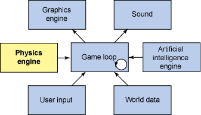
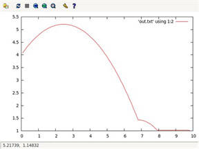

# 开源的物理引擎
用开源构建可信世界

**标签:** 游戏

[原文链接](https://developer.ibm.com/zh/articles/os-physicsengines/)

M. Jones

发布: 2011-09-07

* * *

_物理引擎_ 是一种仿真程序，可用来创建一种虚拟环境，在其中集成来自物理世界的规律。在这个虚拟的环境中包括的物体，除了物体之间的相互作用（比如碰撞）外，还包括施加到它们身上的力（比如重力）。物理引擎可在仿真环境内模拟牛顿物理学并处理这些力和相互作用。

物理引擎最为人称道的应用之一就是在娱乐和游戏行业（参见 [图 1](#图-1-游戏应用中的物理引擎) ），其中物理引擎提供了游戏环境的实时仿真（包括玩家和可能出现的其他物体）。在应用于游戏领域之前，物理引擎在科学领域早已有诸多应用，从天体的大型仿真到气候仿真，再到可视化纳米粒子的行为及其相关作用力的小型仿真。

图 1\. 游戏应用中的物理引擎 {: #图-1-游戏应用中的物理引擎}



这些应用之间的一个关键差别是：以游戏为中心的物理引擎侧重于实时近似，而科学仿真中的物理引擎则更多地侧重于精确计算以获得高准确性。科学物理引擎依赖于超级计算机的原始处理能力，而游戏物理引擎则可运行于更为资源受限的平台（比如手持型游戏设备和移动手机）。游戏物理引擎通过避免诸如布朗运动这样的东西来缩减仿真，进而最小化仿真的处理复杂性。这些引擎内所涉及到的数学和物理概念超出了本文的讨论范围之外，相关信息的链接可以在 参考资料 中找到。

目前已经有很多种游戏物理引擎，取决于各自的需求，但是它们全部都是相同主题的衍生。在游戏中，您可以找到 _ragdoll physics_ （仿真一个复杂铰接系统的行为）和 _粒子系统_ （模拟了很多大大小小的粒子在对诸如爆炸等事件做出响应时的行为）。一个最早的软件物理引擎是 ENIAC 计算机，用来仿真给定了重量、角度、推力和风速变量的炮弹。Wikipedia 上对这个应用有一个有趣介绍，参考 参考资料 获得链接。

## 开源选项

物理引擎（尤其是实时和低精度的）的一个重要应用是游戏运行时的开发。根据这些软件框架的流行性，有很多开源选项可供选择。本文着重探讨其中的一些开源物理引擎并展示它们的简单应用。

### Box2D

Box2D 是一个简单却用途广泛的物理引擎。它最初由 Erin Catto 为了在 2006 年召开的 Game Developers Conference 上做物理学演示而设计。Box2D 起初被称为 _Box2D Lite_ ，但这个引擎现已被扩展，除了包括连续碰撞检测外，还增强了 API。 Box2D 是用 `C++` 写的，其可移植性从它可用于的平台（Adobe® Flash® 、 Apple iPhone 和 iPad、Nintendo DS 和 Wii 以及 Google Android）可见一斑。Box2D 为许多流行掌上游戏，包括 _愤怒的小鸟_ 和 _蜡笔物理学_ ，提供了物理机制。

Box2D 提供了支持像圆形或多边形这样的几何形状的刚体仿真。Box2D 可用接头连接不同的形状，甚至可以包括关节马达和滑轮。在 Box2D 内，此引擎在处理碰撞检测和所产生的力学的同时可施加重力和摩擦力。

Box2D 可被定义为一个能提供多种服务的富 API。有了这些服务就得以定义一个由很多物体和属性组成的世界。定义了对象和属性后，接下来就可以以离散时间步长仿真该世界了。这个示例应用程序（基于 Erin Catto 的示例应用程序）研究的是一个立方体投掷到有重力的世界。

### Box2D 示例

[清单 1](#清单-1-使用-box2d-的简单应用程序（改编自-erin-catto-的-helloworld）) 展示了创建一个由立方体（具有向上动力）和地平面占据的简单世界的过程。使用 gravity 和 world 函数定义此世界和此世界的一个重力矢量。此世界的 `true` 参数表明它是一个休眠物体，因此不需要仿真。

定义了此世界后，就可以指定该世界内的地面体及其位置了。地面是一个静止的立方体，这是 Box2D 已知的， 因为这个立方体的质量为零（默认），因此不会与其他物体相撞。

接下来，创建动态物体，它具有方位、初始线速度和角度。设置的过程与地面物体的创建相似，只不过需要为动态物体定义额外的一些属性。这些属性包括物体的密度和摩擦力。通过 `CreateFixture` 就可以将新的动态物体添加到此世界。

此世界和其中的物体均定义完毕后，接下来就可以进行仿真了。首先，定义仿真的时间步长（在本例中是为 60Hz）。此外，还可以定义需要运行的迭代次数，它决定了速度和方位计算的迭代次数（因为为一个求解会修改其他元素）。迭代越多，获得的精确度越高，计算所花的时间越多。

最后，运行这个仿真，其中会涉及到通过为此世界调用 `Step` 方法来执行仿真中的一个步长。一旦此调用针对当前时间步长返回，就可以清空上一步长施加到这些物体上的力，然后获得动态物体的当前方位和角度。这些返回的变量可发至标准输出（stdout）以便查阅。继续仿真直至动态物体静止（即休眠）为止。

##### 清单 1\. 使用 Box2D 的简单应用程序（改编自 Erin Catto 的 HelloWorld）

```
#include <Box2D/Box2D.h>

#include <cstdio>

int main()
{
    // Define the gravity vector.
    b2Vec2 gravity(0.0f, -10.0f);

    // Construct a world object, which will hold and simulate the rigid bodies.
    // Allow bodies to sleep.
    b2World world(gravity, true);

    // Define the ground body.
    b2BodyDef groundBodyDef;
    groundBodyDef.position.Set(0.0f, -10.0f);
    b2Body* groundBody = world.CreateBody(&groundBodyDef);

    // Define the ground box shape.
    b2PolygonShape groundBox;
    groundBox.SetAsBox(50.0f, 10.0f);

    // Add the ground fixture to the ground body.
    groundBody->CreateFixture(&groundBox, 0.0f);

    // Define the dynamic body. Set its position and call the body factory.
    b2BodyDef bodyDef;
    bodyDef.type = b2_dynamicBody;
    bodyDef.position.Set(0.0f, 4.0f);
    bodyDef.linearVelocity.Set(5.0f, 5.0f);
    bodyDef.angle = 0.25f * b2_pi;

    b2Body* body = world.CreateBody(&bodyDef);

    // Define another box shape for your dynamic body.
    b2PolygonShape dynamicBox;
    dynamicBox.SetAsBox(1.0f, 1.0f);

    // Define the dynamic body fixture.
    b2FixtureDef fixtureDef;
    fixtureDef.shape = &dynamicBox;
    fixtureDef.density = 1.0f;
    fixtureDef.friction = 0.3f;

    // Add the shape to the body.
    body->CreateFixture(&fixtureDef);

    float32 timeStep = 1.0f / 60.0f;
    int32 velocityIterations = 6;
    int32 positionIterations = 2;

    do {
        world.Step(timeStep, velocityIterations, positionIterations);

        world.ClearForces();

        b2Vec2 position = body->GetPosition();
        float32 angle = body->GetAngle();

        printf("%4.2f %4.2f %4.2f\n", position.x, position.y, angle);

    } while (body->IsAwake());

    return 0;
}

```

Show moreShow more icon

Box2D 注定是不关心呈现程序（图形可视化）的。这个立方体（来自 [清单 1](#清单-1-使用-box2d-的简单应用程序（改编自-erin-catto-的-helloworld）) ）方位的一个简单呈现如 [图 2](#图-2-清单-1-的立方体方位的简单呈现) 所示。请注意立方体方位在重力将其拉向地面以及它静止下来和碰撞时的行为。

图 2\. 清单 1 的立方体方位的简单呈现 {: #图-2-清单-1-的立方体方位的简单呈现}



### Bullet

Bullet 是一个 3D 的开源物理引擎，支持 3D 的刚体和软体力学以及碰撞检测。Bullet 由 Erwin Coumans 在 Sony Computer Entertainment 工作时开发。这个引擎在多数平台上都受支持，比如 Sony Playstation 3、Xbox 360® 、iPhone 和 Wii。它包括了对 Windows® 、Linux® 和 Mac OS 操作系统的支持，也包括了针对 Playstation 3 内的 Cell Synergistic Processing Unit 以及 PC 上的 OpenCL 框架的许多优化。

Bullet 是一个产品物理引擎，在游戏和电影领域都有广泛的应用。使用了 Bullet 的游戏包括 Rockstar 的 _红色死亡救赎_ 和 Sony 的 _自由国度_ （MMORPG）。 Bullet 还在很多商业影片中的特效发挥了作用，包括电影 《天龙特工队》（Weta Digital）和《怪物史瑞克 4》（DreamWorks）。

Bullet 包括了具有离散和连续碰撞检测的刚体仿真，同时也支持软体（比如衣服或其他可变形物体）。作为一个产品引擎，Bullet 包括了一个富 API 和 SDK。

### Bullet 示例

[清单 2](#清单-2-使用-bullet-进行的简单球体落下仿真) 中所示的 Bullet 示例来自 Bullet 发布版的 “Hello World” 程序。它实现了与 Box2D 示例中所展示的相类似的一个仿真（只不过在本例中，将原来的下落物体由立方体换成了一个球体）。正如您所预见的，由于此 API 丰富性和多样性的增加，这种实现要比之前的示例复杂些。

这个示例应用分成三个部分：设置、仿真和清理。设置阶段会创建仿真阶段所要处理的世界。而清理阶段则只是负责释放此世界内的各种物体。

为了创建这个世界，需要定义一个 broad-phase 算法（一种用来识别不应碰撞物体的优化）、一个碰撞配置和一个约束解算器（并入了重力和其他力以及碰撞，且定义了物体之间如何相互作用）。此外，通过调用 `setGravity` 来将重力定义为 y 轴。定义了这些元素后，就可以创建这个世界了。设置阶段的下两个部分是定义静态的地面和动态的球体。

仿真的执行是通过调用方法 `stepSimulation` 实现的。这个方法定义了一个 60Hz 的间隔并仿真了在重力影响下落向地面的球体背后的物理学。每个仿真步长过后，球体的高度（ `y` 参数）就会发出。仿真的循环执行是为了球体与地面相撞然后最终静止的整个过程。

最后一个阶段是简单的清理，即将对象和其他元素从内存释放。

如上所示，虽然仿真需要大量的设置，但是您定义了仿真的环境之后，物理引擎就会在幕后为您完成全部的繁重工作。Bullet 还包括一个宽泛的 API，允许环境及其行为的调优以及对仿真内发生的事件（比如碰撞和重叠）的回调。

##### 清单 2\. 使用 Bullet 进行的简单球体落下仿真

```
#include <iostream>

#include <btBulletDynamicsCommon.h>

int main (void)
{

// Setup

btBroadphaseInterface* broadphase = new btDbvtBroadphase();

btDefaultCollisionConfiguration* collisionConfiguration =
                    new btDefaultCollisionConfiguration();
btCollisionDispatcher* dispatcher = new btCollisionDispatcher(collisionConfiguration);

btSequentialImpulseConstraintSolver* solver = new btSequentialImpulseConstraintSolver;

btDiscreteDynamicsWorld* dynamicsWorld = new btDiscreteDynamicsWorld(
                dispatcher,broadphase,solver,collisionConfiguration);

dynamicsWorld->setGravity(btVector3(0,-10,0));

btCollisionShape* groundShape = new btStaticPlaneShape(btVector3(0,1,0),1);

btCollisionShape* fallShape = new btSphereShape(1);

btDefaultMotionState* groundMotionState = new
    btDefaultMotionState(btTransform(btQuaternion(0,0,0,1),btVector3(0,-1,0)));
btRigidBody::btRigidBodyConstructionInfo
                groundRigidBodyCI(0,groundMotionState,groundShape,btVector3(0,0,0));
btRigidBody* groundRigidBody = new btRigidBody(groundRigidBodyCI);
dynamicsWorld->addRigidBody(groundRigidBody);

btDefaultMotionState* fallMotionState =
       new btDefaultMotionState(btTransform(btQuaternion(0,0,0,1),btVector3(0,50,0)));
btScalar mass = 1;
btVector3 fallInertia(0,0,0);
fallShape->calculateLocalInertia(mass,fallInertia);
btRigidBody::btRigidBodyConstructionInfo
        fallRigidBodyCI(mass,fallMotionState,fallShape,fallInertia);
btRigidBody* fallRigidBody = new btRigidBody(fallRigidBodyCI);
dynamicsWorld->addRigidBody(fallRigidBody);

// Simulation

for (int i=0 ; i<300 ; i++) {
    dynamicsWorld->stepSimulation(1/60.f,10);

    btTransform trans;
    fallRigidBody->getMotionState()->getWorldTransform(trans);

    std::cout << "sphere height: " << trans.getOrigin().getY() << std::endl;
}

// Cleanup

dynamicsWorld->removeRigidBody(fallRigidBody);
delete fallRigidBody->getMotionState();
delete fallRigidBody;

dynamicsWorld->removeRigidBody(groundRigidBody);
delete groundRigidBody->getMotionState();
delete groundRigidBody;

delete fallShape;

delete groundShape;

delete dynamicsWorld;
delete solver;
delete collisionConfiguration;
delete dispatcher;
delete broadphase;

return 0;
}

```

Show moreShow more icon

## 开源物理引擎列表

Box2D 和 Bullet 是广泛使用的物理引擎的两个例子。除此之外还有很多侧重于物理仿真不同方面（性能或准确性）的其他的物理引擎，使用的许可也不尽相同。Box2D 和 Bullet 均使用的是 Zlib 许可（支持二者在商业应用中的使用）。 [表 1](#表-1-开源物理引擎) 列举了某些最常用的开源物理引擎及其所使用的许可。此外，虽然大多数引擎支持 `C++` 或 `C` ，但很多引擎还支持对其他语言的绑定，比如 Ruby 或 Python。

##### 表 1\. 开源物理引擎

引擎类型许可Box2D2DZlibBullet3DZlibChipmunk2DMassachusetts Institute of Technology (MIT)Chrono::Engine3DGPLv3DynaMo3DGPLMoby (Physsim)3DGPLv2Newton Game Dynamics3DZlibOpen Dynamics Engine3DBSDOpen Physics Abstraction LayerN/ABSD/LGPLOpenTissue3DZlibPhysics Abstraction Layer (PAL)N/ABSDTokamak3DBSD/Zlib

Chipmunk 是由 Scott Lembcke 在 Box2D 的基础上开发的，它包括了 2D 物理学的几个特性，比如对 `C` 的直接支持，它还包括了一个 Objective-Chipmunk 来支持 iPhone 绑定。其他的绑定包括 Ruby、Python 和 Haskell。

Tokamak 是一个 3D 物理引擎 SDK，由 David Lam 用 `C++` 编写。它包含了很多的优化，可最小化内存带宽，因而更适合于小型的便携设备。Tokamak 的一个有趣特性是它支持模型破坏，即复合物体可在撞击时破裂，然后再在仿真内创建多个物体。

虽然被列于物理引擎之下，但抽象层提供了一个不容忽视的有趣功能。PAL 提供了一个应用中的多个物理引擎的统一接口，这就使得开发人员无需移植就可以为特定的应用使用正确的物理引擎。PAL 的插件架构支持几个先进的开源物理引擎，比如 Box2D、Bullet、Newton Game Dynamics、OpenTissue、Tokamak 等等。它还支持一些商业的物理引擎，比如在游戏开发领域很流行的 Havok。PAL 的缺点是由于它偏重于通用抽象，因此会限制某个物理引擎所提供的功能。

## 硬件加速

物理领域的硬件加速在过去几年来一直在跟随图形处理单元的潮流不断发展。 _GPU_ 是一种硬件协处理器，可加速计算机图形应用程序的计算。如今，GPU 已经发展成了通用计算图形处理单元（GPGPU），从而可用于更多通用的加速任务。物理处理单元（PPU）向加速物理引擎计算的发展方向有可能会因可用性更好的 GPGPU 的使用而受到影响。ATI 的 Stream 技术和 NVIDIA 的 Common Unified Device Architecture (CUDA) 架构都是 GPGPU 的例子。

## 结束语

物理引擎将您从开发复杂软件以便在软件中实现物理现象和碰撞检测的工作中解放出来。相反，您现在可以将您的时间更多地投入到您的特定应用程序（游戏或仿真）中去。虽然理解这些引擎背后的理论会很有帮助，但不是必须要使用它们。 参考资料 部分包含了对很多开源物理引擎的链接，这些引擎可很容易地在 Linux 和 Windows 系统上使用。每个引擎都包含了说明性的示例演示，可帮助您理解其 API 和所涉及到的概念，更方便您将物理学引入到您的应用程序中。