# 强化学习
使用强化学习来实现一个机器人

**标签:** Java,人工智能

[原文链接](https://developer.ibm.com/zh/articles/j-lo-robocode2/)

Robo cool

发布: 2006-07-13

* * *

Robocode 是 IBM 开发的 Java 战斗机器人平台，游戏者可以在平台上设计一个 Java 坦克。每个坦克有个从战场上收集信息的感应器，并且它们还有一个执行动作的传动器。其规则和原理类似于现实中的坦克战斗。其融合了机器学习、物理、数学等知识，是研究人工智能的很好工具。

在 Robocode 坦克程序中，很多爱好者喜欢设计一些策略与移动模式，让自己的坦克机器人能更好的赢得战斗。但是由于 Robocode 环境时刻在变化，手写的代码只能对已知的环境做一些预测，机器人不能根据环境的变化而自我学习和改善。本文中，将用强化学习实现一个机器人。使用强化学习能创建一个自适应的战斗机器人。这个机器人能在战斗中根据环境取得最好的策略，并尽力使战斗行为最佳。并在此过程中不断学习以完善自身不足。

## 强化学习

强化学习(reinforcement learning)是人工智能中策略学习的一种， 是一种重要的机器学习方法，又称再励学习、评价学习. 是从动物学习、参数扰动自适应控制等理论发展而来.

强化学习一词来自于行为心理学，这一理论把行为学习看成是反复试验的过程，从而把动态环境状态映射成相应的动作。它通过不断尝试错误，从环境中得到奖惩的方法来自主学习到不同状态下哪些动作具有最大的价值，从而发现或逼近能够得到最大奖励的策略。它类似于传统经验中的”吃一堑长一智”。

### 原理与模型

考虑建造一个可学习的机器人，该机器人(或 agent)有一些传感器可以观察其环境的状态(state)并能做出一组动作(action)来适应这些状态。比如：一个移动的机器人有摄像头等传感器来感知状态，并可以做”前进”，”后退”等动作。学习的任务是获得一个控制策略(policy)，以选择能达到的目的的行为。

强化学习基本原理也是基于上面的思想： 如果 Agent 的某个行为策略导致环境正的奖赏(强化信号)，那么 Agent 以后产生这个行为策略的趋势便会加强。Agent 的目标可被定义为一个奖赏或回报函数(reward)，它对 Agent 从不同状态中选取的不同动作赋予一个数字值，即立即支付(immediate payoff)。比如机器人寻找箱子中的回报函数：对能找到的状态-动作赋予正回报，对其他状态动作赋予零或负回报。机器人的任务执行一系列动作，观察结果，再学习控制策略，我们希望的控制策略是在任何初始离散状态中选择动作，使 Agent 随时间累积中发现最优策略以使期望的折扣奖赏(回报)和最大。

如图描述：Agent 选择一个动作(action)用于环境，环境(Enviironment)接受该动作后状态(state)发生变化，同时产生一个强化信号(奖赏 reward)反馈给 Agent，Agent 根据强化信号和环境当前状态再选择下一个动作，选择的原则是使受到正强化(奖)的概率增大。

##### 强化学习的基本模型

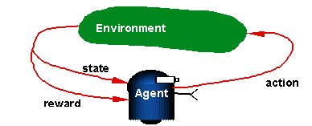

### Q 学习(Q-learning)

增强学习要解决的问题：一个能够感知环境的自治 Agent，怎样通过学习选择达到其目标的最优动作。这样一个 Agent 在任意的环境中如何学到最优策略是我们要重点考虑的对象，下面介绍的称为 Q 学习的算法，就是其中比较好的一种强化学习算法，它可从有延迟的回报中获取最优控制策略。

Q 学习是强化学习的一种形式，机器人在任意的环境中直接学习最优策略很难，因为训练数据中没有提供<s,a>形式的训练样例。而通过学习一个定义在状态和动作上的数值评估函数，然后以此评估函数的形式实现最优策略将会使过程变得容易。

我们在 Q 学习中把 Q 表示在状态 s 进行 t 动作的预期值；s 是状态向量；a 是动作向量；r 是获得的立即回报；

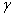为折算因子。则估计函数 Q(s,a) 被定义为：它的值是从状态 s 开始并使用 a 作为第一个动作时可获得的最大期望折算积累回报。也就是说 Q 值是从状态 s 执行动作 a 的立即回报加上遵循最稳定最优策略的值(用 折算)。公式如下：

Q(s,a)=r(s,a)+


maxQ(s’+a’)

我们用过程来表述 Q 学习算法如下：

1.对每个 s,a 初始化表项 Q(s,a)

2.观察当前状态 s，一直重复做：

a.选择一个动作 a 并执行它

b.接收到立即回报 r

c.观察新状态 s’

d.对 Q(s,a) 按照下式更新表项 Q(s,a)<-r(s,a)+

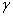maxQ(s’+a’)

e.s<—— s’

其中

(

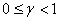)是折算因子，为一常量。

为了说明这些概念，我们用一些简单的格状确定世界来模拟环境。在这个环境下所有的动作转换除了导向状态 G 外，都被定义为 0，agent 一进入状态 G，可选动作只能处在该状态中。图中方格表示 agent 的 6 种可能状态或位置，每个箭头代表每个不同的动作。如果 agent 执行相应状态动作可收到立即回报 r(s,a)，V?(s)为最优策略的值函数，即从最初状态 s 到获得的折算积累回报。此处立即回报函数把进入目标状态 G 的回报赋予 100，其他为 0，V?(s)和 Q(s,a)值来源于 r(s,a),以及折算因子

=0.9.

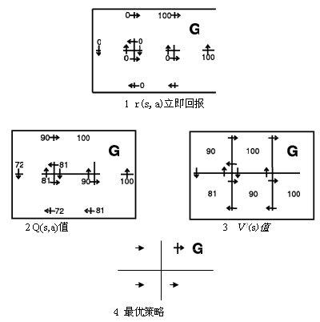

定义了状态、动作、立即回报和折算率，我们根据计算就能得出最优策略图 4 和它的值函数 V?(s).该策略把 agent 以最短路径导向状态 G。图 3 显示了每个状态的 V?值，例如，图 3 中下方的状态中最优策略使 agent 向右移动，得到为 0 的立即回报，然后向上，生成 100 的立即回报，，此状态的折算回报计算为：

0+

100+

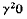+

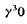+…=90，即中上方的 V?值为 90

Q 学习的优点是即使在学习不具有其动作怎样影响环境的先验知识情况下，此算法仍可应用.

### 强化学习的应用

强化学习主要应用在三个方面：在机器人中的应用， 强化学习最适合、也是应用最多的。 Wnfriedllg 采用强化学习来使六足昆虫机器人学会六条腿的协调动作。Sebastian Thurn 采用神经网络结合强化学习方式使机器人通过学习能够到达室内环境中的目标;在游戏比赛中的应用，在这方面，最早的应用例子是 Samuel 的下棋程序; 在控制系统中的应用，强化学习在控制中的应用的典型实例，就是倒摆控制系统. 当倒摆保持平衡时，得到奖励，倒摆失败时，得到惩罚，控制器通过自身的学习，最终得到最优的控制动作。

## Robocode 概述

从上面的强化学习原理中我们知道，要实现强化学习我们必须知道状态、动作以及处理这些状态和动作的 Q 函数，在对状态和动作的反复实验当中，我们还要给出动作的奖赏、设定学习率、折算率等参数。最后我们还要利用 Q 学习算法把上面提到的参数组合进行最优化，最终得到自己想要的值。下面我们就从 robocode 来分析上面提到的参数和强化学习的实现过程。

## States 状态描述

Robocode 是根据战斗环境模拟而来，所以在此环境中存在很多种状态，不同的状态对机器人会产生不同的影响。这些状态我们都可通过 Robocode 的函数调用得到，如下表列出了 Robocode 中能得到的部分状态值。

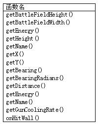

如此多的状态如果全部放到强化学习中，会耗费强化学习很多时间。而且像 getBattleFieldHeight()、getBattleFieldWidth()得到场地高和宽，getGunCoolingRate()炮管冷却率，这些状态值与学习无关联，而有些状态是与不同的动作相结合的，如果使用不当，甚至会达不到应有的效果。所以如何确定和选择状态是很关键的问题。根据战斗经验与测试数据，我们把 Robocode 机器人的状态分为五个属性，并以类 state 来封装所有的这五个属性。最后我们还给出了在我们的强化学习中没有应用到但同样重要的一些状态，大家有兴趣可补充进自己的强化学习算法当中。

### 状态离散化

强化学习应用到 Robocode 遇到的最大挑战是：强化学习适合离散空间求解，而 Robocode 的环境却是连续的。如上表中 Robocode 的状态中，机器人的方向角（二维矢量），两个机器人的相对角（二维矢量）， 两个机器人的距离（二维矢量），场地坐标，机器人的 x,y 坐标等等，输出是一组动作序列，这些都是连续量，若对所有变量进行离散化必然带来维数灾难。所以，我们必须离散化输入状态。以适合强化学习算法的应用。注意 Robocode 中的角度、距离等状态都有一些特点：角度是分四个方位，而且是 0 到 360 度之间的四个区间值，而两两机器人之间的安全距离一般是维持在 30 象素左右。根据 Robocode 这些特点和强化学习原理，我们分别以 4，30 等区间值来转换状态值为离散点。

1.机器人的绝对方向(Heading)

知已知彼，百战不怠，在开始战斗前知道敌人和自己的方向很重要。在 Robocode 中要想得到敌人的方向，我们首先要知道 Robocode 的坐标系统。Robocode 坐标系统是一个标准的笛卡尔坐标，战场地图的左下角坐标为（0，0），右下角为（地图宽，0），左上角为（0，地图高），右上角为（地图宽，地图高），如下图所示：

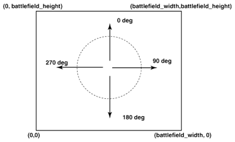

从图上我们知道了如果机器人处于场地中央则面向场地水平向上为 0 度方向，按顺时针转动，水平向右为 90 度方向，水平向左为 270 度方向，水平向下为 360 度方向。也就是说 0 <= heading < 360。此角度值是一个绝对值。在 Robocode 中我们通过调用 getHeight()函数能得到想要的机器人当前方向。机器人处于场地什么位置，就可对照下图得到其对应的角度。

为了保存角度到 Q 表中，我们把得到的连续值转换为离散的值。按照角的大小和方位我们把 heading 分成范围为 0-3 的四份，如下图：

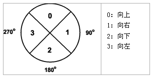

在代码我们直接用 360 除以 4 得到不同的离散方向值。

```
public static final int NumHeading = 4;
...
double angle = 360 / NumHeading;

```

Show moreShow more icon

然后直接通过下面的表达式求得新的方向角

```
double newHeading = heading + angle / 2;
    return (int)(newHeading / angle);

```

Show moreShow more icon

2.机器人的相对角(Bearing)

上面我们知道了机器人的绝对度，但是战斗都是存在于两个机器人之间，所以这里我们要了解 Robocode 的第二个状态值相对角，顾名思义，它就是某一机器人相对另一机器人的角度，是针对两个机器人而言的。如下图所示：

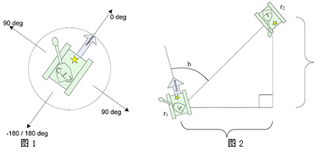
图 1 显示了机器人相对于自己的 bearing 角度。而图 2 显示了机器人 r2 相对于 r1 的 b = 60 度。由此可知，-180 < bearing <= 180。如图相对度在机器人左边为正，右边为负。在 Robocode 中我们可以通过函数 getBearing()得到相对角。相对角是个很有用的函数，通过确定敌人相对度，我们能得到最佳的移动位置。

和上面同样的道理我们把 bearing 分成 0-3 的四份，在代码我们直接用 PI 值除以 4 得到不同的离散相对角值

```
public static final int NumTargetBearing = 4;
...
double angle = PIx2 / NumTargetBearing;

```

Show moreShow more icon

然后直接通过下面的表达式求得新的相对角

```
double newBearing = bearing + angle / 2;
return (int)(newBearing / angle);

```

Show moreShow more icon

3.目标距离(distance)

distance 即两个机器人之间长度，即自己机器人中心点到敌人机器人中心点连线长。距离是以像素(Pixels)点为单位，如何确定其离散值的大小以方便保存到 Q 表中有一定的难度。在此我们根据机器人本身的大小(30 为安全距离)以及场地大小设置，我们把距离分为 0-19 的 20 个离散值。每个离散值分为 30 的倍数，如下表：

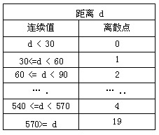

在代码我们直接用距离值除以 30 得到不同的离散值

```
public static final int NumTargetDistance = 20;
...
int distance = (int)(value / 30.0);

```

Show moreShow more icon

然后直接通过下面的表达式求得新的距离

```
if (distance > NumTargetDistance - 1)
      distance = NumTargetDistance - 1;
    return distance;

```

Show moreShow more icon

4.Hit Wall （撞墙）

当机器人撞击墙时，能量会发生改变，这时”Hit wall”事件会触发，我们就此状态定义为”Hit wall”，而机器人根据这个事件能做相应的动作。撞墙状态比较简单，只有撞也没有撞，所以我们在此用两个离散值来表示这一状态，0 表示没有撞墙，状态没有发生。1 表示撞墙状态发生。通过 Robocode 的 ohHitWall 事件我们能得到这个状态。

5.Hit by Bullet （子弹相撞）

当机器人被子弹击中时，能量会发生改变，这时”Hit by Bullet”事件会触发，我们就此状态定义为”Hit by Bullet”，而机器人根据这个事件也能做出相应的动作。同样的我们在此用两个离散值来表示这一状态，0 表示没有撞墙，状态没有发生。1 表示撞墙状态发生。通过 onHitByBullet()事件我们能得到这个状态。

因为 Hit wall 和 Hit by bullet 本身都是 Robocode 的事件函数，所以在直接把离散值写入 Robocode 本身的事件当中。

根据上面五个状态的组合，我们可得到共 1280 (4 x 20 x 4 x 2 x 2) 可能存在的状态。在 robocode 中还有其他一些状态：比如两个机器人相撞的 HitRobotEvent 事件状态，团队中的消息接收 MessageEvent 事件状态，还有机器人的 x,y 坐标状态，机器人在战地中间的坐标和战地边缘的坐标都会对状态产生影响。如果有兴趣大家可以试一试别的状态处理。

## 动作集（Action）

Robocode 的动作相对是比较复杂的，而且涉及到炮管、雷达和机器人本身的移动。为了简化操作，在此处我们只定义了机器人自身的移动动作集：移动和转动。在 Robocode 中最基本的移动就是前进和后退，转动就是向左或向右。同状态一样，我们把 Action 中的值进化离散化以保存到 Q 表中。如下代码：

```
public static final int RobotAhead = 0;
public static final int RobotBack = 1;
public static final int RobotAheadTurnLeft = 2;
public static final int RobotAheadTurnRight= 3;
public static final int RobotBackTurnLeft = 4;
public static final int RobotBackTurnRight= 5;

```

Show moreShow more icon

### 动作选择

我们知道了状态、动作，就要面临如何根据状态来选择机器人的动作。选择的动作不仅影响立即强化值，而且影响环境下一时刻的状态及最终的强化值。所以好的选择方法很重要。在强化学习中通常使用概率来选择动作，对于状态 S，做不同 Q 值的动作时赋予不同的概率，高值得到高概率，低值得到低概率，所有动作的概率都非 0。如下方法：

```
P (a | s) = e^Q(s, a) / sum (e^Q(s, ai))

```

Show moreShow more icon

其中 P (a \| s)为机器人在状态 s 时选择的动作 a 的概率，e 为一常量大于 0。在代码中我们通过 getQValue 得到当前 Q(s,a)值，并利用上面的公式在所有的 Q 值中选择出最优的动作。如下代码，其中 ExploitationRate 设定为 1.

```
for (int i = 0; i < value.length; i++)
    {
      qValue = table.getQValue(state, i);
      value[i] = Math.exp(ExploitationRate * qValue);
      sum += value[i];
    }

```

Show moreShow more icon

## 数据与 Q 表

上面我们定义了状态/动作值，而且从强化学习概念我们知道状态/动作值都是以对的方式存在。我们把这种值叫 Q(s,a)值。学习都是在前一个 Q 值的基础上对新的值进行判断和完善。所以在强化学习中定义了 Q 表用以保存所有收集的 Q 值。由于状态和动作是成对存在，二维数组是保存 Q 值的最佳工具，如下代码。

```
private double[][] table;
table = new double[State.NumStates][Action.NumRobotActions];

```

Show moreShow more icon

由代码可知表值大小决定于状态和动作的数量，这两者数量越多，表越大。Robocode 是以回合制的方式进行战斗，要想在每个回合都能利用到原始 Q 值，文件是最好的通讯工具，通过 java 文件流我们定义输入（input）和输出(output)函数来保存数据到文本文件。这样在每个回合中，我们都能对原始数据进行分析处理，并不断把新的数据写入表中。

Q 表中在强化学习中是很重要的概念，它不仅保存了所有 Q 值，同时也定义了对这些 Q 值进行操作的方法。通过调用这些方法，我们能直接得到最大的状态值及最优化的动作。

```
public double getMaxQValue(int state)
{
    double maxinum = Double.NEGATIVE_INFINITY;
    for (int i = 0; i < table[state].length; i++)
    {
      if (table[state][i] > maxinum)
        maxinum = table[state][i];
    }
    return maxinum;
}

```

Show moreShow more icon

遍历所有状态值，从中找出最大化的状态。

```
public int getBestAction(int state)
{
    double maxinum = Double.NEGATIVE_INFINITY;
    int bestAction = 0;
    for (int i = 0; i < table[state].length; i++)
    {
      double qValue = table[state][i];
    if (table[state][i] > maxinum) {
        maxinum = table[state][i];
        bestAction = i;
      }
    }
    return bestAction;
}

```

Show moreShow more icon

遍历所有状态值，从中找出最大化的状态。根据状态值得到当时最佳动作。

## 奖赏的确定（Reward）

经过上述状态和动作离散化，机器人的移动的学习问题已经转化为一个离散的强化学习问题，现在我们只要选择 Q 学习（Q-Learning）算法，直接以 Q 值作为状态-动作对的评价值，进行 Q(s,a)的强化学习。在开始之前，我们还需要设计一套奖赏规则。通过观察，在上面动作和状态发生改变时，特别是机器人本身的状态发生改变时，机器人的能量都会或增或减。

robocode 中一场战斗开始，每一个机器人都能得到 100 的能量，当在不同的状态下，如撞墙，撞到机器人，打中敌人和被敌人打中时，机器人的能量都会发生改变，而且不同的状态都有不同的能量转换规则：

1.发射子弹能量大小:我们的机器人在开始时能以不同的能量发射子弹，子弹能量在 0.1 到 3 之间。通过 getPower()函数我们能得到我们的子弹能量。

2.当机器人撞墙时:能量损伤度=Math.abs(velocity) \* 0.5 -1，此处的 velocity 即撞墙时机器人的速度

3.当机器人被敌人子弹打中时:能量损伤度= 4 _power，如果敌人子弹能量大于 1，则能量损伤度 += 2_ (power-1)

4.我们每发射一颗子弹我们的生命能量就会减 1

5.有失必有得，如果我们的子弹打中别的机器人，我们可以从子弹那获得 3\*power 的能量 在 robocode 中我们能通过函数 getEnergy()得到自身的能量值。由于能量的这种随动作和状态改变的特殊性，我们就以它来定义奖赏，根据上面的规则，实现如下：

1.当机器人撞墙时，奖赏为负能量(Math.abs(getVelocity()) \* 0.5 – 1)，如下代码：

```
public void onHitWall(HitWallEvent e)
{
    double change = -(Math.abs(getVelocity()) * 0.5 - 1);
    reinforcement += change;
    isHitWall = 1;
}

```

Show moreShow more icon

2.当机器人相撞时，奖赏为负能量 6，如下代码：

```
public void onHitRobot(HitRobotEvent e)
{
      double change = -6.0;
      reinforcement += change;
}

```

Show moreShow more icon

3.当机器人被子弹打中时，奖赏减少能量(4 _power + 2_ (power – 1))

```
public void onHitByBullet(HitByBulletEvent e)
{
      double power = e.getBullet().getPower();
      double change = -(4 * power + 2 * (power - 1));
      reinforcement += change;
    }

```

Show moreShow more icon

4.当机器人打中敌人时，奖赏增加 e.getBullet().getPower() \* 3;

```
public void onBulletHit(BulletHitEvent e)
{
      double change = e.getBullet().getPower() * 3;
      reinforcement += change;
}

```

Show moreShow more icon

## 具体学习方案

现在我们得到了状态、动作、Q 值、、奖赏等 Q 学习算法中所有参数，下面我们就以这些参数来实现我们的学习方案。

1.确定环境和行动：

状态集 S = Mapping {s1}

S1 中状态分别为机器人的 heading、bearing、distance、hit wall、hit by bullet 状态

2.确定 Q 值, Q 函数 Q(s,a)用于映射 state/action 对到 Q 值中

3.确定参数：在此根据经验我们选取如下参数，这些参数值可在实验中调整(hang 原值折现率为 0.7，学习率为 0.05)：

折现率：γ = 0.9；

(

)为常量

学习率：a = 0.1；

Q t+1(s t, a t): 根据行为”a t” 和状态 “S t “得到的新 Q

Rt(st, at): 根据状态和行为而得到的奖赏

maxQ(st+1, ai): 根据行为”a t” 和状态 “S t”得到的最大 Q 值

4.计算行动选择概率

5.迭代公式：

Q(s , a) <-Q(s, a)+ γs+γ(maxQ(s’, a’)- Q(s, a))

6.更新 Q 值

Q t+1(st, at) = (1 – a) Qt(st, at) + [ Rt(st, at) + maxQ(st+1, ai)]

```
public static final double LearningRate = 0.05;
public static final double DiscountRate = 0.7;
...
double oldQValue = table.getQValue(lastState, lastAction);
double newQValue = (1 - LearningRate) * oldQValue + LearningRate *
(reinforcement + DiscountRate * table.getMaxQValue(state));
table.setQValue(lastState, lastAction, newQValue);

```

Show moreShow more icon

Agent 在经过一定的状态和执行多个动作后获得了最终奖赏，这时就会对这个状态-动作序列分配奖赏。Q 学习算法的核心就是每一个状态和动作的组合都拥有一个 Q 值，每次获得最终回报后通过更新等式更新这个 Q 值。其实这是一个典型的马尔科夫决策过程（Markov decision process, MDP）。

马尔科夫决策过程（Markov decision process, MDP）：Agent 可感知到其环境的不同状态集合，并且有它可执行的动作集合。在每个离散时间步 t，Agent 感知到当前状态 st，选择当前动作 at 并执行它。环境响应此 Agent，给出回报 Rt=Q(st, at)，并产生一个后继状态 S t+1= a (s t, a t)。在 MDP 中，其中函数 Q(st, at)称之为动作评估函数（价值函数），a (s t, a t)称之为状态转换函数；其中 Q(st, at)和 a (s t, a t)只依赖于当前状态和动作，而不依赖于以前的状态和动作。

实现步骤

1.随机初始化 Q 值，机器人收集状态信息，转换这些状态信息为离散值

2.根据行动选择概率公式选择一个动作执行执行选择动作操作

3.由行动结果中即机器人的能量改变中得到奖赏

4.从环境中确定新的状态，迭代修改 Q 值

5.把奖赏和最佳的 Q 值用于新的状态中

6.转 2

## 测试与结果

强化学习同遗传算法一样，也要对把机器人同不同对手进行训练，让其不断的自我学习。下面我们以 Hang 的 QLearningBot 机器人与不同的例子机器人进行训练，得到不同的测试结果比较。

### 实验结果

为了检验训练的效果，测试实验设置了多个场景比如：不同的地图大小，不同的子弹冷却度等，让学习机器人完全依靠学习 Q 表进行自主决策。观察学习机器人的决策过程，学习结果令我们很满意：学习机器人能够躲避敌人的威胁，并找到战场的最佳位置，找到敌人并及时与有效的打击。

100 个回合与 fire 机器人的战斗结果

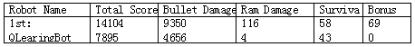

500 个回合与 fire 机器人的战斗结果

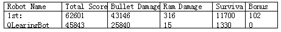

下面是最初的 Q 值、选择动作率、新值、新值与原始值的比较，通过对 Q 表的数据分析，证明了 Q 表在逐渐收敛，并最终使 Q 表收敛到一个稳态，第 498 回合和 499 回合先后两表中各项差的平方和趋近于零。

第一回合

```
Q-value: -2.6121109205097683
Q-value: -0.9225833518300154
Q-value: -1.9101180820403036
Q-value: -1.5324221662755257
Q-value: -1.0267866181848935
Q-value: -1.3407928359453818
P(a|s): 0.050441674598822324
P(a|s): 0.27323856526964685
P(a|s): 0.10177968729898158
P(a|s): 0.14848834415120124
P(a|s): 0.2461994580991779
P(a|s): 0.1798522705821701
Random Number: 0.46314301126269086
Action selected: 3
Reinforcement: -3.0
Old Q-Value: 0.26091702848069354, New Q-Value: -0.1482071760320772,
Different: -0.40912420451277076

```

Show moreShow more icon

第 498 回合

```
Q-value: 0.0
Q-value: 0.0
Q-value: 0.0
Q-value: 0.2457376170002843
Q-value: 0.0
Q-value: 0.0
P(a|s): 0.15927208690906397
P(a|s): 0.15927208690906397
P(a|s): 0.15927208690906397
P(a|s): 0.20363956545468018
P(a|s): 0.15927208690906397
P(a|s): 0.15927208690906397
Random Number: 0.49301116788706556
Action selected: 3
Reinforcement: 0.0
Old Q-Value: 0.0, New Q-Value: 0.022116385530025588,
Different: 0.022116385530025588

```

Show moreShow more icon

第 498 回合

```
Q-value: 0.0
Q-value: 0.0
Q-value: 0.0
Q-value: 0.2457376170002843
Q-value: 0.0
Q-value: 0.0
P(a|s): 0.15927208690906397
P(a|s): 0.15927208690906397
P(a|s): 0.15927208690906397
P(a|s): 0.20363956545468018
P(a|s): 0.15927208690906397
P(a|s): 0.15927208690906397
Random Number: 0.5797587942809831
Action selected: 3
Reinforcement: 0.0
Old Q-Value: 0.2457376170002843, New Q-Value: 0.24328024083028146,
Different: -0.0024573761700028285

```

Show moreShow more icon

## AI-CODE

近来在研究人工智能过程和坦克机器人时，发现国内也开发出了一个类似于 Robocode 仿真器的平台 AI-CODE，其思想延用 Robocode，但在 Robocode 基础上做了很多的改进，封装了一些函数模块，让开发者更侧重于算法和程序设计的学习。最有意思的这个平台能同时支持 Java，C，C++，C# 语言，从理论上看它支持任何语言。美中不足的是国内应用的例子还不是很多，远没有 Robocode 那么多可参考的例子。如果大家有兴趣可尝试在 AI-CODE 平台上用不同语言做一些遗传算法的测试。我想能帮助更多人工智能爱好者。

## 下载源代码

[kevin.zip](https://www.ibm.com/developerworks/cn/java/j-lo-robocode2/kevin.zip): 源代码