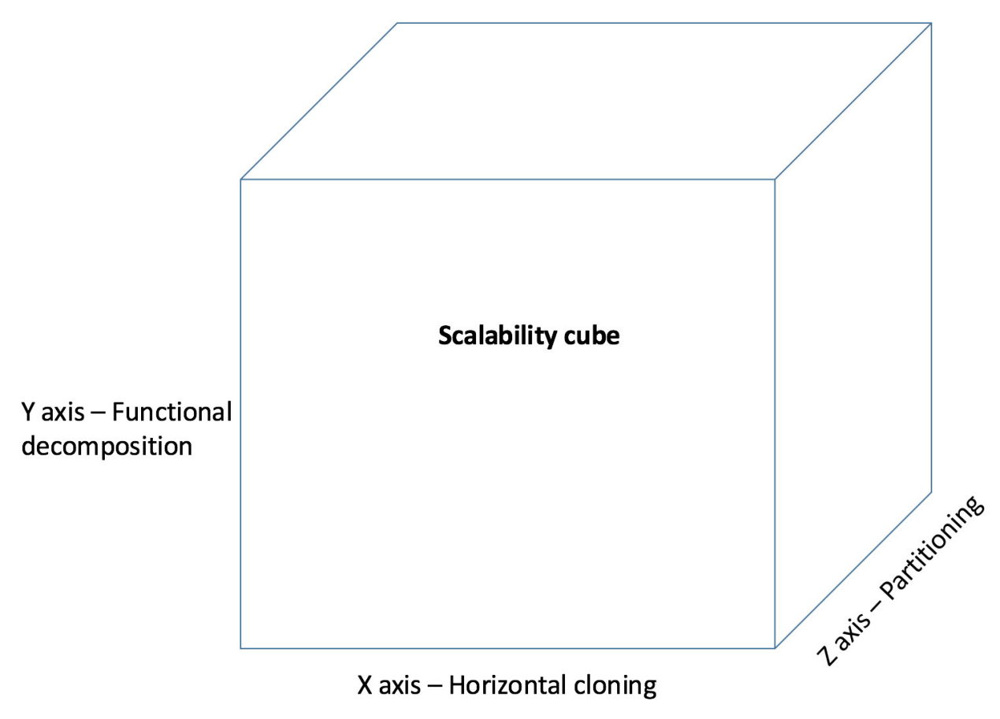
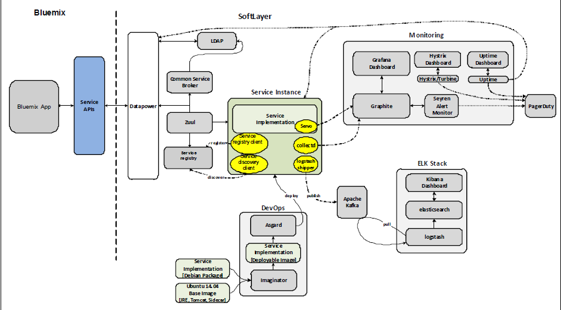
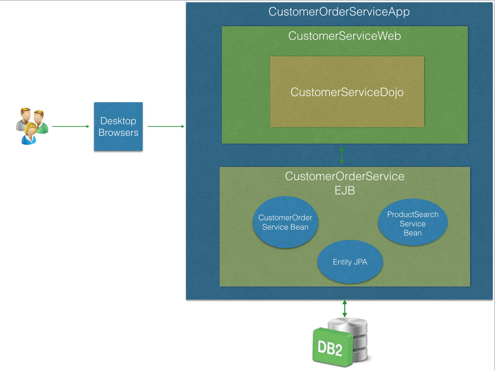

# 微服务
微服务的概念、特征以及采用微服务架构的原因

**标签:** Java,云计算

[原文链接](https://developer.ibm.com/zh/articles/j-cn-java-and-microservice-1st/)

IBM Developer

发布: 2017-01-20

* * *

微服务是一种架构，其中的大型、复杂的软件应用程序由一个或多个更小的服务组成。每个微服务仅负责完成一项代表一种小业务能力的任务。这些微服务可使用任何编程语言开发。本系列内容针对 Java 的微服务最佳实践展开讲解。文中会涉及最新版的 IBM WebSphere® Application Server Liberty、IBM API Connect™、IBM cloud® 和微服务生态系统中的其他开源框架。在阅读本系列时，需要您拥有这些相关知识储备。

## 微服务架构

微服务是相对较小的自主服务，它们合作完成工作。每个服务都实现一种业务需求。

微服务架构是 Martin Fowler 和 James Lewis 定义的一种架构风格。他们将这种风格描述为”一种使用小型服务构建系统的架构方法，每个服务都在自己的进程中，它们通过轻量型协议进行通信”。有关的更多信息，请参阅 Martin Fowler 编写的” [微服务：一个新的架构术语](https://martinfowler.com/articles/microservices.html?cm_mc_uid=34013674245414737751113&cm_mc_sid_50200000=147499071)“。

每个服务都是相互独立开发和部署的。每个微服务都专注执行一个它所擅长的相对较小的任务。

以下各节将重点介绍典型的微服务架构的一些特征，让您大体了解该架构。

### 小型且专注于业务领域

_小_ 并不能充分描述微服务，使用这个词只是为了尝试表明微服务相对于整体式应用程序的大小。在此上下文中，小的定义可能在各个系统中各不相同，而且没有规则来定义服务必须有多小。

微服务通常负责一个精细的工作单元，所以它在规模上相对较小。一条著名的指导原则是”两块披萨的团队规模”方案，意思是说， _如果两块披萨不能将整个团队喂饱，那么这个开发微服务的团队可能太大了。_ 微服务必须足够小，使得团队中的每个人都能理解该服务的整体设计和实现。另外，它的大小必须足以让团队在必要时轻松地维护或重写服务。

微服务的另一个重要特征是，每个服务专注负责一项精细的业务。Vaughn Vernon 在他撰写的图书 _《实现领域驱动设计》_ 中定义了术语 _业务领域_ 。他将业务领域定义为，”某个组织执行的操作和它执行操作的环境。”他还指定，”每个组织都有自己独特的知识范围和操作方式。这个理解范围和它执行操作的方法就是它的领域。”被分解为微服务的单元实际上就是领域内的业务实体，这意味着每个微服务处理完成一个完整的业务任务。例如：Mortgage Services 是一个业务领域。Loan Origination 是该领域中一个可能的微服务。Loan Refinancing 可能是同一个领域中的另一个微服务。跨服务边界的调用和更改通常很耗资源，必须避免。拥有这些服务的团队成为相应业务领域或子领域的专家，而不是任意技术领域的专家。

### 与技术中立

开发微服务的团队必须使用他们熟悉的技术。不要规定开发团队应该使用何种编程语言。让开发人员自由选择对任务最有意义的技术和执行任务的人。这种工作方式能够充分利用团队成员拥有的最佳技术和技能。微服务架构仍需要技术决策；举例而言，使用具象状态传输 (REST) 应用编程接口 (API) 访问更好一些，还是使用某种类型的排队来访问更好一些？但是，一般而言，您可以为微服务架构选择广泛范围内的任何技术。

### 松散耦合

松散耦合对基于微服务的系统至关重要。每个微服务都必须采用使其与其他服务的关联很小的方式来设计接口。这样，在更改一个服务并部署它时，就无需更改和重新部署系统的其他部分。

为了避免服务之间的耦合，必须了解导致紧密耦合的原因。紧密耦合的一个原因是通过 API 公开服务的内部实现。这种公开方式将服务的使用者与它的内部实现绑定在一起，从而导致更高的耦合度。在这种情况下，如果更改微服务的内部架构，可能还需要更改服务的使用者，否则就会破坏使用者。这可能会增加更改的成本，给实现更改带来潜在隐患，进而增加服务中的技术债务。必须避免任何导致公开服务的内部实现的方法，以确保微服务之间松散耦合。

另一个错误是让服务的 API 太过精细。如果 API 太过精细，服务之间的调用可能变得太过 _频繁_ ，也就是说，会通过网络执行更多的调用。除了前缀的性能问题，过度频繁的通信还可能造成紧密耦合。因此，设计服务接口的方式必须能够最大限度地减少网络中执行的来回调用。

必须避免一个服务内的实现过于分散，方法是将表示业务实体的相关属性、行为放在尽可能相近的地方。将相关属性放在一个微服务中；如果更改某个属性或行为，可以在一个位置更改它并快速部署该更改。否则，必须在不同部分中执行更改，然后同时一起部署这些散乱的部分；这会导致这些部门之间紧密耦合。

每个微服务必须有自己的源代码管理存储，以及用于构建和部署的交付管道。这样即可在必要时部署每个服务，而不需要与其他服务的所有者进行协调。如果您有两个服务，而且始终在一次部署中一起发布这两个服务，这可能表明两个服务最好合并为一个服务，而且必须对当前服务执行更多分解工作。松散耦合还支持更频繁、更快速的部署，最终提高应用程序对其用户需求的响应能力。

### 容易观察

微服务架构要求您能够 _可视化_ 系统中所有服务的健康状态，以及它们之间的连接。这使您能快速找到并响应可能发生的问题。实现可视化的工具包含一种全面的日志机制，能够记录日志，存储日志，并使日志容易搜索，以便执行更有效的分析。

向系统中配置和添加的新服务越多，让这些服务变得可观察就会越难。因为在添加更多动态部分时，微服务架构会增加复杂性，所以观察设计必须明确，使可视化的日志和监视数据能为分析提供有帮助的信息。

### 自动化

自动化是有效设计和实现软件应用程序的一个重要要求。对于微服务，自动化是一个至关重要但又充满挑战的任务。除了需要在生产中运行系统之外，微服务架构还向系统的实现引入了更多复杂性。在处理的机器和组件数量较少时，可能可以接受手动配置机器，安装中间件，部署组件，或者手动登录到服务器并收集日志，以及执行其他手动任务。但是，当组件数量增加时，在某个时刻后，您可能无法使用手动方法。

自动化可帮助组建一个服务器并安装必要的运行时环境。然后，只需使用几行代码，就能快速将微服务放在这些运行时环境上。这种自动化使您能编写微结构代码，访问用于部署生产服务的准确的工具链，从而及早发现问题。自动化是连续集成和连续交付方法的核心推动力量。如果您想将微服务架构的复杂性保持在控制范围内，推崇自动化文化是关键。为此，您需要一种综合的、端到端的方法，以便在整个软件开发生命周期中推广自动化。这个生命周期涉及通过一些操作执行测试驱动开发，比如 IBM cloud® Garage Method。有关更多信息，请访问 [网站](https://www.ibm.com/devops/method/) 。

### 有界上下文

开发模型时，请记住识别它的有界上下文，即模型的有效范围。有界上下文是具有明确边界的模型，模型在该边界内是没有歧义的。如果您不在模型周围设置一条边界，最终使用的上下文可能不在您的应用程序内。适合应用程序的某个部分的上下文不得适合另一个部分，即使它们具有相同的名称，而且指向相同的实体。例如，如果您构建一个预约系统，则必须知道客户的基本信息。但是，如果您在账单上下文中有一个账单系统，您可能希望在其中包含客户的联系信息和支付信息，而在预约系统上下文中，不需要该信息。如果您尝试在多个地方重用完全相同的客户模型，可能会在系统中导致不一致的行为。这是一个放入预约系统的上下文中的简单模型，包含一些除客户名称外的行为。

例如，您可能决定在客户模型上包含某种形式的验证，以确保拥有足够的信息来向他们收账。如果您不够小心，验证可能意外地阻止您使用客户模型安排预约；这不是那您想要的行为。账单系统可能要求客户拥有有效的信用卡，然后才能保存更改。但是，如果缺少信用卡信息，则会阻止您将客户预约信息保存到预约系统中，这是不合理的。

在这个示例中，您有两个上下文，但它们之间的边界是模糊和重叠的。Eric Evans 在他撰写的图书 _《领域驱动设计》_ 中说道”模型仅在特定的上下文内有效。因此，最好显式定义应用该模型的上下文。您可以避免损坏该上下文内的模型，将它严格保持在这些边界内，并避免被外部问题分心或混淆。”

当显示定义了有界上下文后，通常能看到您是否拥有一个尝试扩展到多个上下文中的模型元素。在这个示例中，您希望在预约系统中保持简单的客户视图，而在账单上下文中提供包含联系信息和账单信息的更完整的客户视图版本。在两个不同的类中定义客户的这两个视图，然后将它们放在不同的应用程序中。Eric Evans 建议，通过为每个上下文提供它们自己的团队、代码库、数据库模式和交付管道，让有界上下文保持分离。

有界上下文的原则在微服务架构中至关重要。可使用这些原则作为指导，正确地确定系统并将其分解为微服务。明确定义有界上下文（意味着业务领域是通过显式边界分离的），有助于推断系统中最终包含的微服务。拥有有界上下文，还有助于正式化不同服务之间的交互，有效且高效地构建它们之间的接口。

## 采用微服务架构的原因

本节将介绍采用微服务架构的一些主要原因。微服务架构是产品或服务所有者跟上或超越 IT 行业的快速发展节奏的推动因素之一。

### 现有整体式应用程序面临的挑战

在 _整体式应用程序_ 中，大部分逻辑都部署在一个集中化、单一的运行时环境或服务器中，并在其中运行。整体式应用程序通常很大，由一个大型团队或多个团队构建。采用此方法，各个团队需要花更多精力和统筹安排才能执行更改或部署。

随着时间的推移，整体式模型中已引入了更好的架构模式，有助于显著提高架构的灵活性。例如，一种著名的模式是模型-视图-控制器 (MVC)，它将应用程序分解为层和合理的组件。这些模式有多种优点，比如更快的初始开发、更简单的应用程序治理，等等。但是，整体式模型也有缺点，尤其是在当今环境中的技术瞬息万变的背景下。

整体式方法可能带来许多挑战，有以下四点：

1. 庞大的应用程序代码库

    庞大的代码库可能给希望熟悉代码的开发人员带来困扰，尤其是团队的新成员。庞大的应用程序代码库可能还会让应用程序开发过程中使用的开发环境工具和运行时容器不堪重负。最终，这会导致开发人员效率降低，可能会阻止对执行更改的尝试。

2. 不频繁的更新

    在典型的整体式应用程序中，大部分（几乎是全部）逻辑组件都部署在单一运行时容器中，并在其中运行。这意味着要更新对某个组件的一处细微更改，必须重新部署整个应用程序。另外，如果需要推广细微但关键的应用程序更改，则需要投入大量精力来对未更改的部分运行回归测试。这些挑战意味着整体式应用程序很难连续交付，这导致部署次数减少，对需要的更改的响应变慢。

3. 依赖单一类型的技术

    对于整体式模型，由于应用更改方面的挑战，以增量方式采用新技术或技术栈开发框架的新版本会变得很困难。最终，整体式架构应用程序通常必须一直使用这一种技术，这最终会阻碍应用程序跟上新的发展趋势。

4. 可扩展性

    可扩展性是整体式架构面临的最大挑战之一。Martin Abbot 和 Michael Fisher 在他们合著图书 _《可扩展的艺术》_ 中介绍了一种查看系统的可扩展性的有用方式；他们使用了一种三维可扩展性模型或扩展立方体。在此模型中，通过在负载平衡器后运行克隆版本来扩展应用程序称为 X 轴扩展或水平复制。另外两种扩展是 Y 轴扩展（或功能分解）和 Z 轴扩展（或数据分割），Y 轴扩展通过拆分不同实体来实现扩展，Z 轴扩展通过拆分类似实体来实现扩展。由于整体上的凝聚性，典型的整体式应用程序通常只能在扩展立方体的一个维度上扩展。随着生产环境收到更多请求，该应用程序通常采用的垂直扩展方式是添加更多资源供其使用，或者克隆到多个副本来进行响应。这种扩展方式低效且很耗资源。

    当应用程序达到一定规模时，开发团队必须拆分为更小的团队，每个小团队专注于一个特定的功能区域，各团队彼此独立工作，而且通常位于不同地理位置。但是，由于应用程序的各部分间的自然凝聚性，需要各个团队协力执行更改和重新部署。图 1 显示了扩展立方体。

##### 图 1\. 扩展立方体

### 适用于各种涉众的微服务

使用微服务架构的最重要目的是，解决整体式模型面临的难题。本节将从应用程序的不同涉众角度，介绍微服务方法如何帮助解决整体式系统的问题。

#### 对于业务所有者

作为业务所有者，您希望您的服务适用于新客户和业务需求。但是，在整体式模型中，由于庞大的代码库，为满足业务需求而执行并推广更改的过程会很缓慢。这个过程缓慢的另一个原因是，各个组件和层之间有严格的内部限制和依赖关系。

微服务架构原则是围绕高灵活性和恢复能力而建立的。这两个特征有助于快速推广更改。这有助于业务所有者更快地收到反馈，调整业务和投资战略，从而让客户满意和提高市场竞争力。

从资源分配的角度讲，由于团队更小且更专注，所以可以更轻松地测量和可视化效率。然后，业务所有者可以更轻松地制定投资决策，可将资源从低业务影响区域转移到高业务影响区域。

#### 对于服务管理人员

作为服务管理团队成员，您希望协调各个团队的管理操作负担更少，以便您可以提高服务的生产力。整体式模型需要做大量的工作。活动之间需要的协调更多，因为整体式应用程序通常拥有庞大的业务范围，以及许多基础架构和操作接触点。因此，对应用程序的每次更改都可能需要不同涉众多次评审和批准。微服务架构推崇利用自助服务，在服务交付管道的每个阶段利用自动化。

这有助于减少服务管理团队的日常管理协调。

微服务架构中的一个重要原则是高可观察性。高可观察性功能为服务管理团队提供了必要的工具，以便更好地监督系统中或产品中的每个微服务的状态。这有助于提高服务管理效率。

#### 对于开发人员

作为加入团队的新开发人员，您希望快速熟悉源代码，以便快速上手并带来成果。典型整体式应用程序中的代码库很大，可能阻碍您并潜在地延长学习曲线。对于所有开发人员，庞大的代码库会增加载入开发环境中并运行的负担，从而导致生产力降低。

庞大的代码库可能让代码评审和其他合作开发活动面临更大压力。此外，在处理更改时，破坏其他功能的风险可能导致开发人员对创新和增强应用程序犹豫不决。然而，微服务更小且更轻量，这可以缩短新开发人员的学习曲线。微服务还可以帮助消除加载和运行的繁重负担，鼓励引入突破性的更改，从而帮助提高生产力和创新水平。

### 云时代和其他工具准备就绪

本节探讨为什么现在是采用微服务架构的好时机。

#### 云环境和产品的激增

微服务架构体现了使用连续集成和连续部署的许多优势。该架构也引入了新的复杂性，需要一种在构建应用程序的每个步骤中实施自动化的现代方法。例如，从基础架构和治理的角度讲，首先需要一个能动态地快速为服务组建运行时环境的业务连续性基础架构。该环境可能是一个虚拟机、容器等。另外，还需要一种统筹安排和监视服务的高效方式。当今环境中的云平台（比如 IBM cloud）可通过其自然的动态性和恢复能力满足此需求。

借助可用于各种服务模型的不同云产品，无论是基础架构即服务 (IaaS) 还是平台即服务 (PaaS)，开发人员都可以通过更多选择转变为微服务战略。借助 IaaS 选项，您可以在几分钟内快速组建一台机器，而且可以将基础架构配置打包到一组脚本中，以便根据需要自动化该流程。如果您不想接触基础架构级别的复杂性，也可采用平台级选项，采用不同的语言和服务的形式来快速打包，然后根据意愿包含和启动微服务。

IBM cloud 是这些平台的一个示例。IBM cloud 有许多适合使用云技术构建微服务的服务，比如 IBM 容器、消息中心、日志记录、监视和其他技术。IBM cloud 使开发人员能够快速创建、部署和管理他们的云应用程序，为简化操作、确定安全策略和管理系统中微服务的健康提供关键基础。

#### 工具的可用性和成熟性

除了云基础架构可为微服务战略的采用所提供的动态性和恢复能力，拥有全面的工具也是采用微服务战略的关键需求。微服务工具在不断演变和进步。在当今环境中，开发人员有许多选择，他们可以使用一组合适的工具来实施其微服务战略，比如日志工具组合、监视工具组合、服务注册表或容器化技术。这些先进工具可帮助解决微服务架构所引入的挑战，以便更有效地交付、管理和统筹安排服务。

图 2 展示了基于微服务架构而构建的 IBM Watson™ 云服务的完整组合示例。这种革命性架构有云技术、一组全面的工具及敏捷流程提供支持。

##### 图 2\. 支持微服务架构的工具示例

该架构包含多个主要的技术组合：

1. DevOps

    每个 Watson 云服务在开发后，都会在一个不可变的虚拟机中容器化，然后通过明显的 DevOps 流程自动部署到 IBM SoftLayer 云基础架构上。微服务架构的典型模式（比如服务发现、API 网关等）是通过 IBM 独有的和开源的技术来使用的。然后，可以在 IBM cloud 平台上公开这些服务。

2. Elasticsearch、Logstash、Kibana (ELK) 组合或 Elastic 组合

    Elk 组合是该系统的日志工具组合，包含一组工具来捕获日志，并将其存储在一个强大的、集中化的、可搜索的日志数据库中。有关更多信息，请查阅 [elastic 网站](https://www.elastic.co/webinars/introduction-elk-stack) 。

3. 监视工具组合

    图 2 展示了一组工具，它们可从一个中央仪表板监视整个系统，包含一种通知机制，以便基于特定事件来发送提醒。

## 从整体式应用程序向微服务的转变

本节介绍一种将整体式应用程序转变为微服务的实际方案。

### 虚构公司 A 的业务问题

虚构公司 A 是一家电子商务公司，它使用了一个名为 Customer Order Service 的基于 Java EE 的传统 Web 应用程序来提供在线购买服务和运营业务。尽管该应用程序能很好地处理业务，但公司 A 已开始努力响应新的业务需求。这些需求包括：

- 接触使用移动设备的客户
- 基于对客户在互联网上的个人行为的洞察，改善客户体验
- 扩展基础架构，以便处理来自新客户和现有客户的更多请求保持较低的 IT 成本
- 以及其他需求

目前的客户订购服务应用程序的设计不支持在业务领域中执行更改，而且无法应用新技术来加速创新。图 3 介绍了当前的整体式应用程序的逻辑架构概述。

##### 图 3\. 当前的整体式应用程序

公司 A 希望改变客户订单服务应用程序，以便从业务和技术角度促进和更好地处理更改，它拥有一些主要的业务需求：

- 新系统必须是经过进化的，意味着它必须能灵活地处理更改。
- 在将流量从当前系统转移到新构建的系统的过程中，不允许宕机。
- 新应用程序必须能基于发送给系统的有效负载来按需或自动扩展，以便应对动态的购物行为模式。
- 新系统必须支持利用新兴技术来促进创新。

### 采用微服务来实现一种革命性架构

采用微服务架构的主要动机是，解决很难更改的传统整体式架构的问题。微服务方法支持对架构的每个组成部分执行更改。对于业务需求，公司 A 非常适合在构建新系统时采用微服务架构。

公司 A 应用最佳实践和模式将现有的整体式应用程序转变为更加革命性的架构，以期最终将应用程序迁移到微服务架构上。

执行以下主要步骤和活动：

1. 演化战略

    要拥有一种转型案例分析中的整体式应用程序的合适战略，必须发现和考虑不同的模式和建议实践。

2. 识别要转变为微服务的候选功能

    在这一步中，选择应用程序的相对较小的组件或功能片段。从这些功能片段，可配置新微服务来让这些片段更有利于经常或渐进式的更改。

3. 数据访问模式

    因为数据是 IT 系统中最重要的资产，所以一个关键步骤是在转变为微服务架构的过程中采取正确的数据访问方法。

4. 安全和治理

    “安全和治理”将介绍如何在更加分布式的新模型中管理应用程序的组件，以及如何处理安全挑战。

5. 性能和可扩展性

    解决整体式应用程序的可扩展性问题时，微服务架构（拥有更多分布式特征）带来了性能挑战。

6. DevOps 和自动化

    自动化是让微服务方法成为可能的推动因素。

## 结束语

本文作为 Java 和微服务的第一部分，重点介绍了微服务的重要概念、特征以及它为何对现代软件应用程序的开发如此有吸引力的原因。最后，通过一个示例简单的描述了从整体应用程序向微服务的转变。目前为止，相信您已经对微服务有一个初步的了解。下一部分将更深入的介绍如何在 Java 中创建微服务。好了，学习愉快，下次再见！