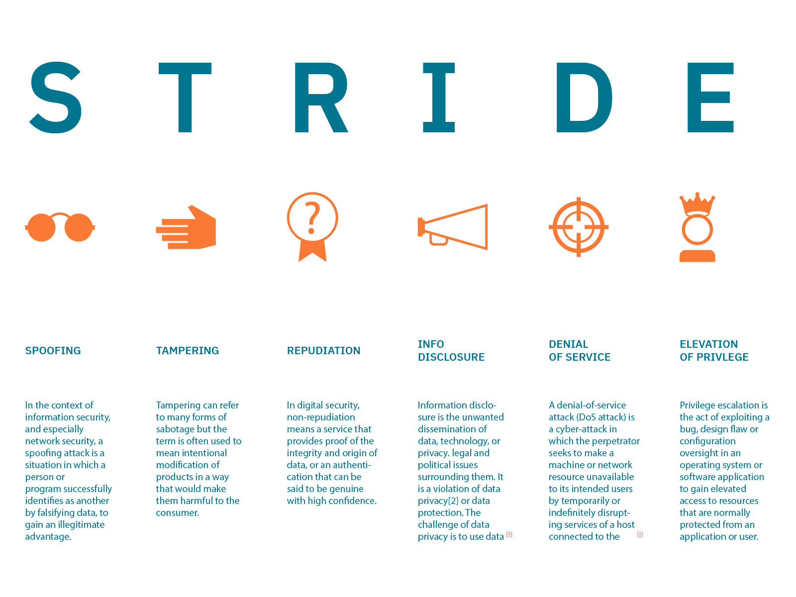
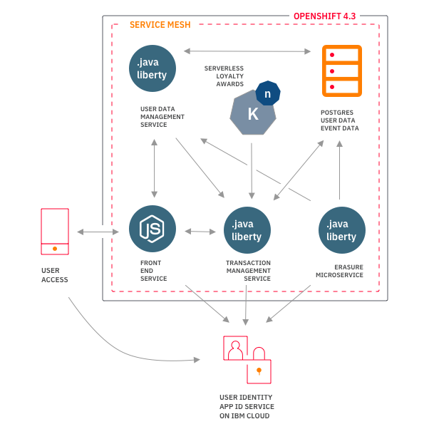
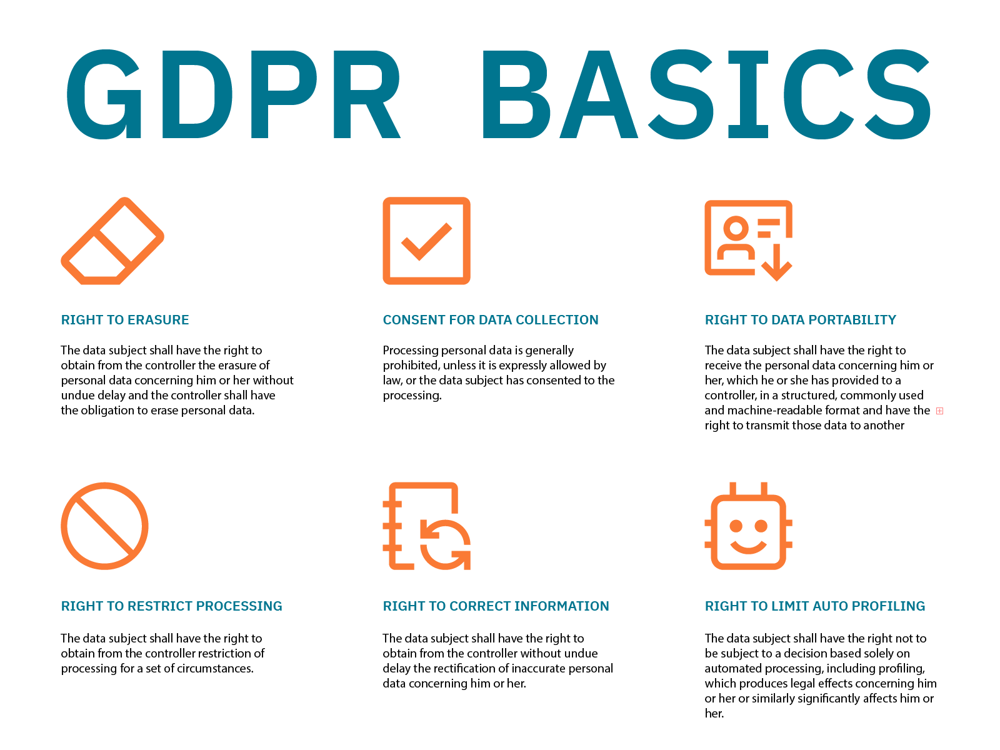
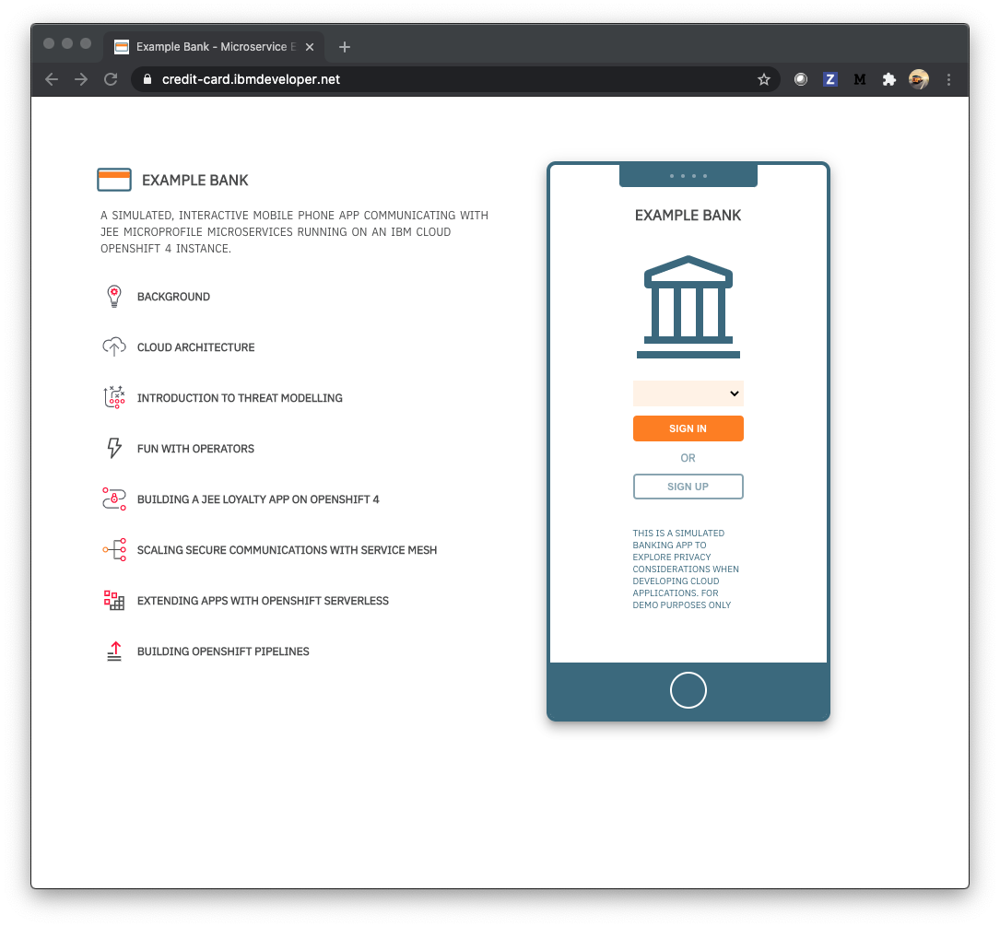
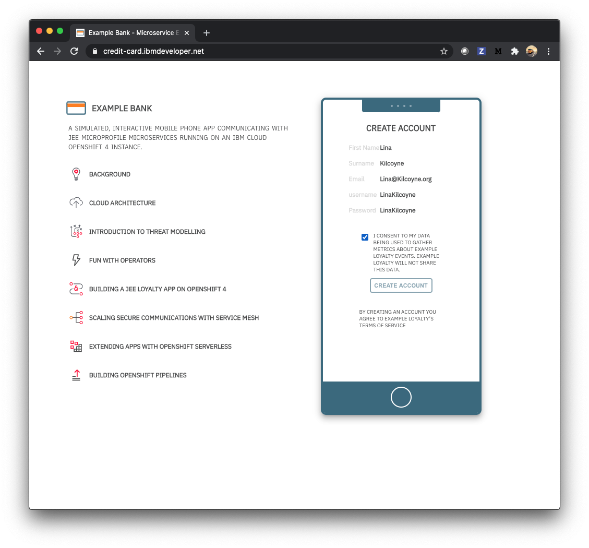
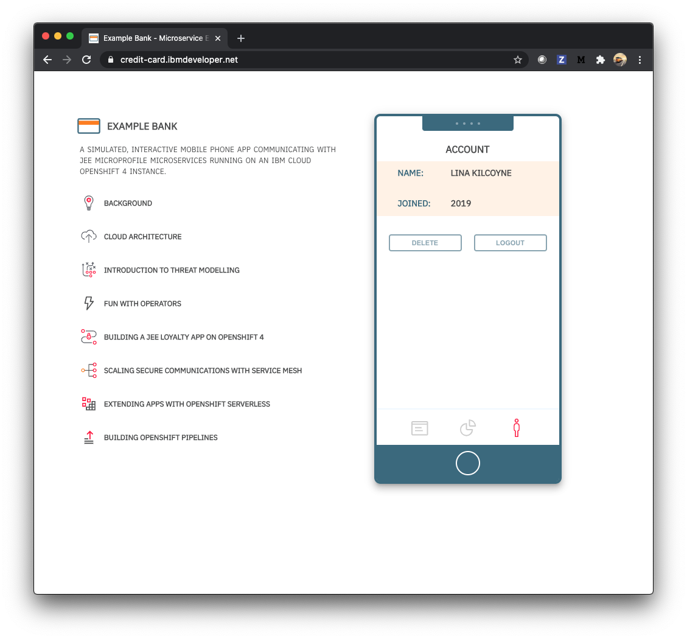

# 微服务架构环境中的威胁建模
关于隐私性和安全性设计的入门思想

**标签:** Kubernetes,Red Hat OpenShift on IBM Cloud,容器,微服务,金融

[原文链接](https://developer.ibm.com/zh/articles/threat-modeling-microservices-openshift-4/)

Anton McConville

发布: 2020-08-26

* * *

如果数据隐私性和安全性是可以直接轻松即时地内置到应用程序中的特性，那么就不会有数据泄露或侵犯数据隐私的事件发生。

事实是，软件系统的安全性没有万灵药。但是，一些 [强大的构建块](https://blog.openshift.com/introducing-red-hat-openshift-4-3-to-enhance-kubernetes-security/) 和良好的安全习惯可以帮助从根本上减轻威胁。

本文将示例应用程序整个生命周期中的隐私和安全视为设计的一部分。具体来说，我概述了威胁建模的概念，并讨论了我的团队将安全性构建到我们称为 Example Bank 的移动应用程序中的过程。

## 背景

今年早些时候，我的团队开始处理针对我们的一个移动应用的功能请求，它要求存储个人信息。在该应用的第一个版本中，我们完全避免了存储个人信息，目的是简化其中的责任。如果要为该功能请求实施解决方案，我们就需要了解实际执行哪些操作才能构建一个能够很好地处理隐私性和安全性的应用版本。

在 [Example Bank 应用](https://developer.ibm.com/zh/blogs/build-secure-applications-with-openshift-4-public-cloud/) 中，我们的后端完全基于云，它在 Kubernetes 上运行，而数据库服务在 IBM Cloud 上运行。

和许多其他应用一样，我们的移动应用最初只是一个很小的概念，然后仓促组建了一个小团队，以尽可能快的速度构建了出来。团队中没有安全专家。因此，这个功能请求迫使我们更深入地了解云原生安全性。

在 IBM，我们拥有能以更可控的方式来保护敏感数据的构建流程、人员和机制。尽管我们的团队可以查阅所有这些资源，但我想了解为初创企业构建安全的私有云原生应用是什么样子。

去年年底，我在 KubeCon 大会上听了一场非常有趣的演讲，使我了解了 [威胁建模](https://en.wikipedia.org/wiki/Threat_model) 的概念以及非常有用的 [STRIDE 方法论](https://en.wikipedia.org/wiki/Threat_model#STRIDE_methodology)，STRIDE 是考虑系统可能面临的威胁的缩写和框架。

## 使用 STRIDE 进行威胁建模

威胁建模是一个流程，通过这个流程可以发现和列举潜在威胁、漏洞或缺乏防护措施的情况。然后可以对缓解措施划分优先级。

威胁建模的目的是，根据系统的性质、可能攻击者的个人资料、最可能的攻击向量以及攻击者最希望得到的资产，为防御者分析需要采用哪些控制措施或防御措施。

最近，我们都在现实生活中获得了威胁建模的第一手经验，因为学会了如何在大流行病中生存下来。我们找出来自其他人或接触表面的感染威胁，或找出感染其他人的威胁。然后想出阻止这些威胁的方法，包括保持社交距离、勤洗手、戴口罩。对我们的每一次互动进行思考和评估，判断是否存在来自病毒的威胁。这就是威胁建模的一个例子。

软件系统中的威胁建模也是类似的概念。无论是来自数字病毒还是数字攻击，我们都需要对威胁进行思考，并找到保护系统的方法。STRIDE 方法论要求我们考虑六个威胁领域，以此来帮助完成威胁建模的过程。我在本节的最上方绘制了图表来描述该方法论。

我们来思考一下移动应用软件架构可能面临的威胁。

## 我们的示例云原生应用程序的威胁建模

这是 Example Bank 信用卡应用程序的基本云架构。

运行中的应用在一个域上使用 HTTPS，该域被定向到了在 [Red Hat® OpenShift® on IBM Cloud™](https://cloud.ibm.com/docs/openshift?topic=openshift-getting-started&cm_sp=ibmdev-_-developer-articles-_-cloudreg) 上运行的托管微服务。出于测试目的，用户可以使用生成的名称来创建帐户（通过 IBM App ID）。然后，当用户单击应用的主页按钮后，就可以点击其中的各种应用图标来创建信用卡交易。

为支持该功能，我们的云软件使用了三个微服务。更多详细信息，您可以 [阅读有关移动应用架构的内容](https://developer.ibm.com/zh/patterns/privacy-backend-loyalty-app-openshift-4/)。

作为练习，思考用于此类系统的 STRIDE 威胁模型的不同元素，以及阻止威胁的一些初始想法。以下清单并不详尽，只是我们为用例确定的一组起始选项。

### [身份假冒](https://en.wikipedia.org/wiki/Spoofing_attack)

_在信息安全（尤其是网络安全）领域，身份假冒攻击是指某个人或程序伪造数据以获得非法优势，从而成功地将自己标识为另一个人或程序。_

要阻止这类威胁，可考虑以下建议：

- 通过可信任的来源提供移动应用，例如 Apple App Store、Google Play Store 或公认的安全域（参见 [IBM Domain Name Services](https://www.ibm.com/ca-en/marketplace/dns)）。
- 使用行业标准身份验证协议，例如 [IBM Cloud App ID](https://www.ibm.com/cn-zh/cloud/app-id)。
- 选择拥有政府最高认证级别的云提供商（参见 [IBM Cloud 安全性](https://www.ibm.com/cloud/security)）。

### 篡改

_篡改是指多种形式的人为破坏活动，但该术语通常表示以对用户有害的方式对产品进行有意图的修改。_

要阻止这类威胁，可考虑以下建议：

- 使用符合联邦信息处理标准 (FIPS) 的加密容器平台进行构建，例如 [Red Hat OpenShift 4.3](https://blog.openshift.com/introducing-red-hat-openshift-4-3-to-enhance-kubernetes-security/)。
- 扫描代码中的漏洞，例如使用 [IBM AppScan](https://www.ibm.com/garage/method/practices/manage/tool_ibm_security_appscan/)。

### [抵赖](https://en.wikipedia.org/wiki/Non-repudiation)

_在数字安全领域，不可抵赖性是指提供数据完整性和数据来源证明的服务，或是被确定为真实且具有高可信度的身份验证。_

要阻止这类威胁，可考虑以下建议：

- 使用可靠且功能齐全的日志记录服务，例如 [IBM Log Analysis With LogDNA](https://www.ibm.com/cloud/log-analysis)。

### [信息泄露](https://en.wikipedia.org/wiki/Information_privacy)

_信息泄露是对数据技术或隐私不受欢迎的传播。有一些法律和政治问题需要考虑。信息泄露是对数据隐私或数据保护的侵犯。确保数据隐私的挑战是，在使用数据的同时保护个人隐私偏好及其个人身份信息。_

要阻止这些类型的威胁，可考虑以下建议：

- 妥善管理安全证书并帮助加密数据传输，例如通过 [IBM Certificate Manager](https://www.ibm.com/cloud/certificate-manager)。
- 基于 FIPS 批准的加密平台，例如 [Red Hat OpenShift 4.3](https://blog.openshift.com/introducing-red-hat-openshift-4-3-to-enhance-kubernetes-security/)。
- 利用托管有强大的企业安全静态加密功能的数据库，例如 [IBM Cloud Databases for PostgresSQL](https://www.ibm.com/cloud/databases-for-postgresql)。
- 使用 [IBM Key Protect](https://www.ibm.com/cloud/key-protect) 保护加密密钥。

### [拒绝服务](https://en.wikipedia.org/wiki/Denial-of-service_attack)

_绝服务攻击（有时称为 DoS 攻击）是一种网络攻击，犯罪者试图通过暂时或无限期地中断连接到互联网的主机的服务，使其目标用户无法使用计算机或网络资源。_

要阻止这些类型的威胁，可考虑以下建议：

- 使用可靠的公共云托管工具，例如我们示例中使用的 [IBM Cloud Internet Services](https://www.ibm.com/cloud/cloud-internet-services)。
- 考虑限制速率。

### [特权提升](https://en.wikipedia.org/wiki/Privilege_escalation)

_特权提升是指利用操作系统或软件应用程序中的错误、设计缺陷或配置疏忽来提升对通常受应用程序或用户保护的资源的访问权限的行为。_

关于特权有多个层面需要考虑，包括数据库管理、端点管理和容器管理，而且管理这些层面的方法也有很多。考虑在以下特权层面上对抗威胁的方法：

- 在容器层面，您可以 [通过 Red Hat OpenShift 使用基于角色的访问控制](https://docs.openshift.com/enterprise/3.0/admin_guide/manage_scc.html)。
- 在微服务内部的安全层面，您可以使用 [Red Hat OpenShift 服务网格](https://istio.io/docs/concepts/security/)。
- 在管理密码和帐户层面，您可以使用 [IBM Security Secret Server](https://www.ibm.com/ca-en/marketplace/secret-server)。

本文及其清单并非旨在成为保护应用安全的权威指南。目的只是提供一个示例，说明威胁建模的工作原理，以及一些有助于阻止威胁的解决方案。

## GDPR 和从设计源头保障数据隐私

通用数据保护条例 (GDPR) 是欧盟的一项法规，旨在帮助用户掌控企业对其个人数据的使用方式。GDPR 自 2018 年 5 月 28 日开始实施，违反 GDPR 需要缴纳企业年收入的 4% 或 2,000 万英镑的罚款，以数额较大者为准。

只有保证数据是安全的才能对其实施保护，这就是当您在 [从设计源头保障数据隐私](https://gdpr-info.eu/issues/privacy-by-design/) 时 GDPR 与安全性密切相关的原因。除了 GDPR 带来的财务影响外，数据泄露还可能使用户受到现实影响。

引用一下 GDPR“从设计源头保障数据隐私”的原文：

_“从设计源头保障数据隐私”这句话的意思是“通过技术设计保护数据”。其背后的理念是，从数据处理流程创建之初就融入数据保护措施才能发挥最大作用。_

我非常喜欢在设计应用时后退一步的想法，试着对软件系统的安全威胁进行建模，对系统中滥用个人数据所带来的威胁进行建模。

在示例银行应用中，我们内置了一些探索性的 UI，用于通过实际操作展示一些隐私概念。

这是一个虚拟银行的模拟移动应用程序。您可以登录该应用程序并模拟信用卡交易。

用户创建帐户时，将选中一个复选框以表示 [同意](https://gdpr-info.eu/issues/consent/)。

在帐户视图中，用户可以 [删除](https://gdpr-info.eu/art-17-gdpr/) 数据，这个操作会匿名化跟踪数据，从而允许将其用于分析，但不与任何一个用户产生联系。

还有一些其他方面我们希望通过用户界面来阐明，例如 [处理限制权限](https://gdpr-info.eu/art-18-gdpr/) 和 [自动个人决策/配置文件](https://gdpr-info.eu/art-22-gdpr/)。

在创建应用时，为数据管理的所有这些方面设计 API 和控件非常重要。您可以参考我们如何为示例银行应用创建这些 API。

## 结束语

本文展示了隐私性和安全性是示例应用程序整个生命周期中的设计考虑因素。希望您现在能了解威胁建模的工作原理，以及使用STRIDE威胁模型创建安全应用程序的不同方式。您可以在 [通过移动银行应用的后端来关注数据隐私](https://developer.ibm.com/zh/patterns/privacy-backend-loyalty-app-openshift-4/) Code Pattern 中看看我们如何将这些概念付诸实践。

## 后续步骤

使用以下内容中的开源代码和说明，了解我们使用 OpenShift 4.3 构建安全的 Example Bank 云应用程序所遵循的步骤：

- **博客**： [使用 OpenShift 4.3 在公有云上构建安全的应用程序](https://developer.ibm.com/zh/blogs/build-secure-applications-with-openshift-4-public-cloud/)。
- **文章**： [OpenShift 4 简介](https://developer.ibm.com/zh/articles/intro-to-openshift-4/)。
- **教程**： [玩转 OperatorHub](https://developer.ibm.com/tutorials/operator-hub-openshift-4-operators-ibm-cloud/)。
- **Code Pattern**： [通过移动银行应用的后端来关注数据隐私](https://developer.ibm.com/zh/patterns/privacy-backend-loyalty-app-openshift-4/)。
- **Code Pattern**： [使用 OpenShift 服务网格的微服务](https://developer.ibm.com/patterns/microservices-with-the-openshift-service-mesh/)。
- **教程**： [使用 OpenShift Serverless Operator 构建无服务器 Node.js 应用程序](https://developer.ibm.com/tutorials/build-serverless-nodejs-applications-with-the-openshift-serverless-operator/)。
- **教程**： [构建 Tekton Pipeline 以将移动应用后端部署到 OpenShift 4](https://developer.ibm.com/tutorials/tekton-pipeline-deploy-a-mobile-app-backend-openshift-4/)。

本文翻译自： [Threat modeling in the context of microservice architectures](https://developer.ibm.com/articles/threat-modeling-microservices-openshift-4/)（2020-08-04）